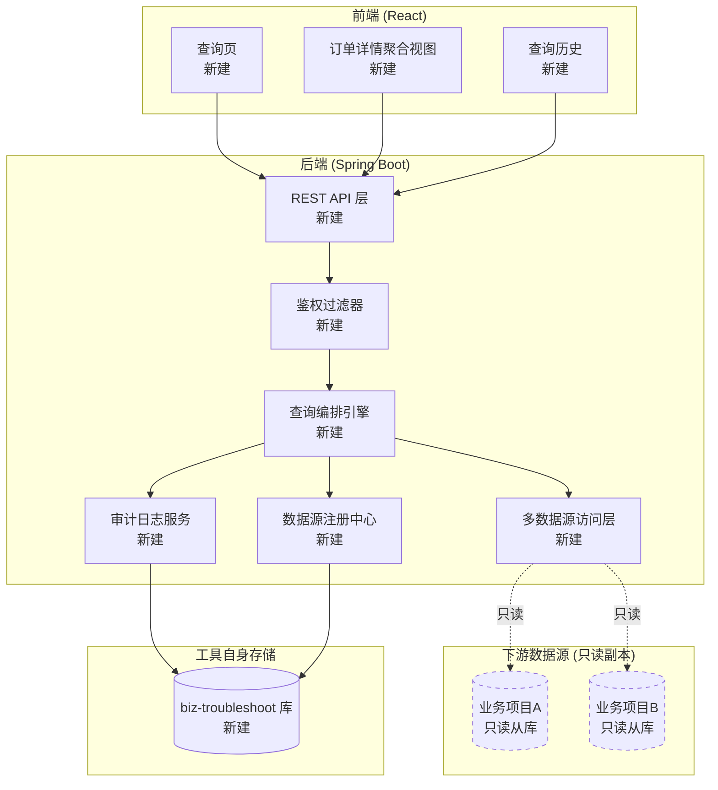
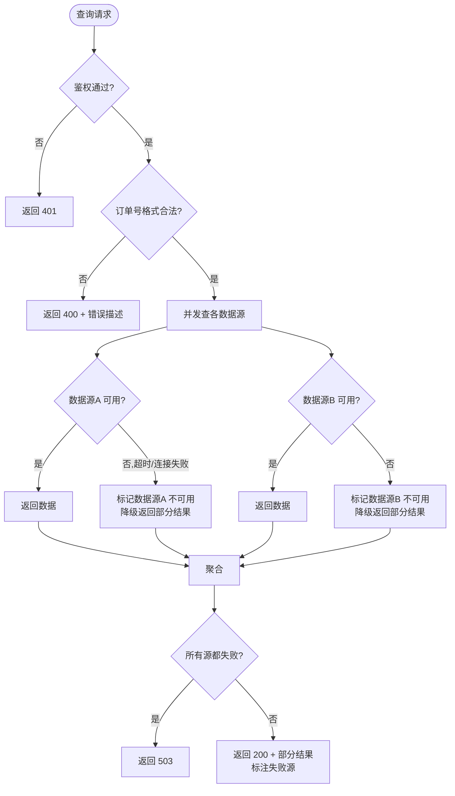
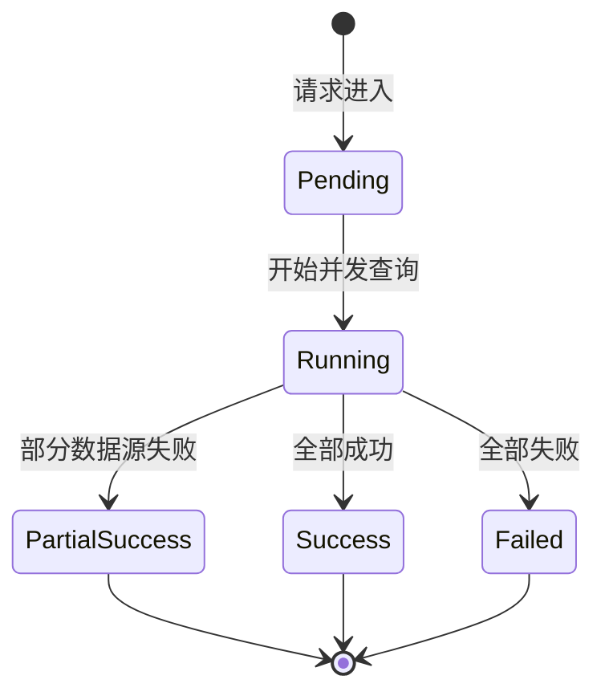
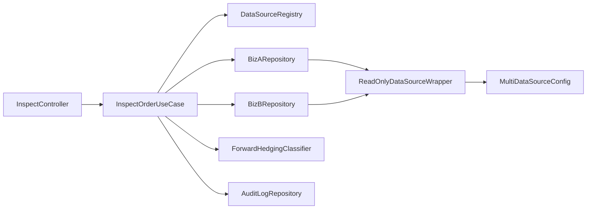

# 业务排查工具（biz-troubleshoot）功能设计文档

> **草稿状态**：本版由 AI 基于初次需求沟通生成，含若干 `[待确认]` 占位项，需用户补全后再视为可执行版本。
> **存放位置**：用户文档目录草稿，不计入项目 `docs/`；终版由用户决定是否上传。

## 变更记录

| 版本 | 日期       | 修改人 | 变更内容摘要 |
|------|------------|--------|-------------|
| v1   | 2026-05-01 | AI 草稿 | 初始版本：确立工具定位、数据接入方式（直连只读副本）、MVP 范围（1-2 个核心业务项目） |

---

## 1. 基本信息

- 功能名称：业务排查工具（biz-troubleshoot）
- 所属系统：独立运维支持工具（不嵌入任何业务系统）
- 所属模块：—（独立项目）
- 需求来源：后端开发日常排查需求 — 通过订单号一键定位订单在各业务库中的正向 / 对冲落库情况，确认数据完整性
- 负责人：[待确认 — 张凯？]
- 版本号：v1

## 2. 背景与目标

### 2.1 背景

当前公司多个业务系统（订单、支付、退款、对账等）数据分散落库于不同 MySQL 实例的不同库表中。日常排查一个订单的完整生命周期，开发需要：
- 翻阅每个业务系统的代码定位"该订单在哪张表"
- 手动登录多个数据库 / 跳板机执行 SQL
- 自行拼接"正向数据"（订单创建 / 支付成功）与"对冲数据"（退款 / 冲正 / 撤销）的关联关系
- 整理结果给业务方 / 客服 / 财务

排查耗时高且容易遗漏数据，缺乏统一入口。

### 2.2 问题

| 痛点 | 影响 |
|------|------|
| 数据源分散 | 单次排查需访问 N 个数据库 |
| 缺乏统一关联视图 | 正向、对冲数据手工对照，易遗漏 |
| 无审计 | 谁查了哪个订单无记录 |
| 重复劳动 | 同类排查每次都要重写 SQL |

### 2.3 目标

1. **一站式排查入口**：输入订单号（或可扩展为商户号、流水号），一键展示该订单在所有接入业务库中的完整数据快照。
2. **正向 / 对冲分类聚合**：自动按数据语义分类，标注落库 / 缺失状态。
3. **只读、安全、可审计**：所有查询操作有日志，仅连接只读副本，禁止任何写操作。
4. **可扩展**：新增一个业务项目数据源，应可通过配置 + 少量映射代码完成接入，不动核心查询引擎。

### 2.4 设计边界

- **不做**：数据修复 / 补单 / 任何写入操作
- **不做**：替代现有 BI / 报表系统的统计聚合需求
- **不做**：实时数据订阅（CDC / binlog 监听）
- **本期 MVP 不做**：跨订单关联（如商户维度批量分析）、移动端适配、多语言

---

## 3. 功能范围

### 3.1 功能模块总览图



> 虚线 = 已存在的业务库（只读接入），实线 = 本次新建。

### 3.2 能力分解图

```mermaid
mindmap
  root((biz-troubleshoot))
    查询入口
      订单号查询
      可扩展查询键（商户号/流水号/[待确认]）
    数据聚合
      正向数据展示
      对冲数据展示
      落库完整性检查
      缺失项高亮
    数据源管理
      数据源注册
      连接池管理
      健康检查
      字段映射配置
    审计与安全
      查询日志
      操作人记录
      敏感字段脱敏
      只读强约束
    扩展机制
      新业务项目接入流程
      映射规则热更新（[待确认]）
```

### 3.3 功能范围说明

**本次包含（MVP）：**
- 通过订单号查询 1-2 个业务项目（具体项目名 [待确认]）的正向 + 对冲数据
- 简单的查询历史记录
- 基础登录鉴权（账密 + JWT，[待确认 是否对接公司 SSO]）

**本次不包含：**
- 多维度查询（商户号、用户号、时间范围等批量查询）
- 数据修复 / 补单
- 实时数据订阅
- 高级权限模型（RBAC、字段级权限）

**后续扩展：**
- 接入更多业务项目（3+）
- 增加查询键类型
- 字段级权限控制
- 排查场景模板（"退款链路核对"、"对账缺失定位"等预设场景）

---

## 4. 业务流程设计

### 4.1 正常流程：通过订单号查询

```mermaid
flowchart TD
    A([用户输入订单号]) --> B[前端调用 /api/inspect/order]
    B --> C[AuthFilter 校验 JWT]
    C -->|通过| D[Orchestrator 接收请求]
    D --> E[读取 SourceRegistry<br/>获取所有启用的数据源]
    E --> F{并发查询每个数据源}
    F --> G1[查询数据源A<br/>正向表 + 对冲表]
    F --> G2[查询数据源B<br/>正向表 + 对冲表]
    G1 --> H[结果归一化为统一 DTO]
    G2 --> H
    H --> I[按"正向/对冲"分类聚合]
    I --> J[计算完整性标记<br/>缺失项高亮]
    J --> K[写审计日志<br/>异步]
    J --> L[返回聚合结果]
    L --> M([前端渲染])
    K -.异步.-> M
```

### 4.2 异常流程



### 4.3 状态流转

> 本工具是只读查询，不涉及实体状态机。每次查询的"任务"对象状态如下（用于审计/排队场景，可选实现）：



---

## 5. 接口设计

### 5.1 接口清单

| 编号 | 方法 | 路径 | 用途 |
|------|------|------|------|
| 1 | POST | `/api/auth/login` | 登录获取 JWT |
| 2 | POST | `/api/inspect/order` | 按订单号查询完整数据 |
| 3 | GET  | `/api/sources` | 列出已注册的数据源 |
| 4 | GET  | `/api/audit/my` | 我的查询历史 |

> 详细字段表此处暂略，编码阶段在 coding.md 中展开。

### 5.2 请求参数（核心接口）

`POST /api/inspect/order`

| 字段 | 类型 | 必填 | 说明 |
|------|------|------|------|
| `orderNo` | string | 是 | 订单号 |
| `sources` | string[] | 否 | 指定查询的数据源 code，留空则查全部 |
| `includeRaw` | boolean | 否 | 是否返回各业务库原始字段（默认 false，只返归一化字段） |

### 5.3 返回参数

```json
{
  "code": 0,
  "data": {
    "orderNo": "ORD202605010001",
    "queriedAt": "2026-05-01T10:00:00+08:00",
    "sources": [
      {
        "sourceCode": "biz-a",
        "status": "SUCCESS",
        "forward": [ { "table": "...", "row": { ... } } ],
        "hedging": [ { "table": "...", "row": { ... } } ],
        "missing": []
      }
    ],
    "summary": {
      "forwardCount": 2,
      "hedgingCount": 1,
      "missingCount": 0
    }
  }
}
```

### 5.4 错误码设计

| code | 含义 |
|------|------|
| 0 | 成功 |
| 40001 | 订单号格式不合法 |
| 40101 | 未登录 / Token 失效 |
| 40301 | 无权访问该数据源 |
| 50301 | 所有数据源均不可用 |
| 50001 | 服务器内部错误 |

### 5.5 请求示例

```http
POST /api/inspect/order
Content-Type: application/json
Authorization: Bearer eyJhbGc...

{
  "orderNo": "ORD202605010001"
}
```

成功响应见 5.3。

---

## 6. 类设计

> 包名占位：`com.kpay.biztroubleshoot`（[待确认]，待用户确认公司根包后替换）

### 6.1 分层设计

| 层 | 包前缀 | 职责 |
|----|--------|------|
| Web 层 | `com.kpay.biztroubleshoot.web` | REST Controller、参数校验、鉴权过滤器 |
| 应用层 | `com.kpay.biztroubleshoot.app` | 用例编排（Orchestrator） |
| 领域层 | `com.kpay.biztroubleshoot.domain` | 数据源注册、归一化模型、查询规则 |
| 基础设施层 | `com.kpay.biztroubleshoot.infra` | 多数据源连接、各业务库 Repository、审计落库 |

### 6.2 核心类清单

| 全路径 | 类型 | 变更 | 一句话职责 |
|--------|------|------|-----------|
| `com.kpay.biztroubleshoot.web.InspectController` | Controller | 新增 | 接收订单查询请求 |
| `com.kpay.biztroubleshoot.web.AuthController` | Controller | 新增 | 登录与 Token 颁发 |
| `com.kpay.biztroubleshoot.web.SourceController` | Controller | 新增 | 列出数据源 |
| `com.kpay.biztroubleshoot.web.AuditController` | Controller | 新增 | 查询历史 |
| `com.kpay.biztroubleshoot.web.filter.JwtAuthFilter` | Filter | 新增 | JWT 校验 |
| `com.kpay.biztroubleshoot.app.InspectOrderUseCase` | Service | 新增 | 编排：分发查询、归并、审计 |
| `com.kpay.biztroubleshoot.app.AuditUseCase` | Service | 新增 | 审计日志写入与查询 |
| `com.kpay.biztroubleshoot.domain.source.DataSourceRegistry` | Domain | 新增 | 启用的数据源元信息 |
| `com.kpay.biztroubleshoot.domain.model.OrderInspectionResult` | Domain | 新增 | 归一化聚合结果 |
| `com.kpay.biztroubleshoot.domain.model.SourceQueryResult` | Domain | 新增 | 单源查询结果 |
| `com.kpay.biztroubleshoot.domain.classify.ForwardHedgingClassifier` | Domain | 新增 | 正向/对冲分类规则 |
| `com.kpay.biztroubleshoot.infra.ds.MultiDataSourceConfig` | Config | 新增 | 多数据源 Bean 配置（HikariCP × N） |
| `com.kpay.biztroubleshoot.infra.ds.ReadOnlyDataSourceWrapper` | Infra | 新增 | 只读包装：拦截写 SQL |
| `com.kpay.biztroubleshoot.infra.repository.BizARepository` | Repository | 新增 | 业务项目A 数据访问（[待确认 项目名]） |
| `com.kpay.biztroubleshoot.infra.repository.BizBRepository` | Repository | 新增 | 业务项目B 数据访问（[待确认 项目名]） |
| `com.kpay.biztroubleshoot.infra.audit.AuditLogRepository` | Repository | 新增 | 工具自身审计表读写 |

### 6.3 类调用关系



---

## 7. 数据库设计

### 7.1 表设计（工具自身库 `biz_troubleshoot`）

| 表名 | 用途 |
|------|------|
| `bt_user` | 工具用户表（若不接 SSO） |
| `bt_data_source` | 数据源注册表 |
| `bt_audit_log` | 查询审计日志 |
| `bt_query_template` | 排查模板（后续扩展用，本期可不建） |

> 各业务库结构 **不属于本工具设计范围**，仅做只读访问。

### 7.2 字段说明（关键表）

**bt_audit_log**

| 字段 | 类型 | 说明 |
|------|------|------|
| `id` | BIGINT | 主键 |
| `user_id` | BIGINT | 操作人 |
| `query_key_type` | VARCHAR(32) | 查询键类型：`ORDER_NO` / ... |
| `query_key_value` | VARCHAR(128) | 查询键值（敏感字段脱敏后） |
| `source_codes` | VARCHAR(255) | 命中的数据源 code 列表 |
| `result_summary` | VARCHAR(255) | 命中数 / 缺失数概要 |
| `cost_ms` | INT | 耗时 |
| `client_ip` | VARCHAR(64) | 来源 IP |
| `created_at` | DATETIME | 时间 |

**bt_data_source**

| 字段 | 类型 | 说明 |
|------|------|------|
| `id` | BIGINT | 主键 |
| `code` | VARCHAR(64) | 唯一编码（biz-a / biz-b） |
| `display_name` | VARCHAR(128) | 显示名 |
| `jdbc_url` | VARCHAR(255) | 只读副本 JDBC URL |
| `username` | VARCHAR(64) | 只读账号 |
| `password_cipher` | VARCHAR(255) | 加密后的密码 |
| `enabled` | TINYINT(1) | 是否启用 |
| `created_at` | DATETIME | |
| `updated_at` | DATETIME | |

### 7.3 索引设计

- `bt_audit_log`: `idx_user_created (user_id, created_at)`、`idx_query (query_key_type, query_key_value)`
- `bt_data_source`: `uk_code (code)`

### 7.4 一致性设计

- 工具自身库使用单实例 MySQL，无强一致性诉求。
- 各业务库使用 **从库**，存在主从延迟（通常 < 1s），需在前端提示"数据来源为只读副本，可能存在秒级延迟"。

### 7.5 数据量预估

- 审计日志：估每天 200 次查询 × 200B ≈ 40KB/day，年 < 20MB，无分表压力。
- 数据源表：< 100 行。

---

## 8. 核心业务规则

### 8.1 正向数据 vs 对冲数据（通用占位定义，待用户补全）

> ⚠️ 以下为 AI 提供的通用语义占位，用户需根据公司业务实际定义补全。

| 类型 | 通用定义 | 典型表/事件示例（占位） |
|------|---------|------------------------|
| **正向数据** | 订单生命周期中"产生价值流入/服务履约"的事件落库 | 订单创建表、订单支付成功表、订单完成表 |
| **对冲数据** | 订单生命周期中"产生反向流出/抵消正向"的事件落库 | 退款单表、冲正记录表、撤销记录表、坏账核销表 |

[待用户补全]：
- 业务项目A 中 哪些表 / 哪些事件类型 属于"正向"，哪些属于"对冲"
- 是否存在第三类（如"中间态"、"待结算"）需要单独展示
- 不同业务项目对正向 / 对冲的定义是否一致？若不一致如何统一展示语义

### 8.2 完整性判定规则

对每个数据源，定义"该订单在此源应当存在哪些表的记录"。例如：

- 业务A 的订单：必须存在 `t_order` 一条；若有支付，存在 `t_payment` 一条；若有退款，存在 `t_refund` 至少一条。
- 缺失任一应存在的记录 → 标记为 `MISSING`，前端高亮。
- 这个规则集 **存在于代码中**（`ForwardHedgingClassifier` + 各 `BizXRepository`）。

### 8.3 查询键合法性

- 订单号格式：[待确认 — 是否有统一前缀 / 长度规范]
- 非法订单号直接返回 400，不下发到任何数据源。

### 8.4 只读强约束

- `ReadOnlyDataSourceWrapper` 在执行前检查 SQL，禁止任何 `INSERT`/`UPDATE`/`DELETE`/`TRUNCATE`/`ALTER`/`DROP`/`CREATE`/`GRANT`。
- 数据库账号本身在从库上仅授予 `SELECT` 权限（DBA 配合）。
- 双保险，任一被绕过都不会污染数据。

---

## 9. 事务与并发控制

- 工具自身库的写操作：仅 `bt_audit_log` 与 `bt_data_source` 维护，事务边界在 Service 层方法。
- 业务库查询：严格只读，无事务诉求。
- 并发：每次查询在后端开 N 个并行任务（每个数据源一个），使用 `CompletableFuture` + 限时（默认每源 3s）。

## 10. 缓存设计

- 本期 **不做查询结果缓存**（排查工具核心诉求是看实时落库情况，缓存反而误导）。
- 数据源元信息（`bt_data_source`）可在内存做小范围缓存，TTL 1 分钟。

## 11. 消息与异步设计

- 审计日志异步落库（`@Async`），失败重试 1 次后吃掉异常，不阻塞主流程。
- 不引入 MQ。

## 12. 下游依赖设计

```mermaid
graph TD
    Tool[biz-troubleshoot] -->|JDBC 只读| BizA[(业务项目A 从库)]
    Tool -->|JDBC 只读| BizB[(业务项目B 从库)]
    Tool -->|JDBC 读写| Self[(biz-troubleshoot 库)]
    Tool -.->|可选| SSO[公司 SSO/[待确认]]
```

- 业务项目A 从库 JDBC URL：[待确认]
- 业务项目B 从库 JDBC URL：[待确认]
- 公司是否有统一 SSO 可对接：[待确认]

---

## 13. 安全设计

| 维度 | 措施 |
|------|------|
| 认证 | JWT（Access 30min + Refresh 7d），或对接公司 SSO（待定） |
| 授权 | 本期单一角色（开发自用），后续可按"数据源粒度"加权限 |
| 敏感字段 | 手机号、身份证、银行卡号等返回时自动脱敏（注解 `@MaskField`） |
| 数据源凭证 | DB 密码以 AES-256 加密存储于 `bt_data_source.password_cipher`，密钥走环境变量 |
| 审计 | 所有查询入审计表，包括失败查询 |
| 网络 | 部署在内网，只读账号 + 防火墙白名单 |
| 防 SQL 注入 | 全部使用 PreparedStatement（MyBatis 占位符 / JdbcTemplate 参数化） |

## 14. 日志与监控设计

- 日志：JSON 结构化日志（traceId、userId、orderNo、sourceCode、costMs、status）。
- 监控：埋点上报每个数据源的 RT、错误率（[待确认]：是否对接公司 Prometheus/Grafana）。
- 告警：单数据源 5 分钟错误率 > 50% 触发告警（[待确认]）。

## 15. 异常处理设计

- 全局 `@RestControllerAdvice` 兜底，统一错误码格式。
- 单数据源失败 ≠ 整体失败，降级返回部分结果 + 标注。
- 所有异常打印 stack trace 到日志，但不返回给前端。

## 16. 测试要点

- 单测：`ForwardHedgingClassifier`、`ReadOnlyDataSourceWrapper`（重点验 SQL 拦截）
- 集成测试：用 H2 / TestContainers 模拟 2 个业务库
- 压测：单查询 < 1s（P95），并发 50 不崩
- 安全测试：手工尝试构造写 SQL，验证拦截

## 17. 上线与回滚方案

- 部署：单实例 Spring Boot Jar + Nginx 反代前端（或一体化打包）
- 数据库迁移：Flyway 管理工具自身库 DDL
- 回滚：纯回滚 Jar 即可（工具不污染业务数据）

## 18. 风险点与待确认事项

### 18.1 待用户确认（阻塞 v1 落地）

1. **公司根包名**（默认占位 `com.kpay.biztroubleshoot`）
2. **第一期接入的两个业务项目具体名称**（用于 BizARepository / BizBRepository 命名 + 数据源 code）
3. **正向 / 对冲数据的具体业务定义**（见 §8.1）
4. **从库 JDBC 信息获取渠道**（找 DBA 申请只读账号？是否已有现成账号？）
5. **鉴权方式**：自建账密 vs 公司 SSO
6. **订单号格式规范**（是否统一前缀 / 长度）
7. **是否需要对接公司监控体系**（Prometheus / Grafana / 公司告警平台）

### 18.2 设计已识别的风险

| 风险 | 影响 | 缓解 |
|------|------|------|
| 主从延迟 | 刚落库的数据查不到 | 前端文案提示 + 查询时间戳显示 |
| 业务库表结构变更 | 工具查询失败 | 集成测试 + Repository 层代码与业务方版本约定 |
| 只读包装被绕过 | 数据污染 | DBA 层只读账号 + 应用层 SQL 拦截双保险 |
| 数据源连接耗尽 | 整工具不可用 | HikariCP 每源独立连接池，限制最大连接数 |
| 敏感数据外泄 | 合规风险 | 字段脱敏 + 审计日志 + 内网部署 |

---

## 附录 A：项目结构建议（供 coding.md 阶段细化）

```
biz-troubleshoot/
├── biz-troubleshoot-server/        # Spring Boot 后端
│   ├── src/main/java/com/kpay/biztroubleshoot/
│   │   ├── BizTroubleshootApplication.java
│   │   ├── web/
│   │   ├── app/
│   │   ├── domain/
│   │   └── infra/
│   ├── src/main/resources/
│   │   ├── application.yml
│   │   └── db/migration/           # Flyway
│   └── pom.xml
├── biz-troubleshoot-web/           # React 前端
│   ├── src/
│   │   ├── pages/
│   │   ├── api/
│   │   └── components/
│   ├── package.json
│   └── vite.config.ts
└── README.md
```

技术栈建议：
- 后端：Spring Boot 3.x + Java 17 + MyBatis-Plus + HikariCP × N + Flyway + JJWT
- 前端：React 18 + Vite + TypeScript + Ant Design + axios + React Query

---

> **下一步动作**
>
> 1. 用户审阅本草稿，重点补全 §18.1 列出的 7 项 `[待确认]`
> 2. 草稿确认后升级为 v2（或直接定稿 v1），路径仍在用户文档目录
> 3. 用户决定是否将终版上传到项目 `docs/design/biz-troubleshoot/` 或自行管理
> 4. 进入第四步：生成 `-coding.md`（编码摘要文档），完成后才能开第一行实现代码
