<div align="center">

# 🗺️ Java 八股 · 速记版 · 知识点全景图

**1301 题** · **23 个类目** · 按"主题聚类 + 关联关系"重组的视觉地图

</div>

> 题号引用形如 `#0150`，对应 `01_Java基础/0150_Java中有哪些锁.md`。
> 渲染建议：VS Code Markdown Preview / Obsidian / Typora。GitHub 也支持大部分。
>
> 🆚 **配套文档**：[全景图-速记版.md](./全景图-速记版.md) —— 同结构 + 节点直接挂速记（约 220 题），适合背题。
> 本文（current）适合"我要找题"——节点带 `#题号` 索引，便于回到源文件深读。

---

## 🌐 全景大图

```mermaid
flowchart TB
    classDef base   fill:#fde68a,stroke:#b45309,color:#111
    classDef mid    fill:#bbf7d0,stroke:#15803d,color:#111
    classDef store  fill:#bae6fd,stroke:#0369a1,color:#111
    classDef dist   fill:#ddd6fe,stroke:#6d28d9,color:#111
    classDef plat   fill:#fbcfe8,stroke:#9d174d,color:#111
    classDef app    fill:#e5e7eb,stroke:#374151,color:#111

    subgraph L1["🧱 基石层"]
        direction LR
        A01["🧬 01 Java基础<br/>243 题"]
        A02["🧠 02 JVM<br/>63 题"]
        A03["🧵 03 并发<br/>92 题"]
    end
    subgraph L2["🌱 框架与中间件层"]
        direction LR
        A04["🌱 04 Spring<br/>96 题"]
        A06["🔴 06 Redis<br/>74 题"]
        A07["📨 07 MQ<br/>51 题"]
        A12["🧰 12 其他中间件<br/>51 题"]
    end
    subgraph L3["🐬 存储层"]
        direction LR
        A05["🐬 05 MySQL<br/>153 题"]
        A11["🗂️ 11 分库分表<br/>24 题"]
    end
    subgraph L4["🌐 分布式协作层"]
        direction LR
        A08["🌐 08 微服务<br/>58 题"]
        A09["💱 09 分布式事务<br/>25 题"]
        A10["🔑 10 锁/ID<br/>43 题"]
        A14["🏛️ 14 系统设计<br/>26 题"]
    end
    subgraph L5["📡 平台层"]
        direction LR
        A13["📡 13 网络OS<br/>68 题"]
        A17["🧮 17 算法<br/>27 题"]
        A16["🔥 16 性能调优<br/>34 题"]
    end
    subgraph L6["🎯 应用 & 软实力"]
        direction LR
        A15["🎯 15 业务<br/>61"]
        A18["🤖 18 AI<br/>30"]
        A20["⏰ 20 调度<br/>11"]
        A21["📊 21 Excel<br/>6"]
        A22["📋 22 面经<br/>61"]
        A23["💬 23 软技能<br/>13"]
        A19["🛠️ 19 工具<br/>21"]
    end

    L1 --> L2 --> L3 --> L4 --> L5 --> L6

    class A01,A02,A03 base
    class A04,A06,A07,A12 mid
    class A05,A11 store
    class A08,A09,A10,A14 dist
    class A13,A17,A16 plat
    class A15,A18,A20,A21,A22,A23,A19 app
```

---

## 📦 23 类目卡片墙

<table>
<tr>
<td width="25%" align="center" valign="top">

### 🧬 01
**Java 基础**<br/>
**243** 题<br/>
<sub>语言根基</sub>

</td>
<td width="25%" align="center" valign="top">

### 🧠 02
**JVM**<br/>
**63** 题<br/>
<sub>运行时内核</sub>

</td>
<td width="25%" align="center" valign="top">

### 🧵 03
**并发编程**<br/>
**92** 题<br/>
<sub>线程·锁·JUC</sub>

</td>
<td width="25%" align="center" valign="top">

### 🌱 04
**Spring 体系**<br/>
**96** 题<br/>
<sub>IoC·AOP·事务</sub>

</td>
</tr>
<tr>
<td align="center" valign="top">

### 🐬 05
**MySQL**<br/>
**153** 题<br/>
<sub>索引·事务·调优</sub>

</td>
<td align="center" valign="top">

### 🔴 06
**Redis**<br/>
**74** 题<br/>
<sub>结构·持久化·集群</sub>

</td>
<td align="center" valign="top">

### 📨 07
**消息队列**<br/>
**51** 题<br/>
<sub>Kafka·Rocket·Rabbit</sub>

</td>
<td align="center" valign="top">

### 🌐 08
**微服务**<br/>
**58** 题<br/>
<sub>治理·限流·熔断</sub>

</td>
</tr>
<tr>
<td align="center" valign="top">

### 💱 09
**分布式事务**<br/>
**25** 题<br/>
<sub>2PC·TCC·Seata</sub>

</td>
<td align="center" valign="top">

### 🔑 10
**分布式锁/ID**<br/>
**43** 题<br/>
<sub>Redisson·雪花</sub>

</td>
<td align="center" valign="top">

### 🗂️ 11
**分库分表**<br/>
**24** 题<br/>
<sub>分片·分页·迁移</sub>

</td>
<td align="center" valign="top">

### 🧰 12
**其他中间件**<br/>
**51** 题<br/>
<sub>ES·ZK·Netty</sub>

</td>
</tr>
<tr>
<td align="center" valign="top">

### 📡 13
**网络与 OS**<br/>
**68** 题<br/>
<sub>TCP·HTTP·IO 模型</sub>

</td>
<td align="center" valign="top">

### 🏛️ 14
**系统设计**<br/>
**26** 题<br/>
<sub>CAP·BASE·容量</sub>

</td>
<td align="center" valign="top">

### 🎯 15
**业务场景**<br/>
**61** 题<br/>
<sub>秒杀·库存·排行榜</sub>

</td>
<td align="center" valign="top">

### 🔥 16
**性能调优**<br/>
**34** 题<br/>
<sub>OOM·CPU·慢SQL</sub>

</td>
</tr>
<tr>
<td align="center" valign="top">

### 🧮 17
**算法**<br/>
**27** 题<br/>
<sub>树·堆·海量数据</sub>

</td>
<td align="center" valign="top">

### 🤖 18
**AI 与大模型**<br/>
**30** 题<br/>
<sub>LLM·Agent·MCP</sub>

</td>
<td align="center" valign="top">

### 🛠️ 19
**工具与工程**<br/>
**21** 题<br/>
<sub>Git·Maven·IDEA</sub>

</td>
<td align="center" valign="top">

### ⏰ 20
**任务调度**<br/>
**11** 题<br/>
<sub>XXL·扫表·时间轮</sub>

</td>
</tr>
<tr>
<td align="center" valign="top">

### 📊 21
**Excel/文件**<br/>
**6** 题<br/>
<sub>EasyExcel·POI</sub>

</td>
<td align="center" valign="top">

### 📋 22
**面经**<br/>
**61** 题<br/>
<sub>项目经历模板</sub>

</td>
<td align="center" valign="top">

### 💬 23
**软技能**<br/>
**13** 题<br/>
<sub>反问·自评·规划</sub>

</td>
<td align="center" valign="top">

<sub>───────────</sub><br/>
<sub>合计 **1301** 题</sub><br/>
<sub>───────────</sub>

</td>
</tr>
</table>

---

## 🌉 跨类目主题桥梁

> 这些主题贯穿多个类目，是面试官"串题"的高频路径。每条桥梁画一张"主题之河"。

### 🔒 锁 —— 单机锁的所有概念，分布式化后整套重来

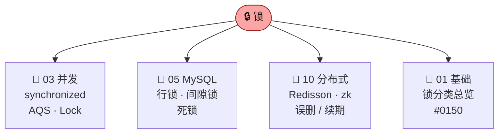

### 🌀 缓存一致性 —— 一种问题，四个角度同时出题

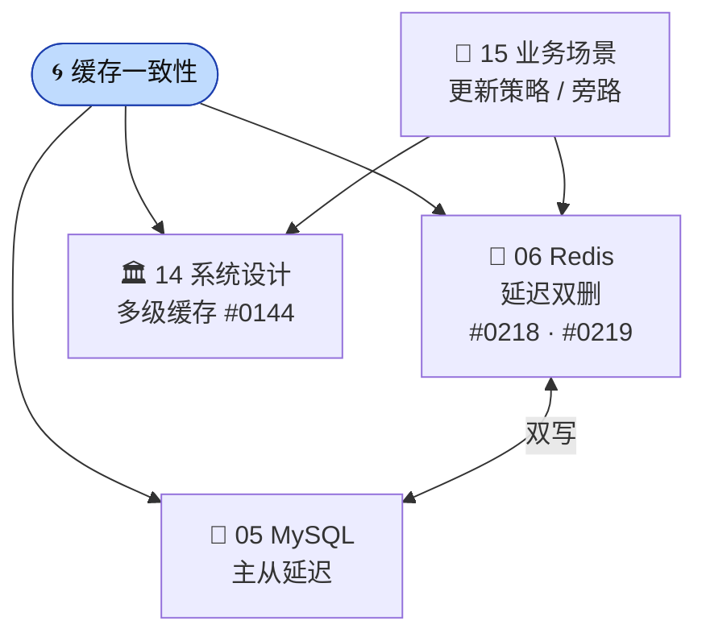

### 🚮 GC / STW —— 从算法到生产排障


### ⚖️ CAP / 一致性 —— 理论到工程

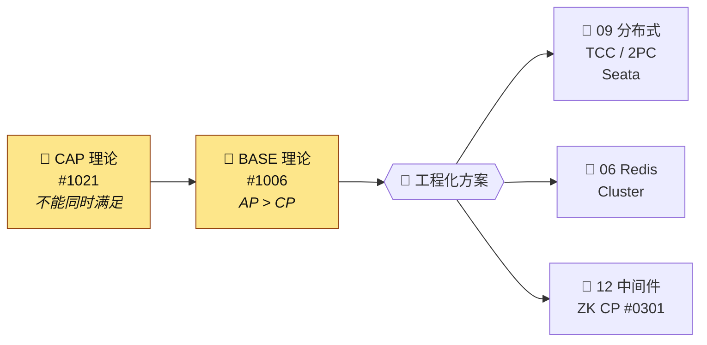

### 🚦 限流·熔断·降级·隔离 —— 雪崩防御四件套

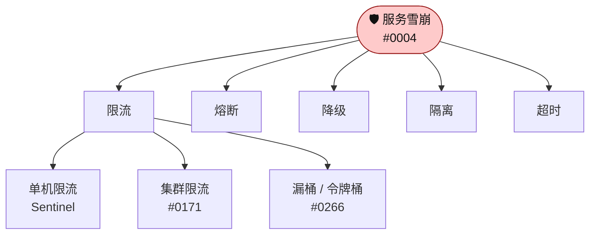

### 🆔 分布式 ID —— 跨三个类目的必答题

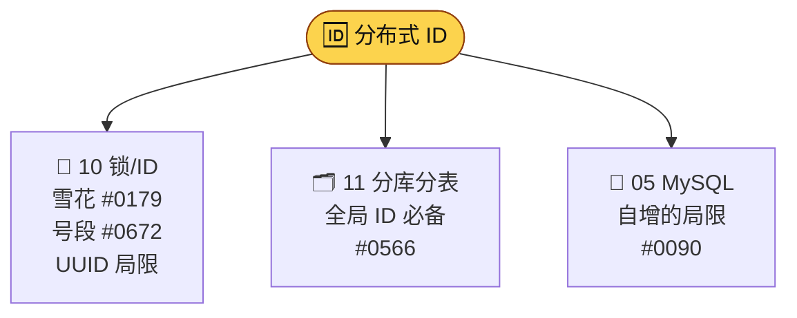

### ⚡ 零拷贝 —— 一个内核机制，三处工业应用

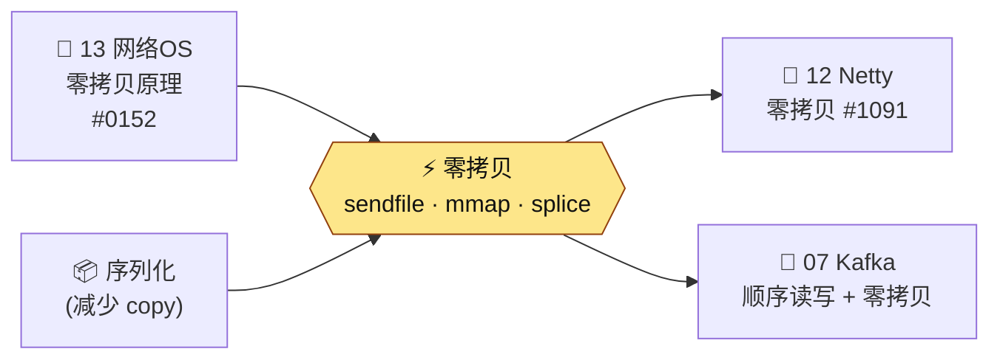

### ⚛️ CAS / 原子性 —— 从语言到硬件

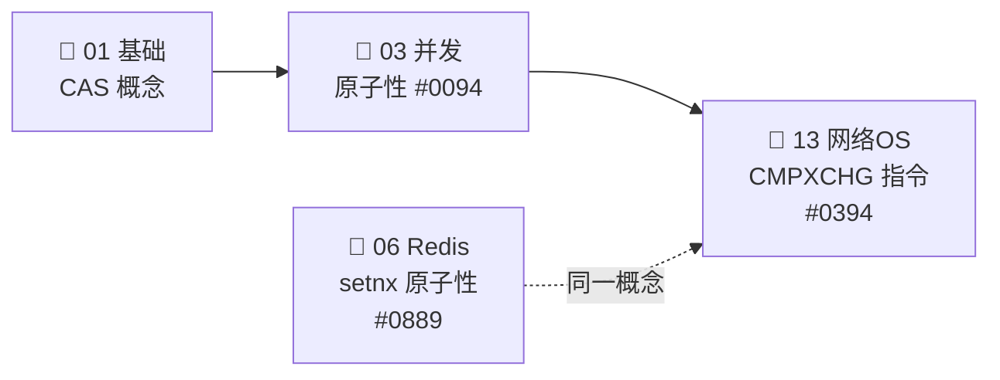

### 🧵 线程池 —— 一组参数 + 三类应用

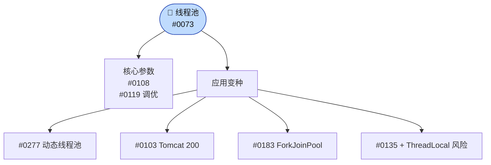

### 📦 序列化 —— 一处定义，处处出题

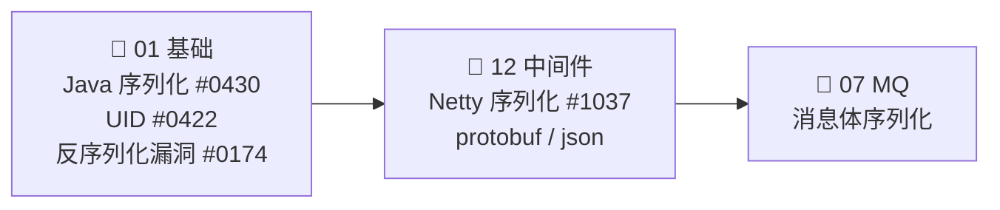

---

<div align="center">

## ─────── ⬇️ 23 个类目逐一展开 ⬇️ ───────

</div>

---

<div align="center">

## 🧬 01 · Java 基础

**243 题** · 浅-中难度 · 语言层 + 标准库的根基

</div>

<table>
<tr>
<td width="50%" valign="top">

#### 🧬 类型系统与值

- **基本类型 vs 包装类**　`#0058` `#1058`
- **Integer 缓存 ±127** `#0180`
- **String 不可变性** `#0429` `#0987`
- **String 长度限制** `#0961` · **intern** `#0415`
- **`a+="b"`陷阱** `#0974` · **`new String("x")`** `#0975`
- **StringBuilder/Buffer/String** `#1001`
- **JDK9 字符串拼接优化** `#0708`
- **值传递 vs 引用传递** `#0377`
- **BigDecimal 金额** `#0356` `#1018` `#1031` `#1046`
- **char vs varchar** `#1122` · **负数绝对值** `#1017`

</td>
<td width="50%" valign="top">

#### 🏛️ 面向对象

- **接口 vs 抽象类** `#0051`
- **不支持多继承（菱形）** `#0052`
- **多态 / 重写 / 重载** `#1059`
- **面向对象 vs 面向过程** `#0245`
- **内部类（含匿名）**
- **组合 vs 继承** `#0404`
- **`equals` 与 `hashCode`** `#0358`
- **自实现 String.equals** `#0209`

</td>
</tr>
<tr>
<td valign="top">

#### 🗂️ 集合框架

- **ArrayList/LinkedList/Vector** `#0231`
- **subList 注意事项** `#0232`
- **ArrayList 序列化** `#0269`
- **List 排序方式** `#0188` · **遍历中改** `#1013`
- **HashMap 结构** `#0268` · **转红黑树** `#0898`
- **hash 算法** `#0881` · **容量 2^n** `#0235`
- **负载因子 0.75** `#0924` · **扩容** `#0909`
- **容量该多大** `#0908` · **get/put** `#0950`
- **remove** `#0857` · **JDK 1.8 改动** `#0267`
- **HashMap 并发问题** `#0804`
- **Set 去重原理** `#1014` · **冲突解决** `#0233`

</td>
<td valign="top">

#### 🔀 并发与锁（基础视角）

- **Java 锁的种类大全** `#0150`
- **Thread.sleep(0)** `#0056`
- **5 个线程顺序执行** `#0350`
- **死循环 CPU 100%** `#0785`
- **1 vs 10 线程读 1000 文件** `#0787`
- **子线程异常 try-catch** `#0694`

</td>
</tr>
<tr>
<td valign="top">

#### ⏫ JDK 新特性

- **Lambda 实现** `#0927`
- **Stream API** `#0778` · **并行流** `#0858`
- **并行流不一定更快** `#0722`
- **JDK 最新版** `#0107` · **新特性** `#0137`
- **JDK 11 GC** `#0949`
- **JDK 15 废弃偏向锁** `#0735`
- **平台无关** `#0254` `#0791`
- **语法糖大全** `#0926`

</td>
<td valign="top">

#### 🪞 反射 / 注解 / SPI

- **类加载时机** `#0923` · **生命周期** `#0937`
- **反射与封装是否矛盾** `#0695`
- **反射改 private 字段** `#0355`
- **SPI vs API** `#0871`
- **自定义注解 + 切面** `#1206`
- **统计方法调用** `#0776`
- **编译 vs 反编译** `#0701`
- **main 为啥 public static void** `#0363`

</td>
</tr>
<tr>
<td valign="top">

#### ⚠️ 异常体系

- **Checked vs Unchecked** `#0406`
- **try-catch-finally return 谁胜** `#0395`
- **finally 一定执行吗** `#0396`
- **异常代码识别** `#0405`
- **不要用异常控制流程** `#0224`
- **final/finally/finalize** `#0383`

</td>
<td valign="top">

#### 📡 IO / NIO / 序列化

- **BIO/NIO/AIO** `#0376`
- **write vs fsync** `#0275`
- **Java 序列化原理** `#0430`
- **serialVersionUID 用途** `#0422`
- **Fastjson 反序列化漏洞** `#0174`

</td>
</tr>
<tr>
<td valign="top">

#### 🧩 设计模式

- **单例多种写法** `#0427` · **破坏单例** `#0428`
- **枚举单例最佳** `#0419` · **枚举特点** `#0384`
- **工厂模式三种** `#0402`
- **享元模式** `#0391` · **不可变模式** `#0392`
- **String 用到的模式** `#0380`
- **深拷贝 vs 浅拷贝** `#0365`
- **DDD 概念** `#0679` `#0680`

</td>
<td valign="top">

#### 🧪 泛型与编译

- **泛型作用** `#0911`
- **K T V E Object 含义** `#0900`
- **类型擦除** `#0901`
- **extends vs super** `#0885`

</td>
</tr>
</table>

#### 🔗 关联关系

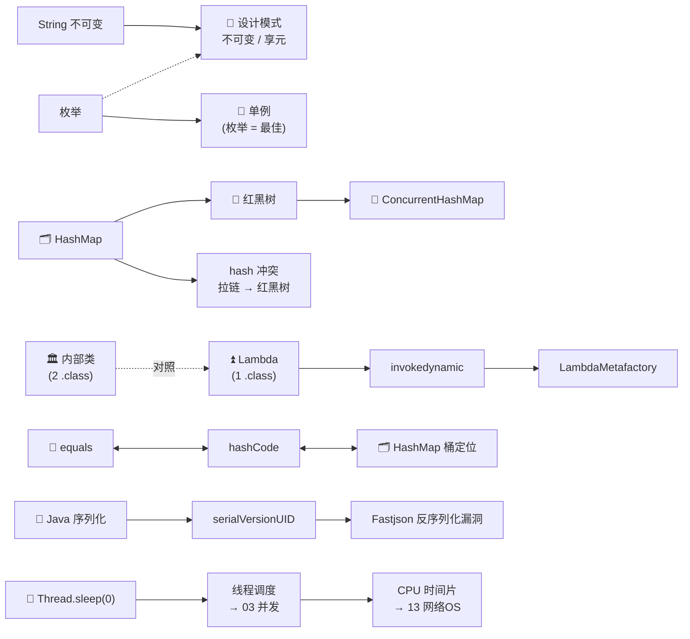

#### 🌉 跨类目桥梁

| 题在本类目但属于 → | 题号 |
|---|---|
| 05 MySQL | `#0210` `#0213` `#0291` `#0313` `#0345` `#0866` `#0993` `#0730` `#1153` `#1008` `#1183` `#1198` |
| 06 Redis / 14 系统设计 | `#0335` `#0185` `#0962` `#0799` |
| 14 系统设计 | `#0963` `#0977` `#1285` `#1089` |
| 17 算法 | `#0039` `#1176`（LRU 实现）`#0910`（红黑树） |
| 10 分布式 ID | `#0090`（UUID vs 自增） |

---

<div align="center">

## 🧠 02 · JVM

**63 题** · 中-深难度 · 运行时内核：内存·类加载·GC

</div>

<table>
<tr>
<td width="50%" valign="top">

#### 🧠 内存结构

- **运行时内存区域** `#0259`
- **新生代结构** Eden+2 Survivor `#0261`
- **对象一定在堆？** 逃逸分析 `#0257`
- **进程内存组成** `#0832`

</td>
<td width="50%" valign="top">

#### 📚 类加载

- **加载过程** `#0041`
- **双亲委派 + 破坏** `#0302`
- **永久代 vs 元空间** `#0057`
- **元空间溢出** `#0348`

</td>
</tr>
<tr>
<td valign="top">

#### 🚮 GC 算法

- **三色标记** `#0155`
- **STW 时机** `#0803`
- **GC 算法总览** `#0198`
- **对象存活判断** `#0252`
- **新老代 GC 算法** `#0197`

</td>
<td valign="top">

#### 🚛 垃圾回收器

- **G1 Region** `#0012` · **G1 默认** `#0109`
- **G1 控 STW** `#0110`
- **ZGC 特点** `#0147`
- **ZGC vs CMS vs G1** `#0148`
- **G1 vs CMS** `#0149`
- **JDK 8 vs 11 GC** `#0949`

</td>
</tr>
<tr>
<td valign="top">

#### 🔧 调优 & 工具

- **4C8G 100w 调优** `#0096`
- **调优工具集合** `#0145`
- **jstat** `#0390` · **jmap** `#0411`
- **javap** `#0401` · **jhat** `#0087`
- **FullGC 频率正常范围** `#0314`

</td>
<td valign="top">

#### ⚡ JIT / AOT

- **AOT vs JIT** `#0088`
- **同代码不同 JDK 结果不同** `#0375`

</td>
</tr>
</table>

#### 🔗 关联关系

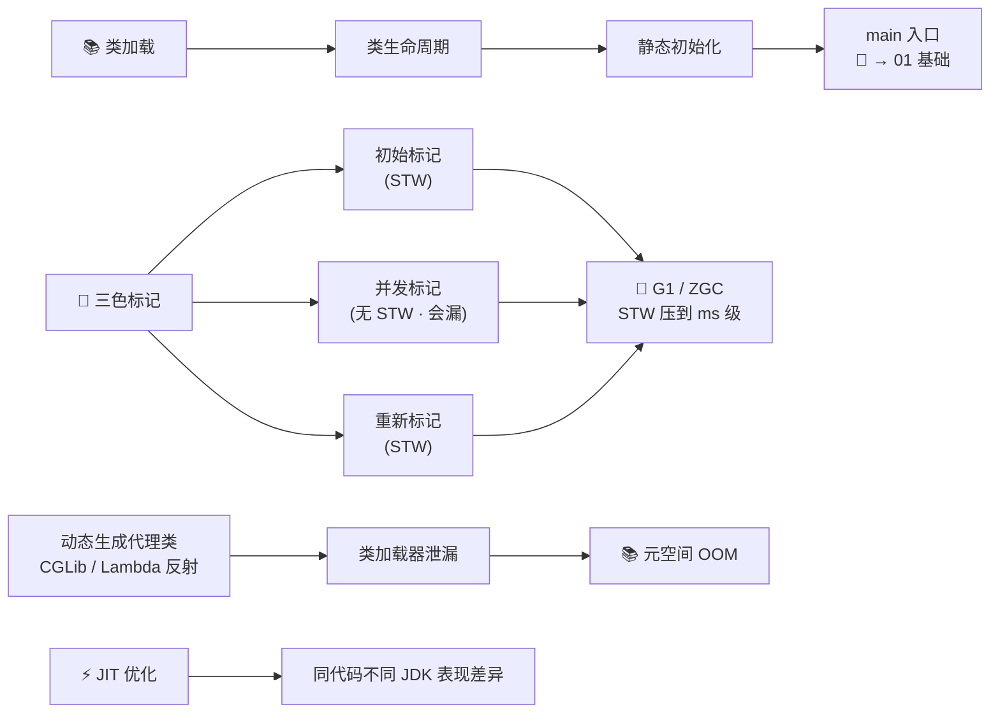

#### 🌉 跨类目桥梁

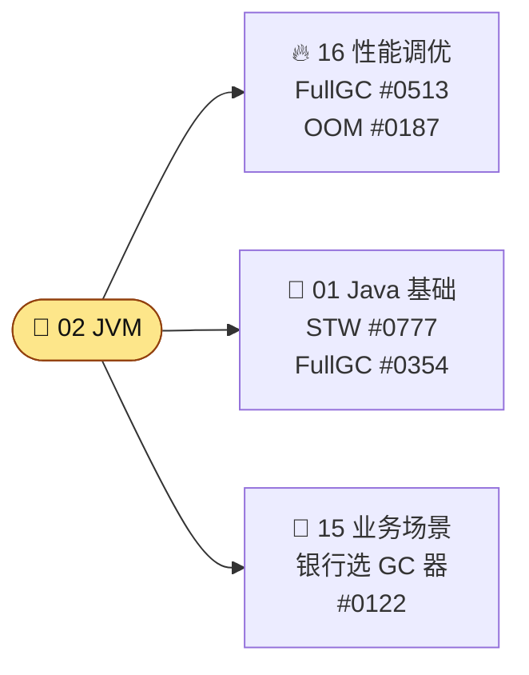

---

<div align="center">

## 🧵 03 · 并发编程

**92 题** · 深难度 · 线程·锁·JUC·内存模型

</div>

<table>
<tr>
<td width="50%" valign="top">

#### 🧵 线程基础

- **创建线程 OS 层动作** `#0071`
- **停止线程** `#0006`（不推荐 stop）
- **协程 / 虚拟线程** `#0048`

</td>
<td width="50%" valign="top">

#### 🏗️ 线程池

- **实现 + 7 大参数** `#0073` `#0108`
- **线程数设定** `#0074`
- **调优** `#0119` · **动态线程池** `#0277`
- **ForkJoinPool vs ThreadPoolExecutor** `#0183`

</td>
</tr>
<tr>
<td valign="top">

#### 🔐 synchronized

- **实现原理** `#0290`
- **原子/可见/有序性** `#0094`
- **锁升级** 无→偏→轻→重 `#0181`
- **锁优化** `#0319`
- **锁能否降级** `#0720`

</td>
<td valign="top">

#### 🔧 JUC 工具

- **AQS 独占 vs 共享** `#0044`
- **JUC 工具类大全** `#0216`
- **ConcurrentHashMap 线程安全** `#0202`
- **CHM 并发控制点** `#0115`
- **HashMap vs Hashtable vs CHM** `#0234`

</td>
</tr>
<tr>
<td valign="top">

#### 🧊 ThreadLocal

- **TTL vs InheritableTL** `#0036`
- **ScopedValue（JDK 25）** `#0136`
- **线程池下 TL 风险** `#0135`

</td>
<td valign="top">

#### ⚛️ CAS / 无锁

- **CAS + 问题（ABA）** `#0299`
- **伪共享** `#0238`
- **fail-fast vs fail-safe** `#0226`

</td>
</tr>
<tr>
<td valign="top">

#### 💀 死锁 / 活锁

- **死锁四条件 + 破解** `#0300`
- **活锁 vs 死锁** `#0215`
- **线程安全的理解** `#0279`

</td>
<td valign="top">

#### 🌐 跨域

- **CAS 在 OS 层** → 13 网络OS
- **synchronized → 字节码** → 02 JVM
- **ThreadLocal 内存泄漏** → 16 调优

</td>
</tr>
</table>

#### 🔗 关联关系

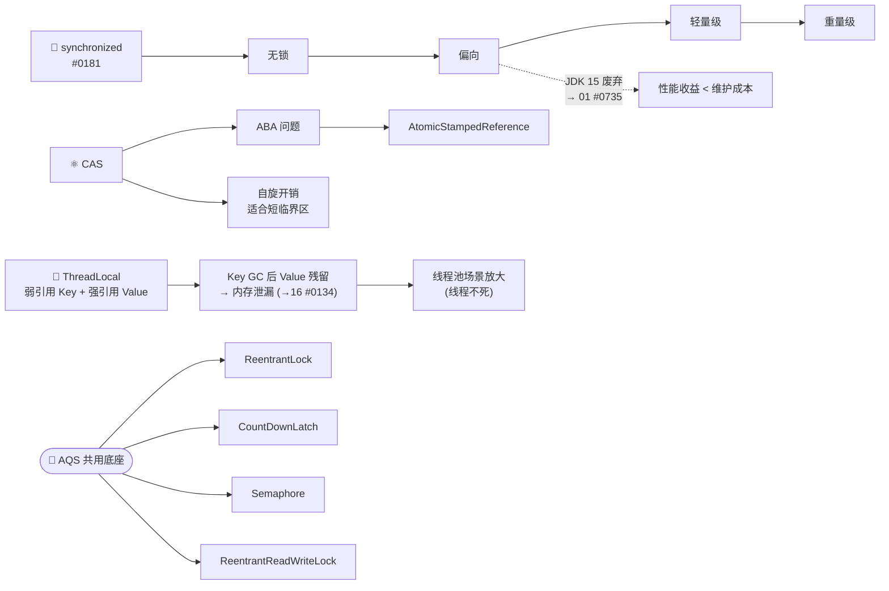

---

<div align="center">

## 🌱 04 · Spring 体系

**96 题** · 中难度 · IoC·AOP·事务·Boot 启动

</div>

<table>
<tr>
<td width="50%" valign="top">

#### 🏗️ IoC / Bean

- **IoC 概念** `#0747`
- **Bean 生命周期** `#0715` · **初始化** `#0700`
- **三种初始化时序** `#0689`
- **让 bean 先加载** `#0294`
- **bean 无法初始化** `#0347`
- **@Autowired vs @Resource** `#0270`
- **不建议字段注入** `#0716`
- **动态生成 Bean** `#0121`
- **shutdownHook** `#0731`

</td>
<td width="50%" valign="top">

#### 🌀 AOP

- **AOP 介绍** `#0196`
- **AOP 失效场景** `#0714`

#### 💳 事务

- **@Transactional 原理** `#0102`
- **事务失效原因** `#0089`
- **开启事务** `#0101`
- **事务里不要做外部调用** `#1207`
- **不建议 @Transactional** `#0490`
- **事务事件 / Spring Event** `#0688` `#0059`

</td>
</tr>
<tr>
<td valign="top">

#### 🚀 Spring Boot

- **启动流程** `#0200`
- **自动配置** `#0762`
- **application vs bootstrap yml** `#0075`
- **Spring 6 / Boot 3 新特性** `#0082`
- **Spring 7 / Boot 4** `#0080`
- **spring.factories 移除** `#0297`
- **main 启动 Web 原理** `#0746`
- **SpringMVC 流式输出** `#0326`

</td>
<td valign="top">

#### 🌉 桥梁

- → 01 基础：动态代理 = 反射 + ASM
- → 09 分布式事务：本地事务边界
- → 12 中间件：MyBatis vs Hibernate

</td>
</tr>
</table>

#### 🔗 关联关系

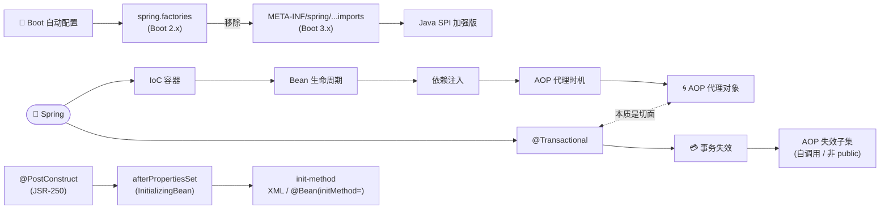

---

<div align="center">

## 🐬 05 · MySQL

**153 题** · 中-深难度 · 存储·索引·事务·调优

</div>

<table>
<tr>
<td width="50%" valign="top">

#### 🌳 索引

- **InnoDB 索引类型** `#0046`
- **B+ 树与数据页** `#0212`
- **like 优化** `#0117` · **函数索引一定失效吗** `#0038`
- **a=1 失效原因** `#0106` · **key 长度限制** `#0037`
- **回表 + 减少** `#0142`
- **索引覆盖 + 下推** `#0143`
- **索引合并** `#0060`
- **联合索引怎么加** `#0111`
- **比较索引好坏** `#0172`
- **唯一性索引** `#0151`
- **filtered 字段** `#0173`
- **执行计划要看什么** `#0182`

</td>
<td width="50%" valign="top">

#### 💳 事务与隔离

- **事务机制** `#1068`
- **隔离级别** `#0129`
- **MVCC** `#0128`
- **长事务问题** `#0049` `#0125`

#### 🔐 锁

- **排他 vs 共享** `#0285`
- **热点数据更新** `#0207`

</td>
</tr>
<tr>
<td valign="top">

#### 🚦 调优

- **SQL 调优如何做** `#0313` `#0345`
- **order by 实现** `#0211` · **Using filesort** `#1183`
- **千万级加字段** `#0222` · **Online DDL** `#0223`
- **慢 SQL 排查** `#1198`

</td>
<td valign="top">

#### 🎛️ 操作

- **insertOrUpdate** `#0127`
- **ILM 索引生命周期** `#0083`
- **大事务问题** `#0125`

</td>
</tr>
</table>

#### 🔗 关联关系

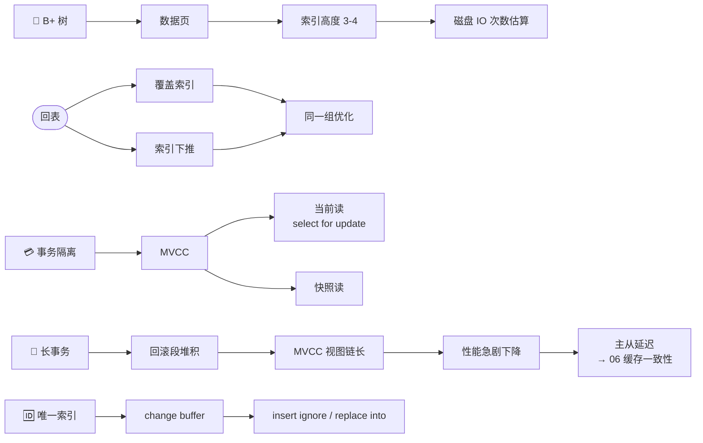

#### 🌉 跨类目桥梁

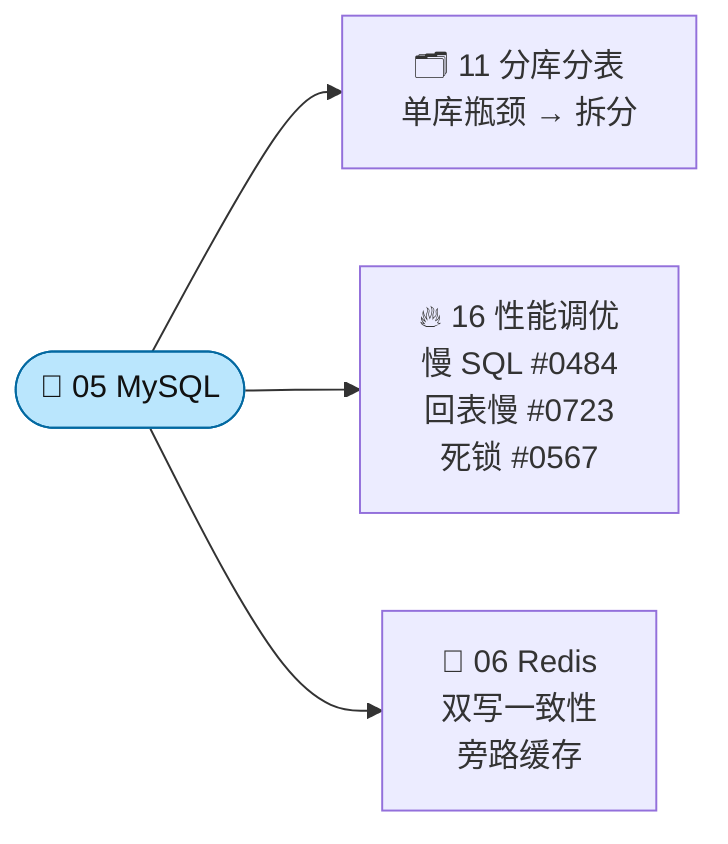

---

<div align="center">

## 🔴 06 · Redis

**74 题** · 中难度 · 结构·持久化·集群·缓存模式

</div>

<table>
<tr>
<td width="50%" valign="top">

#### 🧱 数据结构

- **5 种类型 + 底层编码切换**
- **ZipList/SkipList/ListPack** `#0255` `#0278`
- **ZSet 实现 ZipList→SkipList** `#0286` `#0288`
- **ListPack 解决级联更新** `#0287`
- **Redis Hash vs Java HashMap** `#0237`
- **布隆过滤器缺点 / 删除** `#0176` `#0177`
- **布谷鸟过滤器** `#0178`
- **5 亿数据布隆内存估算** `#0352`

</td>
<td width="50%" valign="top">

#### 🧵 单线程

- **为啥单线程** `#0055`

#### 💾 持久化

- **机制（RDB/AOF/混合）** `#0230`
- **能否不丢数据** `#0229`

#### 🌐 集群

- **集群模式** `#0203`

</td>
</tr>
<tr>
<td valign="top">

#### ⏰ 过期与淘汰

- **过期策略（定期+惰性）** `#0126`
- **过期 key 不立即删** `#0241`
- **内存碎片** `#0272`

</td>
<td valign="top">

#### 🌀 缓存一致性

- **DB 与缓存一致** `#0219`
- **延迟双删 + 两次原因** `#0218`
- **多级缓存一致性** `#0144`

</td>
</tr>
<tr>
<td valign="top">

#### 🔒 分布式锁基础

- **setnx vs setex** `#0317`
- **setnx 为啥原子** `#0889`
- *详见 10_分布式锁*

</td>
<td valign="top">

#### ⚛️ Lua / 新特性

- **Lua 为啥原子** `#0063`
- **Lua vs 事务** `#0030`
- **Redis 8.0 新特性** `#0334`

</td>
</tr>
</table>

#### 🔗 关联关系

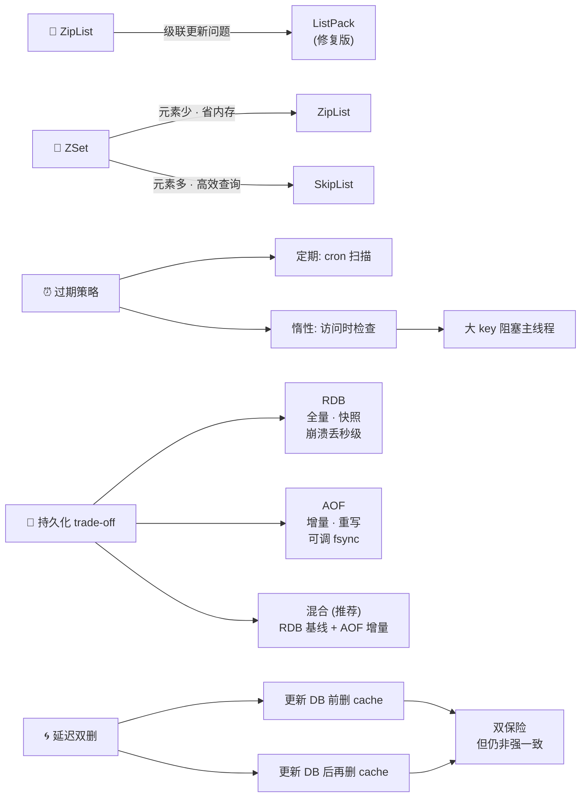

---

<div align="center">

## 📨 07 · 消息队列

**51 题** · 中-深难度 · Kafka·RocketMQ·RabbitMQ

</div>

<table>
<tr>
<td width="50%" valign="top">

#### 🏗️ 架构

- **Kafka 架构** `#0258`
- **Kafka 存储结构** `#0195`
- **Kafka Offset** `#0236`
- **Kafka 依赖 ZK** `#0247`
- **RabbitMQ 架构** `#1178`

</td>
<td width="50%" valign="top">

#### 📤 生产 / 消费

- **消费者数 vs 分区数** `#0246`
- **重平衡** RocketMQ vs Kafka `#0281`
- **批量消费** `#0321` `#0322`
- **拉 vs 推** `#0873`
- **RabbitMQ 限流** `#0295`

</td>
</tr>
<tr>
<td valign="top">

#### ❌ 丢消息 / 不丢

- **Kafka 丢** `#0092`
- **RocketMQ 丢** `#0093`
- **RabbitMQ 不丢** `#1115`
- **RocketMQ 不丢** `#0315`

</td>
<td valign="top">

#### 🔁 重复消费

- **RocketMQ 重复** `#0303`
- **RabbitMQ 防重** `#1126`
- **重复消费/下单解决** `#0318`

</td>
</tr>
<tr>
<td valign="top">

#### 📚 顺序 / 事务 / HA

- **顺序消息** `#0140`
- **乱序解决** `#0824`
- **RabbitMQ 事务** `#1100`
- **RabbitMQ 高可用** `#1138`

</td>
<td valign="top">

#### 🚨 异常场景

- **消息堆积** `#0045`
- **常见坑** `#0064`
- **避免丢消息落表设计** `#0298`
- **Kafka 单分区单消费者提吞吐** `#0852`

</td>
</tr>
</table>

#### 🔗 关联关系

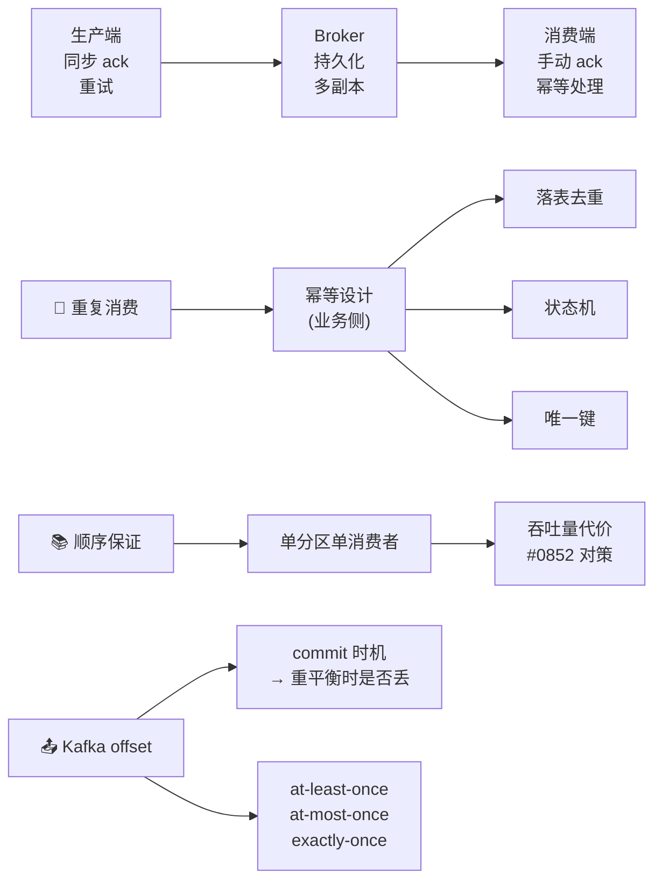

---

<div align="center">

## 🌐 08 · 微服务与分布式

**58 题** · 中难度 · 治理·限流·熔断·网关

</div>

<table>
<tr>
<td width="50%" valign="top">

#### 🌐 服务通信

- **微服务通信方式** `#0068`
- **Feign vs OpenFeign** `#0260`
- **Feign 首次慢** `#0114`
- **OpenFeign 替代** `#0097`

</td>
<td width="50%" valign="top">

#### 🧭 发现与路由

- **Dubbo 发现 vs 路由** `#0061`
- **Ribbon vs Nginx** `#0306`

</td>
</tr>
<tr>
<td valign="top">

#### 🚦 限流·熔断·降级

- **三者区别** `#0916`
- **漏桶 vs 令牌桶** `#0266`
- **单机 vs 集群限流** `#0171`

</td>
<td valign="top">

#### 🛡️ 雪崩 / 网关

- **防止雪崩** `#0004`
- **Zuul vs Gateway vs Nginx** `#0307`
- **Zuul 介绍** `#0308`

</td>
</tr>
<tr>
<td valign="top">

#### 🏛️ 架构

- **微服务优势** `#1007`
- **服务治理方案** `#0966`
- **SOA vs 微服务** `#0991`
- **Service Mesh** `#0943`
- **拆分** `#0979` · **CI/CD** `#0955`

</td>
<td valign="top">

#### 🌉 桥梁

- → 09 分布式事务
- → 13 网络OS（HTTP 长连接）
- → 15 业务场景（秒杀限流套件）

</td>
</tr>
</table>

#### 🔗 关联关系

```mermaid
flowchart LR
    %% 雪崩四层纵深
    L["限流<br/>入口 · 防过载"] --> Fz["熔断<br/>失败 · 防扩散"]
    Fz --> D["降级<br/>兜底 · 防雪盘"]
    D --> I["隔离<br/>资源 · 防互染"]

    %% 调用链路
    SD["🌐 服务发现"] --> LB["负载均衡"]
    LB --> RT["路由策略"]
    RT --> RPC["RPC 调用"]
    RPC --> BIZ["业务逻辑"]

    %% 网关
    GW(["🚪 网关 = API 聚合点"])
    GW --> A1["统一鉴权"]
    GW --> A2["统一限流"]
    GW --> A3["统一灰度"]
    GW --> A4["协议转换"]
```

---

<div align="center">

## 💱 09 · 分布式事务

**25 题** · 深难度 · 强一致 vs 最终一致

</div>

<table>
<tr>
<td width="50%" valign="top">

#### 📜 理论

- **什么是分布式事务** `#0964`
- **柔性事务** `#0931`
- **2PC** `#0154` `#0273`
- **3PC** `#0153`
- **TCC vs 2PC** `#0130`
- **TCC 强一致 or 最终** `#0132`
- **TCC 空回滚 / 悬挂** `#0225`

</td>
<td width="50%" valign="top">

#### 🪢 Seata

- **AT 模式原理** `#0067`
- **AT 会脏读吗** `#0656`
- **AT vs XA** `#1061`
- **Seata 4 种模式** `#0133`

</td>
</tr>
<tr>
<td valign="top">

#### 📨 消息驱动

- **本地消息表** `#0239` `#0256`
- **上游回滚** `#0240`
- **事务消息** `#0673`
- **MQ 分布式事务** `#0930`
- **最大努力通知** `#0904`
- **三者对比** `#0891`

</td>
<td valign="top">

#### 🌉 桥梁

- → 05 MySQL（本地事务）
- → 07 MQ（事务消息 Broker）
- → 14 系统设计（BASE 落地）

</td>
</tr>
</table>

#### 🔗 关联关系

```mermaid
flowchart LR
    %% 协议演进
    PC2["2PC"] -->|"协调者阻塞问题"| PC3["3PC<br/>CanCommit / PreCommit / DoCommit"]

    %% TCC
    TCC(["🪢 TCC<br/>业务侵入式"])
    TCC --> TRY["Try<br/>预留资源"]
    TCC --> CFM["Confirm<br/>业务确认"]
    TCC --> CCL["Cancel<br/>业务取消"]

    %% 异步可靠投递三档
    BEST["最大努力通知<br/>(最弱)<br/>重试 N 次即止"] --> LTAB["本地消息表<br/>(中)<br/>DB 持久化"]
    LTAB --> TXM["事务消息<br/>(最强)<br/>Broker 半消息"]

    %% Seata AT
    SEATA(["🪢 Seata AT"])
    SEATA --> GL["全局锁<br/>(保证隔离性)"]
    SEATA --> UL["undo_log<br/>(保证可回滚)"]
```

---

<div align="center">

## 🔑 10 · 分布式锁与 ID

**43 题** · 中难度 · 锁 + 全局唯一 ID

</div>

<table>
<tr>
<td width="50%" valign="top">

#### 🔒 分布式锁

- **SETNX 实现** `#0728`
- **SETNX 为啥原子** `#0889`
- **Redisson watchdog 续期** `#0276`
- **Redisson 可重入** `#0138`
- **Redisson 防误删** `#0043`
- **Redisson 使用** `#0713`
- **主从切换 B 拿锁** `#0336`
- **加锁时 Redis 挂** `#0756`
- **Redis vs zk 分布式锁** `#0697`
- **死锁友好** `#0698`

</td>
<td width="50%" valign="top">

#### 🆔 分布式 ID

- **方案大全** `#0890`
- **UUID 唯一吗** `#0091`
- **雪花算法** `#0179`
- **雪花时钟回拨** `#0079`
- **号段模式** `#0672`
- **为啥全局 ID** `#0634`
- **自增不连续** `#0293`
- **主键一定自增吗** `#0047`

</td>
</tr>
</table>

#### 🔗 关联关系

```mermaid
flowchart TB
    %% Redis 锁四道防线
    LK(["🔒 Redis 分布式锁<br/>四道防线"])
    LK --> F1["① SETNX + 过期时间<br/>防死锁"]
    LK --> F2["② value = 客户端唯一 ID<br/>防误删"]
    LK --> F3["③ watchdog 续期<br/>防业务超时"]
    LK --> F4["④ Lua 脚本删除<br/>保证原子"]
    LK -->|"极端场景"| EX["主从切换 / Redis 不可用<br/>退化为单点 → 改 Redlock or zk"]

    %% Redis vs zk 对比
    R["Redis (AP)<br/>高性能 / 弱一致<br/>死锁不友好<br/>(TTL 兜底)"] <-->|"对比"| Z["zk (CP)<br/>强一致 / 弱性能<br/>死锁友好<br/>(临时节点)"]

    %% 雪花算法
    SF(["🆔 雪花算法位结构"])
    SF --> B1["1bit"]
    SF --> B2["41bit 时间戳"]
    SF --> B3["10bit 机器ID"]
    SF --> B4["12bit 序列号"]
    B2 --> CB["时钟回拨<br/>等待 / 报错 / 拉新机器ID"]
```

---

<div align="center">

## 🗂️ 11 · 分库分表

**24 题** · 中-深难度 · 分片·分页·扩容·迁移

</div>

<table>
<tr>
<td width="50%" valign="top">

#### ✂️ 拆分策略

- **什么是分库分表** `#0607`
- **分区 vs 分表** `#0595`
- **为啥 2^n** `#0496`
- **预估多少库表** `#0650`
- **分表算法** `#0565`
- **分表字段选择** `#0095`
- **取模避免倾斜** `#0511`
- **ShardingJDBC 策略** `#0481`

</td>
<td width="50%" valign="top">

#### 🤝 反向问题

- **跨库 join** `#0058` `#0510`
- **分页查询** `#0551`
- **模糊查询** `#0635`
- **带来的问题** `#0552`

#### 🆔 全局 ID

- **分表后全局 ID** `#0566`

</td>
</tr>
<tr>
<td valign="top">

#### 📈 扩容与迁移

- **表不够再扩** `#0536`
- **降迁移难度的设计** `#0664`
- **XXL-Job 扫表实现** `#0342`

</td>
<td valign="top">

#### 🌉 桥梁

- → 05 MySQL（单库瓶颈）
- → 10 分布式 ID
- → 20 任务调度（分片扫表）

</td>
</tr>
</table>

#### 🔗 关联关系

```mermaid
flowchart TD
    %% 四个反向问题
    SH(["🗂️ 分库分表"])
    SH --> R1["跨库 join"]
    SH --> R2["分页查询"]
    SH --> R3["全局 ID"]
    SH --> R4["模糊查询"]

    %% 2^n
    POW(["⚙️ 2^n 库表"])
    POW --> A1["取模 = 位运算<br/>(高效)"]
    POW --> A2["rehash 时数据迁移最少<br/>(一致性哈希原理同源)"]
```

---

<div align="center">

## 🧰 12 · 其他中间件

**51 题** · 中难度 · ES·ZK·Netty·MyBatis

</div>

<table>
<tr>
<td width="50%" valign="top">

#### 🔍 Elasticsearch

- **集群角色** `#0065`
- **深度分页** `#0116`
- **Hot-Warm-Cold** `#0084`

</td>
<td width="50%" valign="top">

#### 🌳 ZooKeeper

- **CP 还是 AP** `#0301`
- **数据一致性** `#0324`

</td>
</tr>
<tr>
<td valign="top">

#### 🚀 Netty

- **线程模型** `#1075`
- **无锁化设计** `#1074`
- **零拷贝** `#1091`
- **对象池** `#1048` · **Buffer** `#1049`
- **粘包/拆包** `#1062`
- **设计模式** `#1024` · **序列化** `#1037`

</td>
<td valign="top">

#### 🗃️ MyBatis

- **`#` vs `$`** `#0956`
- **MyBatis vs Hibernate** `#0980`

#### 🌐 配置 / 注册中心

- **配置中心** `#0069`
- **Eureka 缓存** `#1040`
- **Eureka vs zk** `#1054`

#### 🐋 容器 / 其他

- **Tomcat 线程数 200** `#0103`
- **拜占庭将军** `#0990`

</td>
</tr>
</table>

#### 🔗 关联关系

```mermaid
flowchart LR
    %% Netty 零拷贝三件套
    NT(["🚀 Netty 零拷贝"])
    NT --> N1["CompositeByteBuf<br/>合并不复制"]
    NT --> N2["FileRegion<br/>sendfile"]
    NT --> N3["DirectBuffer<br/>堆外内存"]

    %% 注册中心选型
    Z["zk (CP)<br/>一致性优先<br/>Leader 选举<br/>会短暂不可用"] <-->|"🌳 选型对比"| E["Eureka (AP)<br/>可用性优先<br/>客户端缓存<br/>会看到旧节点"]

    %% MyBatis # vs $
    HS["#{name}<br/>预编译参数<br/>防 SQL 注入"] <-->|"🗃️ 对比"| DL["${name}<br/>字符串拼接<br/>动态表名 / 列名"]
```

---

<div align="center">

## 📡 13 · 网络与操作系统

**68 题** · 中难度 · TCP·HTTP·IO 模型·安全

</div>

<table>
<tr>
<td width="50%" valign="top">

#### 🌐 HTTP / HTTPS

- **HTTPS 握手次数** `#0072`
- **HTTP 版本差异** `#0221`
- **301 vs 302** `#0289`

</td>
<td width="50%" valign="top">

#### ⚡ IO / 零拷贝

- **同步/异步/阻塞/非阻塞** `#0353`
- **零拷贝** `#0152`

</td>
</tr>
<tr>
<td valign="top">

#### 🧬 OS 概念

- **时间片** `#0502`
- **闰秒** `#0440`
- **CAS 在 OS 层** `#0394`
- **Linux rm 写入中文件** `#0323`

</td>
<td valign="top">

#### 🛡️ 安全

- **加密 vs 签名** `#0530`
- **SQL 注入** `#0518`
- **中间人攻击** `#0519`
- **撞库/拖库/洗库** `#0503`
- **CORS** `#0504`

</td>
</tr>
<tr>
<td valign="top">

#### ☁️ 云原生

- **Serverless** `#0521`
- **IaaS/PaaS/SaaS** `#0522`
- **快启动** `#0506`

</td>
<td valign="top">

#### 🧑‍🤝‍🧑 多租户

- **SaaS 多租户** `#0086`

</td>
</tr>
</table>

#### 🔗 关联关系

```mermaid
flowchart LR
    %% HTTPS 握手
    TCP["TCP 三次握手<br/>(3 RTT)"] --> TLS["TLS 握手<br/>(1-2 RTT)"]
    TLS --> ENC["加密通信"]
    TLS --> V13["TLS 1.3<br/>优化到 1 RTT"]
    V13 --> ZR["0-RTT 恢复<br/>(有重放风险)"]

    %% 零拷贝
    ZC(["⚡ 零拷贝实现"])
    ZC --> SF["sendfile<br/>内核态文件 → socket"]
    ZC --> MM["mmap<br/>用户态内存映射文件"]
    ZC --> SP["splice<br/>管道间零拷贝"]
```

**🔄 IO 模型四象限**

|        | 阻塞 | 非阻塞 |
|---|---|---|
| **同步** | BIO（read 等） | NIO（selector 轮询） |
| **异步** | （理论存在） | AIO（回调 / Future） |

---

<div align="center">

## 🏛️ 14 · 系统设计与高并发

**26 题** · 中难度 · CAP·BASE·容量估算

</div>

<table>
<tr>
<td width="50%" valign="top">

#### 📚 理论

- **CAP 不能全满足** `#1021`
- **BASE 理论** `#1006`
- **一致性** `#1022` · **分布式 vs 集群** `#1036`
- **一致性哈希** `#1181`

</td>
<td width="50%" valign="top">

#### 📏 容量

- **QPS 预估** `#0902` · **QPS vs RT** `#1284`
- **3000QPS/RT 200ms 几台** `#1002`
- **单机 300 / 10 台 3000 吗** `#1271`
- **4C8G 指标范围** `#0912`
- **4C8G×16 vs 8C16G×8** `#0913`

</td>
</tr>
<tr>
<td valign="top">

#### 🏛️ 架构原则

- **架构=权衡** `#0765`
- **好架构** `#0780` · **设计 vs 演进** `#0781`
- **三要素** `#0806` · **设计原则** `#0807`
- **康威定律** `#0992` · **单元化** `#1229`
- **技术债务** `#0793` · **没有银弹** `#1228`

</td>
<td valign="top">

#### 🛠️ 高并发

- **高并发系统设计** `#1270`
- **分布式日志** `#0507`
- **分布式数据库** `#0248`

</td>
</tr>
</table>

#### 🔗 关联关系

```mermaid
flowchart LR
    %% CAP → BASE
    CAP["📚 CAP 理论<br/>不能同时满足 C+A+P<br/>实际选 CP 或 AP"] -->|"工程化"| BASE["BASE 理论"]
    BASE --> BA["BA · Basically Available"]
    BASE --> SS["S · Soft state"]
    BASE --> EE["E · Eventual consistency"]

    %% 容量估算
    CAP2(["📏 容量估算"])
    CAP2 --> F["机器数 ≈ ⌈ 总 QPS × RT / 1000 / 单机并发 ⌉"]
    F --> Q["总 QPS · RT<br/>(压测真实值)"]
    F --> C["单机并发<br/>通常 200ms ≈ 5 倍并发"]

    %% 一致性哈希
    HASH(["🌀 一致性哈希"])
    HASH --> S1["解决: 节点变动时最少数据迁移"]
    HASH --> S2["工业实现: Redis Cluster Slot<br/>(简化版) / Cassandra"]
```

---

<div align="center">

## 🎯 15 · 业务场景题

**61 题** · 中-深难度 · 多类目知识捏合在一个业务

</div>

<table>
<tr>
<td width="50%" valign="top">

#### 🎯 秒杀 / 库存

- **库存高并发扣减** `#0244`
- **阿里抗秒杀原理** `#0217`
- **小红书 MySQL 抗秒杀** `#0034`
- **重复下单** `#0316`
- **状态机+乐观锁** `#0280`

</td>
<td width="50%" valign="top">

#### 📦 订单 / 关闭 / 对账

- **订单到期关闭** `#0066`
- **数据对账** `#0191`
- **日切前后不一致** `#0192`

</td>
</tr>
<tr>
<td valign="top">

#### 🏆 排行 / 点赞

- **百万级排行榜** `#0205`
- **ZSet 分数+时间** `#0227`
- **点赞系统** `#0118`

</td>
<td valign="top">

#### 🔍 海量数据

- **敏感词过滤** `#0204`
- **百万 Excel 导入** `#0243`
- **千万级酒店准点变价** `#0206`
- **到期会员消息提醒** `#0337`

</td>
</tr>
<tr>
<td valign="top">

#### 🔗 短链 / Bitset

- **短链服务** `#0249`
- **bitset 商品预约** `#0124`
- **基因法二次分表** `#0016`

</td>
<td valign="top">

#### 🌉 桥梁

→ 几乎所有其他类目都是本类目的支撑

</td>
</tr>
</table>

#### 🔗 关联关系

```mermaid
flowchart LR
    %% 秒杀多层防御
    IN["流量入口"] --> LIM["限流"]
    LIM --> RP["Redis 预扣"]
    RP --> MQ["MQ 异步"]
    MQ --> DB["DB 真实扣减"]
    DB -.->|"兜底回补"| LIM

    %% 订单关闭三种方案
    OC(["📦 订单到期关闭"])
    OC --> S1["DB 扫表<br/>简单但慢<br/>适合小规模"]
    OC --> S2["延迟队列<br/>MQ / Redis<br/>通用"]
    OC --> S3["时间轮<br/>高效·需常驻<br/>适合大规模"]

    %% 幂等四件套
    ID(["🔁 幂等设计四件套"])
    ID --> I1["① 唯一键约束<br/>(DB 兜底)"]
    ID --> I2["② token / nonce"]
    ID --> I3["③ 业务状态机"]
    ID --> I4["④ 分布式锁"]
```

---

<div align="center">

## 🔥 16 · 性能调优与故障排查

**34 题** · 深难度 · 现象→工具→根因→修复

</div>

<table>
<tr>
<td width="50%" valign="top">

#### 🔥 CPU

- **CPU 飙高 ×2** `#0184` `#0554`
- **日志导致 CPU 飙高** `#0312`

</td>
<td width="50%" valign="top">

#### 💥 内存 / GC

- **OOM 排查** `#0187`
- **ThreadLocal 内存泄漏** `#0134`
- **频繁 FullGC** `#0513`

</td>
</tr>
<tr>
<td valign="top">

#### 🐌 慢 SQL / DB

- **慢 SQL** `#0484`
- **回表慢 SQL** `#0723`
- **DB CPU 打满** `#0538`
- **连接池满** `#0262`
- **索引失效排查** `#0265`
- **死锁排查** `#0567`

</td>
<td valign="top">

#### 🐢 RT / 吞吐

- **RT 飙高** `#0580`
- **压测 OK 上线扛不住** `#0626`
- **多节点缓慢 CPU 正常** `#0686`

</td>
</tr>
<tr>
<td valign="top">

#### 🧱 其他

- **磁盘满** `#0331`
- **端口冲突** `#0214`
- **RocketMQ 消费堆积** `#0596`
- **挖矿木马** `#0709`

</td>
<td valign="top">

#### 🌉 桥梁

→ 几乎所有类目的"故障下游"

</td>
</tr>
</table>

#### 🔗 排障链路

```mermaid
flowchart TB
    %% CPU 飙高
    subgraph CPU["🔥 CPU 飙高排障链路"]
        direction LR
        C1["top<br/>找进程 PID"] --> C2["top -H -p PID<br/>找占 CPU 的线程 TID"]
        C2 --> C3["printf %x<br/>转十六进制"]
        C3 --> C4["jstack PID | grep hex_TID<br/>定位代码"]
    end

    %% OOM
    subgraph OOM["💥 OOM 排障链路"]
        direction TB
        O1["-XX:+HeapDumpOnOutOfMemoryError"] --> O2["jmap -dump:format=b,file=heap.hprof PID"]
        O2 --> O3["MAT / VisualVM 分析"]
        O3 --> R1["大对象<br/>(缓存爆 / Excel 一次性读入)"]
        O3 --> R2["类加载器泄漏<br/>(动态代理类堆积)"]
        O3 --> R3["ThreadLocal 残留<br/>(线程池 + 线程不死)"]
    end

    %% 慢 SQL
    subgraph SQL["🐌 慢 SQL 排障链路"]
        direction LR
        Q1["慢查询日志"] --> Q2["EXPLAIN<br/>type/key/rows/Extra"]
        Q2 --> Q3a["Using filesort<br/>→ 加排序索引"]
        Q2 --> Q3b["Using temporary<br/>→ 重写 SQL"]
        Q2 --> Q3c["key=NULL<br/>→ 索引失效排查"]
    end
```

---

<div align="center">

## 🧮 17 · 数据结构与算法

**27 题** · 中难度 · 树·堆·位图·海量数据

</div>

<table>
<tr>
<td width="50%" valign="top">

#### 🌳 结构

- **树有哪些** `#0600`
- **二叉树遍历** `#0585`
- **堆是什么** `#0040`
- **小顶堆应用** `#0882`
- **栈 vs 队列** `#0611`
- **数组 vs 链表** `#0627`
- **图 有向 vs 无向** `#0899`
- **前缀树** `#0584`
- **BitMap** `#0883`

</td>
<td width="50%" valign="top">

#### 🧮 缓存淘汰

- **LRU vs LFU** `#0608`
- **缓存失效算法** `#0637`

</td>
</tr>
<tr>
<td valign="top">

#### 🌊 海量数据

- **1TB / 32GB 排序** `#0120`
- **1TB 日志 Top 10** `#0669`
- **40 亿 QQ / 1G 去重** `#0774`
- **黑名单网址过滤** `#0186`

</td>
<td valign="top">

#### ⚡ 位运算

- **按位与 vs 取模** `#0703`

#### 🧠 智力 / 概率

- 砝码/称重/倒水/概率 `#1030` `#1044` `#1045` `#1057` `#1072` `#1086`

</td>
</tr>
</table>

#### 🔗 关联关系

```mermaid
flowchart LR
    %% 海量数据三件套
    BD(["🌊 海量数据题"])
    BD --> M1["外排序<br/>+ 多路归并"]
    BD --> M2["小顶堆 (Top K)"]
    BD --> M3["位图 / 布隆<br/>(去重)"]

    %% LRU
    LRU(["🧮 LRU 实现"])
    LRU --> H["HashMap + 双向链表"]
    H --> IM["工业实现:<br/>LinkedHashMap (Java)<br/>Redis approximated LRU"]
```

---

<div align="center">

## 🤖 18 · AI 与大模型

**30 题** · 浅-中难度 · 新八股，每年都在变

</div>

<table>
<tr>
<td width="50%" valign="top">

#### 🤖 大模型基础

- **API 参数** `#0023`
- **Function Calling** `#0014`
- **Vibe Coding** `#0017` `#0010`

</td>
<td width="50%" valign="top">

#### 🛠️ Agent

- **Skill 是什么** `#0027`
- **Skill 自进化** `#0013`
- **Skill vs MCP** `#0026`
- **单 vs 多 Agent** `#0005`
- **Harness vs Prompt vs Context 工程** `#0009`

</td>
</tr>
<tr>
<td valign="top">

#### 🌱 Spring AI

- **Advisor 机制** `#0021`
- **ChatModel vs ChatClient** `#0022`

</td>
<td valign="top">

#### 💻 工具

- **AI Coding 工具** `#0011` `#0019`
- **Cursor 体验好** `#0018`
- **Claude Code 国内用** `#0015`

</td>
</tr>
</table>

#### 🔗 关联关系

```mermaid
flowchart LR
    AG(["🛠️ AI Agent 三大扩展机制"])
    AG --> FC["Function Calling<br/>(基础: 工具)"]
    AG --> SK["Skill<br/>(行为模板 / 技能)"]
    AG --> MCP["MCP<br/>(数据 / 工具接入)"]
```

---

<div align="center">

## 🛠️ 19 · 工具与工程

**21 题** · 浅难度 · 日常工具链

</div>

<table>
<tr>
<td width="50%" valign="top">

#### 🌿 Git

- **merge vs rebase** `#0563`
- **reset vs revert** `#0592`
- **Git vs SVN** `#0593`

</td>
<td width="50%" valign="top">

#### 📦 构建 / 打包

- **Maven jar 冲突** `#0605`
- **jar vs war** `#0574`
- **fat jar** `#0575`

</td>
</tr>
<tr>
<td valign="top">

#### 🧪 测试

- **单元测试** `#0547`
- **单测 vs 集成** `#0591`
- **JDBC 单测** `#0573`

</td>
<td valign="top">

#### 🛠️ IDEA / Linux

- **IDEA 插件** `#0533`
- **远程 Debug** `#0548`
- **Linux 常用命令** `#0492`
- **日志分析** `#0491`

</td>
</tr>
<tr>
<td valign="top">

#### 🧰 其他

- **Lombok 谨慎用** `#0466`
- **作为组长的规范** `#0113`

</td>
<td valign="top"></td>
</tr>
</table>

#### 🔗 关联关系

```mermaid
flowchart LR
    %% Git 对比
    GIT(["🌿 Git 操作对比"])
    GIT --> G1["merge<br/>保留分叉历史<br/>(--no-ff 保险)"]
    GIT --> G2["rebase<br/>线性化历史<br/>(已 push 慎用)"]
    GIT --> G3["reset<br/>改写历史<br/>(--hard 危险)"]
    GIT --> G4["revert<br/>追加反向 commit<br/>(✓ 安全)"]

    %% 打包形态
    P1["传统 jar / war"] --> P2["fat jar<br/>(Boot)"]
    P2 --> P3["容器镜像<br/>(云原生)"]
```

---

<div align="center">

## ⏰ 20 · 任务调度

**11 题** · 中难度 · 定时·扫表·时间轮

</div>

<table>
<tr>
<td width="50%" valign="top">

#### ⏰ 框架

- **XXL-Job vs @Scheduled** `#0029`
- **Spring Task vs XXL-Job** `#1201`
- **PowerJob vs XXL-Job** `#0330`
- **XXL-Job 一任务一次** `#0621`
- **XXL-Job 分片** `#0549`

</td>
<td width="50%" valign="top">

#### 🗃️ 扫表

- **缺点** `#0550` `#1141`
- **避免跳页** `#0264`
- **避免死循环** `#1077`
- **Spring Event 同转异** `#0667`
- **@Scheduled 集群并发** `#0685`

</td>
</tr>
<tr>
<td valign="top">

#### 🌀 时间轮

- **时间轮** `#0576`

</td>
<td valign="top">

#### 🌉 桥梁

- → 10 分布式锁（集群调度）
- → 15 业务场景（订单关闭）
- → 11 分库分表（分片扫表）

</td>
</tr>
</table>

#### 🔗 关联关系

```mermaid
flowchart LR
    %% 调度演进
    A["@Scheduled<br/>JVM 内<br/>(集群冲突)"] --> B["Spring Task<br/>集群锁兜底<br/>(中规中矩)"]
    B --> C["XXL / PowerJob<br/>分布式 + 分片<br/>(工业级)"]

    %% 扫表正解
    SC(["🗃️ 扫表跳页"])
    SC --> X1["❌ LIMIT offset, size<br/>(大 offset 慢)"]
    SC --> X2["❌ 按 update_time<br/>(时间相同会跳)"]
    SC --> OK["✅ WHERE id > lastId LIMIT n<br/>(主键索引顺扫)"]
    style OK fill:#bbf7d0,stroke:#15803d,color:#111
```

---

<div align="center">

## 📊 21 · Excel 与文件处理

**6 题** · 浅难度 · 内存优化

</div>

<table>
<tr>
<td width="50%" valign="top">

#### 📊 POI / EasyExcel

- **POI 介绍 + OOM 原因** `#0535`
- **SXSSFWorkbook 省内存** `#0509`
- **POI 大文件写入** `#0524`
- **EasyExcel 为啥省内存** `#0250`
- **EasyExcel 大文件读** `#0251`
- **EasyExcel + 线程池解决导出 OOM** `#1166`

</td>
<td width="50%" valign="top">

#### 🌉 桥梁

→ 16 性能调优（大对象元凶）

</td>
</tr>
</table>

#### 🔗 关联关系

```mermaid
flowchart LR
    A["XSSFWorkbook<br/>全 DOM · OOM<br/><i>全量加载</i>"] --> B["SXSSFWorkbook<br/>滑动窗口写盘<br/>(写好但读不行)<br/><i>分批落盘</i>"]
    B --> C["EasyExcel<br/>SAX 流式<br/>读写都省<br/><i>分批回调</i>"]
    style A fill:#fecaca,stroke:#991b1b,color:#111
    style C fill:#bbf7d0,stroke:#15803d,color:#111
```

---

<div align="center">

## 📋 22 · 面经与项目分享

**61 题** · 项目经历模板

</div>

| 经验年限 | 典型题 |
|---|---|
| **应届 / 1-2 年** | `#0020` `#0024` `#0062` `#0098` `#0146` `#0189` `#0190` |
| **3-5 年** | `#0193` `#0208` `#0310` |
| **6 年以上** | `#0105` `#0339` |

| 项目类型 | 典型题 |
|---|---|
| 数藏 / NFT / 区块链 | `#0024` `#0062` `#0098` `#0100` |
| 电商 / 秒杀 | `#0193` `#0311` `#0105` |
| 大模型应用 / RAG | `#0020` `#0085` |
| 物流 / 调度 / 停车 | `#0208` `#0339` |

> 母题：**项目难点 & 亮点** `#0327`。这个类目重在"模板"而非知识点，按经验+业务挑 2-3 个最贴近的精读即可。

---

<div align="center">

## 💬 23 · 软技能与面试准备

**13 题** · 面试外延

</div>

<table>
<tr>
<td width="50%" valign="top">

#### 📝 准备类

- **项目介绍准备** `#0485`
- **面试前准备** `#0486`
- **CodeReview 关注** `#0468`

</td>
<td width="50%" valign="top">

#### 💭 反问 / 自评

- **反问面试官** `#1000`
- **自我评价** `#0938`
- **缺点** `#1016`
- **加班看法** `#0951`
- **最有成就感** `#0972`
- **冲突解决** `#0973`

</td>
</tr>
<tr>
<td valign="top">

#### 📚 学习 / 规划

- **未来发展** `#0985`
- **最近学什么** `#0986`
- **最近看什么书** `#1015`
- **学历要求** `#0501`

</td>
<td valign="top"></td>
</tr>
</table>

---

<div align="center">

## 🎯 怎么用这张图谱

</div>

| 场景 | 怎么用 |
|---|---|
| **入职前体检** | 选一个你最熟的类目，把"关联关系" ASCII 图当自测点，能讲清链路就过关 |
| **面试前突击** | 先看「全景大图」+「跨类目主题桥梁」建立心智地图，再钻 3-4 个高频类目 |
| **盲点定位** | 每个聚类挂的题号，能点出大意的不超过一半 → 这个聚类是盲区 |
| **复习排序** | 按"基石层 → 框架/存储 → 分布式协作 → 应用"逐层往上爬 |

---

<sub>📅 维护说明：本图谱基于速记版当前 1301 题状态生成。题量大幅增删需要重新跑聚类。AI 整理 · 2026-05</sub>
