<div align="center">

# ⚡ Java 八股 · 速记版 · 全景图（速记内嵌版）

**核心题速记直接刻进图节点 · 看图即背 · 不再 #题号跳转**

</div>

> **本文档与 [全景图-current.md](./全景图-current.md) 的关系**
>
> - `全景图-current.md`：完整知识网络，节点带 `#题号` 索引，适合"我要找题"
> - `全景图-速记版.md`（本文）：核心题速记直接挂在图节点上，适合"我要背题 / 我要复习"
>
> 渲染建议：VS Code Markdown Preview / Obsidian / Typora / GitHub。
>
> 工程范围：**全景大图 + 12 个跨类目桥梁主题 + 23 个类目雷达图** = 约 **220 题速记内嵌**（面试必背"题眼"）；
> 类目内 1300 题的逐题细节请回到原文档。

---

## 🌐 全景导览（思维导图）

> 23 个类目按 6 层组织 · 每个类目都是独立节点 · 一眼看清整张知识地图。

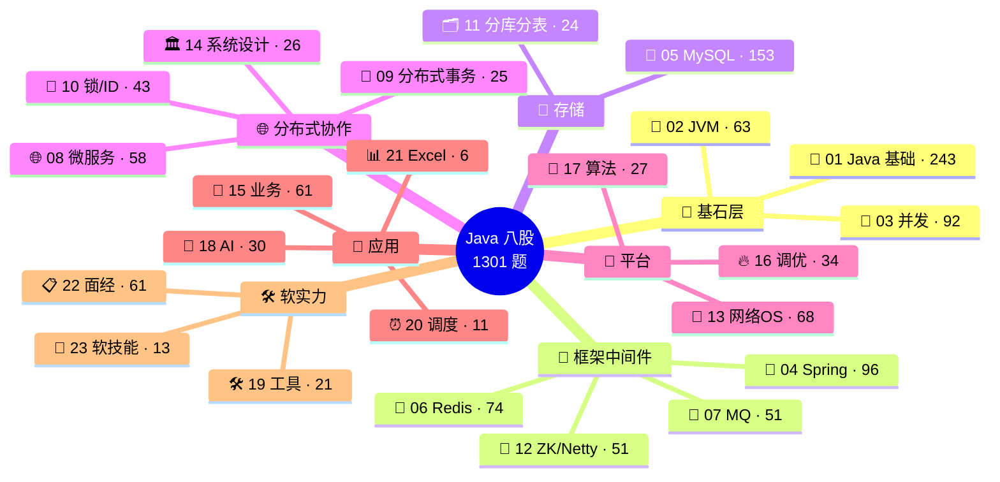

---

## 🗂️ 分层速记卡片墙

> 每层一行彩色方块，每个方块 = 一个类目 + 核心速记。横向并排，移动端 table 自适应换行。

### 🧱 基石层 · 语言根基

<table>
<tr>
<td width="33%" valign="top" style="background:#fef3c7;padding:10px;border:2px solid #d97706">

**🧬 01 Java 基础 · 243 题**

类型 · OO · 集合<br/>
异常 · IO · 反射<br/>
泛型 · Lambda · 设计模式

</td>
<td width="33%" valign="top" style="background:#fef3c7;padding:10px;border:2px solid #d97706">

**🧠 02 JVM · 63 题**

运行时内存区域<br/>
类加载 · 双亲委派<br/>
GC 算法 · 收集器 · JIT

</td>
<td width="33%" valign="top" style="background:#fef3c7;padding:10px;border:2px solid #d97706">

**🧵 03 并发 · 92 题**

线程池 · synchronized<br/>
AQS · JUC · CAS<br/>
ThreadLocal · 死锁

</td>
</tr>
</table>

### 🌱 框架 & 中间件层

<table>
<tr>
<td width="25%" valign="top" style="background:#d1fae5;padding:10px;border:2px solid #059669">

**🌱 04 Spring · 96 题**

IoC · AOP<br/>
事务 · 失效场景<br/>
Boot 启动 · 自动配置

</td>
<td width="25%" valign="top" style="background:#d1fae5;padding:10px;border:2px solid #059669">

**🔴 06 Redis · 74 题**

5 种数据结构<br/>
RDB / AOF 持久化<br/>
缓存一致性 · 集群

</td>
<td width="25%" valign="top" style="background:#d1fae5;padding:10px;border:2px solid #059669">

**📨 07 MQ · 51 题**

Kafka / Rocket / Rabbit<br/>
不丢 · 不重 · 顺序<br/>
堆积 · 事务消息

</td>
<td width="25%" valign="top" style="background:#d1fae5;padding:10px;border:2px solid #059669">

**🧰 12 中间件 · 51 题**

ES · ZK · Netty<br/>
MyBatis · Eureka<br/>
Tomcat 200 线程

</td>
</tr>
</table>

### 🐬 存储层

<table>
<tr>
<td width="50%" valign="top" style="background:#dbeafe;padding:10px;border:2px solid #2563eb">

**🐬 05 MySQL · 153 题**

B+ 树索引 · 回表 · 下推<br/>
事务 · MVCC · 隔离级别<br/>
行锁 · 间隙锁 · 死锁<br/>
慢 SQL 调优

</td>
<td width="50%" valign="top" style="background:#dbeafe;padding:10px;border:2px solid #2563eb">

**🗂️ 11 分库分表 · 24 题**

2^n 分片 · 取模算法<br/>
跨库 join · 分页 · 模糊<br/>
全局 ID · 扩容迁移

</td>
</tr>
</table>

### 🌐 分布式协作层

<table>
<tr>
<td width="25%" valign="top" style="background:#ede9fe;padding:10px;border:2px solid #7c3aed">

**🌐 08 微服务 · 58 题**

Feign · Dubbo<br/>
限流 · 熔断 · 降级<br/>
网关 · 雪崩防御

</td>
<td width="25%" valign="top" style="background:#ede9fe;padding:10px;border:2px solid #7c3aed">

**💱 09 分布式事务 · 25 题**

2PC / 3PC<br/>
TCC · Seata AT<br/>
本地消息表 · 事务消息

</td>
<td width="25%" valign="top" style="background:#ede9fe;padding:10px;border:2px solid #7c3aed">

**🔑 10 锁/ID · 43 题**

Redisson 四道防线<br/>
zk 临时顺序节点<br/>
雪花 · 号段 · UUID

</td>
<td width="25%" valign="top" style="background:#ede9fe;padding:10px;border:2px solid #7c3aed">

**🏛️ 14 系统设计 · 26 题**

CAP · BASE<br/>
容量估算公式<br/>
一致性哈希

</td>
</tr>
</table>

### 📡 平台层

<table>
<tr>
<td width="33%" valign="top" style="background:#fce7f3;padding:10px;border:2px solid #db2777">

**📡 13 网络 OS · 68 题**

TCP / HTTPS 握手<br/>
BIO / NIO / AIO<br/>
零拷贝 · 安全攻防

</td>
<td width="33%" valign="top" style="background:#fce7f3;padding:10px;border:2px solid #db2777">

**🧮 17 算法 · 27 题**

树 · 堆 · 位图<br/>
海量数据三件套<br/>
LRU / LFU

</td>
<td width="33%" valign="top" style="background:#fce7f3;padding:10px;border:2px solid #db2777">

**🔥 16 调优 · 34 题**

CPU 飙高排障链<br/>
OOM 排障链<br/>
慢 SQL 排障链

</td>
</tr>
</table>

### 🎯 应用层 · 业务落地

<table>
<tr>
<td width="25%" valign="top" style="background:#f3f4f6;padding:10px;border:2px solid #4b5563">

**🎯 15 业务 · 61 题**

秒杀 · 库存扣减<br/>
排行榜 · 短链<br/>
对账 · 海量导入

</td>
<td width="25%" valign="top" style="background:#f3f4f6;padding:10px;border:2px solid #4b5563">

**🤖 18 AI · 30 题**

API 参数 · Function Calling<br/>
Agent · Skill · MCP<br/>
Spring AI

</td>
<td width="25%" valign="top" style="background:#f3f4f6;padding:10px;border:2px solid #4b5563">

**⏰ 20 调度 · 11 题**

XXL-Job · @Scheduled<br/>
扫表跳页正解<br/>
时间轮

</td>
<td width="25%" valign="top" style="background:#f3f4f6;padding:10px;border:2px solid #4b5563">

**📊 21 Excel · 6 题**

POI / SXSSF / EasyExcel<br/>
大文件读写优化

</td>
</tr>
</table>

### 🛠️ 工程 & 软实力

<table>
<tr>
<td width="33%" valign="top" style="background:#f3f4f6;padding:10px;border:2px solid #4b5563">

**🛠️ 19 工具 · 21 题**

Git merge / rebase<br/>
Maven jar 冲突<br/>
IDEA · Linux 命令

</td>
<td width="33%" valign="top" style="background:#f3f4f6;padding:10px;border:2px solid #4b5563">

**📋 22 面经 · 61 题**

项目难点 & 亮点母题<br/>
按经验 + 业务挑模板

</td>
<td width="33%" valign="top" style="background:#f3f4f6;padding:10px;border:2px solid #4b5563">

**💬 23 软技能 · 13 题**

反问面试官 · 自评<br/>
缺点 · 加班看法<br/>
未来规划

</td>
</tr>
</table>

---

## 🌉 跨类目桥梁主题（速记内嵌）

> 这些是面试官最爱"串题"的 11 条高频路径。每张图的节点都已经把核心速记直接刻进去 —— **看图就能背答案**。

---

### 🔒 锁 —— 单机概念分布式重做一遍

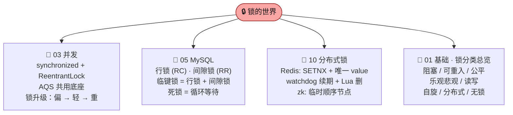

---

### 🌀 缓存一致性 —— 一种问题四个角度同时出题

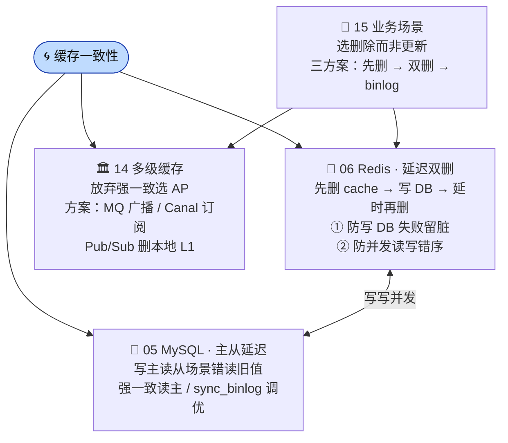

---

### 🚮 GC / STW —— 从算法到生产排障

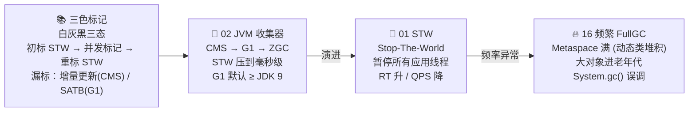

---

### ⚖️ CAP / 一致性 —— 理论到工程

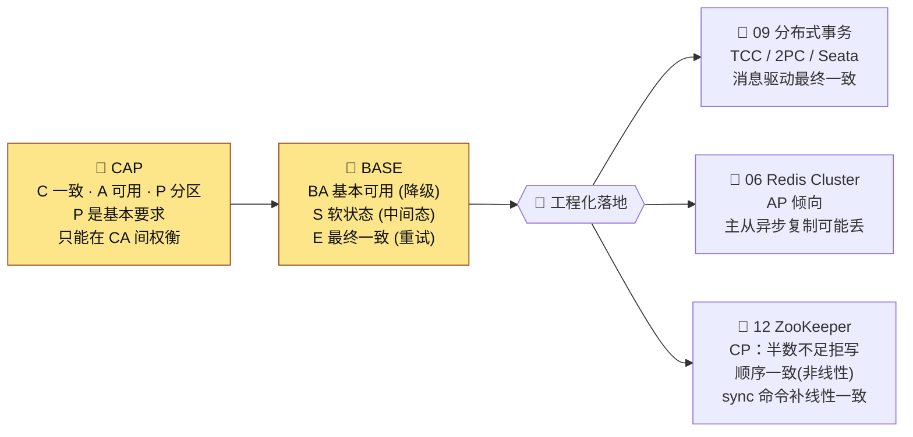

---

### 🚦 限流·熔断·降级·隔离 —— 雪崩防御四件套

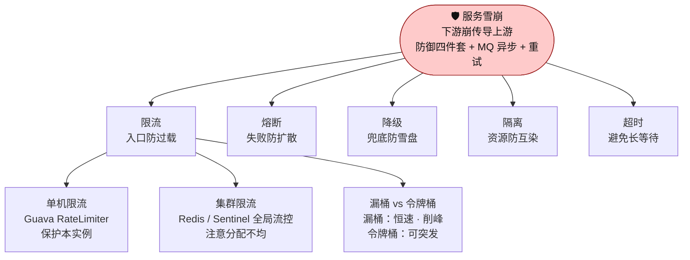

---

### 🆔 分布式 ID —— 跨三类目的必答题

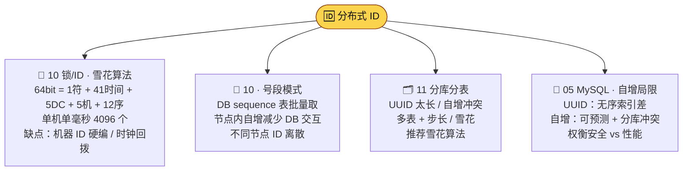

---

### ⚡ 零拷贝 —— 一个内核机制三处工业应用

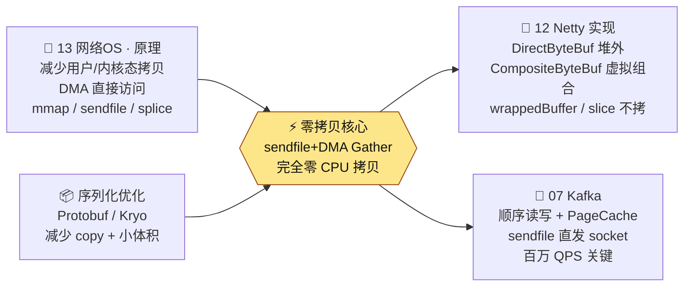

---

### ⚛️ CAS / 原子性 —— 从语言到硬件

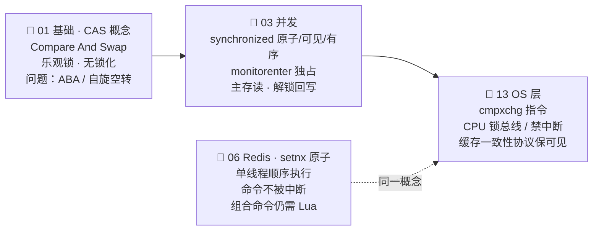

---

### 🧵 线程池 —— 一组参数三类应用

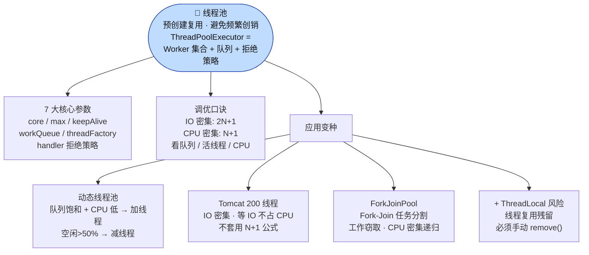

---

### 📦 序列化 —— 一处定义处处出题

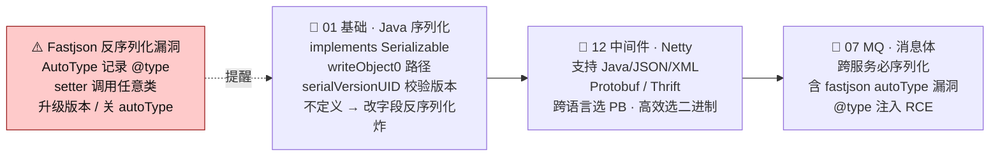

---

### 🌊 事务一致性 —— 从单机到分布式的完整链条

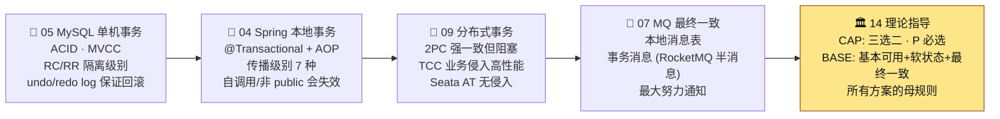

---

### 🔄 IO 演进 —— 从语言模型到框架实战

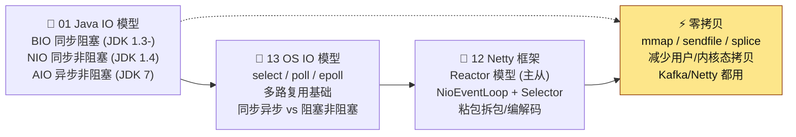

---

## 📇 题号反查表

> 觉得速记不够细，回到完整版 [全景图-current.md](./全景图-current.md) 用以下题号定位详细文件。

| 主题 | 涉及题号 |
|---|---|
| 🔒 锁 | `#0150`（锁分类）`#0181`（synchronized 升级）`#0290`（synchronized 原理）`#0728`（SETNX）`#0276`（watchdog） |
| 🌀 缓存一致性 | `#0218`（延迟双删）`#0219`（DB 与缓存一致）`#0144`（多级缓存） |
| 🚮 GC / STW | `#0155`（三色标记）`#0777`（STW）`#0354`（频繁 FullGC）`#0513`（Metaspace 排查） |
| ⚖️ CAP / BASE | `#1021`（CAP）`#1006`（BASE）`#0301`（zk CP）`#0203`（Redis 集群） |
| 🚦 雪崩四件套 | `#0004`（防雪崩）`#0171`（单机 vs 集群限流）`#0266`（漏桶/令牌桶） |
| 🆔 分布式 ID | `#0179`（雪花）`#0672`（号段）`#0566`（分表后全局 ID）`#0090`（UUID vs 自增） |
| ⚡ 零拷贝 | `#0152`（原理）`#1091`（Netty 实现） |
| ⚛️ CAS / 原子性 | `#0094`（synchronized 三性）`#0394`（OS 层 cmpxchg）`#0889`（Redis setnx 原子） |
| 🧵 线程池 | `#0073`（实现）`#0108`（7 大参数）`#0119`（调优）`#0277`（动态）`#0103`（Tomcat 200）`#0183`（ForkJoinPool）`#0135`（+ TL 风险） |
| 📦 序列化 | `#0430`（原理）`#0422`（serialVersionUID）`#0174`（Fastjson 漏洞）`#1037`（Netty 协议） |

---

<div align="center">

## 🎯 怎么用本图

</div>

| 场景 | 用法 |
|---|---|
| **面试前 30 分钟突击** | 只看 Phase 1 的 12 张桥梁图，每张节点就是答题骨架，直接背 |
| **闭眼默写** | 盖住节点速记，看图标只说类目，自己补出 3-5 行要点 |
| **盲区定位** | 某个节点你说不出 3 行 → 回到 [全景图-current.md](./全景图-current.md) 找该题号细背 |
| **类目深读** | 下方 Phase 2 已覆盖每个类目核心 6-8 题，更细节回原图 |

---

<div align="center">

## ─────── ⬇️ Phase 2 · 23 类目速记雷达图 ⬇️ ───────

</div>

> 每个类目挑 6-8 个核心题，雷达图节点直接挂 3-5 行速记。整套 Phase 2 共覆盖约 180 题，配合 Phase 1 的 35 题主题图 → 高频考点全打通。

---

### 🧬 01 · Java 基础（雷达图）

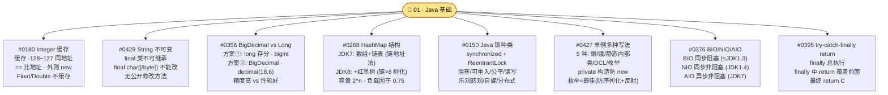

---

### 🧠 02 · JVM（雷达图）

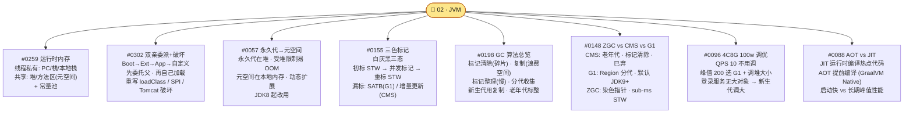

---

### 🧵 03 · 并发编程（雷达图）

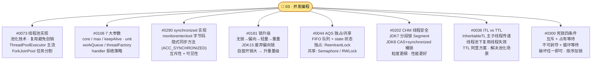

---

### 🌱 04 · Spring 体系（雷达图）

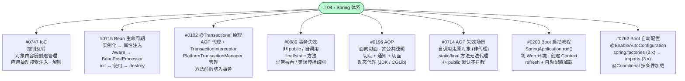

---

### 🐬 05 · MySQL（雷达图）

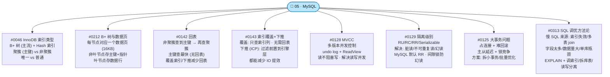

### 🔴 06 · Redis（雷达图）

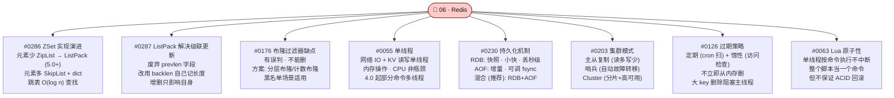

---

### 📨 07 · 消息队列（雷达图）

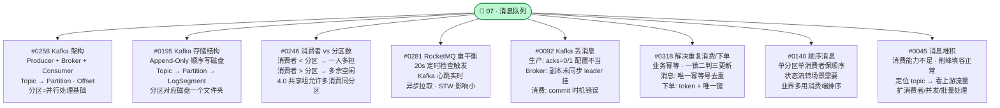

---

### 🌐 08 · 微服务（雷达图）

```mermaid
flowchart TD
    C(["🌐 08 · 微服务与分布式"])
    C --> T1["#0068 微服务通信<br/>RESTful + Feign / gRPC<br/>Dubbo / MQ 异步<br/>同步 vs 异步选型"]
    C --> T2["#0260 Feign vs OpenFeign<br/>Feign: Netflix 原版<br/>OpenFeign: Spring Cloud 封装<br/>+ Eureka/Ribbon 集成"]
    C --> T3["#0061 Dubbo 发现 vs 路由<br/>发现: 查注册中心拿地址<br/>路由: 按规则定向<br/>互补不冲突"]
    C --> T4["#0306 Ribbon vs Nginx<br/>Ribbon: 客户端负载 (应用内)<br/>Nginx: 服务端负载 + 反向代理<br/>独立部署 vs 集成"]
    C --> T5["#0916 限流 vs 熔断 vs 降级<br/>限流: 防过载 · 入口控流量<br/>熔断: 防扩散 · 失败快速失败<br/>降级: 保核心 · 关非核心功能"]
    C --> T6["#0307 Zuul/Gateway/Nginx<br/>Zuul: Netflix · 同步阻塞<br/>Gateway: Spring · Reactor 异步<br/>Nginx: web 服务器 + 反向代理"]
    C --> T7["#0991 SOA vs 微服务<br/>SOA: 服务重用 + ESB 重<br/>微服务: 无 ESB + 快速交付<br/>颗粒度更细"]
    C --> T8["#0943 Service Mesh<br/>Sidecar 解耦通信<br/>Istio / Linkerd / Envoy<br/>异构系统多语言适用"]
    style C fill:#bbf7d0,stroke:#15803d,color:#111
```

---

### 💱 09 · 分布式事务（雷达图）

```mermaid
flowchart TD
    C(["💱 09 · 分布式事务"])
    C --> T1["#0964 什么是分布式事务<br/>跨数据库/应用的事务<br/>方案: XA / TCC / 最大努力通知<br/>本地消息表 / 事务消息"]
    C --> T2["#0154 2PC<br/>协调者 + 参与者<br/>准备 → 提交两阶段<br/>协调者宕机阻塞全员"]
    C --> T3["#0153 3PC<br/>分准备为 CanCommit + PreCommit<br/>再加 DoCommit<br/>解决 2PC 协调者阻塞"]
    C --> T4["#0130 TCC vs 2PC<br/>TCC = Try + Confirm + Cancel<br/>业务侵入 · 性能更好<br/>需实现补偿逻辑"]
    C --> T5["#0067 Seata AT 原理<br/>TC (协调) + TM (管理) + RM (资源)<br/>无侵入 · 基于 undo_log 反向回滚<br/>需要全局锁保隔离"]
    C --> T6["#0133 Seata 4 模式<br/>AT (无侵入·关系型 DB)<br/>TCC (高性能·业务侵入)<br/>Saga (长事务) · XA (强一致)"]
    C --> T7["#0239 本地消息表<br/>本地事务 + 消息表同提交<br/>定时扫描重投 MQ<br/>最终一致 · 自实现"]
    C --> T8["#0673 事务消息<br/>MQ 半消息 + 本地事务回查<br/>RocketMQ 支持<br/>比本地消息表更强可靠"]
    style C fill:#ddd6fe,stroke:#6d28d9,color:#111
```

---

### 🔑 10 · 分布式锁与 ID（雷达图）

```mermaid
flowchart TD
    C(["🔑 10 · 分布式锁与 ID"])
    C --> T1["#0728 SETNX 实现锁<br/>SET if Not eXists<br/>Redis 单线程互斥<br/>配 EX 过期时间防死锁"]
    C --> T2["#0276 watchdog 续期<br/>默认每 10s 续期 · 续到 30s<br/>Netty 时间轮调度<br/>客户端释放 / 关闭停续"]
    C --> T3["#0138 Redisson 可重入<br/>Hash 存 lockName + 线程 ID<br/>同线程加锁 value+1<br/>释放 -1 到 0 才删"]
    C --> T4["#0697 Redis vs zk 锁<br/>Redis: AP · 高性能 · TTL 兜底<br/>zk: CP · 强一致 · 临时节点<br/>死锁友好: zk 更优"]
    C --> T5["#0179 雪花算法<br/>64bit = 1符+41时间+5DC+5机+12序<br/>单机单 ms 4096 个<br/>缺点: 机器 ID 硬编 · 时钟回拨"]
    C --> T6["#0079 时钟回拨<br/>方案: 等待 (短回拨)<br/>报错 (长回拨)<br/>拉新机器 ID (兜底)"]
    C --> T7["#0672 号段模式<br/>DB 表批量取号段 (如 1000-2000)<br/>节点内自增 · 减少 DB 交互<br/>不同节点 ID 离散"]
    C --> T8["#0091 UUID<br/>128bit · MAC+时间+随机数<br/>V3/V4 主流 · Java util.UUID<br/>缺点: 长 · 无序 · 索引差"]
    style C fill:#ddd6fe,stroke:#6d28d9,color:#111
```

---

### 🗂️ 11 · 分库分表（雷达图）

```mermaid
flowchart TD
    C(["🗂️ 11 · 分库分表"])
    C --> T1["#0607 什么是分库分表<br/>分库解决并发量<br/>分表解决数据量<br/>三种: 只分库 / 只分表 / 都分"]
    C --> T2["#0595 分区 vs 分表<br/>分区: 单库内拆 .ibd 文件<br/>分表: 多张物理表<br/>对应用透明度不同"]
    C --> T3["#0496 为啥 2^n 库表<br/>hash % N = hash & (N-1)<br/>位运算高效<br/>分库×分表 数据均匀分布"]
    C --> T4["#0565 分表算法<br/>取模 (数字)<br/>范围 (时间/地区)<br/>哈希取模 (字符串)"]
    C --> T5["#0095 分表字段选择<br/>业务高频查询字段<br/>电商一般用 买家 ID<br/>避免数据倾斜 (热点店铺)"]
    C --> T6["#0510 跨库 join<br/>应用层合并 (主流)<br/>字段冗余 / 全局表 / ER 分片<br/>不推荐数据库直接 join"]
    C --> T7["#0551 分页查询<br/>跨库 limit offset 难<br/>业务折衷: 按买家分 · 卖家走 ES<br/>全局视野/二次查询成本高"]
    C --> T8["#0566 分表后全局 ID<br/>单表自增冲突<br/>UUID 长慢 · 号段模式可<br/>推荐雪花算法"]
    style C fill:#bae6fd,stroke:#0369a1,color:#111
```

---

### 🧰 12 · 其他中间件（雷达图）

```mermaid
flowchart TD
    C(["🧰 12 · 其他中间件"])
    C --> T1["#0065 ES 集群角色<br/>主节点 (管理 · 选举 3/5 个)<br/>数据节点 / 协调节点 / Ingest<br/>分离角色防脑裂"]
    C --> T2["#0116 ES 深度分页<br/>from+size 上限 10000<br/>scroll: 快照式深翻<br/>search_after: 实时 · 不能跳页"]
    C --> T3["#0301 zk CP<br/>半数不足拒写<br/>Master 选举期不可写<br/>Zab 协议保数据同步"]
    C --> T4["#1075 Netty 线程模型<br/>Reactor 模型 + 多路复用<br/>单/主从 Reactor 多线程<br/>BossGroup + WorkerGroup"]
    C --> T5["#1062 粘包/拆包<br/>定长 FixedLengthFrameDecoder<br/>行分隔 LineBasedFrameDecoder<br/>分隔符/长度字段/自定义协议"]
    C --> T6["#0956 MyBatis #{} vs ${}<br/>#{}: 预编译 PreparedStatement<br/>${}: 字符串拼接 · 注入风险<br/>order by/动态表名 必用 ${}"]
    C --> T7["#0980 MyBatis vs Hibernate<br/>MyBatis: 半自动 · 写 SQL · 灵活<br/>Hibernate: 全自动 · ORM 完整<br/>国内主流 MyBatis"]
    C --> T8["#1054 Eureka vs zk<br/>Eureka: AP · 注册中心专用<br/>zk: CP · 协调服务<br/>注册中心首选 Eureka/Nacos"]
    style C fill:#bbf7d0,stroke:#15803d,color:#111
```

---

### 📡 13 · 网络与操作系统（雷达图）

```mermaid
flowchart TD
    C(["📡 13 · 网络与操作系统"])
    C --> T1["#0072 HTTPS 握手<br/>TCP 3 次握手<br/>+ TLS 1.2 (4 步) / 1.3 (2 步)<br/>验证证书 + 协商密钥"]
    C --> T2["#0221 HTTP 版本<br/>1.0 短连接 · 1.1 keepalive<br/>2 二进制+多路复用+HPACK<br/>3 基于 QUIC (UDP)"]
    C --> T3["#0353 同步异步阻塞非阻塞<br/>同步异步: 被调用方视角<br/>阻塞非阻塞: 调用方视角<br/>4 象限组合"]
    C --> T4["#0152 零拷贝<br/>减少用户/内核态拷贝<br/>DMA 直接访问硬件<br/>mmap / sendfile / splice"]
    C --> T5["#0394 CAS OS 层原理<br/>cmpxchg 指令原子<br/>CPU 锁总线 / 禁中断<br/>硬件保证 · 缓存一致性协议"]
    C --> T6["#0530 加密 vs 签名<br/>加密保隐私 (对称/非对称)<br/>签名保完整+真实<br/>加签=Hash+私钥 / 验签=公钥"]
    C --> T7["#0518 SQL 注入<br/>用户输入拼 SQL<br/>防御: 预编译/参数化/输入过滤<br/>MyBatis 用 #{}"]
    C --> T8["#0086 SaaS 多租户<br/>共享 DB + tenant_id (低成本)<br/>共享 DB 独立 schema (中)<br/>独立 DB (强隔离 · 贵)"]
    style C fill:#fbcfe8,stroke:#9d174d,color:#111
```

---

### 🏛️ 14 · 系统设计与高并发（雷达图）

```mermaid
flowchart TD
    C(["🏛️ 14 · 系统设计与高并发"])
    C --> T1["#1021 CAP 理论<br/>C 一致 + A 可用 + P 分区容错<br/>三者只能取二<br/>P 必选 · 在 CP 与 AP 间权衡"]
    C --> T2["#1006 BASE 理论<br/>基本可用 + 软状态 + 最终一致<br/>CAP 工程化延伸<br/>中间状态 + 重试 + 降级"]
    C --> T3["#1022 一致性分类<br/>强一致 (实时见最新)<br/>弱一致 (允许不一致)<br/>最终一致 (经一段时间收敛)"]
    C --> T4["#1181 一致性哈希<br/>哈希环 2^32 槽位<br/>节点变动数据迁移最少<br/>虚拟节点解决倾斜"]
    C --> T5["#0902 QPS 预估<br/>业务类型 + 用户基数<br/>行为频次 × 峰值倍数<br/>压测取真实值"]
    C --> T6["#1002 3000QPS 几台机器<br/>单线程 = 1000ms / RT<br/>RT 200ms → 单线程 5/s<br/>Tomcat 200 线程 → 单机 1000/s"]
    C --> T7["#0765 架构=权衡<br/>多目标取舍 · 无银弹<br/>一致 vs 可用<br/>性能 vs 成本 · 简单 vs 扩展"]
    C --> T8["#1270 高并发设计<br/>分布式 + 集群 + 负载均衡<br/>缓存 + 异步 + 预加载<br/>限流 + 降级 + 熔断"]
    style C fill:#ddd6fe,stroke:#6d28d9,color:#111
```

---

### 🎯 15 · 业务场景题（雷达图）

```mermaid
flowchart TD
    C(["🎯 15 · 业务场景题"])
    C --> T1["#0244 库存高并发扣减<br/>排队 / 拆分 / 批次执行<br/>Redis 预扣 + MQ 异步落库<br/>数据库热点行 patch"]
    C --> T2["#0217 阿里抗秒杀<br/>MySQL + hint 抗热点行<br/>COMMIT_ON_SUCCESS · ROLLBACK_ON_FAIL<br/>RDS 已开放使用"]
    C --> T3["#0316 重复下单<br/>商品详情页: token + 品+用户<br/>购物车: cart_item_id 唯一<br/>加购首生成 · 修改数量不重新生成"]
    C --> T4["#0066 订单到期关闭<br/>定时任务 (推荐) · 适合多数<br/>DelayQueue/时间轮 (内存)<br/>MQ 延时消息"]
    C --> T5["#0191 数据对账<br/>实时对账 (准实时·秒级延迟)<br/>离线对账 (D+1 / T+1)<br/>SQL 核对 or 写代码核对"]
    C --> T6["#0205 百万排行榜<br/>ZSet 基础实现<br/>大 key 问题 (>1w 元素)<br/>拆分/限榜单长度/异步更新"]
    C --> T7["#0204 敏感词过滤<br/>小: contains/正则<br/>大: DFA / AC 自动机 / Trie<br/>多模式匹配 O(N+M)"]
    C --> T8["#0249 短链服务<br/>发号器 + base62 短码<br/>映射存储 (Redis+DB)<br/>302 跳转 + 热门缓存"]
    style C fill:#e5e7eb,stroke:#374151,color:#111
```

---

### 🔥 16 · 性能调优与故障排查（雷达图）

```mermaid
flowchart TD
    C(["🔥 16 · 性能调优"])
    C --> T1["#0184 CPU 飙高<br/>top 找 PID<br/>top -H -p PID 找 TID<br/>printf %x → jstack 定位代码"]
    C --> T2["#0187 OOM 排查<br/>-XX:+HeapDumpOnOutOfMemoryError<br/>jmap dump → MAT 分析<br/>大对象 / 类泄漏 / TL 残留"]
    C --> T3["#0513 频繁 FullGC<br/>Metaspace 满 (动态类堆积)<br/>类卸载需 3 条件全满足<br/>Aviator 表达式缓存优化"]
    C --> T4["#0484 慢 SQL<br/>慢查询日志定位<br/>EXPLAIN: type/key/rows/extra<br/>不符合最左前缀 → 索引调整"]
    C --> T5["#0567 数据库死锁<br/>show engine innodb status<br/>看 LATEST DETECTED DEADLOCK<br/>分析索引/事务/加锁顺序"]
    C --> T6["#0265 索引失效排查<br/>EXPLAIN type=ALL · key=NULL<br/>函数索引/like 前 %/隐式转换<br/>不符合最左前缀"]
    C --> T7["#0580 RT 飙高<br/>Arthas trace 查链路<br/>找慢节点 (DB/外部/锁/GC)<br/>定位后针对性优化"]
    C --> T8["#0626 压测过线上挂<br/>冷启动 (缓存未预热 · JIT 未编译)<br/>数据倾斜 · 真实流量分布<br/>外部依赖 · 配置不一致"]
    style C fill:#fbcfe8,stroke:#9d174d,color:#111
```

---

### 🧮 17 · 数据结构与算法（雷达图）

```mermaid
flowchart TD
    C(["🧮 17 · 数据结构与算法"])
    C --> T1["#0600 树有哪些<br/>二叉树 / 多叉树<br/>B+ (DB 索引) · B* · AVL · 红黑<br/>字典树/霍夫曼树"]
    C --> T2["#0040 堆是什么<br/>完全二叉树<br/>大顶堆/小顶堆<br/>数组存: parent=(x-1)/2"]
    C --> T3["#0584 前缀树 Trie<br/>字符串前缀检索<br/>根节点不含字符<br/>查找 O(M) · 用于自动补全"]
    C --> T4["#0883 BitMap 位图<br/>bit 数组 · 一位标记一个元素<br/>极省空间 (40亿数字仅 476M)<br/>去重 / 排序 / 布隆过滤底层"]
    C --> T5["#0608 LRU vs LFU<br/>LRU: 最久未访问淘汰<br/>LFU: 最少访问次数淘汰<br/>LRU = HashMap + 双向链表"]
    C --> T6["#0120 1TB/32GB 排序<br/>外部归并排序<br/>分块快排 (36 块×30G)<br/>多路归并 (优先队列)"]
    C --> T7["#0669 1TB Top10 关键词<br/>哈希分片 (murmurhash)<br/>分片内 hash 统计词频<br/>最大堆+最小堆求 TopK"]
    C --> T8["#0774 40亿 QQ 去重<br/>直接存 14.9G 超内存<br/>位图: 1bit/数<br/>40亿/8 = 476M"]
    style C fill:#fbcfe8,stroke:#9d174d,color:#111
```

---

### 🤖 18 · AI 与大模型（雷达图）

```mermaid
flowchart TD
    C(["🤖 18 · AI 与大模型"])
    C --> T1["#0023 大模型 API 参数<br/>base_url / api_key / model<br/>temperature / max_tokens<br/>messages / tools / stream"]
    C --> T2["#0014 Function Calling<br/>OpenAI 提出 · 让模型用工具<br/>tools 字段结构化定义<br/>模型返回 tool_call 调用参数"]
    C --> T3["#0027 Agent Skill<br/>Anthropic 推出<br/>解决 Agent 上下文太长<br/>标准化能力模块 (SKILL.md)"]
    C --> T4["#0026 Skill vs MCP<br/>MCP: 工具协议 · 接入数据/工具<br/>Skill: 任务封装 · 怎么做<br/>Agent + MCP 工具箱 + Skill 菜谱"]
    C --> T5["#0005 单 vs 多 Agent<br/>优先单 Agent (奥卡姆剃刀)<br/>线性任务无需多 Agent<br/>仅复杂分工才用多 Agent"]
    C --> T6["#0009 Harness/Prompt/Context<br/>Prompt: 写一句话让模型听话<br/>Context: 给资料 (RAG)<br/>Harness: 包工程 (层层嵌套)"]
    C --> T7["#0021 Spring AI Advisor<br/>插件式拦截 AI 交互<br/>Memory / Logging Advisor<br/>实现 Ordered 接口"]
    C --> T8["#0022 ChatModel vs ChatClient<br/>ChatModel: 引擎 · 底层通信<br/>ChatClient: 驾驶舱 · Fluent API<br/>类比 JDBC Connection vs Spring JDBC"]
    style C fill:#e5e7eb,stroke:#374151,color:#111
```

---

### 🛠️ 19 · 工具与工程（雷达图）

```mermaid
flowchart TD
    C(["🛠️ 19 · 工具与工程"])
    C --> T1["#0563 merge vs rebase<br/>merge: 保留分叉 · merge commit<br/>rebase: 线性化 · 改写历史<br/>已 push 慎用 rebase"]
    C --> T2["#0592 reset vs revert<br/>reset: 移指针改历史 (危险)<br/>revert: 反向 commit 保留历史<br/>已推用 revert 安全"]
    C --> T3["#0605 Maven jar 冲突<br/>最短路径优先 + 最先声明优先<br/>exclusions 排除冲突包<br/>dependency:tree 排查"]
    C --> T4["#0574 jar vs war<br/>jar: 类库 · 可执行 · main 入口<br/>war: Web 应用 · WEB-INF<br/>Spring Boot 默认 fat jar"]
    C --> T5["#0547 单元测试<br/>JUnit + Mockito 组合<br/>覆盖核心逻辑 · 独立可重复<br/>测试金字塔: 单测 > 集成 > E2E"]
    C --> T6["#0492 Linux 常用命令<br/>top/df/du (资源)<br/>ps/grep/find (查找)<br/>tail/awk/sed (日志处理)"]
    C --> T7["#0491 日志分析<br/>tail -f 实时滚动<br/>less + / 翻页搜索<br/>grep + awk 统计 / ELK 平台"]
    C --> T8["#0466 Lombok 谨慎用<br/>编译期生成代码<br/>@Data 暴露所有字段<br/>升级风险 · 团队约定 IDE 插件"]
    style C fill:#e5e7eb,stroke:#374151,color:#111
```

---

### ⏰ 20 · 任务调度（雷达图）

```mermaid
flowchart TD
    C(["⏰ 20 · 任务调度"])
    C --> T1["#0029 XXL-Job vs @Scheduled<br/>XXL: 分布式 + 分片 + 重试 + UI<br/>@Scheduled: 单机简单注解<br/>集群冲突需自加锁"]
    C --> T2["#1201 Spring Task vs XXL<br/>Spring Task: 轻量单机 · cron<br/>XXL: 分布式调度 · 工业级<br/>小任务用 Task · 大用 XXL"]
    C --> T3["#0621 XXL 一任务一次<br/>调度中心 DB 锁保一致性<br/>JobScheduleHelper 协调<br/>同一时间只一个执行器执行"]
    C --> T4["#0549 XXL-Job 分片任务<br/>大任务拆多个子任务并行<br/>shard index + shard total<br/>每个执行器按取模处理一份"]
    C --> T5["#0550 扫表方案缺点<br/>数据多扫表慢<br/>集中扫表影响业务<br/>延迟问题 · 加索引/分片"]
    C --> T6["#0264 避免跳页<br/>用 WHERE id > lastId LIMIT n<br/>不用 LIMIT offset, n<br/>状态变化会导致漏行"]
    C --> T7["#0685 @Scheduled 集群并发<br/>分布式锁 (Redis/zk)<br/>DB 悲观锁 select for update<br/>非阻塞 tryLock · 抢到才执行"]
    C --> T8["#0576 时间轮<br/>分槽位 · 指针走动触发<br/>单层限制 (60 槽 = 60s)<br/>多层时间轮 (分/时/天)"]
    style C fill:#e5e7eb,stroke:#374151,color:#111
```

---

### 📊 21 · Excel 与文件处理（雷达图）

```mermaid
flowchart TD
    C(["📊 21 · Excel 与文件处理"])
    C --> T1["#0535 POI 介绍+OOM<br/>Apache 开源 Office 工具<br/>XSSFWorkbook DOM 全加载<br/>2MB 文件 → 内存十几 MB OOM"]
    C --> T2["#0509 SXSSF 省内存<br/>滑动窗口 + 写临时磁盘<br/>rowAccessWindowSize 内存行数<br/>超出 flush 最老的"]
    C --> T3["#0524 POI 大文件写<br/>用 SXSSFWorkbook (流式版)<br/>API 与 XSSF 兼容<br/>只支持写 · 不支持随机读"]
    C --> T4["#0250 EasyExcel 省内存<br/>SAX 流式解析 (vs DOM)<br/>100w 行: POI 1.5G · EE 50-100M<br/>事件回调 · 逐行处理"]
    C --> T5["#0251 EasyExcel 大文件读<br/>POI SXSSF 只能写不能读<br/>大文件读首选 EasyExcel<br/>基于 SAX 逐行回调"]
    C --> T6["#1166 EasyExcel+线程池<br/>Controller 立即返回任务 ID<br/>异步线程池导出<br/>预签名 URL · 1h 过期"]
    style C fill:#e5e7eb,stroke:#374151,color:#111
```

---

### 📋 22 · 面经与项目分享（雷达图）

```mermaid
flowchart TD
    C(["📋 22 · 面经母题"])
    C --> T1["#0327 项目难点&亮点<br/>性能优化 / 安全 / 代码质量<br/>UX / 创新技术<br/>STAR 原则展开"]
    C --> T2["#0020 24届 LLM 应用<br/>AI 网关 apisix + Java<br/>限流计费 · 100+ 模型接入<br/>厂商规范定制 · 日志聚合"]
    C --> T3["#0024 27届 数藏项目<br/>订单/交易/用户模块<br/>MQ 事务消息 + Redis 预扣<br/>秒杀压测 · 多线程导入去重"]
    C --> T4["#0085 大模型 RAG<br/>langchain4j + 智能客服<br/>OCR + 混合检索<br/>分块 → 向量化 → 检索"]
    C --> T5["#0193 3年电商财务<br/>银行直联 · 大额支付<br/>网关 + 模板策略<br/>幂等 + 异常 case + 对账"]
    C --> T6["#0208 3年物流<br/>物流调度 + 运费计算<br/>第三方支付 + 回调<br/>信号量 + 异步线程 + 轮询"]
    C --> T7["#0339 9年停车系统<br/>管 700+ 停车场<br/>入场高 QPS + 策略模式<br/>RT 1.5s · 接入层+网关+订单+支付"]
    style C fill:#e5e7eb,stroke:#374151,color:#111
```

---

### 💬 23 · 软技能与面试准备（雷达图）

```mermaid
flowchart TD
    C(["💬 23 · 软技能"])
    C --> T1["#1000 反问面试官<br/>公司文化 / 团队组织架构<br/>新人指导机制<br/>职位职责 / 项目技术栈"]
    C --> T2["#0938 自我评价<br/>突出优点 + 适当不足<br/>专业/态度/学习/成就<br/>诚实自信"]
    C --> T3["#1016 缺点回答<br/>避免提脾气/合作差/迟到<br/>经验不足 + 强学习能力<br/>管理能力欠缺 + 在锻炼"]
    C --> T4["#0972 最成就感经历<br/>STAR 原则<br/>Situation/Task/Action/Result<br/>突出贡献和技能"]
    C --> T5["#0973 团队冲突解决<br/>决策前充分表达观点<br/>决策后坚定执行<br/>一句话总结很关键"]
    C --> T6["#0985 未来发展规划<br/>技术: 2 年到专家水平<br/>业务: 2-3 年成领域专家<br/>架构&管理: 综合能力"]
    style C fill:#e5e7eb,stroke:#374151,color:#111
```

---

<div align="center">

## 🎓 Phase 2 使用建议

</div>

| 场景 | 用法 |
|---|---|
| **类目突击** | 选 1-2 个薄弱类目 · 打开雷达图 · 盖住每个节点的速记部分 · 自己默说 3 行 |
| **盲点定位** | 雷达图某节点说不出 3 行 → 回 [全景图-current.md](./全景图-current.md) 找题号详细背 |
| **跨类目串题** | 先看 Phase 1 桥梁图 (核心 35 题) · 再用 Phase 2 雷达图巩固类目内细节 |
| **碎片复习** | 每天挑 2-3 张雷达图 · 一张 8 节点 ≈ 5 分钟过一遍 |

---

<sub>📅 维护说明：本文已完成全部交付。**Phase 1** = 全景大图 + **12 个**跨类目桥梁主题图（约 40 高频题眼）。**Phase 2** = 23 类目 × 6-8 题速记雷达图（约 180 题）。合计 **≈ 220 题速记内嵌**。所有节点速记基于源仓库 `D:\...\java8gu-速记版\{类目}\{题号}_*.md` 的 `## 速记` 小节提炼。AI 整理 · 2026-05</sub>
