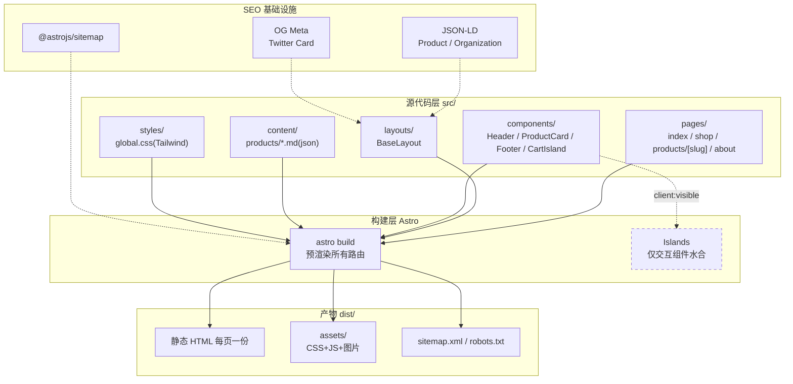
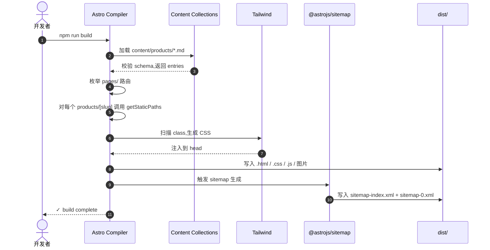
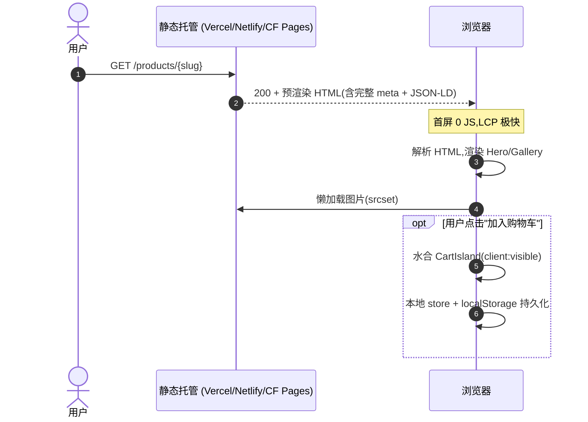

# kai-shop 项目初始化 - 技术方案

> **最后更新日期**：2026-05-13
> **定位**：电商独立站(展销极具性价比商品),SEO 极佳,视觉风格参考 [thegithubshop.com](https://thegithubshop.com/),独立于 kai-toolbox 仓库,纯前端静态站。

---

## 变更记录

| 版本 | 日期 | 变更内容摘要 |
|------|------|--------------|
| v1 | 2026-05-13 | 初始版本:确定技术栈、目录结构、SEO 策略、首批页面骨架 |

---

## 1. 目标与边界

- **要解决的问题**:展销自营性价比商品,通过 SEO 自然流量获客,提升品牌高级感,沉淀独立资产(不依赖第三方店铺平台)。
- **本次目标**:
  - 建立纯静态构建的独立站项目骨架
  - 跑通首页 / 商品列表 / 商品详情 / 关于 4 页通路
  - SEO 基础设施完备(sitemap / robots / 结构化数据 / OG)
  - 视觉风格达到「GitHub Shop」级精致度(留白、单色调、克制排版)
- **不做什么**(本期外):
  - 用户登录、订单系统、支付集成 → 后续可对接 Shopify Buy Button / Stripe Checkout / Snipcart 等无服务端方案
  - CMS 后台 → 商品数据先用 Markdown / JSON,后期可上 Decap CMS / Sanity
  - 评论系统、用户中心、推荐算法
- **设计结论(一句话)**:**Astro + Tailwind CSS + Content Collections**,输出纯静态 HTML(每页预渲染),局部岛屿化加交互(购物车 UI、搜索),零运行时框架税。

### 为什么不是纯手写 HTML

| 维度 | 纯 HTML | Astro 静态输出 |
|------|---------|---------------|
| SEO | 优秀(每页静态) | 优秀(产物同样是静态 HTML) |
| 组件复用 | ❌ 商品卡片复制 50 次 | ✅ 一个 `.astro` 组件渲染整个目录 |
| 数据驱动 | ❌ 改个价格要改 N 个文件 | ✅ Content Collections + 一份 frontmatter |
| 上手成本 | 几乎为零 | Node 18+ + npm,5 分钟脚手架 |
| 浏览器双击预览 | ✅ | 需 `npm run dev` 或部署 |
| 长期维护 | 灾难 | 工程化 |

结论:工程化收益碾压"双击打开"的便利。要真正"高大上",必须能维护。

### 为什么不是 Next.js / Nuxt

- Next.js:默认带 React 运行时,首屏 JS 体积比 Astro 大;SSR/ISR 强,但本站静态足够。
- Nuxt:Vue 生态,本站不需要复杂状态。
- Astro 的「岛屿架构」最贴本场景:默认 0 JS,仅交互组件水合;SEO/Lighthouse 默认满分。

---

## 2. 整体架构



---

## 3. 模块拆分与职责

### 3.1 BaseLayout(layouts/BaseLayout.astro)

- **定位**:全站统一外壳,SEO meta 唯一来源。
- **职责**:
  - 渲染 `<html><head>`(title / description / canonical / OG / Twitter / JSON-LD slot)
  - 注入 Header / Footer
  - 加载 Tailwind 全局样式
- **上游**:所有 page
- **下游**:Header / Footer / Tailwind
- **关键设计点**:props 接收 `title`/`description`/`image`/`type`/`jsonLd`,杜绝散落 meta。

### 3.2 Pages(pages/*.astro)

- **定位**:Astro 文件路由,每个文件一条 URL。
- **职责**:
  - `index.astro` - 首页(Hero + 精选商品 + 品牌叙事 + 三栏特色 + CTA)
  - `shop/index.astro` - 商品列表(网格 + 分类筛选)
  - `products/[slug].astro` - 商品详情(动态路由,从 Content Collection 生成)
  - `about.astro` - 品牌故事
- **关键设计点**:`getStaticPaths()` 在构建时枚举所有商品 slug。

### 3.3 Components(components/*.astro)

- **职责**(各组件单文件):
  - `Header.astro` - 顶部 logo + 极简导航 + 购物车图标
  - `Footer.astro` - 简约 footer + 邮件订阅占位
  - `ProductCard.astro` - 商品卡片(图 + 标题 + 价格 + hover 微动效)
  - `ProductGrid.astro` - 多列响应式网格
  - `Hero.astro` - 首页大图区
  - `SeoHead.astro` - 由 BaseLayout 内部使用
- **关键设计点**:全部默认 0 JS;只有需要交互的组件(购物车下拉)才 `client:visible`。

### 3.4 Content Collections(content/products/*.md)

- **定位**:商品数据源,frontmatter 即 schema。
- **职责**:
  - 每个商品一个 `.md`(slug 即文件名)
  - frontmatter:`title / price / currency / images / category / sku / inStock / featured / description`
  - 正文支持 Markdown(长文案、规格表)
- **关键设计点**:`content/config.ts` 用 Zod 定义 schema,构建期类型校验,防止字段缺失。

### 3.5 SEO 基础设施

- **职责**:
  - `@astrojs/sitemap` 集成 - 构建期自动生成 `sitemap-index.xml`
  - `public/robots.txt` - 允许全爬,指向 sitemap
  - 每页 JSON-LD - 商品详情页注入 `Product` schema(包含 price/availability),首页注入 `Organization`
  - canonical URL + hreflang(预留)
  - 图片懒加载(Astro `<Image>` 自动 srcset)

---

## 4. 关键交互

### 4.1 构建流程(开发期 → 静态产物)

> 触发:开发者执行 `npm run build`
> 参与方:Astro 编译器 / Content Collections / Tailwind / Sitemap 插件



### 4.2 用户浏览商品详情(线上)

> 触发:用户从搜索引擎进入商品详情
> 参与方:浏览器 / CDN



---

## 5. 核心业务规则

| 规则 | 说明 |
|------|------|
| 每个商品必须有 OG image | 没有则用默认品牌图,避免社交分享空白 |
| 价格统一两位小数 | `Intl.NumberFormat(currency)` 渲染,不在 frontmatter 中预格式化 |
| URL slug 全小写连字符 | `slug` 来自文件名,禁止中文/空格/大写 |
| canonical URL 必须存在 | BaseLayout 默认 `Astro.url.pathname`,可被 page 覆盖 |
| 商品下架(`inStock: false`)仍保留页面 | 不返 404,仅在 UI 显示"暂时缺货",保留 SEO 权重 |
| 图片必须有 alt | Image 组件强制 alt prop |

---

## 6. 编码落点

```text
D:\Users\zhang\IdeaProjects\kai-shop\
├── astro.config.mjs                       [新增] Astro 配置 + sitemap 集成
├── tailwind.config.mjs                    [新增] Tailwind 主题(自定义字体/色板)
├── tsconfig.json                          [新增] strict TS
├── package.json                           [新增] 依赖清单
├── README.md                              [新增] 项目说明 + 开发命令
├── .gitignore                             [新增]
├── public/
│   ├── robots.txt                         [新增] 指向 sitemap
│   └── favicon.svg                        [新增] 占位
└── src/
    ├── content/
    │   ├── config.ts                      [新增] products collection Zod schema
    │   └── products/
    │       ├── minimalist-tote.md         [新增] 示例商品 1
    │       ├── ceramic-mug-charcoal.md    [新增] 示例商品 2
    │       ├── linen-cap.md               [新增] 示例商品 3
    │       └── leather-notebook.md        [新增] 示例商品 4
    ├── layouts/
    │   └── BaseLayout.astro               [新增] SEO meta + Header + Footer
    ├── components/
    │   ├── Header.astro                   [新增]
    │   ├── Footer.astro                   [新增]
    │   ├── Hero.astro                     [新增]
    │   ├── ProductCard.astro              [新增]
    │   ├── ProductGrid.astro              [新增]
    │   └── SectionHeading.astro           [新增]
    ├── pages/
    │   ├── index.astro                    [新增] 首页
    │   ├── about.astro                    [新增] 品牌故事
    │   ├── shop/
    │   │   └── index.astro                [新增] 商品列表
    │   └── products/
    │       └── [slug].astro               [新增] 商品详情动态路由
    └── styles/
        └── global.css                     [新增] Tailwind 入口 + 字体引入
```

---

## 7. 数据与依赖变更

| 类型 | 是否变化 | 说明 |
|------|----------|------|
| 数据库表 / 字段 / 索引 | 无 | 纯静态站 |
| DTO / VO / 枚举 | 有 | `content/config.ts` 定义 product schema |
| 下游接口 / 外部依赖 | 有 | 新引入:`astro`、`@astrojs/sitemap`、`@astrojs/tailwind`、`tailwindcss`、`@astrojs/check`、`typescript` |
| 缓存 / 消息 / 锁 / 事务 | 无 | |

---

## 8. 风险与待确认

| 风险 / 待确认点 | 影响 | 处理方式 |
|----------------|------|----------|
| 商品图占位 | 视觉缺失 | 本期用 Unsplash 占位 URL,后续替换为真实拍摄图 |
| 域名未定 | sitemap site URL 占位 | `astro.config.mjs` 中 `site` 暂用 `https://kai-shop.example.com`,部署前替换 |
| 购物车结算 | 暂无后端 | 本期仅 UI 框架,实际交易后续接 Stripe Checkout / Shopify Buy Button |
| 多语言 | 当前仅中文/英文混排 | 后续上 `@astrojs/i18n` 路由前缀方案,本期 URL 预留 hreflang 占位 |
| 库存与价格变更频率 | 静态站需重建 | Vercel/Netlify webhook 触发重建;高频变价需上 ISR/SSR |

---

## 9. 验证要点

- **正常路径**:`npm run dev` 起服务,本机访问 `/`、`/shop`、`/products/minimalist-tote`、`/about` 均 200 且首屏完整;`npm run build` 产物中每页 HTML 含完整 title/description/OG。
- **异常路径**:访问不存在的商品 slug → 404 页面;商品 frontmatter 缺字段 → 构建期 Zod 报错。
- **边界条件**:Lighthouse 跑 4 大类(Performance/Accessibility/Best Practices/SEO)目标全 ≥ 95。
- **回归范围**:每次新增商品 md,只需 `npm run build` 即可生成新页 + 更新 sitemap;无需改代码。
