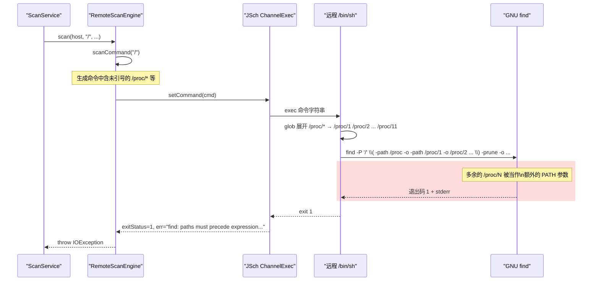
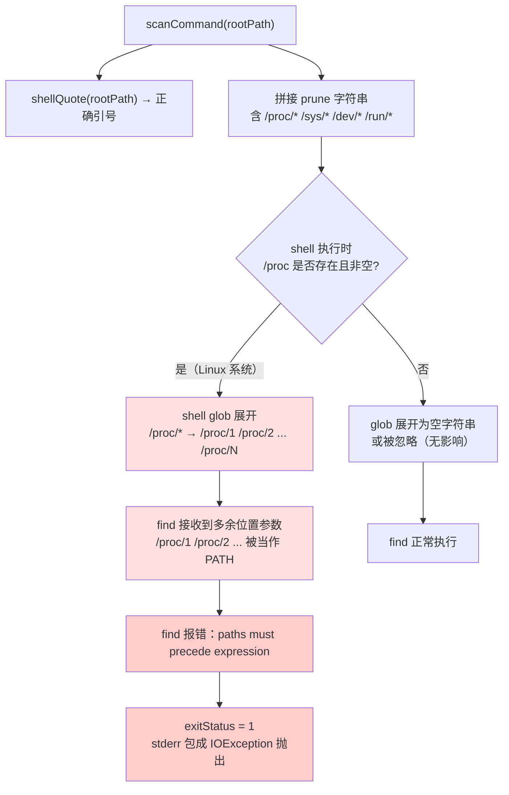
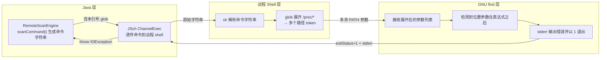

# SSH 扫描 prune 通配符被 shell 展开导致 find 报错

## 问题背景

- 功能路径：treesize → SSH 主机扫描（`startSshScan`）
- 现象：对远程 Linux 系统执行 SSH 扫描时（尤其是扫描根目录 `/`），扫描任务抛出 `IOException`，错误来自远程 `find` 命令的 stderr
- 复现参数：

```json
{
  "sourceType": "SSH",
  "sshHostId": "<任意已保存主机>",
  "path": "/"
}
```

- 错误日志：

```
04:43:39.899 ERROR [treesize-scan-3] c.e.t.treesize.service.ScanService
  - ssh scan dcb940f5-690d-4d17-aa49-be5736011da8 failed for root@170.106.186.65:22
java.io.IOException: find: paths must precede expression: `/proc/11'
find: possible unquoted pattern after predicate `-path'?
    at com.exceptioncoder.toolbox.treesize.service.RemoteScanEngine.scan(RemoteScanEngine.java:61)
    at com.exceptioncoder.toolbox.treesize.service.ScanService.runSshScan(ScanService.java:172)
    ...
```

## 触发条件

| 条件 | 取值 |
|---|---|
| 扫描类型 | SSH 远程扫描 |
| 扫描路径 | 扫描路径祖先包含 `/proc`、`/sys`、`/dev`、`/run` 的路径（包括 `/`） |
| 远程系统 | 任意 Linux（`/proc` 目录下有子目录即可触发） |
| 根路径为 `/` 时 | 必现 |
| 根路径为 `/var/log` 等时 | 不触发（`/proc` 不在子树内，shell 展开为空，GNU find 忽略空 glob） |

## 涉及类清单

| 角色 | 全类名 |
|---|---|
| 远程扫描引擎（Bug 所在） | `com.exceptioncoder.toolbox.treesize.service.RemoteScanEngine` |
| SSH 连接工厂 | `com.exceptioncoder.toolbox.treesize.service.SshClientFactory` |
| 扫描任务调度 | `com.exceptioncoder.toolbox.treesize.service.ScanService` |

## 关键代码路径

| 描述 | 文件路径 | 行号 | 说明 |
|---|---|---|---|
| **Bug 根源**：prune 表达式中通配符未加引号 | `tools/tool-treesize/.../service/RemoteScanEngine.java` | 92-93 | **`/proc/*` 等 glob 在 shell 中展开为实际路径列表** |
| find 命令拼接 | `tools/tool-treesize/.../service/RemoteScanEngine.java` | 90-96 | `scanCommand()` 方法，rootPath 已正确引号，但 prune 段未处理通配符 |
| stderr 抛出点 | `tools/tool-treesize/.../service/RemoteScanEngine.java` | 59-62 | `exitStatus != 0` 时把 stderr 包成 `IOException` 抛出 |
| shell 引号工具 | `tools/tool-treesize/.../service/RemoteScanEngine.java` | 98-100 | `shellQuote()` 用单引号包裹，存在但未应用于 prune 段 |

## 核心流程分析

### 时序图（错误路径）



### 流程图（prune 通配符展开决策树）



### 泳道图（分层职责）



## 相关代码 / SQL 清单

**当前错误的 prune 字符串**（`RemoteScanEngine.java:92-95`）：

```java
private static String scanCommand(String rootPath) {
    String quoted = shellQuote(rootPath);
    String prune = "\\( -path /proc -o -path /proc/* -o -path /sys -o -path /sys/* "
            + "-o -path /dev -o -path /dev/* -o -path /run -o -path /run/* \\) -prune -o";
    return "LC_ALL=C find -P " + quoted + " " + prune
            + " -printf '%y\\037%s\\037%b\\037%T@\\037%p\\0'";
}
```

**实际发往远程的命令（根路径 `/` 时）**：

```bash
LC_ALL=C find -P '/' \( -path /proc -o -path /proc/* -o -path /sys ...
```

**shell 展开后 find 实际接收的参数（示意）**：

```bash
find -P '/' \( -path /proc -o -path /proc/1 /proc/2 /proc/3 ... /proc/11 -o -path /sys ...
```

`/proc/1`、`/proc/2`、...、`/proc/11` 被 `find` 识别为额外的 PATH 参数，而此时表达式 `\(` 已经开始，触发错误。

## 根因总结

| 问题现象 | 根因 |
|---|---|
| `find: paths must precede expression` | `prune` 表达式中 `/proc/*` 等 glob 未加 shell 引号，`/bin/sh` 在执行前将其展开为 `/proc` 下实际存在的目录列表，多余的路径 token 被 `find` 当作 PATH 参数插入表达式内部 |
| 仅扫描 `/` 时必现 | 扫描子路径时 `/proc` 不在子树内，`/proc/*` 展开为空（bash noglob 时保留字面量），GNU find 不报错；扫描 `/` 时 `/proc` 必然存在且有内容 |

## 修复方案

### 短期（治标）

对 `prune` 字符串中所有 glob 模式加单引号，防止 shell 展开：

```java
String prune = "\\( -path /proc -o -path '/proc/*' -o -path /sys -o -path '/sys/*' "
        + "-o -path /dev -o -path '/dev/*' -o -path /run -o -path '/run/*' \\) -prune -o";
```

`find` 的 `-path` 谓词自身支持 glob 语法（`*`、`?`、`[...]`），加单引号后 shell 不展开，`find` 内部正确用通配符匹配路径。

### 中期（治本）

`-path /proc` 已经覆盖了 `/proc` 目录本身，`-prune` 会阻止 `find` 继续进入该目录，所以 `-path /proc/*` 实际上是冗余的（`find` 不会进入 `/proc` 去产生 `/proc/*` 的输出）。可以简化为：

```java
String prune = "\\( -path /proc -o -path /sys -o -path /dev -o -path /run \\) -prune -o";
```

这样彻底消除 glob，命令更简洁，无 shell 展开风险。

### 配置 / 运维

临时规避：扫描时不使用 `/` 作为根路径，改用 `/home`、`/data` 等不含 `/proc` 子树的路径，可绕过此 bug。
