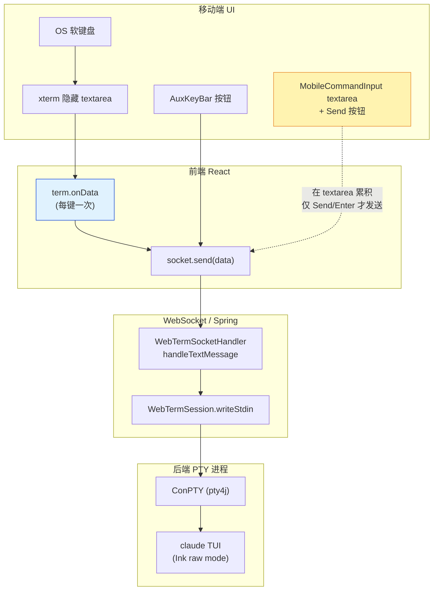
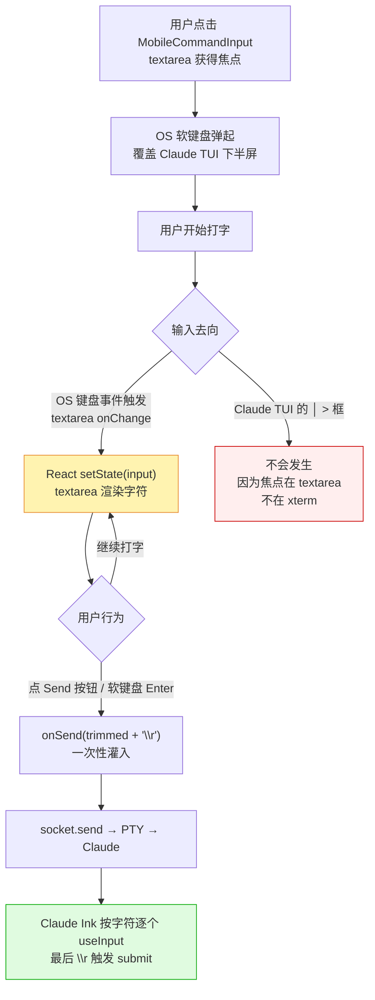
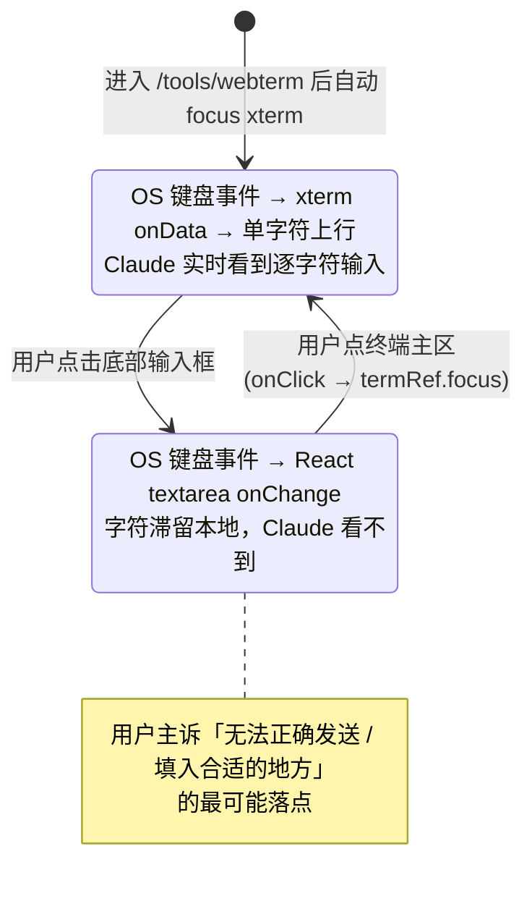

# 移动端 Claude 交互模式输入未送达

## 问题背景

- 接口/功能：Web 终端（`/tools/webterm`）移动端 → `claude` 命令进入 Ink TUI 交互模式
- 现象（一句话）：在 Claude 交互界面下，从移动端输入指令"似乎无效"——按键不进 Claude 的 `│ > ` 提示框，或者打到一半发不出去
- 复现参数：

```json
{
  "device": "Mobile / 窄屏（width < 768px）",
  "shell": "powershell",
  "cwd": "C:\\Users\\...\\some-project",
  "autorun": "claude",
  "scenario": "claude TUI 已渲染出 │ > 输入提示框后开始打字"
}
```

- 关键日志（用户描述层面）：
  - 移动端有三处可输入：xterm 主区（点击触发 OS 软键盘）、底部 `AuxKeyBar`、底部 `MobileCommandInput` 文本框
  - 用户的"或者填入合适的地方"措辞强烈暗示：输入有时确实进了某个地方，但**不是 Claude 提示框**，而是 `MobileCommandInput` 自己的 textarea

## 触发条件

| 条件 | 说明 |
|---|---|
| 终端模式 | PTY (`pty4j` + ConPTY) — 已经走 ConPTY 真 PTY 路径，不再是 stdin pipe 哑模式 |
| 屏幕宽度 | `< 768px`（Tailwind `md` 断点）——AuxKeyBar 和 MobileCommandInput 此时 `md:hidden` 解除可见 |
| 子进程 | Claude Code TUI（基于 Ink/React 的 alt-screen + raw mode 终端 UI） |
| 输入方式 | 不限：OS 软键盘走 xterm / 底部 textarea 打字 / 辅助键栏 |
| Browser | 暂时未限定（iOS Safari / Android Chrome 行为可能不一致，需复测） |

## 涉及类清单

| 角色 | 全类名 / 全路径 |
|---|---|
| 前端终端组件 | `frontend/src/features/webterm/components/Terminal.tsx` |
| 前端 WebSocket hook | `frontend/src/features/webterm/hooks/useWebTermSocket.ts` |
| 前端辅助键栏（mobile） | `frontend/src/features/webterm/components/AuxKeyBar.tsx` |
| 前端移动指令输入框 | `frontend/src/features/webterm/components/MobileCommandInput.tsx` |
| 前端 WebTerm 页面装配 | `frontend/src/features/webterm/pages/WebTermPage.tsx` |
| 后端 WebSocket 处理 | `com.exceptioncoder.toolbox.webterm.handler.WebTermSocketHandler` |
| 后端 PTY 会话 | `com.exceptioncoder.toolbox.webterm.session.WebTermSession` |
| 后端 Shell / pty4j 启动 | `com.exceptioncoder.toolbox.webterm.service.ShellLauncher` |
| 后端协议 DTO | `com.exceptioncoder.toolbox.webterm.api.dto.ClientMessage` / `ServerMessage` |

## 关键代码路径

| 描述 | 文件路径 | 行号 | 说明 |
|---|---|---|---|
| **xterm 输入直通**（路径 #1） | `frontend/src/features/webterm/components/Terminal.tsx` | 149-152 | `term.onData(data => socket.send(data))` — OS 键盘按键 ⇒ xterm 隐藏 textarea ⇒ onData ⇒ WS ⇒ PTY ⇒ Claude |
| **xterm 移动端 click 抢焦点** | `frontend/src/features/webterm/components/Terminal.tsx` | 203 | `onClick={() => termRef.current?.focus()}` — 点终端区强制 focus，让 OS 键盘弹起 |
| **xterm 移动端 DOM renderer 强制** | `frontend/src/features/webterm/components/Terminal.tsx` | 68-78 | `pointer: coarse` 设备**不走 WebGL** 而是默认 DOM；Claude Ink 高频重绘时 DOM 帧率低，**可能让用户误以为"输入没进去"** |
| **MobileCommandInput 本地累积 + 批量发送**（路径 #3 核心嫌疑） | `frontend/src/features/webterm/components/MobileCommandInput.tsx` | 31-43 | `value={input}` 由 React state 持有；只有点 Send / 按 Enter 才 `onSend(trimmed + '\r')`——**字符在本地 textarea 显示而不是 Claude 的 `│ > ` 框中**，与"填入合适的地方"高度匹配 |
| **MobileCommandInput 发送时机** | `frontend/src/features/webterm/components/MobileCommandInput.tsx` | 35 | `onSend(trimmed + '\r')`——一次性灌入 `text + \r`；Claude Ink raw 模式下 11 字符 + return 应被正确解析，但**未在 Claude TUI 实测过** |
| **AuxKeyBar Enter 数据** | `frontend/src/features/webterm/components/AuxKeyBar.tsx` | 28-33 | Enter 键 `data: '\r'`——单独的 `\r` 应能让 Claude 提交，可作为"input box 文字在但回车未触发"的兜底测试 |
| **WebTermPage 三路汇合到 socket.send** | `frontend/src/features/webterm/pages/WebTermPage.tsx` | 127-129 | `sendData = data => terminalRef.current?.send(data)`——AuxKeyBar 和 MobileCommandInput 都走这条；最终 `socket.send` 是 `JSON.stringify({type:'input', data})` |
| **后端写入 stdin** | `tools/tool-webterm/src/main/java/com/exceptioncoder/toolbox/webterm/session/WebTermSession.java` | 109-122 | `writeStdin(data)` 走 UTF-8 字节直送 PTY；synchronized 串行；**这层没问题** |
| **后端 WS 入口分发** | `tools/tool-webterm/src/main/java/com/exceptioncoder/toolbox/webterm/handler/WebTermSocketHandler.java` | 101-102 | `if (msg instanceof ClientMessage.Input input) session.writeStdin(input.data())` — 简单直通 |

## 核心流程分析

### 泳道图：三条移动端输入路径，各自能在哪一层断掉



**关键观察**：

- xterm 路径每按一键就 fire `onData`，**单字节实时上行**——Claude 能逐字符高亮回显
- AuxKeyBar 每点一次按钮发一个固定字节序列——Claude 视为标准按键
- **MobileCommandInput 路径不一样**：字符先在它**自己的 textarea**（黄色高亮）累积，只有按 Send 按钮 / 按软键盘 Enter 才一次性发送 `text + \r`——用户视觉上"打字了"但 Claude 的 `│ > ` 框是空的，因为本地 textarea 才是字符的"家"

### 流程图：MobileCommandInput 的"延迟批量发送"语义如何被误解



### 状态图：xterm 焦点 vs MobileCommandInput 焦点



## 相关代码 / SQL 清单

```tsx
// MobileCommandInput.tsx 关键片段（line 31-43）
const handleSend = () => {
  const trimmed = input.trim()
  if (!trimmed) return
  onSend(trimmed + '\r')   // <-- 整段字符串 + CR 一次性灌入 PTY
  // ...
  setInput('')             // <-- 发完清空本地 state
}
```

```tsx
// Terminal.tsx 关键片段（line 146-153，已修正过的"无本地 echo"版）
useEffect(() => {
  const term = termRef.current
  if (!term) return
  const sub = term.onData(data => {
    socket.send(data)        // 每键直发，无本地 echo
  })
  return () => sub.dispose()
}, [socket])
```

```tsx
// WebTermPage.tsx QUICK_COMMANDS（line 30-36）
const QUICK_COMMANDS = [
  { label: 'Claude', cmd: 'claude\r', ... },   // 进 Claude 用的；进了 Claude 之后再点会被当成提示词
  { label: 'ls', cmd: 'ls\r' },                // 同理
  // ...
]
```

```java
// WebTermSession.writeStdin (line 109-122)
public void writeStdin(String data) {
    if (closed.get() || data == null || data.isEmpty()) return;
    OutputStream out = process.getOutputStream();
    synchronized (stdinLock) {
        try {
            out.write(data.getBytes(StandardCharsets.UTF_8));
            out.flush();
        } catch (IOException e) {
            // process likely exited
        }
    }
}
```

## 根因总结

| 问题现象 | 候选根因 | 可信度 |
|---|---|---|
| 用户打字但 Claude 的 `│ > ` 提示框不动 | **焦点在 MobileCommandInput 自己的 textarea 上**（React state `input` 持有），不在 xterm，所以字符没流到 PTY → Claude；点 Send 后才一次性发送 | **高**（直接对应"填入合适的地方"的用户语义） |
| 打完一段点 Send 后 Claude 没反应 / 部分丢字 | `onSend(text + '\r')` 一次性灌入；Claude Ink 在 alt-screen + raw 模式下的 batched stdin parsing 未在本项目实测过，**未必逐字解析为 11×char + 1×return**，可能合并出错 | 中（待复测） |
| 用 OS 键盘想直接打到 xterm 也"无效" | 移动端点 xterm 区域后焦点切到 xterm 隐藏 textarea，但 OS 键盘弹起后**遮住 Claude 的 `│ > ` 框**——用户看不到光标在动，误以为没输入 | 中（视觉问题不是真没送） |
| 高频字符像"打慢了"或"丢字" | 移动端走 DOM renderer（Terminal.tsx:68-78 强制 `pointer: coarse` 走 DOM），Claude Ink 30 Hz 重绘下 DOM 帧率跟不上，**视觉滞后**让人觉得没送达，但实际 PTY 上已经到了 | 低（旧问题，已知 trade-off） |
| QUICK_COMMANDS 在 Claude 模式下变成无意义提示词 | `claude\r` / `ls\r` 等是为 shell 设计的；进了 Claude 之后点这些按钮 = 给 Claude 输入"ls"提示——不是 bug 但是 UX 陷阱 | 低（设计问题，不在本卡修复范围） |

## 修复方案

### 短期（治标，最小改动验证主因）

| 改动 | 文件 | 说明 |
|---|---|---|
| 用户进入 Claude TUI 后**禁用** MobileCommandInput，强制走 xterm + OS 键盘路径 | `MobileCommandInput.tsx` + `WebTermPage.tsx` | 让 WebTermPage 监听 `autorun === 'claude'` 或 `socket.mode === 'attach'` 时把 `<MobileCommandInput />` 隐藏，避免用户误用错误的输入面板 |
| 改 `MobileCommandInput.handleSend` 在发完每个字符后 yield 一帧，再发 `\r` | `MobileCommandInput.tsx` line 35 | 把 `onSend(trimmed + '\r')` 拆成 `for ch of trimmed: onSend(ch)` 然后 `setTimeout(() => onSend('\r'), 0)`——模拟用户键盘节奏，规避 Ink batched parse 隐患 |

### 中期（治本，让移动端 Claude 输入体验跟手）

| 改动 | 文件 | 说明 |
|---|---|---|
| 改 `MobileCommandInput` 为**实时直通模式**：每次 onChange 把**新增的字符** `socket.send` 出去，不再本地累积 | `MobileCommandInput.tsx` | 行为对齐 xterm onData——用户在 textarea 看到的 = Claude `│ > ` 框看到的 = 同一份字节流 |
| 或者：移除 MobileCommandInput，让移动端 Claude 模式**只走 xterm + OS 键盘**，但在键盘弹起时**自动 scroll 让 xterm 光标行可见**（不被遮） | `Terminal.tsx` + `WebTermPage.tsx` | 用 `visualViewport.height` 监听键盘高度，给 terminal 容器加底部 padding；Claude 的 `│ > ` 框就会被推到键盘上方 |
| QUICK_COMMANDS 进 Claude 模式时切换为 Claude-aware 集合：`/clear`、`/help`、Esc-Esc（提交）、Shift+Enter（换行） | `WebTermPage.tsx` line 30-36 | 检测 autorun=='claude' 时换一套快捷指令 |

### 配置 / 运维

| 改动 | 说明 |
|---|---|
| 在 `WebTermPage` 头部加一个明显的"输入方式"切换器：xterm 直通模式 ↔ 批量命令模式 | 用户能自己选，避免 UI 露出三个输入入口造成认知混乱 |

## 待验证项

下面三步是定位真因的最小复现路径，按顺序做：

1. **复现 A**：进 Claude 后**不**点底部 textarea，直接点 xterm 主区让 OS 键盘弹起，打 "hello"。如果 Claude 的 `│ > ` 框逐字显示 → 说明 xterm 路径 OK，主因就是 MobileCommandInput 的本地累积语义；如果 Claude 框无反应 → 焦点 / xterm hidden textarea 出问题，要查 `term.focus()` 行为
2. **复现 B**：在 Claude 提示框已有字符的情况下，点底部 AuxKeyBar 的 Enter 键。如果提交成功 → Claude 接受 `\r`，MobileCommandInput 的 `\r` 也理论能用，那剩下要查的是它在 Claude 模式下的 batched send 是否丢字
3. **复现 C**：在 MobileCommandInput 输入 "test" 后点 Send。**观察两个位置**：(a) Claude 提示框最终有没有出现 "test"+ submit；(b) Claude 是否进入处理回复阶段。如果 (a) 显示但没 submit → `\r` 没起作用；如果 (a)(b) 全没 → 字节没送达 PTY，要抓 WS 帧抓后端 `writeStdin` 日志
