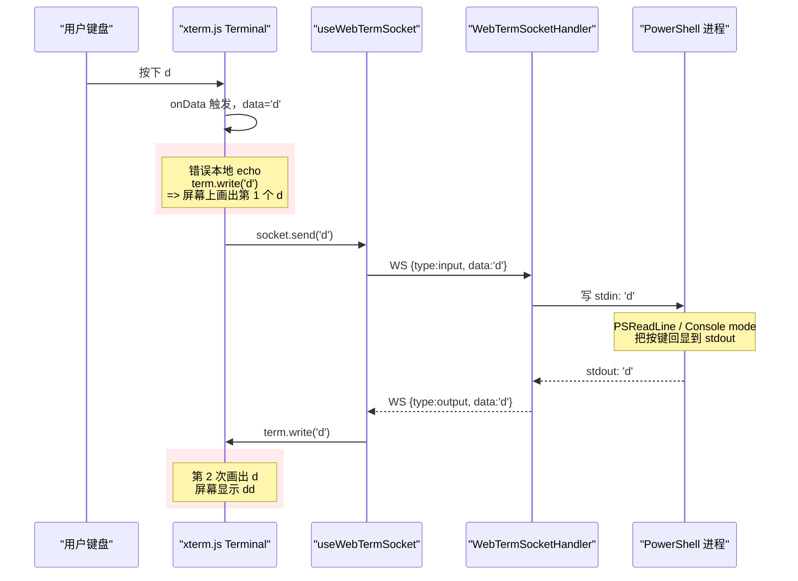
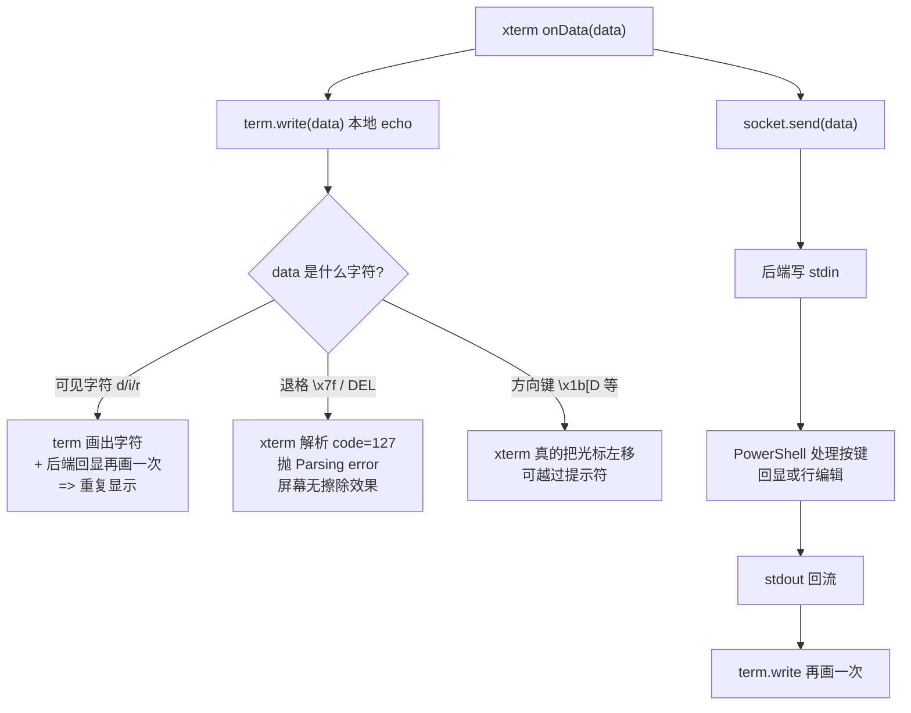
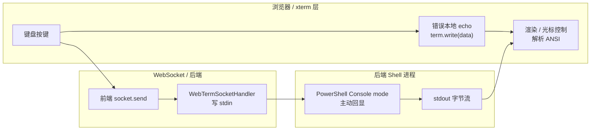

# 输入字符重复与方向键越过提示符

## 问题背景

- 接口/功能：Web 终端（`/tools/webterm`）首次实测
- 现象：在 PowerShell 终端中输入命令时
  - 每个字符显示**两次**（输 `dir` 显示 `ddiirr`）
  - 退格键 / Delete 键无任何擦除效果
  - 方向键能让光标越过提示符 `PS D:\...>`
  - 浏览器 Console 持续刷 `xterm.js Parsing error: position: N, code: 127, ...`
- 复现参数：

```json
{ "shell": "powershell", "cwd": "D:\\Users\\zhang\\IdeaProjects" }
```

- 错误日志（Console 摘录）：

```text
xterm.js Parsing error : { position: 296, code: 127, currentState: 0, collect: 0, params: s2, ... }
xterm.js Parsing error : { position: 297, code: 127, ... }
... (大量类似条目)
Uncaught TypeError: Cannot read properties of undefined (reading 'dimensions')
    at RenderService.ts:50
```

## 触发条件

| 条件 | 说明 |
|---|---|
| 浏览器进入 `/tools/webterm` 并连接成功（state=ready） | 是 |
| 任何键盘输入（含可见字符 / 退格 / 方向键） | 即触发 |
| Shell 类型 | PowerShell（cmd 同理） |
| 平台 | Windows 11 |

## 涉及类清单

| 角色 | 全类名 / 全路径 |
|---|---|
| 前端终端组件 | `frontend/src/features/webterm/components/Terminal.tsx` |
| 前端 WebSocket hook | `frontend/src/features/webterm/hooks/useWebTermSocket.ts` |
| 后端 Shell 启动 | `com.exceptioncoder.toolbox.webterm.service.ShellLauncher` |
| 后端会话 | `com.exceptioncoder.toolbox.webterm.session.WebTermSession` |

## 关键代码路径

| 描述 | 文件路径 | 行号 | 说明 |
|---|---|---|---|
| **错误的本地 echo**（核心 bug） | `frontend/src/features/webterm/components/Terminal.tsx` | 78-82 | `term.onData(data => { term.write(data); socket.send(data) })` 把按键写回 term 同时发后端，但后端 PowerShell 也回显 → **每字符两次显示** |
| **退格 / 方向键的副作用** | `frontend/src/features/webterm/components/Terminal.tsx` | 78-82 | 同一行：`\x7f` 写入 xterm 仅作不可见控制字符，光标不回退；`\x1b[D` 让 xterm 把光标向左移动可越过提示符 |
| Shell 启动嵌套 PowerShell | `tools/tool-webterm/.../ShellLauncher.java` | 41-50 | `-Command` 后再启动一个 `powershell.exe -NoLogo -NoProfile`，**内层 PowerShell 仍在 Console 模式做行编辑回显** |
| RenderService dimensions 异常 | `frontend/src/features/webterm/components/Terminal.tsx` | 38-42 | `term.open()` 后立即 `fit.fit()`，容器布局未完成时 cols/rows 计算异常，xterm 内部 RenderService 拿到 undefined dimensions |

## 核心流程分析

### 时序图：用户敲一个字符 `d`



### 流程图：按键种类决定问题表现



### 泳道图：本地 echo 与后端回显的双层叠加



## 相关代码 / SQL 清单

```tsx
// frontend/src/features/webterm/components/Terminal.tsx (摘录)
useEffect(() => {
  const term = termRef.current
  if (!term) return
  const sub = term.onData(data => {
    term.write(data)        // <-- 错误本地 echo（核心 bug）
    socket.send(data)
  })
  return () => sub.dispose()
}, [socket])
```

```java
// ShellLauncher.java (摘录)
case SHELL_POWERSHELL -> List.of(
    "powershell.exe", "-NoLogo", "-NoProfile",
    "-ExecutionPolicy", "Bypass",
    "-Command",
    "[Console]::OutputEncoding=[System.Text.Encoding]::UTF8;" +
            "$OutputEncoding=[System.Text.Encoding]::UTF8;" +
            "powershell.exe -NoLogo -NoProfile"   // 嵌套子 PowerShell
);
```

## 根因总结

| 问题现象 | 根因 |
|---|---|
| 字符显示两次 | 前端 `term.onData` 里加了本地 echo `term.write(data)`，叠加后端 PowerShell 自身的 console-mode 回显，造成双重输出 |
| 退格键无效 | 前端 echo 把 `\x7f` 写入 xterm，xterm 不会用它擦字符；PowerShell 即使收到 `\x7f` 在非真 TTY 下也未必按 backspace 处理 |
| 方向键越过提示符 | 前端 echo 把 `\x1b[D` 等控制序列写入 xterm，xterm 解析为光标移动指令 → 光标在前端被真实左移，能跑到提示符前 |
| `xterm.js Parsing error code:127` 大量刷屏 | 同样源于本地 echo 把 `\x7f` 写到 xterm，解析器在 code=127 处反复报错 |
| `Cannot read properties of undefined (reading 'dimensions')` | `term.open()` 之后立即 `fit.fit()`，容器布局尚未完成，cols/rows 计算异常，RenderService 拿到 undefined |
| 设计文档 RK2 风险条目方向错了 | 设计阶段误判"无 PTY 时 Shell 不主动回显"，实际嵌套 PowerShell 仍在 Console mode 做完整行编辑+回显，本地 echo 是多余的 |

## 修复方案

### 第一轮（仅止住"双倍显示"，未解决行编辑失效）

| 级别 | 改动 |
|---|---|
| **短期（治标）**| `Terminal.tsx`: 删掉 `term.write(data)` 这一行本地 echo；只保留 `socket.send(data)`。 |
| **短期（治标）**| `Terminal.tsx`: 把 `fit.fit()` 推迟到 ResizeObserver 收到首次有效尺寸（≥ 1×1）后再调，避免 RenderService dimensions 异常。 |
| **中期（治本）**| `ShellLauncher.java`: 取消嵌套子 PowerShell，改 `-NoExit -Command "..."` 单层启动 + UTF-8 编码。 |

第一轮修复后实测：字符不再重复显示，但**退格、方向键、Tab 补全仍全部失效**。原因是 PowerShell 在 stdin 是 pipe 时不启用 PSReadLine 行编辑模块。

### 第二轮（治本，解决行编辑失效）

| 级别 | 改动 |
|---|---|
| **治本**| 引入 `org.jetbrains.pty4j:pty4j:0.12.25`，父 pom 加 JetBrains Maven 仓库；`tools/tool-webterm/pom.xml` 加依赖。 |
| **治本**| `ShellLauncher.java` 改用 `PtyProcessBuilder` + `setUseWinConPty(true)` 启动 PowerShell/cmd；env 默认 `TERM=xterm-256color`；`setRedirectErrorStream(true)` 让 stderr 合流。 |
| **治本**| `WebTermSocketHandler.handleOpen` 改持 `PtyProcess`；调 `launcher.launch(shell, cwd, cols, rows)` 把初始尺寸传下去。 |
| **治本**| `WebTermSession.setSize` 调 `PtyProcess.setWinSize(new WinSize(cols, rows))` 真把尺寸下发到底层 PTY。 |
| **治本**| `WebTermSession.startOutputForwarding` 简化为只起 1 条 stdout 转发线程（PTY 已合流 stderr）。 |
| **同步**| `Web终端-current.md` §1.2 / §1.3 / §3.1 / §7.2 / §8 RK1-RK3 / §9 全部修订；`Web终端-coding.md` §3.5 / §3.7 同步。 |

**修复后预期**：
- 退格 / Delete 真正擦字符（PSReadLine 处理）
- 方向键左右移动光标，不会越过提示符
- Tab 补全可用，上下方向键能翻历史命令
- Ctrl+C 真正中断当前命令
- vim / less / git log 分页等 TUI 程序能正常渲染
