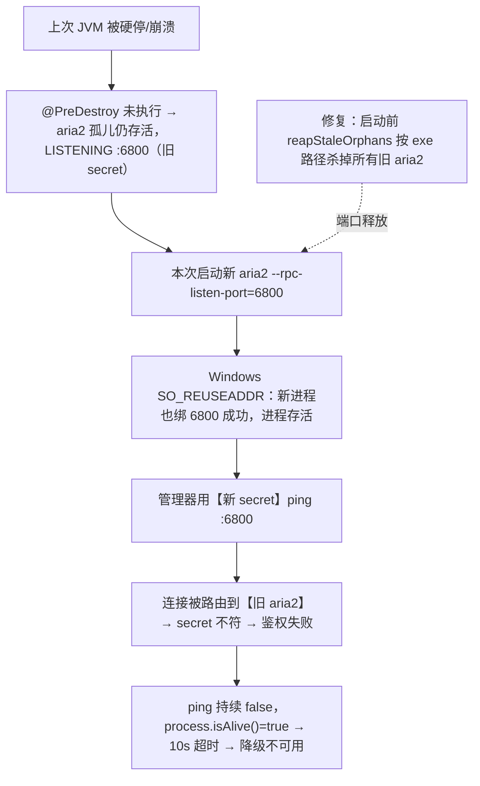

# aria2 残留孤儿占端口导致启动超时

## 问题背景

- **功能路径**：tool-magnet 启动期 `Aria2DaemonManager.start()`。
- **现象**：`aria2 daemon 启动失败：aria2 启动超时（>10000ms 仍未响应 RPC）`，模块降级不可用。
- **困惑点**：aria2 是本地 exe，为何会「超时」而不是直接报找不到？

## 触发条件

| 条件 | 说明 |
|---|---|
| 上次非优雅退出 | IntelliJ 硬停 / 进程崩溃 / `taskkill /F` → `@PreDestroy stop()` 没跑 → aria2 成孤儿 |
| 孤儿仍存活 | 旧 aria2 仍 LISTENING 在 RPC 端口（本例 6800），跨重启长期残留（实测有 2 天前的孤儿） |
| Windows 端口语义 | SO_REUSEADDR 允许新 aria2 也绑上 6800，但连接被路由到旧进程 |
| secret 每次随机 | `rpc-secret` 为空时每次启动生成新 secret，新管理器用新 secret ping 打到旧进程 → 鉴权失败 |

## 涉及类清单

| 角色 | 全类名 / 路径 |
|---|---|
| daemon 管理 | `com.exceptioncoder.toolbox.magnet.service.Aria2DaemonManager` |
| RPC 客户端 | `com.exceptioncoder.toolbox.magnet.service.Aria2RpcClient` |
| 参照实现（已有孤儿清理） | `com.exceptioncoder.toolbox.common.media.FfmpegProcessRegistry#reapStaleOrphansAtStartup` |

## 关键代码路径

| 描述 | 文件 | 说明 |
|---|---|---|
| 轮询 RPC 就绪 | `Aria2DaemonManager#waitForReady` | ping 失败则轮询至超时；**进程存活 → 报「超时」而非「进程退出」** |
| 每次随机 secret | `Aria2DaemonManager#startInternal` | rpc-secret 空 → 新 secret；与旧孤儿不匹配 |
| 仅优雅退出杀 aria2 | `Aria2DaemonManager#stop`（@PreDestroy） | 硬停/崩溃不触发 → 留孤儿 |
| **修复点：启动前清理孤儿** | `Aria2DaemonManager#reapStaleOrphans` | 新增，仿 FfmpegProcessRegistry |

## 核心流程分析

## 根因总结

| 问题现象 | 根因 |
|---|---|
| 本地 exe 却启动超时 | 旧孤儿占 6800；Windows 允许新进程也绑，但连接路由到旧进程，新 secret 鉴权失败 → ping 永不成功 |
| 报「超时」非「进程退出」 | 新 aria2 进程并未退出（绑端口成功），故 `isAlive()` 为真，走超时分支 |
| 反复出现 | `@PreDestroy` 仅优雅退出时杀 aria2；频繁 IntelliJ 硬停积累孤儿 |

## 相关代码 / SQL 清单

无 SQL。修复见 `Aria2DaemonManager#reapStaleOrphans`：binary 为绝对路径时，遍历进程按 `ProcessHandle.info().command()` 匹配本 aria2 可执行路径并 `destroyForcibly`，再 sleep 300ms 待端口释放。

## 修复方案

| 级别 | 说明 |
|---|---|
| 立即止血 | 手动杀掉残留 aria2c（`Stop-Process`），释放 6800，再重启后端 |
| 中期（治本，已实施） | `Aria2DaemonManager` 启动前 `reapStaleOrphans(binary)`：按 exe 路径清理孤儿（仅绝对路径执行，避免误杀用户自有 aria2），与 `FfmpegProcessRegistry` 同思路 |
| 可选增强 | 把 `rpc-secret` 固定到配置（非每次随机），即便误连旧进程也能鉴权 —— 但治标不治本，孤儿清理才是正解 |

## 验证要点

- 制造孤儿：硬停 JVM 后 `Get-Process aria2c` 仍在 → 重启后端 → 日志出现「清理了 N 个残留 aria2 进程」→ magnet 正常就绪。
- 正常路径：无孤儿时启动不受影响。
- 边界：binary 为相对名（PATH 上的 aria2c）时跳过清理，不误杀用户其它 aria2。
