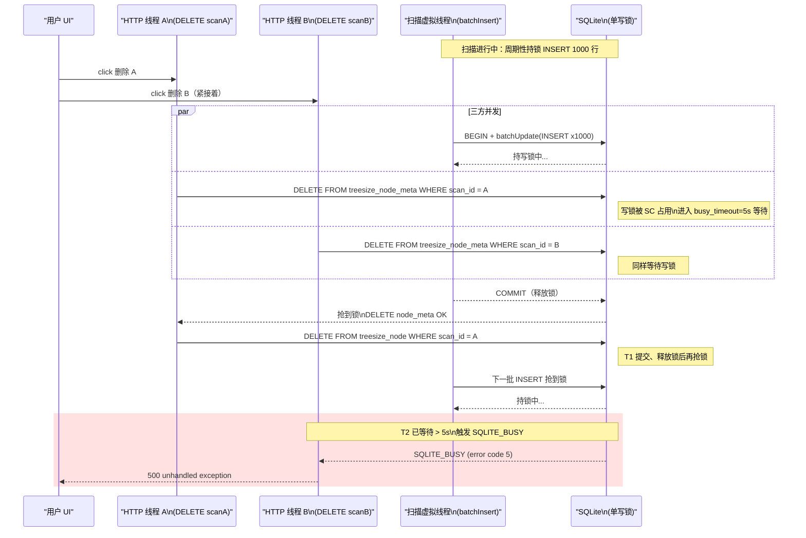
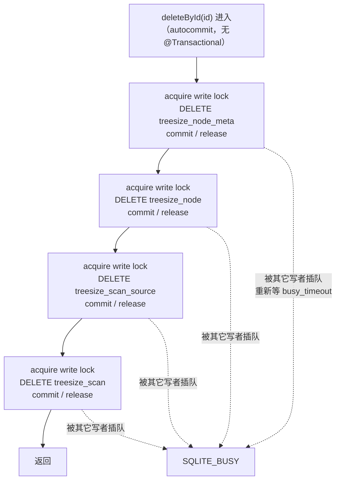

# 删除扫描历史时 SQLite 数据库锁定

## 问题背景

- 接口：`DELETE /api/treesize/scans/{id}`
- 现象：磁盘空间分析（TreeSize）模块连续点击两条扫描历史的删除按钮，第二条删除请求抛 `SQLITE_BUSY`，整次请求 500。
- 复现参数：
```json
{ "scanIdA": "uuid-a", "scanIdB": "uuid-b" }
```
- 错误日志：
```text
ERROR c.e.t.c.e.GlobalExceptionHandler - unhandled exception
org.springframework.jdbc.UncategorizedSQLException: PreparedStatementCallback;
uncategorized SQLException for SQL [DELETE FROM treesize_node_meta WHERE scan_id = ?];
SQL state [null]; error code [5];
[SQLITE_BUSY] The database file is locked (database is locked)
  at ScanRepository.deleteById(ScanRepository.java:88)
```

## 触发条件

| 条件 | 说明 |
|---|---|
| 数据量 | 单次扫描会写入数十万行到 `treesize_node` / `treesize_node_meta`（每次 batchInsert 1000 行）；大目录可达百万级 |
| 并发场景 | UI 几乎同时发出 2 个 DELETE 请求；或 1 个 DELETE + 1 个进行中的扫描 batchInsert |
| 锁类型 | SQLite WAL 模式仍是**单写者**；当前 `busy_timeout = 5000ms`，超过即抛 BUSY |
| 删除粒度 | `deleteById` 串行执行 4 条独立 DELETE，每条单独提交事务、单独抢一次写锁 |

## 涉及类清单

| 角色 | 全类名 |
|---|---|
| Controller | `com.exceptioncoder.toolbox.treesize.api.TreeSizeController` |
| Service（扫描启动 / 取消） | `com.exceptioncoder.toolbox.treesize.service.ScanService` |
| Repository（出错点） | `com.exceptioncoder.toolbox.treesize.repository.ScanRepository` |
| Repository（扫描期间持续写入） | `com.exceptioncoder.toolbox.treesize.repository.NodeRepository` |
| 数据源 / busy_timeout 配置 | `com.exceptioncoder.toolbox.common.sqlite.SqliteConfig` |
| 配置属性 | `com.exceptioncoder.toolbox.common.sqlite.SqliteProperties` |
| 全局异常处理 | `com.exceptioncoder.toolbox.common.exception.GlobalExceptionHandler` |

## 关键代码路径

| 描述 | 文件路径 | 行号 | 说明 |
|---|---|---|---|
| HTTP 入口，未做并发控制 | `kai-toolbox/tools/tool-treesize/src/main/java/com/exceptioncoder/toolbox/treesize/api/TreeSizeController.java` | 161-166 | 顺序调 `cancel` + `deleteById`，两个请求并发进入互不阻塞 |
| **报错点：4 条 DELETE 各自独立事务** | `kai-toolbox/tools/tool-treesize/src/main/java/com/exceptioncoder/toolbox/treesize/repository/ScanRepository.java` | **87-92** | 每条 `jdbc.update` 在 autocommit 下都要单独抢写锁、单独提交；任何写者插队都会让下一条重新等 5s |
| busy_timeout = 5000ms（偏短） | `kai-toolbox/toolbox-starter/src/main/resources/application.yml` | 22 | `busy-timeout-ms: 5000`，对百万级 DELETE + 并发写场景不够 |
| 扫描后台批量写入（写锁竞争源） | `kai-toolbox/tools/tool-treesize/src/main/java/com/exceptioncoder/toolbox/treesize/repository/NodeRepository.java` | 48-94 | 每 1000 行 batchInsert 一次，运行中的扫描会持续占用写锁 |
| 扫描调度（虚拟线程） | `kai-toolbox/tools/tool-treesize/src/main/java/com/exceptioncoder/toolbox/treesize/service/ScanService.java` | 40-43, 126-169 | 扫描跑在虚拟线程上，与 HTTP 删除线程共抢同一把 SQLite 写锁 |
| `enforceForeignKeys(true)` 但表无 FK | `kai-toolbox/toolbox-common/src/main/java/com/exceptioncoder/toolbox/common/sqlite/SqliteConfig.java` | 46 | 注意：treesize_node.scan_id → treesize_scan.id 没建外键，删除竞争时可能留孤儿行 |

## 核心流程分析

### 时序图：双删除请求 + 后台扫描三方抢写锁



### 流程图：当前 `deleteById` 的写锁抢占次数



每次 `jdbc.update` 都是一次独立的「抢锁→提交→放锁」循环，写锁竞争窗口被放大 4 倍。

## 相关代码 / SQL 清单

`deleteById` 内当前的 4 条 SQL：

```sql
DELETE FROM treesize_node_meta   WHERE scan_id = ?;
DELETE FROM treesize_node        WHERE scan_id = ?;
DELETE FROM treesize_scan_source WHERE scan_id = ?;
DELETE FROM treesize_scan        WHERE id      = ?;
```

`treesize_node` / `treesize_node_meta` 都按 `(scan_id, ...)` 建索引，DELETE 不会全表扫描，但行数大时持锁时间仍可观（数十万行级）。

## 根因总结

| 问题现象 | 根因 |
|---|---|
| 删除时报 `[SQLITE_BUSY] database is locked` | SQLite WAL 仍是单写者；`busy_timeout=5s` 在「并发删除 + 后台扫描批插入」场景下不够 |
| 两次连击删除几乎必现 | `deleteById` 4 条 DELETE 各自独立事务，每条都要单独抢写锁；两个 HTTP 线程同时进来，互相把对方的等待窗口耗光 |
| 没有应用层串行化 | Controller 直接同步进入 JdbcTemplate，两个 DELETE 请求 + 扫描虚拟线程都直接抢同一把 SQLite 写锁，缺一道 Java 侧的互斥 |
| 删除大数据量耗时长 | 单次扫描可写入数十万行；删除时即使索引可走，持锁时间仍以秒计 |
| （潜在）扫描中删除可能留孤儿行 | `cancel(id)` 只翻 AtomicBoolean，不等扫描线程退出；扫描线程随后又 flush 一批 INSERT，但表无 FK 约束，行成为孤儿 |

## 修复方案

### 短期（治标）

| 改动 | 文件 | 说明 |
|---|---|---|
| `busy-timeout-ms` 由 `5000` 改为 `30000` | `toolbox-starter/src/main/resources/application.yml` | 给 SQLite 足够的退让时间，覆盖大表 DELETE + 扫描批写交叠 |
| `ScanRepository.deleteById` 加 `@Transactional` | `tool-treesize/.../repository/ScanRepository.java` | 4 条 DELETE 包成单一事务，共享同一连接、只抢一次写锁；写锁竞争窗口从 4 次降到 1 次 |
| 扫描删除在 `ScanService` 串行化 | `tool-treesize/.../service/ScanService.java` | 新增 `deleteAndStop(id)`：先 cancel，再用 `ReentrantLock` 串行调 `scans.deleteById(id)`；多次连击在 Java 层排队，避免在 SQLite 层用 busy_timeout 轮询 |
| Controller 改调 `scanService.deleteAndStop(id)` | `tool-treesize/.../api/TreeSizeController.java` | 收口删除入口 |

### 中期（治本，本次不实施）

| 改动 | 说明 |
|---|---|
| 异步删除 + `DELETING` 状态 | 删除请求立即返回 202，把 scan 标记为 `DELETING`；后台单线程 worker 顺序执行实际删除；前端 list 过滤 `DELETING` 行。彻底消除写锁竞争对 UI 的影响 |
| 扫描线程退出确认 | `ScanService.cancel(id)` 改为返回一个 `Future<?>` 或允许 `await`，删除流先等扫描线程退出再删数据，避免孤儿行 |
| 加 FK 约束并 ON DELETE CASCADE | 对 `treesize_node`、`treesize_node_meta`、`treesize_scan_source` 的 `scan_id` 建外键到 `treesize_scan(id) ON DELETE CASCADE`；删除主表一行即可级联清理；但 SQLite 在大表上 CASCADE 也仍占写锁，不一定比手写 DELETE 快，需先压测 |

### 配置 / 运维

| 改动 | 说明 |
|---|---|
| 监控 `SQLITE_BUSY` 出现频次 | `GlobalExceptionHandler` 已捕获，可对 `UncategorizedSQLException` + error code 5 单独打点，超阈值再升级到中期方案 |
