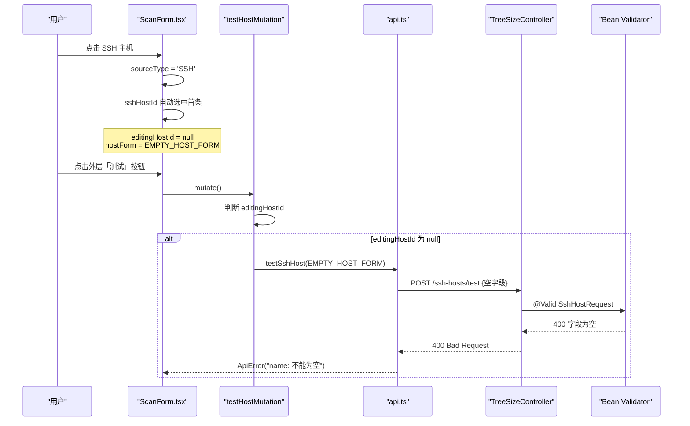
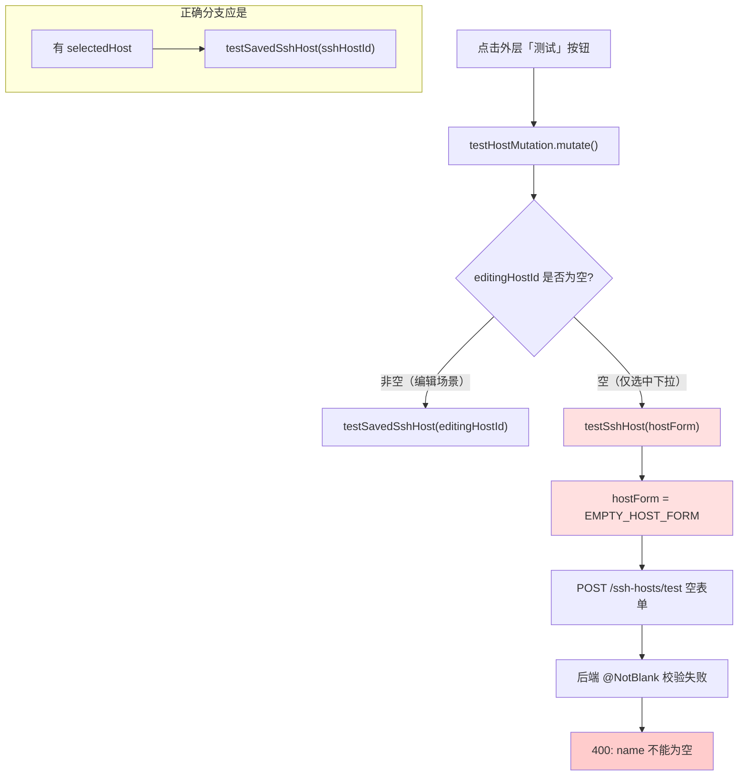
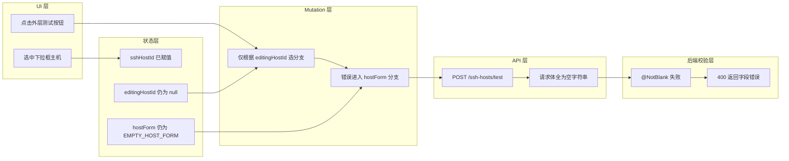

# 历史 SSH 主机测试时 name 校验失败

## 问题背景

- 功能路径：treesize → SSH 主机 → 选择已保存主机 → 点击外层「测试」按钮
- 现象：从下拉框选中已保存的 SSH 主机后，直接点击外层「测试」按钮，前端弹出表单校验红框「name: 不能为空」（同时也会报 host、username 不能为空）
- 复现参数：

```json
{
  "selectedHostId": "<已存在的 SSH 主机 id>",
  "editingHostId": null,
  "hostFormOpen": false
}
```

- 网络请求实际负载（错误）：

```json
POST /api/treesize/ssh-hosts/test
{
  "name": "",
  "host": "",
  "port": 22,
  "username": "",
  "authType": "KEY",
  "privateKey": "",
  "password": "",
  "passphrase": ""
}
```

- 后端响应：

```
400 Bad Request
{
  "name": "不能为空",
  "host": "不能为空",
  "username": "不能为空"
}
```

## 触发条件

| 条件 | 取值 |
|---|---|
| 数据源选择 | `sourceType = 'SSH'` |
| SSH 主机库 | 至少存在 1 条已保存主机记录 |
| 编辑器状态 | 未打开（`hostFormOpen = false`）|
| 编辑目标 | 未进入编辑（`editingHostId = null`）|
| 触发动作 | 点击下拉框右侧的「测试」按钮（非编辑器内的「测试连接」）|

> 在编辑器内点击「测试连接」**不会复现**，因为创建场景下 `hostForm` 已被用户填写，编辑场景下 `editingHostId` 不为空会走另一分支。

## 涉及类清单

| 角色 | 全类名 / 文件路径 |
|---|---|
| 前端组件（Bug 所在） | `frontend/src/features/treesize/components/ScanForm.tsx` |
| 前端 API 客户端 | `frontend/src/features/treesize/api.ts` |
| 后端 Controller | `com.exceptioncoder.toolbox.treesize.api.TreeSizeController` |
| 后端请求 DTO（校验源） | `com.exceptioncoder.toolbox.treesize.api.dto.SshHostRequest` |
| 后端服务 | `com.exceptioncoder.toolbox.treesize.service.SshHostService` |

## 关键代码路径

| 描述 | 文件路径 | 行号 | 说明 |
|---|---|---|---|
| **Bug 根源**：mutation 用 `editingHostId` 判断分支 | `frontend/src/features/treesize/components/ScanForm.tsx` | 89-97 | **`editingHostId` 为 null 时无条件走 `testSshHost(hostForm)` 分支** |
| **触发点**：外层测试按钮没传 id | `frontend/src/features/treesize/components/ScanForm.tsx` | 191-200 | 外层按钮直接 `testHostMutation.mutate()`，未关联 `sshHostId` |
| 外层按钮可见性判定 | `frontend/src/features/treesize/components/ScanForm.tsx` | 185 | 仅依赖 `selectedHost`（即 `sshHostId`），与 `editingHostId` 无关 |
| 空表单初值 | `frontend/src/features/treesize/components/ScanForm.tsx` | 24-33 | `EMPTY_HOST_FORM` 全部字段为空字符串 |
| 后端按 id 测试接口（应走的入口） | `tools/tool-treesize/.../api/TreeSizeController.java` | 176-179 | `POST /ssh-hosts/{id}/test`，不需 body |
| 后端按表单测试接口（误走入口） | `tools/tool-treesize/.../api/TreeSizeController.java` | 170-174 | `POST /ssh-hosts/test`，`@Valid` 触发字段校验 |
| 校验注解定义 | `tools/tool-treesize/.../api/dto/SshHostRequest.java` | 6-15 | `name` / `host` / `username` 上的 `@NotBlank` |

## 核心流程分析

### 时序图（错误路径）



### 流程图（决策分支错位）



### 泳道图



## 相关代码 / SQL 清单

**前端 mutation 当前实现**（`ScanForm.tsx:89-97`）：

```tsx
const testHostMutation = useMutation({
  mutationFn: () => editingHostId ? testSavedSshHost(editingHostId) : testSshHost(hostForm),
  onMutate: () => {
    setHostError(null)
    setTestMessage(null)
  },
  onSuccess: result => setTestMessage(result.ok ? `连接成功：${result.message}` : result.message),
  onError: err => setHostError(errorMessage(err)),
})
```

**外层测试按钮**（`ScanForm.tsx:191-200`）：

```tsx
<Button
  type="button"
  variant="outline"
  size="sm"
  onClick={() => testHostMutation.mutate()}
  disabled={testHostMutation.isPending}
>
  <Wifi />
  测试
</Button>
```

**后端校验源**（`SshHostRequest.java`）：

```java
public record SshHostRequest(
    @NotBlank String name,
    @NotBlank String host,
    Integer port,
    @NotBlank String username,
    @NotNull String authType,
    ...
) {}
```

## 根因总结

| 问题现象 | 根因 |
|---|---|
| 选中下拉框点击「测试」报 name 不能为空 | `testHostMutation` 用 `editingHostId` 作为分支判据，但外层「测试」按钮的语义是「测试已选中的下拉项」，这条路径下 `editingHostId` 始终为 null，于是错误地降级到 `testSshHost(hostForm)`，把空表单发给后端 `@Valid` 接口 |
| 多个字段同时报错 | `EMPTY_HOST_FORM` 中 `name` / `host` / `username` 全部为空字符串，被 `@NotBlank` 同时拦截 |
| 编辑器内的「测试连接」却正常 | 编辑器场景下 `editingHostId` 或 `hostForm` 至少有一个被填充：编辑已存在主机走 `testSavedSshHost` 分支；新建主机时 `hostForm` 已被用户输入 |

## 修复方案

### 短期（治标）

修改 `testHostMutation` 让调用方显式传入数据源，外层「测试」按钮传 `sshHostId`，编辑器按钮按场景分别传 `editingHostId` 或 `hostForm`。

```tsx
type TestInput = { id: string } | { payload: SshHostPayload }

const testHostMutation = useMutation({
  mutationFn: (input: TestInput) =>
    'id' in input ? testSavedSshHost(input.id) : testSshHost(input.payload),
  ...
})
```

调用点：
- 外层按钮：`onClick={() => testHostMutation.mutate({ id: sshHostId })}`
- 编辑器（编辑现有）：`testHostMutation.mutate({ id: editingHostId })`
- 编辑器（新建）：`testHostMutation.mutate({ payload: hostForm })`

### 中期（治本）

将「测试」按钮的语义在 UI 层明确化：外层按钮承诺测试**已保存的主机**（不读 `hostForm`），编辑器按钮承诺测试**当前编辑中的内容**。后续如果想支持编辑中实时测试未保存修改，可以新增「测试当前修改」按钮调 `testSshHost(hostForm)`。

> 备注：当前编辑器内的「测试连接」按钮在编辑现有主机时调用的是 `testSavedSshHost`（测试 DB 旧值），并未测试用户当前修改的字段。这是一个**独立的 UX 问题**，本次仅修复用户反馈的 bug，不在本次范围内。

### 配置 / 运维

无。
