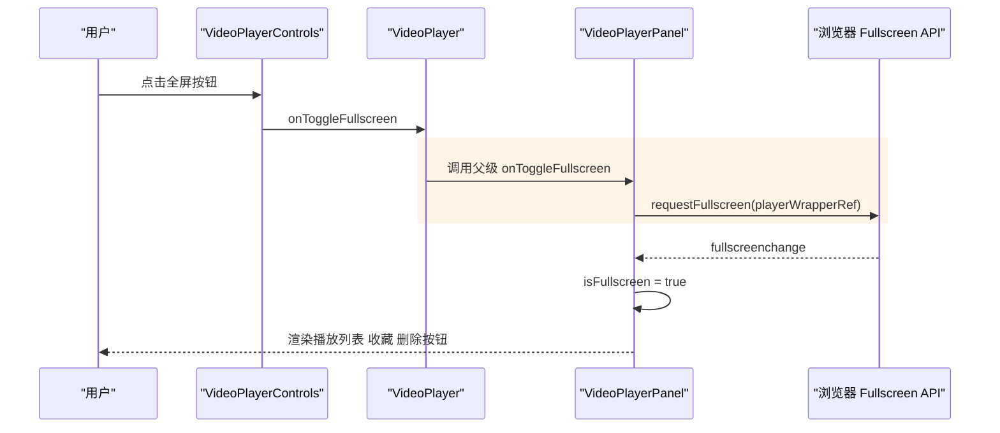
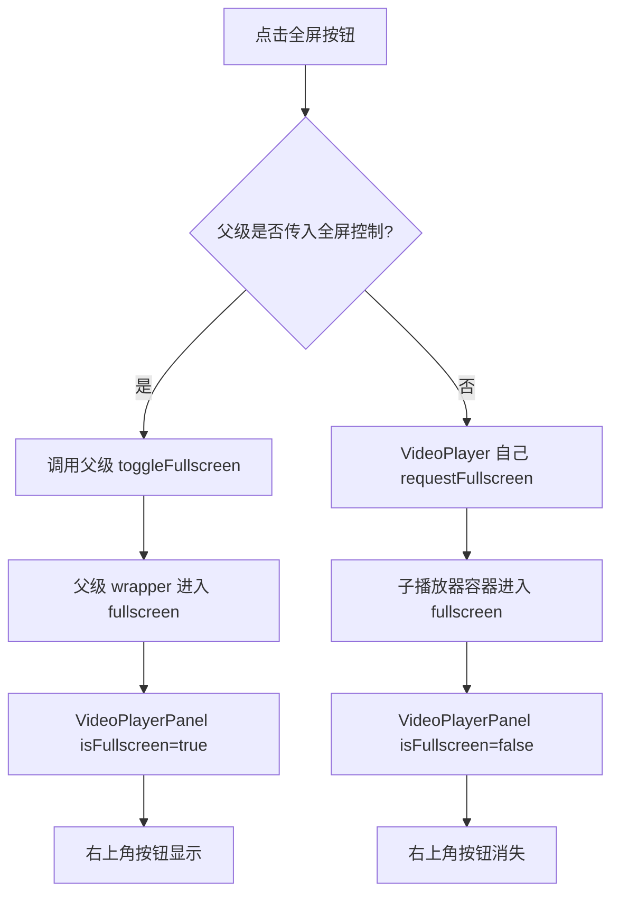
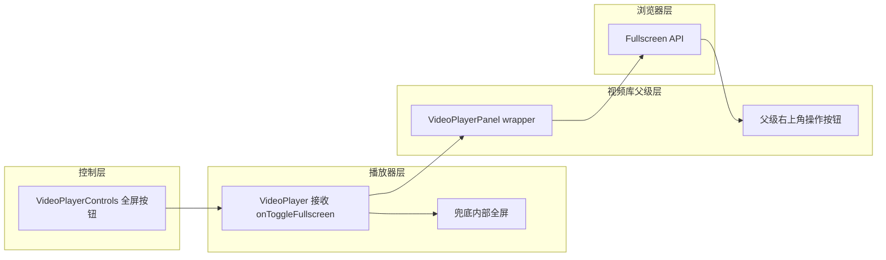

# 全屏后父级操作按钮消失

## 问题背景

- 功能路径：视频库播放器全屏播放。
- 现象描述：播放器右上角的播放列表、收藏、删除按钮在本轮按钮布局优化后不再显示。
- 复现参数：

```json
{
  "module": "video-library + video-playback",
  "action": "点击播放器控制栏全屏按钮",
  "expected": "父级右上角播放列表、收藏、删除按钮仍显示",
  "actual": "右上角父级按钮消失"
}
```

- 错误日志：

```text
无运行时报错。属于前端全屏目标和组件层级状态不一致导致的 UI 回归。
```

## 触发条件

| 条件 | 值 |
|---|---|
| 播放器来源 | 视频库 `VideoPlayerPanel` |
| 操作 | 点击 `VideoPlayerControls` 全屏按钮 |
| 触发版本 | 自定义控制栏接管原生 controls 后 |
| 影响按钮 | 播放列表、收藏、删除 |

## 涉及类清单

| 角色 | 全类名 |
|---|---|
| React 播放器核心 | `frontend.src.features.video-playback.VideoPlayer` |
| React 播放器控制条 | `frontend.src.features.video-playback.VideoPlayerControls` |
| React 视频库父级面板 | `frontend.src.features.video-library.components.VideoPlayerPanel` |

## 关键代码路径

| 描述 | 文件路径 | 行号 | 说明 |
|---|---|---:|---|
| 父级全屏容器 | `frontend/src/features/video-library/components/VideoPlayerPanel.tsx` | 125 | 父级通过 `document.fullscreenElement === playerWrapperRef.current` 判断是否渲染右上角按钮 |
| 父级右上角按钮 | `frontend/src/features/video-library/components/VideoPlayerPanel.tsx` | 256 | 播放列表、收藏、删除按钮只在父级 `isFullscreen` 为 true 时渲染 |
| 子播放器全屏接管 | `frontend/src/features/video-playback/VideoPlayer.tsx` | 166 | 修复后优先调用父级传入的 `controlledToggleFullscreen` |
| 子播放器方向切换 | `frontend/src/features/video-playback/VideoPlayer.tsx` | 183 | 横竖屏切换复用同一全屏入口，避免再次绕开父级 |

## 核心流程分析

### 时序图



### 流程图



### 泳道图



## 相关代码 / SQL 清单

```tsx
// frontend/src/features/video-playback/VideoPlayer.tsx
const effectiveFullscreen = controlledFullscreen ?? isFullscreen

const toggleFullscreen = useCallback(async () => {
  if (controlledToggleFullscreen) {
    await controlledToggleFullscreen()
    return
  }
  // fallback: standalone player fullscreen
}, [controlledToggleFullscreen])
```

```tsx
// frontend/src/features/video-library/components/VideoPlayerPanel.tsx
<VideoPlayer
  isFullscreen={isFullscreen}
  onToggleFullscreen={toggleFullscreen}
/>
```

## 根因总结

| 问题现象 | 根因 |
|---|---|
| 全屏后播放列表、收藏、删除按钮不显示 | `VideoPlayer` 自己把内部容器设为全屏，父级 `VideoPlayerPanel` 未进入全屏，导致父级 `isFullscreen` 始终为 false |
| 横竖屏切换也可能绕开父级 | 横竖屏切换内部直接请求子容器全屏，没有复用父级全屏入口 |

## 修复方案

| 级别 | 说明 |
|---|---|
| 短期（治标） | `VideoPlayer` 新增受控全屏 props，父级传入 `isFullscreen` 与 `toggleFullscreen`，控制条点击全屏时优先调用父级 |
| 中期（治本） | 保持 `VideoPlayer` 是可独立使用的播放器核心，但父级有外层操作按钮时必须接管全屏目标 |
| 配置 / 运维 | 无 |
