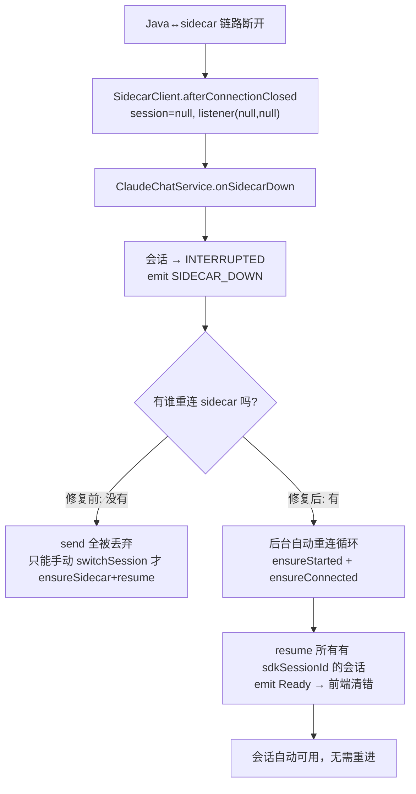

# sidecar 断开后不自动重连，需手动重进会话

## 问题背景

- **功能路径**：claude-chat（移动端 Claude 客户端）会话运行期。
- **现象**：聊天中出现红色 `SIDECAR_DOWN`「sidecar 已断开」错误后，即使网络恢复也不会自动恢复，必须重新进入（切换）会话才能继续。
- **疑问**：前端明明做了断线自动重连，为何无效？

## 触发条件

| 条件 | 说明 |
|---|---|
| Java↔sidecar 链路中断 | Node sidecar 进程崩溃/被杀，或本地 `ws://127.0.0.1` 连接断开 |
| 浏览器↔Java 链路 | 此时**仍开着**（sidecar 故障与浏览器网络无关），故前端 `onclose` 重连逻辑根本不触发 |
| 恢复动作缺失 | 无任何代码在 sidecar 断开后重连/重启它 |

## 涉及类清单

| 角色 | 全类名 |
|---|---|
| 会话编排 | `com.exceptioncoder.toolbox.claudechat.service.ClaudeChatService` |
| sidecar WS 客户端 | `com.exceptioncoder.toolbox.claudechat.service.SidecarClient` |
| sidecar 进程管理 | `com.exceptioncoder.toolbox.claudechat.service.SidecarProcessRegistry` |
| 前端 socket hook | `frontend/src/features/claude-chat/hooks/useClaudeChatSocket.ts` |

## 关键代码路径

| 描述 | 文件 | 说明 |
|---|---|---|
| sidecar 断开仅标记 + 报错 | `ClaudeChatService#onSidecarDown` | **只把 RUNNING 会话置 INTERRUPTED 并 emit SIDECAR_DOWN，不重连** |
| 重连/重启只在手动入口 | `ClaudeChatService#ensureSidecar` | 仅 openSession/switchSession/resumeHistory 调用 |
| 断开时丢消息 | `SidecarClient#send` | `session 未连接 → 丢弃`，所以断开后 send 无效 |
| 进程/连接幂等拉起 | `SidecarProcessRegistry#ensureStarted` / `SidecarClient#ensureConnected` | 本可重启，但没人在断开后主动调 |
| 前端重连只管浏览器↔Java | `useClaudeChatSocket#ws.onclose` | sidecar 故障时浏览器 WS 不 close，重连不触发 |

## 核心流程分析

## 根因总结

| 现象 | 根因 |
|---|---|
| 网络恢复也不自动恢复 | sidecar 断开后无任何主动重连/重启逻辑 |
| 前端自动重连无效 | 前端重连只针对浏览器↔Java；sidecar 故障时该链路未断 |
| 发消息无反应 | `SidecarClient.send` 在未连接时静默丢弃 |
| 必须重进会话 | 只有 switchSession/openSession 才 `ensureSidecar`（重启+重连+resume） |

## 修复方案

| 级别 | 说明 |
|---|---|
| 中期（治本，已实施） | 1) `onSidecarDown` 触发**后台自动重连循环**（ensureStarted+ensureConnected，带退避），成功后 `resume` 所有有 sdkSessionId 的会话并 emit Ready；2) `attach`/`sendUserMessage` 前**惰性 `ensureSessionResumable`**：sidecar 不在线则就地重连+resume，使「浏览器重连」或「用户继续发消息」即可恢复；3) 前端收到 Ready 清掉 SIDECAR_DOWN 错误横幅 |
| 兜底 | 自动重连达上限仍失败则放弃，等下次用户动作（send/attach）再触发惰性恢复 |

## 验证要点

- 杀掉 sidecar 进程 → 出现 SIDECAR_DOWN → 不动手，几秒内后台自动重连并 resume，会话恢复可用。
- 或断开后直接发消息 → 惰性重连恢复，无需重进会话。
- sdkSessionId 尚未就绪的新会话无法 resume（窄窗口），需重开——已知边界。
