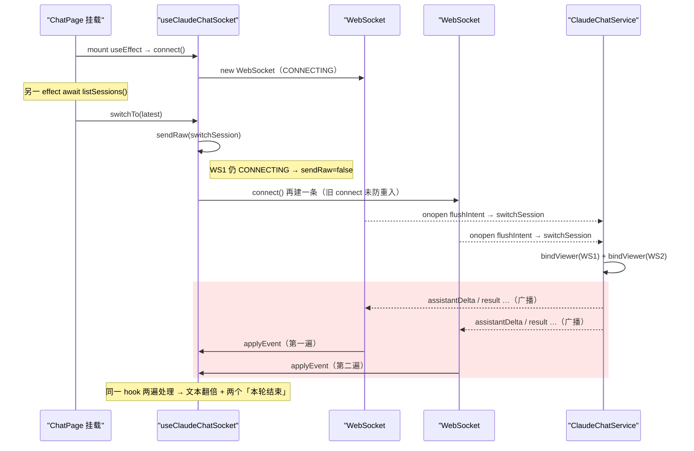

# 多端同看时一端消息重复（assistant 文本与「本轮结束」标记翻倍）

## 问题背景

- **功能路径**：claude-chat 前端会话页（`/tools/claude-chat`），多端同看（同一会话在两个页面/设备同时打开）。
- **现象（一句话）**：进入会话后，**其中一端**把同一条 assistant 回复整段重复渲染，且底部出现**两个**「— 本轮结束（success）—」标记；另一端干净正常。
- **复现参数**：

```text
设备 A（手机）：进入 claude-chat → 自动续上最近会话 → 同一轮回复内容翻倍、两个结束标记
设备 B（桌面）：同一会话，显示正常无重复
```

- **错误日志**：无异常抛出（纯前端事件重复投递，非报错型 bug）。

## 触发条件

| 条件 | 说明 |
|---|---|
| 进入 claude-chat 时存在历史会话 | 触发 ChatPage 的「自动续上最近会话」effect → `switchTo(latest)` |
| `listSessions()` 在初始 WS 仍 CONNECTING 时返回 | 决定 `switchTo` 内 `sendRaw` 失败 → 走 `connect()` 兜底 |
| 网络/加载较慢的一端（常为手机） | WS 握手未完成时 `listSessions` 已返回 → 命中竞态；较快的一端 WS 已 OPEN 则不触发 |

> 本质是**时序竞态**：同一份代码，握手与 `listSessions` 的相对快慢决定是否复现，故只有一端重复。

## 涉及类清单

| 角色 | 文件 / 符号 |
|---|---|
| 前端 WS hook | `frontend/src/features/claude-chat/hooks/useClaudeChatSocket.ts` → `connect()` / `switchTo()` / `open()` / `send()` |
| 会话页（自动续接触发点） | `frontend/src/features/claude-chat/pages/ChatPage.tsx` → 自动续上最近会话 `useEffect` |
| 服务端 viewer 广播 | `tools/.../service/ClaudeChatService.java` → `bindViewer()` / `broadcast()` |

## 关键代码路径

| 描述 | 文件路径 | 行号 | 说明 |
|---|---|---|---|
| 自动续接最近会话 | `frontend/src/features/claude-chat/pages/ChatPage.tsx` | ~43-55 | `await listSessions()` 后 `chat.switchTo(latest.id)`，与 mount 的 connect 并发 |
| **connect 未防重入** | `frontend/src/features/claude-chat/hooks/useClaudeChatSocket.ts` | ~192 | **每次调用都新建 WebSocket 并覆盖 `wsRef`，不关闭/不复用旧 socket** |
| switchTo 的 connect 兜底 | `frontend/src/features/claude-chat/hooks/useClaudeChatSocket.ts` | ~260 | `if (!sendRaw(...)) connect()`：socket 仍 CONNECTING 时 `sendRaw` 返回 false → 触发第二条 connect |
| onmessage→applyEvent | `frontend/src/features/claude-chat/hooks/useClaudeChatSocket.ts` | ~200,~94 | 两条 socket 的 onmessage 都指向同一 hook 的 applyEvent → 每事件处理两次 |
| 服务端按连接广播 | `tools/.../service/ClaudeChatService.java` | broadcast/bindViewer | 两条 WS = 两个 viewer，事件各发一份（服务端行为正确，问题在前端叠了第二条连接） |

## 核心流程分析



## 相关代码 / SQL 清单

修复前 `connect()`（节选）——无防重入，直接新建并覆盖：

```ts
const connect = useCallback(() => {
  const proto = ...
  const ws = new WebSocket(url)
  wsRef.current = ws   // 覆盖旧引用，但旧 socket 仍存活、仍在 onmessage
  ...
}, [...])
```

无 SQL 相关。

## 根因总结

| 问题现象 | 根因 |
|---|---|
| 一端 assistant 文本整段重复 | `connect()` 无防重入：mount 的 connect 与 auto-open 的 `switchTo→connect` 并发各建一条 WS，两条都成为服务端 viewer，事件各投递一份，被同一 hook 的 `applyEvent` 处理两遍 |
| 底部出现两个「本轮结束（success）」 | 同上——`result` 事件被两条 socket 各送一次，`applyEvent` 各 append 一个 result 项 |
| 只有一端重复，另一端正常 | 时序竞态：仅当 `listSessions()` 返回时初始 WS 仍 CONNECTING 才会触发第二条 connect；WS 已 OPEN 的一端 `sendRaw` 成功，不再 connect |

## 修复方案

| 级别 | 内容 |
|---|---|
| 短期（治标） | 无需——根因明确，直接治本 |
| 中期（治本，已实施） | 在 `connect()` 入口加**幂等防重入**：若 `wsRef.current` 处于 `CONNECTING` 或 `OPEN`，直接 `return`，不再叠第二条连接。仍在 CONNECTING 的那条 socket 会在 `onopen` 用最新 `intentRef` 下发意图（`switchSession`），因此第二条连接是多余的。重连路径（`onclose` 先把 `wsRef.current=null` 再 `connect()`）不受影响。 |
| 配置 / 运维 | 无 |

**改动文件**：`frontend/src/features/claude-chat/hooks/useClaudeChatSocket.ts`（`connect()` 增加 CONNECTING/OPEN 防重入判断）。

**验证**：手机端进入 claude-chat 自动续接最近会话，回复不再翻倍、仅一个「本轮结束」标记；两端同看时事件各自只渲染一份。
