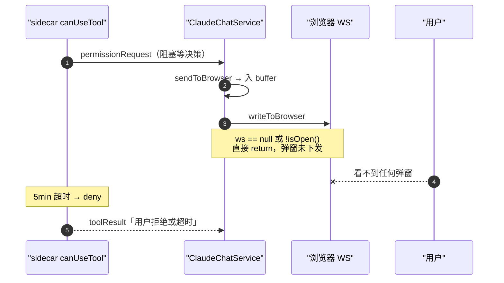
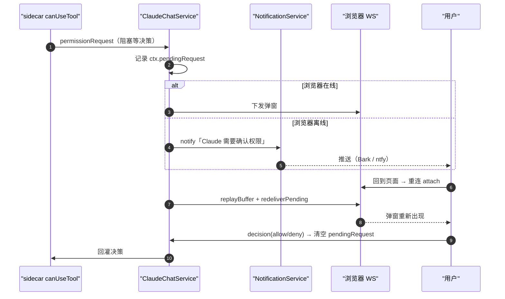

# 断线时权限弹窗未下发导致工具超时被拒

## 问题背景

- **功能路径**：claude-chat 工具（`/api/claude-chat/ws`）的工具权限 / AskUserQuestion 确认流程。
- **现象描述（一句话）**：`default` 权限模式下，需要弹框确认的工具调用（Write / AskUserQuestion 等）前端不弹确认框，约 5 分钟后工具返回「用户拒绝或超时」。
- **复现上下文**：

```json
{
  "mode": "default",
  "失败工具": ["Write", "AskUserQuestion"],
  "成功工具": ["Read", "Grep", "Glob", "Edit"],
  "现象": "失败工具无弹窗，5min 后 deny"
}
```

- **关键返回**：

```text
工具结果：用户拒绝或超时
```

## 触发条件

| 条件 | 说明 |
|---|---|
| 权限模式 | `default`（或 acceptEdits 下的非编辑类工具）——会触发 sidecar `canUseTool` 发起 permissionRequest |
| 浏览器连接状态 | 工具请求权限的**那一刻**，驱动该会话的浏览器 WS 已断开（手机切后台 / 锁屏 / 网络抖动 / 长轮次中途掉线） |
| 工具类型 | 需要交互确认的工具：非只读工具的权限请求、AskUserQuestion 提问请求 |
| 时间窗 | 断线持续超过 sidecar 决策超时（`CLAUDE_CHAT_DECISION_TIMEOUT_MS`，默认 5min） |

> 只读工具（Read/Grep/Glob）被 Agent SDK 自动放行，不进 `canUseTool`、不需要浏览器，故断线也成功——这解释了「读能成、写/提问全挂」。

## 涉及类清单

| 角色 | 全类名 / 路径 |
|---|---|
| 会话编排核心 | `com.exceptioncoder.toolbox.claudechat.service.ClaudeChatService` |
| WS 协议适配 | `com.exceptioncoder.toolbox.claudechat.config.ClaudeChatWebSocketHandler` |
| 服务端消息契约 | `com.exceptioncoder.toolbox.claudechat.api.dto.ServerMessage` |
| 通知服务 | `com.exceptioncoder.toolbox.claudechat.service.NotificationService` |
| sidecar 权限回调 | `sidecar/claude-agent/src/permissions.ts`（`Permissions.canUseTool`） |
| sidecar 会话管理 | `sidecar/claude-agent/src/sessionManager.ts` |
| 前端 socket hook | `frontend/src/features/claude-chat/hooks/useClaudeChatSocket.ts` |
| 前端弹窗 | `frontend/src/features/claude-chat/components/PermissionDialog.tsx` |

## 关键代码路径

| 描述 | 文件路径 | 行号 | 说明 |
|---|---|---|---|
| **断点：浏览器不在线直接 return** | `tools/tool-claude-chat/.../service/ClaudeChatService.java` | `writeToBrowser` | **`if (ws == null || !ws.isOpen()) return;` —— permissionRequest 被丢进 buffer，弹窗从未下发** |
| 事件缓冲 + 写出 | `tools/tool-claude-chat/.../service/ClaudeChatService.java` | `sendToBrowser` | 入环形 buffer 后调 writeToBrowser |
| 断线解绑 | `tools/tool-claude-chat/.../service/ClaudeChatService.java` | `onBrowserDisconnected` | WS 断开置 `ctx.browserWs = null`，会话不杀 |
| sidecar 阻塞等决策 | `sidecar/claude-agent/src/permissions.ts` | `canUseTool` / `waitFor` | 等不到决策，超时按 deny，message=「用户拒绝或超时」 |
| 转发 permissionRequest | `tools/tool-claude-chat/.../service/ClaudeChatService.java` | `onSidecarEvent` | case "permissionRequest" → sendToBrowser |

## 核心流程分析

### 修复前（断线 → 弹窗丢失 → 静默超时）



### 修复后（断线推送 + 重连重投）



## 相关代码 / SQL 清单

- 无 SQL 变更。
- 核心修复点（`ClaudeChatService`）：
  - `SessionCtx` 增 `volatile ServerMessage pendingRequest`，记录未决请求。
  - `onSidecarEvent` 的 permission/question 分支记录 pending，并在无活跃前台时 `notifications.notify(...)`。
  - `attach` 重连后 `redeliverPending(ctx, lastSeq)` 重投未读的未决请求。
  - `decision` / `onResult` 清空 `pendingRequest`。
- sidecar（`permissions.ts`）：超时（decision 为空）与显式拒绝分开返回，超时给「等待确认超时（页面可能不在线），请回到对话重新下发指令」。

## 根因总结

| 问题现象 | 根因 |
|---|---|
| 需要确认的工具不弹框 | `writeToBrowser` 在 `browserWs` 为 null / 关闭时直接 return，permissionRequest / questionRequest 仅入 buffer 未下发，用户毫不知情 |
| 5min 后返回「用户拒绝或超时」 | sidecar `canUseTool` 阻塞等决策，等不到 → 超时按 deny |
| 读类工具正常、写/提问失败 | 只读工具被 Agent SDK 自动放行，不经 `canUseTool`，与浏览器在线无关 |
| 重连后弹窗也不必然恢复 | 仅靠 `replayBuffer` 按 seq 重放；若该事件已读过或被 buffer 淘汰则不再下发，缺少对「未决请求」的显式重投 |
| 错误文案误导 | 显式拒绝与超时共用「用户拒绝或超时」，用户无法区分「我没拒绝，是没收到」 |

## 修复方案

| 级别 | 说明 |
|---|---|
| 短期（治标） | 调大 `CLAUDE_CHAT_DECISION_TIMEOUT_MS`，给断线重连留更长窗口 |
| 中期（治本，已实施） | 1) 断线时对权限/提问请求发推送通知；2) `SessionCtx.pendingRequest` 记录未决请求，重连 `attach` 时 `redeliverPending` 重投弹窗，`decision`/`onResult` 清空；3) sidecar 区分超时与显式拒绝，超时给出可操作文案 |
| 配置 / 运维 | 在 claude-chat 通知设置里启用 Bark / ntfy，离线时才能收到「待确认」提醒 |

## 验证要点

- **正常路径**：在线时权限/提问弹窗照常出现并可决策。
- **断线路径**：发起需确认工具后断开浏览器 → 收到推送 → 重新打开页面 → 弹窗自动重现 → 决策成功回灌。
- **回归**：bypassPermissions / acceptEdits（编辑类）仍自动放行，不受影响；只读工具不触发额外通知。
- **构建**：sidecar 需 `npm run build` 重新生成 `dist/`；后端需重启加载新 `ClaudeChatService`。
