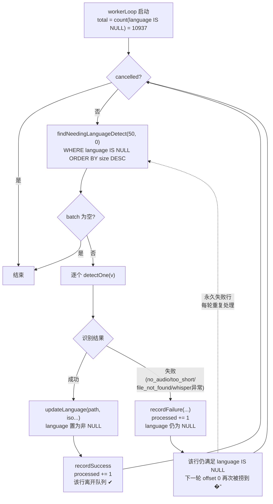

# 视频语言识别进度无限堆叠重复

## 问题背景

- **功能路径**：视频库 → 视频处理工具栏 → 「识别语言」任务（whisper-cli `--detect-language`）
- **现象描述**：任务一旦启动，进度数字 `processed/total` 中的 `processed` 会一路飙升并远超 `total`，永不结束。
- **复现快照**：

```text
识别语言  2130835 / 10937     ← processed=2130835 远大于 total=10937
```

- **关键观察**：`total`（= 启动时 `language IS NULL` 的视频数）固定为 10937，而 `processed` 无上限增长，说明同一批视频被反复处理、反复计数，任务进入死循环。

## 触发条件

| 条件 | 说明 |
|---|---|
| 存在「无法成功识别」的视频 | 无音轨 `no_audio_stream` / 时长 < 5s `too_short` / 文件不存在 `file_not_found` / whisper 单次异常 |
| 该类视频数 ≥ 1 | 只要有一个永久失败的视频，循环就不会收敛 |
| 失败视频恰好排在 `size DESC` 前部 | 因 `offset` 恒为 0，前 50 大失败视频会被最优先、最频繁地重复抓取 |

> 与具体数据量无关：哪怕只有 1 个永久失败的视频，worker 循环也会无限重复处理它。失败视频越多、占比越大，`processed` 增速越快。

## 涉及类清单

| 角色 | 全类名 |
|---|---|
| 任务 worker | `com.exceptioncoder.toolbox.treesize.service.VideoLanguageDetectionService` |
| 任务调度 / 进度上报 | `com.exceptioncoder.toolbox.treesize.service.VideoProcessingJobService` |
| job 行 CRUD | `com.exceptioncoder.toolbox.treesize.repository.ProcessingJobRepository` |
| 视频表查询 / 回写 | `com.exceptioncoder.toolbox.treesize.repository.VideoTableRepository` |
| 前端进度按钮 | `frontend/src/features/video-library/components/ProcessingJobButton.tsx` |

## 关键代码路径

| 描述 | 文件路径 | 行号 | 说明 |
|---|---|---|---|
| **worker 主循环** | `tools/tool-treesize/src/main/java/com/exceptioncoder/toolbox/treesize/service/VideoLanguageDetectionService.java` | 122-131 | **`while` 每轮 `findNeedingLanguageDetect(50, 0)`，offset 恒为 0，靠「行被处理后离开队列」收敛** |
| total 仅启动时计一次 | 同上 | 119-120 | `countNeedingLanguageDetect()` 拍快照写入 job.total，之后不再变 |
| 成功路径回写 language | 同上 | 168-169 | `updateLanguage(...)` → 该行 `language` 非 NULL → **离开队列** |
| 失败路径①无音轨 | 同上 | 153 | `recordFailure(no_audio_stream)`，**未回写 language** |
| 失败路径②太短 | 同上 | 159 | `recordFailure(too_short)`，**未回写 language** |
| 失败路径③文件丢失 | 同上 | 142 | `recordFailure(file_not_found)`，**未回写 language** |
| 失败路径④whisper 异常 | 同上 | 174 | `recordFailure(summarize(e))`，**未回写 language** |
| recordFailure 只动 job 表 | `tools/tool-treesize/src/main/java/com/exceptioncoder/toolbox/treesize/repository/ProcessingJobRepository.java` | 70-78 | `processed = processed + 1`，**完全不触碰 treesize_video** |
| 出队条件 = language IS NULL | `tools/tool-treesize/src/main/java/com/exceptioncoder/toolbox/treesize/repository/VideoTableRepository.java` | 102-107 | `WHERE language IS NULL ORDER BY size DESC LIMIT ? OFFSET ?`，失败行永远命中 |

## 核心流程分析

worker 把「视频离开 `language IS NULL` 队列」当作进度推进的唯一信号，但**只有成功路径写了 language，失败路径没写**——于是失败行成为永不消失的队头，循环空转。



关键死循环回路：失败行 → 仍 `language IS NULL` → 下一轮 `offset 0` 再次进 batch → 再次失败 → `processed += 1` …… 无限。当全部剩余行都是失败行时，`batch` 永不为空、永不收敛，`processed` 单调爆涨。

## 相关代码 / SQL 清单

出队判定 SQL（失败行始终命中，因为 language 没被写过）：

```sql
-- VideoTableRepository.findNeedingLanguageDetect
SELECT ... FROM treesize_video
WHERE language IS NULL          -- 失败行永远满足此条件
ORDER BY size DESC
LIMIT 50 OFFSET 0;              -- offset 恒为 0，靠出队收敛，但失败行从不出队
```

失败上报 SQL（只加计数，不碰视频表）：

```sql
-- ProcessingJobRepository.recordFailure
UPDATE video_processing_job
SET processed = processed + 1, failed = failed + 1, current_path = ?, error_msg = ?
WHERE id = ?;
-- 注意：没有任何针对 treesize_video 的写入
```

对比成功上报（额外回写了 treesize_video.language，使行出队）：

```java
// VideoLanguageDetectionService.detectOne 成功分支
videoRepo.updateLanguage(v.path(), dl.iso(), dl.confidence(), System.currentTimeMillis()); // 出队
jobService.recordSuccess(ctx, v.path());
```

## 根因总结

| 问题现象 | 根因 |
|---|---|
| `processed` 远超 `total` 且无限增长 | 失败视频从不回写 `treesize_video.language`，始终满足 `language IS NULL`，每轮 `findNeedingLanguageDetect(50, 0)` 重复捞到并重复 `processed += 1` |
| 任务永不结束（`batch` 始终非空） | worker 的退出条件是「队列空」，而永久失败行让队列永远非空，形成死循环 |
| 越大的失败视频被处理得越频繁 | `ORDER BY size DESC` + `OFFSET 0`，前 50 大的失败行每轮都排在队头被优先重抓 |
| `total` 与 `processed` 语义错位 | `total` 是启动时 `language IS NULL` 的去重快照，`processed` 却按「尝试次数」累加，二者对同一批失败行的计数口径不一致 |

## 修复方案

| 级别 | 方案 |
|---|---|
| 短期（治标） | worker 内用一个 `Set<String> attempted` 记录本轮已尝试过的 path，`findNeedingLanguageDetect` 取回后过滤掉已尝试的；全部剩余都在 `attempted` 中则 break。能立即止血，但进程重启后失效，且不持久化失败状态。 |
| 中期（治本，推荐） | **让失败行也出队**：给失败视频写一个哨兵态，使其不再满足 `language IS NULL`。两种落地：① 复用 `language` 列写哨兵值（如 `und` / `xx`），最省事但污染语义；② 新增 `language_detect_failed`（或 `language_attempted_at`）列，`findNeedingLanguageDetect` 改为 `WHERE language IS NULL AND language_detect_failed IS NULL`，并同步更新 partial index `idx_video_language_null`。`recordFailure` 路径需相应调用 `videoRepo` 打标。语义清晰、可区分「未识别」与「识别失败」、支持后续手动重试。 |
| 配置 / 运维 | 清理已堆叠的脏 job 行：把当前 RUNNING 的语言识别 job 置为 CANCELLED/FAILED（或重启触发 `cleanupStaleRunning`），避免 2130835 这种异常计数继续展示。 |

> 推荐采用中期方案②（独立失败标记列）：既根除死循环，又保留「成功 / 未处理 / 失败」三态可观测性，便于将来对失败视频做定向重试，而不会被哨兵值混淆。

---

## 通用化：4 个视频处理任务通病（2026-06-01 复盘 + 修复）

后续发现这不是语言识别独有，**探测时长 / 按名称归类 / 识别语言 / 生成九宫格 4 个任务全部中招**，根因同构：worker 的「待处理清单」按 `WHERE <结果列> IS NULL` 查，靠成功写结果列出队，但**失败路径从不让该列变成非 NULL**，于是失败行永远在清单里被反复处理 → `processed` 超量、`total` 降不下来、用户感觉「每次重新统计全部、没登记」。

| 任务 | 旧 needing 谓词 | 失败行为什么不出队 |
|---|---|---|
| 识别语言 | `language IS NULL` | 失败只 recordFailure，不写 language |
| 生成九宫格 | `thumbnail_grid_path IS NULL` | 失败只 recordFailure，不写 grid_path |
| 探测时长 | `duration_s IS NULL` | 失败写了 `duration_bucket=unknown` 但**谓词 key 在 duration_s**（仍 NULL）→ 仍命中 |
| 按名称归类 | `series_signature IS NULL` | 失败（极少）不写 signature |

### 已实施修复（方案②的"复用已有列"落地，无新增字段）

出队判定统一改 key 到「成功/失败都会写」的标记列：

| 任务 | 新 needing 谓词 | 失败时补写 |
|---|---|---|
| 识别语言 | `language_detected_at IS NULL` | `markLanguageAttempted` 盖时间戳（language 仍 NULL） |
| 生成九宫格 | `thumbnail_grid_generated_at IS NULL` | `markThumbnailGridAttempted` 盖时间戳（grid_path 仍 NULL） |
| 探测时长 | `duration_bucket IS NULL` | 失败已写 `duration_bucket=unknown`（只改了查询 key） |
| 按名称归类 | `series_signature IS NULL`（不变） | 失败写哨兵 `__ungrouped__` |

配套：`treesize-schema.sql` 把 3 个 partial index 改 key（`idx_video_*_null` → `idx_video_*_pending`，DROP 旧建新）；前端 `ProcessingJobButton` 不变。

**自愈**：旧的历史失败行——探测时长因早已写过 bucket=unknown，改查询后立即不再出现；语言/九宫格的历史失败行（标记列仍 NULL）会在下一轮被处理一次、盖上标记后排空，不再无限重复。

涉及改动文件：`VideoTableRepository`（3 查询改谓词 + 2 个 markXxxAttempted）、`VideoLanguageDetectionService`/`VideoThumbnailGridService`（失败统一出口 helper）、`VideoNameGroupingService`（失败写哨兵）、`treesize-schema.sql`（partial index）。
