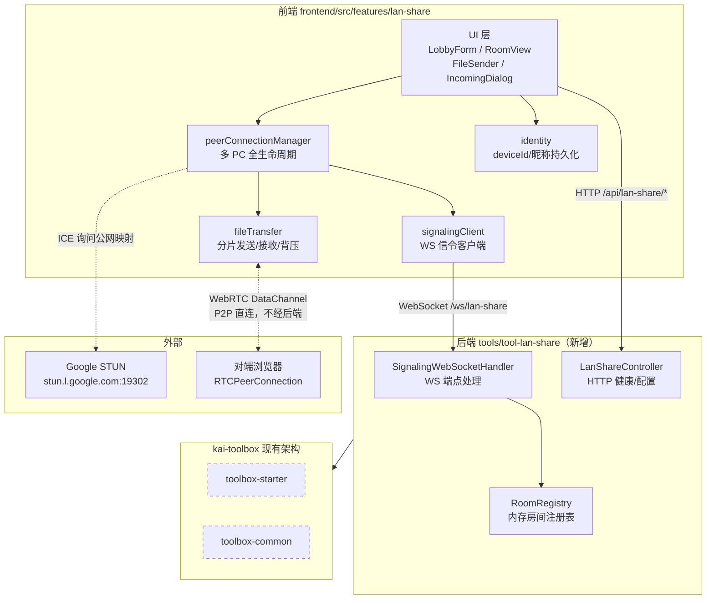
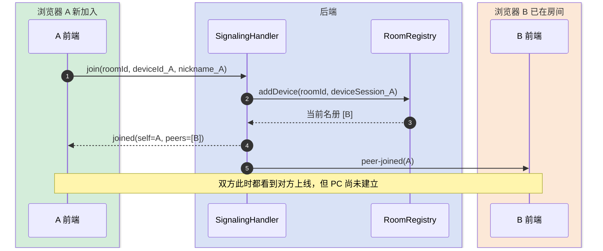
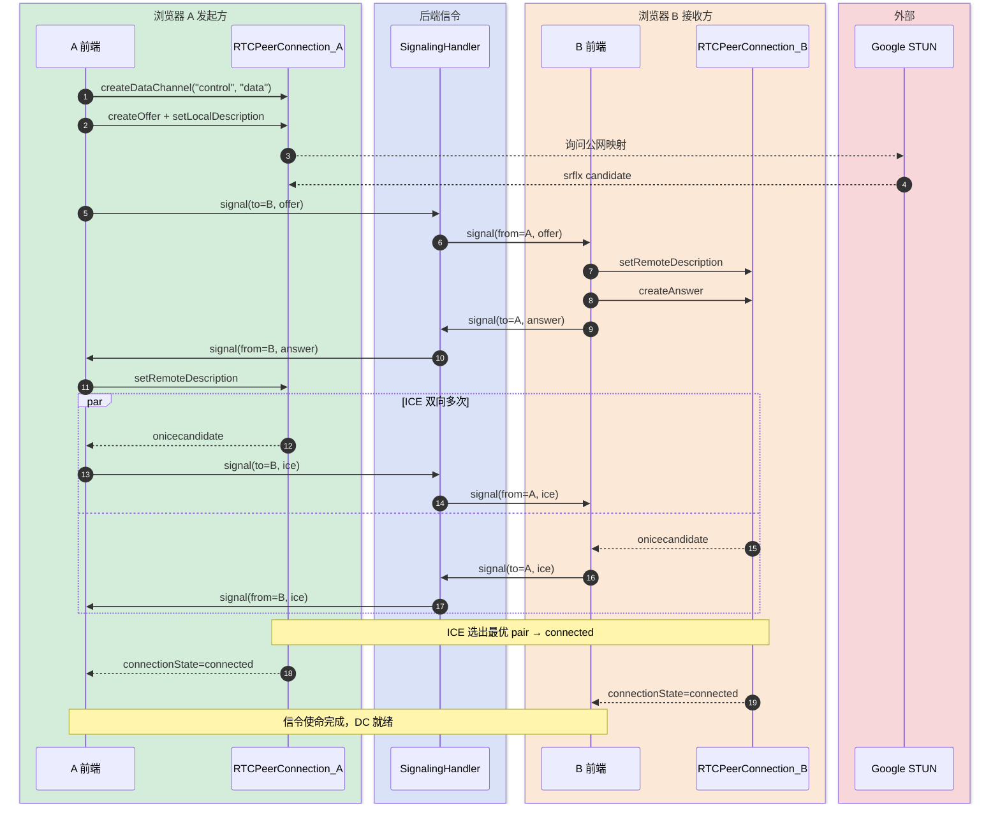
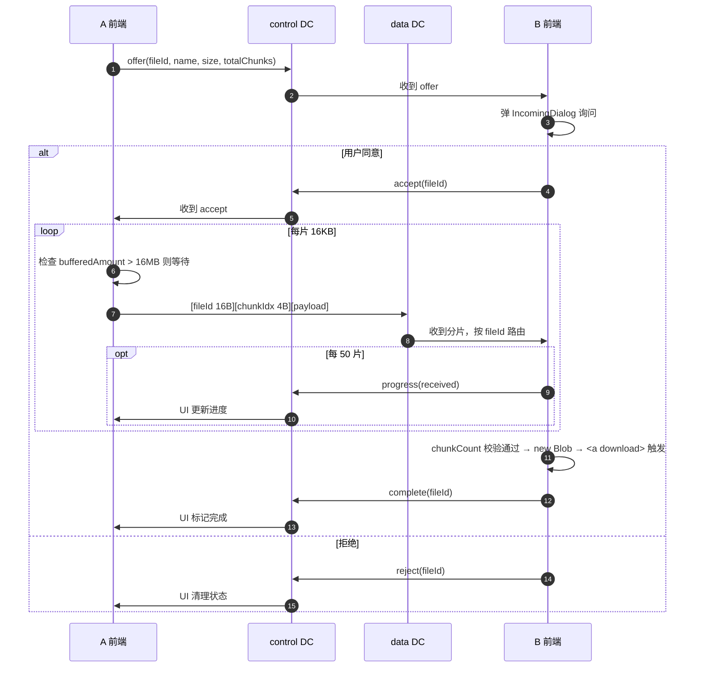
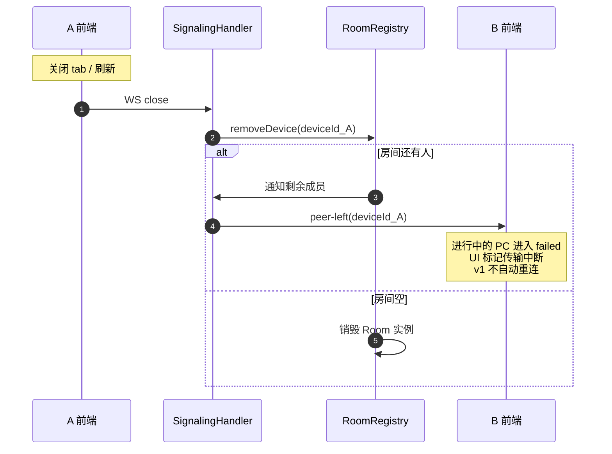

# 局域网文件传输 设计文档 v1（技术方案）

> 文档类型：完整-技术（基于 `template-tech.md`）
> 创建日期：2026-05-05
> 项目：kai-toolbox
> 配套接口文档：`局域网文件传输-api-20260505-v1.md`

## 变更记录

| 版本 | 日期 | 修改人 | 变更内容摘要 |
|------|------|--------|--------------|
| v1 | 2026-05-05 | AI 草稿 | 首次落稿，按 template-tech.md 技术方案模板编写 |

---

## 1. 目标与边界

- **要解决的问题**：跨设备（PC / 手机 / 平板）在同 LAN 或跨网段之间互传小文件，替代微信文件助手 / U 盘等低效方式
- **本次目标**：在 kai-toolbox 新增 `tool-lan-share` 工具模块，用户输入相同房间号即视为同组，组内可单发或群发文件
- **不做什么**：
  - 不部署 TURN（双对称 NAT 失败可接受）
  - 不做断点续传 / 房间密码 / 传输历史 / 文件加密层（DataChannel 自带 DTLS）
  - 不做超大文件流式落盘（v1 用 Blob，软上限 1GB）
- **设计结论**：WebRTC + Google STUN 直连 P2P，后端只做信令（Spring WebSocket），文件字节不经后端

---

## 2. 整体架构



> 实线 = 新增；虚线 = 已有；箭头方向 = 调用方向。
> **关键观察**：文件流量（最粗的那条边）是 `fileTransfer ↔ 对端浏览器` 直连，**完全不经过后端**。后端只承载几 KB 信令。

---

## 3. 模块拆分与职责

### 3.1 SignalingWebSocketHandler（后端）

- **定位**：WebSocket 消息分发器，将客户端 join/leave/signal 转交给 RoomRegistry
- **职责**：
  - 解析入站 JSON，按 `type` 路由
  - WS `afterConnectionClosed` 时自动调用 RoomRegistry 清理
- **上游**：客户端浏览器（通过 Spring WebSocket 框架）
- **下游**：`RoomRegistry`
- **关键设计点**：
  - 协议：原生 WebSocket（不引入 STOMP，开销 + 学习成本不值得）
  - 并发：依赖 Spring 提供的 per-session 线程模型；RoomRegistry 内部加锁保证一致性

### 3.2 RoomRegistry（后端）

- **定位**：房间状态的唯一权威存储
- **职责**：
  - 维护 `Map<roomId, Room>`，按 deviceId 增删 DeviceSession
  - 房间空时自动销毁
  - 信令透传时按 `to` 字段查找目标 session
- **上游**：`SignalingWebSocketHandler`
- **下游**：无（终端存储）
- **关键设计点**：
  - 状态管理：纯内存，重启即清空
  - 并发：每个 Room 内的成员变更走 `synchronized`，避免新成员看到部分名册
  - 容量：单房间硬限 10 人，超出返回 `room-full`

### 3.3 signalingClient（前端）

- **定位**：WebSocket 信令客户端
- **职责**：
  - 维护 WS 连接 + 自动重连（v1 仅重连，无心跳）
  - 提供 `send(type, payload)` 与 `on(type, handler)` 双向接口
- **上游**：`peerConnectionManager`、`hooks/useRoom`
- **下游**：浏览器原生 `WebSocket` API
- **关键设计点**：
  - 消息分发：内置事件订阅机制，避免多个调用方互相干扰
  - 失败行为：onclose 时立即标记不可用，重连 5 秒一次最多 3 次

### 3.4 peerConnectionManager（前端）

- **定位**：多对 RTCPeerConnection 的全生命周期管理者
- **职责**：
  - 按 `deviceId` 维护 `Map<deviceId, RTCPeerConnection>`
  - 处理 onicecandidate / onnegotiationneeded / connectionstatechange
  - 在每个 PC 上建 control + data 两条 DataChannel
- **上游**：`FileSender`、`IncomingDialog`
- **下游**：`signalingClient`、`fileTransfer`、浏览器 WebRTC API、Google STUN
- **关键设计点**：
  - 拓扑：mesh，N 个接收方 = N 条独立 PC（不做 SFU）
  - 建链超时：10s 内未 connected 则关闭并报错
  - 重用：与同一 peer 已建链则复用 PC，避免每个文件都重新协商

### 3.5 fileTransfer（前端）

- **定位**：文件分片发送 / 接收 / 拼装 / 背压控制
- **职责**：
  - 发送方：File → ArrayBuffer → 分片 16KB → 写入 data DC
  - 接收方：data DC 帧 → 按 fileId 路由 → 按 chunkIdx 入数组 → 全部到齐拼装 Blob
  - control DC 上交换 offer/accept/progress/complete
- **上游**：`peerConnectionManager`
- **下游**：浏览器 `Blob` / `RTCDataChannel` API
- **关键设计点**：
  - 分片大小：固定 16KB（DataChannel 推荐值）
  - 背压：`bufferedAmountLowThreshold = 1MB`，`bufferedAmount > 16MB` 暂停发送
  - 多文件并发：同一对 peer 共用一对 control/data DC，按 fileId 路由

---

## 4. 关键交互

### 4.1 房间加入与名册同步

> **触发**：用户在 LobbyForm 输入房间号点击"加入"
> **参与方**：A 浏览器（前端）、后端 SignalingHandler+RoomRegistry、其他已在房间的 B 浏览器



### 4.2 P2P 建链（信令 SDP/ICE 交换）

> **触发**：A 想给 B 发文件，调用 `peerConnectionManager.connectTo(B)`
> **参与方**：A 浏览器、后端信令、B 浏览器、Google STUN



### 4.3 文件分片传输

> **触发**：4.2 已 connected，A 选了文件点击"发送"
> **参与方**：A 前端 / data DC / control DC / B 前端
> **后端不参与**——纯 P2P



> **群发**：上图为单发；群发时 A 对每个目标成员独立跑一遍 4.2 + 4.3，无新协议。

### 4.4 离开 / 异常处理

> **触发**：任一方关闭 tab、网络中断、PC connectionState 变为 failed



---

## 5. 核心业务规则

| 规则 | 说明 |
|------|------|
| 房间号格式 | trim 后 1-64 字符，匹配 `^[a-zA-Z0-9_\-一-龥]+$` |
| 房间生命周期 | 首个 join 创建，最后一人离开即销毁；最大 10 人 |
| 同 deviceId 重连 | 关旧 WS、替换为新会话，**不广播 peer-joined**（避免对端列表闪烁） |
| deviceId 持久化 | 前端 `localStorage['kai-toolbox.lan-share.deviceId']`，UUID v4 |
| 信令转发 | 后端不解析 `payload`，仅按 `to` 透传；不做速率限制（ICE 阶段小包密集） |
| 分片大小 | 固定 16KB |
| 背压 | `bufferedAmountLowThreshold = 1MB`；`bufferedAmount > 16MB` 暂停发送，等 `onbufferedamountlow` |
| 多文件并发 | 同一对 peer 共用一对 control/data DC，按 `fileId` 路由 |
| 完整性校验 | 仅判 `received chunkCount == totalChunks`，不做哈希（DataChannel 已可靠） |
| 建链超时 | createOffer 后 10s 内未 connected → 关 PC，UI 报"无法建立直连" |
| ICE 服务器 | 仅 `stun:stun.l.google.com:19302`，列表通过 `/api/lan-share/ice-config` 下发以便后续切换 |

---

## 6. 编码落点

```text
tools/tool-lan-share/src/main/java/com/kaitoolbox/lanshare/
├── LanShareToolDescriptor.java                    [新增] 实现 ToolDescriptor，注册到侧边栏
├── config/
│   └── WebSocketConfig.java                       [新增] 注册 /ws/lan-share 端点
├── signaling/
│   ├── SignalingWebSocketHandler.java             [新增] 处理 join / leave / signal 消息
│   ├── SignalMessage.java                         [新增] 入站 DTO（type + 联合字段）
│   └── OutboundMessage.java                       [新增] 出站工厂（joined / peer-joined / peer-left / signal / error）
├── room/
│   ├── RoomRegistry.java                          [新增] ConcurrentHashMap<roomId, Room>，join/leave/forward
│   ├── Room.java                                  [新增] 房间 domain，Map<deviceId, DeviceSession>
│   └── DeviceSession.java                         [新增] 包装 WebSocketSession + nickname + joinedAt
└── controller/
    └── LanShareController.java                    [新增] /api/lan-share/health + /ice-config

frontend/src/features/lan-share/
├── index.tsx                                      [新增] feature manifest
├── pages/
│   └── LanSharePage.tsx                           [新增] 顶层容器，按状态切 Lobby / Room
├── components/
│   ├── LobbyForm.tsx                              [新增] 房间号 + 昵称表单
│   ├── RoomView.tsx                               [新增] 房间主界面
│   ├── PeerList.tsx                               [新增] 成员列表
│   ├── FileSender.tsx                             [新增] 文件选择 + 目标选择（单选/全员）
│   ├── IncomingDialog.tsx                         [新增] 接收确认弹窗
│   └── TransferList.tsx                           [新增] 传输列表 + 进度条
├── services/
│   ├── signalingClient.ts                         [新增] WebSocket 封装 + 消息分发
│   ├── peerConnectionManager.ts                   [新增] Map<deviceId, RTCPeerConnection> 全生命周期
│   ├── fileTransfer.ts                            [新增] 分片发送 / 接收 / 组装 / 背压
│   └── identity.ts                                [新增] deviceId / 昵称 localStorage
└── hooks/
    └── useRoom.ts                                 [新增] 房间状态聚合 hook
```

---

## 7. 数据与依赖变更

| 类型 | 是否变化 | 说明 |
|------|----------|------|
| 数据库表 / 字段 / 索引 | 无 | 整套设计零持久化 |
| DTO / VO / 枚举 | 有 | 后端新增 `SignalMessage` / `OutboundMessage` 系列，仅本模块内使用 |
| 下游接口 / 外部依赖 | 有 | 新增对 `stun:stun.l.google.com:19302` 的依赖（UDP/3478，浏览器侧调用，后端不直连） |
| 缓存 / 消息 / 锁 / 事务 | 有 | 新增 Spring WebSocket 能力，依赖 `spring-boot-starter-websocket`；`Room` 内部 `synchronized` 保证 join/leave 原子 |

---

## 8. 风险与待确认

| 风险 / 待确认点 | 影响 | 处理方式 |
|----------------|------|----------|
| 双对称 NAT 导致 P2P 失败 | 跨网段无法用 | UI 明确报错；不引入 TURN |
| Google STUN 不稳定 / 被墙 | 跨网段建链失败率上升 | `/ice-config` 服务端化，可热切换其他公共 STUN |
| Blob 内存上限 | 超大文件接收方崩溃 | v1 软上限 1GB；后续上 File System Access API |
| 同设备多 tab 共享 deviceId | 后开 tab 踢前一 tab | 有意为之；如需独立改 sessionStorage |
| 房间号是弱凭证 | 被同事偶然撞房导致信息泄露 | **待确认**：v1 是否需要房间密码 |
| 后端包路径 | 影响所有新增类 | **待确认**：用 `com.kaitoolbox.*` 还是项目现有 group |
| 房间最大 10 人 / 文件软上限 1GB | 限制使用边界 | **待确认**：是否合适 |

---

## 9. 验证要点

- **正常路径**：
  - 同一台机器两个浏览器进同房间，互传 1MB / 100MB / 1GB 文件
  - 三台设备同房间，群发 10MB 文件
- **异常路径**：
  - 接收方拒绝 → 发起方收到 reject，UI 标记
  - 传输中关闭接收方 tab → 发起方 PC 进入 failed，UI 标记失败
  - 信令 WS 中途断开 → 已建立的 PC 不受影响（继续传），新建链失败
  - `to` 写错的 deviceId → 收到 `error: peer-not-found`
  - 第 11 人加入 → 收到 `error: room-full`
- **边界条件**：
  - 文件大小 = 0 / 1B / 16KB / 16KB+1
  - `chunkIdx` 乱序到达（DataChannel ordered 应不会发生，但代码不能假设按顺序入 array）
  - 房间号含中文 / 含空白 trim
- **回归范围**：
  - 仅新增模块，不影响 `tool-treesize`
  - 验证 `mvn -pl toolbox-starter -am package` 仍能产出可启动 fat jar
