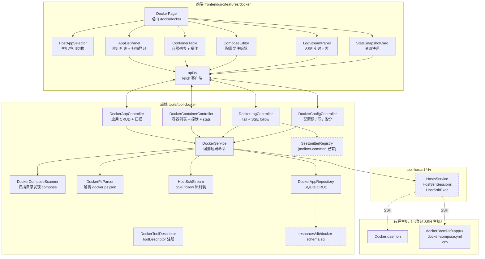
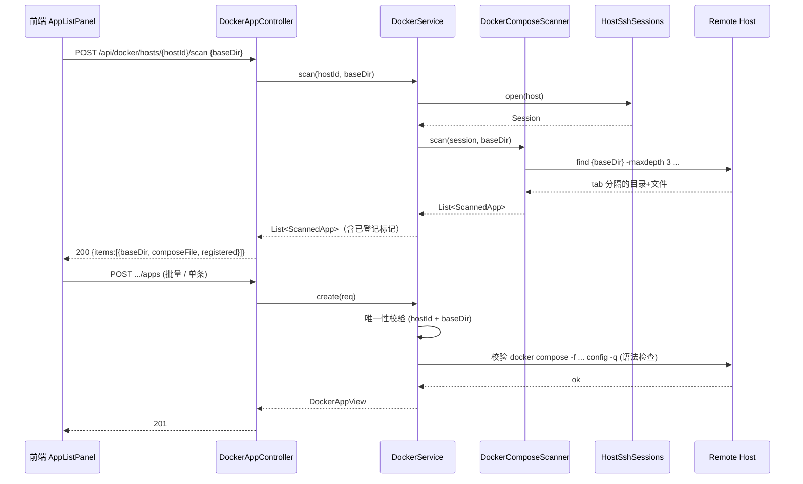
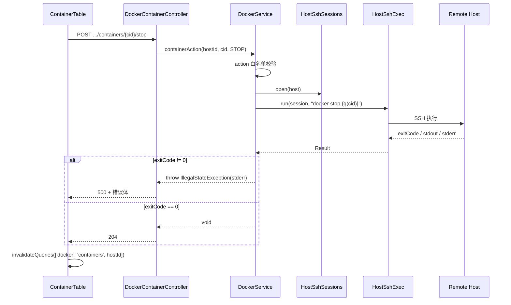
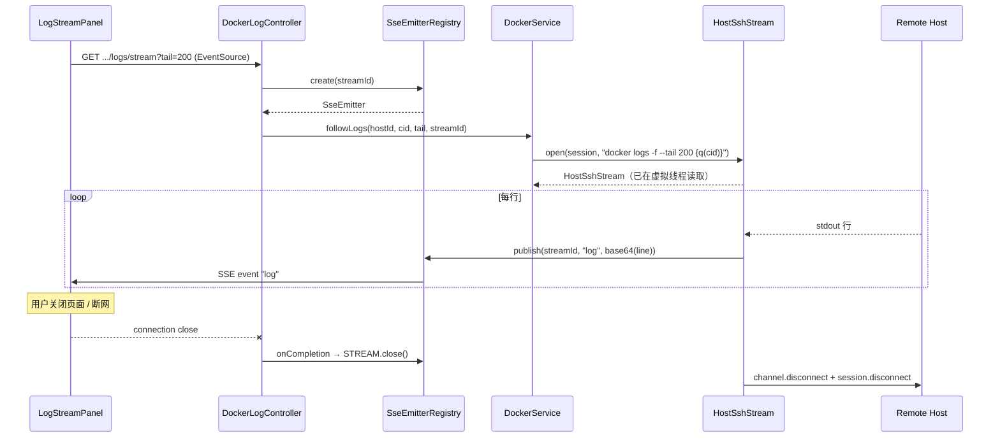
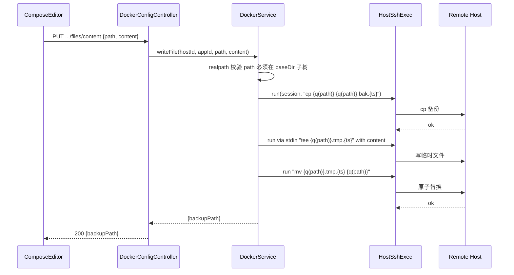

# Docker 服务治理

> 最后更新：2026-05-27
> 模版：完整-技术（template-tech）

在 kai-toolbox 内新增一个工具，统一管理已登记 SSH 主机上的 Docker 应用：用户先把主机上的 Docker 应用目录（如 `/opt/dockerApps/{app}`）登记为「应用条目」，工具即可远程执行 `docker compose` / `docker` 命令完成应用启停、配置读写、容器状态查看与日志流式查看。定位为 kai-toolbox 单用户本机工具的「远程 Docker 控制台」，不做镜像构建、不做集群编排、不做容器交互式 shell（交互 shell 由 Web 终端承担）。

---

## 1. 目标与边界

### 1.1 要解决的问题

- 多台 ECS / NAS 上分散部署了 Docker 应用，目前只能 SSH 进去手动跑 `docker ps`、`docker compose up -d`、`tail -f`，缺少一个集中可视化的远程控制台
- 已有「主机管理」统一登记了 SSH 主机，但单纯能登 SSH 还不够，需要把「主机 + Docker 应用目录」绑定为一等公民，避免每次都要记忆路径
- compose 文件、`.env` 文件经常需要快速查看 / 微调（端口、镜像版本），缺少不用 SSH 编辑的入口

### 1.2 本次目标

- 新增工具模块 `tool-docker` 与前端 `frontend/src/features/docker/`，路由 `/tools/docker`
- **应用登记**：把「主机 id + 应用目录 + compose 文件名」绑定为持久化条目，跨会话复用
- **目录扫描**：给定一个根目录（如 `/opt/dockerApps`），递归发现含 `docker-compose.y[a]ml` / `compose.y[a]ml` 的子目录，一键登记
- **容器列表**：远程 `docker ps -a --format json` 拉取主机上全部容器；与已登记应用关联（按 `com.docker.compose.project` label 或 `working_dir`）
- **容器控制**：单容器 `start` / `stop` / `restart` / `pause` / `unpause` / `kill`
- **应用控制**：基于登记目录 `docker compose up -d` / `down` / `restart` / `pull`
- **日志**：tail 最近 N 行（HTTP 一次性返回）+ SSE 流式 follow（沿用项目 `SseEmitterRegistry`）
- **配置读写**：读取登记目录下 compose 文件、`.env`、同级 `*.yml/*.conf/*.env*` 配置；可在前端编辑后保存（保存前自动备份为 `{file}.bak.{ts}`）
- **资源快照**：`docker stats --no-stream` 一次性拍照（CPU% / MemUsage / NetIO / BlockIO）

### 1.3 不做什么（第一版边界）

| 不做 | 原因 |
|------|------|
| Docker 守护进程安装 / 升级 | 守护进程是主机环境，属于运维初始化范畴，不在工具范围内 |
| 镜像 build / push、注册表登录 | 需引入 registry 凭据管理 + 构建上下文上传，远超本期 |
| 网络 / 卷的 CRUD | 同上，第一版仅做"应用 + 容器 + 日志 + 配置"四件事 |
| 集群（Swarm / k8s） | 不在 kai-toolbox 定位内 |
| 实时 `docker stats` 流 | 长连接 + 频繁解析，性价比低；第一版只做单次快照 |
| 容器内 `docker exec` 交互 shell | 已有 Web 终端，用户可在终端里手动 `docker exec`；本工具只做编排 |
| 跨主机批量操作 | 第一版只对当前选中的一台主机操作 |
| 多用户、权限隔离 | 与 CLAUDE.md「local single-user toolkit, no auth」一致 |

### 1.4 设计结论

- **命令执行模型**：所有动作 = 在远端跑一条 shell 命令（`docker ...` / `docker compose ...` / `cat`/`tee`）。复用 `HostSshSessions.open` 建会话、`HostSshExec.run` 跑一次性命令、自实现 `HostSshStream` 跑 follow 流。
- **应用模型**：应用条目 = `(host_id, name, base_dir, compose_file, note)`，**不持久化容器状态**——容器状态来自远端 `docker ps`，**后端 30s 内存缓存**降低连发压力，写操作（容器动作 / compose 动作）后主动失效；前端 TanStack Query `staleTime=30_000` 联动避免无谓请求。`?nocache=true` 可强制绕过缓存。
- **容器关联**：通过 `docker ps --format '{{json .}}'` 结合 `--filter "label=com.docker.compose.project=<dir 名>"` 把容器归类到应用；fallback 用 `working_dir` 字符串前缀匹配。
- **日志流**：复用 `SseEmitterRegistry`（既有 SSE 模式）+ 虚拟线程跑 `docker logs -f --tail 200 <container>`，按行 base64 编码后推回前端（避免控制字符破坏 SSE）。
- **配置安全**：所有用户传入的容器 ID / 路径 / 文件名通过 `HostSshExec.singleQuote` 套单引号；compose 文件写入用临时文件 + `mv` 的两步法（先写 `{file}.tmp.{ts}`、`mv` 替换、保留 `.bak.{ts}` 备份），避免半写状态。
- **持久化**：新增 SQLite 表 `docker_app`（沿用项目 `SchemaInitializer` + `CREATE TABLE IF NOT EXISTS` 约定）。
- **前端导航**：左侧选中主机 → 选中应用 → 主区显示容器列表 / 配置文件 / 日志 三 Tab；顶部独立 Tab「全部容器」展示主机上未归属任何应用的"野生"容器。

---

## 2. 整体架构



**说明：**

- 新增模块 `tool-docker` 通过 `HostsService` 拿主机定义，通过 `HostSshSessions` 开 SSH 会话，所有远程动作都是「打开 session → 跑命令 → 关 session」（短连接，避免维护连接池的复杂度）
- 日志 follow 唯一例外：会持有 session 直到 SSE 断开
- `docker_app` 表只存登记关系；容器状态、应用是否启动等运行时数据全部不缓存，每次实时拉
- 前端用 TanStack Query 做请求缓存与失效（容器列表 30s `staleTime`、操作后立即 `invalidateQueries`）

---

## 3. 模块拆分与职责

### 3.1 tool-docker / config

#### 3.1.1 `DockerToolDescriptor`
- **定位**：实现 `ToolDescriptor` 接口暴露工具元数据。
- **职责**：`id=docker`、`name=Docker 治理`、`icon=container`（或 `boxes`）、`route=/tools/docker`、`group=运维工具`、`order=35`。
- **关键设计点**：与 `HostsToolDescriptor`（order=30）相邻，强调依赖关系。

### 3.2 tool-docker / api

#### 3.2.1 `DockerAppController`
- **定位**：登记应用与目录扫描。
- **职责**：
  - `GET /api/docker/hosts/{hostId}/apps` 列出已登记应用
  - `POST /api/docker/hosts/{hostId}/apps` 新增 / `PUT` 修改 / `DELETE` 删除
  - `POST /api/docker/hosts/{hostId}/scan` 给定根目录扫描发现 compose 应用
- **上游**：前端 `AppListPanel`。
- **下游**：`DockerService`、`DockerAppRepository`。

#### 3.2.2 `DockerContainerController`
- **定位**：容器维度的查询与控制。
- **职责**：
  - `GET /api/docker/hosts/{hostId}/containers?appId=...&includeStopped=true` 列出容器（可按应用过滤）
  - `POST /api/docker/hosts/{hostId}/containers/{cid}/{action}` 执行 start/stop/restart/pause/unpause/kill
  - `GET /api/docker/hosts/{hostId}/containers/stats` 全主机一次性 `docker stats --no-stream` 快照
  - `POST /api/docker/hosts/{hostId}/apps/{appId}/compose/{action}` 执行 up/down/restart/pull
- **关键设计点**：动作枚举固定白名单 + 不可为空，避免命令注入。

#### 3.2.3 `DockerLogController`
- **定位**：日志查看入口。
- **职责**：
  - `GET /api/docker/hosts/{hostId}/containers/{cid}/logs?tail=200` 一次性 tail
  - `GET /api/docker/hosts/{hostId}/containers/{cid}/logs/stream?tail=200` 返回 `SseEmitter`，订阅 `log` 事件
  - `DELETE /api/docker/streams/{streamId}` 客户端主动关闭流（防泄漏）
- **关键设计点**：SSE 数据帧 `data` 字段为 base64(UTF-8 行)，避免换行/特殊字符破坏 SSE 格式；服务端在 `SseEmitter.onCompletion/onTimeout/onError` 中触发 SSH 流关闭。

#### 3.2.4 `DockerConfigController`
- **定位**：远端 compose / env 文件读写。
- **职责**：
  - `GET /api/docker/hosts/{hostId}/apps/{appId}/files` 列同目录下白名单后缀文件（`*.yml`、`*.yaml`、`.env`、`*.env`、`*.conf`）
  - `GET /api/docker/hosts/{hostId}/apps/{appId}/files/content?path=...` 读单文件（路径必须在 baseDir 子树下）
  - `PUT /api/docker/hosts/{hostId}/apps/{appId}/files/content` 写文件，自动 `.bak.{ts}` 备份
- **关键设计点**：路径白名单 = 必须在 `baseDir` 真实路径下（用 `realpath` 校验，防 `..` 越权）；单文件上限 256KB。

### 3.3 tool-docker / service

#### 3.3.1 `DockerService`
- **定位**：编排远端命令、把 Controller 请求翻译成 SSH 调用。
- **职责**：
  - 拿到 `hostId` 后通过 `HostsService.findRequired(hostId)` 取 `Host`
  - 调用 `HostSshSessions.open(host)` 开 session、`HostSshExec.run` 跑命令、解析结果、关 session
  - 不直接处理 SSE，把 `SseEmitter` 注入流式方法
  - 容器列表读 / 写经过 `ContainerCache`，写操作完成后主动 invalidate
- **关键设计点**：每个 public 方法都是 try-with-resources 风格关 session；命令字符串组装走专用 `CommandBuilder` 防注入。

#### 3.3.5 `ContainerCache`
- **定位**：容器列表 / stats 的轻量 TTL 缓存，避免前端高频刷新刺穿 SSH。
- **职责**：
  - `get(key, loader)`：30s 内命中返回快照，过期则回源；同 key 并发回源用 `synchronized(key.intern())` 串行化
  - `invalidateHost(hostId)`：容器 / compose 动作后调用，清掉本 host 所有 key
- **关键设计点**：`ConcurrentHashMap<String, Entry>` 自实现（不引 Caffeine，遵循 CLAUDE.md「不预先抽中间件」）；`Entry = (value, expireAtMs)`；key 格式 `containers:{hostId}:{appId?}:{includeStopped}` 与 `stats:{hostId}`。

#### 3.3.2 `DockerComposeScanner`
- **定位**：远端目录扫描。
- **职责**：跑一条 `find {baseDir} -maxdepth 3 -type f \( -name docker-compose.y*ml -o -name compose.y*ml \) -printf '%h\t%f\n'`，按 tab 分割结果。
- **关键设计点**：`maxdepth=3` 兼容 `{root}/{app}/{compose 文件}` 与 `{root}/{group}/{app}/{compose 文件}` 两种布局。

#### 3.3.3 `DockerPsParser`
- **定位**：把 `docker ps --format '{{json .}}'` 多行 JSON 解析为 DTO。
- **职责**：逐行 Jackson 反序列化，把 `Labels` 字符串拆为 `Map`；从 labels 抽 `com.docker.compose.project`、`com.docker.compose.service`、`com.docker.compose.working_dir` 三个关键 label。
- **关键设计点**：`docker ps` 不同版本 JSON 字段不全统一（`Names` vs `Name`），用 `@JsonAlias` 兼容。

#### 3.3.4 `HostSshStream`
- **定位**：把一条长连接 SSH 命令（如 `docker logs -f`）封装成"边跑边推"的流。
- **职责**：开 `ChannelExec` 不阻塞读 stdout，按行 push 到回调；提供 `close()` 同时关 channel 与 session。
- **关键设计点**：用虚拟线程做读循环；按 `\n` 切行，未结束的行缓冲在 `ByteArrayOutputStream`；空闲 30 分钟主动关闭。

### 3.4 tool-docker / repository + domain

#### 3.4.1 `DockerApp`（domain）
- 字段：`id, hostId, name, baseDir, composeFile, note, createdAt, updatedAt`
- `composeFile` 是相对 `baseDir` 的文件名，默认 `docker-compose.yml`，扫描时按实际发现文件填充

#### 3.4.2 `DockerAppRepository`
- `findAllByHost(hostId)` / `findById` / `insert` / `update` / `deleteById` / `existsByHostAndBaseDir`
- 严格只读写本表，遵循 CLAUDE.md「Tools are sandboxed by schema」

#### 3.4.3 `resources/db/docker-schema.sql`
```sql
CREATE TABLE IF NOT EXISTS docker_app (
    id           TEXT PRIMARY KEY,
    host_id      TEXT NOT NULL,
    name         TEXT NOT NULL,
    base_dir     TEXT NOT NULL,
    compose_file TEXT NOT NULL DEFAULT 'docker-compose.yml',
    note         TEXT,
    created_at   INTEGER NOT NULL,
    updated_at   INTEGER NOT NULL
);
CREATE INDEX IF NOT EXISTS idx_docker_app_host ON docker_app(host_id);
CREATE UNIQUE INDEX IF NOT EXISTS uk_docker_app_host_dir ON docker_app(host_id, base_dir);
```

### 3.5 frontend/src/features/docker（前端模块）

#### 3.5.1 `index.tsx`
- 导出 `FeatureManifest`：`id=docker`、`icon=Boxes`（lucide-react）、`group=运维工具`、`order=35`、`routes=[{ path: '/tools/docker', element: <DockerPage/> }]`。

#### 3.5.2 `pages/DockerPage.tsx`
- 顶部 `HostAppSelector`：左侧拉「主机列表」（复用 `hosts` 的 `listHosts`），右侧拉本主机的「应用列表」+「全部容器」固定项
- 主区 Tab：`容器` / `配置` / `日志` / `资源快照`，状态保存到 URL hash

#### 3.5.3 `components/AppListPanel.tsx`
- 应用 CRUD 弹窗 + 「扫描登记」按钮（输入 baseDir，弹窗预览扫描到的应用，勾选后批量登记）

#### 3.5.4 `components/ContainerTable.tsx`
- 列：name / image / status / uptime / ports / 操作（start/stop/restart/pause/kill/查看日志）
- 行内 dropdown 触发动作，乐观更新 + `invalidateQueries`
- 顶部按钮：「Compose Up」「Down」「Restart」「Pull」对当前应用整体操作

#### 3.5.5 `components/ComposeEditor.tsx`
- 左侧文件树（本应用目录下白名单文件），右侧 `@uiw/react-codemirror`（项目已用同一套编辑器，复用而非新引入 Monaco）
- 按文件后缀挑 language extension：`.yml/.yaml/compose.y*ml/docker-compose.y*ml` → `@codemirror/lang-yaml`（已有依赖）；`.json` → `@codemirror/lang-json`（已有）；其余（`.env*`/`.conf`）→ 不挂语言扩展，纯文本即可
- 通过 `EditorView.lineWrapping` + 项目主题统一外观（参考既有 formatter / projects 工具的 CodeMirror 用法）
- 保存按钮二次确认，提示「已自动备份为 xxx.bak.{ts}」；`Ctrl/Cmd+S` 快捷键映射到保存（用 CodeMirror keymap 扩展）

#### 3.5.6 `components/LogStreamPanel.tsx`
- `EventSource` 订阅 `/logs/stream`，按行 append 到 `<pre>`；行数上限 5000 滚动丢弃
- 控制：暂停/继续、清空、tail 大小输入、下载当前缓冲

#### 3.5.7 `components/StatsSnapshotCard.tsx`
- 「拍快照」按钮 → 一次性 `docker stats --no-stream` → 表格展示

---

## 4. 关键交互

### 4.1 应用扫描登记

> 用户给定 `baseDir`（如 `/opt/dockerApps`），后端递归 3 层找 compose 文件，前端预览后勾选批量登记。



### 4.2 容器控制（含 compose 整体动作）



> Compose 动作（`up -d` / `down`/ `restart`/ `pull`）流程同上，命令换成 `cd {q(baseDir)} && docker compose -f {q(composeFile)} {action}`。

### 4.3 日志流（SSE follow）



### 4.4 配置文件保存（带备份）



---

## 5. 核心业务规则

1. **应用唯一键** = `(host_id, base_dir)`：同一主机下同一目录只能登记一次；扫描结果若命中已登记，标记 `registered=true` 不再可重复登记。
2. **action 白名单**：容器动作仅允许 `start / stop / restart / pause / unpause / kill`；compose 动作仅允许 `up / down / restart / pull`；非白名单立即返回 400。
3. **路径白名单**：配置文件读写路径必须满足 `realpath(path)` 以 `realpath(baseDir) + '/'` 为前缀；越权返回 403。
4. **文件大小上限**：单次读写文件上限 256KB；超出返回 413（视图层提示用户用 SSH 处理）。
5. **命令注入防护**：所有用户输入的容器 ID、路径、文件名一律走 `HostSshExec.singleQuote`；命令拼接禁止字符串插值。
6. **会话短连接**：除日志 follow 外，所有 SSH session 在方法返回前必须关闭（try-with-resources / finally）。
7. **SSE 资源回收**：`SseEmitter.onCompletion / onTimeout / onError` 三个回调必须全部触发 `HostSshStream.close()`；空闲 30 分钟自动断流。
8. **删除应用不影响主机**：`DELETE /apps/{appId}` 只删 `docker_app` 行，不调用任何 `docker` 命令，不动远端文件。
9. **登记前可选 compose 语法校验**：创建应用时跑一次 `docker compose -f {file} config -q`；失败把 stderr 一起返回给前端，但允许用户「忽略并继续登记」。
10. **删除主机的级联**：当 `tool-hosts` 删除主机时，本工具不主动感知（避免跨模块强耦合）；UI 在列表渲染时如果 `hostId` 找不到对应 host，则标记为「孤儿应用」并提供「解绑/重新绑定主机」入口。

---

## 6. 编码落点

```
tools/
└── tool-docker/                                ← 新增 Maven 模块
    ├── pom.xml                                 ← 依赖 toolbox-common + tool-hosts（编译期）
    └── src/main/
        ├── java/com/exceptioncoder/toolbox/docker/
        │   ├── api/
        │   │   ├── DockerAppController.java
        │   │   ├── DockerContainerController.java
        │   │   ├── DockerLogController.java
        │   │   ├── DockerConfigController.java
        │   │   └── dto/
        │   │       ├── DockerAppRequest.java
        │   │       ├── DockerAppView.java
        │   │       ├── ScannedAppView.java
        │   │       ├── ContainerView.java
        │   │       ├── ContainerStatsView.java
        │   │       ├── ComposeFileView.java
        │   │       ├── FileContentRequest.java
        │   │       ├── FileContentView.java
        │   │       └── ContainerActionResponse.java
        │   ├── config/
        │   │   └── DockerToolDescriptor.java
        │   ├── domain/
        │   │   ├── DockerApp.java
        │   │   ├── ContainerAction.java        ← enum
        │   │   └── ComposeAction.java          ← enum
        │   ├── repository/
        │   │   └── DockerAppRepository.java
        │   └── service/
        │       ├── DockerService.java
        │       ├── DockerComposeScanner.java
        │       ├── DockerPsParser.java
        │       ├── HostSshStream.java
        │       └── DockerCommandBuilder.java
        └── resources/db/docker-schema.sql

toolbox-starter/pom.xml                          ← 增 <dependency> tool-docker
pom.xml (root)                                    ← <modules> 加 tools/tool-docker

frontend/src/features/docker/
├── index.tsx                                    ← FeatureManifest
├── api.ts
├── types.ts
├── pages/DockerPage.tsx
└── components/
    ├── HostAppSelector.tsx
    ├── AppListPanel.tsx
    ├── ContainerTable.tsx
    ├── ComposeEditor.tsx
    ├── LogStreamPanel.tsx
    └── StatsSnapshotCard.tsx
```

---

## 7. 数据与依赖变更

| 项 | 内容 |
|---|---|
| 新增 SQLite 表 | `docker_app`（见 §3.4.3） |
| 新增 Maven 依赖（tool-docker pom） | `toolbox-common`、`tool-hosts`、`spring-boot-starter-web`、`spring-boot-starter-validation`、`jackson-databind`（已被 starter 传入） |
| 跨模块依赖 | 编译期依赖 `tool-hosts`（用 `HostsService` / `HostSshSessions` / `HostSshExec`） |
| 顶层 `pom.xml` | `<modules>` 追加 `tools/tool-docker` |
| `toolbox-starter/pom.xml` | 追加 `<dependency>` 指向 `tool-docker` |
| 前端依赖 | **无新增**；复用项目已有 `@uiw/react-codemirror` + `@codemirror/lang-yaml` + `@codemirror/lang-json` + lucide-react + tanstack-query + shadcn UI |
| 配置文件 | 无；后续如需 follow 超时 / 单文件上限可视化配置，再加 `application.yml` 节 |

---

## 8. 风险与待确认

| 风险 | 缓解策略 |
|------|---------|
| 主机 docker 版本差异导致 `docker compose` vs `docker-compose` 命令不一致 | 启动时探测 `docker compose version`，失败则降级到 `docker-compose`；探测结果缓存到 `Host` 维度内存 Map |
| 大日志（GB 级别）`docker logs -f --tail 200` 仍可能瞬间刷屏 | 前端 5000 行滚动缓冲 + 服务端单连接 1 秒最多 1000 行限速 |
| compose 文件保存时远端磁盘满 / 权限不足 | 保存前 `df -P {baseDir} | tail -1` 检查剩余空间；写失败把 stderr 透传给前端 |
| 用户在 baseDir 外通过软链欺骗路径白名单 | 用 `readlink -f` 拿真实路径再做前缀比对，禁用「真实路径不在 baseDir 下」的访问 |
| 容器缓存导致用户感知不到外部 `docker run` / 别人 stop 的变更 | `?nocache=true` + UI 顶部「刷新」按钮强制旁路缓存；自身工具的写操作后服务端主动失效 |
| SSE 连接被 nginx / 反向代理截断 | 项目当前直连 Spring Boot，无此问题；如果后续套 nginx，需要 `proxy_buffering off` |
| 删除主机后产生「孤儿应用」 | UI 标记 + 提供「重新绑定主机」入口；不做强制级联删除（用户可能换主机不换应用） |
| 多用户同时编辑同一 compose 文件 | 工具定位单用户，不做并发控制；保留的 `.bak.{ts}` 是兜底 |

**待用户确认（不阻塞当前设计，落地前可改）：**
- 第一版主控制台用「主机维度」（选一台主机查它的应用）还是「应用维度」（全主机扁平应用列表）？当前设计是**主机维度**。
- 是否需要把「常用主机+应用」固定到首页？当前不做，依赖 URL 收藏。
- compose 编辑器一期是否上 Monaco？当前 `<textarea>` 起步，后续按需替换。
