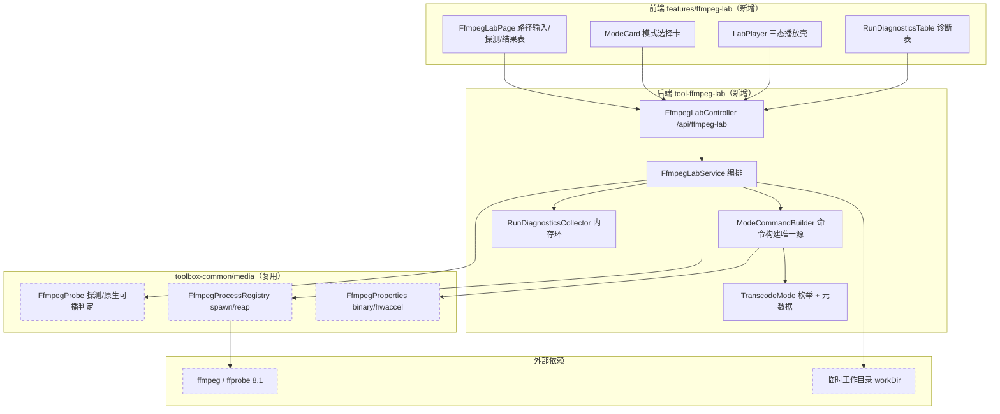
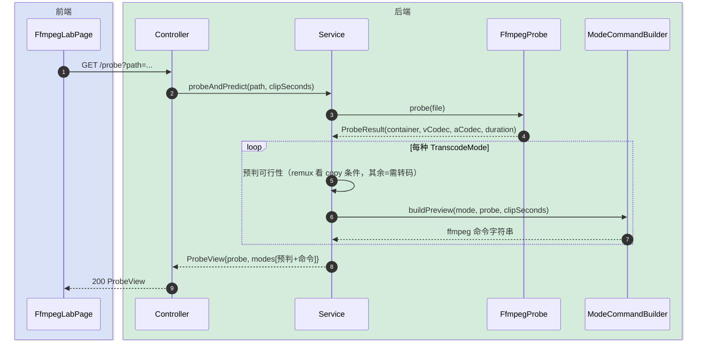
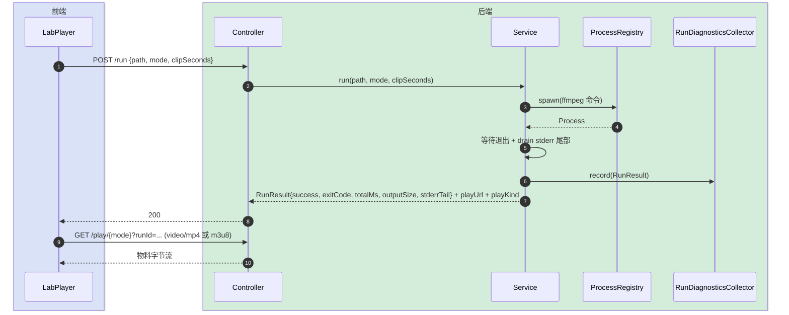
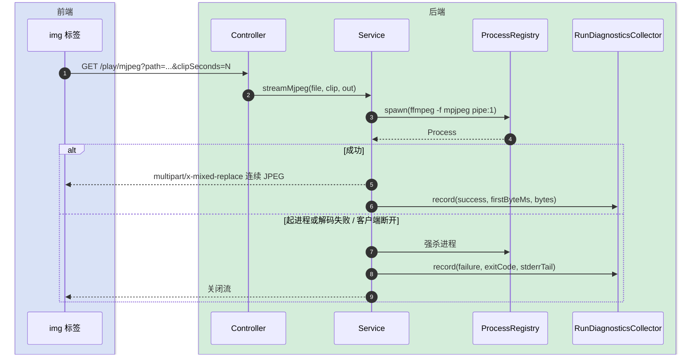

# FFmpeg 转码实验台 技术方案（technical / 架构主导）

> 最后更新日期：2026-05-31
> 模版：完整-技术 ｜ 配套：[FFmpeg转码实验台-api-current.md](FFmpeg转码实验台-api-current.md)

---

## 变更记录

| 版本 | 日期 | 修改人 | 变更内容摘要 |
|------|------|--------|--------------|
| v1 | 2026-05-31 | ping.yang | 初始版本：新建独立工具模块，开放 5 种转码/封装输出模式 |

---

## 1. 目标与边界

- **要解决的问题**：给一个本地视频路径，逐个试验「业内常用的转码/封装到 web」的几种模式，凭实跑结果判断哪种能把该格式（含 KDDI au `.amc` 这类 mpeg4/qcelp 老格式）正常输出到浏览器播放，并看到每种模式的 ffmpeg 命令、是否成功、首帧/总耗时、产物大小、stderr。
- **本次目标**：
  - 新建独立工具模块 `tool-ffmpeg-lab`（后端）+ `frontend/src/features/ffmpeg-lab`（前端），独立菜单入口「FFmpeg 转码实验台」。
  - 开放 5 种输出模式：**Remux 直封装 · Progressive MP4 全转码 · HLS(MPEG-TS) · HLS(fMP4/CMAF) · MJPEG 帧流**。
  - 探测一次给出每种模式的「预判可行性 + 将要执行的 ffmpeg 命令」；点击某模式实跑后给出统一的运行诊断（成功/退出码/首帧或总耗时/产物大小/stderr 尾部）并在页面内播放。
  - 支持只转前 N 秒（`clipSeconds`，默认 30s，0=整片）做快速可行性试验。
- **不做什么**：
  - 不做生产级按需流式优化（prewarm / hwaccel A-B / 分段统计）——那是 video-library + [HlsService](../../../../../IdeaProjects/kai-toolbox/tools/tool-treesize/src/main/java/com/exceptioncoder/toolbox/treesize/service/HlsService.java) 的职责，本模块只做「能不能出、怎么出」的实验台。
  - 不接 DASH / WebM(VP9)（用户本期排除：DASH 本地单文件收益低、VP9 编码过慢）。
  - 不落库、不做任务调度（瞬态调试工具，结果走内存环形缓冲）。
- **设计结论（一句话）**：复用 `toolbox-common` 的 ffmpeg 探测与进程管理，新建一个无状态的「模式 → ffmpeg 命令 → 运行诊断 + 浏览器播放」实验台，命令构建集中在单一 `ModeCommandBuilder`，前端按每种模式的「投递类型」选择 `<video>` / hls.js / `` 三种播放壳。

---

## 2. 整体架构

> 新增模块实线，已有/复用模块虚线，外部依赖单独成组。



---

## 3. 模块拆分与职责

### 3.1 FfmpegLabController（后端 REST 入口）

- **定位**：`/api/ffmpeg-lab` 下的薄控制器，只做参数校验与响应封装。
- **职责**：
  - 暴露 `GET /probe`（探测+预判+命令预览）、`POST /run`（实跑一个模式）、`GET /play/...`（各模式播放/流式端点）、`GET /runs/recent`（诊断轮询）。
  - 文件不存在/非法路径 → 400/404；ffmpeg 不可用 → 503（沿用全局异常处理）。
- **上游**：前端 FfmpegLabPage / LabPlayer。
- **下游**：FfmpegLabService。
- **关键设计点**：播放端点用 `StreamingResponseBody` 直出，content-type 按模式区分（`video/mp4` / `application/vnd.apple.mpegurl` / `multipart/x-mixed-replace`）。

### 3.2 FfmpegLabService（编排核心）

- **定位**：把「探测 → 预判 → 运行 → 诊断」串起来的唯一编排点。
- **职责**：
  - 探测文件并对每种模式给出 `ModePrediction`（可行/失败/需转码 + 理由）。
  - 运行某模式：临时文件类模式（remux/progressive/hls-ts/hls-fmp4）阻塞跑完 ffmpeg 产出物料到 workDir 再返回诊断；流式模式（mjpeg）直接挂流，结束后回填诊断。
  - 把每次运行结果写入 RunDiagnosticsCollector。
- **上游**：FfmpegLabController。
- **下游**：ModeCommandBuilder、FfmpegProbe、FfmpegProcessRegistry、RunDiagnosticsCollector。
- **关键设计点**：进程卫生复用 `FfmpegProcessRegistry.spawn`，stderr 单独 drain 线程并保留尾部 N 行；workDir 每个 runId 一个子目录，运行前清理过期目录。

### 3.3 ModeCommandBuilder（命令构建唯一源）

- **定位**：给定 `(TranscodeMode, ProbeResult, clipSeconds, workDir)` 产出 ffmpeg 参数列表的唯一来源。
- **职责**：
  - 为 5 种模式各构建命令（见 §5 命令表）。
  - 同一份命令既用于实跑、也用于 `/probe` 的命令预览，保证「看到的命令 = 跑的命令」。
- **上游**：FfmpegLabService。
- **下游**：FfmpegProperties（binary/hwaccel）。
- **关键设计点**：copy 与否的判定复用 `FfmpegProbe.canCopyVideo/canCopyAudio`；`clipSeconds>0` 时统一加 `-t`。

### 3.4 RunDiagnosticsCollector（内存环形缓冲）

- **定位**：仿 `PlaybackStatsCollector`，存最近 ~50 条运行诊断。
- **职责**：record / snapshot。
- **关键设计点**：纯内存、线程安全、无持久化；进程级 ffmpeg/ffprobe 活跃计数透传 `FfmpegProcessRegistry.activeCount()`。

### 3.5 前端 ffmpeg-lab（FfmpegLabPage + LabPlayer）

- **定位**：单页工具：路径输入 → 探测卡 → 模式卡选择 → 播放 + 诊断表。
- **职责**：
  - 提交路径触发 `/probe`，渲染每模式预判 + 命令。
  - 选模式 → `POST /run` → 按返回的 `playKind` 用对应播放壳播放。
  - 轮询 `/runs/recent` 刷新诊断表。
- **关键设计点**：LabPlayer 三态——`native`(`<video src>`) / `hls`(hls.js 加载 m3u8) / `mjpeg`(``)，hls.js 已是项目既有依赖。

---

## 4. 关键交互

### 4.1 探测并给出每模式预判 + 命令预览

> 触发：用户输入本地路径点「探测」。参与方：前端、Controller、Service、FfmpegProbe、ModeCommandBuilder。



### 4.2 运行临时文件类模式（remux / progressive / hls-ts / hls-fmp4）

> 触发：用户点某张模式卡。短片阻塞跑完即返回诊断 + 播放地址。



### 4.3 运行流式模式 MJPEG + 失败处理

> 触发：选 MJPEG 卡。直接挂多段流；ffmpeg 起进程失败/解码失败时回填失败诊断。



---

## 5. 核心业务规则

| 规则 | 说明 |
|------|------|
| 命令唯一源 | `/probe` 预览的命令必须与 `/run` 实跑命令逐字一致，均由 ModeCommandBuilder 产出 |
| Remux 预判 | 仅当 `canCopyVideo`(h264) ∧ `canCopyAudio`(aac/mp3/none) 才预判可行，否则预判失败（对 .amc 必失败，正是演示点）|
| clip 截断 | `clipSeconds>0` 时所有模式统一加 `-t clipSeconds`；0 表示整片 |
| 进程卫生 | 一律走 FfmpegProcessRegistry.spawn；stderr 必须独立线程 drain；客户端断开/失败强杀进程 |
| workDir 生命周期 | 每个 runId 一个子目录，运行前清理超过保留期的旧目录；模块为瞬态，不进 SQLite |
| ffmpeg 进程 cwd | 临时文件类运行时 ProcessBuilder 工作目录设为 runDir：HLS fMP4 的 init 段（`hls_fmp4_init_filename` 默认裸名 `init.mp4`）相对 CWD 写出，不设会落到 app 启动目录导致 init 段 404 / hls.js fragLoadError |
| 诊断字段 | 每次运行记录：mode/命令/exitCode/success/firstByteMs 或 totalMs/输出字节/stderr 尾部 N 行/时间戳 |
| ffmpeg 不可用 | 探测到 ffmpeg 不可用时所有运行端点返回 503，前端提示配置 `toolbox.ffmpeg.binary` |
| success≠exit0 | NATIVE 类（remux/progressive）即使 ffmpeg exit 0，也要再探产物：编码非浏览器原生可播则 `success=false`（封装成功 ≠ 能播，如 .amc copy 出的 mpeg4/qcelp mp4）。HLS 重编码到 h264/aac 故 exit0+playlist 即成功；MJPEG 看字节数 |

### 各模式 ffmpeg 命令表

| 模式 | 投递类型 | 命令骨架（省略 -i 输入 与 -t clip）| 产物 |
|------|----------|------|------|
| `REMUX_COPY` | native | `-c copy -movflags +faststart -f mp4 out.mp4` | 临时 mp4 |
| `PROGRESSIVE_MP4` | native | `-c:v libx264 -preset veryfast -crf 23 -c:a aac -b:a 128k -movflags +faststart -f mp4 out.mp4` | 临时 mp4 |
| `HLS_TS` | hls.js | `-c:v (copy|libx264 ...) -c:a (copy|aac) -f hls -hls_time 10 -hls_segment_type mpegts -hls_playlist_type vod` | 临时目录 m3u8+ts |
| `HLS_FMP4` | hls.js | `... -f hls -hls_time 10 -hls_segment_type fmp4 -hls_playlist_type vod` | 临时目录 m3u8+init+m4s |
| `MJPEG` | img | `-an -f mpjpeg -q:v 5 pipe:1` | multipart 流（无音频）|

> **编码端一律软编 `libx264`，不继承生产侧 `toolbox.ffmpeg.hwaccel`**：调试求稳，避开硬件编码器边缘限制（实测 h264_nvenc 对 96x80 这类超小帧直接 `InitializeEncoder failed: Frame Dimension less than minimum`）。生产 GPU 路径仍由 [HlsService](../../../../../IdeaProjects/kai-toolbox/tools/tool-treesize/src/main/java/com/exceptioncoder/toolbox/treesize/service/HlsService.java) 负责。
>
> **重编码统一加视频滤镜** `scale=w=max(iw,256):h=max(ih,144):force_original_aspect_ratio=increase:force_divisible_by=2`：把过小帧放大到至少 256x144、保宽高比、强制偶数尺寸（正常尺寸视频不缩小）；音频转码统一 `-ar 44100` 避开低采样率下 aac 的 `Too many bits` 限制。

---

## 6. 编码落点

```text
tools/tool-ffmpeg-lab/                                          [新增] 新 Maven 模块
├── pom.xml                                                     [新增] 依赖 toolbox-common
└── src/main/java/com/exceptioncoder/toolbox/ffmpeglab/
    ├── api/
    │   ├── FfmpegLabController.java                            [新增] /api/ffmpeg-lab 端点
    │   └── dto/
    │       ├── ProbeView.java                                  [新增] 探测+每模式预判+命令
    │       ├── ModeView.java                                   [新增] 模式元数据+预判+命令
    │       ├── RunRequest.java                                 [新增] {path, mode, clipSeconds}
    │       └── RunResultView.java                              [新增] 诊断+playUrl+playKind
    ├── domain/
    │   ├── TranscodeMode.java                                  [新增] 5 模式枚举+投递类型
    │   └── RunResult.java                                      [新增] 单次运行诊断记录
    ├── service/
    │   ├── FfmpegLabService.java                               [新增] 探测/预判/运行编排
    │   ├── ModeCommandBuilder.java                             [新增] 命令构建唯一源
    │   └── RunDiagnosticsCollector.java                        [新增] 内存环形诊断缓冲
    └── config/
        ├── FfmpegLabProperties.java                            [新增] toolbox.ffmpeg-lab.*
        └── FfmpegLabToolDescriptor.java                        [新增] ToolDescriptor 注册

toolbox-common/.../common/media/                               [不变] 直接复用
├── FfmpegProbe.java                                            [不变] 探测+canCopy*+nativelyPlayable
├── FfmpegProcessRegistry.java                                  [不变] spawn/reap/activeCount
└── FfmpegProperties.java                                       [不变] binary/ffprobe/hwaccel

frontend/src/features/ffmpeg-lab/                               [新增] 前端 feature
├── index.tsx                                                   [新增] FeatureManifest（菜单入口）
├── api.ts                                                      [新增] probe/run/playUrl/runsRecent
├── types.ts                                                    [新增] ProbeView/ModeView/RunResult 类型
├── pages/FfmpegLabPage.tsx                                     [新增] 主页面
└── components/
    ├── ModeCard.tsx                                            [新增] 模式选择卡（预判+命令）
    ├── LabPlayer.tsx                                           [新增] native/hls/mjpeg 三态播放壳
    └── RunDiagnosticsTable.tsx                                 [新增] 诊断表（轮询 runs/recent）

pom.xml                                                         [修改] <modules> 增加 tool-ffmpeg-lab
toolbox-starter/pom.xml                                         [修改] 增加 tool-ffmpeg-lab 依赖
```

### 调用关系说明

- `FfmpegLabController` → `FfmpegLabService` → `ModeCommandBuilder` / `FfmpegProbe` / `FfmpegProcessRegistry`：探测与运行的主链路。
- 前端 `LabPlayer` 按 `RunResultView.playKind` 分流到 `<video>` / hls.js / ``。

---

## 7. 数据与依赖变更

| 类型 | 是否变化 | 说明 |
|------|----------|------|
| 数据库表 / 字段 / 索引 | 无 | 瞬态工具，诊断走内存环，不落 SQLite |
| DTO / VO / 枚举 | 有 | 新增 TranscodeMode 枚举 + ProbeView/ModeView/RunRequest/RunResultView/RunResult |
| 下游接口 / 外部依赖 | 有 | 依赖 ffmpeg/ffprobe（已有配置）；新模块依赖 toolbox-common |
| 缓存 / 消息 / 锁 / 事务 | 无 | 仅内存环形缓冲 |
| 构建配置 | 有 | 父 pom `<modules>` + starter pom 依赖各加一条 |

---

## 8. 风险与待确认

| 风险 / 待确认点 | 影响 | 处理方式 |
|----------------|------|----------|
| HLS 命令与现有 HlsService 重复 | 两处维护编码参数 | 本期 lab 自带精简 HLS 命令；后续若复用频繁再抽到 toolbox-common，本期记 TODO |
| QCELP 等冷门音频 ffmpeg 解码失败 | progressive/hls 也会失败 | 失败如实写入诊断 stderrTail，正是实验台要暴露的信息 |
| 整片转码长视频阻塞 | `/run` 同步等待过久 | 默认 clipSeconds=30 只转前 30s；整片由用户显式选 0 |
| workDir 磁盘堆积 | 临时物料占盘 | 每 runId 子目录 + 运行前清理过期目录（保留期可配）|
| MJPEG 多段流兼容性 | 个别浏览器对 `` multipart 支持差异 | 作为「至少看到画面」兜底，失败回退诊断提示 |

---

## 9. 验证要点

- **正常路径**：对 `C:\Users\张凯\Desktop\tmp\360653.amc`（mpeg4/qcelp）探测 → Remux 预判❌、其余预判✅；逐个 run，期望 Remux 失败、progressive/hls-ts/hls-fmp4/mjpeg 成功播放。
- **异常路径**：路径不存在→404；ffmpeg 不可用→503；Remux 对不兼容编码→exitCode≠0 且 stderrTail 有原因。
- **边界条件**：clipSeconds=0 整片；时长极短文件（<10s 单分段）；纯视频无音频流。
- **回归范围**：仅新增模块，不改动 treesize/video-library 既有播放链路；确认菜单自动注册、ffmpeg 探测不可用时降级提示。
