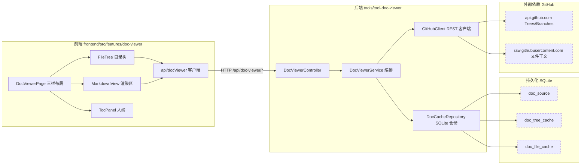
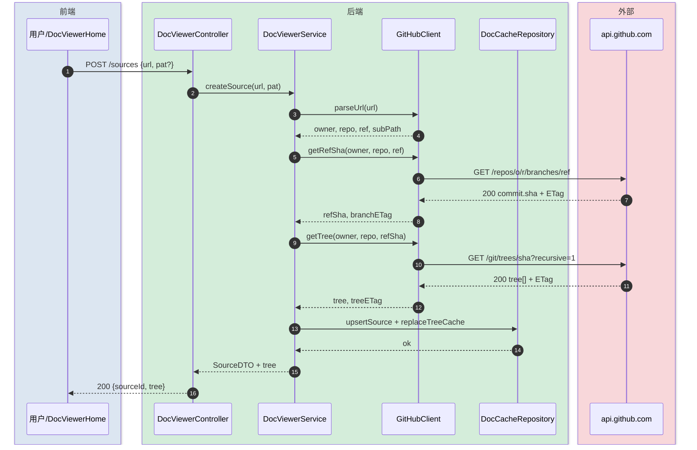
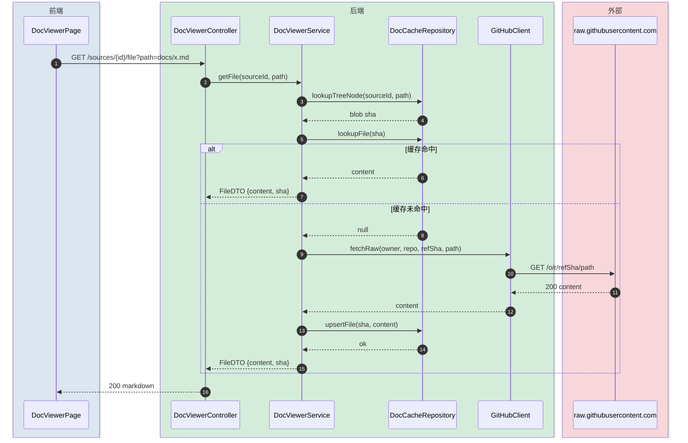
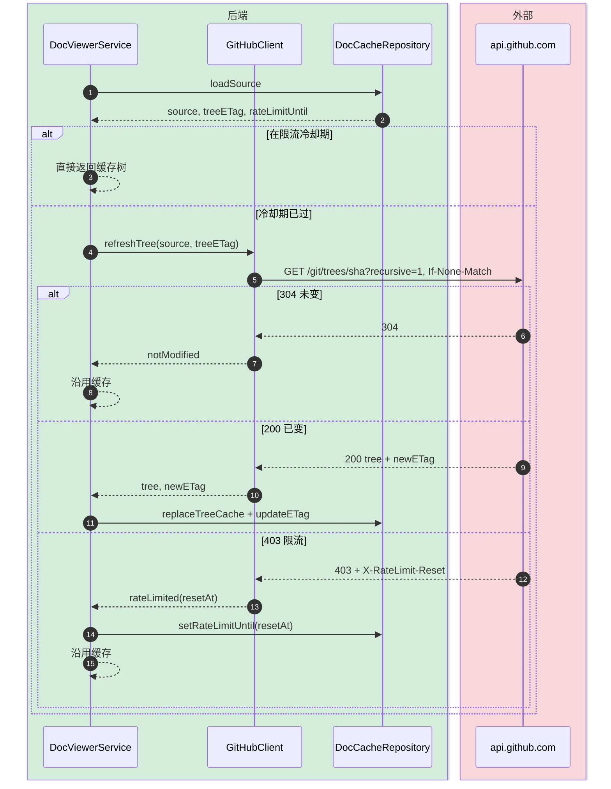

# GitHub 文档浏览器 — 技术方案

> 最后更新：2026-05-08
> 类型：完整-技术（template-tech.md）
> 配套：`GitHub文档浏览器-api-current.md` 字段级接口契约 / `GitHub文档浏览器-coding.md` 编码摘要（确稿后生成）

---

## 变更记录

| 版本 | 日期 | 修改人 | 变更内容摘要 |
|------|------|--------|--------------|
| v1 | 2026-05-08 | AI 草稿 | 初始版本：模块拆分、API 列表、缓存与渲染策略 |

---

## 1. 目标与边界

- **要解决的问题**：用户希望在 kai-toolbox 内浏览存放在 GitHub 仓库的 markdown 文档库（个人/团队 ai-docs 类的目录结构），像 GitHub web 一样以"目录树 + 渲染正文"的方式查看，省去频繁切浏览器、登录 GitHub、跨多个仓库找文档的折腾。
- **本次目标**：
  - 收藏多个 GitHub 文档源（owner / repo / branch / 子路径）
  - 公开仓库匿名访问 + 私有仓库可选 PAT
  - 一次拉整棵目录树，前端按需懒加载文件内容
  - SQLite 持久化缓存（树 + 文件正文），ETag 节流，避免触发 GitHub 限流
  - 三栏布局：左目录树 + 中渲染 + 右大纲 TOC
  - markdown 渲染支持 GFM、代码高亮、mermaid、相对图片/链接重写
- **不做什么**：
  - 不支持非 GitHub 仓库（GitLab / Gitee / 自建源后续按需扩展）
  - 不做双向编辑（只读浏览）
  - 不实现 webhook 增量同步，刷新走"手动 + 自动 ETag 探测"
  - v1 不做全文检索，仅文件名/路径模糊匹配
- **设计结论（一句话）**：以 `tool-doc-viewer` 模块承载，后端代理 GitHub Trees + raw 内容并写 SQLite 缓存，前端三栏布局 + react-markdown 渲染。

---

## 2. 整体架构

> 边界要点：
> - 前端 feature 模块 `doc-viewer`，路由 `/tools/doc-viewer/*`
> - 后端 Maven 模块 `tools/tool-doc-viewer`，代理 GitHub API + 写缓存
> - SQLite 三表：`doc_source`（文档源）、`doc_tree_cache`（树节点）、`doc_file_cache`（文件正文）
> - 外部依赖：`api.github.com`（Trees / Branches / Contents）+ `raw.githubusercontent.com`（文件正文）



---

## 3. 模块拆分与职责

### 3.1 DocViewerController

- **定位**：HTTP 入口，承担参数解析与响应封装
- **职责**：
  - 文档源 CRUD（增 / 列 / 删 / 刷新）
  - 树查询、文件正文查询
- **上游**：前端 doc-viewer feature
- **下游**：DocViewerService
- **关键设计点**：
  - Path 中传 `sourceId`，子路径以 query `path=` 传递（避免路径转义嵌套）
  - 错误统一交由 toolbox-common 的 `GlobalExceptionHandler`，业务错误 4xx + JSON message
  - 不返回 PAT 明文，只返回 `hasPat: boolean`

### 3.2 DocViewerService

- **定位**：核心编排层，封装"先查缓存、命中走 ETag、否则回源"
- **职责**：
  - 文档源 CRUD（含 PAT 持久化）
  - 拉树：先查 doc_tree_cache，命中后用 ETag 询问 GitHub，304 沿用缓存
  - 拉文件：sha 命中即返缓存；未命中走 raw URL 回源 + 写库
- **上游**：DocViewerController
- **下游**：GitHubClient、DocCacheRepository
- **关键设计点**：
  - 节点列表展开为单条记录（不缓存整棵 JSON 树为单 blob），便于后续按 sha 增量替换
  - 文件内容按 blob sha 缓存而非 path：同一 path 不同 sha 各占一条；垃圾回收交由 LRU（v1 不做）
  - 私有库 PAT 仅在 outbound 调用 GitHub 时附 `Authorization: token <pat>` 头；不出现在响应中
  - 同 sourceId 的并发刷新通过 `ConcurrentHashMap<String, Object>` 锁键，避免重复回源

### 3.3 GitHubClient

- **定位**：GitHub REST 适配层
- **职责**：
  - 解析任意 GitHub URL → `(owner, repo, ref, subPath)`
  - 调用 `GET /repos/{o}/{r}/branches/{ref}` 拿 commit sha
  - 调用 `GET /repos/{o}/{r}/git/trees/{sha}?recursive=1` 拿整树
  - 调用 raw URL 拿文件正文（避免 Contents API 的 base64 中转，省一次解码 + 节省限流配额）
  - 处理 ETag、`X-RateLimit-Remaining`、403 限流
- **上游**：DocViewerService
- **下游**：`api.github.com`、`raw.githubusercontent.com`
- **关键设计点**：
  - 用 Java 21 内建 `HttpClient`，无需引入第三方 HTTP 库
  - 限流剩余 ≤ 5 时回写 `rate_limit_until`，主动拒绝下一次回源（避免硬触发 403）
  - 非 200 一律抛带错误码的领域异常（`DocViewerException`），由 Controller 转 4xx

### 3.4 DocCacheRepository

- **定位**：SQLite 缓存仓储
- **职责**：
  - `doc_source` CRUD（含 ETag、rate_limit_until 字段更新）
  - `doc_tree_cache` 按 (source_id) 整批替换
  - `doc_file_cache` 按 sha 唯一 upsert
- **上游**：DocViewerService
- **下游**：SQLite via Spring JDBC（复用 toolbox-common `SqliteConfig`）
- **关键设计点**：
  - 复用 toolbox-common 的 `SchemaInitializer`，DDL 文件 `db/doc-viewer-schema.sql`，全部 `IF NOT EXISTS`
  - 文件正文直接 TEXT 存（markdown 通常 KB 级；二进制不入缓存）
  - 树节点扁平结构 `(source_id, path, name, kind, sha, parent_path, depth)`，按 parent_path 做索引

### 3.5 前端 doc-viewer feature

- **定位**：前端工具页面（FeatureManifest 注册到侧边栏 "学习/参考" 分组）
- **职责**：
  - **首页**：书架式卡片展示已收藏文档源（添加 / 删除 / 刷新 / 进入）
  - **浏览页**：左树折叠 + 中正文渲染 + 右 TOC + URL 状态可分享
  - **目录优先索引**：点目录时按 `INDEX.md → README.md → 00_index.md` 顺序优先呈现该目录索引文件
  - **markdown 渲染**：react-markdown + remark-gfm + rehype-highlight + mermaid，相对图片/链接按 ref 重写到 raw URL
- **上游**：用户交互
- **下游**：DocViewerController via TanStack Query
- **关键设计点**：
  - URL 形态 `/tools/doc-viewer/:sourceId/*path`，刷新可恢复定位
  - 树视图 v1 自实现（节点量百级，无需虚拟化库）
  - mermaid 用 `mermaid` npm 懒加载（首次见到 mermaid 代码块时再 dynamic import，控制首屏体积）
  - 大目录用 `useMemo` 把扁平 `tree[]` 转 nested 一次

---

## 4. 关键交互

### 4.1 添加文档源 + 首次拉取整树

> 触发：用户在 doc-viewer 首页点"添加"，粘贴 GitHub URL（含可选 PAT）
> 参与方：前端 / 后端 / GitHub API / SQLite



### 4.2 浏览文件（缓存命中 vs 回源）

> 触发：用户在树上点击文件；或刷新已打开页面
> 参与方：前端 / 后端 / GitHub raw / SQLite



### 4.3 手动刷新树（ETag 304 / 限流降级）

> 触发：用户点"刷新"按钮，或打开已收藏文档源时距上次刷新 > 1 小时自动触发一次
> 参与方：后端 / GitHub API / SQLite
> 限流策略：剩余配额 ≤ 5 时直接走缓存，不再发起请求



---

## 5. 核心业务规则

| 规则 | 说明 |
|------|------|
| 文档源唯一性 | (owner, repo, ref, subPath) 联合唯一；重复添加返回已有 sourceId |
| PAT 存储与可见性 | 与 source 同行存储；返回前端时只回 `hasPat: true`，永不回写明文 |
| 目录优先索引文件 | 点目录时前端按 INDEX.md → README.md → 00_index.md 顺序，命中其一即作为该目录默认渲染内容 |
| 相对链接重写 | markdown 中相对图片 `` 重写为对应 ref 的 raw URL；相对 md 链接 `[](./x.md)` 重写为应用内路由 `/tools/doc-viewer/:sourceId/...` |
| 大文件渲染策略 | 后端不设大小硬阈值，永远返回完整内容；前端按 size 渐进处理：< 500KB 直接渲染；500KB ~ 2MB 显示骨架屏 + "文件较大渲染中" 文字；> 2MB 默认切到"原始文本视图"（纯文本不走 markdown 管线），UI 上给"仍以 markdown 渲染"按钮让用户主动选择 |
| 原始文本兜底视图 | 任意文件 UI 都提供 "切到原始文本" 切换按钮；纯 `<pre>` 展示，永不卡顿，作为渲染失败 / 大文件 / 用户偏好的兜底 |
| 二进制文件 | 树中保留但点击时 Service 返回 `kind=binary`，前端只展示文件名/大小不下载 |
| 自动刷新触发 | 打开收藏源时若距上次成功刷新 > 1 小时则自动调一次 refresh，独立失败不阻塞读 |
| 私库 URL 必须有 PAT | 添加私库源若未提供 PAT 第一次回源就 404 / 403，前端 toast 提示补 PAT |

---

## 6. 编码落点

```text
tools/tool-doc-viewer/                                              [新增]
├── pom.xml                                                          [新增] Maven 模块声明
└── src/main/
    ├── java/com/exceptioncoder/toolbox/docviewer/
    │   ├── api/
    │   │   ├── DocViewerController.java                             [新增] HTTP 入口
    │   │   └── dto/
    │   │       ├── SourceDTO.java                                   [新增] 文档源出参（不含 PAT 明文）
    │   │       ├── CreateSourceRequest.java                         [新增] 创建文档源入参
    │   │       ├── TreeNodeDTO.java                                 [新增] 树节点
    │   │       └── FileDTO.java                                     [新增] 文件出参
    │   ├── service/
    │   │   └── DocViewerService.java                                [新增] 编排：缓存优先、ETag 校验、限流降级
    │   ├── infra/
    │   │   ├── GitHubClient.java                                    [新增] REST + raw 客户端
    │   │   └── GitHubUrlParser.java                                 [新增] URL → owner/repo/ref/subPath
    │   ├── repository/
    │   │   ├── DocCacheRepository.java                              [新增] SQLite 仓储
    │   │   └── entity/
    │   │       ├── DocSource.java                                   [新增]
    │   │       ├── DocTreeNode.java                                 [新增]
    │   │       └── DocFileCache.java                                [新增]
    │   ├── exception/
    │   │   └── DocViewerException.java                              [新增] 领域异常 + 错误码
    │   └── config/
    │       └── DocViewerToolDescriptor.java                         [新增] @Component 注册到 ToolRegistry
    └── resources/db/
        └── doc-viewer-schema.sql                                    [新增] 三张表 + 索引 DDL

frontend/src/features/doc-viewer/                                   [新增]
├── index.tsx                                                        [新增] FeatureManifest（icon: BookOpen）
├── pages/
│   ├── DocViewerHome.tsx                                            [新增] 文档源书架卡片
│   └── DocViewerPage.tsx                                            [新增] 三栏布局壳
├── components/
│   ├── FileTree.tsx                                                 [新增] 目录树（折叠 / 高亮当前 / 索引文件优先）
│   ├── MarkdownView.tsx                                             [新增] react-markdown 集成（GFM + 高亮 + mermaid）
│   ├── TocPanel.tsx                                                 [新增] 从渲染结果提取 H2/H3 大纲
│   └── AddSourceDialog.tsx                                          [新增] 添加文档源对话框
├── api/
│   └── docViewer.ts                                                 [新增] TanStack Query hooks
├── lib/
│   ├── parseGitHubUrl.ts                                            [新增] 前端 URL 解析（提示用，最终以后端为准）
│   ├── rewriteRelativeLinks.ts                                      [新增] 相对路径重写（rehype 插件）
│   └── mermaidRenderer.tsx                                          [新增] mermaid 懒加载渲染组件
└── types.ts                                                         [新增]

toolbox-starter/pom.xml                                             [修改] <dependency> 加 tool-doc-viewer
pom.xml                                                              [修改] <modules> 加 tools/tool-doc-viewer
frontend/package.json                                                [修改] 新增 react-markdown / remark-gfm / rehype-highlight / mermaid
```

### 调用关系说明

不画图。前端：FileTree / MarkdownView 通过 `docViewer.ts` 调 Controller；后端：Controller → Service → (GitHubClient | DocCacheRepository)，单向无环；与其他工具完全独立，不跨 schema 查询。

---

## 7. 数据与依赖变更

| 类型 | 是否变化 | 说明 |
|------|----------|------|
| 数据库表 / 字段 / 索引 | 有 | 新增 `doc_source`、`doc_tree_cache`、`doc_file_cache` 三表 + 索引（详见 doc-viewer-schema.sql） |
| DTO / VO / 枚举 | 有 | 模块内全新 DTO；`DocSourceKind` 仅 `BLOB` / `TREE` / `BINARY` 三值 |
| 下游接口 / 外部依赖 | 有 | 新增对 `api.github.com` + `raw.githubusercontent.com` 公网调用，使用 JDK 内建 `HttpClient`，无新增 Java 依赖 |
| 缓存 / 消息 / 锁 / 事务 | 有 | SQLite 行级写入；同 sourceId 并发刷新用 Service 内 `ConcurrentHashMap` 锁键串行化 |

前端新增 npm 依赖：`react-markdown`、`remark-gfm`、`rehype-highlight`、`mermaid`、`highlight.js`（rehype-highlight 的样式）

---

## 8. 风险与待确认

| 风险 / 待确认点 | 影响 | 处理方式 |
|----------------|------|----------|
| GitHub 匿名 60 次/小时上限 | 频繁刷新触发 403 | 限流剩余 ≤ 5 时降级走缓存 + UI 提示填 PAT |
| PAT 明文存 SQLite | 本机 db 文件被读即泄露 | v1 明文存（本地单用户工具风险可控）；README 提示风险；后续可接 Java KeyStore |
| 大仓 Trees `recursive=1` 上限 100k 节点 | 超大仓库整树 API 截断 | v1 仅支持 ≤ 100k 节点；超出在添加时拒绝并提示用户填 subPath 缩小范围 |
| markdown 中混入 HTML / `<script>` | XSS 风险 | react-markdown 默认禁 raw HTML；显式不开启 `rehype-raw` |
| mermaid 包体积 ~250KB gzip | 首屏体积 | 懒加载（首个 mermaid 代码块出现时再 dynamic import） |
| 私库 PAT 误填到公库 URL | 无功能影响（GitHub 忽略） | 不特别处理 |
| 超大 markdown（数 MB）渲染卡顿 | react-markdown 单次渲染百万字符量级会冻结主线程数秒 | 前端按 size 渐进策略 + 原始文本兜底视图；后端不拒绝、不截断 |
| 单文件正文写入 SQLite | SQLite 单 cell 默认上限约 1GB，性能在 MB 级仍可接受 | 直接写；db 文件膨胀风险由后续 LRU 任务处理 |

---

## 9. 验证要点

- **正常路径**：
  - 添加 `https://github.com/{user}/ai-docs/tree/main/kai-toolbox` → 树正确展示子目录 → 点击 `INDEX.md` 渲染正常 → 点击目录 `design/` 自动渲染 `design/INDEX.md`
  - 切换分支后 ref 变化能识别（保存为新 source 而非更新 ref，避免缓存失效）
- **异常路径**：
  - 非 github 域 URL → 4xx `INVALID_GITHUB_URL`
  - 404 仓库 / 私库无权限 → 4xx `REPO_NOT_FOUND` 或 `REPO_FORBIDDEN`，提示填 PAT
  - GitHub 限流 403 → Controller 返 200 缓存数据 + 响应体带 `rateLimited: true` 标记
  - 网络断开点击未缓存文件 → 4xx `UPSTREAM_UNAVAILABLE`，前端 toast
- **边界条件**：
  - 仓库无任何 `.md` 文件 → 树正常展示，点击非 md 文件提示"非 markdown 不渲染"
  - subPath 指向单文件 URL（`/blob/main/x.md`）→ 解析为该文件父目录 + 默认聚焦该文件
  - 中等大小文件（500KB ~ 2MB）→ 显示骨架屏，正常 markdown 渲染
  - 超大文件（> 2MB）→ 默认切原始文本视图，提供"仍以 markdown 渲染"按钮
  - 任意文件 → "切换原始文本"按钮永远可用
  - 二进制文件（png / pdf）→ `kind=binary`，前端只显示文件名/大小
- **回归范围**：
  - 与现有 tool-treesize 完全独立，验证 SchemaInitializer 不会因新增 `doc-viewer-schema.sql` 影响其他工具启动
  - 前端 sidebar 新增条目，验证未影响其他 feature 的路由顺序
