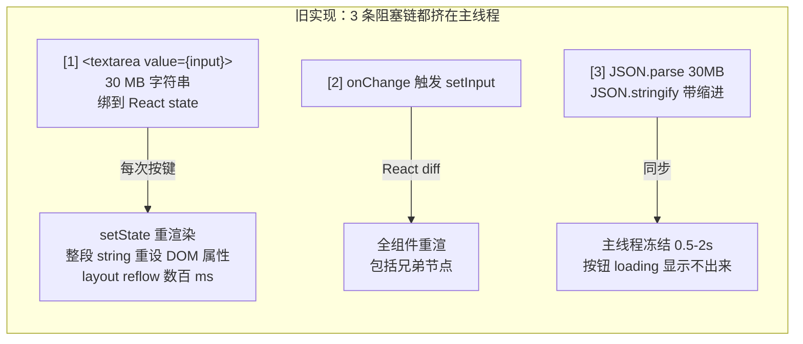
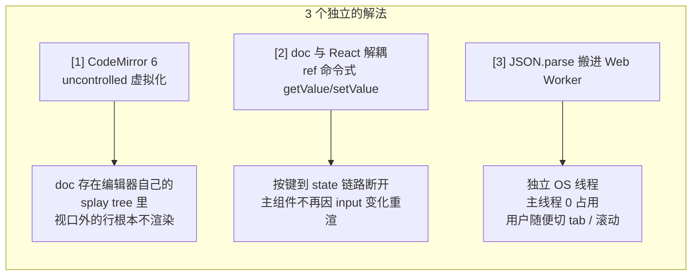
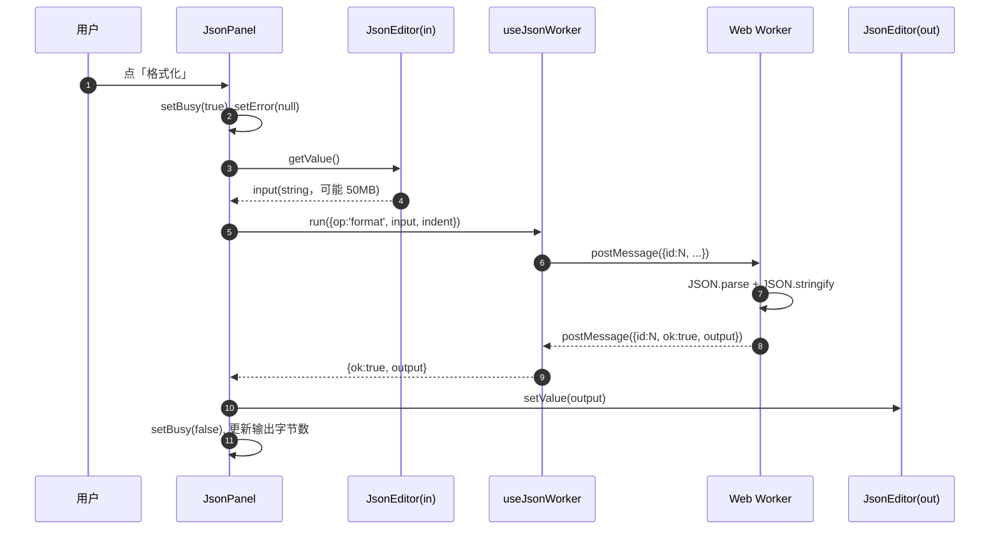
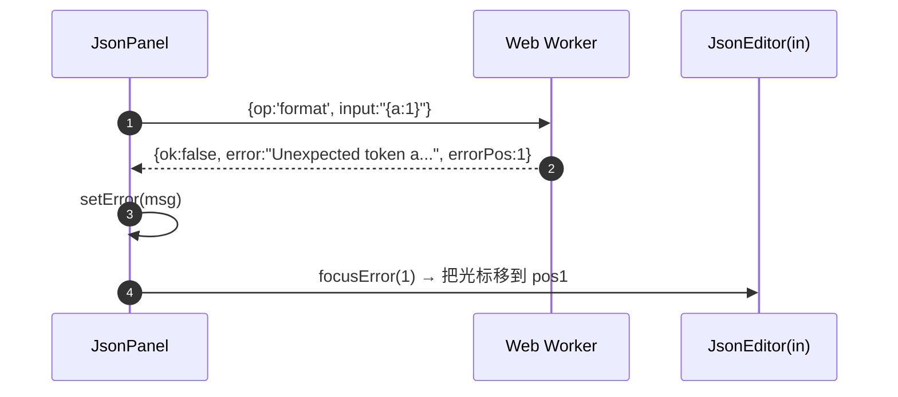
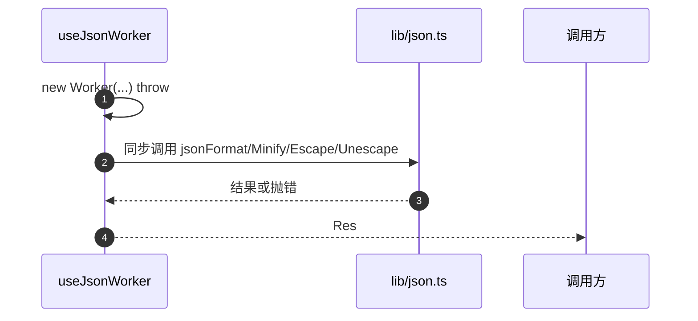
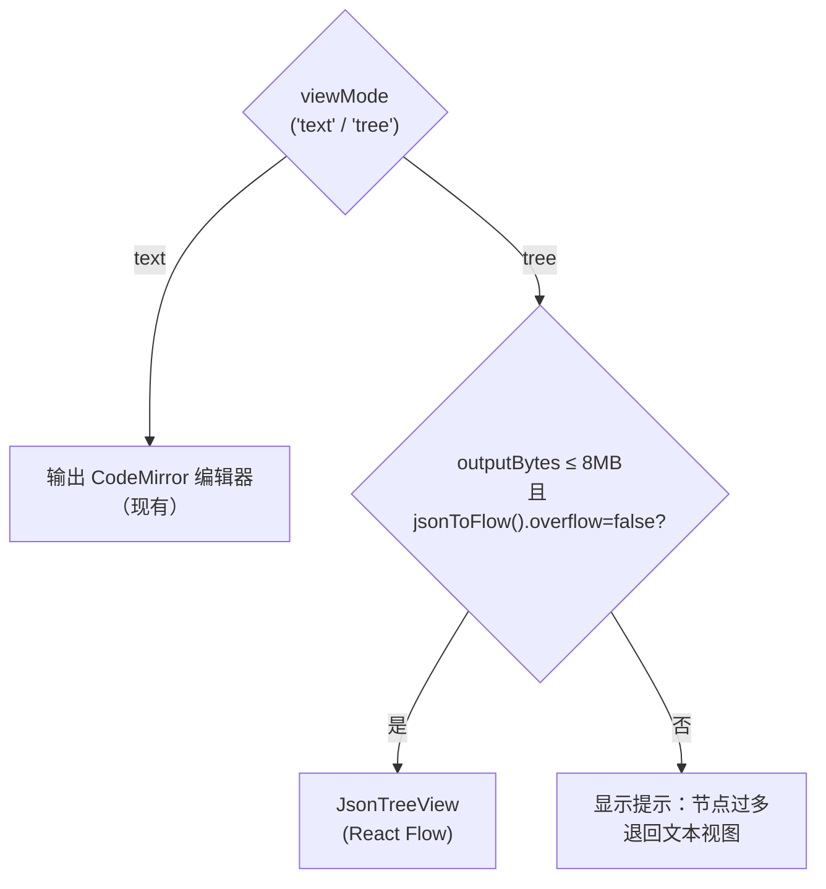
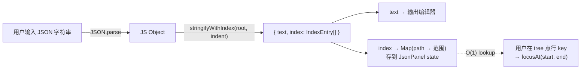
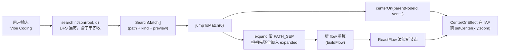
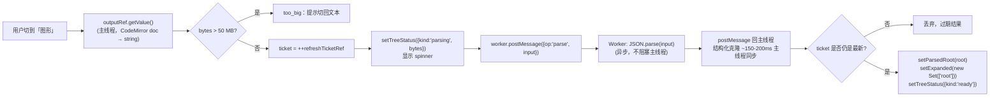

# JSON 格式化大文件优化（技术方案）

> 最后更新：2026-05-17
> 模版：完整-技术（template-tech.md）
> 涉及代码：`frontend/src/features/formatter/`

## 0. 为什么会快？核心原理与 json4u 对比

### 0.1 旧实现卡在哪（3 个真实瓶颈）



3 件事都跑在同一根 UI 线程上，用户体验是「点格式化按钮，整个浏览器 tab 卡住」。

### 0.2 新实现的三个根因解法



### 0.3 三个解法叠加在一起的预期收益

| 输入规模 | 旧实现（textarea + 同步） | 新实现（CodeMirror + Worker） | 收益来源 |
|---------|-------------------------|------------------------------|---------|
| 100 KB | 流畅 | 流畅 | — |
| 1 MB | 输入区已开始顿挫 | 流畅 | ①② |
| 10 MB | 几乎不可用，按键延迟 1s+ | 输入流畅，操作 ~300ms | ①②③ |
| 30 MB | 浏览器 tab 直接挂 5s+ | 输入流畅，操作 ~1s，主线程不冻结 | ①②③ |

**关键洞察**：① 和 ② 是大输入体验的关键（让用户能粘进去、能滚动），③ 是大操作体验的关键（点按钮不卡）。三个一起改才有大文件可用性，**单独做 Worker 但不换编辑器不会快**——因为光是把字符串塞进 textarea 就已经卡了。

### 0.4 与 json4u.com 的技术对比

> 比对截至 2026-05-17。json4u 实际依赖见 [github.com/loggerhead/json4u/package.json](https://github.com/loggerhead/json4u/blob/main/package.json)。

| 维度 | json4u 当前实现 | 本方案 | 评价 |
|------|---------------|-------|------|
| 编辑器 | Monaco Editor (`@monaco-editor/react`) | CodeMirror 6 (`@uiw/react-codemirror`) | 都是虚拟化编辑器；Monaco 体积更大、特性更全，CodeMirror 更轻、已是仓库依赖 |
| 解析器 | `jsonc-parser`（VSCode 同款，支持注释 / 末尾逗号） | 原生 `JSON.parse` | jsonc-parser 容错好但慢一截；我们格式化工具不需要兼容 JSONC |
| Worker 线程 | 有，用 `comlink` 做 RPC | 有，手写 id 关联 postMessage | 等价；comlink 抽象更优雅，但 4 个 op 手写不复杂 |
| WASM 加速 | **未做**（roadmap 写「计划 Rust + WASM」） | 未做 | 同梯队；几十 MB 量级原生 `JSON.parse` < 1s 够用 |
| 大文件官方支持 | **README 公开声明：≥1 MB 还不支持**（roadmap 项） | 设计目标 ≤ 50 MB | 我们针对纯格式化更激进 |
| 树视图虚拟化 | `@tanstack/react-virtual` + `@xyflow/react`（React Flow 节点图） | 不做（出范围） | json4u 强在可视化；本方案只做格式化文本 |
| JSONPath / Diff / 跨语言 | 有（`jsonpath-plus` / 自研 diff / next-intl） | 不做 | 不同产品定位 |

**结论**：在「**单纯把几十 MB JSON 格式化/压缩，主线程不卡**」这个窄场景下，本方案与 json4u **当前已落地的能力同梯队**——都是「虚拟化编辑器 + JS Worker 跑 native 解析」。我们没做 json4u roadmap 里的 Rust+WASM 加速，但那对 50 MB 量级 ROI 也低。我们没有 json4u 的树视图、Diff、JSONPath 这些可视化交互，是因为本工具只承担格式化职责。

### 0.5 我们刻意没做的事

| 没做的事 | 为什么 |
|----------|--------|
| Rust + WASM 解析 | 50 MB 量级原生 `JSON.parse` 在 Worker 里 < 1s，加 WASM 收益不抵复杂度 |
| 流式 / 增量解析（SAX-style） | 实现复杂；几十 MB 量级一次性 parse 内存峰值约 3–4× 源大小，仍在浏览器可承受范围内 |
| 树视图 | 不是格式化工具的核心需求；要做应该是独立 feature |
| jsonc-parser（容错解析） | 用户场景就是「拿一份合法 JSON 美化」，不需要兼容注释 / 末尾逗号；保持原生最快路径 |

## 1. 目标与边界

### 做什么

- 把 `features/formatter` 的 JSON 子面板从 `<textarea>` + 同步 `JSON.parse/stringify` 升级为 **CodeMirror 6 编辑器 + Web Worker 异步解析**，支持单文件几十 MB 的 JSON 不卡 UI
- 输入框、输出框统一用 CodeMirror，启用虚拟化滚动，避免巨型文本绑到 React state 引发整页重渲染
- 大 JSON 操作期间显示忙碌指示（按钮 loading + 主输出区有进度状态），主线程不冻结
- 提供「下载结果到文件」兜底入口，覆盖 > 几十 MB 时复制到剪贴板可能失败的场景
- 已有 `escape/unescape` 子操作复用同一架构（也走 Worker，统一接口）

### 不做什么

- 不做 JSON Diff、不做 JSONPath 查询、不做 hover 跨视图关联（json4u 有，本期不抄）
- 不做流式增量解析（streaming parser）；本期仍是「读到内存里整体 parse」，因为目标量级（几十 MB）原生 `JSON.parse` 在 Worker 里仍是可接受的（< 1s）
- 不动 Nginx 子面板
- 树状视图采用「按需展开 + 节点数硬上限 1000」策略，**不**对大 JSON 自动全展开（会卡 React Flow）；超限时退回文本视图并提示

### 设计结论

| 决策 | 选择 | 原因 |
|------|------|------|
| 编辑器内核 | **CodeMirror 6**（`@uiw/react-codemirror`） | 已是仓库依赖，已在 `browser-request` 落地验证；视图层是虚拟化的，大文本不会一次性渲染所有行 |
| 重计算线程 | **专用 Web Worker**，懒加载单例 | `JSON.parse(50MB)` 同步在主线程 ≈ 数百 ms，会卡按钮反馈；Worker 隔离即可解决，不需要更激进的 chunk 化方案（避开 streaming 复杂度） |
| 编辑器值的 React 绑定 | **uncontrolled 模式**：CodeMirror 内部保存 doc，组件用 ref 暴露 `getValue()`；不再每次按键 `setInput` | 这是大文本性能的关键。原实现每次按键都把整段巨型字符串塞回 React state，引发 textarea 整体重渲染 |
| 输出展示 | 另一个 CodeMirror 实例（read-only） | 同样避免 textarea 设巨值；也能享受高亮 |
| 序列化 indent | 在 Worker 内完成 | 大对象 `JSON.stringify(obj, null, 2)` 同样耗时，必须搬走 |
| Worker 通信 | id 关联的 request/response，单一 `MessageChannel` 风格 | 一次只跑一个任务，新任务到来就把旧 id 标记 stale 丢弃结果，避免回填错位 |
| 大输出复制 | 一定阈值（默认 8 MB）以下用 `navigator.clipboard.writeText`；以上隐藏复制、强出「下载为 .json」 | 个别浏览器对超大字符串走剪贴板会失败/挂主线程；下载始终稳 |
| 输入大小提示 | 输入区下方实时显示字节数；> 32 MB 加红色 warning「请尽量保持在 50 MB 以内」 | 让用户对处理时长有预期；硬上限不强制 |
| 错误高亮 | parse 失败时取 `e.message` 里的 `position N`，把行号定位到编辑器（CodeMirror `selection.from = N`） | 复用 JSON 的 SyntaxError 信息，不引第三方 parser |

## 2. 整体架构

```mermaid
flowchart TD
    subgraph UI["UI 线程（React）"]
        Panel["JsonPanel<br/>（操作按钮 + 缩进选择）"]
        EditorIn["JsonEditor (input)<br/>CodeMirror，uncontrolled"]
        EditorOut["JsonEditor (output)<br/>CodeMirror，readonly"]
        Hook["useJsonWorker<br/>（懒加载 + 请求关联）"]
        Panel --> Hook
        Panel -->|ref.getValue()| EditorIn
        Panel -->|setValue| EditorOut
    end

    subgraph WK["Web Worker 线程"]
        Dispatcher["onmessage 分发"]
        Format["formatOp<br/>JSON.parse + stringify(indent)"]
        Minify["minifyOp<br/>JSON.parse + stringify"]
        Escape["escapeOp<br/>JSON.stringify(input)"]
        Unescape["unescapeOp<br/>JSON.parse(\"...\")"]
        Dispatcher --> Format
        Dispatcher --> Minify
        Dispatcher --> Escape
        Dispatcher --> Unescape
    end

    Hook -->|postMessage<br/>{id, op, input, indent}| Dispatcher
    Dispatcher -->|postMessage<br/>{id, ok, output / error}| Hook
```

## 3. 模块拆分与职责

### 3.1 `lib/json-worker.ts`（新增，Web Worker 实体）

- 通过 Vite `new Worker(new URL('./json-worker.ts', import.meta.url), { type: 'module' })` 加载（ES module worker，无需打包配置）
- 不引第三方库；仅用浏览器内置 `JSON.*`
- 消息协议（强类型，但用纯 string-literal union，避免 worker 跟主线程共享 d.ts 的麻烦）：

```ts
type Req =
  | { id: number; op: 'format'; input: string; indent: number | '\t' }
  | { id: number; op: 'minify'; input: string }
  | { id: number; op: 'escape'; input: string }
  | { id: number; op: 'unescape'; input: string }

type Res =
  | { id: number; ok: true;  output: string }
  | { id: number; ok: false; error: string; errorPos?: number }
```

- format/minify 路径如果输入 `trim()` 为空，直接返回空字符串
- catch SyntaxError 时尝试从 `e.message` 提取 `position (\d+)` 写入 `errorPos`，UI 用于跳定位

### 3.2 `lib/useJsonWorker.ts`（新增，React Hook）

- 暴露 `{ run, busy }`，`run(req: WorkerReq): Promise<WorkerRes>`
- 内部维护：单例 worker（懒创建，首次 `run` 时创建）、自增 id、`Map<id, { resolve, reject }>`
- 组件卸载时 `worker.terminate()` 释放
- 新请求到来时不打断旧请求，但 UI 层只关心最新一次：`run` 返回的 Promise 自己 await 即可；Hook 内部用最新 id 控制 `busy`
- 错误以 `Res` 形式返回（`ok: false`），不 reject，让调用方按业务错误处理

### 3.3 `components/JsonEditor.tsx`（新增，CodeMirror 包装）

- props：`{ value?: string; onChange?: (v: string) => void; readOnly?: boolean; placeholder?: string; minHeight?: string }`
- 内部用 `useCodeMirror` 或 `@uiw/react-codemirror` 的 `<CodeMirror>`；
- 关键点：父组件通过 ref `{ getValue(): string; setValue(v: string): void; focusError(pos: number): void }` 访问/写入，**不靠 props.value 受控驱动大文本**
- 扩展集：`json()` 语法高亮、`EditorView.lineWrapping`（防超长行水平滚动失控）、字号 12px 与项目其它 pre 保持一致、亮/暗主题切换（沿用 `browser-request` 的 `useIsDarkTheme` 思路，抽到 `@/lib/useIsDarkTheme.ts`）
- minHeight 默认 `240px`；外层 div `resize: vertical` 保留用户调整能力

### 3.4 `components/JsonPanel.tsx`（重构）

- 不再持有 `input` state；只持有 UI state：`indent` / `busy` / `error` / `outputBytes` / `inputBytes`
- 4 个按钮各自走 `useJsonWorker().run(...)`：
  - 取 `inputRef.current.getValue()` → 调 worker → 把结果 `outputRef.current.setValue(output)`
  - 错误：`error = res.error`，若有 `errorPos` 调 `inputRef.current.focusError(pos)`
- 复制/下载按钮位于输出区右上角：
  - 字节数 ≤ 8 MB：显示「复制」+「下载」
  - 字节数 > 8 MB：隐藏「复制」，只显示「下载」并 tooltip 提示原因
- 输入区下方实时显示字节数（监听 CodeMirror `onUpdate`，debounce 200 ms，避免每次按键算长度）

### 3.5 `lib/json.ts`（保留 + 收窄）

- 保留 `jsonEscape` 同步实现给小入口复用（如果将来其它面板要用同步版本）
- format / minify / unescape 不再由 UI 直接调，迁到 Worker 端的实现；`lib/json.ts` 不再被 `JsonPanel` 引用，但保留单测可见的纯函数
- 极端策略：如果 Worker 创建失败（CSP/老浏览器），Hook fallback 到同步主线程调用 `lib/json.ts` 老路径，最差体验等同今天

## 4. 关键交互

### 4.1 用户点「格式化」



### 4.2 解析失败



### 4.3 Worker 启动失败 fallback



## 5. 核心业务规则

| 规则 | 说明 |
|------|------|
| 空输入 | 4 种操作都返回空字符串，不报错 |
| 缩进 | format 用所选 indent（2 / 4 / `\t`）；minify / escape / unescape 忽略该选项 |
| escape 语义 | 把任意字符串当作纯字符串值，调 `JSON.stringify(input)` 产生带外层双引号的字面量；不解析输入本身的 JSON 结构 |
| unescape 语义 | 兼容外层不带引号的写法，自动补成 `"…"` 再 `JSON.parse`；结果不是字符串时报错「反转义结果不是字符串」|
| 错误显示 | 输出框清空、显示红色 error 文本；如有 errorPos，输入框光标跳过去 |
| busy 锁 | busy 期间 4 个按钮 disabled，避免并发 worker 请求堆积；如用户在 busy 期间再点击，被忽略 |
| 复制大文本 | 输出字节 > 8 MB 时禁用复制（只剩下载）；阈值与 `browser-request` 现有 `PRETTY_MAX_BYTES` 对齐保持一致体验 |

## 6. 编码落点

```
frontend/src/
├── features/formatter/
│   ├── components/
│   │   ├── JsonPanel.tsx        ← 重构：去 textarea、接编辑器 + worker hook + 视图模式切换
│   │   ├── JsonEditor.tsx       ← 新增：CodeMirror 包装 + ref 接口
│   │   └── JsonTreeView.tsx     ← 新增：React Flow 节点图（见第 9 节）
│   └── lib/
│       ├── json.ts              ← 保留同步实现，作为 worker 不可用时的 fallback
│       ├── json-worker.ts       ← 新增：Worker 实体（含 tree op）
│       ├── useJsonWorker.ts     ← 新增：Hook（懒加载 + 请求关联 + fallback）
│       └── jsonToFlow.ts        ← 新增：JSON 对象到 React Flow nodes/edges 的转换 + 简易层级布局
└── lib/
    └── useIsDarkTheme.ts        ← 新增：抽自 browser-request，共享给 JsonEditor
```

> 不动 `OutputBox` 通用组件——JsonPanel 不再使用它（自己内联输出编辑器 + 复制/下载条）。其它使用 OutputBox 的面板不受影响。

## 7. 性能预算与验证

| 输入规模 | 期望表现 |
|---------|---------|
| 10 KB | 操作完成 < 50 ms，无视觉延迟 |
| 1 MB | 操作 < 100 ms，按钮 loading 一闪 |
| 10 MB | 操作 < 500 ms，编辑器粘贴/输入流畅 |
| 50 MB | 操作 < 2 s，主线程不冻结，按钮 loading 可见 |

验证方式：
- 用 `node -e "let a=[]; for(let i=0;i<100000;i++) a.push({i, name:'item-'+i, payload:'x'.repeat(100)}); require('fs').writeFileSync('big.json', JSON.stringify(a))"` 生成 ~30 MB 测试文件
- 浏览器粘贴入编辑器，依次点格式化 / 压缩 / 转义 / 反转义观察 UI 是否冻结
- DevTools Performance 录一段，确认 Worker 时间线落在 worker thread

## 8. 风险与待确认

| 风险 | 处理 |
|------|------|
| `@codemirror/lang-json` 语法高亮在 50 MB 文本上自身慢 | 已知 CodeMirror 6 视图虚拟化，但高亮 token 仍按 chunk 流式计算；若实测慢，加阈值 > 8 MB 时把 `json()` 扩展替换为纯 `EditorView.lineWrapping`（关高亮），与 `browser-request` 现有 `highlightOn` 思路一致 |
| Worker 加载失败 | Hook 内 try/catch + fallback 到同步主线程 |
| 大输出剪贴板 API 卡死 | 8 MB 阈值上方禁用复制，提供下载 |
| 用户连点按钮 | busy 期间按钮 disabled |
| 内存压力 | 50 MB JSON 解析后对象 + stringify 输出，瞬时占用约 3–4 倍源大小；> 200 MB 输入不予承诺，需要进一步 chunk/stream 方案，留给下一期 |
| 树视图节点爆炸 | 1356 个文档元素已能让 React Flow 卡顿（json4u 也是同问题）；本方案设硬上限 1000 个节点，超限直接退回文本视图并提示，避免「点了图形视图浏览器挂掉」 |

---

## 9. 树状视图（图形模式）

### 9.1 目标

参考 [json4u.com/editor](https://json4u.com/editor) 的右侧节点图，提供「图形视图」作为文本输出之外的可视化形态：

- 把 JSON 渲染为「节点 + 连线」的有向图（左到右逐层展开）
- 每个非叶子节点（object / array）画一个矩形节点，节点内是 `key: value` 表格；遇到子 object/array 在该行右侧画一个端口，连线引到下游子节点
- 叶子节点（string / number / bool / null）直接以 inline 形式落在父节点内，不另起节点
- 支持平移 / 缩放 / minimap

### 9.2 选型

| 维度 | 选择 | 原因 |
|---|---|---|
| 渲染库 | **`@xyflow/react`**（React Flow） | 与 json4u 同栈；自带视口虚拟化、minimap、平移缩放；MIT 协议 |
| 布局算法 | 自写递归层级布局（左到右） | 100% 受控，不引第三方 dagre/elk；MVP 够用 |
| **展开策略** | **懒展开**：默认只画 root，用户点 +/− 才递归 | 一次性铺 1356 节点撞上限连二级三级都看不到（json4u 的同样问题）。懒展开让节点数永远跟用户实际关心的区域成正比 |
| 节点上限 | 500 节点（硬阈值，懒展开下基本不会触发） | 比 v1 的 1000 更紧一点，因为懒展开后该上限只是兜底 |
| **单节点高度** | **封顶 480 px，超出则节点内部滚动** | json4u 同款。否则 1356 行 × 22 px ≈ 30000 px 高度的怪兽节点会把整列布局拉飞 |
| 单节点行上限 | 2000 行（节点内滚动） | 滚动后实际 DOM 只渲染少量可见行，且行内容简单 (3 个 span)，2000 仍能流畅 |
| 内滚 ↔ React Flow 同步 | onScroll 触发 `useUpdateNodeInternals(nodeId)` (rAF 节流) | 节点内滚动后行的实际屏幕坐标变了，必须让 React Flow 重测 Handle 位置才能让连线跟着行走 |
| 转换线程 | 主线程内同步转（不进 Worker） | 懒展开下任一次 build 都很小，不需要异步 |

### 9.3 数据结构

```ts
interface FlowNode {
  id: string             // 路径式 ID，如 'root' / 'root.data[0]' / 'root.data[0].meta'
  type: 'object' | 'array'
  position: { x: number; y: number }
  data: {
    title: string        // 如 '{44}' / '[1356]'
    rows: Array<{
      key: string        // 'name' / '0'（数组索引）
      preview: string    // 叶子值的展示文本（带引号、类型颜色）；指向子节点时为空
      childId?: string   // 若该 row 指向子 object/array，则填 child node id
    }>
  }
}

interface FlowEdge {
  id: string             // `${sourceId}__${childId}`
  source: string         // 父节点 id
  sourceHandle: string   // 行 id（用于决定从哪一行出线）
  target: string         // 子节点 id
}
```

### 9.4 转换 + 布局算法（jsonToFlow.ts）

API 拆为两步：

```ts
parseJson(input: string): { ok: true; root: unknown } | { ok: false; error: string }
buildFlow(root: unknown, { expanded: Set<string> }): FlowResult
collectAllPaths(root, max=500): Set<string>  // 给「全展开」按钮用
```

懒展开规则：

1. `buildFlow` 进入节点 id 前先看 `expanded.has(id)`；不在集合里就**不创建独立节点、不递归**
2. 创建节点时，对每个 child 字段，无论 child 是否在 expanded 都生成一个 `row.child={id, summary}`，让父节点上能看到「{N}/[N]」摘要 + 一个 `>` 按钮
3. 子节点真的展开时才创建 edge（避免连到不存在的 target）
4. 节点 `data.totalRows` 记录实际字段数；rows 超过 200 后只显示前 200 + 末尾追加 `r_truncated` 占位行

**布局**：按 depth 分列；同列 y 累加节点高度。父子节点的 y 不强行对齐（MVP 简化）。

**全展开**：`collectAllPaths(root, MAX_NODES)` BFS 收集所有 object/array 路径，受 500 上限保护。用户清楚是大动作（按钮 tooltip 标了 500 上限）。

**全收起**：直接 `setExpanded(new Set(['root']))`。

### 9.5 视图模式切换（JsonPanel 改造）



- 切到 tree 模式时，先取 `outputRef.current.getValue()`，调 `jsonToFlow()`：
  - 成功且未 overflow → 渲染 `<JsonTreeView nodes edges />`
  - overflow / parse 失败 → 显示一个占位卡片，文案说明原因
- 若用户在 tree 模式下重新点了格式化等操作，操作完成后**自动重新生成树**

### 9.6 不在本期范围

- 反向跨视图：编辑器光标 → tree 节点定位（v5 候选）
- 拖拽节点重新布局
- 节点搜索 / 跳转（在大数组里找特定 key）
- 节点内 row 真·虚拟化（2000 行内 DOM 仍可接受；> 10000 才需 `@tanstack/react-virtual`）

---

### 9.7 跨视图跳转（tree → text）

> **核心难点：原生 `JSON.parse` 不给位置信息；要让 tree 点击能跳到 text 编辑器的精确字符位置，必须自实现「带位置索引的序列化器」。**

#### 9.7.1 原理

我们格式化后的 text 是确定性的——同一份 root 对象 + 同一缩进 → 字节级一致的输出。所以位置索引可以在序列化时**同步生成**，不需要事后再解析一次。



#### 9.7.2 索引数据结构

```ts
interface IndexEntry {
  path: string       // 用 PATH_SEP (\x1f) 连接的路径，e.g. 'root\x1fdata\x1f0\x1ftitle'
  keyStart: number   // JSON 字面量 key 在 text 中的起始 offset（含外层引号）；数组项无 key，= -1
  keyEnd: number     //                                                                   = -1
  valueStart: number // value 在 text 中的起始 offset（含外层 `{` `[` 或 primitive 本体）
  valueEnd: number   //                  结束 offset
}
```

UI 用 `Map<string, IndexEntry>` 包一层做查找。

#### 9.7.3 路径 id 编码：为什么不用点号

key 内允许含点（如 `"a.b": 1`），直接 `parent + '.' + key` 会让两份不同 JSON 出现重叠 path id。改用 ASCII Unit Separator `\x1f` 作分隔符（`PATH_SEP` 常量），用户输入文本里**不会出现**该字符，杜绝歧义。导出在 [jsonToFlow.ts](../../../IdeaProjects/kai-toolbox/frontend/src/features/formatter/lib/jsonToFlow.ts) 的 `pathOf(parent, key)`，[json-worker.ts](../../../IdeaProjects/kai-toolbox/frontend/src/features/formatter/lib/json-worker.ts) 的序列化器也直接 import 用。

#### 9.7.4 序列化器

`stringifyWithIndex(root, indent)` 是 `JSON.stringify(root, null, indent)` 的同效但**带位置回写**的版本：

| 输出语义 | 与 `JSON.stringify` 关系 |
|------|------|
| `null` / `true` / `false` / 数字 / 字符串 | 完全一致 |
| 对象 `{ key: value, ... }` | 完全一致；每个 key 前的 indent + `"key"`: + value 区间都精确记录 |
| 数组 `[v0, v1, ...]` | 完全一致；每个元素记录 valueStart/End，key 字段标 -1 |
| 空对象 / 空数组 | 输出 `{}` `[]`，不递归 |

实现要点：维护 `length` 计数器（累加写入字符数），每次进入子节点时先记 `valueStart = length`，递归后 `valueEnd = length`。

复杂度：O(N) 时间、O(N) 索引内存（N = JSON 节点数）。2 MB 输入 ≈ 50k 条目，~5 MB Map，可接受。

#### 9.7.5 跳转流程

1. 用户在 tree 点击行的 key 文字（不是 +/− 按钮 —— 那个仍只切展开状态）
2. JsonNode 算出 `path = pathOf(parentId, row.key)` → 调 `onJump(path)`
3. JsonPanel `handleJump(path)`：
   - `pathIndex.get(path)` 拿到 IndexEntry
   - `setViewMode('text')` 切回文本视图
   - `queueMicrotask`(等 React 渲染完编辑器) → `outputRef.current.focusAt(keyStart, valueEnd)`
4. JsonEditor.focusAt 调 CodeMirror `view.dispatch({ selection, effects: EditorView.scrollIntoView(from, {y:'center'}) })`

#### 9.7.6 索引生命周期

| 事件 | index 处理 |
|------|------|
| 用户点格式化（`withIndex:true`） | worker 返回 `{output, index}`，前端转 Map 存进 state |
| 用户点压缩 / 转义 / 反转义 | `withIndex` 默认 false，前端清掉 index（minify 输出位置对用户没意义） |
| 用户点跳转但 `pathIndex == null` | TreeView 检测到 `onJump` 未传，行 key 不可点（fallback 到普通 span） |
| 解析失败 | index 清掉 |

---

## 10. 后续升级路线图

> 列出 v5–v10 候选里的技术细节与难度评估。**不承诺都做**——按用户需求拍板。

### 10.1 全局视图

```mermaid
flowchart LR
    V1["v1 文本格式化<br/>(CodeMirror + Worker)"] --> V2["v2 图形视图<br/>(React Flow + 懒展开)"]
    V2 --> V3["v3 节点高度封顶<br/>+ 内滚 + edge 同步"]
    V3 --> V4["v4 跨视图跳转<br/>(tree → text)<br/>stringifyWithIndex"]
    V4 -.-> V5["v5 反向跨视图<br/>(text 光标 → tree 高亮)"]
    V5 -.-> V6["v6 表格视图<br/>同构数组转列"]
    V6 -.-> V7["v7 智能布局<br/>dagre / Reingold-Tilford"]
    V7 -.-> V8["v8 搜索<br/>(在大数组里找 key/value)"]
    V8 -.-> V9["v9 JSONPath + Diff"]
    V9 -.-> V10["v10 streaming<br/>(>100 MB 真大文件)"]
```



### 10.2 v5 — 反向跨视图（text 光标 → tree 高亮）

**用户场景**：在文本编辑器里翻到某个 key，想知道它在 tree 里的位置 → tree 自动滚动到对应节点并高亮一秒。

**难度**：★★☆☆

**核心实现**：
- 已有 `IndexEntry[]` 包含每条 path 的 `valueStart/End` 区间
- 建一个 offset → path 的反向索引：把 entries 按 `valueStart` 排序，二分查找包含当前光标的最深 entry（区间嵌套时取最内层）
- CodeMirror 加 `selectionDidChange` listener，节流（150 ms）后查找 path → setHoveredPath
- TreeView 接 hoveredPath：
  - 若 path 节点未渲染 → 沿 path 自动展开父链
  - 调 React Flow `useReactFlow().setCenter(node.x, node.y, { zoom })` 居中到该节点
  - 节点闪一下高亮（300 ms 动画）

**技术难点**：
1. 反向索引的二分：用闭区间 `[valueStart, valueEnd)`，按 valueStart 升序排序后二分；命中后还要再向前/后看看有没有更内层的（嵌套区间）
2. 自动展开 path 链：从 root 沿 PATH_SEP 拆分逐级 add 到 expanded set
3. React Flow 居中：异步——展开后下一帧才有节点的 position，需要 useEffect + setCenter

### 10.3 v6 — 表格视图（同构数组 → 列）

**用户场景**：截图里的 `data: [1356 个同构对象]` 当列表/表格看更直观（每行一项，列为 id / title / type ...）。

**难度**：★★★☆

**核心实现**：
- 数组节点 header 加「表格」按钮（仅当 array 内 ≥ 5 个元素且 80% 是同构 object 时显示）
- 同构判定：取前 100 个元素，统计 key 集合的交集 / 并集；交集 / 并集 > 0.8 视为同构
- 表格用 `@tanstack/react-virtual` 虚拟化（已 install）+ `@tanstack/react-table` 控制列：列 = key 集合，行 = 元素
- 表格独立面板，覆盖在节点位置；点表格行的「跳转」icon 仍走 v4 的 onJump

**技术难点**：
1. 列动态化：嵌套对象列怎么显示？v1 只支持 primitive 列，对象列显示 `{N}` 摘要 + 展开按钮
2. 表格里的「展开此行」：把该元素的 path add 到 expanded → 切回节点图视图
3. 列排序 / 列过滤：需要排序谓词从 valueGetter 走 path

### 10.4 v7 — 智能布局

**用户场景**：当前布局把同 depth 节点纵向堆叠，父子节点 y 不对齐，连线绕远。json4u 用 React Flow 自带 `dagre` 布局会对齐父子。

**难度**：★★☆☆

**核心实现**：
- `npm i dagre @types/dagre`，写 `applyDagreLayout(nodes, edges)` 取代当前 `colCursor` 简单累加
- 父子节点 y 居中对齐；多个兄弟节点自动错开
- 节点高度（含封顶）传给 dagre 作为高度参数
- 加布局模式 toggle：「层级」/「紧凑」

**技术难点**：
1. dagre 不知道 React Flow 的尺寸单位转换，需要传 width/height 入参
2. 增量布局——用户点展开新节点时，已展开节点的位置应稳定，新节点插入到合理位置而不是全局重排（dagre 默认全排）。可以加「锁定」flag 把已布局节点固定，新节点局部布局

### 10.5 v8 — 搜索（key / value）

**用户场景**：1356 项里找特定 title，现在只能滚动。期望 ctrl+F 弹搜索框，输入关键字高亮匹配。

**难度**：★★★☆

**核心实现**：
- TreeView 顶部加搜索框（`<input>`）
- 搜索时遍历 root（不用 index，直接走 JS 对象），收集匹配项的 path 列表
- 自动展开第一条匹配的 path 链 → 调用 v5 的 setCenter 居中
- 「下一个 / 上一个」按钮在结果间跳

**技术难点**：
1. 大 JSON 上的搜索：50k 个节点全文匹配也只是几十 ms，主线程可接受；但实时 input 不要每次按键都搜，加 250 ms debounce
2. 匹配高亮：JsonNode 接受 `highlightedPath` props → 命中行加背景色
3. 「value 匹配」与「key 匹配」不同模式——加 toggle

### 10.6 v9 — JSONPath / Diff

**JSONPath**（难度 ★★★★）：
- 装 `jsonpath-plus` 库（json4u 同款）
- 搜索框旁加 mode toggle：「文本搜索」/「JSONPath」
- 输入 `$.data[?(@.title=~/^更新/)]` → 高亮所有匹配项
- 难点：JSONPath 错误提示、查询性能（大数据集需要 worker 化）

**Diff**（难度 ★★★★★）：
- 多一个输入区（两 JSON 并排）
- 字符级 diff（`diff-match-patch`）+ 结构级 diff（自实现 path-aware tree diff）
- React Flow 两棵树并排画，连线表示「这个 path 在两边不一样」
- 难点：交互/视觉设计复杂；结构 diff 算法（按 key 匹配 vs 按位置匹配）

### 10.7 v10 — 真·大文件（>100 MB）

**用户场景**：500 MB JSON。原生 `JSON.parse` 内存峰值约 5×（≈ 2.5 GB），浏览器要 OOM。

**难度**：★★★★★

**核心思路**：流式 SAX 解析，不一次性建完整对象树。

**实现路径**：
- 装 `clarinet` 或 `stream-json`（npm 上 streaming JSON 主流方案）
- Worker 接受输入字符串后用 SAX-style 增量回调，**只在需要时**把当前可视范围的子树物化
- 编辑器：CodeMirror 仍走当前 doc，不变
- 树视图：只物化用户当前展开路径上的子树；其它路径只存元数据（offset、size）

**技术难点**：
1. 流式解析 + 部分物化的状态机：维护 path 栈，深度收到展开的子树即开始累积内存里的 partial object
2. 取消：用户切到其它路径时丢弃旧的 partial
3. 输入大小限制：浏览器单字符串 ~512 MB（V8），更大需要 Blob + FileReader streaming
4. 进度反馈：解析时 UI 显示百分比

### 10.8 我建议的下一步

按 ROI 排：

1. **v5（反向跨视图）** — 难度 ★★，效果显著，跟 v4 是一组完整闭环
2. **v8（搜索）** — 难度 ★★★，是真实使用大数组时最缺的 → **已落地，见第 11 节**
3. **v6（表格视图）** — 难度 ★★★，视觉冲击大但用户不一定需要
4. **v7（dagre 布局）** — 难度 ★★，"polish"级，做了更好看但不做也能用
5. **v9 / v10** — 应用面窄，建议遇到具体需求再做

---

## 11. v8 实现记录：树视图搜索

### 11.1 用户场景

1356 项数组 `data` 里要找一条 `title` 含「Vibe Coding」的文档：



### 11.2 关键设计选择

| 维度 | 选择 | 原因 |
|------|------|------|
| 执行线程 | 主线程同步 + 250ms debounce | 2 MB ~ 50k 节点遍历几十毫秒；> 50 MB 才需 worker。debounce 抹掉每按一键就重搜 |
| 匹配范围 | key / value / both 三档可切 | 1356 项里既可能搜 `title`(value) 也可能搜字段名(key) |
| 结果上限 | 5000 条（`SEARCH_MAX_RESULTS`） | 防御性：单字符搜索别把整树吃完 |
| 高亮策略 | 全部 matched 软高亮 + 当前 current 强高亮 | 让用户一眼看到全部命中位置，prev/next 引导聚焦 |
| 跳转动作 | 沿 path 自动展开祖先链 + 居中父节点 | 不能要求用户先手动展开才能找；命中即可见 |
| 居中机制 | `useReactFlow().setCenter` + version 计数 | 同一 nodeId 连续点 next 也得触发——靠 version 自增让 useEffect 重跑 |
| 键盘 | Enter 下一个 / Shift+Enter 上一个 / Esc 清空 | 跟主流编辑器一致 |

### 11.3 数据结构

```ts
// lib/searchInJson.ts
interface SearchMatch {
  path: string         // 完整 row 路径，e.g. 'root\x1fdata\x1f0\x1ftitle'
  kind: 'key' | 'value'
  preview: string      // 80 字符预览
}

// 三个辅助：
searchInJson(root, query, mode): SearchMatch[]
ancestorPathsOf(matchPath): string[]   // 把 path 拆成所有需要 expand 的祖先 id
parentPathOf(matchPath): string         // 取 row 所属的父节点 id（居中目标）
```

### 11.4 React Flow 居中实现（最绕的部分）

`useReactFlow().setCenter` 只能在 ReactFlow 子组件里调用——但搜索状态在 JsonPanel 顶层。解决：

```tsx
// JsonTreeView 内部
function CenterOnEffect({ centerOn, nodes }) {
  const { setCenter } = useReactFlow()
  useEffect(() => {
    if (!centerOn?.nodeId) return
    // 等下一帧：expand 触发 flow 重算后，新节点位置才落定
    const h = requestAnimationFrame(() => {
      const n = nodes.find(x => x.id === centerOn.nodeId)
      if (!n) return
      setCenter(n.x + w/2, n.y + h/2, { zoom: 1, duration: 200 })
    })
    return () => cancelAnimationFrame(h)
  }, [centerOn, setCenter])
  return null
}

// 在 <ReactFlow> 里挂这个 null-component
<ReactFlow ...>
  <CenterOnEffect centerOn={centerOn} nodes={nodes} />
  ...
</ReactFlow>
```

为什么 version 计数器是必要的：

```ts
// 不行：相同 nodeId 设两次 useEffect 不重跑
setCenterOn({ nodeId: 'root\x1fdata\x1f0' })
setCenterOn({ nodeId: 'root\x1fdata\x1f0' })  // useEffect deps 看 object 引用，但 nodeId 一样会 React.useMemo 短路？

// 行：version++ 每次都是新对象 + 新 number
setCenterOn(prev => ({ nodeId: ..., version: (prev?.version ?? 0) + 1 }))
```

### 11.5 改动文件

| 文件 | 改动 |
|------|------|
| `lib/searchInJson.ts` | 新增。searchInJson + ancestorPathsOf + parentPathOf |
| `components/JsonTreeView.tsx` | TreeContext 加 matchedPaths/currentMatchPath；CenterOnEffect 子组件；JsonNode 行根据 isMatched/isCurrent 加 bg-amber 高亮 |
| `components/JsonPanel.tsx` | 搜索状态 + debounce + prev/next + ancestorPathsOf 自动展开 + jumpToMatch + 顶部搜索栏 UI |

### 11.6 已知限制

- 字面量匹配不支持正则（json4u 也是字面量为主，正则等用户提需求再加）
- 不高亮 value 内容里子串的精确位置（整行高亮），加精确位置需要给 JsonNode 传 `matchSpan: [start, end]`，留 v8.1
- 当前匹配如果在 r_truncated 截断的范围内（> 200 行后），展开后会看到「…还有 N 项未显示」但跳不进去；需 v8.2 把 row 上限提高或加分页

---

## 12. 树视图阈值对齐文本视图（50 MB 上限）

### 12.1 背景

`TREE_SAFE_MAX_BYTES` 原本 4 MB——v2 时代的保守值，那时 `buildFlow` 还是一次性把所有节点全建出来。v3 改成懒展开 + 节点高度封顶后，`buildFlow(root, {expanded:{root}})` 初始只建一个 root 节点，瞬时完成。**真正的瓶颈变成了 `JSON.parse(output)` 这一次主线程调用**——50 MB 串 native parse 在主线程 ~500 ms 卡顿。

### 12.2 改造

把 parse 也搬到 Worker：



### 12.3 关键细节

| 细节 | 处理 |
|------|------|
| **WorkerRes 类型** | 原 `{ok:true; output: string}` + 新增 `{ok:true; root: unknown}` 两个 ok 变体合并为一个带可选字段的 ok：`{ok:true; output?; index?; root?}`。避免每个调用点都加 cast |
| **fallback** | `runSync` 增加 `parse` 分支，Worker 创建失败时主线程仍能 `JSON.parse`，回到旧行为 |
| **并发** | `refreshTicketRef` 自增票号；async parse 回来时若不是最新票就丢。覆盖「用户切走 → 又切回」「连点格式化两次」等场景 |
| **空文本** | trim 空直接返回 `root: null`，不进 worker |
| **阈值** | `TREE_SAFE_MAX_BYTES` 4 MB → 50 MB，对齐文本视图能力 |

### 12.4 性能预算

| 输出规模 | 主线程同步耗时 | UI 体感 |
|----------|---------------|---------|
| ≤ 1 MB | ~20 ms（克隆） | 瞬时，spinner 一闪 |
| 10 MB | ~80 ms（克隆） | spinner 短暂可见 |
| 50 MB | ~200 ms（克隆） | spinner 持续 ~1 s（worker parse 500ms + 克隆 200ms） |
| > 50 MB | 提示切回文本 | n/a |

主线程的 200ms 克隆相比原 500ms parse + buildFlow 阻塞，是约 60% 改善；且 worker 期间用户可正常操作（切 tab、滚动）。要做到真正 0 主线程开销需要把 root 完全留在 worker、每次 buildFlow 也跨 worker——成本高于收益，不做。
