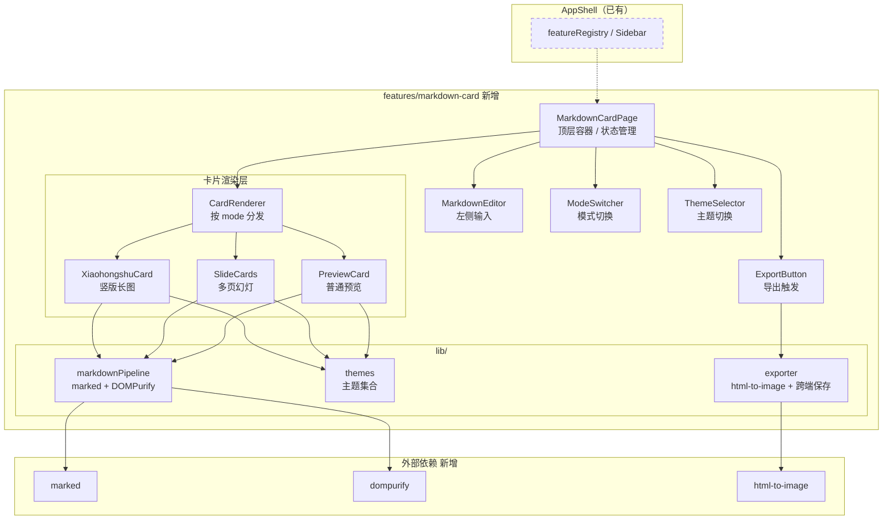
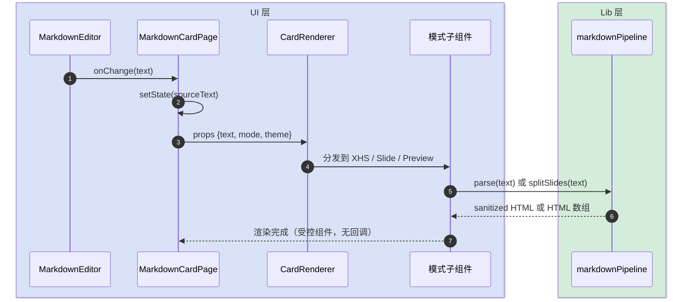
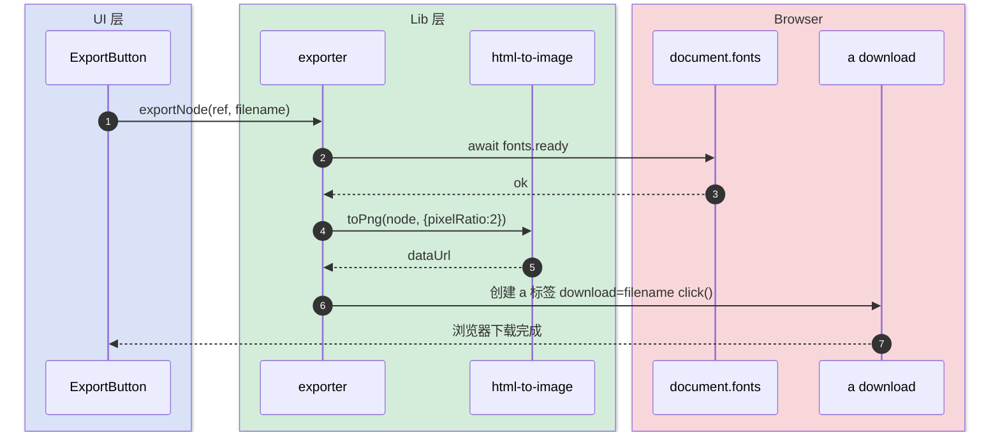
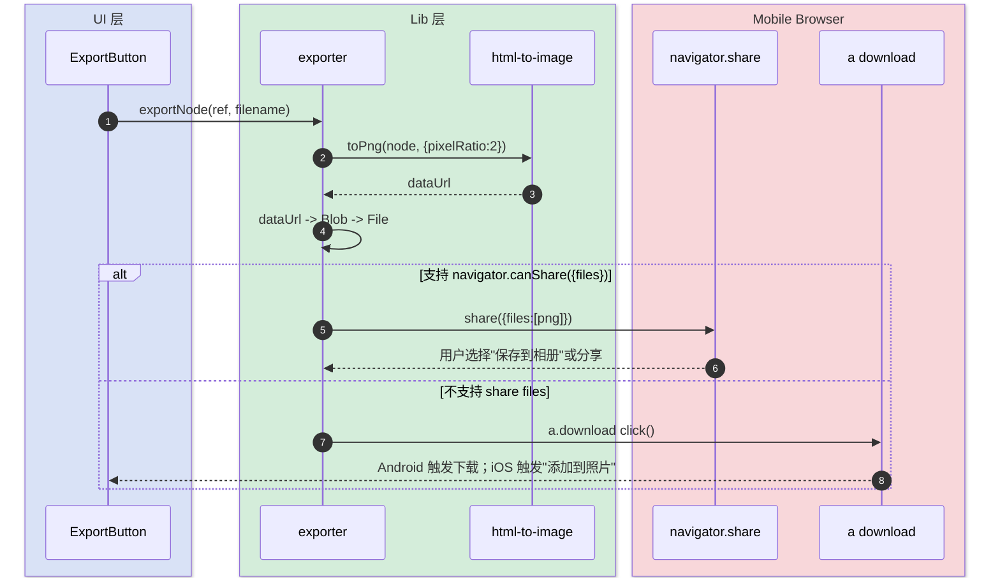

# Markdown 文本转卡片 · 技术方案

> **模板**：完整-技术（template-tech.md）
> **范围**：kai-toolbox / frontend 新增 feature 模块
> **最后更新**：2026-05-06

---

## 变更记录

| 版本 | 日期 | 修改人 | 变更内容摘要 |
|------|------|--------|--------------|
| current | 2026-05-06 | ai (claude) | 初版：三模式渲染 + 多主题 + 跨端导出 |
| current | 2026-05-06 | ai (claude) | 幻灯模式新增「按段落自动分块」切换（SplitMode） |

---

## 1. 目标与边界

- **要解决的问题**：用户希望把一段 Markdown 文本快速转成可分享的卡片图片，省去美化与排版步骤。
- **本次目标**：
  1. 提供一个新的 feature 模块 `markdown-card`，注册到现有 `featureRegistry`，与扁平化、视频库等并列出现在首页与侧边栏。
  2. 支持三种渲染模式：**小红书分享卡（竖版）**、**多页幻灯卡片（16:9）**、**纯预览卡**。
  3. 提供 ≥4 套主题，可在任意模式下切换。
  4. 一键导出 PNG：移动端尝试调起系统分享 / 保存到相册，PC 端直接 Blob 下载。
- **不做什么**：
  1. 不引入后端接口，不存历史卡片，不做账号同步。
  2. 不做协作 / 评论 / 模板市场。
  3. 不导出 PDF / SVG，本期只输出 PNG。
  4. 不做 Markdown 编辑器智能补全；输入框采用基础 textarea。
  5. 不做服务端渲染（SSR / Puppeteer 截图），全部在浏览器内完成。
- **设计结论（一句话）**：以「输入文本 → 渲染管线 → 模式分发 → 主题装配 → 跨端导出」五段式，把 markdown-card 拆成纯前端模块，三种模式共用同一份 markdown 解析与导出基础设施。

---

## 2. 整体架构



**说明**：

- 虚线框 `Shell` 表示已有不变；`Feature`、`External` 是本次新增。
- `MarkdownCardPage` 是唯一持有状态（源文本 / 模式 / 主题）的容器；下层全部受控，不持有自己的状态。
- 三种模式渲染器 `XHS / SLIDE / PREV` 平级，共享 `markdownPipeline` 与 `themes`，互相不感知。
- 导出器 `exporter` 接受 DOM 节点和文件名，**不感知模式与主题**——这是模块解耦的关键。

---

## 3. 模块拆分与职责

### 3.1 MarkdownCardPage

- **定位**：feature 顶层容器，唯一状态源。
- **职责**：
  1. 持有 `sourceText / mode / theme / exporting` 四个状态。
  2. 装配 Editor / ModeSwitcher / ThemeSelector / CardRenderer / ExportButton。
  3. 把当前渲染的卡片 DOM ref 传给 ExportButton。
- **上游**：`featureRegistry` 通过 manifest 路由到本页。
- **下游**：MarkdownEditor / ModeSwitcher / ThemeSelector / CardRenderer / ExportButton。
- **关键设计点**：状态全部受控，不在子组件内 `useState`；切换模式 / 主题不重置文本。

### 3.2 markdownPipeline (lib)

- **定位**：把 Markdown 字符串安全地转换成可渲染 HTML。
- **职责**：
  1. 用 `marked` 把 markdown 解析成 HTML。
  2. 用 `DOMPurify` 清洗，禁止 `<script>` / `on*` / `javascript:` 等危险节点。
  3. 提供 `splitSlides(text)`：按 `^---\s*$` 行切分多页。
- **上游**：三个卡片渲染组件。
- **下游**：`marked` / `dompurify`。
- **关键设计点**：默认禁用 raw HTML 透传（marked 配置 `mangle:false, breaks:true`，sanitize 由 DOMPurify 兜底）；切片函数对 Windows `\r\n` / Linux `\n` 行尾都健壮。

### 3.3 themes (lib)

- **定位**：主题元数据与 CSS 类名集合。
- **职责**：
  1. 导出主题枚举：`minimal / dark / xiaohongshu / zhihu / terminal`（≥4 套，初版给 5 套）。
  2. 每个主题映射一组 CSS 变量（背景、字体、标题色、正文色、引用色、code 块、署名）。
  3. 提供 `getThemeClass(theme)` 工具方法，挂在卡片根 DOM 的 `data-md-theme` 属性。
- **上游**：ThemeSelector / 三个卡片渲染组件。
- **下游**：`styles/card-themes.css`。
- **关键设计点**：主题与模式**正交**——任何主题可以套用在任何模式上；CSS 用 `[data-md-theme="xxx"]` 属性选择器实现，不污染全局 Tailwind。

### 3.4 CardRenderer + 三种模式子组件

- **定位**：根据 mode 分发到具体卡片实现。
- **职责**：
  1. `CardRenderer` 是一个简单 switch，按 mode 渲染对应子组件。
  2. `XiaohongshuCard`：固定宽 750px、高度自适应（最少 1000px），带顶部标题区 + 正文区 + 底部署名水印。导出时尺寸放大 2x（DPR）。
  3. `SlideCards`：调用 `splitSlides` 切片，每页 1280x720 固定比例；UI 上提供翻页器，导出时**逐页导出**生成多张 PNG。
  4. `PreviewCard`：响应式宽度，单纯 markdown → HTML 渲染，无固定尺寸；导出时按当前 DOM 尺寸截屏。
- **上游**：MarkdownCardPage。
- **下游**：markdownPipeline / themes。
- **关键设计点**：所有子组件 root 都暴露 `ref`，让 ExportButton 能拿到 DOM 节点；XHS / Slide 模式的固定尺寸通过外层包裹层实现，避免缩放破坏视觉。

### 3.5 exporter (lib)

- **定位**：把 DOM 节点变成 PNG 文件落地到本地。
- **职责**：
  1. `captureNode(node, scale?)`：调 `html-to-image.toPng`，返回 dataURL。
  2. `saveImage(dataUrl, filename)`：跨端落地策略（详见 §4.2 / §4.3）。
  3. `exportSlides(nodes[], baseName)`：批量导出多张图（用于多页模式）。
- **上游**：ExportButton / MarkdownCardPage。
- **下游**：`html-to-image` / `navigator.share` / `<a download>`。
- **关键设计点**：
  - 导出前等待 `document.fonts.ready`，避免中文字体未加载导致回退到系统默认字体。
  - PC / 移动端的差异封装在本模块内，调用方只关心"导出这个节点"。
  - 失败兜底：`navigator.share` 不可用时回退 `<a download>`，`<a download>` 又不可用时把 dataURL 弹到新窗口让用户长按保存。

---

## 4. 关键交互

> 三张小图，分别讲渲染管线、PC 端导出、移动端导出。

### 4.1 渲染管线（输入 → 卡片 DOM）

> **触发**：用户输入或修改 Markdown 文本，或切换模式 / 主题。
> **参与方**：MarkdownEditor、MarkdownCardPage、CardRenderer、markdownPipeline、模式子组件。



### 4.2 导出（PC 端）

> **触发**：用户在桌面浏览器点击「导出 PNG」。
> **参与方**：ExportButton、exporter、html-to-image、Browser File API。



### 4.3 导出（移动 Web）

> **触发**：用户在手机浏览器点击「导出 PNG」。
> **参与方**：ExportButton、exporter、html-to-image、navigator.share、`<a download>` 兜底。



---

## 5. 核心业务规则

| 规则 | 说明 |
|------|------|
| 模式与主题正交 | 任意主题可套任意模式；切换不重置 sourceText、不重置另一维度选择 |
| 多页幻灯比例 | 提供 `16:9` 与 `9:16` 两档；逻辑像素分别为 1280×720 / 720×1280；切换不丢页码 |
| 幻灯分块模式 | 提供两档：`manual`（默认，`---` 行切片）/ `paragraph`（按 H1/H2 标题分块，无标题时回退到双空行切割） |
| 多页切片规则 | `manual` 仅按行级 `^---\s*$` 切分；`paragraph` 按 `^#{1,2}\s` 行切分（无标题则按 `\n\s*\n` 切），空白块过滤，至少 1 块 |
| 小红书水印 | 三段可选：`signature` 主署名、`subSignature` 副署名、`qrcodeUrl` 二维码图；任一为空则该段不渲染 |
| 状态持久化 | sourceText / mode / theme / slideRatio / watermark 五项写入 localStorage（键 `kai-toolbox:markdown-card:state`），加载时若解析失败回退默认值 |
| XSS 防护 | 所有 markdown 渲染结果必须过 DOMPurify；禁用 raw HTML 默认渲染（marked.setOptions 不开 raw） |
| 字体就绪 | 任何导出动作前 `await document.fonts.ready`，避免中文回退到系统字体 |
| 文件命名 | `md-card-{mode}-{yyyymmdd-HHMMSS}.png`；多页模式加 `-{页码}` 后缀 |
| 失败兜底链 | `navigator.share` → `<a download>` → 新窗口展示 dataURL（让用户长按保存）三级降级 |
| 导出尺寸 | XHS 与 Slide 内部用 CSS 锁定逻辑像素尺寸；导出时 `pixelRatio: 2` 输出 2x 高清 PNG |
| 大文本保护 | sourceText > 50k 字符时禁用实时渲染，加一个"刷新预览"按钮；避免主线程被 marked 阻塞 |

---

## 6. 编码落点

```text
frontend/
├── src/
│   └── features/
│       └── markdown-card/                          [新增] 整个 feature 模块
│           ├── index.tsx                           [新增] FeatureManifest，注册到 featureRegistry
│           ├── pages/
│           │   └── MarkdownCardPage.tsx            [新增] 顶层容器，持有 sourceText/mode/theme 状态
│           ├── components/
│           │   ├── MarkdownEditor.tsx              [新增] 左侧 textarea 输入框，受控
│           │   ├── ModeSwitcher.tsx                [新增] 模式切换器（3 选项）
│           │   ├── ThemeSelector.tsx               [新增] 主题下拉/分段控件
│           │   ├── ExportButton.tsx                [新增] 导出触发器，调 exporter
│           │   ├── CardRenderer.tsx                [新增] 模式分发器
│           │   ├── XiaohongshuCard.tsx             [新增] 竖版分享卡 750xN
│           │   ├── SlideCards.tsx                  [新增] 多页幻灯 1280x720，含翻页器
│           │   └── PreviewCard.tsx                 [新增] 响应式 markdown 预览
│           ├── lib/
│           │   ├── markdownPipeline.ts             [新增] marked + DOMPurify + splitSlides
│           │   ├── themes.ts                       [新增] 主题枚举与元数据
│           │   └── exporter.ts                     [新增] html-to-image + 跨端保存
│           ├── styles/
│           │   └── card-themes.css                 [新增] 主题 CSS 变量与字重
│           └── types.ts                            [新增] Mode/Theme/CardConfig 类型
├── package.json                                    [修改] 新增依赖 marked / dompurify / @types/dompurify / html-to-image
└── src/main.tsx                                    [不变] 仅引用，无需改动
```

### 调用关系说明

- `MarkdownCardPage` → `CardRenderer` → `XiaohongshuCard / SlideCards / PreviewCard` → `markdownPipeline + themes`
- `ExportButton` → `exporter`（不经过 CardRenderer，直接使用 ref 抓 DOM）
- `featureRegistry`（已有）→ `index.tsx`（manifest）→ `MarkdownCardPage`（lazy 也可改成 eager，由现有 manifest 风格决定）

---

## 7. 数据与依赖变更

| 类型 | 是否变化 | 说明 |
|------|----------|------|
| 数据库表 / 字段 / 索引 | 无 | 纯前端，无后端 |
| DTO / VO / 枚举 | 有 | 新增前端类型 `Mode`、`Theme`、`CardConfig`（仅前端范围） |
| 下游接口 / 外部依赖 | 有 | 新增 npm 依赖：`marked`、`dompurify`、`@types/dompurify`、`html-to-image`；预计总体积 +~80KB gzip |
| 缓存 / 消息 / 锁 / 事务 | 无 | 不涉及 |

---

## 8. 风险与待确认

| 风险 / 待确认点 | 影响 | 处理方式 |
|----------------|------|----------|
| iOS Safari `navigator.canShare({files})` 仅 16.4+ 稳定 | 旧设备无法走"保存到相册"分享，只能 fallback `<a download>` 触发"添加到照片"；体验有差异 | 文档说明 + 自动降级，不阻断主流程 |
| html-to-image 对 `position: fixed` / `transform` 元素截图偶发偏移 | 卡片版式错位 | 卡片根容器避免 fixed/transform；导出前临时 `position: static` |
| 中文字体在 toPng 渲染时需要 fontEmbedCSS | 输出图片字体回退到 sans-serif，视觉劣化 | 导出前 `await document.fonts.ready`；如仍异常则按需开启 `fontEmbedCSS` 选项 |
| 多页模式批量导出（10+ 页）耗时较长 | 用户感知卡顿 | 串行导出 + 进度条（复用 ExportButton 状态）；不并行避免 OOM |
| Web 无法直接写 Android / iOS 系统相册 | 用户期望「自动保存到相册」可能落空 | Web 平台能力上限：现有三级降级（`navigator.share`+files → `<a download>` → 新窗口长按）已是最佳实践；UI 上明确提示「分享面板里选择保存图片」 |
| sourceText 极大时 marked 阻塞主线程 | 输入卡顿 | §5 已定 50k 字符阈值；超过则禁用实时渲染，改为按钮触发 |

## 8·1. 已确认决策（2026-05-06）

| 决策项 | 结论 |
|------|------|
| 主题集 | 初版 5 套：`minimal / dark / xiaohongshu / zhihu / terminal` |
| 多页幻灯尺寸 | 提供两档：`16:9`（1280×720，默认）和 `9:16`（720×1280，手机竖版）；UI 加切换段控件 |
| 小红书卡片水印 | 支持可选的「署名 / 副署名 / 二维码图」三段位水印；通过侧栏小表单配置；空字段不显示 |
| sourceText 持久化 | 启用 localStorage 持久化，键名 `kai-toolbox:markdown-card:state`，含 `sourceText / mode / theme / slideRatio / watermark` |
| 相册保存策略 | 维持三级降级，不再额外引入插件或原生壳；UI 文案明确提示移动端"在分享面板里选择保存图片" |

---

## 9. 验证要点

- **正常路径**：
  - 输入一段含 H1/H2/列表/引用/代码块的 markdown，三种模式都能渲染。
  - 导出按钮 PC 触发下载、移动端触发分享面板。
- **异常路径**：
  - 输入空文本：渲染区显示占位文案，导出按钮禁用。
  - 输入恶意 HTML（`<script>alert(1)</script>`）：DOMPurify 清除，无脚本执行。
  - 关闭网络后切换主题/模式仍正常（无后端依赖）。
- **边界条件**：
  - sourceText 长度 0 / 1 / 50000 / 100000 字符。
  - 多页模式：0 个 `---`（单页）/ 1 个 / 多个 / 连续 `---`（产生空页跳过）。
  - 主题切换不重置 sourceText 与当前页码。
- **回归范围**：
  - 仅本 feature；其他 feature（flatten/treesize/lan-share/video-library）不受影响。
  - 首页与侧边栏会多出一项「Markdown 转卡片」，验证排序与图标。
