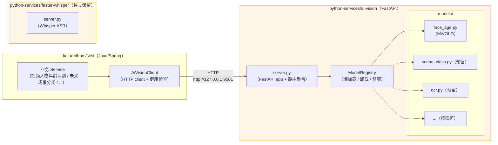
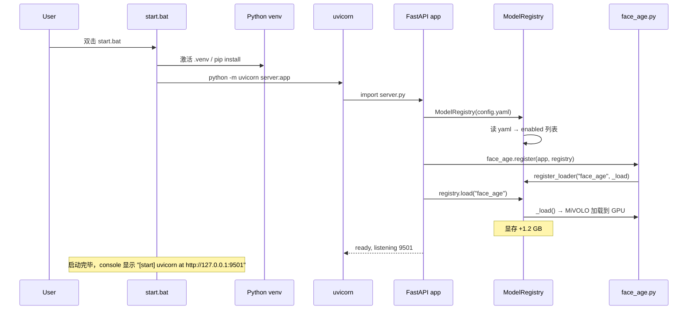
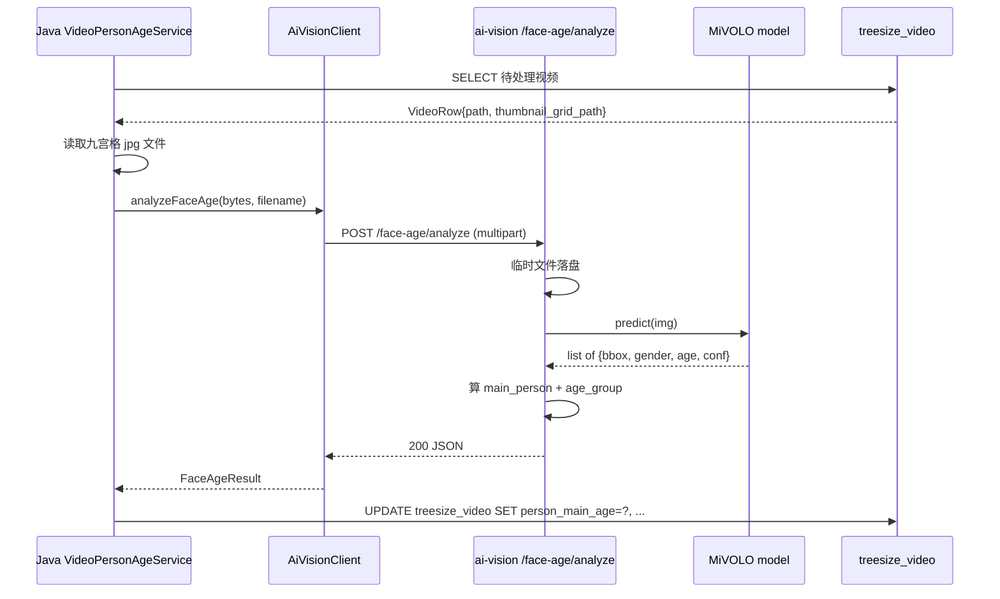
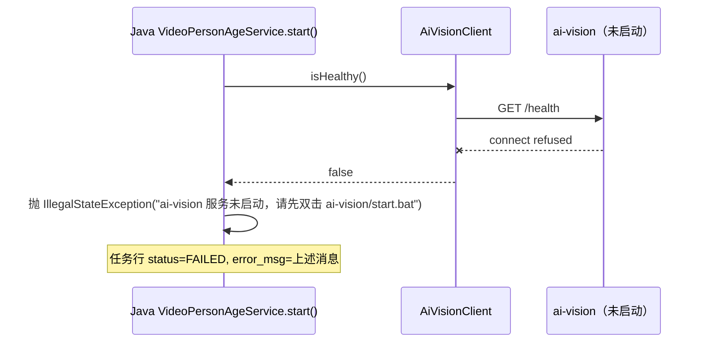

# Python AI 服务架构（技术方案）

> 最后更新：2026-05-21
> 模版：完整-技术（template-tech.md）
> 定位：**项目级基础设施文档**（不归任何业务功能），承载所有需要 Python 生态的 AI 模型推断
> 现状参照：[python-services/faster-whisper/server.py](../../../../../D:/Users/zhang/IdeaProjects/kai-toolbox/python-services/faster-whisper/server.py)（已落地）

## 1. 目标与边界

### 为什么需要 Python AI 服务

`kai-toolbox` 主体是 **Java/Spring Boot** 工程，但项目要集成的多数 AI 模型属于 **Python 生态**：

| 模型类型 | Python 生态 | Java 生态 |
|---------|------------|----------|
| 大语言模型（推理） | transformers / vLLM / Ollama | 几乎只有 ONNX Runtime 跑量化版 |
| 视觉模型（YOLO / MiVOLO / InsightFace） | PyTorch / Ultralytics SDK | ONNX Runtime 可跑但要自己写 pre/post-processing |
| 语音识别（Whisper / Vosk） | faster-whisper / openai-whisper | whisper.cpp CLI / JNI |
| 多模态（LLaVA / Qwen-VL） | transformers + image processor | 几乎没有现成方案 |
| 嵌入向量（sentence-transformers） | 官方包 | DJL 有支持但模型选择少 |

**结论**：与其在 Java 侧用 ONNX 自己拼推理 pipeline、维护各种 pre/post-processing，不如**起一个 Python HTTP 服务**让 Java 端通过 HTTP/JSON 调用，分工清晰。

### 项目里的两类 Python 服务

```
python-services/
├── faster-whisper/      ← 已有（独立服务）：Whisper 字幕生成 fallback
└── ai-vision/           ← 新建（统一服务）：视觉模型聚合，未来扩展点
```

**为什么 faster-whisper 不合并进 ai-vision**：

| 维度 | faster-whisper | ai-vision |
|------|---------------|-----------|
| 触发方式 | 用户主动跑字幕（mode=asr-service 时） | 各种视觉任务（语言识别后扩、人物识别、场景分类等） |
| 显存常驻 | 否（按需启动） | 是（建议常驻；模型加载耗时 5-30s） |
| 模型大小 | 1.5GB（large-v3-turbo） | 各模型 100MB-2GB 不等 |
| 依赖体量 | CTranslate2 + cuDNN 专一 | PyTorch + 各模型 SDK 杂烩 |
| 业务边界 | 字幕生成专属 | 跨业务复用 |

强行合并会让 Whisper 也常驻显存，且依赖冲突难维护（CTranslate2 vs PyTorch 同一 .venv 不一定兼容）。**两者分开部署，前端从 Java 后端透出统一界面即可**。

### 做什么

- 定义 **`ai-vision/` 统一 Python 服务的架构规范**：目录结构、路由、模型生命周期、配置、健康检查
- 落地 ai-vision 服务 v1：仅挂 **MiVOLO 人物年龄识别** 一个模型
- 定义 **Java 端 `AiVisionClient`** 客户端类规范：HTTP 调用、自动健康检查、配置项
- 制定**未来扩模型的标准流程**：放 `models/{name}.py` + 路由注册 + 配置项 + Java 客户端方法

### 不做什么

- 不合并已有 faster-whisper（独立保留）
- 不做 Triton / BentoML 这种工业级方案（项目规模过重）
- 不做模型市场 / 远程模型仓库（本地模型够用）
- 不做用户层的"模型管理 UI"（开发者改 yaml 即可）
- 不在 ai-vision 服务里跑 LLM（Ollama 已经做了这件事，文本生成走 Ollama）

### 设计结论

| 决策 | 选择 | 原因 |
|------|------|------|
| 框架 | **FastAPI + uvicorn** | 与 faster-whisper 同源；自带 Swagger UI；async 友好 |
| 路由风格 | `/{model}/{action}` | 一个 service 多模型多动作；与未来扩展兼容 |
| 端点契约 | `multipart/form-data` 上传文件 → JSON 返回 | 与 OpenAPI 标准一致；FastAPI 自动文档 |
| 显存管理 | 模型懒加载 + 空闲卸载 | 4060 Ti 16GB 不能所有模型同时常驻 |
| 模型启停控制 | `config.yaml` 决定**启动时**加载哪些模型；`POST /{model}/load` 手动加 | 灵活 + 默认安全（不超显存） |
| 健康检查 | `GET /health` 返回各模型加载状态 | Java 启动时打这个验证服务存活 |
| 错误处理 | 业务错误用 HTTPException(4xx)；推理错误用 500 + JSON message | 与 faster-whisper 一致 |
| 文件 IO | 上传到临时文件 → 推理 → finally 删 | 避免内存峰值 |
| 服务端口 | **9501**（faster-whisper 是 9500） | 端口号递增，开发机可同时跑 |
| 部署方式 | `.venv` + `pip install` + `start.bat`（ASCII-only 注释） | 与 faster-whisper 完全一致 |
| 中文文档 | 写在 `README.md` | start.bat 注释只能 ASCII（GBK 编码陷阱） |
| 模型下载 | HuggingFace（首次自动），提示用户走 `HF_ENDPOINT` mirror | 与 faster-whisper 一致 |
| 后端启动顺序 | Java 不强依赖 ai-vision 启动；调用时若 502/connect refused → 提示用户启动服务 | 解耦运行时依赖 |

## 2. 整体架构



## 3. 模块拆分与职责

### 3.1 `ai-vision/server.py` — 主入口

- 启动时读 `config.yaml`，对每个 `enabled: true` 的模型调 `registry.load(name)`
- 注册路由：每个 model 的 `routes` 字典挂到 FastAPI app
- 暴露公共端点：`/health` / `/models`（列出加载状态）
- uvicorn 启动 `host=127.0.0.1 port=9501`

骨架：

```python
from fastapi import FastAPI
from registry import ModelRegistry
from models import face_age   # 未来加新模型在此 import

app = FastAPI(title="kai-toolbox ai-vision")
registry = ModelRegistry(config_path="config.yaml")

# 公共端点
@app.get("/health")
def health(): return {"status": "ok", "models": registry.health_view()}

@app.get("/models")
def list_models(): return registry.list()

@app.post("/{model_name}/load")
def load(model_name: str): registry.load(model_name); return {"loaded": model_name}

@app.post("/{model_name}/unload")
def unload(model_name: str): registry.unload(model_name); return {"unloaded": model_name}

# 业务端点（动态由 models/*.py 的 register(app) 函数挂上）
face_age.register(app, registry)
# 未来：scene_class.register(app, registry); ocr.register(app, registry); ...
```

### 3.2 `ai-vision/registry.py` — 模型生命周期

```python
class ModelRegistry:
    def __init__(self, config_path: str):
        self.config = yaml.safe_load(open(config_path))
        self.loaded: dict[str, object] = {}   # name -> 模型实例
        self.lock = threading.Lock()

    def load(self, name: str): ...     # 懒加载，幂等
    def unload(self, name: str): ...   # 释放显存
    def get(self, name: str): ...      # 取已加载模型，未加载抛 HTTPException(503)
    def health_view(self): ...         # { "face_age": "loaded", "scene_class": "unloaded" }
    def list(self): ...                # config 中的全部模型 + 当前状态
```

**职责边界**：Registry 只管"哪些模型加载了/没加载"；模型本身的 inference 由各 `models/{name}.py` 实现。

### 3.3 `ai-vision/models/face_age.py` — MiVOLO 实现

```python
from fastapi import FastAPI, UploadFile, File, HTTPException
from registry import ModelRegistry

MODEL_NAME = "face_age"

def _load():
    # 用 MiVOLO 官方 API 加载模型；详见 README
    from mivolo.predictor import Predictor
    return Predictor(checkpoint_path=..., device="cuda")

def register(app: FastAPI, registry: ModelRegistry):
    registry.register_loader(MODEL_NAME, _load)

    @app.post("/face-age/analyze")
    async def analyze(file: UploadFile = File(...)):
        model = registry.get(MODEL_NAME)  # 未加载会 503
        img_bytes = await file.read()
        # 解 jpg → cv2 / PIL
        # model.predict(img) → list[{bbox, gender, age, conf}]
        # 算 main_person（最大 bbox 或最频出现）
        return { "people": [...], "main_person": {...}, "model_version": "mivolo-v2" }
```

**新增模型的标准流程**：
1. 新建 `models/{new_name}.py`，定义 `MODEL_NAME` + `_load()` + `register(app, registry)`
2. 在 `server.py` 加 `from models import new_name` + `new_name.register(app, registry)`
3. `config.yaml` 加一条 `{new_name}: { enabled: true, params: ... }`
4. 重启服务

### 3.4 `ai-vision/config.yaml` — 模型配置

```yaml
# kai-toolbox ai-vision 服务配置
service:
  host: "127.0.0.1"
  port: 9501
  idle_unload_minutes: 30        # 模型空闲 30 分钟自动卸载（None 禁用）

models:
  face_age:
    enabled: true                # 启动时加载
    device: cuda
    checkpoint: ${MIVOLO_CHECKPOINT:./models/checkpoints/mivolo_d1.pth.tar}
    detector: ${MIVOLO_DETECTOR:./models/checkpoints/yolov8x_person_face.pt}
    half: true                   # FP16

  # 未来扩展示例
  # scene_class:
  #   enabled: false
  #   model_id: "microsoft/clip-vit-base-patch16"

  # ocr:
  #   enabled: false
  #   languages: ["zh", "en"]
```

### 3.5 `ai-vision/requirements.txt`

```text
# Core HTTP
fastapi>=0.110.0
uvicorn[standard]>=0.27.0
python-multipart>=0.0.9
pyyaml>=6.0

# Imaging
opencv-python>=4.9.0
Pillow>=10.0.0
numpy>=1.26.0

# PyTorch (CUDA 12.x；CPU 用户改 cpuonly 索引)
torch>=2.2.0
torchvision>=0.17.0

# MiVOLO（pip 直装）
# pip install git+https://github.com/WildChlamydia/MiVOLO.git
# 或者 vendored 进 models/_mivolo/ 子目录避免 git 依赖
```

### 3.6 `ai-vision/start.bat` — 启动脚本

仿照 faster-whisper 的格式（**ASCII-only 注释**），核心动作：
- 自动建 `.venv`（首次）
- `pip install -r requirements.txt`
- 环境变量驱动：`AI_VISION_PORT` / `MIVOLO_CHECKPOINT` / `HTTPS_PROXY` / `HF_ENDPOINT`
- 启动 `python -m uvicorn server:app --host 127.0.0.1 --port 9501`

### 3.7 Java 端 `AiVisionClient`

放在 `common-media` 或 `tool-treesize` 模块（按依赖范围选）。

```java
@Component
public class AiVisionClient {
    private final RestClient http;        // Spring 6+ RestClient（替代 RestTemplate）
    private final AiVisionProperties props;

    public boolean isHealthy() {
        try {
            HealthView v = http.get().uri("/health").retrieve().body(HealthView.class);
            return "ok".equals(v.status());
        } catch (Exception e) { return false; }
    }

    public FaceAgeResult analyzeFaceAge(byte[] imageBytes, String filename) {
        return http.post()
            .uri("/face-age/analyze")
            .body(MultipartBodyBuilders.fromBytes(imageBytes, filename, "image/jpeg"))
            .retrieve()
            .body(FaceAgeResult.class);
    }

    // 未来扩 sceneClassify / ocrExtract / ... 在此加方法
}
```

### 3.8 `application.yml` 新增配置块

```yaml
toolbox:
  ai-vision:
    url: ${AI_VISION_URL:http://127.0.0.1:9501}
    timeout-seconds: 60        # MiVOLO 单帧 < 2s；批量 ~ 30s
    health-check-on-startup: false   # 启动时不强检，调用时再验
```

## 4. 关键交互

### 4.1 服务启动 + 模型加载



### 4.2 Java 调用流程



### 4.3 服务未启动时的降级



## 5. 核心业务规则

| 规则 | 说明 |
|------|------|
| **服务独立运行** | ai-vision 不由 Java 启动 / 不由 systemd 管；用户手动启 start.bat。Java 端调用时若 connect refused 给出清晰错误指引 |
| **模型懒加载 + 卸载** | config.enabled=true 启动时加载；空闲 30 分钟自动 unload 释放显存 |
| **临时文件清理** | 每个上传请求 finally 块删 tempfile；启动时清理一次 tmpdir 防残留 |
| **错误透传** | Python 异常 → HTTP 5xx + JSON `{message}`；Java 端原样透传给用户，方便定位 |
| **配置环境变量优先** | `MIVOLO_CHECKPOINT=...` 环境变量覆盖 yaml 默认值，便于不同机器部署 |
| **批量调用不在服务层** | 服务只处理单图；批量循环放 Java 端的 ProcessingJobService 里跑（与语言识别 / 九宫格同模式） |
| **不做 GPU 并发** | 单进程串行；模型 inference 之间不允许重叠（torch 默认行为，单 nn.Module forward 在 lock 下） |
| **健康检查每 60s 失效** | Java `AiVisionClient` 缓存 /health 结果 60s；调用前命中缓存就直接发请求，未命中先 /health 再发 |

## 6. 编码落点

```
kai-toolbox/
├── python-services/
│   ├── faster-whisper/                       [已有，不改]
│   └── ai-vision/                            [新建]
│       ├── server.py                         [新] FastAPI 主入口
│       ├── registry.py                       [新] 模型生命周期管理
│       ├── models/
│       │   ├── __init__.py                   [新]
│       │   └── face_age.py                   [新] MiVOLO 端点
│       ├── config.yaml                       [新]
│       ├── requirements.txt                  [新]
│       ├── start.bat                         [新] Windows 启动
│       ├── start.sh                          [新] Linux/macOS 启动（可选）
│       ├── README.md                         [新] 中文说明 + 部署 troubleshooting
│       └── .gitignore                        [新] 忽略 .venv / __pycache__ / *.pyc / checkpoints/
└── tools/tool-treesize/src/main/java/com/exceptioncoder/toolbox/treesize/
    ├── client/
    │   ├── AiVisionClient.java               [新] HTTP 客户端
    │   ├── AiVisionProperties.java           [新] @ConfigurationProperties("toolbox.ai-vision")
    │   └── dto/
    │       ├── HealthView.java               [新]
    │       └── FaceAgeResult.java            [新]
    └── （消费者：VideoPersonAgeService 等业务 service，在各自子模块的 coding.md 里落地）
```

## 7. 风险与待确认

### 7.1 风险

| 风险 | 缓解 |
|------|------|
| MiVOLO HuggingFace 下载墙 | start.bat 提示 `HF_ENDPOINT=https://hf-mirror.com` 与 `HTTPS_PROXY`（与 faster-whisper 同方案） |
| 显存爆（多个模型同时常驻） | config.yaml 默认只 enable 当前业务用到的；空闲 30min 自动卸载；新模型默认 enabled: false |
| .venv 体积大（PyTorch+CUDA ≈ 4GB） | 入 .gitignore；新机部署首次跑 start.bat 自动 pip install |
| Python 进程崩溃后 Java 端不知道 | Java 调用 isHealthy() 失败时返回明确"未启动"错误；不重试 |
| 端口冲突（已占用 9501） | start.bat 启动前 netstat 检查（可选增强），默认让 uvicorn 自己抛错 |
| Windows GBK 编码 + 中文路径 | 与 faster-whisper 同思路：上传文件用临时名 / start.bat 注释强制 ASCII |
| ai-vision 端点契约后续变更 | 路由按 `/{model}/{action}` 分级，新版本可走 `/face-age-v2/analyze` 并存 |
| 不同模型 PyTorch 版本冲突 | 单 .venv 同时装一套 torch；新模型选择时审查依赖兼容性 |

### 7.2 待确认

| 项 | 待确认 |
|---|--------|
| MiVOLO checkpoint 来源 | 官方 release [WildChlamydia/MiVOLO](https://github.com/WildChlamydia/MiVOLO) |
| MiVOLO 商用许可 | 检查 LICENSE（项目自用工具不上线对外，风险可控） |
| 服务进程是否做 systemd / nssm 自启 | 本期不做；用户手动启 start.bat |

## 8. 未来演化

### 8.1 扩展点（占位，不在本期）

| 模型 | 端点 | 用途 |
|------|------|------|
| **face_age** | `/face-age/analyze` | 视频人物年龄识别（本期落地） |
| scene_class | `/scene/classify` | 场景分类（室内/户外/人物/动画/PPT） |
| ocr | `/ocr/extract` | 视频帧文字提取 |
| caption | `/caption/generate` | 单帧自然语言描述 |
| similarity | `/similarity/embed` | 视频 embedding，用于相似视频检索 |

### 8.2 服务合并的可能性

未来若 ai-vision 模型增多导致显存吃紧，可拆分为 `ai-vision-cpu` / `ai-vision-gpu` 双服务；本期一个进程足够。

faster-whisper 暂不合并；如果某天为了简化运维要合并，需先解决 CTranslate2 与 PyTorch 同 .venv 的兼容性问题。
