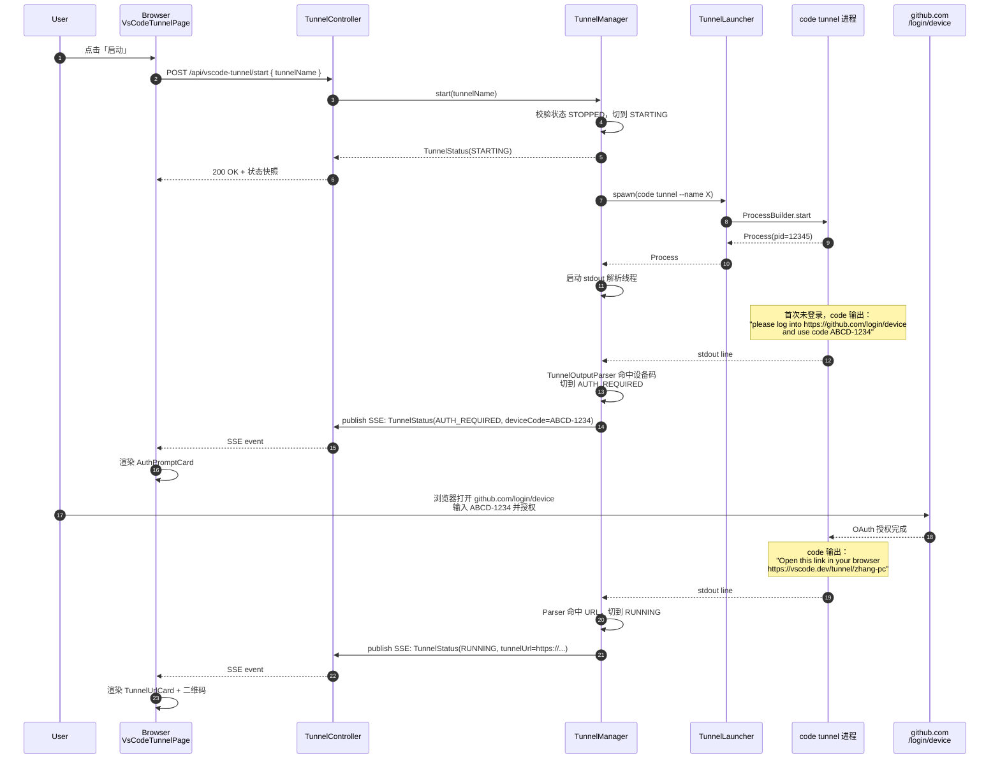
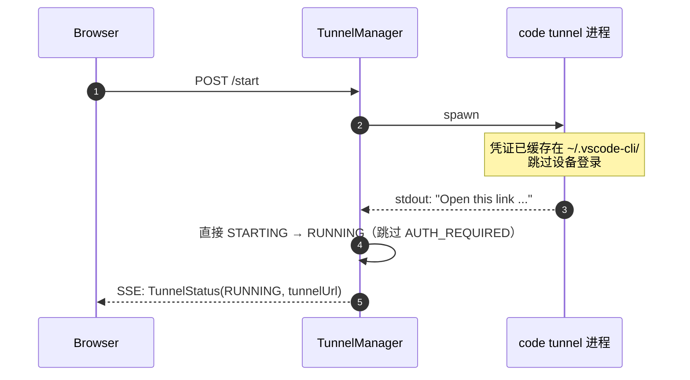
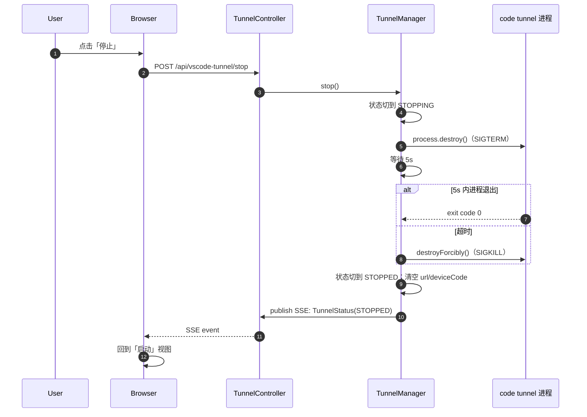
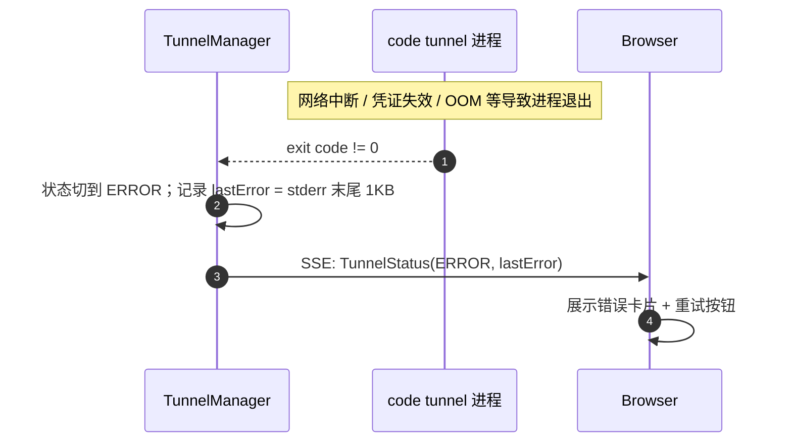
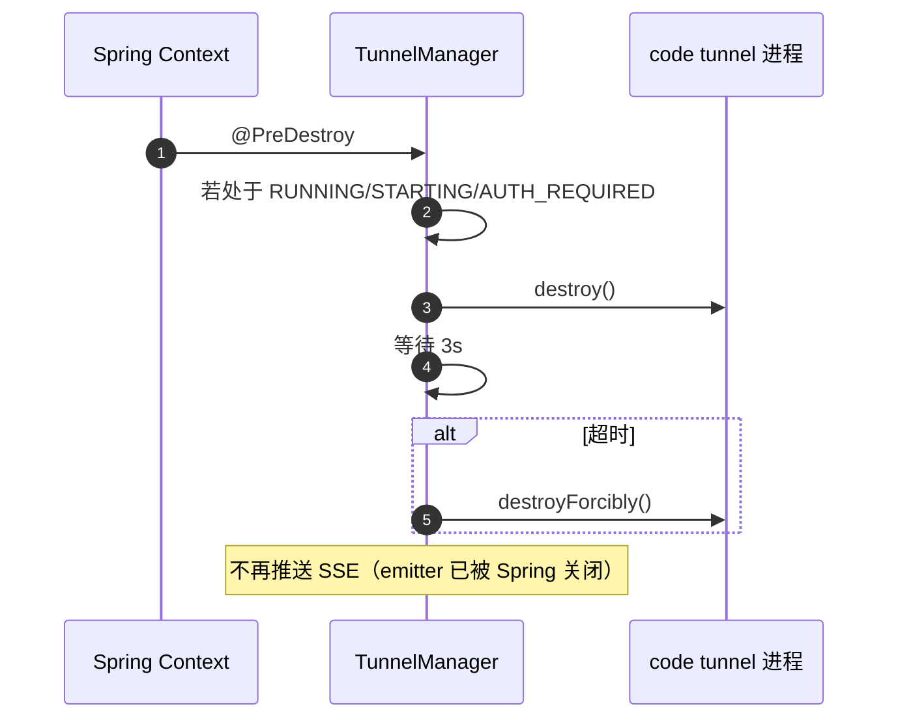
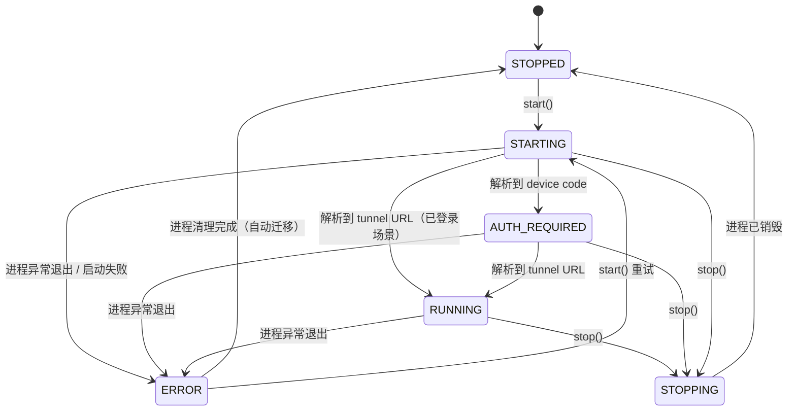

# VS Code Tunnel

> 最后更新：2026-05-21
> 模版：完整-技术（template-tech）
>
> 修订记录（本次落地后回写）：
> - 类命名按项目约定带 `Tool` 后缀：`VsCodeTunnelToolDescriptor`（原文 `VsCodeTunnelDescriptor`）
> - `ToolDescriptor.route()` 是必实现方法（接口契约要求），落地为 `/tools/vscode-tunnel`
> - `SseEmitterRegistry` 实际是 `key → emitter` 一对一注册，**不是 topic 广播**；多浏览器订阅由 `TunnelManager` 自维护订阅 keys 集合（`vscode-tunnel:<uuid>`），状态切换时遍历 `publish` 实现"广播"

在 kai-toolbox 前端新增一个工具页面，点击「启动」即可在本机后台运行 `code tunnel` 进程，将本地 VS Code 暴露为 `https://vscode.dev/tunnel/<name>` 远端入口；用户在手机浏览器打开该 URL，登录同一账号后，即可远程访问本机 VS Code（含已安装的 Claude Code 扩展），不依赖远程桌面、不依赖局域网。

---

## 1. 目标与边界

### 1.1 做什么

- 新增工具模块 `tools/tool-vscode-tunnel`，前端路由 `/tools/vscode-tunnel`
- 单例托管一个 `code tunnel` 子进程：启动、停止、查询状态、查询当前隧道 URL
- 解析 `code tunnel` 的 stdout，识别两类关键事件：
  - **首次登录设备码**：`To grant access to the server, please log into https://github.com/login/device and use code XXXX-XXXX`
  - **隧道就绪 URL**：`Open this link in your browser https://vscode.dev/tunnel/<name>`
- 前端展示当前状态、URL（含二维码方便手机扫码）、首次登录设备码（带"已登录"按钮跳到 https://github.com/login/device）
- 提供后端 SSE 实时推送状态变化（复用 `SseEmitterRegistry`）
- 进程长驻：前端页面关闭、刷新均不影响后端进程；只有显式点击「停止」或 Spring Boot 进程退出时才销毁

### 1.2 不做什么（第一版边界）

| 不做 | 原因 |
|------|------|
| 多隧道并发 | `code tunnel` 一台机器一个就够，且同名重启会冲突；单例最简 |
| 鉴权 | 项目定位 local single-user toolkit，无 auth |
| 跨平台一键安装 `code` CLI | 用户应已安装 VS Code 并把 `code` 加入 PATH；缺失时给出明确错误指引而非自动下载 |
| Windows 服务模式（`code tunnel service install`）的 UI 管控 | 服务安装/卸载行为不可逆且影响系统状态，第一版只做"进程模式"；服务模式留到后续演进 |
| 持久化历史隧道列表 | 状态全内存；进程销毁即清空，符合"一次性会话"心智 |
| Cloudflared / ngrok 等第三方隧道 | 用户已确认走 VS Code 官方 Tunnel；不引入额外二进制 |

### 1.3 设计结论

- **进程模型**：单例 `code tunnel --accept-server-license-terms --name <name>` 子进程；Spring 单例 Bean `TunnelManager` 持有 `Process` 引用和当前状态
- **解析模型**：1 条虚拟线程读取 stdout（stderr 已合流到 stdout，`redirectErrorStream(true)`），按行扫描，命中关键 pattern 时更新 `TunnelStatus` 并通过 SSE 推送
- **通信协议**：HTTP REST（start/stop/status）+ SSE（status 流），复用项目已有的 `SseEmitterRegistry`，不引入 WebSocket
- **状态机**：`STOPPED → STARTING → AUTH_REQUIRED →* RUNNING → STOPPING → STOPPED`；`AUTH_REQUIRED` 可被跳过（已登录的二次启动直接到 RUNNING）
- **持久化**：无。状态全内存
- **生命周期**：进程长驻；`@PreDestroy` 在 Spring 关停时 `destroyForcibly`，防止僵尸进程

---

## 2. 整体架构

```mermaid
flowchart LR
    subgraph Browser["浏览器（前端）"]
        UI["VsCodeTunnelPage<br/>路由 /tools/vscode-tunnel"]
        QR["QRCode 组件<br/>展示隧道 URL"]
        CTRL["StatusCard<br/>启动/停止按钮"]
        SSE["useTunnelStatusStream<br/>EventSource 客户端"]
        UI --> CTRL
        UI --> QR
        UI --> SSE
    end

    subgraph Vite["Vite Dev Server"]
        PROXY["/api 代理到 :8080"]
    end

    subgraph Backend["toolbox-starter Spring Boot"]
        CTL["TunnelController<br/>REST + SSE 端点"]
        MGR["TunnelManager<br/>@Component 单例"]
        PARSER["TunnelOutputParser<br/>按行扫描 stdout"]
        LAU["TunnelLauncher<br/>ProcessBuilder"]
        SSE_REG["SseEmitterRegistry<br/>（toolbox-common 复用）"]
        CTL --> MGR
        MGR --> LAU
        MGR --> PARSER
        MGR --> SSE_REG
    end

    subgraph OS["操作系统"]
        CODE["code.exe tunnel<br/>VS Code CLI 子进程"]
        VSDEV["vscode.dev<br/>微软隧道服务"]
    end

    SSE <--> PROXY
    CTRL <--> PROXY
    PROXY <--> CTL
    LAU --> CODE
    PARSER <-.stdout.- CODE
    CODE <-.WebSocket.-> VSDEV

    style PROXY stroke-dasharray: 5 5
    style VSDEV stroke-dasharray: 5 5
```

**说明：**

- 前端通过普通 HTTP 调 `start` / `stop`；状态更新走 SSE（`GET /api/vscode-tunnel/events`）
- 后端启动 `code tunnel` 子进程后，一条虚拟线程持续读 stdout，逐行喂给 `TunnelOutputParser`
- Parser 识别到设备码/URL 时调 `TunnelManager.transitionTo(...)`，后者更新内存状态 + 通过 `SseEmitterRegistry.publish(...)` 推送
- 隧道建立后，`code` 进程自身与 `vscode.dev` 保持长连接；本项目不感知该连接，只需保持 `code` 进程存活

---

## 3. 模块拆分与职责

新增独立 Maven 模块 `tools/tool-vscode-tunnel`，遵循 kai-toolbox「一个工具一个模块」约定。

### 3.1 tool-vscode-tunnel（后端模块）

定位：托管 `code tunnel` 子进程的生命周期 + stdout 解析 + 状态对外暴露。

| 类（全路径） | 职责（≤3 条） | 上下游 | 关键设计点 |
|---|---|---|---|
| `com.exceptioncoder.toolbox.vscodetunnel.config.VsCodeTunnelToolDescriptor` | 实现 `ToolDescriptor` 暴露工具元数据 | 被 `ToolRegistry` 收集 | id=`vscode-tunnel`、icon=`globe`、name=`VS Code Tunnel`、route=`/tools/vscode-tunnel` |
| `com.exceptioncoder.toolbox.vscodetunnel.config.VsCodeTunnelProperties` | 绑定 `toolbox.vscode-tunnel.*` 配置：enabled、`code` 路径、tunnel 名、accept-license、stop-grace-ms、error-tail-bytes | 被 Launcher / Manager 读取 | 默认 `code-path=code`、`tunnel-name=${HOSTNAME}`（紧凑构造器兜底） |
| `com.exceptioncoder.toolbox.vscodetunnel.api.TunnelController` | 暴露 `GET /status`、`POST /start`、`POST /stop`、`GET /events`(SSE) | 调 `TunnelManager` + `SseEmitterRegistry` | `/events` 为每个连接生成 `vscode-tunnel:<uuid>` 的 SSE key 并向 `TunnelManager.subscribe(key)` 注册；emitter 完成/超时/异常时自动 `unsubscribe` |
| `com.exceptioncoder.toolbox.vscodetunnel.service.TunnelManager` | 单例状态机；`start()` / `stop()` 同步互斥；持 `Process` 与 `TunnelStatus` | 调 `TunnelLauncher`、`TunnelOutputParser`、`SseEmitterRegistry` | `synchronized` 保证状态切换原子；`@PreDestroy` 调 `stop()`；`start()` 在已 RUNNING 时幂等返回 |
| `com.exceptioncoder.toolbox.vscodetunnel.service.TunnelLauncher` | 用 `ProcessBuilder` 启动 `code tunnel --accept-server-license-terms --name <name>`，合并 stderr 到 stdout | 被 Manager 调用 | 命令缺失（`IOException: Cannot run program`）时抛 `TunnelStartException`；环境变量保留 PATH |
| `com.exceptioncoder.toolbox.vscodetunnel.service.TunnelOutputParser` | 按行扫描 stdout，识别设备码 / URL / 严重错误；回调给 Manager | 被 Manager 通过 stdout 转发线程调用 | 两条正则：`code\s+([A-Z0-9]{4}-[A-Z0-9]{4})`、`https?://vscode\.dev/tunnel/\S+`；命中即触发状态切换 |
| `com.exceptioncoder.toolbox.vscodetunnel.domain.TunnelStatus` | 不可变快照：`state`、`tunnelUrl`、`deviceCode`、`deviceLoginUrl`、`tunnelName`、`pid`、`startedAt`、`lastError` | 被 Controller 返回；被 SSE 发送 | record；JSON 字段使用 camelCase；`state` 是 enum |
| `com.exceptioncoder.toolbox.vscodetunnel.domain.TunnelState` | 枚举 `STOPPED / STARTING / AUTH_REQUIRED / RUNNING / STOPPING / ERROR` | 被 TunnelStatus 持有 | 状态机迁移规则在 Manager 中集中校验 |
| `com.exceptioncoder.toolbox.vscodetunnel.api.dto.StartRequest` | 启动入参 `{ tunnelName?: string }` | 控制器入参 | record；name 为空时使用 properties 默认值 |

> 不修改 `toolbox-common`：本工具仅复用 `SseEmitterRegistry` 与 `ToolDescriptor`，不抽公共子进程管理基础设施（遵循 CLAUDE.md「No premature infrastructure」）。

### 3.2 frontend/src/features/vscode-tunnel（前端模块）

定位：状态展示 + 启动停止控制 + 二维码渲染 + SSE 订阅。

| 文件 | 职责 | 上下游 | 关键设计点 |
|---|---|---|---|
| `frontend/src/features/vscode-tunnel/index.tsx` | 导出 `FeatureManifest`，注册到侧边栏 | 被 `featureRegistry` 自动收集 | icon=`Globe`（lucide-react 已含）、group=`系统工具`、order=40 |
| `frontend/src/features/vscode-tunnel/pages/VsCodeTunnelPage.tsx` | 页面壳：状态卡片 + URL/二维码 + 设备码引导 + 启动停止按钮 | 调子组件 + hook | 三状态视图：`STOPPED`（仅显示「启动」按钮）/`AUTH_REQUIRED`（设备码 + 跳转 GitHub login）/`RUNNING`（URL + 二维码 + 复制 + 「停止」） |
| `frontend/src/features/vscode-tunnel/components/TunnelUrlCard.tsx` | URL 展示卡片：URL 文本 + 复制按钮 + 二维码 | 被 Page 调用 | 用 `qrcode.react` 渲染；URL 长度上限 256，超过截断 |
| `frontend/src/features/vscode-tunnel/components/AuthPromptCard.tsx` | 首次登录引导：设备码大字 + 跳转 `https://github.com/login/device` 按钮 + 复制设备码 | 被 Page 调用 | 设备码字号 24px+ 等宽字体；状态切到 RUNNING 时自动消失 |
| `frontend/src/features/vscode-tunnel/hooks/useTunnelStatus.ts` | 通过 SSE 订阅 `/api/vscode-tunnel/events`；首次挂载先 `GET /status` 拉快照 | 被 Page 调用 | 原生 `EventSource` + `useState`；EventSource 默认 3s 自动重连，无需手写 |
| `frontend/src/features/vscode-tunnel/hooks/useTunnelControl.ts` | 封装 `POST /start` / `POST /stop`，提供 mutation + loading 状态 | 被 Page 调用 | 用 TanStack Query `useMutation`；按钮在 STARTING/STOPPING 期间禁用 |
| `frontend/src/features/vscode-tunnel/types.ts` | 与后端 `TunnelStatus` 字段对齐的 TS 类型 | 被 hook / 组件引用 | enum `TunnelState` 直接复制后端枚举 |

---

## 4. 关键交互

### 4.1 首次启动（含 GitHub 设备登录）



### 4.2 已登录情况下的快速启动



### 4.3 主动停止



### 4.4 进程异常退出



### 4.5 Spring Boot 关停



---

## 5. 核心业务规则

| 序号 | 规则 | 说明 |
|------|------|------|
| R1 | **全局单例**，同时只允许一个 `code tunnel` 进程 | `start()` 在非 STOPPED 状态时直接返回当前 status，不重复 spawn |
| R2 | **进程长驻**，与前端页面生命周期解耦 | 前端关闭/刷新/断网不影响后端进程；只有显式 `stop` 或 `@PreDestroy` 才销毁 |
| R3 | **stop 操作必须等待最多 5s 的优雅退出**，超时才 `destroyForcibly` | 给 code CLI 一次断开与 vscode.dev 的机会，避免服务端遗留僵尸 tunnel |
| R4 | **状态切换通过 `synchronized` 串行化** | `start/stop/onProcessExit/onParserHit` 都进入同一把锁，保证状态机原子 |
| R5 | **stdout 按行解析，使用 `BufferedReader.readLine()`** | `code tunnel` 输出为行级日志；不需要按字节流处理；UTF-8 编码 |
| R6 | **设备码识别正则**：`code\s+([A-Z0-9]{4}-[A-Z0-9]{4})` | 与微软官方 device flow 编码格式对齐；同行通常含 `https://github.com/login/device` |
| R7 | **隧道 URL 识别正则**：`https?://vscode\.dev/tunnel/\S+` | 匹配后取整段 URL 写入 `TunnelStatus.tunnelUrl` |
| R8 | **`tunnelName` 白名单**：`^[a-zA-Z0-9][a-zA-Z0-9-]{0,31}$` | 微软对 tunnel name 有限制；后端先校验避免 CLI 报错；非法时 400 |
| R9 | **SSE 连接建立时立即下发当前快照** | 防止前端订阅前已发生的状态变化丢失，等价于"快照 + 增量"语义 |
| R10 | **SSE 订阅由 `TunnelManager.subscribers` 集合维护** | 每个 `/events` 连接生成 `vscode-tunnel:<uuid>` key，断开时 emitter 回调自动 `unsubscribe`；`SseEmitterRegistry` 内部 1h 空闲超时回收，无硬连接数上限 |
| R11 | **`@PreDestroy` 必须杀掉子进程** | 防止 Spring Boot 退出后留下游离 `code tunnel` 占用账号配额 |
| R12 | **不持久化任何状态** | 重启 Spring 即回到 STOPPED；凭证由 `code` CLI 自己存在 `~/.vscode-cli/` |
| R13 | **错误日志保留 stderr 最后 1KB** | `redirectErrorStream(true)` 已合流，从 stdout 环形缓冲取尾段即可；前端只需要"知道大概为什么挂了" |

### 5.1 状态机



### 5.2 输入/输出约束

- `code tunnel` 进程的 stdin **不使用**（设备登录在浏览器完成，不需要任何 stdin 交互）
- stdout 通过 `BufferedReader` 按行读取，每行 ≤ 4KB（超长行截断）
- 状态快照 JSON 中 `lastError` 字段长度上限 1KB（防止异常堆栈把 SSE 帧撑爆）

---

## 6. 编码落点

```text
kai-toolbox/
├── pom.xml                                                       [修改] modules 增加 tool-vscode-tunnel
├── toolbox-starter/
│   └── pom.xml                                                   [修改] dependencies 增加 tool-vscode-tunnel
├── tools/
│   └── tool-vscode-tunnel/                                       [新增] 后端工具模块
│       ├── pom.xml                                               [新增] 依赖 toolbox-common（仅复用 SseEmitterRegistry + ToolDescriptor）
│       └── src/main/
│           ├── java/com/exceptioncoder/toolbox/vscodetunnel/
│           │   ├── config/
│           │   │   ├── VsCodeTunnelToolDescriptor.java           [新增] 工具元数据，id=vscode-tunnel
│           │   │   └── VsCodeTunnelProperties.java               [新增] toolbox.vscode-tunnel.* 配置
│           │   ├── api/
│           │   │   ├── TunnelController.java                     [新增] REST + SSE 端点
│           │   │   └── dto/
│           │   │       └── StartRequest.java                     [新增] record { tunnelName? }
│           │   ├── service/
│           │   │   ├── TunnelManager.java                        [新增] 单例状态机 + 进程 owner
│           │   │   ├── TunnelLauncher.java                       [新增] ProcessBuilder 包装
│           │   │   └── TunnelOutputParser.java                   [新增] 按行扫描 stdout
│           │   └── domain/
│           │       ├── TunnelState.java                          [新增] enum
│           │       └── TunnelStatus.java                         [新增] record 快照
│           └── resources/                                        [无 db schema：本工具不持久化]
└── frontend/
    ├── package.json                                              [修改] 加 qrcode.react
    └── src/features/vscode-tunnel/                               [新增] 前端工具模块
        ├── index.tsx                                             [新增] FeatureManifest，路由 /tools/vscode-tunnel
        ├── pages/
        │   └── VsCodeTunnelPage.tsx                              [新增] 状态卡片 + 控制
        ├── components/
        │   ├── TunnelUrlCard.tsx                                 [新增] URL + 二维码 + 复制
        │   └── AuthPromptCard.tsx                                [新增] 设备码引导卡片
        ├── hooks/
        │   ├── useTunnelStatus.ts                                [新增] SSE 订阅 + 初始快照
        │   └── useTunnelControl.ts                               [新增] start/stop mutation
        └── types.ts                                              [新增] 与后端 DTO 对齐
```

---

## 7. 数据与依赖变更

### 7.1 数据库

无变更。本工具不持久化任何状态到 SQLite，不创建 schema 文件。

### 7.2 后端依赖

| 依赖 | 用途 | 引入位置 |
|------|------|---------|
| 无新依赖 | 仅用 JDK `ProcessBuilder` + Spring Web + 项目已有 `SseEmitterRegistry` | — |

### 7.3 前端依赖

| 包 | 版本（最新稳定） | 用途 |
|----|---------|------|
| `qrcode.react` | ^4.2.0 | 把 tunnel URL 渲染成二维码，方便手机扫码访问 |

### 7.4 配置

`toolbox-starter/src/main/resources/application.yml` 在 `toolbox:` 下新增：

```yaml
toolbox:
  vscode-tunnel:
    enabled: true                  # 关闭后 controller 拒绝服务
    code-path: code                # code CLI 可执行文件路径（默认走 PATH）
    tunnel-name: ${HOSTNAME:kai-pc}  # 隧道名，默认主机名
    accept-license: true           # 透传 --accept-server-license-terms
    stop-grace-ms: 5000            # SIGTERM 后等待时间，超时 SIGKILL
    error-tail-bytes: 1024         # ERROR 状态保留的输出尾段大小
```

### 7.5 跨进程依赖

- 启动时依赖系统 PATH 上存在 `code`（VS Code CLI；Windows 安装 VS Code 时勾选「将 `code` 添加到 PATH」即可）
- 不依赖 ffmpeg / pty4j 等其它二进制
- 用户首次启动时需要使用任意浏览器登录 `https://github.com/login/device` 完成 GitHub OAuth（一次性）

---

## 8. 风险与待确认

| 序号 | 风险 / 待确认 | 影响 | 处置 |
|------|------|------|------|
| RK1 | **`code` 不在 PATH** | 启动直接失败 | `TunnelLauncher` 捕获 `IOException` 后切到 ERROR 状态，`lastError` 写入「未找到 `code` 命令，请确认 VS Code 已安装且 CLI 已加入 PATH」；前端展示同样文案 + 帮助链接 |
| RK2 | **同名 tunnel 冲突** | 同一账号同名 tunnel 重连会顶掉旧的 | 单例模型已规避同进程内冲突；跨设备同名由用户自行规避（默认名取 HOSTNAME 已基本避免） |
| RK3 | **stdout 解析正则失效** | code CLI 升级后日志格式变化，URL/设备码识别不到 | 在 Parser 中保留原始未匹配行的环形日志（最近 50 行）；前端「诊断」面板可展示，方便后续更新正则 |
| RK4 | **凭证失效**（GitHub OAuth token 过期） | 启动后立即又进入 AUTH_REQUIRED | 状态机已覆盖；前端逻辑相同：展示新设备码引导 |
| RK5 | **Spring Boot 异常 crash 时 `@PreDestroy` 不触发** | 留下游离 `code tunnel` 子进程 | 启动新进程前调用 `TunnelLauncher.killOrphan()`：用 `jps` 或 `tasklist /fi "imagename eq code.exe"` 查找命令行含 `tunnel --name <我们用的名字>` 的进程并 kill；第一版只做日志告警，不自动 kill（用户态进程，避免误杀用户手动开的 tunnel） |
| RK6 | **手机端二维码扫描需要同账号登录 vscode.dev** | 用户体验上需要登录两次（一次在 GitHub device，一次在 vscode.dev 网页） | 文档/UI 中明确告知；vscode.dev 登录是微软侧行为，本项目无能为力 |
| RK7 | **跨平台**：第一版只测过 Windows | macOS/Linux 上 `code` 路径可能不同（如 macOS 是 `/usr/local/bin/code`） | `code-path` 已可配置；只要 CLI 能找到，逻辑无平台差异；非 Windows 跑成功率取决于用户环境，不做额外特殊处理 |
| RK8 | **SSE 与浏览器代理**：某些公司网络代理不放行长连接 | 前端无法收到状态更新 | 第一版接受此风险；后续若有需要可降级为轮询（前端 `setInterval(fetchStatus, 2s)` ） |
| RK9 | **`code tunnel service` 模式未做** | 用户必须保持 kai-toolbox 进程开着才能用 tunnel | 后续可加「安装为系统服务」按钮，调 `code tunnel service install`；属于第一版不做项 |

---

## 9. 后续可选演进（非本期）

- **服务模式管控**：UI 加「安装为系统服务」按钮，调 `code tunnel service install` 让 tunnel 开机自启，脱离 kai-toolbox 进程
- **隧道历史**：把每次启动的 tunnelName + 时间持久化到 SQLite，方便回顾
- **多隧道**：支持启动 N 个隧道（如同时暴露公司机 + 家里 NAS）
- **手机端专用页面**：基于 [浏览器请求-变量芯片化] 同款 Tailwind 移动端优化，给 vscode.dev/tunnel 提供一个"已连接"指示页
- **健康检查**：定期 ping `code tunnel status` 子命令，识别 RUNNING 状态下的隐性断线
- **日志面板**：在 UI 暴露最近 N 行原始 stdout，方便调试解析失败的情况
