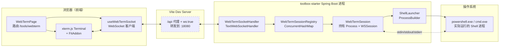
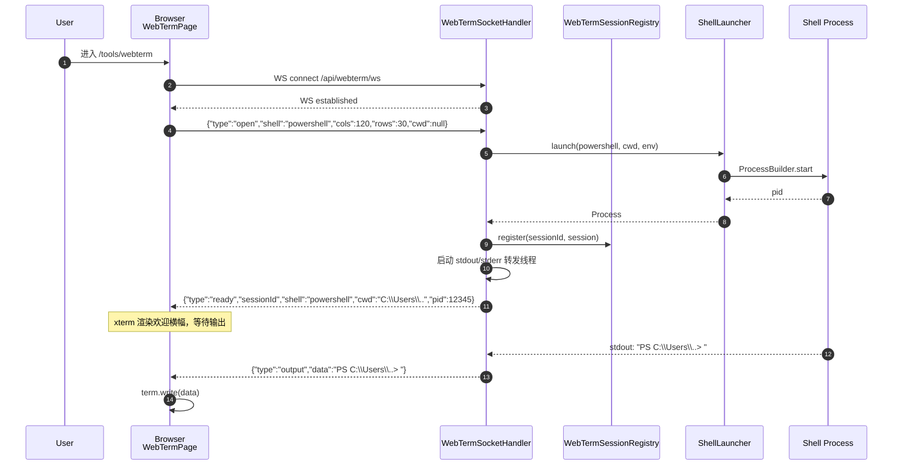
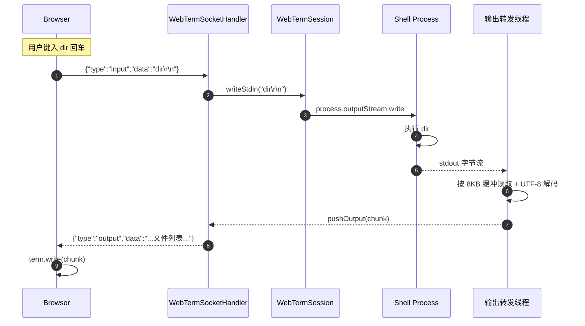
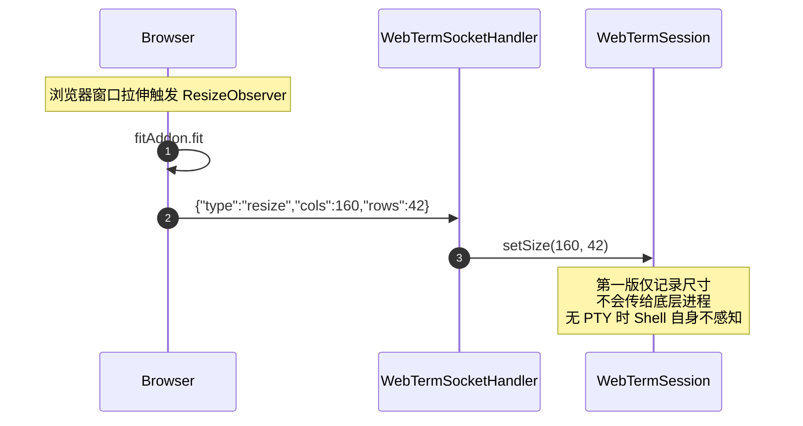
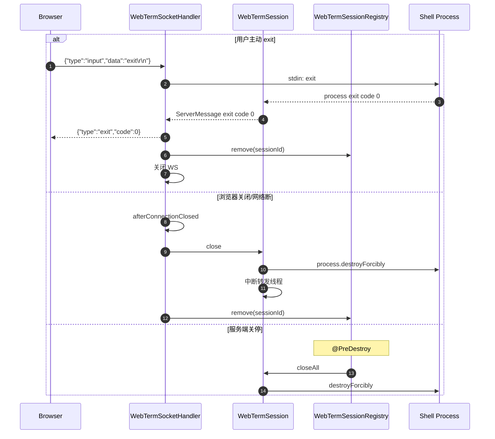

# Web 终端

> 最后更新：2026-05-13
> 模版：完整-技术（template-tech）

在浏览器中提供一个交互式 Shell 终端：用户在网页输入命令，后端通过 WebSocket 将命令喂给本地真实 Shell 进程（PowerShell / cmd），并把进程输出实时回传到浏览器渲染。定位为 kai-toolbox 单用户本机工具的「远程命令窗口」，不做多用户、不做权限隔离。

---

## 1. 目标与边界

### 1.1 做什么

- 在 kai-toolbox 前端新增一个 Web 终端页面（路由 `/tools/webterm`）
- 浏览器端使用 xterm.js 渲染终端 UI，键盘输入实时通过 WebSocket 转发到后端
- 后端用 `ProcessBuilder` 启动本机 Shell（默认 PowerShell；可切换到 cmd），把 stdin/stdout/stderr 与 WebSocket 双向桥接
- 支持终端尺寸（cols/rows）变化通知；支持手动结束会话；支持进程退出码上报
- 一个浏览器标签 = 一个独立 Session，关闭页面或断网即销毁后端进程

### 1.2 不做什么（第一版边界）

| 不做 | 原因 |
|------|------|
| 命令历史持久化、跨会话回放 | 浏览器端 xterm.js 自带本会话内的滚动缓冲已足够本地一人单机使用 |
| 鉴权 / 多用户 / 角色权限 | CLAUDE.md 明确「local single-user toolkit, no auth」；与项目定位一致 |
| 远程主机连接（SSH） | 该工具 = 本机 Shell；远程连接超出工具范围，由用户自行 `ssh` 命令进入 |
| 文件上传/下载嵌入 | 不在本期范围 |

> **变更：** 第一版原计划"不接 PTY"，实测后发现退格 / 方向键 / Tab 补全全失效，体验无法接受。已在第二轮修复中接入 `pty4j` + Windows ConPTY，PowerShell 的 PSReadLine 自动启用，本期已支持 vim/less/git log 分页等全屏 TUI 程序。

### 1.3 设计结论

- **通信协议**：WebSocket（双向、低延迟）。不复用项目既有 SSE，因为 SSE 单向无法把按键回传后端
- **桥接模型**：每个 WebSocket Session 一对一绑定一个 `PtyProcess`（pty4j + Windows ConPTY）；用 1 条虚拟线程从 PTY 的 `inputStream` 读字节通过 WebSocket 推回前端，stderr 已合流到 stdout；主 WebSocket 入站消息直接写入 PTY 的 `outputStream`
- **会话模型**：会话纯内存态、纯进程内；不持久化到 SQLite。WebSocket 关闭即结束会话，进程被强制销毁
- **Shell 选择**：Windows 默认 `powershell.exe -NoLogo`；提供 cmd 备选；不支持 bash（开发机环境差异大，第一版收敛）
- **PTY**：通过 pty4j 启动 PowerShell/cmd，PSReadLine 自动启用，行编辑（退格、方向键、Tab 补全、历史命令、Ctrl+C）由 Shell 自身负责，前端不做任何按键处理

---

## 2. 整体架构



**说明：**

- 前端通过浏览器原生 `WebSocket` 连接 `/api/webterm/ws`；Vite 已开启 `ws: true` 代理（`vite.config.ts` 现状），开发与生产路径完全一致
- 后端注册一个 WebSocket Endpoint，每条入站消息均为 JSON；上行 `input` 直接写进程 stdin
- 输出转发线程从进程 stdout/stderr 读字节后，按 UTF-8 解码并以 `output` 消息推回浏览器
- 进程在 WebSocket 关闭、会话超时或前端发送 `close` 时被强制销毁

---

## 3. 模块拆分与职责

本期新增一个独立 Maven 模块 `tools/tool-webterm`，按 kai-toolbox 既有"一个工具一个模块"约定。

### 3.1 tool-webterm（后端模块）

定位：把 WebSocket 消息流和本机 Shell 进程的标准 IO 双向桥接。

| 类（全路径） | 职责（≤3 条） | 上下游 | 关键设计点 |
|---|---|---|---|
| `com.exceptioncoder.toolbox.webterm.config.WebTermDescriptor` | 实现 `ToolDescriptor` 暴露工具元数据 | 被 `ToolRegistry` 收集 | id=`webterm`、icon=`terminal-square` |
| `com.exceptioncoder.toolbox.webterm.config.WebTermWebSocketConfig` | 通过 `@EnableWebSocket` 注册 WebSocket Endpoint `/api/webterm/ws` | 注入 `WebTermSocketHandler` | 显式设置 `setAllowedOrigins("*")`，开发模式下 Vite 代理跨源 |
| `com.exceptioncoder.toolbox.webterm.config.WebTermProperties` | 绑定 `toolbox.webterm.*` 配置（默认 shell、超时、缓冲大小） | 被 Launcher / Session 读取 | 提供合理默认值，无需用户配置 |
| `com.exceptioncoder.toolbox.webterm.handler.WebTermSocketHandler` | `TextWebSocketHandler` 子类；处理 open/input/resize/close 四类入站消息；维护 sessionId | 调 `ShellLauncher`、`WebTermSessionRegistry` | 入站走 `afterConnectionEstablished` / `handleTextMessage`；出站走 `Session#sendMessage` 加同步锁防并发写 |
| `com.exceptioncoder.toolbox.webterm.session.WebTermSession` | 持有一个 `PtyProcess` + 一个 `WebSocketSession` + 输出转发任务 | 被 Registry 持有；调 PtyProcess API | 输出转发用虚拟线程（仅 1 条，stderr 已合流）；写 stdin 加锁串行化；`setSize` 调 `PtyProcess.setWinSize` 真下发到底层；`close()` 幂等 |
| `com.exceptioncoder.toolbox.webterm.session.WebTermSessionRegistry` | sessionId → `WebTermSession` 的并发注册表；提供 create/get/remove/closeAll | 被 Handler 调用；`@PreDestroy` 清理 | 用 `ConcurrentHashMap`；上限 8 个会话防失控 |
| `com.exceptioncoder.toolbox.webterm.service.ShellLauncher` | 用 `pty4j.PtyProcessBuilder` + ConPTY 启动 PowerShell/cmd，设置 cwd / TERM=xterm-256color / 初始 cols×rows / `redirectErrorStream(true)` | 被 Session 调用 | Windows-only 第一版；非 Windows 抛 `IOException` 让前端给出明确提示；ConPTY 仅 Win10+ 可用 |
| `com.exceptioncoder.toolbox.webterm.api.dto.ClientMessage` | 入站消息 DTO（`type` + 字段） | Jackson 反序列化 | record + `@JsonSubTypes` 多态映射 |
| `com.exceptioncoder.toolbox.webterm.api.dto.ServerMessage` | 出站消息 DTO（ready/output/exit/error） | Jackson 序列化 | record；`output.data` 已 base64 处理还是原始字符串？→ 第一版直接 UTF-8 字符串 |

> 第二轮起接入 `pty4j` + Windows ConPTY，PowerShell 启动后自动启用 PSReadLine，行编辑和 Tab 补全完全由 Shell 自身负责。前端不做任何按键拦截或本地 echo。

### 3.2 frontend/src/features/webterm（前端模块）

定位：渲染终端、转发按键、处理重连和尺寸变化。

| 文件 | 职责 | 上下游 | 关键设计点 |
|---|---|---|---|
| `frontend/src/features/webterm/index.tsx` | 导出 `FeatureManifest`，注册到侧边栏 | 被 `featureRegistry` 自动收集 | icon=`TerminalSquare`（lucide-react 已含）、order=80 |
| `frontend/src/features/webterm/pages/WebTermPage.tsx` | 页面壳：标题、Shell 切换器、cwd 输入、重连按钮、容纳 Terminal | 调用 `Terminal` 组件 | 顶栏 24px 高，余下区域全部留给终端 |
| `frontend/src/features/webterm/components/Terminal.tsx` | 初始化 xterm.js + FitAddon；建立 WebSocket；订阅 onData / onResize | 调 `useWebTermSocket` | 通过 `useEffect` 在 mount 时初始化、unmount 时 dispose；ResizeObserver 触发 `fit()` |
| `frontend/src/features/webterm/components/AuxKeyBar.tsx` | 移动端辅助控制键：Esc、Tab、方向键、Enter、Ctrl 组合 | 调 `TerminalHandle.send` | 所有按键直接写入 PTY；触控目标不小于 44px；`pointerdown` 阻止抢焦点 |
| `frontend/src/features/webterm/components/MobileCommandInput.tsx` | 移动端命令工作台：快捷指令、历史、剪贴板、发送 | 调 `TerminalHandle.send` | 单行命令补 `\r` 后发送；历史仅存在 localStorage；不绕过 xterm 直接渲染输出 |
| `frontend/src/features/webterm/hooks/useWebTermSocket.ts` | 封装 WebSocket 生命周期 + JSON 消息编解码；暴露 `send(input)` / `resize(cols,rows)` / `state` | 被 Terminal 组件使用 | 失败重连只手动触发（不自动），避免页面失焦后无限重连 |
| `frontend/src/features/webterm/types.ts` | 与后端 DTO 对齐的 TS 类型 | 被 hook / 组件引用 | 与 `ClientMessage` / `ServerMessage` 字段一致 |

---

## 4. 关键交互

### 4.1 会话建立



### 4.2 输入与输出



### 4.3 终端尺寸变化



### 4.4 进程退出与会话关闭



---

## 5. 核心业务规则

| 序号 | 规则 | 说明 |
|------|------|------|
| R1 | **一 WebSocket = 一 Session = 一进程**，三者绑定不可拆分 | 浏览器关页/断网立即销毁底层进程，避免遗留僵尸 Shell |
| R2 | 同一进程内并发会话上限 8 | 防止误用 / 漏关导致系统进程数暴涨；命中上限时 `open` 直接回 `error`，前端展示提示 |
| R3 | `open` 消息只在会话生命周期内允许一次 | 第二次 `open` 视为协议错误，断开 WS |
| R4 | 入站消息体最大 64KB；超过即断开 | 防止误粘贴大段数据/文件内容把 stdin 撑爆 |
| R5 | 输出转发缓冲 8KB / 50ms 二选一触发推送 | 平衡延迟与 WebSocket 帧数 |
| R6 | Shell 类型仅允许 `powershell` / `cmd` 白名单 | 拒绝任意可执行路径作为入参，避免用户被 XSS 钓鱼后远程触发任意进程 |
| R7 | `cwd` 必须是已存在目录；非法时回退 `${user.home}` | 启动失败前置校验 |
| R8 | 进程退出码（任何来源）必须以 `exit` 消息上报后再关 WS | 前端可据此显示「会话已结束 (exit code 1)」并允许重新建立 |
| R9 | 不持久化任何会话内容到 SQLite | 单用户工具，命令记录留在浏览器会话内即可；避免敏感信息落盘 |
| R10 | 非 Windows 平台启动失败时直接回 `error` 消息 | 第一版只支持 Windows；macOS/Linux 上前端给出"暂不支持"提示，不进入连接流程 |
| R11 | 移动端命令操作区只发送输入字节，不直接写 xterm 输出 | 避免本地 echo、控制字符解析错位、软键盘焦点丢失；所有命令结果仍以后端 PTY 输出为准 |
| R12 | 移动端常用按键触控目标不小于 44px | Esc、Tab、Enter、方向键、Ctrl+C 等必须适合拇指点按，横向溢出用滚动承载 |

### 5.1 输入数据流约束

- 前端 `term.onData` 拿到的是终端按键事件（包括控制字符如 `\x03` Ctrl+C），**原样上送，不做本地 echo**
- PowerShell / cmd 自身会把按下的字符回写到 stdout，前端再 echo 一次会造成双倍显示，且会把 `\x7f` / `\x1b[D` 等控制字节直接喂给 xterm 解析，引发 Parsing error 与光标越界
- 后端不解析按键含义，原样写入 stdin；`Ctrl+C` 是否真能中断当前命令取决于 Shell 自身（无 PTY 情况下，PowerShell 的中断行为弱于本地终端，已在风险章节标注）

### 5.2 输出数据流约束

- 后端按字节读取 stdout/stderr，按 UTF-8 解码（默认 Charset 为 `Charset.forName("UTF-8")`）
- PowerShell 中文环境默认输出为 GBK 时会乱码 → 第一版在 `ShellLauncher` 启动 PowerShell 时附加 `-Command "[Console]::OutputEncoding=[System.Text.Encoding]::UTF8;"` 做兜底；cmd 同理用 `chcp 65001`
- 输出不区分 stdout 与 stderr，统一作为 `output.data`，与本地终端体验一致

---

## 6. 编码落点

```text
kai-toolbox/
├── pom.xml                                                        [修改] modules 增加 tool-webterm；dependencyManagement 增加坐标
├── toolbox-starter/
│   └── pom.xml                                                    [修改] dependencies 增加 tool-webterm
├── tools/
│   └── tool-webterm/                                              [新增] 后端工具模块
│       ├── pom.xml                                                [新增] 依赖 toolbox-common + spring-boot-starter-websocket
│       └── src/main/
│           ├── java/com/exceptioncoder/toolbox/webterm/
│           │   ├── config/
│           │   │   ├── WebTermDescriptor.java                     [新增] 工具元数据，id=webterm
│           │   │   ├── WebTermWebSocketConfig.java                [新增] @EnableWebSocket，注册 /api/webterm/ws
│           │   │   └── WebTermProperties.java                     [新增] toolbox.webterm.* 配置
│           │   ├── handler/
│           │   │   └── WebTermSocketHandler.java                  [新增] TextWebSocketHandler 子类，路由四类消息
│           │   ├── session/
│           │   │   ├── WebTermSession.java                        [新增] 持 Process + WSSession + 输出转发
│           │   │   └── WebTermSessionRegistry.java                [新增] sessionId 注册表 + @PreDestroy 清理
│           │   ├── service/
│           │   │   └── ShellLauncher.java                         [新增] ProcessBuilder 启动 PowerShell/cmd
│           │   └── api/dto/
│           │       ├── ClientMessage.java                         [新增] sealed interface + open/input/resize/close
│           │       └── ServerMessage.java                         [新增] sealed interface + ready/output/exit/error
│           └── resources/                                         [无 db schema：本工具不持久化]
└── frontend/
    ├── package.json                                               [修改] 加 @xterm/xterm + @xterm/addon-fit
    └── src/features/webterm/                                      [新增] 前端工具模块
        ├── index.tsx                                              [新增] FeatureManifest，路由 /tools/webterm
        ├── pages/
        │   └── WebTermPage.tsx                                    [新增] 页面壳：Shell 选择器 + 容器
        ├── components/
        │   └── Terminal.tsx                                       [新增] xterm.js 容器 + ResizeObserver + WS 桥接
        ├── hooks/
        │   └── useWebTermSocket.ts                                [新增] WebSocket 生命周期 + 编解码
        └── types.ts                                               [新增] 与后端 DTO 对齐
```

> 不修改 `toolbox-common`：WebSocket 仅本工具用，不抽公共基础设施（遵循 CLAUDE.md「No premature infrastructure」）。

---

## 7. 数据与依赖变更

### 7.1 数据库

无变更。本工具不持久化任何状态到 SQLite，不创建 schema 文件。

### 7.2 后端依赖

| 依赖 | 用途 | 引入位置 |
|------|------|---------|
| `org.springframework.boot:spring-boot-starter-websocket` | Spring 内置 WebSocket 支持（基于 Tomcat WebSocket） | `tools/tool-webterm/pom.xml` |
| `org.jetbrains.pty4j:pty4j:0.12.25` | Windows ConPTY 封装，把子进程跑在伪终端里 | `tools/tool-webterm/pom.xml`；版本由父 pom dependencyManagement 管控 |

> pty4j 通过 JetBrains 自家 Maven 仓库分发，已在父 pom 加 `repositories` 节指向 `https://cache-redirector.jetbrains.com/intellij-dependencies`。其打包内置 Windows native lib（约 2 MB），跨平台需要按 OS 选择对应原生组件，pty4j 自动处理。

### 7.3 前端依赖

| 包 | 版本（最新稳定） | 用途 |
|----|---------|------|
| `@xterm/xterm` | ^5.5.0 | 终端 UI 渲染 + 输入事件 |
| `@xterm/addon-fit` | ^0.10.0 | 自适应容器尺寸 |
| `@xterm/addon-webgl` | ^0.18.0 | WebGL 渲染器，TUI 程序帧率明显更好 + 文本更锐利；GPU 不支持时静默回退 DOM |

> 项目目前依赖列表中无 xterm 系列。命名空间 `@xterm/*` 是 v5 起的新命名（v4 是 `xterm` / `xterm-addon-fit`）。

### 7.4 配置

`toolbox-starter/src/main/resources/application.yml` 在 `toolbox:` 下新增：

```yaml
toolbox:
  webterm:
    enabled: true                  # 关闭后 /api/webterm/ws 直接拒绝连接
    default-shell: powershell      # powershell | cmd
    max-sessions: 8                # 同一进程内并发会话上限
    output-buffer-bytes: 8192      # 单次推送字节阈值
    output-flush-interval-ms: 50   # 推送时间阈值
    session-idle-timeout-ms: 0     # 0 = 不超时；按需调
```

### 7.5 跨进程依赖

- 启动时依赖系统 PATH 上存在 `powershell.exe` / `cmd.exe`（Windows 自带）
- 不依赖 ffmpeg / yt-dlp 等第三方二进制

---

## 8. 风险与待确认

| 序号 | 风险 / 待确认 | 影响 | 处置 |
|------|------|------|------|
| RK1 | ~~无 PTY → 全屏程序渲染异常 / 行编辑失效~~ — **早期判断错误，已纠正** | 用户实测后退格 / 方向键 / Tab 补全全部失效，无法接受 | **已修复**：第二轮引入 `pty4j` + Windows ConPTY，PowerShell 启动到伪终端中，PSReadLine 自动启用；vim/less/git log 分页等 TUI 程序也能正常渲染；详见 `bug/Web终端/输入字符重复与方向键越过提示符/` 第二轮修复方案 |
| RK2 | ~~PowerShell 无 PTY 时 Shell 不主动回显~~ — **实测证伪 + 已被 PTY 接入覆盖** | — | **已修复**：删掉前端 `term.write(data)` 本地 echo；接入 PTY 后 PowerShell 自身负责回显 |
| RK3 | ~~Ctrl+C 中断行为弱~~ | — | **已修复**：PTY 模式下 `\x03` 真正作为 SIGINT 投递到 PowerShell；用户敲 Ctrl+C 即可中断当前命令；保留前端"重新连接"按钮作为兜底 |
| RK4 | **会话泄漏**：浏览器异常关闭时 WebSocket close 事件可能延迟到达，僵尸进程可能短暂存在 | 进程数轻微浪费 | 加 `session-idle-timeout-ms` 配置 + `@PreDestroy` 清理；并发上限 R2 兜底 |
| RK5 | **跨平台**：第一版只测过 Windows | macOS/Linux 上无法使用 | `ShellLauncher` 在非 Windows 时显式抛错；前端 `WebTermPage` 接到 `error` 消息友好提示；后续如有需求扩展 bash |
| RK6 | **WebSocket 帧大小限制**：Tomcat 默认 64KB；超长 stdout 单次推送会被拆 | 偶发拆帧，前端逐片渲染即可 | xterm.js 原生支持流式 `term.write`；后端按缓冲分片发送（已落地于 R5） |
| RK7 | **Vite 代理 ws:true 已存在**：`vite.config.ts` 已开启，`/api/webterm/ws` 会被自动代理 | 无 | 无需改 Vite 配置；生产环境 jar 内嵌 static，前端直连同源 :18080 |
| RK8 | **CLAUDE.md 中提到端口 8080，实际 application.yml 是 18080** | 文档与代码不一致，但与本期无关 | 不在本期修复；本设计直接以 18080 为准 |

---

## 9. 后续可选演进（非本期）

- ~~升级到 `pty4j` 提供真 PTY~~（已在第二轮落地）
- 命令历史持久化到 SQLite，跨会话上下方向键回放（PSReadLine 已自带本会话内历史）
- 多 Tab 终端（同一页面多个会话并排）
- 会话恢复：刷新页面重连同一进程（需要会话 token + 重连协议）
- 远程主机 SSH 终端（复用 jsch，与 lan-share 共享）
- macOS / Linux 支持：pty4j 已含跨平台 native lib，主要工作量在 ShellLauncher 选 bash/zsh 路径
