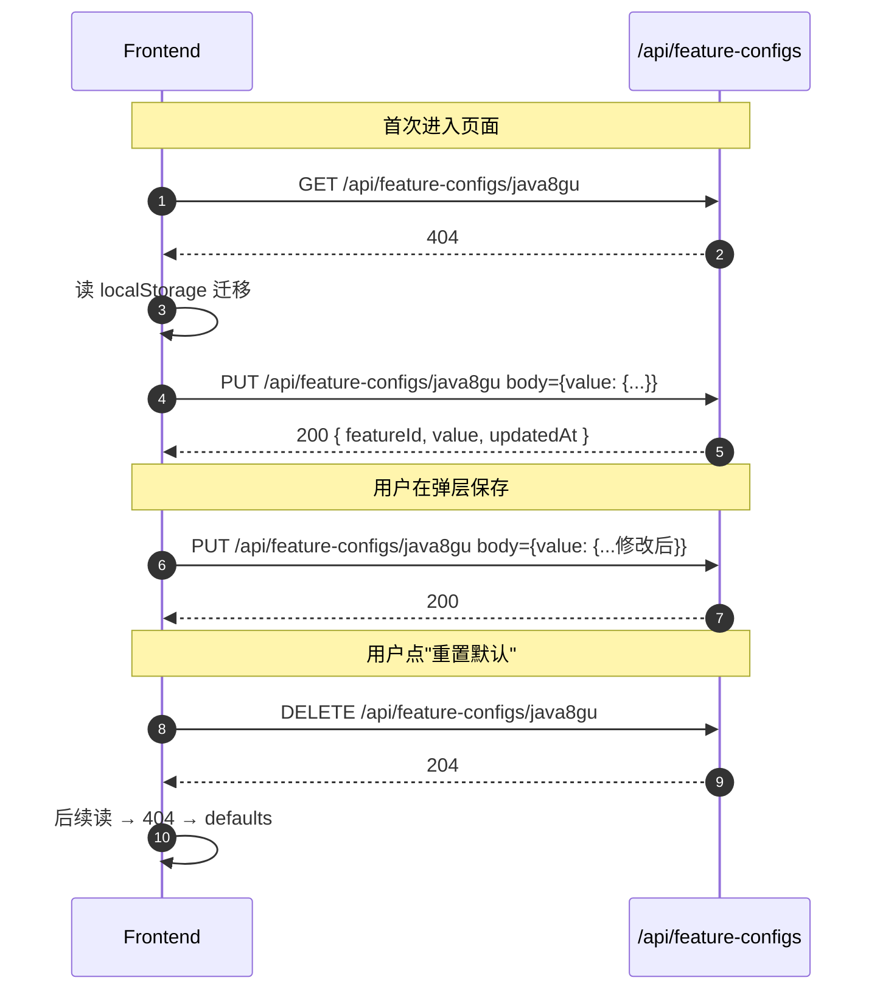

# feature-config API 契约

> 配套：`feature-config-通用配置存储-current.md` | 最后更新：2026-05-25

基础路径：`/api/feature-configs`

通用错误响应（沿用 `GlobalExceptionHandler` 既有结构）：

```json
{ "message": "<人类可读错误说明>" }
```

---

## 1. 获取配置

`GET /api/feature-configs/{featureId}`

### Path 参数

| 字段 | 类型 | 必填 | 说明 |
|---|---|---|---|
| `featureId` | string | 是 | 前端 `FeatureManifest.id`，kebab-case；正则 `^[a-z][a-z0-9-]{0,63}$` |

### 响应

| HTTP | 含义 | Body |
|---|---|---|
| 200 | 命中 | `FeatureConfigView` |
| 400 | featureId 非法 | `{ message }` |
| 404 | 该 featureId 从未保存过配置 | `{ message: "feature config not found: {featureId}" }` |

#### `FeatureConfigView`

```json
{
  "featureId": "java8gu",
  "value": { "owner": "exception-coder", "repo": "JobInterviewLog", "branch": "main", "dir": "java8gu-速记版", "token": "" },
  "updatedAt": 1748102400000
}
```

| 字段 | 类型 | 说明 |
|---|---|---|
| `featureId` | string | 与 path 一致 |
| `value` | any (JSON object/array/primitive) | 调用方自定义结构；后端不校验内部 schema |
| `updatedAt` | long | epoch millis |

---

## 2. 保存配置（upsert）

`PUT /api/feature-configs/{featureId}`

### Path 参数

同 §1。

### 请求 Body

```json
{ "value": { "owner": "...", "repo": "...", "branch": "main", "dir": "...", "token": "" } }
```

| 字段 | 类型 | 必填 | 说明 |
|---|---|---|---|
| `value` | any | **是**（不能为 null） | 任意 JSON 内容；后端整体序列化为字符串存储 |

### 响应

| HTTP | 含义 | Body |
|---|---|---|
| 200 | upsert 成功 | `FeatureConfigView`（含服务端写入的 `updatedAt`） |
| 400 | featureId 非法 / value 为 null / Body 非合法 JSON | `{ message }` |

幂等性：同 featureId 多次 PUT 同 value → 行为等价（只更新 `updated_at`）。

---

## 3. 删除配置

`DELETE /api/feature-configs/{featureId}`

### Path 参数

同 §1。

### 响应

| HTTP | 含义 | Body |
|---|---|---|
| 204 | 删除成功，或目标本就不存在（幂等） | 无 |
| 400 | featureId 非法 | `{ message }` |

---

## 4. 示例时序（前端集成视角）


