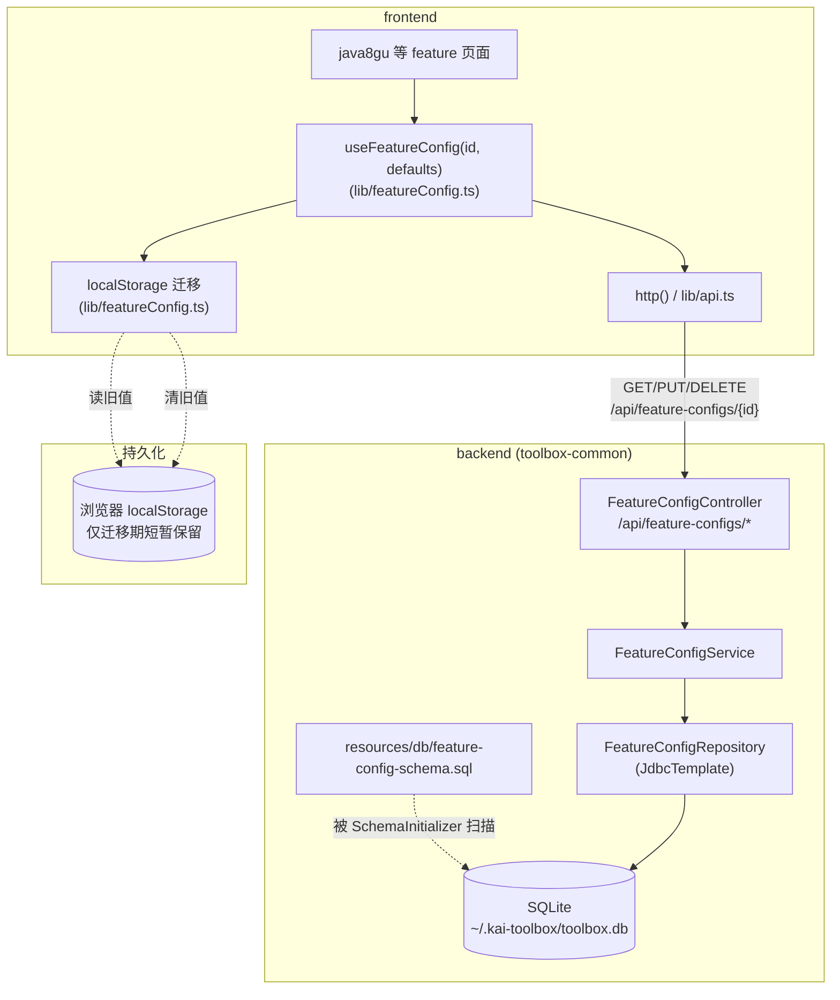
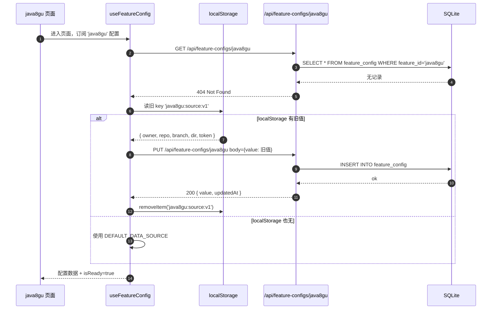
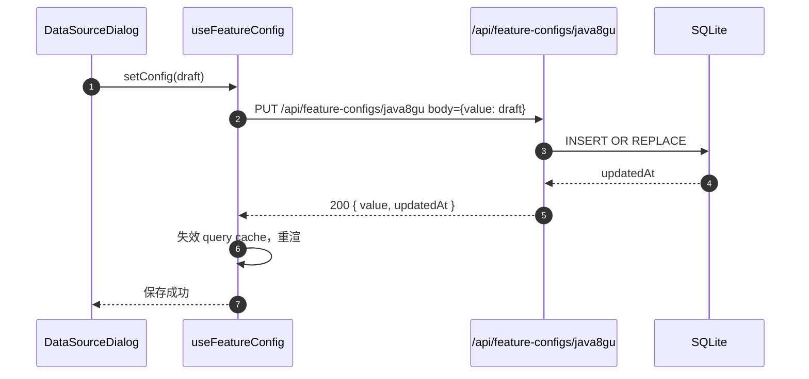
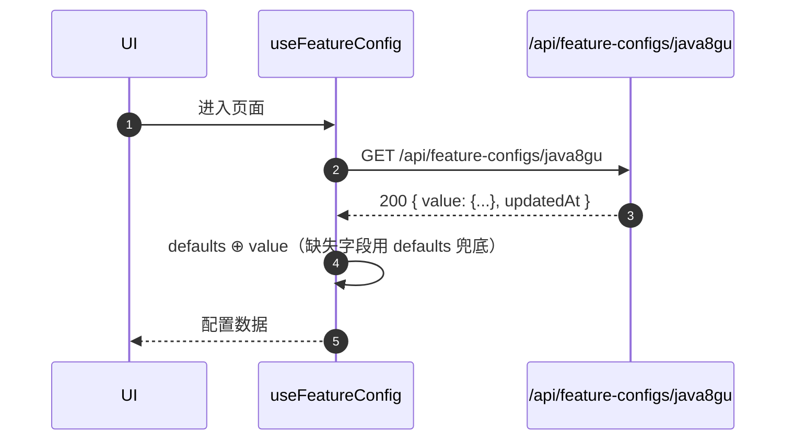

# feature-config 通用配置存储

> 模版：完整-技术 | 状态：设计中 | 最后更新：2026-05-25

## 1. 目标与边界

### 1.1 真实目标

为 kai-toolbox 各前端工具提供**一处集中、跨设备一致的配置持久化能力**，替代原本散落在浏览器 `localStorage` 的工具级配置（数据源、凭证、偏好等）。

首期触发场景：`java8gu` 的 GitHub 数据源配置（`owner / repo / branch / dir / token`）从 `localStorage` 迁到 SQLite。

预期复用方：后续任何带"工具级配置/数据源/凭证/偏好"的 feature，例如 `frp-config`、`hosts`、`mail`、`secretary` 等的工具自身偏好，都可直接复用本基础设施，无需再写各自的表 + Controller + Service。

### 1.2 范围

**纳入：**
- 后端：在 `toolbox-common` 增加一张共享表 `feature_config`、配套 Repository / Service / Controller
- 前端：在 `frontend/src/lib` 提供 `featureConfig.ts` client（含 TanStack Query hook）+ localStorage 一次性迁移工具
- java8gu 改造：`getDataSource / setDataSource` 由同步 localStorage 改为异步走 API；首次加载若库内无配置而 localStorage 有旧值，自动迁移上库后清掉本地副本

**不纳入：**
- 配置加密（CLAUDE.md 明确「No auth, no multi-tenancy」，单用户本地 SQLite，不外联，用户已确认 token 等敏感字段**不**加密）
- 多用户/多 profile 切换（单用户工具箱，每个 featureId 一行即可）
- 配置 schema 校验（每个 feature 自己定义 TypeScript 类型 + defaults 兜底，后端只存不透明 JSON）
- 配置历史 / 审计 / 版本回滚（不需要，本地工具）
- 跨工具配置共享（每个 featureId 互相隔离；如需跨工具共享主机/凭证仍走 `tool-hosts` 既有 CRUD 通道）

### 1.3 设计结论

| 维度 | 决策 | 原因 |
|---|---|---|
| 存储位置 | `toolbox-common`（一张表 `feature_config`） | 横切能力，不属任何具体 tool；与已有 SqliteConfig/SchemaInitializer 共用 |
| 数据模型 | `feature_config(feature_id PK, value_json TEXT, updated_at INT)` 单行 KV | 工具级配置量小、字段不固定，比每工具一张表轻得多；不需要 JSON 查询 |
| 后端契约 | REST：`GET / PUT / DELETE /api/feature-configs/{featureId}` | 与 `/api/hosts` 等现有约定对齐 |
| 前端契约 | 泛型 hook `useFeatureConfig<T>(featureId, defaults)`，TanStack Query 缓存 | 各 feature 自定义 schema，调用方零样板 |
| 加密 | 不加密 | 用户明确接受；本地单用户 SQLite |
| 迁移 | 前端首次读：库无 + localStorage 有 → PUT 上库 + 清 localStorage | 平滑迁移，无数据丢失风险 |

## 2. 整体架构



### 2.1 与现有架构的契合点

- `toolbox-common` 已经持有 `SqliteConfig` + `SchemaInitializer`，会自动扫描 `classpath*:db/*-schema.sql`，新表零额外注册
- `SchemaInitializer` 要求 `CREATE TABLE IF NOT EXISTS` 幂等（CLAUDE.md §48）→ 本次遵守
- 前端 `lib/api.ts` 已封装 `http()` + mock 路由，本次 client 直接复用
- `/api/feature-configs` 与现有 `/api/hosts`、`/api/tools` 同级，路径风格一致

## 3. 模块拆分与职责

### 3.1 后端

#### 3.1.1 `toolbox-common/featureconfig/` 子包

| 类 / 文件 | 一句话职责 |
|---|---|
| `domain/FeatureConfig.java` | 领域对象：`featureId`、`value`（JSON 字符串）、`updatedAt` |
| `repository/FeatureConfigRepository.java` | JdbcTemplate CRUD：`findById / upsert / deleteById` |
| `service/FeatureConfigService.java` | 业务编排：`get / save / delete`，封装时间戳更新、空值处理 |
| `api/FeatureConfigController.java` | REST 端点 `GET / PUT / DELETE /api/feature-configs/{featureId}` |
| `api/dto/FeatureConfigView.java` | 出参：`{ featureId, value, updatedAt }` |
| `api/dto/FeatureConfigSaveRequest.java` | 入参：`{ value: any }`（注意：value 是任意 JSON，不是字符串） |
| `resources/db/feature-config-schema.sql` | 建表 SQL |

### 3.2 前端

| 文件 | 一句话职责 |
|---|---|
| `frontend/src/lib/featureConfig.ts` | 通用 client：`getFeatureConfig<T>(id, defaults)` / `setFeatureConfig<T>(id, value)` / `deleteFeatureConfig(id)` / `useFeatureConfig<T>(id, defaults)`（TanStack Query hook，含 localStorage 迁移） |
| `frontend/src/features/java8gu/data.ts` | 改造：`getDataSource / setDataSource` 由同步 localStorage 改为基于 `featureConfig` 的异步实现；保留 `DEFAULT_DATA_SOURCE` 作为兜底 defaults |
| `frontend/src/features/java8gu/components/DataSourceDialog.tsx` | 适配异步保存：`handleSave` 改 async |
| `frontend/src/features/java8gu/pages/Java8guHubPage.tsx`（及相关页面） | 在首次进入页面时通过 hook 拉取配置；loading/error 状态兜底 |

## 4. 关键交互

### 4.1 首次加载（迁移路径）



### 4.2 保存配置



### 4.3 命中库内已有配置



## 5. 核心业务规则

### 5.1 表设计

```sql
CREATE TABLE IF NOT EXISTS feature_config (
    feature_id  TEXT PRIMARY KEY,
    value_json  TEXT NOT NULL,
    updated_at  INTEGER NOT NULL
);
```

| 字段 | 类型 | 规则 |
|---|---|---|
| `feature_id` | TEXT PK | 与前端 `FeatureManifest.id` 一致（kebab-case，如 `java8gu`、`frp-config`） |
| `value_json` | TEXT NOT NULL | 任意 JSON 字符串；后端不校验内部 schema，只校验是合法 JSON |
| `updated_at` | INTEGER NOT NULL | epoch millis；写入时由后端填充，不接受前端传入 |

不加索引（PK 已是唯一索引；表预计长期 < 50 行）。

### 5.2 REST 契约

| 方法 | 路径 | 行为 |
|---|---|---|
| `GET` | `/api/feature-configs/{featureId}` | 200 返回 `FeatureConfigView`；不存在 → **404**（不是空对象，让前端区分"从未配置"与"配置过但是空 JSON 对象 {}"） |
| `PUT` | `/api/feature-configs/{featureId}` | 200 upsert，body `{ value: <任意 JSON> }`；返回 `FeatureConfigView`；value 必须是 JSON object/array/primitive，**禁止 null** |
| `DELETE` | `/api/feature-configs/{featureId}` | 204；幂等（不存在也返回 204） |

### 5.3 前端 hook 契约

```ts
function useFeatureConfig<T>(
  featureId: string,
  defaults: T,
): {
  config: T              // 已经与 defaults 合并的最终值（永远不为 undefined）
  isReady: boolean       // 首次拉取/迁移完成才为 true
  isLoading: boolean
  error: Error | null
  setConfig: (next: T) => Promise<void>
  resetConfig: () => Promise<void>  // DELETE → 后续 config 回落到 defaults
}
```

合并策略：**浅合并**（`{ ...defaults, ...remoteValue }`）。深合并/数组合并由调用方自行处理，避免奇怪兜底。

### 5.4 localStorage 迁移规则

仅 java8gu 首批切换时启用，由 `featureConfig.ts` 提供通用迁移机制：
- 调用方可选传入 `legacyLocalStorageKey?: string` 参数
- 流程：库内 404 → 读 localStorage → 有值则 PUT + 清 localStorage → 无值则 defaults
- 迁移失败（PUT 报错）：不清 localStorage，直接落回 defaults 并 toast 提示（不阻塞页面）

## 6. 编码落点

```text
toolbox-common/
└── src/main/
    ├── java/com/exceptioncoder/toolbox/common/featureconfig/
    │   ├── api/
    │   │   ├── FeatureConfigController.java
    │   │   └── dto/
    │   │       ├── FeatureConfigView.java
    │   │       └── FeatureConfigSaveRequest.java
    │   ├── domain/
    │   │   └── FeatureConfig.java
    │   ├── repository/
    │   │   └── FeatureConfigRepository.java
    │   └── service/
    │       └── FeatureConfigService.java
    └── resources/
        └── db/
            └── feature-config-schema.sql

frontend/src/
├── lib/
│   └── featureConfig.ts                  ← 新增
└── features/java8gu/
    ├── data.ts                           ← getDataSource/setDataSource 改 async
    ├── components/DataSourceDialog.tsx   ← handleSave 改 async
    └── pages/
        ├── Java8guHubPage.tsx            ← 用 hook 读配置
        ├── Java8guCategoryPage.tsx       ← 同上（如有用到 cfg）
        └── Java8guQuestionPage.tsx       ← 同上
```

## 7. 数据与依赖变更

### 7.1 数据库

- 新增表 `feature_config`（详见 §5.1），无字段变更、无现有表影响
- SchemaInitializer 自动扫描，启动时幂等创建

### 7.2 后端依赖

- 无新增 Maven 依赖；JdbcTemplate / Jackson 已在 `toolbox-common` 内可用
- JSON 解析复用 Spring Boot 自带 Jackson `ObjectMapper`（Controller 直接接 `JsonNode` 或 `Object` 类型最简）

### 7.3 前端依赖

- 无新增 npm 依赖；TanStack Query 已在 frontend 内可用（CLAUDE.md §7）
- 删除：java8gu 内 `setDataSource` 同步写法的所有调用点（改 async）

## 8. 风险与待确认

| 风险 / 待确认 | 评估 | 缓解 |
|---|---|---|
| 后端崩溃/不通时，前端是否还能用 java8gu | 中 | 进入页面 hook 加载失败 → 回落 defaults + toast "配置加载失败，使用默认数据源"，仍可读题；保存按钮在 hook 未 ready 时 disabled |
| 多个 tab 同时改同一 featureId | 低 | 单用户场景；后写覆盖先写即可，不引入乐观锁 |
| localStorage 旧值是脏数据 | 低 | 迁移前 `try { JSON.parse }`，失败直接走 defaults，不上库 |
| value_json 体积过大 | 低 | 工具配置预计 < 4KB / feature；如某 feature 想塞大数据应当走自己的表，不复用本基础设施 |
| 后端 PUT 不校验 value 内部结构 → 前端写错数据后整个 feature 打不开 | 中 | 前端 hook 做 `defaults ⊕ remote`，缺失字段兜底；UI 提供「重置默认」按钮（java8gu 弹层已有） |
| `feature_config` 是否要带 `created_at` | 低 | 不需要；该表是 KV，单用户不关心创建时间；如需 audit 后续再加 |
| value=null 是否合法 | 低 | 不合法。null 等价于"未配置"，应用 DELETE。Controller 用 `@Valid` + `@NotNull` 拦截 |

## 9. 验证要点

- 启动一次后 `toolbox.db` 中 `feature_config` 表已建好（IDE DB browser 验证）
- 接口手测：`curl -X PUT http://localhost:8080/api/feature-configs/_smoke -d '{"value":{"a":1}}' -H "Content-Type: application/json"` → 200；`GET` 拿回相同 value
- java8gu 首次进入：localStorage 有 `java8gu:source:v1` → 重新打开 devtools 看到 localStorage 该 key 被清，DB 内出现 java8gu 行
- 修改弹层保存后，**换浏览器打开 :8080** 仍能看到刚才改的 owner/repo
- 后端 down 时进入 java8gu：toast 提示后回落 DEFAULT，仍能展示题库

## 10. 决策日志

- 选 toolbox-common 不选 tool-feature-config 独立模块：避免为一张表新建 Maven 模块，与 SqliteConfig/SseEmitterRegistry 这类横切能力放一起最自然
- 选单表单行 KV 不选每工具一表：工具配置字段不固定且量少，KV 是最低成本；如某工具日后需要多行/可查询/可索引，应当自己开表（如 `tool-hosts`），而非扩展本基础设施
- 选 404 不选返回 `{value: null}`：让 hook 能准确触发 localStorage 迁移逻辑，否则首次拉到 null 还要再分支判断
- 选浅合并不选深合并：深合并对嵌套数组语义模糊（替换 vs 拼接？），强制调用方明确即可
