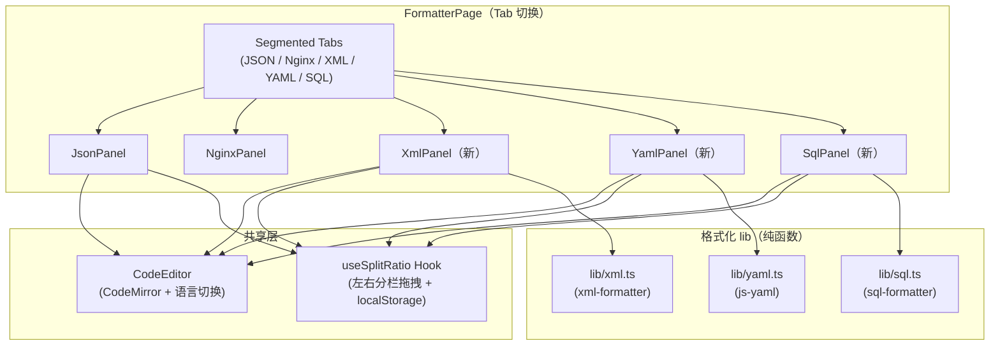
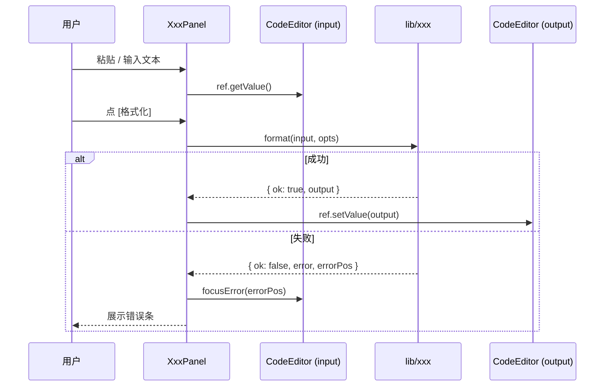
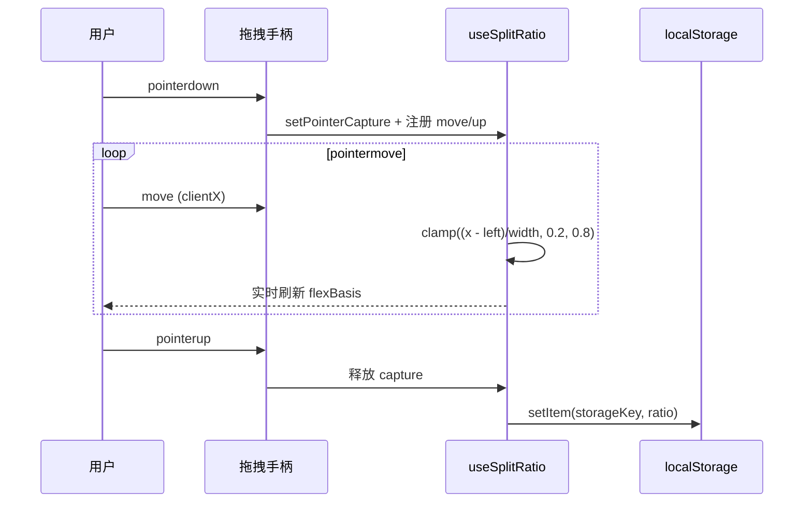

# formatter 多格式扩展 · 技术方案

> 最后更新：2026-05-22
> 模版：完整-技术
> 状态：设计中 → 落地中

## 1. 目标与边界

### 1.1 目标

frontend 「格式化工具」模块当前只支持 JSON / Nginx 两个 Tab。本次扩展 **XML、YAML、SQL** 三个开发高频数据格式，统一以「输入 → 输出」双栏 + 可拖拽分隔条的方式呈现。

### 1.2 范围

| 格式 | 能力 |
|------|------|
| XML  | 美化（按缩进展开） / 压缩（单行） / 转义 / 反转义 / 错误位置高亮 |
| YAML | 美化（统一缩进 + 块样式） / 压缩（flow 样式） / YAML ↔ JSON 互转 / 错误位置高亮 |
| SQL  | 美化（多方言：standard / mysql / postgresql / sqlite / mssql） / 压缩 / 关键字大小写（upper / lower / preserve） |

### 1.3 不做

- 不做 XML / YAML 的图形树视图（v1 文本侧足够；如有需求 v2 再做）。
- 不引入跨 Tab 的统一搜索 / 高亮搜索（仅 JSON Tab 保留现有搜索）。
- 不引入服务端格式化（保持「纯前端运算，不上送服务端」）。
- 不做 SQL AST 操作（仅文本格式化）。

## 2. 整体架构



设计要点：

- `CodeEditor` 是原 `JsonEditor` 的泛化产物：增加 `language` prop，按 `json / xml / yaml / sql` 切换 CodeMirror 的语言扩展。
- `useSplitRatio` 抽取自当前 JsonPanel 已实现的左右拖拽逻辑，复用到 XML / YAML / SQL 三个面板。
- 每个新格式独占一个 `lib/<name>.ts`，对外只暴露 `format / minify / 错误结构`，避免把第三方库类型外泄给 Panel。

## 3. 模块拆分与职责

### 3.1 frontend/src/features/formatter/components/CodeEditor.tsx

由 `JsonEditor.tsx` 重命名 + 泛化。

- 新增 `language?: 'json' | 'xml' | 'yaml' | 'sql'` prop，默认 `'json'`。
- 内部 switch 按 language 选 `@codemirror/lang-{json,xml,yaml,sql}` 的语言扩展。
- 其余行为（`focusError` / `focusAt` / `onBytesChange` 200ms debounce）保持不变。
- 重命名导出：`JsonEditor` → `CodeEditor`，`JsonEditorRef` → `CodeEditorRef`。

### 3.2 frontend/src/features/formatter/lib/useSplitRatio.ts（新）

抽取自 `JsonPanel.tsx`，提供：

```ts
function useSplitRatio(storageKey: string, initial = 0.5, range = [0.2, 0.8])
  → { ratio, containerRef, onSplitterPointerDown, reset }
```

- `containerRef` 绑到外层 flex 容器；`onSplitterPointerDown` 绑到拖拽手柄。
- 内部 `pointer capture`，保持快速拖动不丢；范围 [0.2, 0.8] 防塌缩。
- 拖动结果按 `storageKey` 写到 localStorage，下次加载恢复。
- `reset` 用于双击手柄复位 50%。

### 3.3 frontend/src/features/formatter/components/SplitPane.tsx（新）

封装"输入栏 + 拖拽手柄 + 输出栏"的展示型组件，避免在 3 个新 Panel 中重复 50 行 JSX。

```tsx
<SplitPane ratio={ratio} onSplitterPointerDown={...} containerRef={...}
           left={<左侧 JSX>} right={<右侧 JSX>} />
```

仅在 `lg` 及以上横向；窄屏走 `flex-col` 上下堆叠，手柄 `hidden`。

> JsonPanel 由于挂载了树视图 / 搜索栏等额外结构，**不强制** 接入 SplitPane，保留原来内联结构，仅复用 `useSplitRatio` Hook。

### 3.4 frontend/src/features/formatter/lib/xml.ts（新）

```ts
export type XmlFormatOptions = { indent: number | '\t' }
export function xmlFormat(input: string, opts: XmlFormatOptions): { ok: true; output: string } | { ok: false; error: string; errorPos?: number }
export function xmlMinify(input: string): { ok: true; output: string } | { ok: false; error: string; errorPos?: number }
export function xmlEscape(input: string): string
export function xmlUnescape(input: string): string
```

实现：调用 `xml-formatter` 包；错误捕获后规整为统一返回结构；`errorPos` 暂时基于 line/column 字符串前缀计算（lib 给的是 line 信息）。

### 3.5 frontend/src/features/formatter/lib/yaml.ts（新）

```ts
export function yamlFormat(input, opts: { indent: number }) → Result<string>
export function yamlMinify(input) → Result<string>   // 输出 flow 样式
export function yamlToJson(input, opts: { indent }) → Result<string>
export function jsonToYaml(input, opts: { indent }) → Result<string>
```

实现：用 `js-yaml` 的 `load` + `dump`；YAMLException 携带 `mark.position`，直接作为 `errorPos`。

### 3.6 frontend/src/features/formatter/lib/sql.ts（新）

```ts
export type SqlDialect = 'sql' | 'mysql' | 'postgresql' | 'sqlite' | 'tsql'
export type SqlKeywordCase = 'upper' | 'lower' | 'preserve'
export function sqlFormat(input, opts: { indent: number | '\t'; dialect: SqlDialect; keywordCase: SqlKeywordCase }) → Result<string>
export function sqlMinify(input) → Result<string>   // 折回单行，仅压缩空白
```

实现：调用 `sql-formatter@^15` 的 `format(query, { language, tabWidth, useTabs, keywordCase })`。Minify 是格式化器没有的，我们手撸：把多空白塌缩成单空格 + 去注释，必要时保留字符串字面量。

### 3.7 frontend/src/features/formatter/components/{XmlPanel,YamlPanel,SqlPanel}.tsx（新）

3 个新 Panel 结构同构（仿 JsonPanel 的"顶部控制条 + SplitPane"），每个内部：

1. 顶部控制条：缩进 Segmented + 主要按钮（Format / Minify / 各自附加：Escape / Unescape / 互转 / 方言 / 关键字大小写）
2. SplitPane 左右两个 CodeEditor，左侧可编辑 ＋ 右侧只读。
3. 输出 toolbar：复制 / 下载。
4. 错误条：解析失败时显示，并把光标跳到 `errorPos`。

### 3.8 frontend/src/features/formatter/pages/FormatterPage.tsx

把 Tab 选项从 2 个扩展为 5 个（JSON / Nginx / XML / YAML / SQL），按当前 Tab 渲染对应 Panel。

## 4. 关键交互

### 4.1 单个 Panel 内的格式化时序



### 4.2 左右分栏拖拽



双击手柄触发 `reset()` 把 ratio 复位到 0.5。

## 5. 核心业务规则

1. **错误不抛到上层**：所有 lib 函数都返回 `{ ok: boolean, ... }`，Panel 内统一处理错误条 + 光标定位。
2. **大文本保护**：≥1 MB 时 CodeEditor `highlight={false}`（沿用 JsonPanel 的 HIGHLIGHT_MAX_BYTES）；复制 / 下载阈值同 JSON。
3. **XML 转义/反转义**：仅替换 5 个保留实体 `&amp; &lt; &gt; &quot; &apos;`，不处理数值实体（&#nn;）。
4. **YAML 互转**：JSON → YAML 用 `yaml.dump(JSON.parse(input))`；YAML → JSON 用 `JSON.stringify(yaml.load(input), null, indent)`。两种方向都让 lib 处理 anchors / refs，不自己造解析器。
5. **SQL 关键字大小写默认 `upper`**：行业惯例；`preserve` 表示保留原样。
6. **localStorage Key 命名**：`formatter.<format>.splitRatio` (json/xml/yaml/sql 各一个 key)，分栏宽度互不干扰。

## 6. 编码落点

```
kai-toolbox/frontend/
└── src/features/formatter/
    ├── components/
    │   ├── CodeEditor.tsx              ← 由 JsonEditor.tsx 重命名 + 加 language prop
    │   ├── SplitPane.tsx               ← 新（左右分栏 + 拖拽手柄展示组件）
    │   ├── JsonPanel.tsx               ← 修改：换用 CodeEditor + useSplitRatio
    │   ├── NginxPanel.tsx              ← 不变
    │   ├── XmlPanel.tsx                ← 新
    │   ├── YamlPanel.tsx               ← 新
    │   └── SqlPanel.tsx                ← 新
    ├── lib/
    │   ├── useSplitRatio.ts            ← 新（共享拖拽逻辑 + localStorage）
    │   ├── xml.ts                      ← 新
    │   ├── yaml.ts                     ← 新
    │   ├── sql.ts                      ← 新
    │   └── (原 json-worker / jsonToFlow 等不变)
    └── pages/
        └── FormatterPage.tsx           ← 修改：Tab 从 2 扩到 5
```

## 7. 数据 / 依赖变更

### 7.1 新增依赖

| 包 | 版本 | 用途 | gzipped |
|----|------|------|---------|
| xml-formatter | ^3.6.6 | XML 美化 / 压缩 | ~6 KB |
| js-yaml | ^4.1.0 | YAML parse / dump | ~30 KB |
| sql-formatter | ^15.6.1 | SQL 美化（多方言） | ~80 KB |
| @codemirror/lang-yaml | ^6.1.2 | YAML 语法高亮 | ~10 KB |
| @codemirror/lang-sql | ^6.10.0 | SQL 语法高亮 | ~25 KB |
| @types/js-yaml | ^4.0.9 (dev) | TS 类型 | - |

bundle 累计 ~150 KB gzipped，落入 formatter feature chunk。

### 7.2 不涉及

- 后端无改动；不动 Maven module / 后端 schema。
- 不动路由（`featureRegistry` 自动收集）。

## 8. 风险与待确认

| 风险 | 缓解 |
|------|------|
| sql-formatter v15 的 API 与早期版本不兼容（`tabWidth` / `useTabs` 参数名） | 在 `lib/sql.ts` 用受限的 `SqlFormatOptions` 出口，未来升级时只需改 lib 一处 |
| xml-formatter 对无 root 元素 / 残缺 XML 抛字符串 error，无 line 信息 | 错误条直接显示原始 message；不强行算 errorPos |
| 大 YAML 文件（>1 MB）js-yaml parse 阻塞主线程 | v1 不接 worker；UI 上保留 highlight=false 阈值；若用户反馈再走 worker 化（与 JSON 类似） |
| 互转后字段顺序 / 注释丢失 | 在 YAML Tab 的提示文案明确告知"互转会丢失注释 + 锚点结构" |

> v1 落地后若被高频使用，再考虑：1）大文件 worker 化；2）XML / YAML 树视图；3）SQL 语法报错位置定位。

