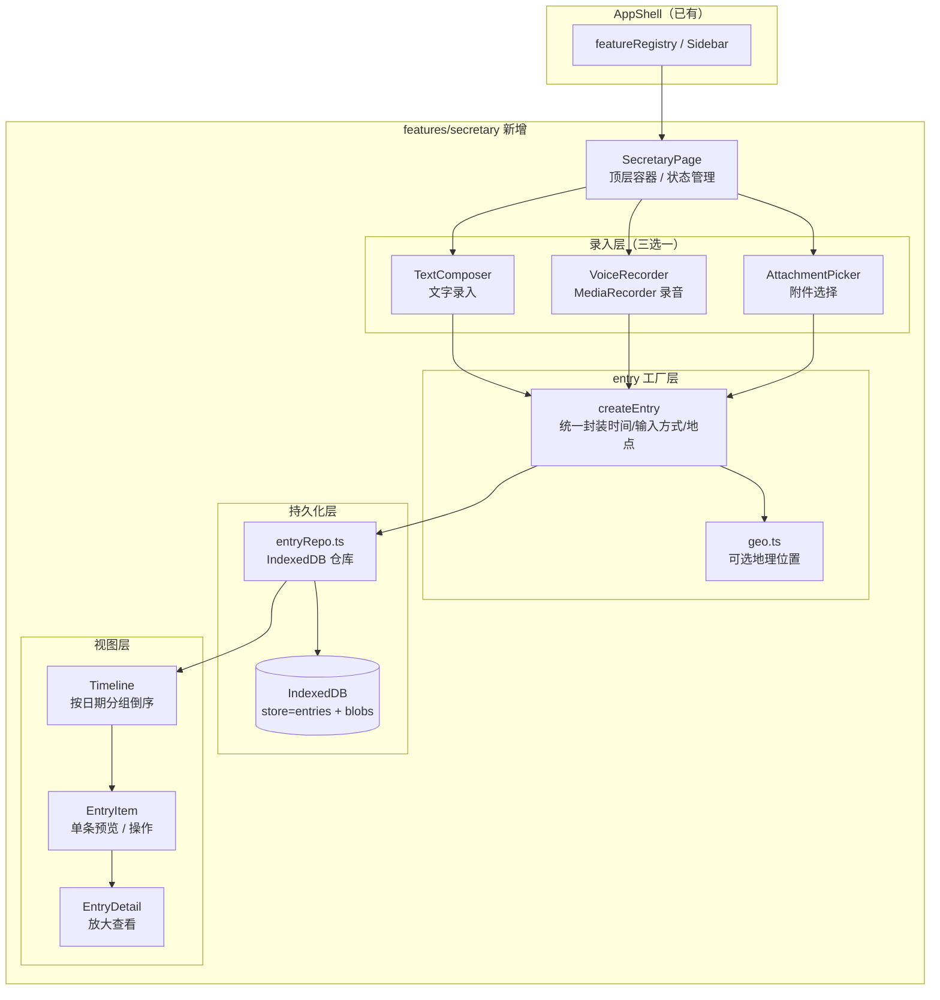
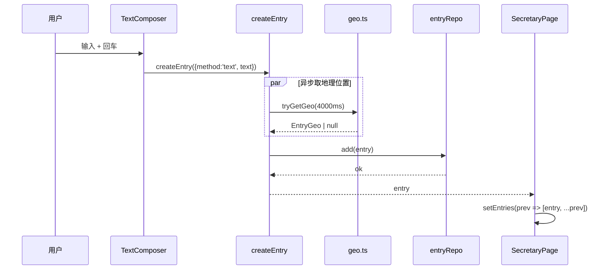
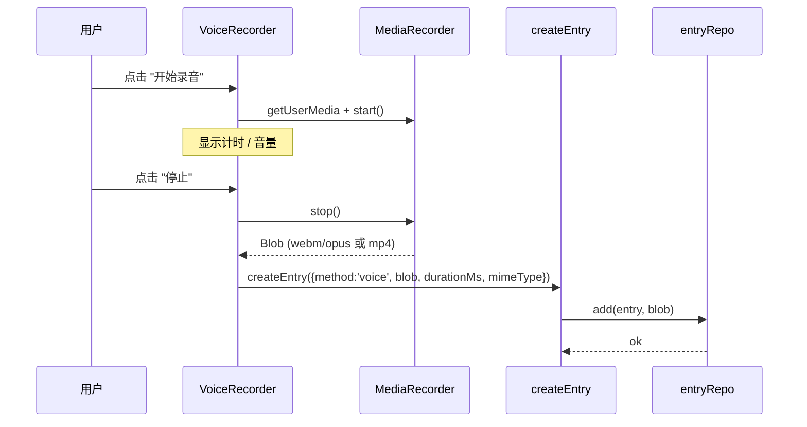
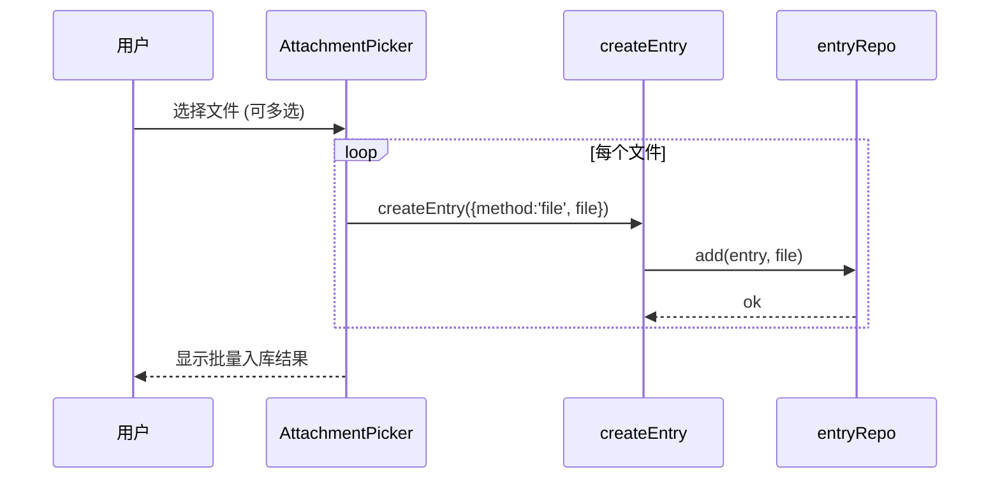
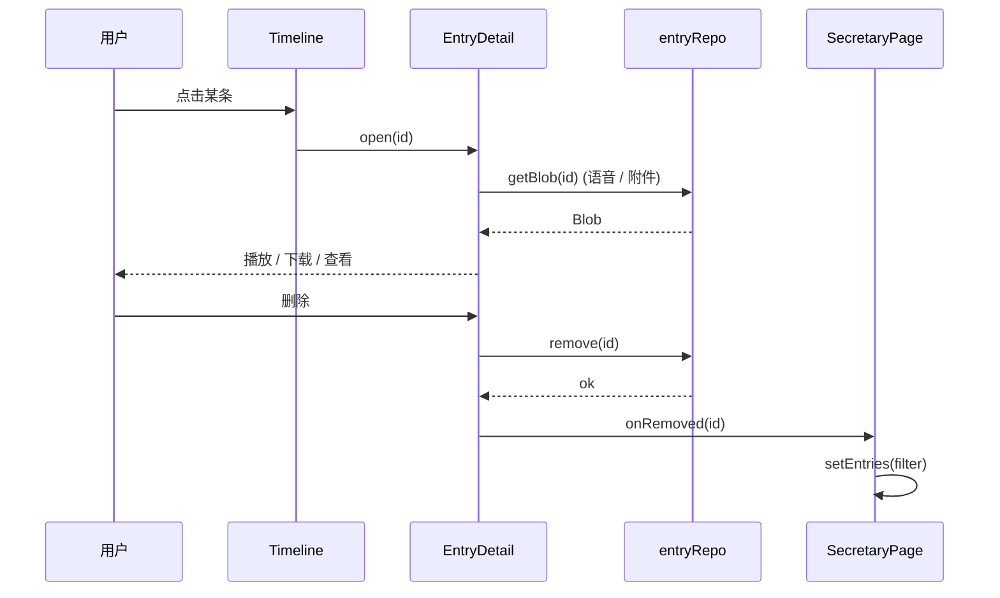

# 个人秘书 · 技术方案

> **模板**：完整-技术（template-tech.md）
> **范围**：kai-toolbox / frontend 新增 feature 模块
> **最后更新**：2026-05-18

---

## 变更记录

| 版本 | 日期 | 修改人 | 变更内容摘要 |
|------|------|--------|--------------|
| current | 2026-05-18 | ai (claude) | 初版：文字 / 语音 / 附件三路录入 + IndexedDB 持久化 + 可选地理位置 |
| current | 2026-05-18 | ai (claude) | 明确「移动端为主」交互约束（折叠 composer、触屏不劫持 Enter、Sheet 小屏全宽） |

---

## 1. 目标与边界

- **要解决的问题**：日常生活中随手记录琐碎事项的零散需求 —— 想到一句话、突然想录段语音、扔进一张照片或一份资料，希望都能落到同一个时间轴上随时回看。
- **本次目标**：
  1. 新增 feature 模块 `secretary`，注册到 `featureRegistry`，与扁平化、Markdown 卡片等并列出现在首页与侧边栏。
  2. 支持三种录入方式：**文字消息**、**语音录音**、**附件上传**（文本资料 / 图片 / 任意文件）。
  3. 每条记录强制存储「**时间戳 + 输入方式**」；地理位置（经纬度 + 反向地理可选）**尽力而为**，不阻塞主流程。
  4. 全部数据落在 **IndexedDB**（容量足够存语音 Blob），纯前端、纯本地、不走任何后端接口。
  5. 提供时间轴视图：按日期分组倒序，单条支持查看 / 重命名 / 删除。
- **不做什么**：
  1. 不引入后端接口，不做账号同步、不做云备份。
  2. 不做 ASR / OCR / 自动摘要（保持纯记录工具，语音只录、不转写）。
  3. 不做加密、不做密码锁屏。
  4. 不做提醒 / 日历 / 待办 —— 这是「记录工具」，不是「任务工具」。
  5. 不做地图可视化（地点只存坐标 + 文字描述，不画地图）。
- **设计结论（一句话）**：以「录入器（三选一） → entry 工厂 → IndexedDB 仓库 → 时间轴视图」四段式，把秘书拆成纯前端模块，浏览器原生 API（MediaRecorder / Geolocation / IndexedDB）即可承载，零第三方依赖。

---

## 2. 整体架构



**分层职责**：
- **录入层**：只关心"如何拿到一段内容"（文字 / Blob / File），不关心存储。
- **entry 工厂层**：把内容标准化为 `Entry`，注入 `createdAt` / `inputMethod` / `geo`，把附件 Blob 落到 IndexedDB 单独的 `blobs` store。
- **持久化层**：唯一接触 IndexedDB 的层；屏蔽 IDB 异步细节，对外暴露 Promise。
- **视图层**：只消费 `Entry[]`，按 `createdAt` 分组排序；不直接读写 DB。

---

## 3. 模块拆分与职责

### 3.1 `pages/SecretaryPage.tsx`
顶层页面。状态：`entries: Entry[]`、`activeComposer: 'text' | 'voice' | 'file' | null`、`detailId: string | null`。负责调用 `entryRepo.list()` 首屏加载、调度三个 Composer、把新 entry 追加进列表、把 timeline 渲染到右侧。

### 3.2 `components/TextComposer.tsx`
顶部固定输入框（多行 textarea）+ 「发送」按钮。回车（不带 Shift）或点击按钮触发 `onSubmit(text)`。空白文本拒绝提交。

### 3.3 `components/VoiceRecorder.tsx`
按下「开始录音」→ 调 `navigator.mediaDevices.getUserMedia({audio:true})` → `MediaRecorder.start()`，期间显示计时与音量动画；「停止」后拿到 Blob（webm/opus 或 mp4，按浏览器协商）调 `onSubmit(blob, durationMs)`。权限拒绝时显示"已禁用麦克风"提示。

### 3.4 `components/AttachmentPicker.tsx`
`<input type="file" multiple>` 触发选择，允许任意类型；每个文件单独入库（一条 entry 一个附件，便于时间轴呈现）。可选填补一段「文字备注」。

### 3.5 `components/Timeline.tsx`
按 `createdAt` 倒序，按"今天 / 昨天 / YYYY-MM-DD"分组，分组内仍倒序。空状态显示"还没有记录，随手记一条吧"。

### 3.6 `components/EntryItem.tsx`
单条卡片：图标（按 inputMethod）+ 时间 + 内容预览（文字截前 200 字 / 语音显示时长 + 播放按钮 / 附件显示文件名 + 大小）+ 地点（如有）+ 删除按钮。点击卡片打开 `EntryDetail`。

### 3.7 `components/EntryDetail.tsx`
Sheet 抽屉：放大查看 / 播放音频 / 下载附件 / 编辑备注（可选） / 删除确认。

### 3.8 `lib/entryRepo.ts`
IndexedDB 仓库。两个 object store：
- `entries`：keyPath = `id`，索引 `byCreatedAt`（倒序查询）。
- `blobs`：keyPath = `id`（与 entry 一对一，附件 / 语音的二进制）。

对外 API：`init()` / `list()` / `add(entry, blob?)` / `getBlob(id)` / `remove(id)` / `clear()`。

### 3.9 `lib/geo.ts`
`tryGetGeo(timeoutMs = 4000): Promise<EntryGeo | null>`。调 `navigator.geolocation.getCurrentPosition`，失败 / 超时 / 用户拒绝时返回 `null`。**不阻塞主流程，最多等 4 秒。**

### 3.10 `lib/format.ts`
本模块小工具：时长格式化、文件大小复用 `@/lib/utils.formatBytes`、日期分组键。

### 3.11 `types.ts`
```ts
export type InputMethod = 'text' | 'voice' | 'file'

export interface EntryGeo {
  latitude: number
  longitude: number
  accuracy: number       // 米
  capturedAt: number     // 拿到坐标的时间戳
}

export interface BaseEntry {
  id: string             // crypto.randomUUID
  createdAt: number      // Date.now()
  inputMethod: InputMethod
  geo: EntryGeo | null
  note?: string          // 用户额外备注
}

export interface TextEntry extends BaseEntry {
  inputMethod: 'text'
  text: string
}

export interface VoiceEntry extends BaseEntry {
  inputMethod: 'voice'
  durationMs: number
  mimeType: string       // 实际录音 mime
  // blob 存 blobs store，按 id 取
}

export interface FileEntry extends BaseEntry {
  inputMethod: 'file'
  fileName: string
  fileSize: number
  mimeType: string
}

export type Entry = TextEntry | VoiceEntry | FileEntry
```

---

## 4. 关键交互

### 4.1 录入文字消息



**关键点**：地理位置以 `Promise.race(getCurrentPosition, sleep(4000))` 控制，失败 / 超时 / 拒绝一律给 `null`，**不弹错**。

### 4.2 录入语音



**失败处理**：权限拒绝 / 设备不支持 → UI 切回"未启用"，Compose 按钮置灰，给一行说明文字。

### 4.3 录入附件



### 4.4 查看 / 删除单条



---

## 4.5 移动端交互约束（主导场景）

本模块**主战场是移动端**（手机随手记），桌面端为兼容场景。所有交互必须满足：

| 约束 | 实现 |
|------|------|
| **不劫持触屏 Enter** | TextComposer 用 `matchMedia('(pointer: coarse)')` 检测触屏；触屏时 Enter 仅换行，提交必须点显式「发送」按钮 |
| **按钮触摸目标 ≥ 44px** | 发送 / 录音 / 入库按钮统一 `size="lg"`；录音按钮单独居中放大 |
| **顶部 Composer 可折叠** | 用 ChevronUp/Down 一键收起 composer，时间轴占满屏；首次进入默认展开 |
| **详情抽屉小屏全宽** | EntryDetail 的 `SheetContent` 在 `<sm` 时 `!max-w-full`，桌面恢复 `sm:!max-w-md` |
| **时间轴单列纵向** | 全程不做桌面双栏；只在 `max-w-2xl` 居中收窄保留可读宽度 |
| **字号优先 base，桌面降到 sm** | textarea 在移动端 `text-base`（≥16px 避免 iOS Safari 自动缩放），桌面 `sm:text-sm` |
| **麦克风权限失败不阻塞** | 浏览器拒绝 / 设备无 → 该 composer 给静态提示，其它两种照常可用 |
| **录音卸载必释放 stream** | VoiceRecorder 在 unmount 时 `stream.getTracks().forEach(t=>t.stop())`，避免移动端切走后仍占用麦克风 |
| **录音失败必显式提示** | 任何启动失败都翻译为「标题 + 原因 + 建议清单」面板；按 `DOMException.name` 细分 8 种 code（denied/no-device/device-busy/insecure-context/no-mediadevices/no-recorder/unsupported-mime/unknown），并展示可点击「重试」按钮，杜绝"点了没反应" |
| **首屏环境预检** | mount 即调 `checkEnv()`：`isSecureContext === false` / `navigator.mediaDevices` 缺失 / `MediaRecorder` 缺失 → 提前把致命原因贴出来 |
| **附件项行高大、删除区域明显** | AttachmentPicker 预选列表每项 padding 较大、移除按钮文字态而非图标态 |

---

## 5. 核心业务规则

| 规则 | 说明 |
|------|------|
| **时间戳必填** | 每条 entry 在工厂层注入 `Date.now()`，调用方不允许传入；保证时间轴单调。 |
| **输入方式必填** | 工厂层强约束 `inputMethod ∈ {text, voice, file}`，与三种 Composer 一一对应。 |
| **地理位置尽力而为** | 失败 / 超时 / 拒绝 / 浏览器不支持 → 一律 `geo = null`，**不阻塞、不报错**。 |
| **文字非空** | TextComposer 提交前 `text.trim().length > 0`；纯空白文本拒绝入库。 |
| **附件一对一** | 一个文件 = 一条 entry；多选时拆成多条；不做合并卡片，便于时间轴。 |
| **语音 mime 协商** | 优先 `audio/webm;codecs=opus`，不支持时退化到浏览器默认；mime 写入 entry，回放时按其设置 `audio.type`。 |
| **删除即彻底** | 删除 entry 时一并 `blobs.delete(id)`，无回收站。 |
| **空状态零摩擦** | 首次进入页面，三个 Composer 立即可见，引导文案"随手记一条吧"。 |

---

## 6. 编码落点

```
frontend/src/features/secretary/
├── index.tsx                          # FeatureManifest 注册
├── types.ts                           # Entry / InputMethod / EntryGeo
├── pages/
│   └── SecretaryPage.tsx              # 顶层页面
├── components/
│   ├── TextComposer.tsx
│   ├── VoiceRecorder.tsx
│   ├── AttachmentPicker.tsx
│   ├── ComposerTabs.tsx               # 三选一切换 UI
│   ├── Timeline.tsx
│   ├── EntryItem.tsx
│   └── EntryDetail.tsx                # Sheet 抽屉
└── lib/
    ├── entryRepo.ts                   # IndexedDB 仓库
    ├── createEntry.ts                 # entry 工厂
    ├── geo.ts                         # 地理位置尽力而为
    └── format.ts                      # 时长 / 分组键
```

**注册到 featureRegistry**：`index.tsx` 默认导出 `FeatureManifest`，由 `import.meta.glob('../features/*/index.tsx')` 自动收集。

**路由路径**：`/tools/secretary`。

**侧边栏 group**：`内容工具`（与 markdown-card 同组）。

**图标**：`lucide-react` 的 `NotebookPen`。

**order**：`35`（紧邻 markdown-card 的 `30`）。

---

## 7. 浏览器 API 兼容性

| API | 最低版本 | 失败兜底 |
|-----|---------|---------|
| IndexedDB | 全平台支持 | 无降级（核心存储） |
| MediaRecorder | Chrome 49+ / Firefox 25+ / Safari 14.1+ | UI 显示"当前浏览器不支持录音"，语音按钮置灰 |
| Geolocation | 全平台支持，需 HTTPS / localhost | 拿到 null，不影响入库 |
| crypto.randomUUID | Chrome 92+ / Firefox 95+ / Safari 15.4+ | 兜底用 `Date.now() + Math.random().toString(36)` |
| `<input type="file" multiple>` | 全平台支持 | 无 |

> kai-toolbox 已经在 PWA 场景跑过 MediaRecorder（暂无）和 IndexedDB（暂无），但 HTTPS / localhost 部署默认满足。

---

## 8. 风险与待确认

| 风险 | 影响 | 缓解 |
|------|------|------|
| IndexedDB 配额（语音 Blob 占空间） | 长期使用可能撑大数据库 | 后续可加「按时间清理 / 导出归档」入口，本期先不做 |
| 移动端 Safari 录音 mime 不一致 | 回放可能找不到合适 codec | mime 写入 entry，`<audio>` 直接 `src=URL.createObjectURL(blob)`，让浏览器自决 |
| 地理位置首次会弹权限弹窗 | 用户可能拒绝 → 永久 null | 接受现状，不做强制提醒；可选在设置里加"再次申请权限"按钮 |
| 多标签页同时写入 | IDB 多 tab 不冲突，但 UI 不会跨 tab 同步 | 接受现状，刷新即可对齐 |
| 浏览器隐私模式下 IDB 容量极小 | 写入可能直接失败 | 入库失败 toast 提示，但不做特殊兜底 |

**待确认**：暂无 —— 用户明示自主推进。

---

## 9. 验证要点

- [ ] 文字录入：回车提交、空白拒绝、列表立刻出现新条目
- [ ] 语音录入：开始 / 停止 / 计时 / 回放、权限拒绝时按钮置灰
- [ ] 附件录入：单选 / 多选、各拆一条、文件名 / 大小正确
- [ ] 地理位置：HTTPS 下首次弹权限、拒绝后不影响入库
- [ ] 时间轴：今天 / 昨天 / YYYY-MM-DD 分组、倒序排列
- [ ] 详情：图片预览、音频播放、文件下载
- [ ] 删除：entry + blob 一并清理，刷新后不再出现
- [ ] 刷新重进：IndexedDB 数据完整恢复
- [ ] typecheck（`npm run typecheck`）通过
