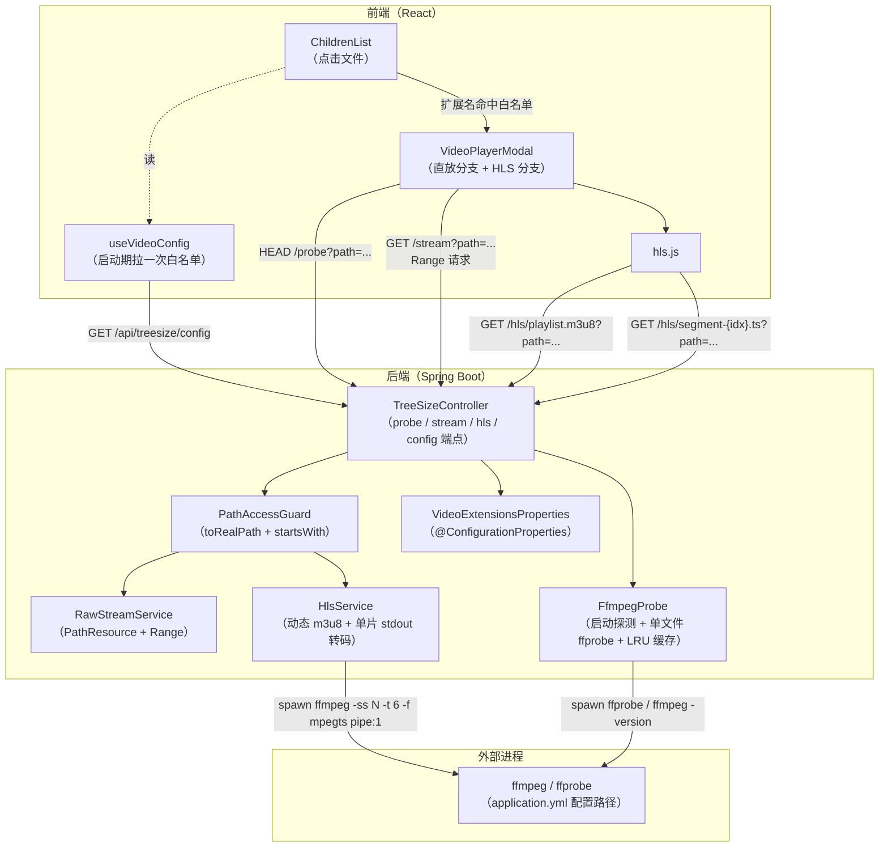
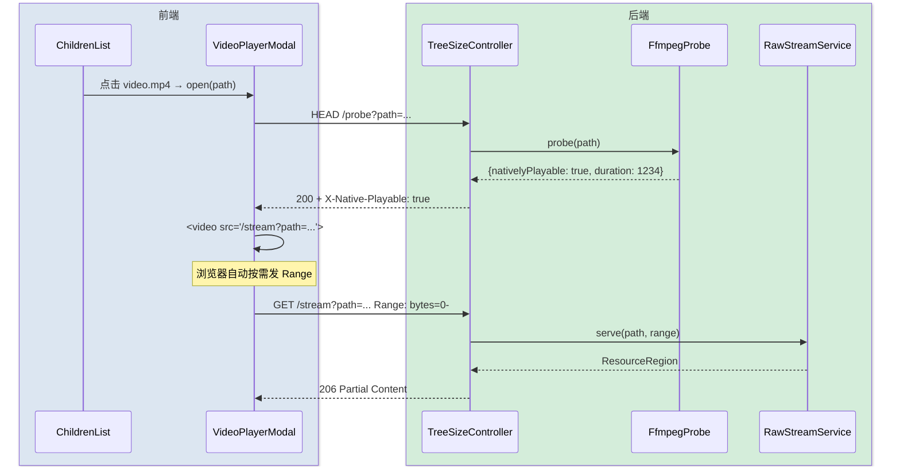
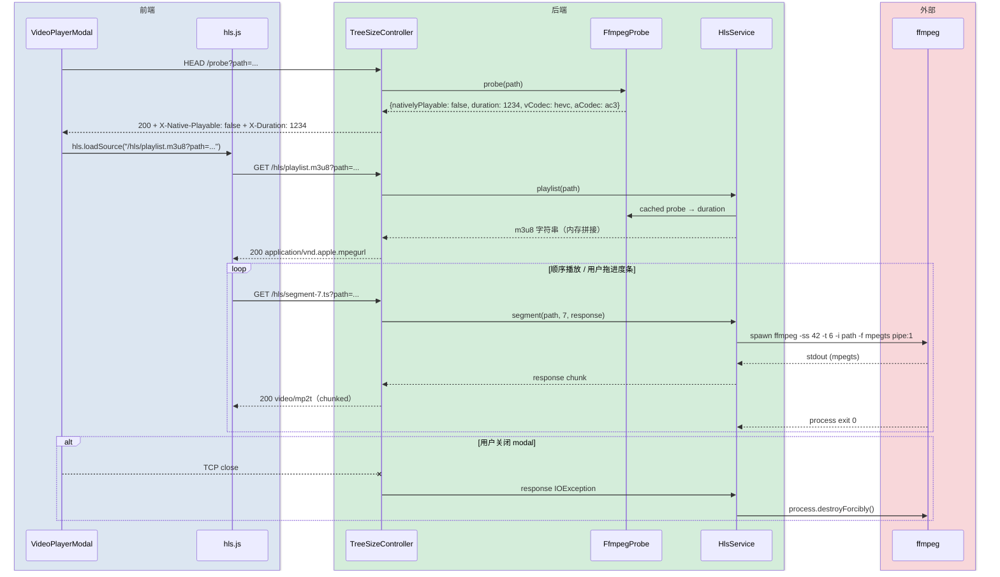
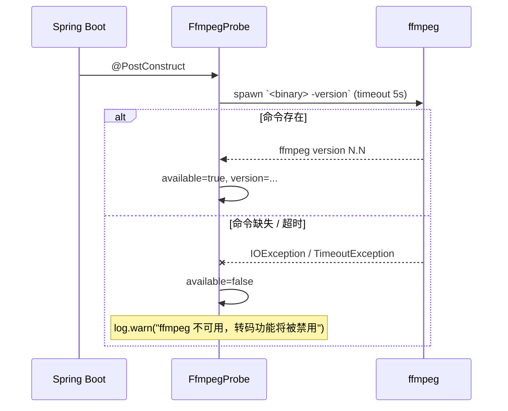

# 在线视频播放（技术方案）

> 最后更新：2026-05-13
> 模版：完整-技术（template-tech.md）

## 1. 目标与边界

### 做什么

在 TreeSize 的目录浏览视图里，用户点击一个视频文件就能在浏览器内播放（含拖动进度条），包括浏览器原生不支持的格式（mkv / avi / flv / rmvb 等）。

### 不做什么

- 不做转码后落盘缓存（每次都按需启 FFmpeg；本地工具，不为多用户服务）
- 不做画质/码率自适应（HLS 多档），固定单档转码
- 不做字幕外挂解析（mp4/mkv 内嵌字幕浏览器原生处理；外挂 srt/ass 不支持）
- 不做断点续播状态保存
- 不做转码进度显示（前端只显示浏览器原生 buffering）

### 设计结论

| 决策 | 选择 | 原因 |
|------|------|------|
| 直放 vs 转码 | 按容器+编解码白名单决策 | 能直放就直放，不花 CPU |
| 转码协议 | HLS（每片单独转码到 stdout） | 浏览器原生进度条可用；纯 stdout 管道，**零磁盘落盘** |
| 分片长度 | 6 秒 | HLS 标准默认；起播延迟与 seek 精度的平衡点 |
| 分片缓存 | **不做**（本期） | 单用户本地工具；同一片重复 seek 才会重转，可接受 |
| Range 支持 | 仅原生流（直放）支持 | HLS 自有切片机制承担 seek，不需要 Range |
| 视频白名单 | 后端 `application.yml` 配置，前端通过 `/api/treesize/config` 拉取 | 集中配置，前端不硬编码 |
| FFmpeg 路径 | `application.yml: toolbox.ffmpeg.binary` 显式配置，默认 `ffmpeg` 走 PATH | 同上 |
| FFmpeg 探测 | 启动时一次性 `ffmpeg -version` | 缺失时前端禁用转码，给"请安装 FFmpeg"提示 |
| 路径越权 | `requested.toRealPath().startsWith(scan.rootRealPath)` | 显式守住，未来 0.0.0.0 监听零成本 |

## 2. 整体架构



## 3. 模块拆分与职责

### 3.1 PathAccessGuard（tool-treesize / 新增）

- **定位**：所有按 `path` 参数读盘的接口必经一层。
- **职责**：取出 scan 的 `rootPath` 调 `toRealPath()`，请求的 `path` 也 `toRealPath()`，要求后者 `startsWith` 前者；不通过抛 `IllegalArgumentException`。
- **上下游**：被 Controller 调用，返回安全的绝对 `Path`。

### 3.2 FfmpegProbe（toolbox-common / 新增）

- **定位**：FFmpeg 可用性 + 单文件元信息探测。
- **职责**：
  - 启动期跑一次 `<binary> -version`，缓存可用状态
  - `probe(Path)`：跑 `ffprobe -v error -show_streams -show_format -of json`，解析容器、视频编码、音频编码、duration
  - `nativelyPlayable(probeResult)`：按规则表（第 5 节）判断
  - 探测结果按 `(path, mtime)` LRU 缓存（上限 1000）
- **关键设计点**：
  - FFmpeg 二进制路径、探测超时全部从 `FfmpegProperties`（@ConfigurationProperties）读
  - ffprobe 缺失时直接判 `nativelyPlayable=false`，让前端拿到明确信号

### 3.3 RawStreamService（tool-treesize / 新增）

- **定位**：原生格式的 zero-copy 直传。
- **职责**：
  - 处理 `Range` 头（`HttpRange.parseRanges`）
  - 返回 `ResponseEntity<ResourceRegion>` 或 `ResponseEntity<Resource>`
  - `Content-Type` 按扩展名映射（`.mp4/.m4v/.mov → video/mp4`、`.webm → video/webm`、`.ogv → video/ogg`）

### 3.4 HlsService（tool-treesize / 新增）

- **定位**：HLS 协议端，动态生成 playlist 和按需转码每个 ts 分片。
- **职责**：
  - `playlist(Path)`：调 `FfmpegProbe` 拿到 `duration`，按 6 秒/片算出分片数 N，**内存里**拼出 `.m3u8` 字符串返回
  - `segment(Path, int idx, OutputStream out)`：fork FFmpeg `-ss <idx*6> -t 6 -i <path> -c:v libx264 -preset veryfast -c:a aac -f mpegts pipe:1`，把 stdout 拷到 `out`，stderr 单独 drain 到日志
  - 客户端断开 → response stream IOException → `process.destroyForcibly()` 兜底
- **关键设计点**：
  - 不持有任何磁盘状态，只是个无状态服务
  - 同一个分片并发请求不去重（本地单用户）
  - codec 兼容时（视频已是 h264，音频已是 aac）可加 `-c copy` 优化（本期实现：探测后选择 copy / encode；fast path 减少 CPU）

### 3.5 VideoExtensionsProperties（tool-treesize / 新增）

- **定位**：视频扩展名白名单的 `@ConfigurationProperties` 绑定。
- **职责**：从 `application.yml` 读 `toolbox.video.extensions`，提供给 Controller。
- **默认值**（在 `application.yml` 的 `toolbox.video.extensions` 写出，**不在代码里写死**，便于用户改）：`mp4 / m4v / mov / webm / ogv / mkv / avi / flv / wmv / rmvb / 3gp / ts / mts / m2ts / vob / asf / divx / mpeg / mpg / m2v`

### 3.6 FfmpegProperties（toolbox-common / 新增）

- 配置项 `toolbox.ffmpeg.binary`（默认 `ffmpeg`）、`toolbox.ffmpeg.ffprobe-binary`（默认 `ffprobe`）、`toolbox.ffmpeg.probe-timeout-ms`（默认 5000）。

### 3.7 VideoPlayerModal（前端 / 新增）

- **定位**：唯一的视频播放 UI 入口。
- **职责**：
  - 接收 `{scanId, path, name}` props
  - mount 时 fetch `HEAD /probe?path=...`，根据 `X-Native-Playable` 决定走 `<video src=/stream...>` 还是 hls.js + `/hls/playlist.m3u8`
  - 关闭时 `<video>` 卸载 → fetch abort → 后端 process 兜底清理
  - 转码场景下额外显示"转码中"提示
  - 播放器控制层使用自定义 `VideoPlayerControls`，底部按钮按「播放 / 跳转 / 音量 / 时间 / 画面操作 / 播放参数 / 集数 / 全屏」分组；移动端拆成两行以保证按钮不拥挤
  - 横竖屏切换键优先调用浏览器 Screen Orientation API；不支持锁定方向时，仍切换播放器容器比例（横屏 `16:9`、竖屏 `9:16`）作为兜底

### 3.8 ChildrenList / api.ts / utils.ts（前端 / 修改）

- ChildrenList：文件 onClick 判断扩展名是否在白名单（白名单从后端 `/config` 拉），是则打开 VideoPlayerModal
- api.ts：新增 `getVideoConfig()`、`probeVideo(scanId, path)`、`streamUrl(scanId, path)`、`hlsPlaylistUrl(scanId, path)`、`hlsSegmentUrl(scanId, path, idx)`
- 启动期 `useVideoConfig` hook 用 TanStack Query 拉一次白名单，缓存 staleTime 长一些（5 分钟，配置极少改）

## 4. 关键交互

### 4.1 直放路径（mp4 / webm / ogv，浏览器原生支持）



### 4.2 HLS 转码路径（mkv / flv / avi / …）



### 4.3 启动期 FFmpeg 探测



## 5. 核心业务规则

| 规则 | 说明 |
|------|------|
| 视频文件识别（前端） | 由后端 `/api/treesize/config` 返回的扩展名白名单决定，前端不硬编码；白名单源头是 `application.yml: toolbox.video.extensions` |
| 播放按钮布局（前端） | 移动端控制按钮必须保持 40px 以上触控目标，进度条可拖拽热区不低于 8px；参数菜单项使用更高行距避免误触 |
| 横竖屏切换（前端） | 切换键不改变视频旋转角度；它只负责播放器横/竖比例与可选系统方向锁定，画面旋转仍由独立旋转键处理 |
| 原生可播判定（后端） | 容器 ∈ {mp4, m4v, webm, ogg, mov} **且** 视频编码 ∈ {h264, vp8, vp9, av1} **且**（无音频流 **或** 音频编码 ∈ {aac, mp3, opus, vorbis}）→ true，否则 false |
| HLS 分片长度 | 固定 6 秒；最后一片可能短于 6 秒（用 ffprobe 实际 duration 算） |
| 分片索引越界 | 请求 idx ≥ 总分片数 → 404 |
| 转码 fast-path | 当原始视频编码 ∈ {h264} **且** 音频编码 ∈ {aac, mp3} 时，HLS 分片用 `-c:v copy -c:a copy` 重封装到 mpegts；其它走重编码（编码器按 `toolbox.ffmpeg.hwaccel` 选 libx264/h264_nvenc 等）|
| 小帧兜底（重编码） | 软解重编码路径加 `-vf scale=max(iw,256):max(ih,144):force_original_aspect_ratio=increase:force_divisible_by=2`，把 QCIF 级老视频（KDDI .amc/.3gp 的 mpeg4/h263，如 96x80）放大到 NVENC 最小帧之上，避免 `h264_nvenc InitializeEncoder failed` 吐空段导致 hls.js fragParsingError；正常尺寸 no-op，hwDecode（VRAM 帧）路径不加 |
| FFmpeg 不可用 | `/probe` 仍能返回（基于扩展名的简单判定走兜底）；`/hls/*` 直接 503 |
| 路径校验失败 | 400 `{message: "path outside scan root"}` |
| 文件不存在 / 目录被当文件 | 404 / 400 |
| 客户端中途断开 | 直放：`AsyncRequestNotUsableException` 已有静默路径。HLS：`process.destroyForcibly()` + stderr drain 线程退出 |
| 转码 stderr | 默认 `-loglevel warning`，drain 后整段写入 DEBUG 日志 |

## 6. 编码落点

```
toolbox-common/src/main/java/com/exceptioncoder/toolbox/common/media/    [新增包]
├── FfmpegProperties.java                             [新增] @ConfigurationProperties("toolbox.ffmpeg")
├── FfmpegProbe.java                                  [新增] 启动探测 + ffprobe 单文件解析 + LRU 缓存
└── ProbeResult.java                                  [新增] record(duration, container, videoCodec, audioCodec)

tools/tool-treesize/src/main/java/com/exceptioncoder/toolbox/treesize/
├── api/
│   ├── TreeSizeController.java                       [修改] 加 5 个 endpoint：/config /probe /stream /hls/playlist.m3u8 /hls/segment-{idx}.ts
│   └── dto/
│       └── VideoConfigView.java                      [新增] {videoExtensions: List<String>, ffmpegAvailable: boolean}
├── config/
│   └── VideoExtensionsProperties.java                [新增] @ConfigurationProperties("toolbox.video")
├── service/
│   ├── PathAccessGuard.java                          [新增] toRealPath + startsWith 校验
│   ├── RawStreamService.java                         [新增] Range 直放
│   └── HlsService.java                               [新增] m3u8 拼接 + 分片转码

toolbox-starter/src/main/resources/
└── application.yml                                   [修改] 加 toolbox.ffmpeg.* 和 toolbox.video.extensions

frontend/
├── package.json                                      [修改] 加 hls.js 依赖
└── src/features/treesize/
    ├── api.ts                                        [修改] 加 getVideoConfig / probeVideo / streamUrl / hlsPlaylistUrl
    ├── types.ts                                      [修改] 加 VideoConfig / ProbeResult 类型
    ├── utils.ts                                      [修改] 加 isVideoFile(name, whitelist)
    ├── hooks/useVideoConfig.ts                       [新增] TanStack Query 拉一次白名单
    ├── components/VideoPlayerModal.tsx               [新增] 直放分支 + hls.js 分支
    └── components/ChildrenList.tsx                   [修改] 文件点击 → 视频识别 → 打开 modal
```

## 7. 数据/依赖变更

### 7.1 数据库

**无变更**。

### 7.2 后端外部依赖

| 依赖 | 来源 | 必需性 | 缺失时行为 |
|------|------|-------|-----------|
| `ffmpeg` 命令 | 用户本机（路径在 `application.yml`） | 转码必需 | 启动探测失败 → 前端 `/config` 看到 `ffmpegAvailable: false` → 转码场景显示"请安装 FFmpeg"提示并禁用 |
| `ffprobe` 命令 | 通常随 ffmpeg | 探测必需 | 同上 |

### 7.3 前端依赖

| 包 | 版本范围 | 用途 |
|----|---------|------|
| `hls.js` | ^1.5 | HLS 播放，gzipped ~80KB |

### 7.4 配置（`application.yml` 新增）

```yaml
toolbox:
  ffmpeg:
    binary: ffmpeg
    ffprobe-binary: ffprobe
    probe-timeout-ms: 5000
  video:
    extensions:
      - mp4
      - m4v
      - mov
      - webm
      - ogv
      - mkv
      - avi
      - flv
      - wmv
      - rmvb
      - 3gp
      - ts
      - mts
      - m2ts
      - vob
      - asf
      - divx
      - mpeg
      - mpg
      - m2v
```

## 8. 风险与待确认

| 风险 | 程度 | 缓解 |
|------|------|------|
| 单分片 seek 首次延迟 1-3s | 中 | 用 fast-path（codec 已兼容时 `-c copy`）压到亚秒；用户能接受偶尔等一下 |
| FFmpeg 进程未清理变僵尸 | 高 | HlsService 必须 try-with-resources + finally + destroyForcibly 兜底；专用 stderr drain 线程也要 join 退出 |
| Windows 中文 / 空格路径 | 中 | `ProcessBuilder` 用 `List<String>` 传参（不走 shell） |
| 路径越权（symlink 绕过） | 中 | `toRealPath()` 解析符号链接后比对 |
| 大文件 ffprobe 超时 | 低 | `probe-timeout-ms=5000`，加 `-analyzeduration 5M -probesize 5M` 限定分析量；超时时回退为基于扩展名的简单判定 |
| 分片 mpegts 不带正确时间戳导致 hls.js 拼接异常 | 中 | 加 `-copyts -muxdelay 0 -muxpreload 0`；首版无问题就不深入 |
| HLS 播放列表暴露文件长度但 path 已通过鉴权 | 低 | 已通过 PathAccessGuard，无问题 |
| 用户在 application.yml 配错 ffmpeg 路径 | 低 | 启动 log.warn + `/config` 暴露 `ffmpegAvailable: false`，UI 直接告知 |

待用户确认（已 close）：
- [x] 视频白名单：后端 `application.yml` 配置 + `/config` 接口暴露
- [x] FFmpeg 路径：`application.yml: toolbox.ffmpeg.binary`
- [x] 走 HLS（每分片现场转码到 stdout，零落盘）
- [x] 分片 6 秒
- [x] 不做磁盘缓存
