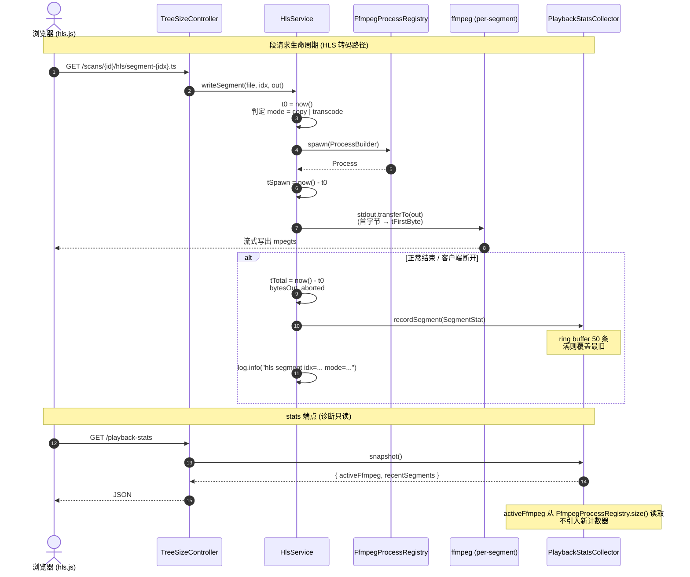

# 转码可观测性（轻量级）

> 最后更新：2026-05-16
> 模版：轻量（lightweight-template.md）
> 父需求：[在线视频播放](../在线视频播放-current.md)

> **职责定位**：在不改动现有播放路径行为的前提下，给 HLS 实时转码 + ffprobe 元数据探测增加可量化的运行指标，并暴露一个只读端点供前端 / 排查时实时观察。回答"播放慢到底慢在哪一步、慢多少"。

---

## 变更记录

| 版本 | 日期 | 变更内容摘要 |
|------|------|--------------|
| v1 | 2026-05-16 | 初始版本：HLS 段打点 + ffprobe 慢探测告警 + /playback-stats 只读端点 |
| v1.1 | 2026-05-16 | 追加前端：视频库页面右上「转码监控」抽屉，2 秒轮询 + 暂停/手动刷新 + 速度归类 |

---

## 1. 代码入口

### 1.1 HLS 段级打点

- **入口**：`HlsService#writeSegment` → `tools/tool-treesize/src/main/java/com/exceptioncoder/toolbox/treesize/service/HlsService.java:93`
- **目的**：记录每个 .ts 段的转码全链路耗时与编码模式，让"播放慢"可归因到具体阶段
- **是否写表**：否（纯内存）

### 1.2 ffprobe 慢探测告警

- **入口**：`FfmpegProbe#runFfprobe` → `toolbox-common/src/main/java/com/exceptioncoder/toolbox/common/media/FfmpegProbe.java:123`
- **目的**：探测耗时 > 1000ms 时落 WARN，定位卡在网盘/坏文件的 case
- **是否写表**：否

### 1.4 前端转码监控抽屉

- **入口按钮**：`VideoLibraryPage` 页头新增 `Button` → `frontend/src/features/video-library/pages/VideoLibraryPage.tsx`（已落地）
- **抽屉组件**：`PlaybackStatsPanel` → `frontend/src/features/video-library/components/PlaybackStatsPanel.tsx`（新建）
- **API client**：`getPlaybackStats()` → `frontend/src/features/video-library/api.ts`（新增）
- **类型**：`PlaybackStats` + `SegmentStat` → `frontend/src/features/video-library/types.ts`（新增）
- **打开方式**：视频库页面右上「转码监控」按钮 → 右侧 Sheet 抽屉
- **轮询策略**：`useQuery` 仅在 `active=true` 时启用、`refetchInterval=2000ms`、用户可暂停 / 手动刷新；抽屉关闭即停止网络请求
- **展示字段**：
  - 活跃进程大数字卡（0 灰、1-2 绿、≥3 黄）
  - 汇总条：平均速度 / copy 段占比 / aborted 段数
  - 段列表：mode badge / spawn / 首字节 / 总耗时 / 速度（速度 ≥2× 绿、≥1× 默认、≥0.5× 黄、<0.5× 红）

### 1.3 只读 stats 端点 + 收集器

- **入口**：`TreeSizeController#playbackStatsSnapshot` → `tools/tool-treesize/src/main/java/com/exceptioncoder/toolbox/treesize/api/TreeSizeController.java`（已落地）
- **关键调用**：`PlaybackStatsCollector#recent` → `tools/tool-treesize/src/main/java/com/exceptioncoder/toolbox/treesize/service/PlaybackStatsCollector.java`（已落地，capacity=50 的 ArrayDeque ring buffer）
- **活跃进程数据源**：`FfmpegProcessRegistry#activeCount` → `toolbox-common/src/main/java/com/exceptioncoder/toolbox/common/media/FfmpegProcessRegistry.java`（新增 public getter，零额外计数器）
- **DTO**：`PlaybackStatsView` + `SegmentStatView` → `tools/tool-treesize/src/main/java/com/exceptioncoder/toolbox/treesize/api/dto/`
- **领域记录**：`SegmentStat` (record) → `tools/tool-treesize/src/main/java/com/exceptioncoder/toolbox/treesize/domain/SegmentStat.java`
- **目的**：把最近 N 条段统计 + 当前活跃 ffmpeg 数量打包返回，供前端 PlayerOverlay 或排查时 curl 使用
- **是否写表**：否

---

## 2. 接口契约

### 2.1 GET `/api/treesize/playback-stats`

- **出参**（JSON）：
  - `activeFfmpeg: int` — 当前进行中的 ffmpeg/ffprobe 进程数，来自 `FfmpegProcessRegistry`
  - `recentSegments: List<SegmentStat>` — 最近 N 条段统计，按时间倒序，最长 50 条
- **SegmentStat 字段**：
  - `idx: int` — HLS 段索引
  - `file: string` — 源文件名（仅末段，剥掉父目录，避免日志泄露绝对路径）
  - `mode: "copy" | "transcode"` — 是否走 `-c copy` 重封装
  - `spawnMs: long` — fork ffmpeg → 拿到 Process 对象耗时
  - `firstByteMs: long` — fork 完成 → stdout 写出第一字节耗时
  - `totalMs: long` — 段起始 → ffmpeg 退出 / 客户端断开的总壁钟时间
  - `bytesOut: long` — 写入 HTTP 响应的总字节数
  - `aborted: boolean` — 是否被客户端断开（true 时表示用户 seek 或退出，非异常）
  - `at: long` — epoch ms，方便前端排序/对齐

### 2.2 HlsService 段日志一行格式（INFO）

```
hls segment idx=12 mode=transcode spawn=42ms firstByte=380ms total=1850ms bytes=2147483 file=foo.mkv
```

### 2.3 FfmpegProbe 慢探测告警（WARN）

```
ffprobe slow: 2350ms file=/path/to/Z.mkv
```

---

## 3. 核心流程图（接口自身流程 / 库表读写顺序）



```mermaid
flowchart TD
    A["FfmpegProbe.probe(file)"] --> B{"缓存命中?"}
    B -->|"是"| HIT["返回 cached"]
    B -->|"否"| C["t0 = now()<br/>runFfprobe(file)"]
    C --> D["elapsed = now() - t0"]
    D --> E{"elapsed > 1000ms?"}
    E -->|"是"| W["log.warn(\"ffprobe slow: {}ms file={}\")"]
    E -->|"否"| OK["log.debug 已有<br/>(不动)"]
    W --> R["return ProbeResult"]
    OK --> R
```

---

## 4. 关键过滤/写入规则

| 位置 | 操作 | 条件 / 字段规则 | 为什么 |
|------|------|----------------|-------|
| `PlaybackStatsCollector` ring buffer | 写入 | 容量固定 50；用 `ArrayDeque` + `synchronized` 即可（无并发热点） | 单机本地工具，QPS 极低；不引 Disruptor / Caffeine |
| `SegmentStat.file` | 写入 | 仅记录 `path.getFileName()`，不含父目录 | stats 端点对外，避免泄露磁盘绝对路径 |
| `HlsService.writeSegment` 打点 | 计时 | `firstByteMs` 用 `FilterOutputStream` 在首次 `write` 时记一次时间戳；不要在 stdin 端读字节后再写出 | 避免改变零拷贝路径的语义（`transferTo`）；FilterOutputStream 包裹 `out` 是单次额外字段写入，无性能损失 |
| `HlsService.writeSegment` 失败分支 | 记录 | 即便 `clientDisconnected=true` 也要把 `aborted=true` 的 SegmentStat 写入收集器 | 客户端 seek 时的 abort 是高频信号，恰好是判断"用户经常拖动"的关键指标 |
| `FfmpegProbe.probe` 慢探测告警 | 触发 | 仅对**未命中缓存的** ffprobe 实际执行计时，缓存命中不计 | 缓存命中是几个 ns 的 HashMap 查询，与 ffprobe 慢无关 |
| `activeFfmpeg` 计数 | 读取 | 直接调用 `FfmpegProcessRegistry.size()`（新增 public getter），不维护独立计数 | 单一数据源，零数据漂移风险 |

---

## 5. 失败行为

| 失败位置 | 行为 |
|---------|------|
| `HlsService.writeSegment` 中 ffmpeg fork 失败 | 仍记录一条 `SegmentStat`，`mode=transcode`、`firstByteMs=-1`、`totalMs=spawn 失败时刻`；rethrow 原 IOException |
| `HlsService.writeSegment` 客户端断开 | 记录 `aborted=true` 的 SegmentStat，不打 WARN（已有 debug 日志），rethrow IOException 让 Spring 处理 |
| `PlaybackStatsCollector.recordSegment` 自身异常 | 吞掉并 `log.warn`，**绝不**让观测路径影响主播放路径 |
| `/playback-stats` 请求异常 | 走全局 `GlobalExceptionHandler`，无业务回滚 |
| `FfmpegProbe.probe` 内部超时（已有逻辑） | 不动：返回 `ProbeResult.UNKNOWN`；本次只在"实际执行了 ffprobe 且耗时 > 1s"时额外加 WARN |

---

## 6. 升级到完整模版的触发条件

后续若需要扩展为以下任一形态，必须升级 `template-tech.md`：

- 持久化 stats 到 SQLite / 暴露 Prometheus / Micrometer Metrics
- 引入 ring buffer 以外的并发结构（如 LMAX Disruptor）
- 让 stats 影响主播放路径决策（如自动降级到 raw stream）
- 增加 SSE 实时推送 stats（涉及新对外契约形态）

---

## 7. 修订记录

| 日期 | 修订摘要 |
|------|---------|
| 2026-05-16 | 首次落地 |
