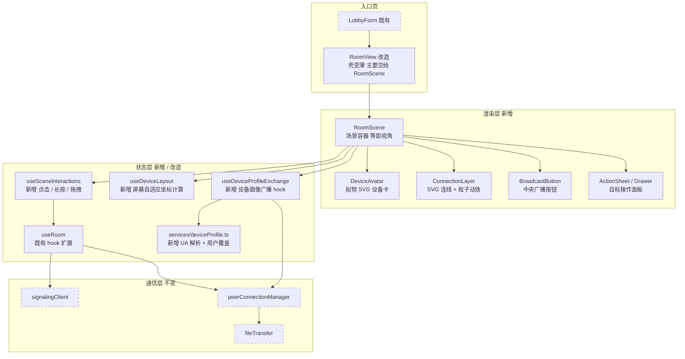
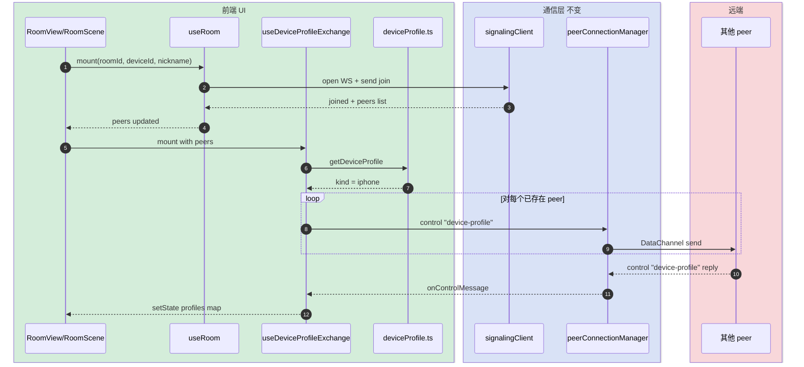
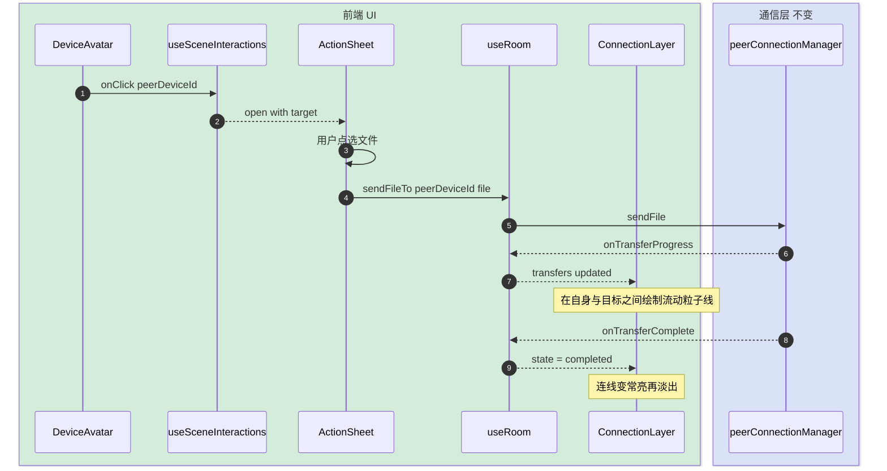
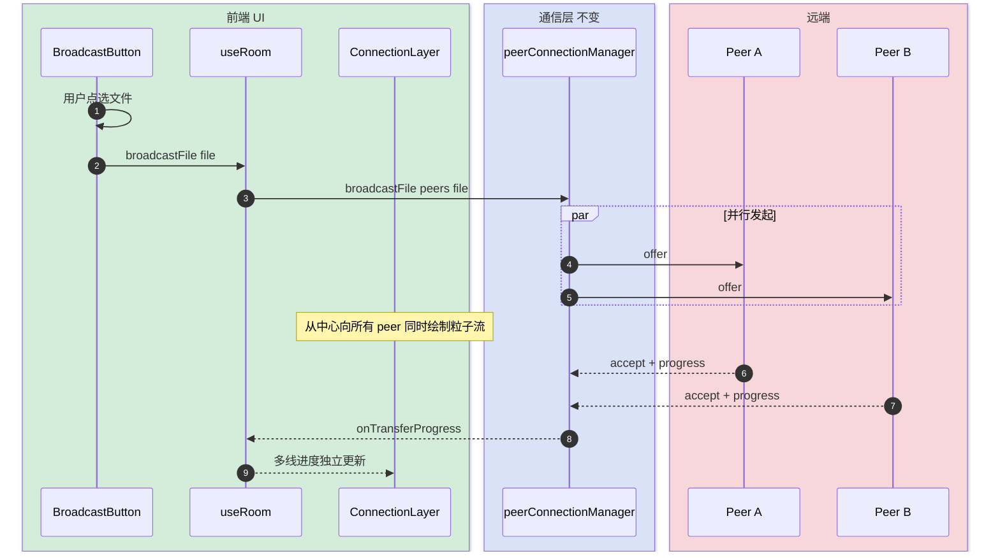
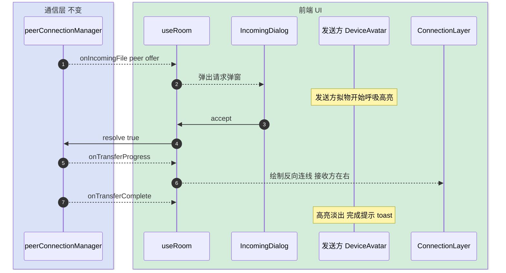
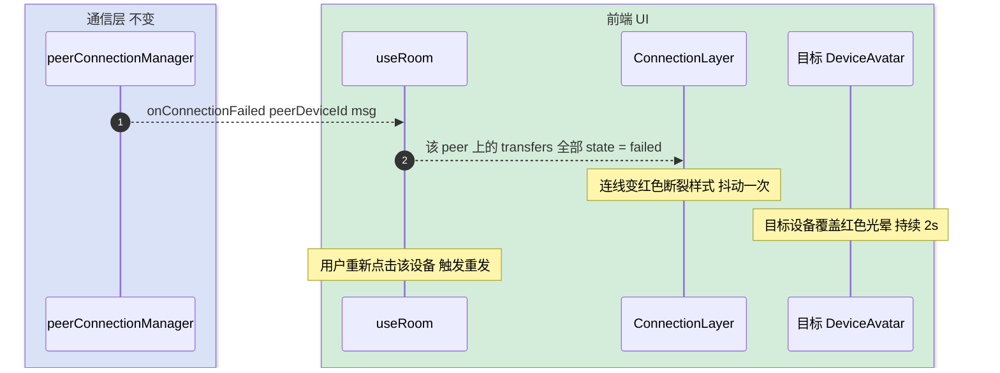

# 局域网文件传输 - 空间化交互改版（技术方案）

> **本文档定位**：lan-share 模块的**前端表现层与交互层**重构。
> 后端信令(`/api/lan-share/signaling`)与 ICE 配置接口(`/api/lan-share/ice-config`)、WebRTC 协商流程、DataChannel 文件分片协议**全部保持不变**。
>
> 本次改造只动 `frontend/src/features/lan-share/` 下的组件层、新增前端纯本地服务，不改后端、不改既有对外契约。

---

## 变更记录

| 版本 | 日期 | 修改人 | 变更内容摘要 |
|------|------|--------|--------------|
| current | 2026-05-05 | ping.yang | 初版：移动端优先的空间化拟物房间交互方案 |

---

## 1. 目标与边界

- **要解决的问题**：
  - 现有 RoomView 是普通卡片列表 + 下拉框，移动端长按浏览器使用时层级与点击区域不友好。
  - 找不到"谁是 iPhone、谁是 Mac"，多设备协作时心智成本高。
  - 单发/群发的目标选择走下拉框，缺少"选谁→发什么"的可视化反馈。

- **本次目标**：
  1. 把房间从「列表」改为「2.5D 等距拟物房间」：每位 peer 显示为对应平台的拟物外形（iPhone / iPad / Android Phone / Windows PC / MacBook / Linux / 通用）。
  2. 自动通过 UA 识别本机设备并广播给房间内其他人；用户可手动覆盖识别结果（一次设置，浏览器内持久化）。
  3. 交互改为"点击设备 → 底部 ActionSheet 选择文件 / 取消"，群发为中央广播按钮。
  4. 连接 / 协商 / 传输 / 失败四种状态用「连线颜色 + 数据粒子流」可视化呈现。
  5. 移动端竖屏与桌面端横屏自适应布局；触摸点击区域 ≥ 44x44px。

- **不做什么**：
  - **不**改 WebRTC 信令协议、ICE 协商、文件分片协议、后端 Java 代码。
  - **不**引入 three.js / WebGL；纯 SVG + CSS keyframes，移动端零额外包体压力。
  - **不**改 Peer / Transfer 等核心数据结构；只在前端内存里维护一张 `Map<deviceId, DeviceProfile>` 旁路状态。
  - **不**做 3D 房间 / 可旋转视角 / 物理引擎等额外娱乐性效果。
  - **不**改文件大小限制、传输并发数等业务参数。

- **设计结论（一句话）**：在不动信令与 WebRTC 协议的前提下，纯前端把 RoomView 重构成 `RoomScene`（2.5D 房间）+ `DeviceAvatar`（拟物设备）+ `ConnectionLayer`（SVG 连线动效）+ `ActionSheet/Drawer`（移动/桌面双形态目标选择面板），并通过 WebRTC DataChannel 在加入房间后互相交换设备画像（DeviceProfile）。

---

## 2. 整体架构

> 三层划分：**渲染层（拟物视觉）/ 状态层（房间 & 设备画像）/ 通信层（不变）**。
>
> 实线边框 = 本次新增；虚线边框 = 既有不变。箭头方向 = 数据/调用方向。



**关键设计点说明**：

1. **状态分离**：`useRoom`（已存在）继续承担信令 + 传输状态；新增 `useDeviceProfileExchange` 单独管设备画像（kind / model / colorHint），互不耦合。
2. **设备画像不进信令协议**：通过 WebRTC DataChannel 的 control 消息扩展（新增一类 `device-profile` 控制消息），后端零改动。
3. **渲染层与状态层一对多**：同一份 `peers + profiles + transfers` 状态可被 RoomScene、连线层、动效层共同消费。

---

## 3. 模块拆分与职责

### 3.1 RoomScene（场景容器）

- **定位**：取代 RoomView 的主体布局，承载等距 2.5D 视角下的设备拟物展示。
- **职责**：
  - 计算可视区尺寸 + 屏幕方向，传给 `useDeviceLayout` 得到设备坐标。
  - 渲染 `DeviceAvatar` 列表 + `ConnectionLayer` + `BroadcastButton` + `ActionSheet/Drawer`。
  - 暴露选中设备 / 目标设备 状态给子组件。
- **上游**：RoomView。
- **下游**：DeviceAvatar / ConnectionLayer / BroadcastButton / ActionSheet / useDeviceLayout / useSceneInteractions。
- **关键设计点**：
  - 等距视角通过 CSS `transform: rotateX(60deg) rotateZ(-45deg) scale(...)` 实现；底层是普通 div + SVG，不引入 3D 引擎。
  - 移动端竖屏（`window.innerHeight > window.innerWidth`）切换为"上下排布、本机置底中"；桌面端横屏走"中心 + 周围环绕"。

### 3.2 DeviceAvatar（拟物设备卡）

- **定位**：单个 peer / 自己的可视化呈现。
- **职责**：
  - 根据 `kind` 渲染对应平台拟物 SVG（iPhone 圆角刘海 / Android 椭圆指纹 / Windows 任务栏 / MacBook 翻盖 / iPad 横板 / Linux 通用 / Unknown）。
  - 根据 `state`（idle / connecting / connected / transferring / failed）切换底色光晕、呼吸动画、进度环。
  - 触摸事件：点击 = 选中目标；长按 = 显示信息弹窗；本机自身只接受长按改设备类型。
- **上游**：RoomScene。
- **下游**：无（叶子组件）。
- **关键设计点**：
  - SVG 内联在组件文件中，按 kind 走 switch；不走第三方图标库以保证视觉一致与极小体积。
  - 点击区域 ≥ 56x56px（移动端可达性）。
  - 设备显示昵称在拟物下方文字标签，溢出截断。

### 3.3 ConnectionLayer（连线 + 粒子动效层）

- **定位**：在房间画布上覆盖一层 absolute SVG，根据当前传输状态在两个设备之间绘制连线。
- **职责**：
  - 订阅 `transfers` + 设备坐标，对每条进行中的 transfer 绘制一根 path 连线。
  - 状态色映射：connecting=黄色虚线；connected=绿色实线；transferring=绿色实线 + 沿线移动的圆点粒子；failed=红色断裂线。
  - 群发期间，从中心广播按钮向所有目标同时绘制粒子流。
- **上游**：RoomScene。
- **下游**：无。
- **关键设计点**：
  - 粒子动效用 SVG `<animateMotion>` 沿 path，单根线最多 3 个粒子循环移动，不依赖 requestAnimationFrame 手撸，避免主线程压力。
  - 连线层 `pointer-events: none`，不影响下层设备点击。

### 3.4 BroadcastButton（中央广播按钮）

- **定位**：群发入口。
- **职责**：浮在场景中心，点击后弹出文件选择，选定后立即触发 `broadcastFile`。
- **关键设计点**：当 peers 为 0 时禁用并显示「等待其他设备加入」。

### 3.5 ActionSheet / Drawer（目标操作面板）

- **定位**：选中目标设备后的二级操作入口。
- **职责**：
  - 显示目标设备的昵称、kind 图标、连接状态。
  - 提供「选择文件并发送」「关闭」操作。
  - 移动端从底部弹出（ActionSheet），桌面端从右侧滑出（Drawer），共用同一份内容组件 `TargetActionPanel`。
- **关键设计点**：通过 CSS media query 切换渲染容器，不写两份业务逻辑。

### 3.6 services/deviceProfile.ts（UA 解析 + 用户覆盖）

- **定位**：本机设备画像生成与持久化。
- **职责**：
  - `detectDeviceKind()`：基于 `navigator.userAgentData`（优先）+ `navigator.userAgent`（兜底）+ `navigator.platform` 推断 DeviceKind。
  - `getOverride()` / `setOverride(kind)`：localStorage 持久化用户手选结果。
  - `getDeviceProfile()`：合并自动识别 + 用户覆盖，返回最终 `DeviceProfile { kind, modelHint?, colorHint? }`。
- **上游**：useDeviceProfileExchange。
- **关键设计点**：UA 解析为纯函数，无副作用，便于测试。

### 3.7 hooks/useDeviceProfileExchange（设备画像广播 hook）

- **定位**：把本机 profile 广播给房间内 peer，并维护远端 profile 缓存。
- **职责**：
  - 加入房间成功后，向所有现有 peer 通过 DataChannel 发送一条 `{ type: 'device-profile', profile }` 控制消息。
  - 监听 peer-joined 事件，向新人补发自己的 profile。
  - 监听对端发来的 `device-profile` 消息，更新 `Map<deviceId, DeviceProfile>` 并 setState 触发重渲染。
  - 自身 profile 由 `services/deviceProfile.ts` 提供。
- **上游**：RoomScene。
- **下游**：peerConnectionManager（控制通道）+ services/deviceProfile.ts。
- **关键设计点**：
  - 复用既有 control 通道，给 ControlMessage 联合类型新增一员 `{ type: 'device-profile'; profile: DeviceProfile }`，不破坏现有协议。
  - 兜底：未收到对端 profile 时，DeviceAvatar 渲染 unknown 通用图标。
  - 用户在房间内修改自己的 kind 时，立即重新广播一次。

### 3.8 hooks/useDeviceLayout（屏幕自适应坐标计算）

- **定位**：根据画布尺寸 + 设备数量 + 屏幕方向，输出每个 peer 的 `{ x, y, scale }`。
- **职责**：
  - 横屏：本机居中 + 其他 peer 围绕等距分布。
  - 竖屏：本机置底中 + 其他 peer 在上方网格。
  - 设备数 ≤ 6 用环形布局，≥ 7 切换为网格。
- **关键设计点**：纯函数 + useMemo，仅依赖 (peers, viewport, orientation)。

### 3.9 hooks/useSceneInteractions（交互编排）

- **定位**：把"点击设备/长按/选文件"等场景交互翻译成对 useRoom 的调用。
- **职责**：
  - 维护 `selectedTarget`（点选目标）、`actionPanelOpen`、`fileBeingSent`。
  - 调用 `useRoom.sendFileTo` / `broadcastFile`。
  - 拒绝在自身设备图标上发起发送。

---

## 4. 关键交互

> 5 张小时序图，每张只讲一件事；不合并成大图。

### 4.1 加入房间 + 设备画像首次广播

> **触发**：用户填完 LobbyForm 提交。
> **参与方**：UI / useRoom / signaling / RoomScene / useDeviceProfileExchange / 其他 peer。



### 4.2 点击设备 → 单点发送文件

> **触发**：用户在场景中点击某个 peer 的 DeviceAvatar。
> **参与方**：DeviceAvatar / useSceneInteractions / ActionSheet / useRoom / PCM。



### 4.3 群发广播

> **触发**：用户点击中央 BroadcastButton 选择文件。
> **参与方**：BroadcastButton / useRoom / ConnectionLayer / 所有 peer。



### 4.4 接收方接受文件

> **触发**：本机收到对端 offer 控制消息。
> **参与方**：PCM / useRoom / IncomingDialog / DeviceAvatar / ConnectionLayer。



### 4.5 连接失败 / 超时

> **触发**：PCM 上报 connection failed 或某次 sendFile 抛错。
> **参与方**：PCM / useRoom / DeviceAvatar / ConnectionLayer。



---

## 5. 核心业务规则

| 规则 | 说明 |
|------|------|
| 点击自身设备无效 | 自身 DeviceAvatar 单击不打开 ActionSheet；只允许长按弹出"修改设备类型"面板。 |
| 设备画像跨会话 | 用户手动覆盖的 kind 持久化在 `localStorage['lan-share.deviceKind']`；自动识别结果不持久化。 |
| 未收到对端 profile 时的兜底渲染 | 默认 kind = `unknown`，使用通用拟物图标，不阻塞文件传输。 |
| ActionSheet 打开期间不允许重复点选其他设备 | 单一选中焦点，避免误操作。 |
| 群发包含离线/未握手 peer 时 | PCM 内部按 peer 维度分别处理失败，UI 层不阻塞其他 peer 的传输。 |
| 设备数 0（仅自己） | 隐藏 BroadcastButton，DeviceAvatar 居中显示带"等待加入"文字提示。 |
| 移动端文件选择器 | 直接复用既有 `<input type=file>`，不引入 capture 等扩展属性，避免 iOS Safari 兼容问题。 |
| Mock 模式兼容 | `isMockEnabled()` 下 useDeviceProfileExchange 走 mockOrchestrator 路径，不发真实控制消息；mock 时给虚拟 peer 各分配一个固定 DeviceKind。 |

---

## 6. 编码落点

```text
frontend/src/features/lan-share/
├── components/
│   ├── RoomView.tsx                    [修改] 壳层精简，挂载 RoomScene；保留离开按钮 + 房间号 Badge
│   ├── LobbyForm.tsx                   [不变]
│   ├── IncomingDialog.tsx              [修改] 顶部加发送方 kind 图标，弱视觉调整
│   ├── TransferList.tsx                [修改] 列表项左侧加 peer kind 小图标，桌面端可折叠
│   ├── PeerList.tsx                    [删除] 由 RoomScene + DeviceAvatar 取代
│   ├── FileSender.tsx                  [删除] 由 ActionSheet + BroadcastButton 取代
│   └── scene/
│       ├── RoomScene.tsx               [新增] 等距 2.5D 场景容器
│       ├── DeviceAvatar.tsx            [新增] 拟物设备 SVG + 状态光晕 + 进度环
│       ├── ConnectionLayer.tsx         [新增] SVG 连线 + 粒子动效层
│       ├── BroadcastButton.tsx         [新增] 中央广播按钮
│       ├── TargetActionPanel.tsx       [新增] ActionSheet/Drawer 内容组件
│       ├── DeviceKindIcon.tsx          [新增] kind 到 SVG 的映射
│       └── styles.module.css           [新增] 等距视角 + 呼吸光晕 keyframes
├── hooks/
│   ├── useRoom.ts                      [修改] 增加 control message 路由 device-profile；其余不变
│   ├── useDeviceProfileExchange.ts     [新增] 本机 profile 广播 + 远端 profile 缓存
│   ├── useDeviceLayout.ts              [新增] 屏幕自适应坐标计算
│   └── useSceneInteractions.ts         [新增] 点击 / 长按 / 选文件编排
├── services/
│   ├── deviceProfile.ts                [新增] UA 解析 + localStorage 覆盖
│   ├── peerConnectionManager.ts        [修改] ControlMessage 联合新增 device-profile；onControlMessage 路由
│   ├── fileTransfer.ts                 [不变]
│   ├── signalingClient.ts              [不变]
│   ├── identity.ts                     [不变]
│   └── mockOrchestrator.ts             [修改] 给 mock peers 分配 DeviceKind，模拟 device-profile 交换
├── pages/
│   └── LanSharePage.tsx                [不变]
├── types.ts                            [修改] 新增 DeviceKind / DeviceProfile；ControlMessage 联合追加 device-profile
├── mock.ts                             [修改] mock peers 标注 deviceKind
└── index.tsx                           [不变]
```

### 调用关系说明

- `RoomView` → `RoomScene` → `useDeviceLayout` + `useSceneInteractions` + `useDeviceProfileExchange`
- `useDeviceProfileExchange` → `peerConnectionManager.broadcastControl()` + `services/deviceProfile.ts`
- 既有 `useRoom` 增加一处分发：收到 `device-profile` 控制消息时，转交 `useDeviceProfileExchange` 暴露的 callback。

---

## 7. 数据与依赖变更

| 类型 | 是否变化 | 说明 |
|------|----------|------|
| 数据库表 / 字段 / 索引 | 无 | 后端零改动 |
| DTO / VO / 枚举 | 有（前端） | 新增 `DeviceKind` 枚举（iphone/ipad/android-phone/android-tablet/windows/mac/linux/unknown）+ `DeviceProfile` 类型；`ControlMessage` 联合追加 `{ type: 'device-profile'; profile: DeviceProfile }` |
| 下游接口 / 外部依赖 | 无 | WebSocket 信令、HTTP `/ice-config`、WebRTC 协商均不变 |
| 缓存 / 消息 / 锁 / 事务 | 有（轻量） | 浏览器 localStorage 新增 key `lan-share.deviceKind` 持久化用户覆盖 |
| 第三方包 | 无 | 不引入 three.js / r3f / framer-motion；动效用 CSS keyframes + SVG `<animateMotion>` |

---

## 8. 风险与待确认

| 风险 / 待确认点 | 影响 | 处理方式 |
|----------------|------|----------|
| iOS Safari 对 `userAgentData` 不支持 | UA 解析回退到旧 `navigator.userAgent` | 解析函数保留双路径，兜底 `unknown` |
| 等距视角在小屏（< 360px 宽）会过度压缩拟物 | 设备图标过小 | 屏宽 < 360 时自动切换为竖向列表卡，不强行 2.5D；保留新视觉但放弃等距投影 |
| SVG `<animateMotion>` 在 Firefox Android 偶发卡顿 | 粒子动效不顺滑 | 通过 `prefers-reduced-motion` 媒体查询关闭粒子动效，仅保留静态连线 |
| 设备数 ≥ 8 时环形布局拥挤 | 可点击区域重叠 | useDeviceLayout 在 ≥ 7 时切换为 3 列网格 |
| 用户长按修改 kind 后的回填时机 | profile 重广播时刻 | setOverride 后立即调用 `useDeviceProfileExchange.broadcast()`，不等下次心跳 |
| 既有 `peerConnectionManager` 的 ControlMessage 路由耦合 | 新增 control 类型需小改 PCM | 在 PCM 已有 onMessage 分支上加一个 case 'device-profile'，保持其它分支不变 |
| Mock 模式联调 | mock 路径不能广播真实 control | mockOrchestrator 内部直接用 setState 喂入 profileMap，绕过 PCM |

---

## 9. 验证要点

- **正常路径**：
  - 移动端 Safari + Chrome 各打开一个房间，互相收到对方设备拟物（iPhone / Android）。
  - 桌面端 Chrome + macOS Chrome 互发，连线粒子流可见。
  - 中央广播按钮发送 1 个文件给 ≥ 2 个 peer，所有 peer 同步显示进度。

- **异常路径**：
  - 网络断开后再连，连线变红 + 设备红色光晕，重发后恢复绿色。
  - 接收方拒收，连线虚化淡出，发送方拟物状态回 idle。
  - 仅自己一人在房间，BroadcastButton 禁用，所有点击无反应（合预期）。

- **边界条件**：
  - 屏宽 < 360px 自动降级为竖向列表卡。
  - 设备数 = 8 时网格布局可点击。
  - `prefers-reduced-motion: reduce` 时粒子动效关闭。
  - 用户长按本机改 kind 后，对端在 < 1s 内看到图标更新。

- **回归范围**：
  - LobbyForm 加入流程（不变，但需冒烟）。
  - IncomingDialog 接收弹窗（仅视觉微调）。
  - TransferList 历史列表（仅左侧加 kind 图标）。
  - 大文件提示弹窗（不变）。
  - Mock 模式（必须能正常切换并显示虚拟设备）。

---

## 附：DeviceKind 枚举定义

```text
DeviceKind:
  | 'iphone'          // iOS Phone
  | 'ipad'            // iPadOS Tablet
  | 'android-phone'   // Android Phone
  | 'android-tablet'  // Android Tablet
  | 'windows'         // Windows PC / Laptop
  | 'mac'             // macOS Laptop / Desktop
  | 'linux'           // Linux Desktop
  | 'unknown'         // 兜底
```

`DeviceProfile = { kind: DeviceKind; modelHint?: string; colorHint?: string }`，modelHint / colorHint 当前版本仅占位，未来可承载机型与配色微调。
