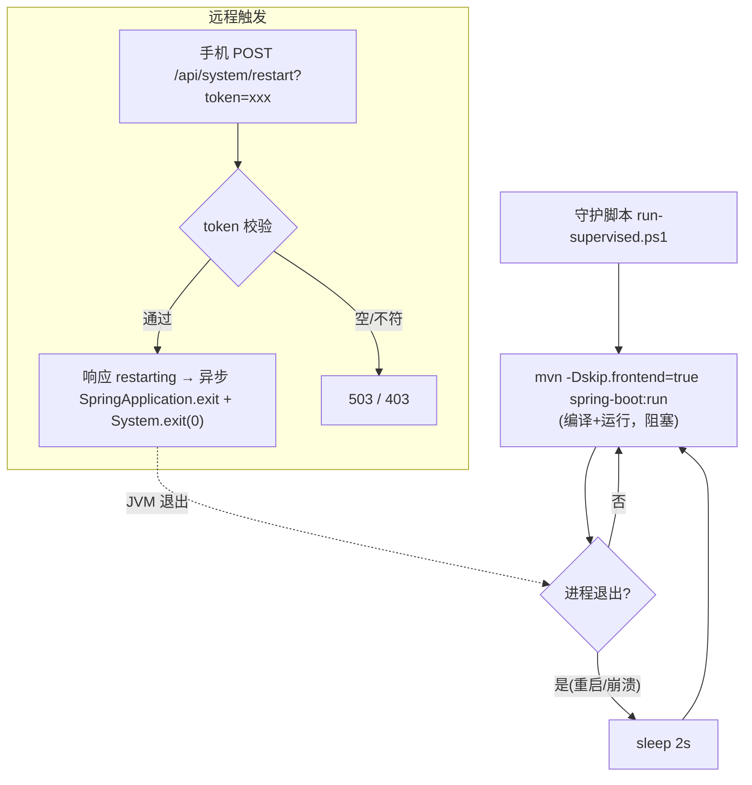

# 应用守护与远程重启 — 轻量设计

> 目标：后端经守护脚本常驻运行，崩溃/主动重启都自动重新编译并拉起；提供带 token 的 HTTP 端点，让手机能远程触发重启（应用新 Java 代码）。前端 `npm run dev` 自热更，不参与。
> 最后更新：2026-06-03

## 1. 代码入口

```text
scripts/run-supervised.ps1                                  [新增] 守护脚本：循环 mvn spring-boot:run，退出即重编译+重起
toolbox-starter/src/main/java/com/exceptioncoder/toolbox/system/SystemController.java   [新增] POST /api/system/restart（token 校验 → System.exit）
toolbox-starter/src/main/java/com/exceptioncoder/toolbox/system/SystemProperties.java   [新增] toolbox.system.* 配置（restart-token）
toolbox-starter/src/main/resources/application.yml          [修改] 增 toolbox.system.restart-token（默认空=禁用）
```

## 2. 接口契约

| 方法 | 路径 | 入参 | 出参 | 说明 |
|------|------|------|------|------|
| POST | `/api/system/restart` | `token`（query/header `X-Restart-Token`） | `{ "status": "restarting" }` | 校验通过后异步 `System.exit(0)`，守护脚本随即重起 |

- **token 未配置（空）** → `503`「restart 未启用」（公网 tunnel 下默认关闭，必须显式配 token 才开）。
- **token 不匹配** → `403`。

## 3. 核心流程



## 4. 关键规则

| 规则 | 说明 |
|------|------|
| 守护循环 | `while: mvn spring-boot:run; 退出→sleep 2s→再来`。spring-boot:run 每轮先编译，故重起即应用磁盘上最新 Java |
| Maven 路径 | 脚本顶部 `$MvnCmd` 变量（填 mvn.cmd 全路径；留空用 PATH 的 mvn）。本机无 PATH mvn，需填 |
| 前端不参与 | `-Dskip.frontend=true`，前端 `npm run dev` 自热更 |
| token 必填才开 | 端点经公网 tunnel 暴露，`restart-token` 为空时端点直接 503 关闭，杜绝公网裸开关 |
| 优雅退出 | `SpringApplication.exit(ctx)` 先跑 @PreDestroy（杀 sidecar 等）再 `System.exit(0)`，让守护干净重起 |
| 会话必断 | 重启会杀 sidecar = 当前 claude-chat 会话中断，靠浏览器/ sidecar 自动重连恢复（物理限制） |

## 5. 失败行为

- token 未配 → `503`，不退出。
- token 错 → `403`，不退出。
- `mvn` 路径错/编译失败 → spring-boot:run 非 0 退出，守护脚本 sleep 后**重试下一轮**（会一直重试；编译错需你修代码后才能起来——日志可见）。
- 应用崩溃 → 守护自动拉起（兜底）。
