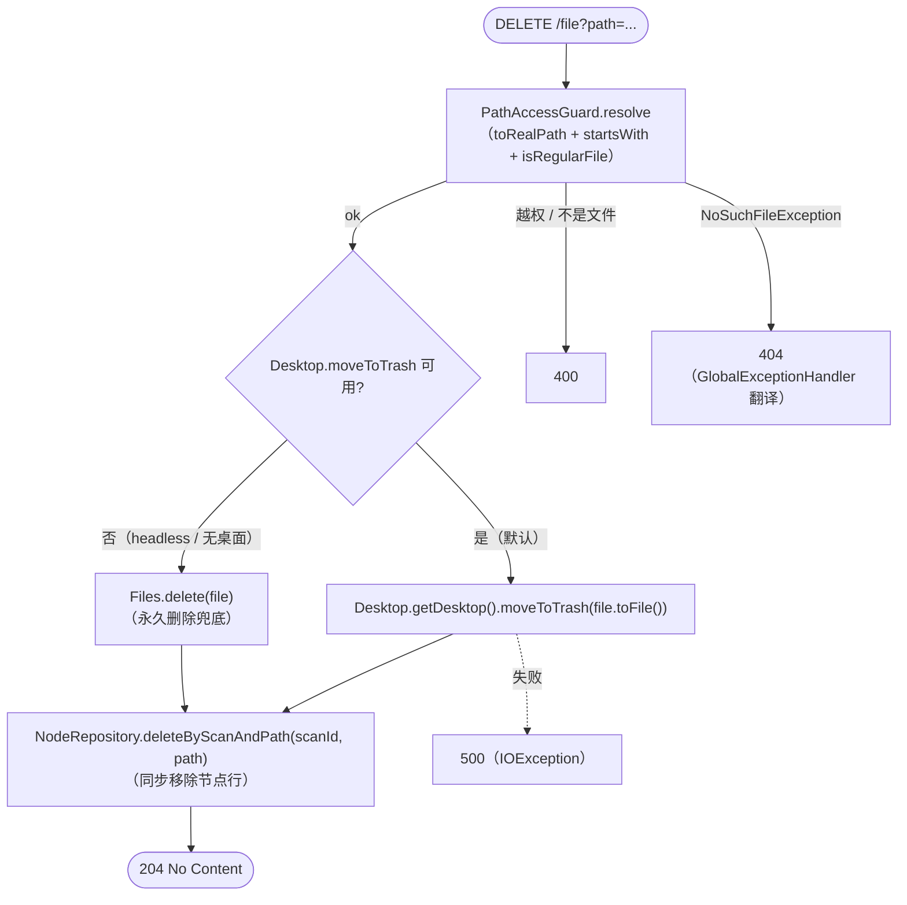

# 文件删除（轻量设计）

> 最后更新：2026-05-05
> 模版：lightweight-template.md

## 1. 代码入口

| 角色 | 全路径 |
|------|--------|
| Controller | `com.exceptioncoder.toolbox.treesize.api.TreeSizeController#deleteFile` |
| Service | `com.exceptioncoder.toolbox.treesize.service.FileDeleteService#deleteByPath` |
| Repo（已有，加方法） | `com.exceptioncoder.toolbox.treesize.repository.NodeRepository#deleteByScanAndPath` |
| 前端 | `frontend/src/features/treesize/components/ChildrenList.tsx`（行尾加 trash 按钮）+ `api.ts#deleteFile` |

## 2. 接口契约

`DELETE /api/treesize/scans/{id}/file?path=<encoded>`

| 入参 | 位置 | 说明 |
|------|------|------|
| `id` | path | scan id |
| `path` | query | 目标文件绝对路径，必须落在 scan root 下 |

| 状态 | 场景 | body |
|------|------|------|
| 204 | 成功 | 无 |
| 400 | path 越权 / 不是普通文件（目录拒绝） | `{message: "..."}` |
| 404 | 文件不存在（已被外部删除） | `{message: "file not found"}` |
| 500 | 删除失败（占用 / 权限） | `{message: "..."}` |

## 3. 核心流程

## 4. 关键过滤/写入规则

| 规则 | 说明 |
|------|------|
| **只允许删除文件**，不允许目录 | `Files.isRegularFile(realPath)`；目录返回 400，提示去文件管理器 |
| **优先回收站**，失败兜底永久删除 | `Desktop.moveToTrash` 在 Windows / macOS / 多数 Linux 桌面上把文件丢到回收站；服务器 / 无 GUI 环境会失败，此时回退到 `Files.delete` |
| **路径校验同 PathAccessGuard 现有逻辑** | `toRealPath()` 解符号链接；要求 `realPath.startsWith(scanRootRealPath)` |
| **节点行同步删除** | `treesize_node` 表里把对应行删掉。父目录的聚合数据**不更新**（保留扫描时刻语义；用户想要新数据请重新扫描） |
| **统计字段不更新** | `treesize_scan.total_files / total_size` 保留扫描时刻数值，不在删除时回算 |

## 5. 失败行为

| 场景 | 行为 |
|------|------|
| 入参 `path` 缺失 | Spring `@RequestParam` 校验报 400 |
| `path` 在 scan root 之外（含通过 symlink 越权） | `IllegalArgumentException` → 400 |
| `path` 是目录 | `IllegalArgumentException("not a regular file")` → 400 |
| `path` 已不存在 | `NoSuchFileException` → 404（现有 handler 翻译） |
| 删除时 IO 失败（被占用 / 无权限） | `IOException` → 500，原始 message 透传给前端 |
| `Desktop.moveToTrash` 不可用 | 自动回退 `Files.delete`；DEBUG 日志留底 |

## 6. UI 行为

- 文件行 **悬停**时右侧显示 trash 图标；点击 → 复用 `useConfirm` 弹强提示（红色 destructive 变体）→ 确认后调 `deleteFile` → 失败弹错误 toast / 成功 invalidate `treesize-children` query 自动刷新
- 目录行**不显示** trash（避免误删）
- 父目录的聚合（在 BreadcrumbNav 上方那个统计数）保持不变，重新扫描后才更新

## 7. 不做

- 多选 / 批量删除（v2 再加）
- 拖拽到回收站
- 撤销 / 回滚
- 父目录聚合数实时更新
