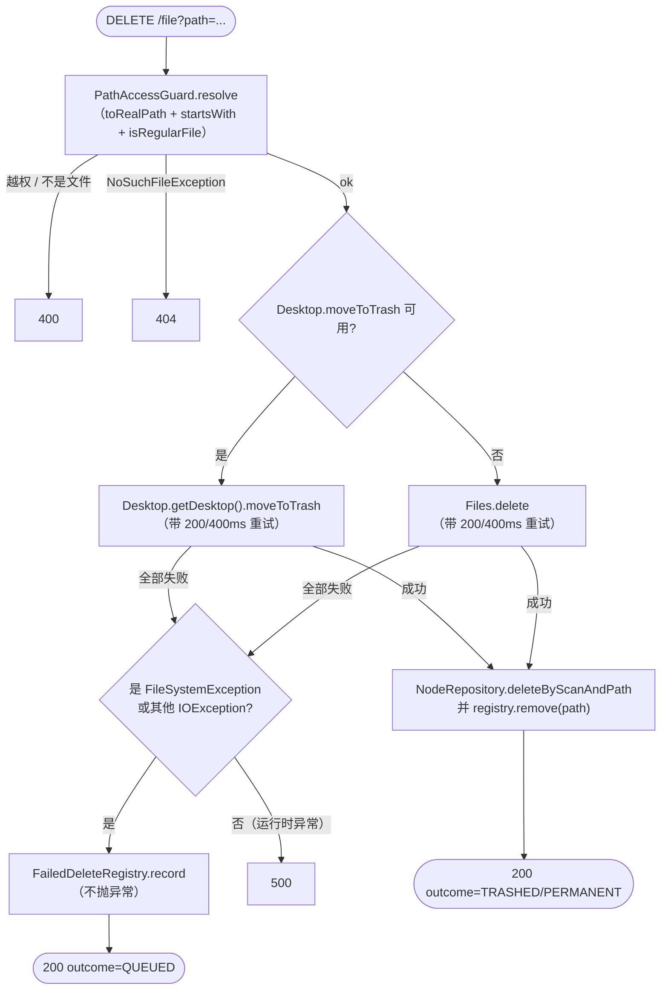
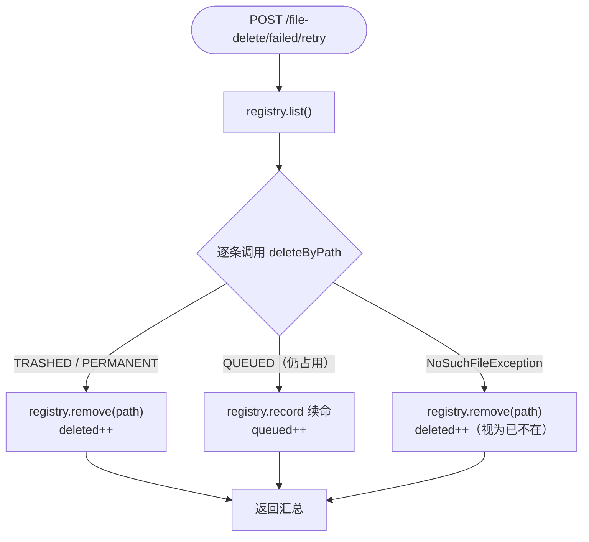

# 文件删除（轻量设计）

> 最后更新：2026-05-16
> 模版：lightweight-template.md

## 1. 代码入口

| 角色 | 全路径 |
|------|--------|
| Controller | `com.exceptioncoder.toolbox.treesize.api.TreeSizeController#deleteFile` / `#listFailedDeletes` / `#retryFailedDeletes` / `#clearFailedDeletes` / `#removeFailedDelete` |
| Service | `com.exceptioncoder.toolbox.treesize.service.FileDeleteService#deleteByPath` / `#retryAllFailed` |
| Registry（新增） | `com.exceptioncoder.toolbox.treesize.service.FailedDeleteRegistry` |
| Domain（新增） | `com.exceptioncoder.toolbox.treesize.domain.FailedDelete` · `DeleteOutcome` |
| DTO（新增） | `com.exceptioncoder.toolbox.treesize.api.dto.FailedDeleteView` · `RetryFailedDeletesResultView` |
| Repo（已有） | `com.exceptioncoder.toolbox.treesize.repository.NodeRepository#deleteByScanAndPath` |
| 前端 | `frontend/src/features/treesize/components/ChildrenList.tsx`（行尾加 trash 按钮）+ `api.ts#deleteFile` |

## 2. 接口契约

### 2.1 单文件删除

`DELETE /api/treesize/scans/{id}/file?path=<encoded>`

| 入参 | 位置 | 说明 |
|------|------|------|
| `id` | path | scan id |
| `path` | query | 目标文件绝对路径，必须落在 scan root 下 |

| 状态 | 场景 | body |
|------|------|------|
| 200 | 成功移到回收站 | `{outcome: "TRASHED"}` |
| 200 | 永久删除兜底 | `{outcome: "PERMANENT"}` |
| 200 | 占用 / IO 失败，已加入失败清单 | `{outcome: "QUEUED", reason: "..."}` |
| 400 | path 越权 / 不是普通文件（目录拒绝） | `{message: "..."}` |
| 404 | 文件不存在（已被外部删除） | `{message: "file not found"}` |
| 500 | 真正未预期的运行时异常（**不**包含文件占用） | `{message: "..."}` |

### 2.2 失败清单查询

`GET /api/treesize/file-delete/failed`

返回：`FailedDeleteView[]`，按 `lastAttemptAt` 倒序。

```json
[{"scanId":"...","path":"E:\\...rmvb","reason":"另一个程序正在使用此文件...","attempts":2,"lastAttemptAt":1715865632000}]
```

### 2.3 批量重试

`POST /api/treesize/file-delete/failed/retry`

返回：`RetryFailedDeletesResultView`

```json
{
  "attempted": 5,
  "deleted": 3,
  "queued": 2,
  "remaining": [{"scanId":"...","path":"...","reason":"...","attempts":3,"lastAttemptAt":...}]
}
```

### 2.4 失败清单维护

| 方法 | 路径 | 用途 |
|------|------|------|
| `DELETE` | `/api/treesize/file-delete/failed` | 清空整个清单 |
| `DELETE` | `/api/treesize/file-delete/failed/entry?path=<encoded>` | 移除单条（手动从外部已处理） |

返回 204。

## 3. 核心流程



批量重试流程：



## 4. 关键过滤/写入规则

| 规则 | 说明 |
|------|------|
| **只允许删除文件**，不允许目录 | `Files.isRegularFile(realPath)`；目录返回 400 |
| **优先回收站**，失败兜底永久删除 | `Desktop.moveToTrash` 在 Windows / macOS / 多数 Linux 桌面上把文件丢到回收站；服务器 / 无 GUI 环境会失败，此时回退到 `Files.delete` |
| **占用类失败不再抛 500** | 任何 `FileSystemException` / `IOException`（除 `NoSuchFileException`）在重试耗尽后改为加入 `FailedDeleteRegistry`，response 用 `outcome=QUEUED` 提示前端 |
| **运行时异常仍透传** | 非 IO 类异常（`SecurityException` / 编程错误）保持 500，由 GlobalExceptionHandler 处理 |
| **路径校验同 PathAccessGuard 现有逻辑** | `toRealPath()` 解符号链接；要求 `realPath.startsWith(scanRootRealPath)` |
| **节点行同步删除** | 真删成功后才删 `treesize_node`；QUEUED 状态保留行 |
| **统计字段不更新** | `treesize_scan.total_files / total_size` 保留扫描时刻数值 |
| **重试不走 PathAccessGuard** | 重试用 registry 内已 trust 的绝对路径（首次入库时已校验过 scan-root） |
| **registry 有界** | 内存中最多保留 500 条；超出按 `lastAttemptAt` 最早的条目逐出 |
| **重试时 NoSuchFile 视为成功** | 用户已手动删除或文件不存在 → 从 registry 移除并计入 deleted |

## 5. 失败行为

| 场景 | 行为 |
|------|------|
| 入参 `path` 缺失 | Spring `@RequestParam` 校验报 400 |
| `path` 在 scan root 之外（含通过 symlink 越权） | `IllegalArgumentException` → 400 |
| `path` 是目录 | `IllegalArgumentException("not a regular file")` → 400 |
| `path` 已不存在（首次删除） | `NoSuchFileException` → 404 |
| 删除时 IO 失败（占用 / 临时无权限） | 重试耗尽 → registry 记录 → 200 `outcome=QUEUED`，**不**抛 500 |
| `Desktop.moveToTrash` 不可用 | 自动回退 `Files.delete`；DEBUG 日志留底 |
| 重试时文件已被外部删除 | 视为成功，移出 registry |
| registry 满 500 条 | 逐出最久未操作的条目（LRU-by-lastAttemptAt） |

## 6. UI 行为

- 文件行 **悬停**时右侧显示 trash 图标；点击 → 复用 `useConfirm` 弹强提示（红色 destructive 变体）→ 确认后调 `deleteFile`
- `outcome === 'QUEUED'`：toast 提示「文件被占用，已加入失败清单，关闭占用程序后可批量重试」；行**保持**显示
- `outcome === 'TRASHED' | 'PERMANENT'`：成功 toast + invalidate `treesize-children` query 自动刷新
- 目录行**不显示** trash（避免误删）
- 失败清单 UI（侧栏/页脚徽标，单独迭代）：调用 GET / POST retry / DELETE clear 三件套

## 7. 不做

- **进程级解除占用**：不引入 JNA + Win32 RestartManager 杀进程方案；由用户手动关闭占用程序后批量重试覆盖
- 多选 / 批量删除（v2 再加）
- 拖拽到回收站
- 撤销 / 回滚
- 父目录聚合数实时更新
- 失败清单持久化（重启即清空，符合"临时占用"语义）
