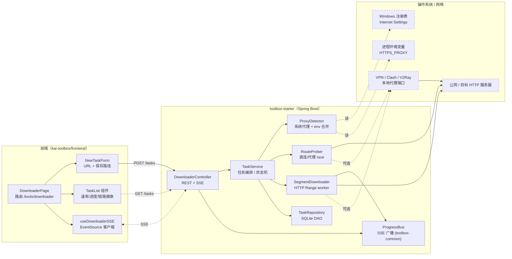
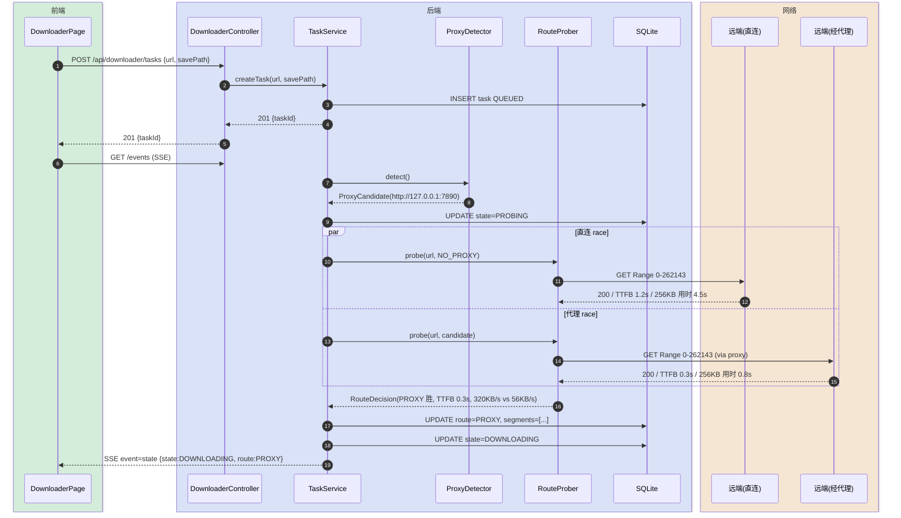
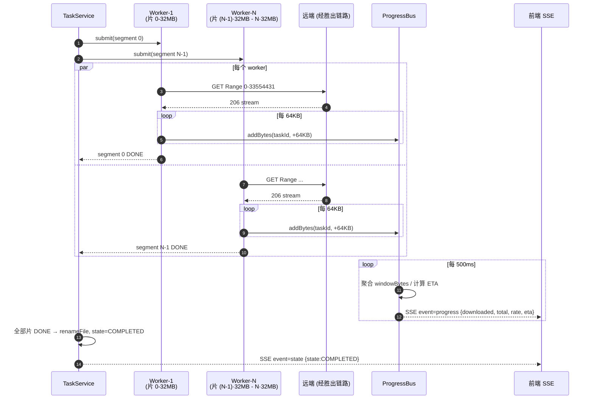
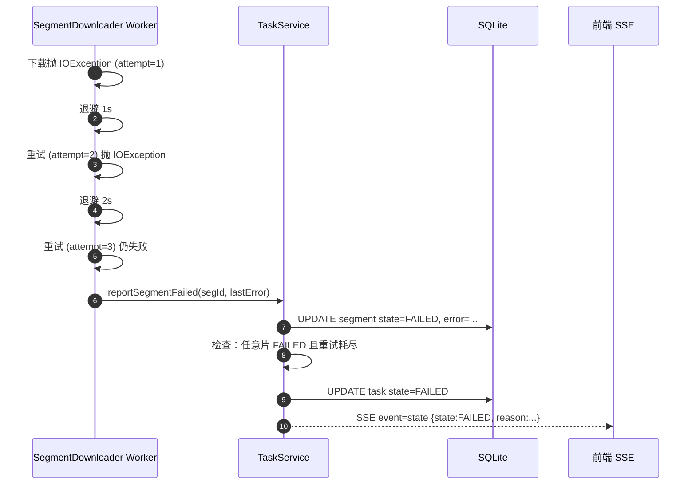
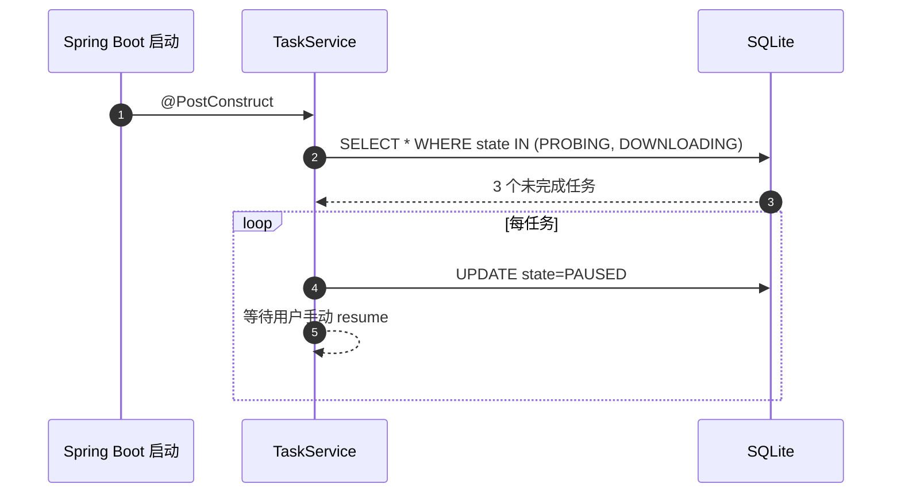

# 智能加速下载器

> 最后更新：2026-05-25
> 模版：完整-技术（template-tech）

让用户在 kai-toolbox 里粘贴一个 URL（任意 HTTP/HTTPS 直链）就开始下载，**自动探测系统代理（VPN / Clash / 公司代理）并在直连与代理两条链路里挑速度更快的那条，再用 HTTP Range 分段并发把大文件拉下来**。目标场景是替代 Chrome 单连接、单链路下载 351MB Lark 安装包需要 45 分钟的体验。

---

## 1. 目标与边界

### 1.1 要解决的问题

- Chrome 等浏览器默认单连接下载，长肥管道下吞吐打不满
- 系统装了 VPN（Clash / V2Ray 等）后，部分站点直连快、部分代理快，浏览器一刀切走系统代理或全部直连，体验差
- 大安装包（300MB+）下载中断后需要从头来过

### 1.2 本次目标

- 新增 Maven 模块 `tool-downloader`，作为 kai-toolbox 的标准工具页
- 自动探测 Windows 系统代理 + 进程环境变量 `HTTP(S)_PROXY` + JVM `-Dhttp.proxyHost`，无需用户配置
- 对每个新增任务做一次「直连 vs 代理」链路 race：256KB 测速 + TTFB 比较，选更快的一条
- 链路确定后，对支持 `Accept-Ranges: bytes` 的资源做 32MB 分片、最多 8 路并发
- 任务、分片、断点位置持久化到 SQLite，进程重启可续传
- 前端用 SSE 实时推送速率与进度

### 1.3 不做什么

| 不做 | 原因 |
|------|------|
| 第三方下载协议（FTP / BT / 磁力 / ed2k） | 本期收敛到 HTTP/HTTPS 直链；BT 复杂度大且不解决用户当前痛点 |
| 浏览器集成 / 嵌入式扩展 | 项目定位是本地工具箱网页，不做浏览器扩展 |
| 多用户、鉴权、跨设备同步 | kai-toolbox 全局约束「local single-user」 |
| 自定义 socks5 / 自带代理客户端 | 系统已有 VPN/Clash，复用即可；不重新造代理栈 |
| 智能选择最佳 CDN 节点（多源下载） | 仍未做。需要绕过 JDK 内置 DNS 解析，工程量较大；下个迭代评估换 OkHttp 时一并做 |
| 多源 / Metalink | 私有 CDN 用不上；开源软件场景才有价值，本期不收 |
| TLS 指纹混淆 | 需要换 OkHttp / native TLS 栈，工程成本高；本期不收 |

### 1.4 设计结论

- **HTTP 客户端**：Java 21 内置 `java.net.http.HttpClient`，原生支持 HTTP/2、`ProxySelector`、虚拟线程，无新增第三方依赖。**已知局限**：body 读取阶段没有 read-idle 超时，需自行用守门狗实现（见第 10 节「踩坑实录」）；如未来要做自定义 DNS / TLS 指纹混淆，将换 OkHttp
- **HTTP 版本**：显式声明 HTTP/2 优先，ALPN 协商成功时所有 Range 请求复用同一 TCP 连接的不同 stream，服务端看到的是单客户端开多 stream（H2 设计上欢迎），显著降低被识别为「同 IP 多 socket 抓取」而限流的概率；协商失败 JDK 自动回退 HTTP/1.1
- **代理探测**：启动期 + 任务期双层探测。启动期在 `toolbox-starter` 设 `java.net.useSystemProxies=true`（让 JDK 读 Windows 注册表的 Internet Settings）；任务期再读一次环境变量 `HTTPS_PROXY` / `HTTP_PROXY`，覆盖式合并，得到最终代理候选清单
- **链路选择**：对每个新任务做 race —— 直连和代理各发一次 `Range: bytes=0-262143`（256KB），比较 TTFB + 吞吐，胜者作为本任务**主链路**；另一侧若也能跑则保留为**备用链路**
- **per-segment fallback**：单片在主链路上重试耗尽后**自动切换到备用链路再试一轮**。任务上下文 `RuntimeContext` 同时持主备两个 HttpClient，单片粒度选路
- **自适应并发**：每任务维护 `effectiveParallel` + Semaphore 闸；窗口失败率 > 50% 时永久占住部分 permits，把并发**只降不升**（4 → 2 → 1）。HTTP 429 直接降半。重新建任务从默认值起步。不主动回升，避免抖动
- **stalled 探测（read-idle 守门狗）**：所有 worker 共享一个 `ScheduledExecutorService`，每秒检查每片的 `lastReadAt`，超过 `readIdleTimeoutMs`（默认 30s）就 `close(stream)` 让阻塞的 `read()` 抛 `IOException`，进入正常重试。这是 JDK 阻塞 IO **唯一可靠**的「卡死探测」方式
- **分片策略**：race 返回的响应头解析 `Content-Length` + `Accept-Ranges`，省去单独的 HEAD 请求。支持 Range → 按 32MB 切片、默认 4 路并发；不支持 → 单连接顺序下载。切片大小、并发数可在 `application.yml` 调
- **重试策略**：单片 6 次重试，退避序列 1s / 2s / 4s / 8s / 16s / 30s（封顶 30s），每次叠加 ±50% jitter 错开多片同时撞服务端。总最长约 1 分钟单片
- **任务收尾原则**：单片失败**不直接拖垮整个任务**。所有兄弟片各自跑完到终态后才聚合判定：全 DONE → COMPLETED；至少 1 FAILED → 任务整体 FAILED，错误信息形如「3/11 片失败：xxx」
- **任务状态机**：`QUEUED → PROBING → DOWNLOADING ⇄ PAUSED → COMPLETED / FAILED`；FAILED 可通过 resume 回到 QUEUED 重新探测（**FAILED 不再是绝对终态**，用户点「继续」相当于换链路重试）
- **持久化**：复用 toolbox-common 的 SQLite 基础设施。两张表：`tool_downloader_task`（任务元信息 + 链路决策结果）、`tool_downloader_segment`（每片 offset/length/bytes_downloaded/state）
- **临时文件**：下载目标 `<savePath>/<filename>.kdownload`（预分配文件，按 offset 写入），完成后改名去掉 `.kdownload`；切片状态由数据库表承担，不再写 `.idx` 边车文件
- **进度推送**：SSE，每 500ms 聚合一次任务全局速率与各片进度，避免事件风暴

---

## 2. 整体架构



**关键边解释：**

- `ProxyDetector` 只「读」环境，不修改任何系统配置
- `RouteProber` 是一次性短探测器，对外有 2 次 256KB 请求；`SegmentDownloader` 复用 race 选出的链路，不再询问
- VPN 客户端被画成可选节点：直连胜出时整条边走 `NET`，代理胜出时走 `VPN → NET`

---

## 3. 模块拆分与职责

### 3.1 DownloaderController（api 层）

- **定位**：REST + SSE 入口，薄壳
- **职责**：
  - 接收创建/查询/暂停/恢复/删除任务的 HTTP 请求，做参数校验后转交 `TaskService`
  - 持有 SSE 端点 `/api/downloader/tasks/{id}/events`，从 `ProgressBus` 订阅指定任务事件并下发
- **上游**：浏览器前端
- **下游**：`TaskService`、`ProgressBus`
- **关键设计点**：
  - SSE 心跳 15 秒一次，避免反向代理（Vite dev server）切断长连接
  - 不在 Controller 做任何 IO 阻塞

### 3.2 TaskService（service 层 · 任务编排）

- **定位**：任务生命周期编排器
- **职责**：
  - 维护任务状态机 `QUEUED → PROBING → DOWNLOADING ⇄ PAUSED → COMPLETED / FAILED`，所有状态切换走单一入口
  - 提交任务时调度 `ProxyDetector` + `RouteProber`，写入决策结果；调度 `SegmentDownloader` 池执行分片
- **上游**：`DownloaderController`
- **下游**：`ProxyDetector` / `RouteProber` / `SegmentDownloader` / `TaskRepository` / `ProgressBus`
- **关键设计点**：
  - 用 Java 21 虚拟线程（`Executors.newVirtualThreadPerTaskExecutor()`）跑分片 worker，避免大文件下载时阻塞平台线程
  - 进程启动时扫描 SQLite 中处于 `DOWNLOADING`/`PROBING` 的任务，自动转 `PAUSED`，等用户手动恢复（避免无人值守的下载占满带宽）

### 3.3 ProxyDetector（service 层 · 代理探测）

- **定位**：系统代理探测器，纯读
- **职责**：
  - 合并三个源得到代理候选：`-Dhttp.proxyHost/Port` JVM 参数 → `HTTPS_PROXY` / `HTTP_PROXY` 环境变量 → `ProxySelector.getDefault()`（在 `useSystemProxies=true` 下读 Windows 注册表）
  - 输出一个 `ProxyCandidate`（type / host / port / 来源），供 `RouteProber` 使用
- **上游**：`TaskService`、`DownloaderController`（手动触发探测接口）
- **下游**：JDK `ProxySelector`、`System.getenv`
- **关键设计点**：
  - 不持久化，每次任务都重读一次（用户随时可能启停 VPN）
  - 仅在 toolbox-starter 启动入口设置一次 `System.setProperty("java.net.useSystemProxies", "true")`，避免静态状态污染

### 3.4 RouteProber（service 层 · 链路探测）

- **定位**：直连 vs 代理 race 仲裁
- **职责**：
  - 对每个新任务用 `HttpClient` 同时发出 2 次 `GET <url> Range: bytes=0-262143`：一条 `Proxy.NO_PROXY`、一条用 `ProxyDetector` 输出的代理
  - 谁先把 256KB 读完谁赢；超时阈值 8 秒，两条都超时则任务直接转 FAILED 并记录原因
  - 返回 `RouteDecision`（胜出链路 / TTFB / throughput / 失败原因），写入 `tool_downloader_task` 表
- **上游**：`TaskService`
- **下游**：`HttpClient`
- **关键设计点**：
  - 用 `CompletableFuture.anyOf` 抢答，胜出后 cancel 另一条
  - 256KB 测速字节会作为正式下载第一片的预读结果直接落盘，**不浪费流量**

### 3.5 SegmentDownloader（service 层 · 分片下载）

- **定位**：HTTP Range 分片 worker
- **职责**：
  - 读取任务的分片表，挑出 `PENDING` / `FAILED`（重试未耗尽）的片段
  - 每片用一个虚拟线程下载，复用任务级 `HttpClient` 实例（连接复用）
  - 每读 64KB 调用 `ProgressBus.publish()` 更新该片 `bytes_downloaded`，由 ProgressBus 内部聚合到 500ms 时间窗
  - 切片完成后更新 SQLite，状态 `DONE`；全部 `DONE` 后由 TaskService 改名落地
- **上游**：`TaskService`
- **下游**：`HttpClient`、`TaskRepository`、`ProgressBus`
- **关键设计点**：
  - 单片重试 3 次、指数退避（1s / 2s / 4s）
  - 文件预分配：任务进入 `DOWNLOADING` 前 `RandomAccessFile.setLength(total)`，每片 `seek(offset)` + 写入，无需合并步骤
  - 切片大小、并发数从 `application.yml`：`toolbox.downloader.segment-size=32MB`、`toolbox.downloader.max-parallel-per-task=8`

### 3.6 TaskRepository（domain 层 · 持久化）

- **定位**：SQLite DAO
- **职责**：CRUD 两张表 `tool_downloader_task` + `tool_downloader_segment`
- **上游**：`TaskService`、`SegmentDownloader`
- **下游**：toolbox-common 提供的 `JdbcTemplate` / `DataSource`
- **关键设计点**：
  - 切片表用 `(task_id, seq_no)` 复合主键，确保幂等更新
  - 表结构升级走 toolbox-common 的 schema 迁移机制（参考 tool-projects、video-library 的现有做法）

### 3.7 ProgressBus（toolbox-common · SSE 广播）

- **定位**：进度事件聚合 + SSE 多播器
- **职责**：
  - 接收来自 `SegmentDownloader` 的 byte-level 增量
  - 按任务维度聚合 500ms 时间窗的总下载字节数 → 计算瞬时速率 + ETA
  - 通过 `SseEmitter` 推送给订阅该任务的浏览器
- **复用**：knowledge-graph 中「异步任务编排与进度推送」已落地的 SSE 编排模式
- **关键设计点**：
  - 每个任务一个 emitter 列表，任务结束时主动 complete
  - 进度事件可丢（聚合时间窗内允许丢中间帧），但 `state` 变更事件必须送达（用专门的 `state` event 类型）

---

## 4. 关键交互

### 4.1 创建任务 → 链路探测 → 开始下载

> 触发：用户在前端表单粘贴 URL，点击「开始下载」
> 参与方：浏览器 / Controller / TaskService / ProxyDetector / RouteProber / 远端服务器（直连 + 代理两条）



### 4.2 分片并发下载 + 进度聚合

> 触发：4.1 完成后 TaskService 提交分片 worker
> 参与方：TaskService / 8 个 SegmentDownloader worker / ProgressBus / 远端



### 4.3 分片失败重试 / 任务失败

> 触发：worker HTTP 异常、读流中断、响应码非 2xx
> 参与方：Worker / TaskService



> **第一版边界：失败片不切换到另一条链路重传**。整个任务在创建时绑定一条链路；如需对侧链路重传，由用户删除任务重建。下个迭代再做按片 fallback。

### 4.4 进程重启后恢复

> 触发：toolbox-starter 启动
> 参与方：TaskService（启动钩子）



> **理由**：进程重启往往伴随机器重启 / VPN 重连 / 网络环境变化，自动续传可能踩到链路决策已失效的场景。让用户显式 resume 才安全。

---

## 5. 核心业务规则

| 规则 | 说明 |
|------|------|
| **per-segment fallback** | 单片主链路重试耗尽 → 自动切换到备用链路再试一轮（每边 ≈ retryMax/2 次）；任务级链路绑定语义已废弃 |
| **失败不连坐** | 单片 FAILED 不立即标任务 FAILED。等所有兄弟片各自跑完到终态后聚合判定：全 DONE → COMPLETED；有 ≥1 FAILED → 任务 FAILED 并聚合错误信息 |
| **失败不主动关 HttpClient** | `failTask` 只设 `shouldStop=true`，让 worker 自然走完异常分支；异步 `scheduleContextCleanup` 等所有 future 跑完后再 close。**直接 close 会让其他 worker 全部抛 IOException: closed，形成雪崩** |
| **read-idle 守门狗强制中断** | worker 读 30s 没字节 → 守门狗 `close(stream)` → 阻塞 `read()` 抛 `IOException` → 走重试。这是 JDK 阻塞 IO 唯一能强制中断 `read` 的方法（`Thread.interrupt` 不响应、`HttpRequest.timeout` 不覆盖 body 阶段） |
| **重试 jitter 必须有** | 多片同时失败 → 同时退避 → 同时再撞服务端 = 必然再次被拒。±50% jitter 把重试错开，给服务端「冷静窗口」 |
| **自适应并发只降不升** | 失败率 > 50% 或遇到 HTTP 429 → `effectiveParallel` 砍半（永久占用 Semaphore permits）。**不主动加并发回去**：保守优先，避免反复抖动。10s 冷却防止误判 |
| **HTTP/2 优先 + 自动回退** | 显式 `HttpClient.Version.HTTP_2`，ALPN 协商失败时 JDK 自动回退 H1；不强制 H2 |
| 不支持 Range 时单连接顺序下 | 响应头缺 `Accept-Ranges: bytes` 且无 `Content-Range` 时退化为单分片，避免对小服务端施压 |
| 默认保存路径 | `<user.home>/Downloads/kai-toolbox/`，存在同名文件时追加 `(1)/(2)` 后缀，不覆盖用户已有文件 |
| 进程重启的任务一律转 PAUSED | 不自动续传，由用户手动恢复（见 4.4） |
| 单任务默认 4 路并发，全局上限 16 路 | 8 对国内 CDN 偏激进容易触发限流；4 是稳定性甜点。配置项可调 |
| 临时文件扩展名 `.kdownload` | 与最终文件名区分，避免 IDE / 资源管理器误把半成品识别为目标类型 |
| FAILED 可恢复 | resume(FAILED) 把所有非 DONE 片重置 PENDING + attempts 清零，状态机加 `FAILED → QUEUED`，重新走 kickoff（**重新探测链路** —— 期间用户可能开 / 关 VPN） |

---

## 6. 编码落点

```text
kai-toolbox/
├── pom.xml                                              [修改] 注册 <module>tools/tool-downloader</module> + dependencyManagement
└── tools/
    └── tool-downloader/                                 [新增] 整个 Maven 模块
        ├── pom.xml                                      [新增] 依赖 toolbox-common + spring-boot-starter-web
        └── src/main/
            ├── java/com/exceptioncoder/toolbox/downloader/
            │   ├── api/
            │   │   ├── DownloaderController.java        [新增] REST + SSE 入口
            │   │   └── dto/
            │   │       ├── CreateTaskRequest.java       [新增] {url, savePath?, filename?}
            │   │       ├── TaskView.java                [新增] 任务列表/详情视图
            │   │       └── ProxyProbeResult.java        [新增] /proxy/detect 返回体
            │   ├── config/
            │   │   ├── DownloaderToolDescriptor.java    [新增] 注册到工具菜单
            │   │   └── DownloaderProperties.java        [新增] @ConfigurationProperties("toolbox.downloader")
            │   ├── domain/
            │   │   ├── DownloadTask.java                [新增] 任务实体（含 RouteDecision）
            │   │   ├── DownloadSegment.java             [新增] 分片实体
            │   │   ├── TaskState.java                   [新增] 枚举 QUEUED/PROBING/DOWNLOADING/PAUSED/COMPLETED/FAILED
            │   │   ├── SegmentState.java                [新增] 枚举 PENDING/DOWNLOADING/DONE/FAILED
            │   │   ├── RouteType.java                   [新增] 枚举 DIRECT/PROXY
            │   │   ├── TaskRepository.java              [新增] SQLite DAO
            │   │   └── schema/V1__init_downloader.sql   [新增] 建表 SQL
            │   └── service/
            │       ├── TaskService.java                 [新增] 编排 + 状态机
            │       ├── ProxyDetector.java               [新增] 系统代理探测
            │       ├── RouteProber.java                 [新增] 直连/代理 race
            │       ├── SegmentDownloader.java           [新增] 分片 worker
            │       └── ProgressBus.java                 [新增] SSE 聚合广播（若 toolbox-common 已有通用版则改用，本类删除）
            └── resources/
                └── application-downloader.yml           [新增] segment-size / max-parallel-per-task 等默认值

toolbox-starter/
└── pom.xml                                              [修改] 引入 tool-downloader 依赖

kai-toolbox/frontend/
└── src/
    ├── pages/
    │   └── DownloaderPage.tsx                           [新增] 表单 + 任务列表整页
    ├── components/downloader/
    │   ├── NewTaskForm.tsx                              [新增] URL/路径表单，主 CTA lg+shadow，符合 kai-toolbox CTA 强调规范
    │   ├── TaskList.tsx                                 [新增] 任务列表
    │   ├── TaskCard.tsx                                 [新增] 单任务卡片（速率/进度/链路徽章/操作）
    │   └── ProxyStatusBadge.tsx                         [新增] 顶部展示当前探测到的代理
    ├── hooks/
    │   └── useDownloaderSSE.ts                          [新增] EventSource 封装
    └── api/
        └── downloader.ts                                [新增] REST 客户端
```

### 调用关系说明

- `DownloaderController#createTask` → `TaskService#createTask` → `ProxyDetector#detect` → `RouteProber#race` → 写库 → `SegmentDownloader#submit(virtualThreadExecutor)`
- 进度链：`SegmentDownloader#read64KB` → `ProgressBus#addBytes` →（500ms 聚合）→ `SseEmitter#send`
- 状态机统一从 `TaskService#transitionTo(taskId, newState)` 入口转换，禁止其他类直接写 `tool_downloader_task.state`

---

## 7. 数据与依赖变更

| 类型 | 是否变化 | 说明 |
|------|----------|------|
| 数据库表 / 字段 / 索引 | 有 | 新增 `tool_downloader_task`（id / url / save_path / filename / total_size / accept_ranges / state / route_type / route_proxy / probe_ttfb_ms / probe_throughput_bps / created_at / updated_at / last_error）和 `tool_downloader_segment`（task_id / seq_no / offset / length / bytes_downloaded / state / attempts / last_error）；索引 `idx_segment_task(task_id)` |
| DTO / VO / 枚举 | 有 | `TaskState` / `SegmentState` / `RouteType` 三枚举 + `CreateTaskRequest` / `TaskView` / `ProxyProbeResult` DTO（见编码落点） |
| 下游接口 / 外部依赖 | 无新增第三方 | JDK 内置 `java.net.http.HttpClient` + `java.net.ProxySelector`；不引入 OkHttp/Apache HttpClient |
| 缓存 / 消息 / 锁 / 事务 | 有 | 任务状态切换使用 `synchronized(taskId.intern())` 或 `ConcurrentHashMap<Long, Object>` 行级锁；不引入分布式锁/MQ |
| 外部进程 / 系统集成 | 有（仅读） | 读 Windows 注册表 `HKCU\Software\Microsoft\Windows\CurrentVersion\Internet Settings`（通过 JDK `useSystemProxies`，非自己写注册表代码）；读进程环境变量 |

---

## 8. 风险与待确认

| 风险 / 待确认点 | 影响 | 处理方式 |
|----------------|------|----------|
| 部分 CDN 对 `Range: bytes=0-262143` 返回 200 而非 206（忽略 Range 头） | 探测阶段 256KB 测速结果可能是整文件流的前段，吞吐被高估；落盘逻辑可能写入超过 256KB 数据 | 严格校验 `Content-Range` 响应头；缺失或不匹配时探测仅用 TTFB 比较、不复用 body 落盘 |
| Clash/V2Ray TUN 模式下「直连」实际也走 VPN | race 结果两条链路其实是同一条，仍能选出，但失去意义 | 第一版接受此现象；前端展示「探测到 TUN 模式，链路 race 仅供参考」提示由用户判断；不主动检测 TUN |
| 部分服务器对 8 路并发触发限流（429） | 任务卡在重试 → FAILED | 检测到 429 时自动降并发到 4 → 2 → 1，仍失败再 FAILED；配置项 `max-parallel-per-task` 兜底 |
| Windows 系统代理使用 PAC 脚本 | `ProxySelector` 默认不执行 PAC，探测拿不到代理 | 第一版不支持 PAC；文档明示用户手动设 `HTTPS_PROXY` 环境变量；下个迭代评估引入 `pac-proxy-selector` |
| 进程崩溃时 `.kdownload` 文件不会自动清理 | 磁盘累积垃圾 | 进程启动扫描时，对应任务在 DB 已删除但临时文件仍在的，主动删 `.kdownload` |
| 用户输入的 URL 是登录后才能访问的（需要 Cookie / Auth Header） | 直接 GET 拿到 302/401 而非内容 | 第一版只支持公开直链；URL 校验阶段若 HEAD 返回 3xx/401/403 直接拒绝任务并提示「需要登录的链接暂不支持」 |

---

## 9. 验证要点

- **正常路径**：粘贴一个 300MB+ 的安装包 URL（如截图中的 Lark 安装包），观察是否在 5 秒内进入 `DOWNLOADING` 状态、链路徽章显示当前选择，速率曲线持续上升到接近网络上限
- **代理胜出**：在国内访问 `https://dl.google.com/...` 类资源，期望链路徽章显示「代理」，下载速度比 Chrome 直连快至少 3 倍
- **直连胜出**：访问 OSS / CDN 国内节点，期望链路徽章显示「直连」
- **代理失效场景**：手动关掉 Clash，再创建任务，期望 race 自动选直连而非任务失败
- **不支持 Range**：构造一个返回 `Connection: close` + 无 `Accept-Ranges` 的本地小服务，期望退化为单连接顺序下载
- **暂停/恢复**：任务下到 50% 时点暂停，预期所有 worker 在 1s 内退出，文件保留 `.kdownload`；点恢复，预期从已下载偏移继续，不重新下载已 DONE 的片段
- **进程重启**：下载到 50% 时 `Ctrl+C` toolbox-starter，重启后任务应为 `PAUSED` 状态而非自动续，手动 resume 可继续
- **边界条件**：
  - 0 字节文件 / 小于 1 个切片大小（<32MB）的文件
  - URL 含中文 / URL encode 路径
  - 文件名包含 Windows 不允许字符（`< > : " | ? *`），自动 sanitize
- **回归范围**：toolbox-starter 启动 / 工具菜单注册 / SSE 长连接稳定性（与 Web 终端、视频转码 SSE 同时跑不互相挤垮）

---

## 10. 踩坑实录与底层知识

> 本节记录开发本工具时**亲手踩过的坑**和对应的修复思路，每条都附根因分析。是写并发 HTTP 下载器的"必修课"。

### 10.1 「速率 = 0 但状态还在下载中」—— JDK HttpClient 的 read 阶段无超时

**现象**：任务下到 200/351 MB 后速率掉到 0，但状态还是 `DOWNLOADING`，永远不进入 FAILED、不会重试，前端无任何变化。worker 线程不报错、不消耗 CPU、就是静悄悄地睡死。

**根因（四个条件同时成立）**：

1. **TCP 层**：CDN 处理不过来时不主动 FIN/RST，而是把 socket 挂起。TCP 没有「你最近没发我所以应该死了」的语义，OS keepalive 默认 2 小时才探测一次（Linux `tcp_keepalive_time=7200`）。
2. **JDK HttpClient 层**：`HttpRequest.timeout()` **只覆盖「请求发出 → 响应头到达」**这一段。响应头已经回了 `206 + Content-Range` 进入 body 流读阶段后，**所有 timeout 全部失效**。
3. **Java IO 模型**：`BodyHandlers.ofInputStream()` 返回的是阻塞 `InputStream`。内部 buffer 空时 `read()` `park` 当前线程等 Selector 投递新数据；Selector 永远等不到 socket 字节 → 永远不补 buffer → `read()` 永远 park。
4. **`Thread.interrupt()` 救不了**：Java 二十年老坑——阻塞 `InputStream.read()` **不响应** interrupt。只有 NIO `InterruptibleChannel.read()` 才响应（抛 `ClosedByInterruptException`）。JDK HttpClient 内部用 NIO，但暴露给应用的 InputStream 不是 InterruptibleChannel。

**修复**：自建 **read-idle 守门狗**。所有 worker 共享一个 daemon `ScheduledExecutorService`，每秒检查每片的 `lastReadAt`，超过 30s 就 `close(stream)`。close 是唯一能强制中断阻塞 read 的手段——`read()` 立即抛 `IOException` 走重试。代码：`SegmentDownloader.downloadOnce` 的 watchdog 块。

**业界对照**：OkHttp / Apache HttpClient 都内置 `readTimeout` / `SO_TIMEOUT`，JDK HttpClient **是少数没暴露这个开关的**。Spring Boot 3 默认底层就是 JDK HttpClient，所以同样有这个坑。

### 10.2 「一片失败连坐 8 片」—— 不能简单 close 共享资源

**现象**：服务端真实失败 1-3 片，日志里却看到 8-11 片同时 `IOException: closed`，瀑布式雪崩。

**根因**：任务上下文里所有 worker 共享同一个 HttpClient（连接池语义需要）。某片重试耗尽 → `onSegmentFailed` → `failTask` → `cleanupContext` 立即 `close(httpClient)` → 其他还在跑的 worker 全部秒变 `IOException: closed`。**「治理失败」反而放大了失败**。

**修复**：分两步：
1. **`failTask` 不主动关 HttpClient**，只设 `shouldStop=true` 让 worker 自然走完异常分支
2. **`scheduleContextCleanup` 异步等所有 future 完成**后再 close（最长等 10s）

代码：`DownloaderTaskService.failTask` + `scheduleContextCleanup`。

**衍生教训**：任何共享资源（连接池、文件句柄、Channel）的释放都必须先保证「所有使用方退出」再 close，不能边失败边关。

### 10.3 「一片失败 = 整任务失败」—— 失败传播的颗粒度

**根因**（早期实现）：`onSegmentFailed` 直接调 `failTask`，单片失败立即把任务整体标 FAILED，其他还在跑的片即使能跑完也白跑。

**修复**：失败传播粒度从「片」改成「全任务」。`maybeFinalize` 等所有兄弟片都到终态（DONE/FAILED）后再判定：
- 全 DONE → COMPLETED
- 有 ≥1 FAILED → 任务 FAILED 并聚合错误信息（如「3/11 片失败：xxx」）

这样大文件下载到 95% 时偶发 1 片失败也能保住已下载的 95%，用户 resume 时只重试那 1 片。

### 10.4 「同时重试 = 同时再被拒」—— jitter 的必要性

**现象**：8 片同时失败 → 8 片同时退避 1s → 8 片同时再撞服务端 → 服务端「这家伙又来了」继续拒绝。

**根因**：固定退避 = 同步重试，对服务端来说**和初次同时发请求没区别**。重试再多次也没意义。

**修复**：退避叠加 ±50% jitter，把 8 片的重试时刻散开到 0.5–1.5s 区间。+ 指数退避 1s/2s/4s/8s/16s/30s（30s 封顶防爆炸） + 6 次重试覆盖 ~60s 总时长。

**业界对照**：AWS SDK 默认重试策略就是「指数退避 + jitter」（"Full Jitter"）；aria2 多并发分片之间天然有 jitter（每片完成时间不同）。

### 10.5 「单 IP 多 socket 被指纹识别」—— HTTP/2 是降维打击

**现象**：4 路并发 HTTP/1.1 = 4 个 TCP 连接，从服务端视角是「同 IP 4 个客户端」，容易被 WAF/CDN 标记为爬虫并限流。Chrome 单连接顺序下载没事就是因为没这个特征。

**修复**：显式 `HttpClient.Version.HTTP_2`。ALPN 协商成功时**所有 Range 请求复用同一 TCP 连接的不同 stream**，服务端看到的是 1 个客户端开了 4 个 stream（H2 设计上欢迎，本来就是为这个场景做的）。协商失败 JDK 自动回退 H1。

**剩余风险**：服务端只支持 H1 时仍是 4 socket → 触发自适应降并发（见 10.6）。

### 10.6 「服务端就是限单 IP 并发」—— 自适应降并发是兜底

**根因**：即使 H2 协商失败、走 H1 + 4 socket，碰到 LarkSuite 这种限流严格的 CDN 还是会被拒。继续硬撞没意义。

**修复**：每任务维护 `effectiveParallel` + `Semaphore`，监控最近 10s 窗口失败率：
- 失败率 > 50% → permits 砍半（永久 acquire 减少 permits）
- HTTP 429 → 直接砍半
- **不主动恢复**：保守优先，避免 4 → 2 → 4 → 2 反复抖动。重新建任务从默认 4 起步

最坏情况降到 1（单连接顺序下载），等价于浏览器行为。**总能下完，只是慢**。

### 10.7 「重试到一半失败 = 一条路死了」—— per-segment fallback

**根因**：任务级链路绑定意味着「直连这条节点死了就死透了」，即使代理那条还能跑也没机会用。

**修复**：`RuntimeContext` 同时持 **primary + backup** 两个 HttpClient（race 中两条链路都成功时 backup 留着不浪费）。`runSegment` 两阶段：
1. primary client × `retryMax/2` 次
2. 失败 → 切换 backup client × 剩余 `retryMax/2` 次

单片粒度切换，不影响其他片选路。

### 10.8 关于 HTTP 客户端选型的取舍

| 维度 | JDK HttpClient（当前） | OkHttp | Apache HttpClient 5 |
|---|---|---|---|
| readTimeout（body 阶段） | ❌ 自己写守门狗 | ✅ 一行配置 | ✅ |
| 自定义 DNS（CDN 节点散打） | ❌ 极难，要 hack ProxySelector | ✅ `dns()` 接口直接换 | ⚠️ 复杂 |
| TLS 指纹混淆 | ❌ 固定指纹 | ⚠️ 改 SocketFactory 可做 | ⚠️ 同左 |
| 连接池细控 | ⚠️ 不暴露 | ✅ | ✅ |
| HTTP/2 + ALPN | ✅ 内置 | ✅ | ✅ |
| 拦截器 | ❌ | ✅ Interceptor 链 | ✅ |
| 包大小 | 0（JDK 自带） | +1.2 MB | +1.5 MB |
| 项目原则契合度 | ✅ 零新增依赖 | ❌ | ❌ |

**当前选型理由**：项目原则「零新增第三方依赖」+ JDK 21 自带 H2 + 虚拟线程，**80% 场景够用**。

**何时换 OkHttp**：要做 CDN 节点 DNS 散打 / TLS 指纹混淆时。那是个临界点——自己实现 JDK 上的自定义 DNS 不值得，换 OkHttp 顺手把守门狗也清理掉。**目前不换**。

### 10.9 浏览器 vs 多线程下载器：本质差别

| 维度 | 浏览器（Chrome / Firefox） | 多线程下载器（我们 / aria2 / IDM） |
|---|---|---|
| 连接模型 | 单 TCP 连接、单 Range 顺序拉 | 多 TCP / 多 H2 stream 分段并发 |
| 服务端视角 | 1 个老老实实的客户端 | 像 N 个客户端，**容易被指纹识别** |
| 重试策略 | 整段失败，用户手动「恢复下载」 | 自动分片重试 + 自适应降并发 + 链路切换 |
| stalled 容忍 | 1-2 分钟挂起再放弃 | 30 秒守门狗强制中断 |
| 速度 | 受单连接 BDP 限制 | 能吃满长肥管道 |
| 易被限流 | 不易 | **易，必须做防御策略** |

**核心结论**：「并发下载」是个对抗游戏。浏览器赢在**乖巧不被识别**；下载器赢在**速度但要做大量防御工作**。我们这工具的本质是「**模拟一个乖巧的客户端去拉满带宽**」——这就是为什么需要 H2、jitter、自适应降并发、per-segment fallback 这一整套组合拳。
