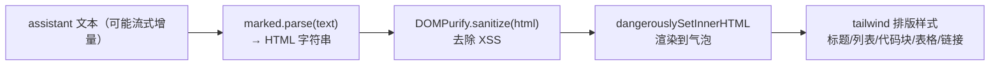

# Markdown 渲染 — 轻量设计

> 轻量模版。claude-chat 的 assistant 回复目前是纯文本（`whitespace-pre-wrap`），markdown 不渲染。本需求集成 markdown 渲染：复用项目已装的 `marked` + `dompurify`，新建 claude-chat 专属轻量 Markdown 组件，只渲染 assistant 气泡。
>
> 父文档：[../移动端 Claude 客户端-current.md](../移动端%20Claude%20客户端-current.md)
> 最后更新日期：2026-06-01

## 1. 代码入口

- 新增 `frontend/src/features/claude-chat/components/Markdown.tsx`：`marked.parse(text)` → `DOMPurify.sanitize(html)` → `dangerouslySetInnerHTML`，外层套 `markdown-body` 排版 class。
- 改 `frontend/src/features/claude-chat/components/MessageList.tsx`：`assistant` 分支由纯文本 `
{item.text}
` 换成 `<Markdown text={item.text} />`。
- **user 气泡保持纯文本**（用户输入不渲染 markdown，避免意外格式化）；`tool`/`result`/`error` 不变。

## 2. 接口契约

无对外接口（纯前端渲染）。组件 props：`{ text: string; className?: string }`。

## 3. 核心流程

## 4. 关键规则

| 规则 | 说明 |
|------|------|
| 仅 assistant 渲染 | user 气泡保持纯文本；tool/result/error 不变 |
| 必经 sanitize | `marked.parse` 输出的 HTML 必须过 `DOMPurify.sanitize` 再插入，杜绝 XSS |
| 流式兼容 | assistant 文本增量更新 → 每次 render 重新 parse（同步、小文本，开销可忽略） |
| 链接安全 | sanitize 后链接默认行为；新窗口打开可由 DOMPurify hook 或 CSS 处理（本期不强制 target=_blank） |
| 代码块 | 渲染 `<pre><code>` 结构 + 等宽样式；本期不接语法高亮（未装 highlight.js，避免引依赖） |
| 样式隔离 | 用 `markdown-body` class + tailwind 局部样式，不污染全局 |

## 5. 失败行为

- `marked.parse` 抛错（极端畸形输入）→ try/catch 兜底，降级显示原始纯文本，不崩溃。
- 空文本 → 渲染空，不报错。
- sanitize 移除全部内容（纯危险标签）→ 显示空，安全优先。
