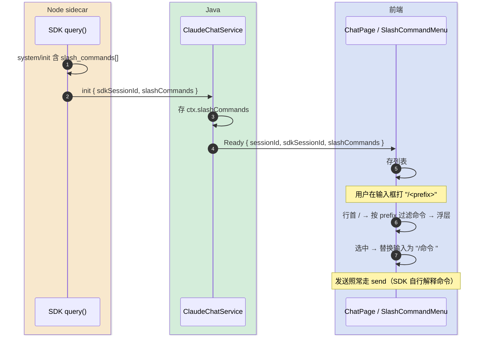

# slash 命令补全 — 轻量设计

> 隶属「移动端 Claude 客户端」。输入框行首打 `/` 弹出 Claude Code 可用命令补全浮层（复刻 VSCode 插件体验）。
> 最后更新：2026-06-03

## 1. 代码入口

```text
sidecar/claude-agent/src/sessionManager.ts        [修改] handle() 的 system/init 分支取 m.slash_commands 一并 emit
tools/.../claudechat/api/dto/ServerMessage.java    [修改] Ready record 增 slashCommands 字段
tools/.../claudechat/service/ClaudeChatService.java[修改] SessionCtx 存 slashCommands；init 解析；各 Ready 透传
frontend/src/features/claude-chat/types.ts         [修改] ServerMessage.ready 增 slashCommands?: string[]
frontend/src/features/claude-chat/hooks/useClaudeChatSocket.ts [修改] ready 事件存 slashCommands；导出
frontend/src/features/claude-chat/components/SlashCommandMenu.tsx [新增] 命令补全浮层
frontend/src/features/claude-chat/pages/ChatPage.tsx [修改] 输入框接入浮层（行首 / 触发、选中插入）
```

## 2. 接口契约（WS 消息，附加字段）

| 消息 | 方向 | 变更 |
|------|------|------|
| `init`（内部） | sidecar → Java | 新增 `slashCommands: string[]`（来自 SDK `system/init` 的 `slash_commands`） |
| `Ready` | Java → 浏览器 | 新增 `slashCommands: string[]`（会话可用命令名清单；缺省 `[]`，向前兼容） |

> 命令清单**来源 = Agent SDK 的 `system/init` 消息**（已含内置命令 + `~/.claude/commands`、项目 `.claude/commands` 的自定义命令），**不另起 `claude` 进程查**。

## 3. 核心流程



## 4. 关键规则

| 规则 | 说明 |
|------|------|
| 清单来源 | SDK `init.slash_commands`；Java 存 `SessionCtx.slashCommands`，所有 `Ready`（init/switch/resume/重连恢复）都带上 |
| 触发条件 | 输入框文本以 `/` 开头（行首）且非空命令区；按 `/` 后已输入前缀过滤（不区分大小写） |
| 选中行为 | 把输入替换为 `/<命令> `（带空格便于接参数）；浮层关闭 |
| 发送 | 选中后**不前端拦截执行**，照常作为普通文本 `send` 给 sidecar，由 SDK 解释；前端只做补全 |
| 过滤 | 只展示 SDK 给的命令；列表为空则**不显示浮层入口** |
| 展示粒度 | v1 仅命令名（不抓描述/参数提示） |
| 键盘 | 支持上下键选择、Enter/Tab 选中、Esc 关闭（移动端可点选） |

## 5. 失败行为

- `init` 无 `slash_commands` 或为空 → `slashCommands=[]`，输入框打 `/` 不弹浮层，不报错（退化为普通输入）。
- 老会话 `resume`/`switch` 的 `Ready` 先用 `ctx.slashCommands` 缓存值（可能为空），待该会话本轮 `init` 再刷新。
- 字段向前兼容：前端 `slashCommands` 缺省 `[]`，旧前端忽略该字段无影响。
