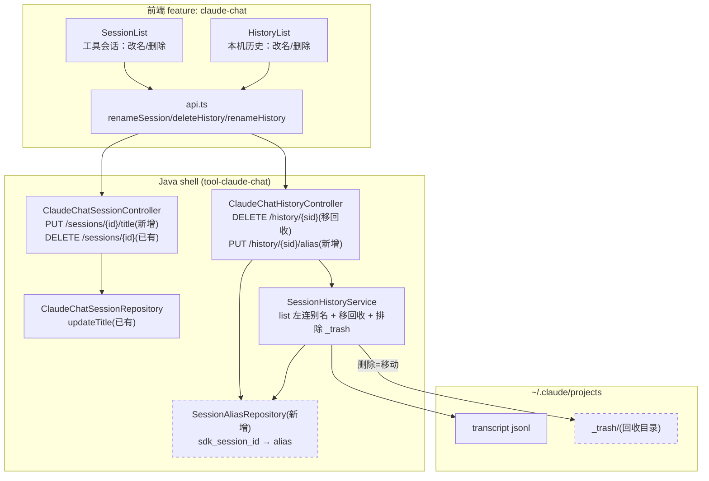
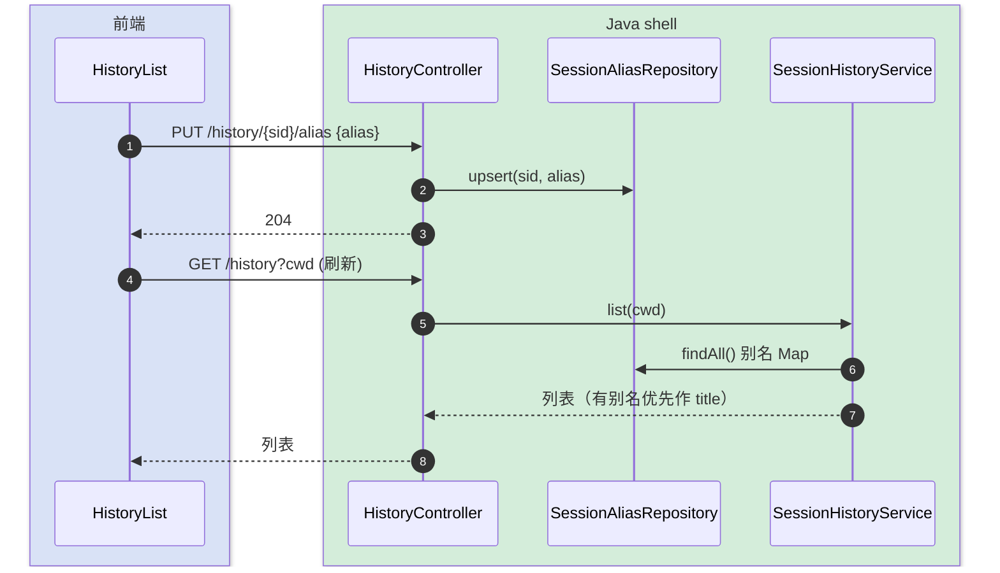
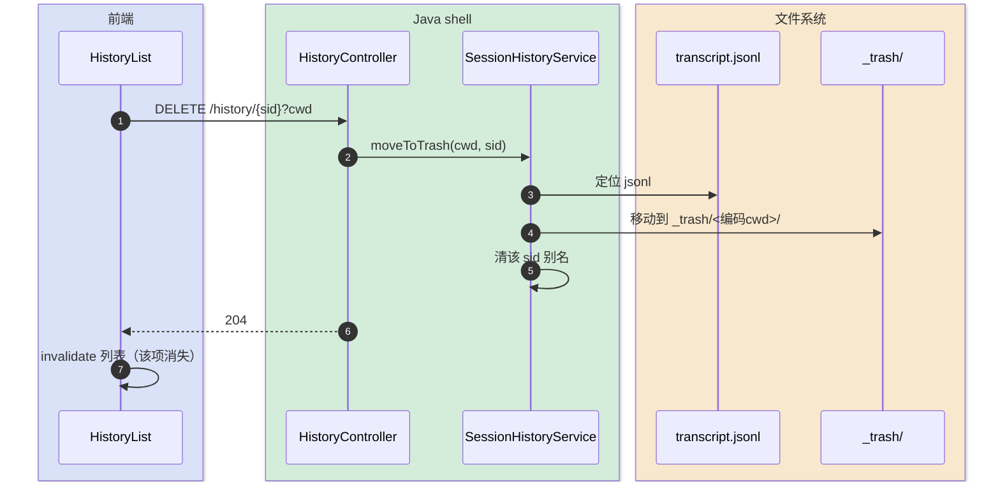

# 会话重命名与删除 — 技术方案设计

> 完整-技术模版。本需求是「移动端 Claude 客户端」(`claude-chat` 工具)的子模块：给「工具会话」(SessionList) 和「本机历史」(HistoryList) 补齐重命名 + 删除能力，参考 VSCode Claude Code 插件。
>
> 父文档：[../移动端 Claude 客户端-current.md](../移动端%20Claude%20客户端-current.md)
> 最后更新日期：2026-06-01

---

## 变更记录

| 版本 | 日期 | 修改人 | 变更内容摘要 |
|------|------|--------|--------------|
| v1 | 2026-06-01 | AI | 初始：工具会话重命名/删除 + 本机历史重命名(别名表)/删除(移回收目录) |

---

## 1. 目标与边界

- **要解决的问题**：工具会话只能删不能改名；本机历史(transcript)只读，既不能删也不能改名。希望像 VSCode 插件那样两个列表都能重命名 + 删除。
- **本次目标**：
  - **工具会话**：重命名(改 SQLite title)、删除(已有)。
  - **本机历史**：重命名(自定义别名，列表优先显示别名)、删除(移到回收目录，可恢复)。
- **关键决策（已定）**：
  - 历史删除 = **移到回收目录** `~/.claude/projects/_trash/`，不真删、不破坏 Claude Code 原生 `/resume`。
  - 历史重命名 = **新建轻量别名表** `claude_chat_session_alias(sdk_session_id, alias)`，不改 transcript 文件。
- **不做什么**：
  - 不改 transcript jsonl 文件内容（历史标题仍由解析首条 user 文本得来，别名只是叠加层）。
  - 不做批量操作、不做回收站管理 UI（回收目录靠文件系统手动恢复）。
  - 不动实时会话/流式/权限/附件等既有链路。
- **设计结论（一句话）**：工具会话重命名走既有 `ClaudeChatSessionRepository.updateTitle` + 新 REST；本机历史删除让 `SessionHistoryService` 把 jsonl 移到 `_trash`、扫描时排除 `_trash`；本机历史重命名新增 `claude_chat_session_alias` 表 + Repository，`list()` 时左连别名、有别名优先作标题；前端 SessionList/HistoryList 加 hover 出现的「重命名/删除」操作。

---

## 2. 整体架构



**为什么历史重命名用别名表而非改文件**：transcript 是 Claude Code 引擎的权威数据，标题由解析首条 user 文本得来；改文件有损坏风险、且会被引擎覆盖。叠加一张 `sdk_session_id → alias` 表，列表时优先显示别名，最干净、可逆。

**为什么删除用移回收而非真删**：transcript 也是原生 `/resume` 的数据源，直接删不可恢复且影响用户在 VSCode/CLI 的历史。移到 `_trash/` 既从工具列表消失，又保留文件可手动恢复。

---

## 3. 模块拆分与职责

### 3.1 后端 · 工具会话重命名（已有删除）

- `ClaudeChatSessionController` 新增 `PUT /sessions/{id}/title`，body `{title}`，委托既有 `ClaudeChatSessionRepository.updateTitle(id, title)`；空/超长校验。
- 删除 `DELETE /sessions/{id}` 已存在，不改。

### 3.2 后端 · 本机历史别名（重命名）

- 新增 `SessionAliasRepository`（JDBC），表 `claude_chat_session_alias(sdk_session_id PK, alias, updated_at)`：`upsert(sid, alias)`、`delete(sid)`、`findAll()→Map<sid,alias>`。
- `claude-chat-schema.sql` 追加该表 DDL（`CREATE TABLE IF NOT EXISTS`）。
- `SessionHistoryService.list()`：解析出各会话后，左连别名 Map，有别名则覆盖 `title` 显示。

### 3.3 后端 · 本机历史删除（移回收）

- `SessionHistoryService.moveToTrash(cwd, sdkSessionId)`：定位 `<sid>.jsonl`（复用 `findTranscript`），移动到 `~/.claude/projects/_trash/<编码cwd>/<sid>.jsonl`（保留来源目录结构，重名加时间戳）；同时清该 sid 的别名。
- `list()` 扫描目录时**排除 `_trash`**（否则回收目录被当项目目录扫出）。
- `ClaudeChatHistoryController` 新增 `DELETE /history/{sid}?cwd=`、`PUT /history/{sid}/alias`。

### 3.4 前端 · SessionList / HistoryList

- `api.ts`：`renameSession(id, title)`、`renameHistory(sid, alias)`、`deleteHistory(sid, cwd)`。
- `SessionList`：每行 hover 出现「重命名(✏️)/删除(🗑️)」；重命名 = inline 输入框(Enter 提交/Esc 取消)，提交后 invalidate 列表。删除沿用既有。
- `HistoryList`：每行 hover 出现「重命名/删除」；重命名走别名;删除 = 移回收 + 刷新；操作后 invalidate `claude-chat-history` query。
- 重命名/删除按钮 `stopPropagation`，避免触发整行的「切换/续跑」。

---

## 4. 关键交互

### 4.1 本机历史重命名（别名）

> 触发：HistoryList 某行点「重命名」→ 输入新名 → 提交。



### 4.2 本机历史删除（移回收）

> 触发：HistoryList 某行点「删除」。



---

## 5. 核心业务规则

| 规则 | 说明 |
|------|------|
| 别名叠加不改文件 | 历史重命名只写 `claude_chat_session_alias`，transcript 文件不动 |
| 别名优先显示 | `list()` 有别名则覆盖 title；无别名仍用解析出的首条 user 文本 |
| 删除=移回收 | 历史删除把 jsonl 移到 `_trash/`，可手动恢复；不真删 |
| 扫描排除 _trash | `list()` 必须跳过 `_trash` 目录，否则回收项重新出现 |
| 删除清别名 | 移回收时一并删该 sid 别名，避免悬挂 |
| 工具会话重命名改 title | 走既有 `updateTitle`，仅本工具 SQLite 元数据 |
| 操作不串触发 | 列表行内重命名/删除按钮阻止冒泡，不触发整行切换/续跑 |
| 空名校验 | 重命名空白串拒绝（前端禁用提交 + 后端校验） |

---

## 6. 编码落点

```text
tools/tool-claude-chat/src/main/
├── java/com/exceptioncoder/toolbox/claudechat/
│   ├── api/
│   │   ├── ClaudeChatSessionController.java     [改] + PUT /sessions/{id}/title
│   │   └── ClaudeChatHistoryController.java       [改] + DELETE /history/{sid}、PUT /history/{sid}/alias
│   ├── repository/
│   │   └── SessionAliasRepository.java            [新增] sdk_session_id→alias 的 upsert/delete/findAll
│   └── service/
│       └── SessionHistoryService.java             [改] list 左连别名 + moveToTrash + 扫描排除 _trash
└── resources/db/claude-chat-schema.sql            [改] + claude_chat_session_alias 表 DDL

frontend/src/features/claude-chat/
├── api.ts                                          [改] renameSession / renameHistory / deleteHistory
├── components/SessionList.tsx                      [改] 行内重命名(inline)+ 删除(已有)
└── components/HistoryList.tsx                      [改] 行内重命名(别名)+ 删除(移回收)
```

### 调用关系说明

- 工具会话改名：`SessionList` → `renameSession` → `PUT /sessions/{id}/title` → `repo.updateTitle`。
- 历史改名：`HistoryList` → `renameHistory` → `PUT /history/{sid}/alias` → `SessionAliasRepository.upsert`；列表 `list()` 左连别名。
- 历史删除：`HistoryList` → `deleteHistory` → `DELETE /history/{sid}` → `SessionHistoryService.moveToTrash`。

---

## 7. 数据与依赖变更

| 类型 | 是否变化 | 说明 |
|------|----------|------|
| 数据库表 | 有 | 新增 `claude_chat_session_alias(sdk_session_id PK, alias, updated_at)`（`IF NOT EXISTS`） |
| 对外接口 | 有 | 新增 `PUT /sessions/{id}/title`、`DELETE /history/{sid}`、`PUT /history/{sid}/alias`（详见 api 文档） |
| 文件系统 | 有 | 新增回收目录 `~/.claude/projects/_trash/`（删除时按需创建） |
| 下游 / 外部依赖 | 无 | 无新依赖 |
| 缓存 / 锁 / 事务 | 无 | 单用户本机，无并发顾虑 |

---

## 8. 风险与待确认

| 风险 / 待确认点 | 影响 | 处理方式 |
|----------------|------|----------|
| `_trash` 被当项目目录扫出 | 回收项重新出现/可被续跑 | `list()` 与 `findTranscript` 显式跳过 `_trash` |
| 同名 sid 移回收冲突 | 覆盖回收里的旧文件 | 目标重名时加时间戳后缀 |
| 别名与真实 sid 失配 | 删了 transcript 但别名悬挂 | 移回收时同步删别名；list 左连找不到文件的别名自然不显示 |
| 工具会话与历史会话同源 | 工具会话也由某 sdkSessionId 派生 | 工具会话改 title（SQLite），历史改 alias（别名表），互不影响 |
| 回收目录增长 | 长期占磁盘 | 本期不做自动清理；用户可手动清 `_trash` |

---

## 9. 验证要点

- **工具会话**：重命名 → 列表即时更新、刷新后保留；删除沿用既有。
- **历史重命名**：改别名 → 列表显示别名；清空别名(可选)→ 回落解析标题。
- **历史删除**：删除 → 从列表消失 → 文件出现在 `_trash/`；该会话别名被清。
- **回归**：`list()` 不再扫出 `_trash`；续跑/历史消息加载/实时流不受影响。
- **构建**：前端 typecheck、后端 compile 通过；schema 启动幂等(IF NOT EXISTS)。

