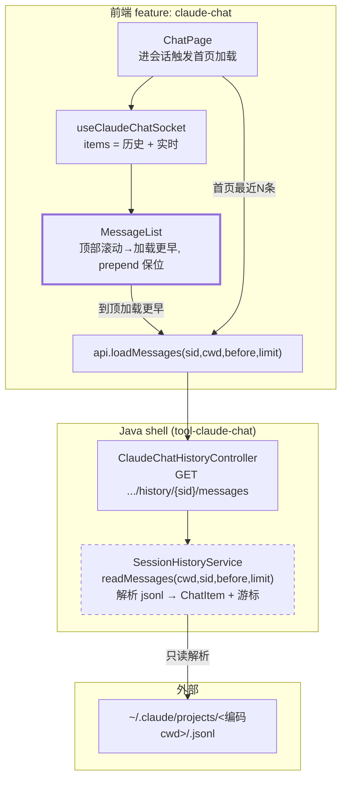
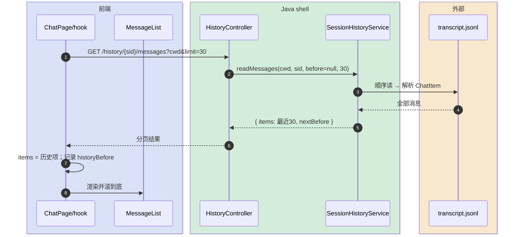
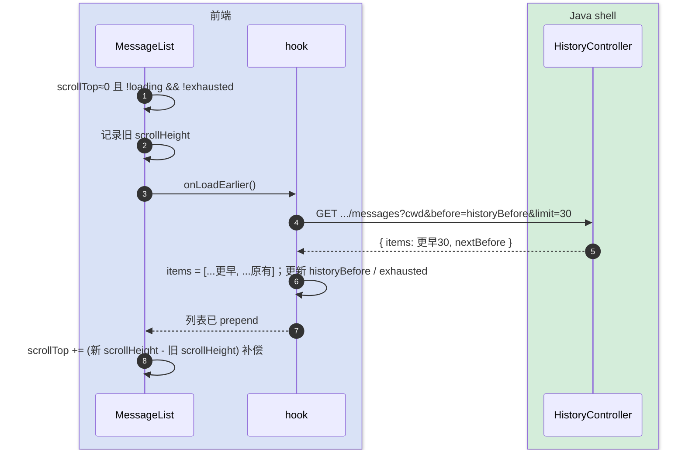

# 历史会话消息加载 — 技术方案设计

> 完整-技术模版。本需求是「移动端 Claude 客户端」(`claude-chat` 工具)的子模块：进入/重载会话时不再空白，先渲染最近 N 条历史消息，用户向上滚动时延迟加载更早记录（无限滚动分页）。
>
> 父文档：[../移动端 Claude 客户端-current.md](../移动端%20Claude%20客户端-current.md)
> 最后更新日期：2026-06-01

---

## 变更记录

| 版本 | 日期 | 修改人 | 变更内容摘要 |
|------|------|--------|--------------|
| v1 | 2026-06-01 | AI | 初始技术方案：transcript 分页读取 + 前端无限滚动 |

---

## 1. 目标与边界

- **要解决的问题**：`switchSession` / `resumeHistory` / 重连只发 `Ready`，前端 `MessageList` 是空的；历史对话明明在 SDK transcript 里却看不到，进会话像新开。
- **本次目标**：
  - 进入会话即加载并渲染**最近 N 条**历史消息（默认 N=30）。
  - 向上滚动到顶部附近时**延迟加载更早**一页，prepend 到列表并**保持滚动位置**（不跳动）。
  - 历史消息与后续实时流式消息无缝衔接（同一 `ChatItem[]`）。
- **不做什么**：
  - 不把 transcript 落库（唯一权威仍是 `~/.claude/projects/*.jsonl`，只读不写）。
  - 不做全文检索 / 跳转定位（只做顺序向上翻页）。
  - 不改实时消息链路（WS 流式、权限弹窗、附件、模式切换均不动）。
  - 不引入虚拟列表（本期普通 DOM + 滚动位置保持即可，量级可控）。
- **设计结论（一句话）**：后端给 `SessionHistoryService` 增加「解析某 transcript jsonl 为 `ChatItem` 并按行游标分页」的能力 + 一个只读 REST 端点；前端在进会话时拉最近一页渲染，`MessageList` 监听顶部滚动触发加载更早页、prepend 后用 `scrollHeight` 差值补偿 `scrollTop` 防跳动。

---

## 2. 整体架构

> 历史加载走**独立只读 REST**（一次性分页查询，适合 HTTP），与实时 WS 流互不干扰；两路消息最终汇入同一份 `items`。



**为什么走 REST 而不是 WS**：历史分页是「请求一页 → 返回一页」的拉取模型，天然 request/response；WS 那条链路保持只承载实时事件，职责清晰。

**为什么用行游标而非时间戳**：transcript 是按行追加的 jsonl，行序即时间序；用「最早已加载条目的行索引」作 `before` 游标，向前切片，简单且无重复/遗漏。

---

## 3. 模块拆分与职责

### 3.1 SessionHistoryService.readMessages（Java，扩展既有）

- **定位**：在既有「列表/标题解析」基础上，新增「解析整份 transcript 为 `ChatItem` 列表并分页」。
- **职责**：
  - 复用 `encode(cwd)` + `matchesProject` 定位 `<sid>.jsonl`（含大小写/备份变体）。
  - 顺序读 jsonl，逐行映射为消息项（见下方映射规则），得到完整有序列表 `all`。
  - 按行游标分页：`before` 为空 → 取末尾 `limit` 条（最近）；`before=k` → 取 `[max(0,k-limit), k)`。
  - 返回 `{ items, nextBefore }`：`nextBefore` = 本批最早条目的全局索引；当它 >0 表示还有更早，=0 表示到顶。
- **jsonl → 消息项映射**：
  - `type=user` 且 content 为 text（非 tool_result）→ `user` 文本项。
  - `type=assistant` content 内 text block → `assistant` 文本项；tool_use block → `tool` 项（toolName/input）。
  - `type=user` content 内 tool_result block → 回填最近同 id 的 `tool` 项 output，或独立 `tool` 项。
  - `type=result` → `result` 项（stopReason）。
  - system/meta/无内容行跳过；每项带稳定 `id`（用全局行索引，如 `h{index}`）。
- **关键设计点**：单会话 transcript 量级可控，全解析 + 内存切片即可；若超大可后续优化为反向流式读。解析失败的行跳过不致命。

### 3.2 ClaudeChatHistoryController（Java，加端点）

- `GET /api/claude-chat/history/{sdkSessionId}/messages?cwd=..&before=..&limit=..` → 委托 `readMessages`，返回分页结果。契约见 api 文档。

### 3.3 前端 api + useClaudeChatSocket（React）

- `api.loadMessages(sdkSessionId, cwd, before?, limit?)` → `{ items, nextBefore }`。
- `useClaudeChatSocket`：
  - 暴露 `loadHistory(reset)`：首次进会话调（reset=true，加载最近页并替换 items）；上拉调（prepend 更早页）。
  - 维护 `historyBefore`（下一个游标）、`historyExhausted`。
  - 进会话时机：`switchTo` / `resumeHistory` 的 `ready` 到达后、或 `open` 不触发（新会话无历史）。
  - 历史项与实时项同存 `items`：历史在前，实时 append 在后。

### 3.4 MessageList 无限滚动（React，改造）

- 监听滚动：`scrollTop` 接近 0 且未 exhausted/未加载中 → 触发 `onLoadEarlier`。
- **保位**：prepend 前记录 `scrollHeight`，prepend 后 `scrollTop += (新 scrollHeight - 旧 scrollHeight)`，避免视觉跳动。
- **自动滚底**仅在：首次加载完成、或新实时消息到达且原本就贴底时；prepend 历史时**不**滚底。
- 顶部加载时显示「加载更早…」提示；到顶显示「没有更早了」。

---

## 4. 关键交互

### 4.1 进入会话加载最近一页

> 触发：`switchSession` / `resumeHistory` 收到 `ready`（拿到 sdkSessionId + cwd）。



### 4.2 上拉加载更早一页（保持滚动位置）

> 触发：用户向上滚动到顶部附近。



---

## 5. 核心业务规则

| 规则 | 说明 |
|------|------|
| 只读 transcript | 历史唯一来源是 SDK jsonl，本功能只读不写 |
| 行序即时间序 | 用最早已加载条目的行索引作 before 游标，向前翻页 |
| 历史在前实时在后 | 同一 items：历史项在前，WS 实时项 append 在后 |
| 首屏最近 N 条 | 默认 30，进会话即拉最近一页并滚到底 |
| prepend 不跳动 | 上拉加载更早后用 scrollHeight 差补偿 scrollTop |
| 到顶即止 | nextBefore=0 时标记 exhausted，不再请求 |
| 新会话无历史 | open 新建会话不触发历史加载 |
| 失败降级 | 解析失败的行跳过；整体失败时空列表 + 提示，不阻塞发消息 |

---

## 6. 编码落点

```text
tools/tool-claude-chat/src/main/java/com/exceptioncoder/toolbox/claudechat/
├── service/SessionHistoryService.java          [改] 加 readMessages(cwd,sid,before,limit) + jsonl→ChatItem 映射
├── api/ClaudeChatHistoryController.java         [改] 加 GET /history/{sid}/messages
└── api/dto/
    ├── ChatMessageView.java                     [新增] 单条历史消息项（kind/text/toolName/input/output/...）
    └── MessagePage.java                         [新增] { items: List<ChatMessageView>, nextBefore: Integer }

frontend/src/features/claude-chat/
├── api.ts                                       [改] loadMessages(sid,cwd,before?,limit?)
├── hooks/useClaudeChatSocket.ts                 [改] loadHistory/historyBefore/historyExhausted + 进会话触发
├── components/MessageList.tsx                   [改] 顶部滚动加载更早 + prepend 保位 + 条件滚底
└── pages/ChatPage.tsx                           [改] 把 onLoadEarlier / 历史状态接进 MessageList
```

### 调用关系说明

- 首页：`ready` → `hook.loadHistory(reset)` → `api.loadMessages(before=null)` → `Controller#messages` → `SessionHistoryService#readMessages`。
- 翻页：`MessageList` 顶部滚动 → `onLoadEarlier` → `hook.loadHistory()` → 同上（带 before）→ prepend。

---

## 7. 数据与依赖变更

| 类型 | 是否变化 | 说明 |
|------|----------|------|
| 数据库表 / 字段 | 无 | 只读磁盘 transcript |
| DTO / VO | 有 | 新增 `ChatMessageView`、`MessagePage`（前端对应 history 项类型，可复用现有 ChatItem 形状） |
| 对外接口 | 有 | 新增 `GET /history/{sid}/messages`（详见 api 文档） |
| 下游 / 外部依赖 | 复用 | 复用 `~/.claude/projects/*.jsonl`，无新依赖 |
| 缓存 / 锁 / 事务 | 无 | 无（每次请求即时解析；如需可后续加文件级缓存） |

---

## 8. 风险与待确认

| 风险 / 待确认点 | 影响 | 处理方式 |
|----------------|------|----------|
| **超大 transcript 全解析开销** | 单会话极长时每次翻页都全解析 | 本期可接受（量级可控）；超大时改反向流式读或加缓存。**待确认是否需要** |
| **tool_result 与 tool_use 配对** | 跨行（assistant tool_use → user tool_result） | 解析时按 tool_use_id 回填；配不上则独立展示 |
| **历史项与实时项 id 冲突** | prepend/append 的 key 重复 | 历史项 id 前缀 `h{index}`，实时项用既有 `i{seq}`，命名空间隔离 |
| **attach 重连的历史** | 重连回放当前轮缓冲，但更早历史 | 重连后若 items 为空也触发一次 loadHistory(reset) |
| **分页大小 N** | 太小翻页频繁 / 太大首屏慢 | 默认 30，可调；前端 limit 与后端默认对齐 |
| **滚动保位精度** | 图片/工具气泡异步撑高导致补偿偏差 | 用 prepend 前后 scrollHeight 差值补偿，足够；必要时 rAF 内二次校正 |

---

## 9. 验证要点

- **首屏**：switch/resume 一个有历史的会话 → 进来即看到最近 ~30 条 → 自动在底部。
- **上拉**：滚到顶 → 加载更早一页 → 列表 prepend → 视图不跳动 → 继续上拉直到「没有更早了」。
- **衔接**：加载历史后发新消息 → 实时流式 append 在历史之后，正常。
- **新会话**：新建会话不请求历史、不报错。
- **边界**：空/损坏 transcript → 空列表不崩；极短会话一页加载完即 exhausted。
- **回归**：实时流、权限/提问弹窗、附件、语音、模式切换均不受影响。
- **构建**：前端 typecheck、后端 compile 通过。


