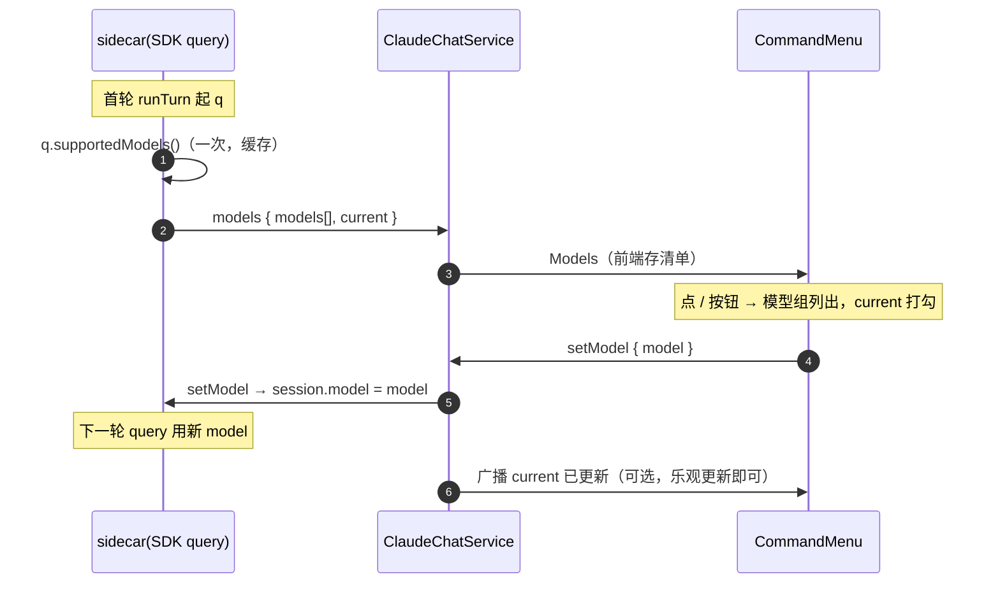

# 命令菜单与模型切换 — 轻量设计

> 隶属「移动端 Claude 客户端」。把 `/` 命令菜单升级为 VSCode 风格分组（命令 / 模型），并支持运行中切换模型。
> 最后更新：2026-06-03

## 1. 代码入口

```text
sidecar/claude-agent/src/sessionManager.ts   [修改] runTurn 起 q 后 fetchModelsOnce(q.supportedModels) → emit models；新增 setModel 命令
tools/.../api/dto/ClientMessage.java          [修改] 新增 SetModel(model)
tools/.../api/dto/ServerMessage.java          [修改] 新增 Models(seq, models[], current)；ModelInfo 记录
tools/.../config/ClaudeChatWebSocketHandler.java [修改] 路由 SetMode 同款加 SetModel
tools/.../service/SidecarClient.java          [修改] setModel(sessionId, model) 发送
tools/.../service/ClaudeChatService.java       [修改] SessionCtx 存 models/currentModel；onSidecarEvent 处理 models；setModel 入口
frontend/.../types.ts                          [修改] ServerMessage 'models'、ClientMessage setModel、ModelInfo
frontend/.../hooks/useClaudeChatSocket.ts      [修改] 存 models/currentModel，暴露 setModel
frontend/.../components/CommandMenu.tsx        [修改] 分组：模型组(可切) + 命令组
```

## 2. 接口契约（WS 消息）

| 消息 | 方向 | 内容 |
|------|------|------|
| `setModel` | 浏览器 → Java → sidecar | `{ model: string }`（ModelInfo.value，下一轮 query 生效） |
| `models` | sidecar → Java → 浏览器 | `{ models: ModelInfo[], current: string }` |

`ModelInfo = { value, displayName, description }`（来自 SDK `ModelInfo`，丢弃 supportsEffort 等暂不用字段）。

> 模型清单来源 = SDK `query.supportedModels()`（控制请求；canUseTool 能用即证明控制通道通）。**首轮对话后**才有（与 slash_commands 同，init 系统消息只带当前 model）。

## 3. 核心流程



## 4. 关键规则

| 规则 | 说明 |
|------|------|
| 列表来源 | `supportedModels()` 控制请求；失败则 catch 静默（模型组为空，不报错） |
| 何时有 | 首轮对话后（与 slash_commands 一致）；菜单前置态空时模型组提示「对话后可用」 |
| 切换生效 | `setModel` 设 `session.model`，**下一轮** query 生效（同 setMode 语义）；前端乐观更新 current |
| 分组菜单 | CommandMenu 分「模型」（可点切换，current ✓）+「命令」（slash，选中插入 `/cmd `）两组，顶部 Filter 同时过滤两组 |
| 多端 | current 模型随 models 广播；切换后其它端下次 models/Ready 同步（v1 乐观更新本端即可） |

## 5. 失败行为

- `supportedModels()` 抛错/超时 → 不 emit models，模型组空，不影响命令组与对话。
- `setModel` 传空/未知 value → sidecar 原样设置，SDK 下一轮若拒绝则走 QUERY_FAILED 错误回显（不额外校验）。
- 旧前端不认 `models` 消息 → 忽略，无影响（附加消息）。
