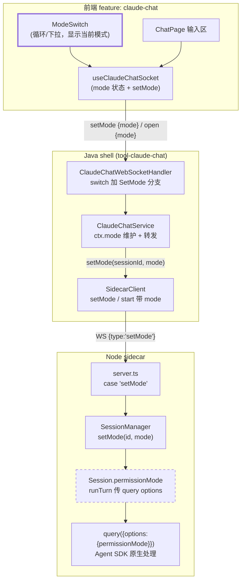
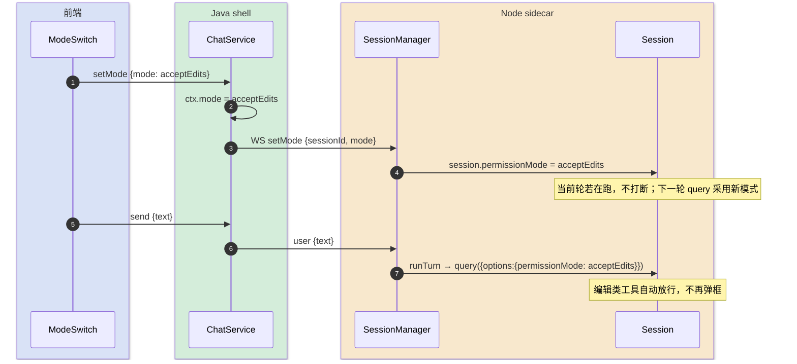
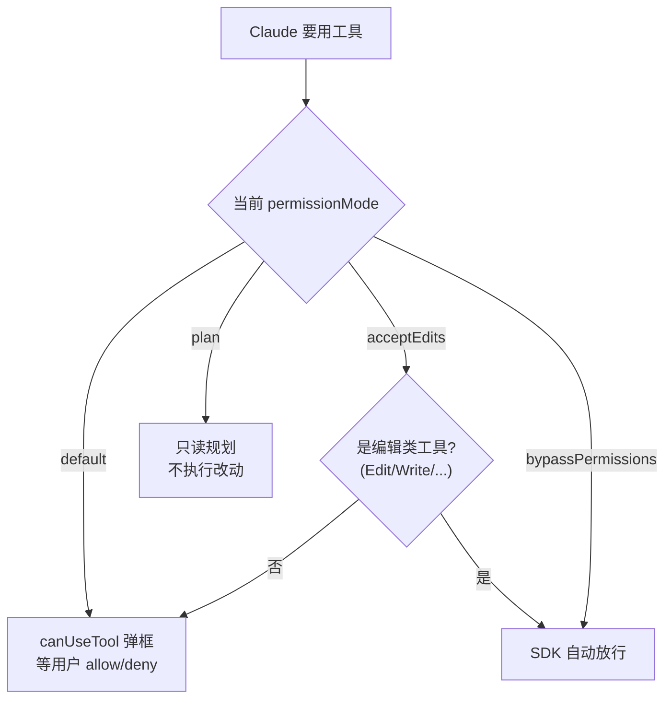

# 权限模式切换 — 技术方案设计

> 完整-技术模版。本需求是「移动端 Claude 客户端」(`claude-chat` 工具)的子模块，为聊天会话补充**权限模式切换**能力，复刻 VSCode Claude 插件 Shift+Tab 的体验：在 `default / acceptEdits / plan / bypassPermissions` 之间切换，让用户可一键开启「自动接受」免去每个工具都弹权限框。
>
> 父文档：[../移动端 Claude 客户端-current.md](../移动端%20Claude%20客户端-current.md)
> 最后更新日期：2026-06-01

---

## 变更记录

| 版本 | 日期 | 修改人 | 变更内容摘要 |
|------|------|--------|--------------|
| v1 | 2026-06-01 | AI | 初始技术方案：会话级 permissionMode + 前端切换 UI |

---

## 1. 目标与边界

- **要解决的问题**：现在 claude-chat 每个工具调用都弹权限框（`canUseTool` 一律阻塞等决策），连续任务非常打断。希望像 VSCode 插件那样能切「自动接受 / 计划 / 绕过」模式。
- **本次目标**：
  - 会话支持四种权限模式：`default`（每次问）/ `acceptEdits`（编辑类自动放行）/ `plan`（只读规划）/ `bypassPermissions`（全自动，"auto on"）。
  - 前端输入区提供模式切换 UI（点击循环 / 下拉），显示当前模式。
  - 模式是**会话级**状态，可随时切换；新建会话可带初始模式。
- **不做什么**：
  - 不做按工具粒度的细粒度白名单（那是 `permissions` 配置，超出本期）。
  - 不持久化模式到 SQLite（会话内存态即可，重连按默认或最后一次；见 §5）。
  - 不改 `canUseTool` 的询问交互本身（default 模式行为完全不变）。
- **设计结论（一句话）**：在「前端 ⇄ Java ⇄ sidecar」链路上贯穿一个 `permissionMode` 字段——前端加切换 UI 与 `setMode` 消息，Java 透传，sidecar 把它存为 Session 状态并在**每轮 `query()`** 时传入 `options.permissionMode`，由 Agent SDK 原生处理四种模式语义；`canUseTool` 保持不变。

---

## 2. 整体架构

> 关键前提：sidecar 的 `runTurn()` 是「每轮新建 `query()`」，所以 `permissionMode` 作为 Session 字段、每轮传入即可，运行中切换**下一轮生效**，无需 SDK 运行时动态控制。



**为什么模式做成会话级、下一轮生效**：`runTurn` 每轮新建 `query()`，把 `permissionMode` 放 Session 字段、每轮读取最自然；当前轮正在跑时切换不打断它，下一轮采用新模式，符合直觉且零并发风险。

**为什么交给 SDK 原生 permissionMode 而非自己在 canUseTool 模拟**：Agent SDK 已原生实现 `acceptEdits`（编辑工具免问）、`plan`（只读规划）、`bypassPermissions`（全放行）语义，自己在 `canUseTool` 里硬编码工具白名单既易错又会与 SDK 行为漂移。`default` 仍走既有 `canUseTool` 弹框。

---

## 3. 模块拆分与职责

### 3.1 前端 ModeSwitch + useClaudeChatSocket（React）

- **ModeSwitch**：输入区一个紧凑控件，点击在四模式间循环（或下拉选），显示当前模式中文标签（默认/自动接受/计划/全自动）。
- **useClaudeChatSocket**：新增 `mode` 状态与 `setMode(mode)` 方法；`setMode` 发 `{type:'setMode', mode}`，并乐观更新本地 `mode`；`open` 可带初始 `mode`。
- 移动端优先：控件够显眼，`bypassPermissions`（全自动）用醒目色提示「正在自动执行」以防误开。

### 3.2 ClaudeChatWebSocketHandler + ClientMessage（Java）

- `ClientMessage` 新增 `SetMode(String mode)`；`Open` 增加可选 `mode` 字段（不传按 default）。
- `handleTextMessage` 的 sealed switch 增加 `case ClientMessage.SetMode` 分支 → `service.setMode`。

### 3.3 ClaudeChatService（Java）

- `SessionCtx` 增加 `volatile String mode`（默认 `"default"`）。
- `setMode(ws, msg)`：定位会话 → 更新 `ctx.mode` → `sidecar.setMode(sessionId, mode)`。
- `openSession`：把 `open.mode()`（或默认）随 `startSession` 传给 sidecar。
- 模式合法性校验（只接受四枚举值），非法回 `error`。

### 3.4 SidecarClient（Java）

- 新增 `setMode(sessionId, mode)` → 发 `{type:'setMode', sessionId, mode}`。
- `startSession` 增加 `mode` 参数并带入 `start` 消息。

### 3.5 Node sidecar（server + sessionManager + Session）

- **server.ts**：`case 'setMode'` → `manager.setMode(sessionId, mode)`；`start` 解析 `mode`。
- **SessionManager.setMode(id, mode)** → `session.permissionMode = mode`。
- **Session**：新增 `permissionMode`（默认 `'default'`）；`runTurn` 在 `query({options})` 里加 `permissionMode: this.permissionMode`。
- 运行中切换：只改字段，**当前轮不中断**，下一轮 `runTurn` 生效。

---

## 4. 关键交互

### 4.1 运行中切换模式（下一轮生效）

> 触发：用户点 ModeSwitch 切到「自动接受」。参与方：前端、Java、sidecar。



### 4.2 各模式下的工具决策路径

> 同一次工具调用，在不同模式下的处理分叉。



---

## 5. 核心业务规则

| 规则 | 说明 |
|------|------|
| 模式会话级 | `permissionMode` 绑定单个会话，互不影响 |
| 下一轮生效 | 运行中切换不打断当前轮，下一轮 `query` 采用新模式 |
| 默认安全 | 新会话默认 `default`（每次问），不默认放行 |
| 四枚举校验 | 只接受 default/acceptEdits/plan/bypassPermissions，非法值拒绝并回 error |
| default 行为不变 | 不改 `canUseTool` 交互，回归零影响 |
| 重连恢复 | attach 重连不改模式；switchSession/resume 的历史会话按 default 起（见 §8 待确认） |
| 全自动需醒目 | `bypassPermissions` 前端用醒目样式提示，防误开 |

---

## 6. 编码落点

```text
sidecar/claude-agent/src/
├── server.ts                                   [改] case 'setMode'；start 解析 mode
└── sessionManager.ts                           [改] Session.permissionMode 字段 + runTurn 传 query options；SessionManager.setMode

tools/tool-claude-chat/src/main/java/com/exceptioncoder/toolbox/claudechat/
├── api/dto/ClientMessage.java                  [改] 新增 SetMode；Open 加 mode
├── config/ClaudeChatWebSocketHandler.java      [改] switch 加 SetMode 分支
└── service/
    ├── ClaudeChatService.java                  [改] SessionCtx.mode + setMode() + openSession 带 mode
    └── SidecarClient.java                       [改] setMode() + startSession 带 mode

frontend/src/features/claude-chat/
├── components/ModeSwitch.tsx                   [新增] 模式切换控件
├── pages/ChatPage.tsx                          [改] 输入区接入 ModeSwitch
├── hooks/useClaudeChatSocket.ts                [改] mode 状态 + setMode() + open 带 mode
└── types.ts                                    [改] PermissionMode 类型；ClientMessage 加 setMode / open.mode
```

### 调用关系说明

- 切换：`ModeSwitch` → `useClaudeChatSocket.setMode` → WS `setMode` → `ClaudeChatService.setMode` → `SidecarClient.setMode` → sidecar `SessionManager.setMode` → `Session.permissionMode`。
- 生效：下一轮 `Session.runTurn` → `query({options:{permissionMode}})`。

---

## 7. 数据与依赖变更

| 类型 | 是否变化 | 说明 |
|------|----------|------|
| 数据库表 / 字段 | 无 | 模式是会话内存态，不持久化 |
| DTO / 枚举 | 有 | `ClientMessage.SetMode`、`Open.mode`；前端 `PermissionMode` 类型 |
| 对外接口 | 有 | WS 新增 `setMode` 消息；`open` 加可选 `mode`（详见 api 文档） |
| 下游 / 外部依赖 | 复用 | 复用 Agent SDK 既有 `options.permissionMode`，无新依赖 |
| 缓存 / 锁 / 事务 | 无 | `permissionMode` 用 volatile 字段，跨线程可见即可 |

---

## 8. 风险与待确认

| 风险 / 待确认点 | 影响 | 处理方式 |
|----------------|------|----------|
| **模式是否持久化** | 重连/重开会话后模式丢失 | 默认不持久化（内存态）；如需记住，后续在 SQLite 加列。**待确认** |
| **plan 模式退出后衔接** | plan 跑完出方案，用户想执行需切回 default/accept | 本期靠用户手动切回；不自动转模式 |
| **bypassPermissions 误开风险** | 全自动执行有破坏性操作 | 前端醒目提示 + 二次确认开启；后端不额外拦（用户单机自负） |
| **运行中切换的预期** | 用户可能期望立即影响当前轮 | 文档与 UI 标注「下一轮生效」；当前轮已发起的工具仍按原模式 |
| **SDK permissionMode 字段名/取值** | SDK 版本差异 | 编码时对照 sidecar 已锁定的 `@anthropic-ai/claude-agent-sdk` 版本核验取值 |
| **历史会话 resume 的初始模式** | switchSession/resumeHistory 起始模式 | 默认 default；前端切后即生效 |

---

## 9. 验证要点

- **正常路径**：default 下弹框 → 切 acceptEdits → 下一轮编辑类工具不再弹框、非编辑仍问。
- **bypass**：切 bypassPermissions → 工具全自动执行无弹框；UI 有醒目提示。
- **plan**：切 plan → Claude 只产出方案不落改动。
- **运行中切换**：任务进行中切模式 → 当前轮不受影响，下一轮生效。
- **回归**：default 模式行为与现状完全一致；权限/提问弹窗、断连重连、附件/语音输入均不受影响。
- **构建**：sidecar `tsc` 通过；前端 typecheck、后端 compile 通过。

