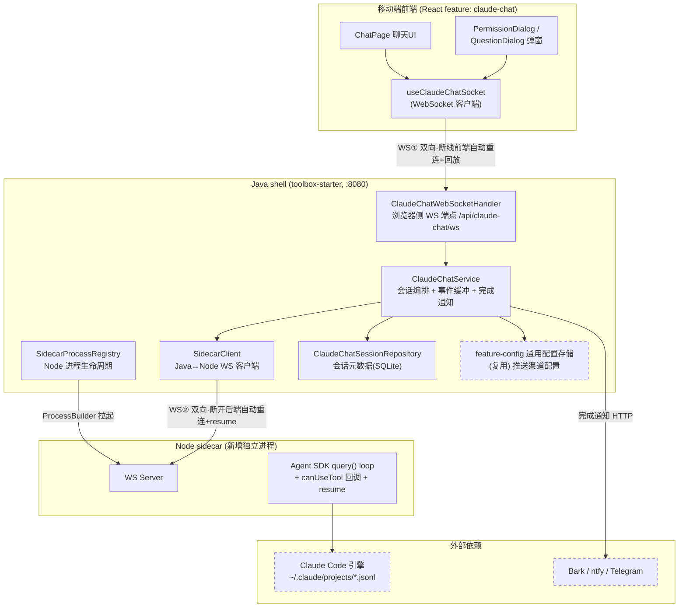
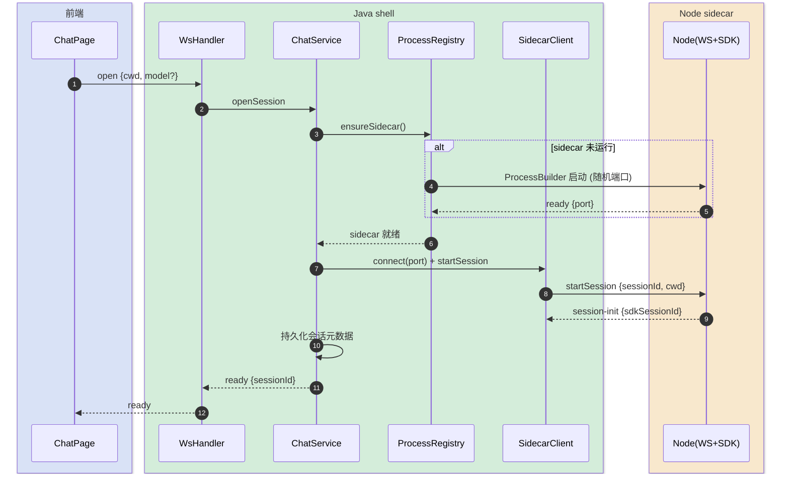
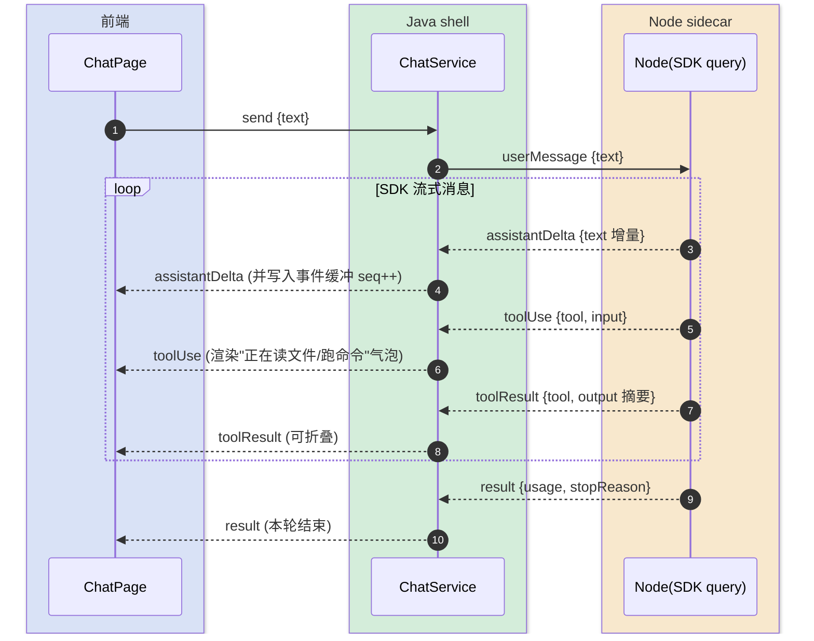
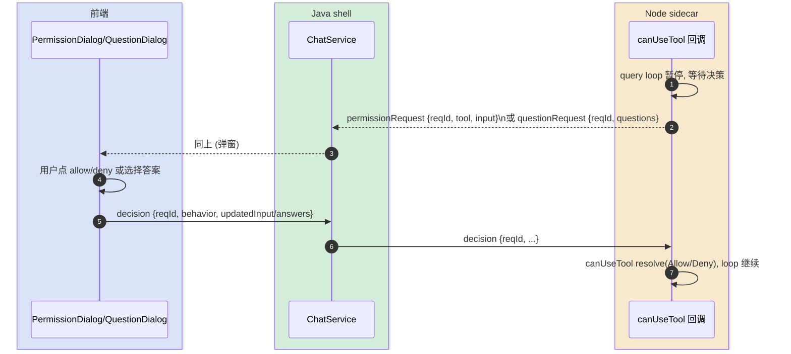
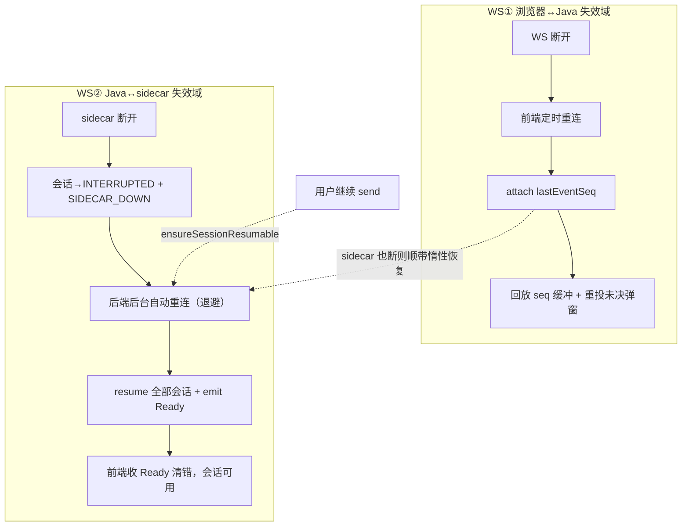
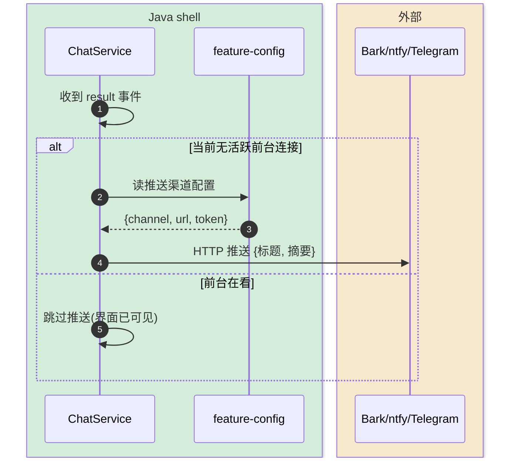

# 移动端 Claude 客户端 — 技术方案设计

> 完整-技术模版。本工具在 kai-toolbox 内新建一个 tool 模块 `claude-chat`，把 Claude Code 引擎以"移动端聊天"的形态呈现：复刻 VS Code 插件体验（流式展示、工具调用可视化、权限/提问可视化弹窗、随时切会话续跑），任务完成后推送通知。
>
> 最后更新日期：2026-06-02

---

## 变更记录

| 版本 | 日期 | 修改人 | 变更内容摘要 |
|------|------|--------|--------------|
| v1 | 2026-06-01 | AI | 初始技术方案 |
| current | 2026-06-02 | AI | 补全双链路断线重连/恢复模型（§4.4 重写：sidecar 后端自动重连+resume、未决弹窗重投、惰性恢复）；精简基础叙述 |
| current | 2026-06-03 | AI | 新增 §4.6 消息收发可靠性细则（connect 幂等防重复、多端同看广播、发送排队补发、状态回推纠偏、回放空洞 replayGap 兜底）；§5 增「单页单连接」「回放有界且不静默丢」2 条规则 |

---

## 1. 目标与边界

- **要解决的问题**：现在手机上驾驶 Claude 只能靠 webterm 的 PTY 裸终端，ANSI 流难看、"选择/批准"靠模拟按键、没有干净的"任务结束"信号。希望得到一个为手机优化的、像 VS Code 插件那样的聊天式客户端。
- **本次目标**：
  - 移动端聊天 UI：下发任务、流式看 Claude 回复、工具调用可视化（"正在读文件 / 跑命令"）。
  - 可视化交互弹窗：权限批准（allow/deny）、`AskUserQuestion` 多选，复刻插件原生弹窗体验。
  - 会话管理：列出历史会话、随时切换、断连重连、`resume` 续跑。
  - **磁盘历史会话加载**：复刻插件的「历史会话」选择器——读 `~/.claude/projects/<编码cwd>/*.jsonl` 列出该目录下**所有** Claude Code 会话（含 CLI/VS Code/SDK 各来源），点选即 `resume` 续跑。
  - 任务完成通知：跑完推送到手机（Bark / ntfy / Telegram 之一）。
- **不做什么**：
  - 不做多用户 / 鉴权（沿用 kai-toolbox 单用户 localhost 定位）。
  - 不自建 Web Push（service worker + 订阅管理），用外挂推送服务。
  - 不复刻 IDE 的诊断 / diff / 代码跳转能力（那是插件经 `ide` MCP server 反向拿 IDE 能力，本工具不需要）。
  - 不解析 PTY / TUI（这正是本工具要取代的旧路径）。
  - 不自己存全量对话 transcript（SDK 已落 `~/.claude/projects/*.jsonl`，复用之）。
- **设计结论（一句话）**：新建 `claude-chat` 工具 = 移动端 React 聊天 UI ⇄(WebSocket) Java shell 代理 ⇄(WebSocket) Node sidecar（跑 Claude Agent SDK，用 `canUseTool` 回调把权限/提问变成结构化事件），Java 负责会话元数据持久化、断连重连缓冲与完成通知。

---

## 2. 整体架构

> 浏览器只与 Java（:8080）通信（复用 webterm 已有的原生 WebSocket 基建）；Java 作为单一后端，向下代理一个常驻 Node sidecar。Node sidecar 是唯一持有 Agent SDK agentic loop 的进程。



**关键取舍**：
- **Java 夹中间**（非浏览器直连 Node）：浏览器只认 `/api`；会话元数据 / 事件缓冲 / 完成通知都要在流上搭线；sidecar 不对外暴露端口。
- **WebSocket 而非 SSE**：权限批准 / 提问回答 / 中断需在任务进行中**双向**回灌，SSE 单向不够。
- **双链路各自独立重连**：WS①（浏览器↔Java）与 WS②（Java↔sidecar）是**两个独立失效域**，恢复路径互不替代——这是可用性核心，详见 §4.4。

---

## 3. 模块拆分与职责

### 3.1 前端 feature `claude-chat`（React）

- **定位**：移动端优先的聊天客户端，渲染 Claude 的结构化事件流。
- **职责**：
  - 渲染消息流（assistant 文本增量、工具调用气泡、工具结果折叠）。
  - 弹出权限 / 提问对话框，把用户决策回灌。
  - 会话列表 / 切换 / 新建。
- **上游**：用户（手机浏览器，经 vscode-tunnel 同款方式暴露）。
- **下游**：Java `/api/claude-chat/ws`。
- **关键设计点**：
  - 移动端布局优先（大按钮、底部固定输入、弹窗居中），遵循「关键交互按钮够显眼」偏好。
  - WS 断线自动重连 + 重连后请求事件回放（带 `lastEventSeq`）。
  - 弹窗组件按事件 `type` 区分 `permissionRequest` / `questionRequest`，渲染不同 UI，统一回 `decision`。

### 3.2 ClaudeChatWebSocketHandler（Java）

- **定位**：浏览器侧 WebSocket 端点，纯协议适配。
- **职责**：
  - 接收浏览器消息（open/attach/send/decision/interrupt/switchSession），转交 `ClaudeChatService`。
  - 把 `ClaudeChatService` 推来的服务端事件下发给浏览器。
- **上游**：前端 `useClaudeChatSocket`。
- **下游**：`ClaudeChatService`。
- **关键设计点**：复用 webterm 的 `WebTermWebSocketConfig` 同款配置（`@EnableWebSocket`、`setMaxSessionIdleTimeout(0)`、64KB buffer），新增 handler 注册到 `/api/claude-chat/ws`。`TextWebSocketHandler`，消息 JSON。

### 3.3 ClaudeChatService（Java）

- **定位**：会话编排核心。
- **职责**：
  - 维护"浏览器连接 ↔ 会话 ↔ sidecar 连接"的映射，转发双向消息。
  - 为每个活跃会话维护**环形事件缓冲**（内存），支持断连后按 `seq` 回放。
  - 会话结束时触发完成通知（见 3.7）。
- **上游**：`ClaudeChatWebSocketHandler`。
- **下游**：`SidecarClient`、`ClaudeChatSessionRepository`、`feature-config`、推送服务。
- **关键设计点**：
  - 浏览器与会话是**多对一**：手机切前台/重连不杀会话；任务在后端 + sidecar 持续跑，断连只是没人看。
  - 事件缓冲只缓**当前会话当前一轮**，历史轮次回放走读 SDK 的 JSONL transcript（按需），不在内存堆全量。

### 3.4 SidecarClient + SidecarProcessRegistry（Java）

- **定位**：Node sidecar 的生命周期管理与通信。
- **职责**：
  - `SidecarProcessRegistry`：首次使用时用 `ProcessBuilder` 拉起 Node 进程（参考 `WhisperRunner` 的进程注册/销毁范式），健康检查，退出重启。
  - `SidecarClient`：作为 WS 客户端连到 Node 的 WS server，双向转发。
- **上游**：`ClaudeChatService`。
- **下游**：Node sidecar 进程。
- **关键设计点**：
  - sidecar 监听 `127.0.0.1` 固定可配端口（`toolbox.claude-chat.sidecar-port`，默认 18890，仅本机），Java 通过环境变量 `CLAUDE_CHAT_SIDECAR_PORT` 传给 sidecar 进程；单用户本机场景固定端口比随机握手更简单。
  - 进程崩溃：Java 标记所有挂在其上的会话为 `interrupted`，前端提示可 `resume`。

### 3.5 Node sidecar（Claude Agent SDK）

- **定位**：唯一持有 agentic loop 的进程。
- **职责**：
  - 用 `@anthropic-ai/claude-agent-sdk` 的 `query()` 跑会话，流式吐消息。
  - `canUseTool` 回调：遇到权限请求 / `AskUserQuestion` 时**阻塞**，把结构化事件发给 Java，等回灌的 `decision` 再 resolve。
  - 用 `options.resume = <session_id>` 续跑历史会话。
- **上游**：Java `SidecarClient`（WS）。
- **下游**：Claude Code 引擎（SDK 内部）。
- **关键设计点**：
  - 一个 Node 进程内可并发多个 `query()`（多会话），用 sessionId 路由。
  - `canUseTool` 的 promise 要有超时与"会话被中断"的取消路径，避免永久挂起。
  - TypeScript 编写；构建产物随 fat-jar 分发（见 §7 风险）。

### 3.6 ClaudeChatSessionRepository + schema（Java/SQLite）

- **定位**：会话元数据持久化（不存全量对话）。
- **职责**：记录会话 id、cwd、标题、SDK session_id、状态、时间戳。
- **关键设计点**：表结构对标 webterm 的 `webterm_claude_session`，新增 `sdk_session_id`（resume 用）和 `status` 字段。所有 DDL 用 `IF NOT EXISTS`。

### 3.8 磁盘历史会话（SessionHistoryService）

- **定位**：把 Claude Code 落在磁盘的会话 transcript 暴露成可选列表，复刻插件「历史会话」选择器。
- **职责**：
  - cwd 指定时：编码成项目目录名（非字母数字字符全替换为 `-`）定位 `~/.claude/projects/<编码cwd>/`；cwd 留空时：跨所有项目目录按 mtime 倒序取最近 N 条。
  - 解析每个 `*.jsonl`：`sdkSessionId`(文件名)、标题(首条 user 文本)、**真实 cwd**(从 jsonl 内解析，保留原始大小写/路径)、最后修改时间。
  - 续跑时用该会话**自己解析出的 cwd**，而非扫描输入框的 cwd——保证回到原始工作目录。
  - 提供「按某历史 sdkSessionId + cwd 续跑」的入口。
- **上游**：`ClaudeChatSessionController`（REST 列表）、`ClaudeChatService`（resume 续跑）。
- **下游**：本地文件系统 `~/.claude/projects/`。
- **关键设计点**：
  - **目录名大小写不敏感匹配**：Windows 下 `D:` 与 `d:` 会编码成不同目录名（`D--…` vs `d--…`），Claude Code 的 `/resume` 因此漏列。本服务对项目目录名做大小写不敏感匹配并**合并**所有变体（含 `_backup_…`），从根上规避该问题。
  - 解析时逐行读、命中首条 user 文本即停，避免整文件载入；标题截断到 ~60 字。
  - 续跑复用 §4.4 的 resume 路径：为选中的历史 sdkSessionId 建一条 `claude_chat_session` 元数据行后 `resume`，之后它也出现在工具自己的会话列表里。

### 3.7 完成通知（复用 feature-config，双渠道）

- **定位**：任务结束的手机推送，**同时支持 iPhone 与 Android 两种模式**。
- **职责**：会话产生终态事件（`result`）且当前无活跃前台连接时，按配置选定的渠道发一条 HTTP 推送。
- **关键设计点**：
  - **双渠道实现**：
    - `bark`（iPhone）：`GET {barkBaseUrl}/{deviceKey}/{标题}/{正文}`。
    - `ntfy`（Android）：`POST {ntfyBaseUrl}/{topic}`，body 为正文、`Title` header 为标题。
  - 用策略模式：`NotificationSender` 接口 + `BarkSender`/`NtfySender` 两实现，`NotificationService` 按配置的 `channel` 选择；渠道开关与各自参数（baseUrl/deviceKey/topic）存在**已有的 feature-config 通用配置存储**里，不新建配置表。
  - 配置允许"两个都开"（同时推 iPhone+Android）或只开一个；未配置则静默跳过。
  - 由 **Java 侧**在收到 sidecar 的 `result` 事件时主动推送，**不依赖** Claude Code 的 Stop hook（hook 依赖 cwd 的 settings 配置，不稳；Java 本就在事件流上，更可靠）。Stop hook 作为备选方案记入 §8。

---

## 4. 关键交互

### 4.1 拉起 sidecar 并建立会话

> 触发：前端首次连接 `/api/claude-chat/ws` 并 `open` 一个新会话。
> 参与方：前端、Java（Handler/Service/Registry/Client）、Node sidecar。



### 4.2 下发任务 → 流式展示 + 工具可视化

> 触发：用户在输入框发一条消息。
> 参与方：前端、Java、Node sidecar。



### 4.3 权限 / 提问的可视化弹窗

> 触发：Claude 要用需要批准的工具，或调用 `AskUserQuestion`。
> 参与方：前端弹窗、Java、Node `canUseTool` 回调。这是复刻插件体验的核心路径。



### 4.4 断连重连与故障恢复（双链路韧性）

两条 WS 各有独立失效域与恢复路径，**互不替代**——这是本工具可用性的核心。关键认知：sidecar（WS②）故障时浏览器（WS①）仍在线，前端重连帮不上忙，必须后端自兜。

| 链路 | 断开表现 | 恢复机制 | 触发 |
|------|---------|---------|------|
| **WS① 浏览器↔Java** | 锁屏/切后台/网络抖动，浏览器 WS close | 前端定时重连 → `attach{lastEventSeq}` → 按 seq 回放缓冲事件 + **重投未决权限/提问弹窗** | 前端 `ws.onclose` |
| **WS② Java↔sidecar** | sidecar 进程崩溃/被杀，本地 WS close → 会话置 INTERRUPTED + emit `SIDECAR_DOWN` | 后端**后台自动重连**（ensureStarted+ensureConnected，退避）成功后 **resume 全部会话** + emit `Ready`（前端清错恢复） | `onSidecarDown` 主动触发；兜底：attach/send 前**惰性** `ensureSessionResumable` |

> 配套规则：断开期间发往 sidecar 的消息**不再静默丢弃**，先就地重连+resume；离线时若有未决权限/提问，走完成通知渠道推送提醒。



> 切到已结束的历史会话（`switchSession`）：取 `sdkSessionId` → sidecar `resumeSession` → 历史按需读 `~/.claude/projects/*.jsonl`，与上面的 sidecar 故障恢复**复用同一 resume 机制**。

### 4.5 完成通知

> 触发：会话产生 `result` 终态事件。
> 参与方：Java Service、feature-config、推送服务。



### 4.6 消息收发可靠性细则（前端↔Java）

在 §4.4 双链路恢复之上，前端↔Java 的消息收发还靠以下细则共同保证「无重、无丢、不卡死」。

| 机制 | 要解决的问题 | 做法 |
|------|-------------|------|
| **单页单连接（connect 幂等）** | 进会话时 mount 的 `connect()` 与「自动续接最近会话」的 `switchTo()→connect()` 并发各建一条 WS，两条都被登记为 viewer → 事件被同一前端 hook 处理两遍，assistant 文本与「本轮结束」标记翻倍 | `connect()` 入口判重：`wsRef` 已 `CONNECTING`/`OPEN` 则复用、不叠新连接；仍在握手的那条会在 `onopen` 用最新 `intent` 下发，无需第二条 |
| **多端同看广播** | 同一会话在多设备/多页同时打开 | 服务端按会话维护 `viewers` 连接集合，事件广播给所有在看连接；某端处理完权限/提问后广播 `decisionResolved`，让其它端关闭同一弹窗 |
| **发送排队补发** | 断线瞬间用户点发送 → 消息静默丢失且永久卡「正在思考」 | 前端 WS 未连时把 `send` 入队 `pendingSends`，重连 `attach` 后先回放、再补发队列 |
| **状态回推纠偏** | `result` 已被缓冲淘汰，重连后前端永久卡「正在思考」 | `Ready` 带会话 `status`，前端按其同步 `running`，纠正卡死状态 |
| **回放空洞兜底** | 断线过久，缺失事件已被**有界**环形缓冲淘汰，`attach` 回放补不回来 | 缓冲容量给足（2000 条）；`attach` 检测客户端 `lastEventSeq` 早于缓冲最旧 `seq` → 下发 `replayGap`，前端弹可关闭横幅提示「可能未同步，建议刷新/重进」，而非静默缺失 |

> 核心认知：事件回放是**客户端驱动**的——服务端不为每个浏览器存游标，而是客户端带 `lastEventSeq` 来 `attach`、服务端从该点之后回放。因此缓冲必须有界 + 空洞必须显式提示，二者缺一就会在长断线时悄悄丢消息。

---

## 5. 核心业务规则

| 规则 | 说明 |
|------|------|
| 会话与连接解耦 | 浏览器断开不杀会话；任务在 sidecar 持续跑，重连可回看 |
| 权限默认拒绝 | `canUseTool` 在超时或会话中断时按 deny 处理，绝不静默放行 |
| 事件有序 | 每会话事件带单调递增 `seq`，断连重连按 `seq` 回放，避免漏/重 |
| 不复制 transcript | 全量历史的唯一权威是 SDK 的 `~/.claude/projects/*.jsonl`；SQLite 只存元数据 |
| 通知只在没人看时发 | 前台正在看该会话则不推送，避免打扰；离线时若有未决权限/提问也推送提醒 |
| sidecar 仅本机 | Node WS 只绑 `127.0.0.1`，不对外暴露 |
| sidecar 自动恢复 | WS② 断开后后端自动重连并 resume 全部会话，无需手动重进会话；断开期间不静默丢消息 |
| 未决请求不丢 | 断线重连按 seq 回放 + 重投未决权限/提问弹窗；决策到达或本轮结束才清除 |
| 单页单连接 | 前端 `connect()` 幂等，杜绝一页并发建多条 WS 导致的事件重复渲染 |
| 回放有界且不静默丢 | 事件缓冲有界（2000），超窗回放空洞由 `replayGap` 显式横幅提示，而非悄悄缺消息 |

---

## 6. 编码落点

```text
tools/tool-claude-chat/                                          [新增] 新 Maven 模块
├── pom.xml                                                      [新增] 依赖 toolbox-common
└── src/main/
    ├── java/com/exceptioncoder/toolbox/claudechat/
    │   ├── api/
    │   │   ├── ClaudeChatSessionController.java                 [新增] 会话列表/删除 REST
    │   │   └── dto/                                             [新增] 会话视图/请求 DTO
    │   ├── domain/
    │   │   ├── ClaudeChatSession.java                           [新增] 会话实体
    │   │   └── SessionStatus.java                               [新增] 状态枚举
    │   ├── repository/
    │   │   └── ClaudeChatSessionRepository.java                 [新增] JDBC 元数据持久化
    │   ├── service/
    │   │   ├── ClaudeChatService.java                           [新增] 会话编排+事件缓冲+通知
    │   │   ├── SidecarClient.java                               [新增] Java↔Node WS 客户端
    │   │   ├── SidecarProcessRegistry.java                      [新增] Node 进程生命周期
    │   │   └── NotificationService.java                         [新增] 完成通知(读 feature-config)
    │   └── config/
    │       ├── ClaudeChatToolDescriptor.java                    [新增] ToolDescriptor 实现
    │       ├── ClaudeChatWebSocketConfig.java                   [新增] WS 注册 /api/claude-chat/ws
    │       └── ClaudeChatWebSocketHandler.java                  [新增] 浏览器侧 WS handler
    └── resources/db/
        └── claude-chat-schema.sql                               [新增] 会话元数据表 DDL

sidecar/claude-agent/                                            [新增] Node sidecar (独立工程)
├── package.json                                                 [新增] 依赖 @anthropic-ai/claude-agent-sdk
├── tsconfig.json                                                [新增]
└── src/
    ├── server.ts                                                [新增] WS server + 端口握手
    ├── sessionManager.ts                                        [新增] 多会话 query() 路由
    └── permissions.ts                                           [新增] canUseTool 回调实现

frontend/src/features/claude-chat/                               [新增] 前端 feature
├── index.tsx                                                    [新增] FeatureManifest
├── pages/ChatPage.tsx                                           [新增] 主页面
├── components/
│   ├── MessageList.tsx                                          [新增] 消息流渲染
│   ├── ToolCallBubble.tsx                                       [新增] 工具调用可视化
│   ├── PermissionDialog.tsx                                     [新增] 权限弹窗
│   ├── QuestionDialog.tsx                                       [新增] AskUserQuestion 弹窗
│   └── SessionList.tsx                                          [新增] 会话列表/切换
├── hooks/useClaudeChatSocket.ts                                 [新增] WS 客户端(重连/回放)
├── api.ts                                                       [新增] 会话列表 REST
└── types.ts                                                     [新增] WS 消息/事件类型

pom.xml                                                          [修改] <modules> 加 tool-claude-chat
toolbox-starter/pom.xml                                          [修改] 加 tool-claude-chat 依赖
```

### 调用关系说明

- 浏览器 `useClaudeChatSocket` → `ClaudeChatWebSocketHandler` → `ClaudeChatService` →（`SidecarClient`→Node）/（`Repository`→SQLite）/（`NotificationService`→feature-config→推送）。
- `SidecarProcessRegistry` 仅被 `ClaudeChatService` 在 `ensureSidecar()` 时触达。

---

## 7. 数据与依赖变更

| 类型 | 是否变化 | 说明 |
|------|----------|------|
| 数据库表 / 字段 / 索引 | 有 | 新增 `claude_chat_session` 表（id/cwd/title/sdk_session_id/status/started_at/last_seen_at），对标 webterm |
| DTO / VO / 枚举 | 有 | 新增会话视图 DTO、`SessionStatus` 枚举、WS 消息类型（前后端各一份，契约见 api 文档） |
| 下游接口 / 外部依赖 | 有 | 新增 Node runtime 依赖 + `@anthropic-ai/claude-agent-sdk`；依赖本机已安装 Claude Code/凭证 |
| 缓存 / 消息 / 锁 / 事务 | 有 | 内存事件环形缓冲（非持久），无 MQ/Redis |

---

## 8. 风险与待确认

| 风险 / 待确认点 | 影响 | 处理方式 |
|----------------|------|----------|
| **sidecar 语言**：Node(TS) vs Python SDK | 决定 sidecar 工程与打包 | 默认 Node（SDK 一等公民、`canUseTool` 成熟）；待用户确认 |
| **sidecar 启动方式**：Java 自动拉起 vs 手动 start 脚本 | 一键体验 vs 与 faster-whisper 一致 | 默认 Java `ProcessBuilder` 自动拉起；待确认 |
| **Node 运行时分发**：需本机装 Node | fat-jar 不含 Node 运行时 | 默认要求本机有 Node（同 faster-whisper 需 Python）；记入前置条件 |
| ~~**通知渠道**~~（已定） | — | **双渠道都实现**：Bark(iPhone)+ntfy(Android)，策略模式，可单开或双开，配置走 feature-config |
| **完成通知触发**：Java 侧 vs Claude Stop hook | 可靠性 | 默认 Java 侧（在事件流上更可靠）；Stop hook 作为备选 |
| Agent SDK 版本/接口变动 | `canUseTool` 等 API 签名可能演进 | sidecar 锁定 SDK 版本，接口隔离在 permissions.ts |
| 凭证/登录态 | sidecar 需复用本机 Claude 登录态 | 沿用本机 `~/.claude` 凭证，单用户场景天然满足 |

---

## 9. 验证要点

- **正常路径**：手机端建会话 → 发任务 → 看到流式文本 + 工具气泡 → 收到 result。
- **交互路径**：触发一次需要权限的工具（如写文件）→ 手机弹权限框 → allow → 任务继续；触发 `AskUserQuestion` → 弹多选 → 选择回灌。
- **异常路径**：任务进行中锁屏断连 → 重连 → 事件按 seq 回放无丢无重；sidecar 进程被杀 → 会话标 interrupted → 可 resume。
- **边界条件**：权限框超时未点 → 按 deny；并发两个会话互不串流。
- **回归范围**：仅新增模块，不动 webterm/treesize 等既有工具；验证 `mvn package` fat-jar 仍能正常构建并嵌入前端。
