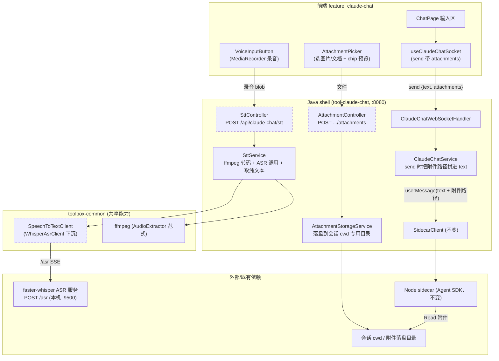
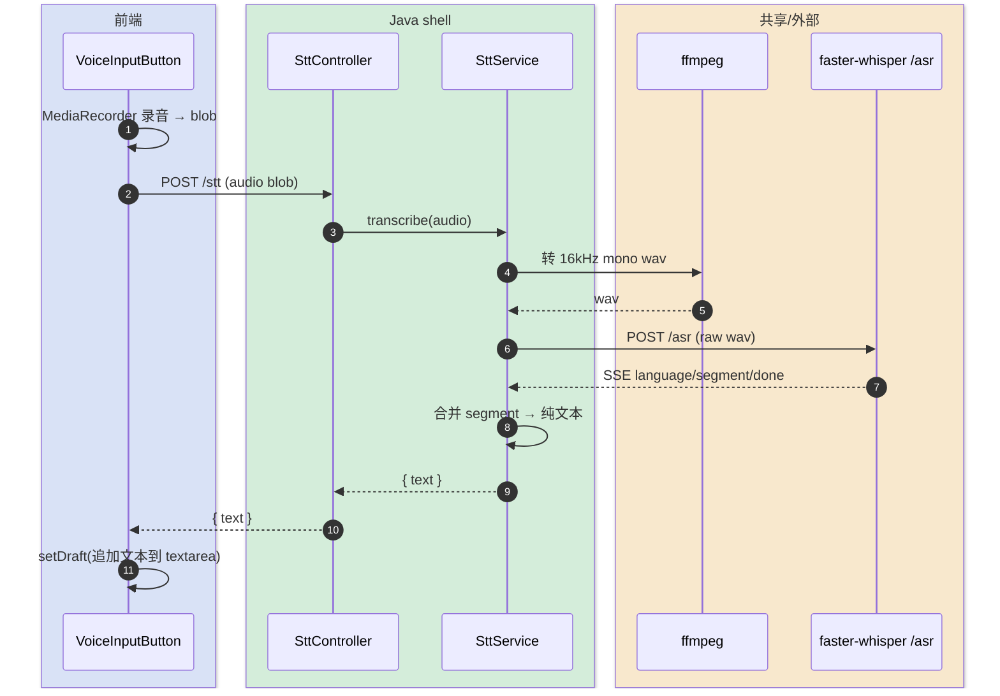
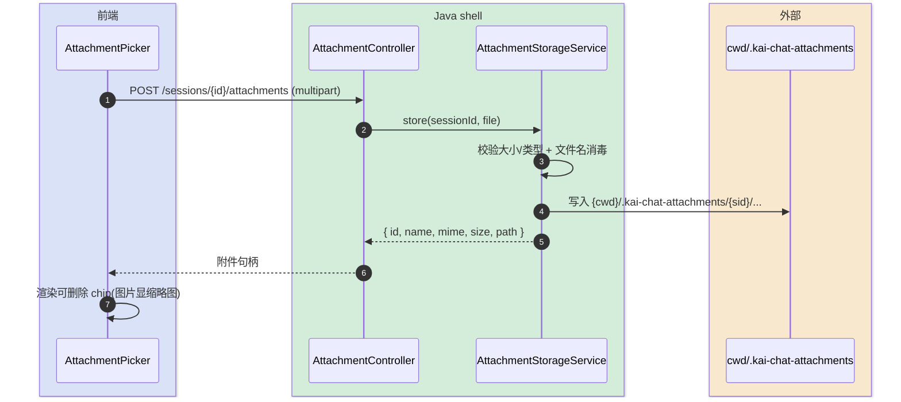
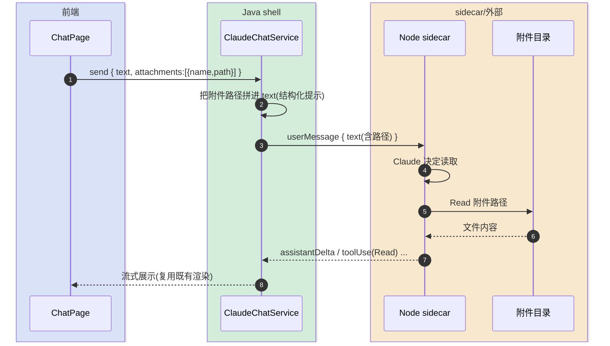

# 语音与附件输入 — 技术方案设计

> 完整-技术模版。本需求是「移动端 Claude 客户端」(`claude-chat` 工具)的子模块，为聊天输入区补充两项能力：
> ① **语音输入**——录音转文字后填入输入框（复用本地 faster-whisper ASR）；
> ② **附件上传**——图片/文档随消息发送，经「落盘 + 路径引用」让 Claude 用自带 Read 读取。
>
> 父文档：[../移动端 Claude 客户端-current.md](../移动端%20Claude%20客户端-current.md)
> 最后更新日期：2026-06-01

---

## 变更记录

| 版本 | 日期 | 修改人 | 变更内容摘要 |
|------|------|--------|--------------|
| v1 | 2026-06-01 | AI | 初始技术方案：语音输入(STT) + 附件上传(落盘+路径引用) |

---

## 1. 目标与边界

- **要解决的问题**：当前 claude-chat 输入区只有纯文本 `textarea`，移动端打字慢、也无法把截图/文档交给 Claude 看。
- **本次目标**：
  - **语音输入**：输入区加麦克风按钮，录音 → 转文字 → 回填 `textarea`，用户可编辑后再发。识别走**本地 faster-whisper ASR**（kai-toolbox 已集成，准确度优先）。
  - **附件上传**：输入区加附件按钮，选图片/文档 → 上传 → 输入框上方显示附件 chip → 随消息一起发送。
  - **附件送达 Claude**：采用**落盘 + 路径引用**——后端把附件存到会话 cwd 下的专用目录，把路径拼进发给 sidecar 的消息文本，Claude 用自带 `Read` 工具读取。
- **不做什么**：
  - 不做多模态 content blocks（不把图片转 base64 image block 直传 SDK）——那要改 sidecar 与 Java↔Node 协议，成本高；本期靠 Claude 的 Read/vision-on-file 能力。
  - 不做语音的「音频附件直传」——语音只用于转文字，原始音频转写完即可丢弃。
  - 不自建 STT 模型/不引入云端 STT——复用本机已跑的 faster-whisper 服务。
  - 不做附件的长期归档/管理 UI——附件是「随这一条消息发出去」的临时产物。
- **设计结论（一句话）**：在现有「前端 ⇄ Java ⇄ Node sidecar」链路的**输入端**做增量扩展——前端加录音/选附件 UI 与两个上传请求，Java 加 STT 转写编排（ffmpeg → faster-whisper）与附件落盘服务，并在 `send` 协议里带上附件路径；**sidecar 不改**（路径已拼进 text，Claude 自行 Read）。

---

## 2. 整体架构

> 在父文档架构基础上，仅新增「输入端」三条增量路径。Java 仍是单一后端，向下复用 faster-whisper 服务与 ffmpeg。



**为什么 STT/附件上传走独立 HTTP 端点而不走 WebSocket**：录音转写与文件上传都是「一次性请求 → 拿结果」，是大体积二进制，HTTP（含 multipart / raw body）天然合适；WS 那条链路保持只传控制类 JSON 消息，职责清晰。

**为什么附件走「落盘 + 路径引用」**：claude-chat 的 Claude 跑在 sidecar 的 Agent SDK 里，本就以 cwd 为工作目录、能用 `Read` 读文件。把附件落到 cwd 内、路径拼进消息，sidecar 与 Java↔Node 协议**零改动**，图片/PDF/文本一视同仁。

---

## 3. 模块拆分与职责

### 3.1 前端：输入区扩展（React）

- **VoiceInputButton + useVoiceRecorder**：用 `MediaRecorder` 录音，停止后拿到音频 blob，POST `/api/claude-chat/stt`，把返回文本 `setDraft` 进 `textarea`（追加到已有草稿尾部，可编辑）。录音中显示计时与停止/取消。
- **AttachmentPicker + AttachmentChips**：`<input type=file multiple>` 选图片/文档，逐个 POST 上传，拿到附件句柄后在输入框上方渲染可删除的 chip（图片显示缩略图）。
- **ChatPage 输入区改造**：在现有 `textarea` + 发送按钮一行，左侧加 📎 和 🎤 两个按钮；上方加附件 chip 区。
- **useClaudeChatSocket.send 改签名**：`send(text, attachments?)`，发送后清空 draft 与附件区。

### 3.2 SttController + SttService（Java，新增）

- **SttController**：`POST /api/claude-chat/stt`，接收音频（raw body，`Content-Type` 取上传值），返回 `{ text }`。短录音同步返回；可选 SSE 透传进度（本期同步即可）。
- **SttService**：编排转写——
  1. 把上传音频用 ffmpeg 转 16kHz mono PCM wav（复用 `AudioExtractor` 同款 ffmpeg 调用范式，兼容 webm/opus、mp4/aac 各端格式）；
  2. 调 `SpeechToTextClient`（见 3.4）拿转写；
  3. 把 ASR 的 VTT/segment 流**合并成纯文本**（去时间轴/标签），返回。
- **关键点**：服务未就绪（faster-whisper 没起）时返回明确错误码，前端提示「请先启动 faster-whisper 服务」并禁用麦克风按钮。

### 3.3 AttachmentController + AttachmentStorageService（Java，新增）

- **AttachmentController**：`POST /api/claude-chat/sessions/{sessionId}/attachments`，multipart 上传，返回附件句柄 `{ id, name, mime, size, path }`（`path` 是服务端绝对路径，供 send 引用；前端只透传不展示）。
- **AttachmentStorageService**：把文件存到**会话 cwd 下的专用目录** `{cwd}/.kai-chat-attachments/{sessionId}/{时间戳}-{原名}`；做文件名消毒、大小/类型校验。提供按 sessionId 清理的入口（会话删除 / 定时清理）。

### 3.4 SpeechToTextClient（toolbox-common，由 WhisperAsrClient 下沉）

- **定位**：跨工具共享的「音频 → 文本」能力，从 `tool-treesize` 的 `WhisperAsrClient` 下沉到 `toolbox-common`，遵守 kai-toolbox「工具间不互相依赖、共享能力走 common」的约定。
- **职责**：封装 faster-whisper 的 `POST /asr`（raw wav body + SSE 解析），暴露「wav → 纯文本」方法；`tool-treesize` 的字幕功能改为依赖 common 的同一实现（保持 VTT 输出能力）。
- **关键点**：本期最小化——若下沉改动面过大，备选是 claude-chat **直接 HTTP 调** `/asr`（协议已知），见 §8 待确认。

### 3.5 ClaudeChatService.sendUserMessage 扩展（Java，改既有）

- `send` 消息新增 `attachments`（`[{name, path}]`）。`sendUserMessage` 在转发给 sidecar 前，把附件以**结构化提示**拼进 text，例如：

  ```
  <用户原文>

  [附件] 用户上传了以下文件，需要时请用 Read 工具查看：
  - 图片：D:/.../.kai-chat-attachments/<sid>/1730-screenshot.png
  - 文档：D:/.../.kai-chat-attachments/<sid>/1730-spec.pdf
  ```

- **sidecar 与 SidecarClient.userMessage 不变**（仍只发 `text`）。

---

## 4. 关键交互

### 4.1 语音输入 → 转文字回填

> 触发：用户点麦克风按钮，录音后松开。参与方：前端、Java(SttController/SttService)、ffmpeg、faster-whisper。



### 4.2 附件上传 → 入 chip

> 触发：用户选了一个或多个文件。参与方：前端、Java(AttachmentController/Storage)、文件系统。



### 4.3 带附件发送 → Claude 读取

> 触发：用户在有附件 chip 的状态下点发送。参与方：前端、Java、sidecar、Claude。



---

## 5. 核心业务规则

| 规则 | 说明 |
|------|------|
| 语音只转文字 | STT 产物是文本并回填输入框；原始音频转写后即可删除，不入消息、不持久化 |
| 文本可编辑再发 | 转写文本进 `textarea`，用户确认/修改后才发送，避免误识别直接发出 |
| 附件落 cwd 内 | 附件必须存到会话 cwd 子目录，Claude 才能用 Read 读到；不存 cwd 外部路径 |
| 路径引用而非内联 | 附件以路径拼进消息文本，不做 base64 内联；图片/文档统一交给 Claude 自取 |
| 附件随会话清理 | 会话删除或定时清理时，移除该 sessionId 的附件目录 |
| 服务未就绪即降级 | faster-whisper 不在线时禁用麦克风并提示，不阻塞文本/附件功能 |
| 端点仅本机 | STT/附件端点沿用 kai-toolbox 单用户 localhost 定位，无鉴权 |

---

## 6. 编码落点

```text
toolbox-common/src/main/java/com/exceptioncoder/toolbox/common/
└── speech/
    ├── SpeechToTextClient.java                                  [新增] WhisperAsrClient 下沉(wav→文本)
    └── (WhisperProperties 视情况一并下沉/复用)                   [改]  共享配置

tools/tool-treesize/...                                          [改]  字幕功能改依赖 common 的 SpeechToTextClient

tools/tool-claude-chat/src/main/
├── java/com/exceptioncoder/toolbox/claudechat/
│   ├── api/
│   │   ├── SttController.java                                   [新增] POST /api/claude-chat/stt
│   │   ├── AttachmentController.java                            [新增] POST .../sessions/{id}/attachments
│   │   └── dto/
│   │       ├── SttResult.java                                   [新增] { text }
│   │       └── AttachmentView.java                              [新增] { id,name,mime,size,path }
│   ├── service/
│   │   ├── SttService.java                                      [新增] ffmpeg 转码 + ASR + 取纯文本
│   │   ├── AttachmentStorageService.java                       [新增] 落盘/校验/清理
│   │   └── ClaudeChatService.java                               [改]  sendUserMessage 拼附件路径
│   └── api/dto/ClientMessage.java                               [改]  Send 记录加 attachments
└── resources/...                                                (无新增表)

frontend/src/features/claude-chat/
├── pages/ChatPage.tsx                                           [改]  输入区加 🎤/📎 + chip 区
├── components/
│   ├── VoiceInputButton.tsx                                     [新增] 录音按钮 + 状态
│   └── AttachmentChips.tsx                                      [新增] 附件预览/删除
├── hooks/
│   ├── useVoiceRecorder.ts                                      [新增] MediaRecorder 封装
│   └── useClaudeChatSocket.ts                                   [改]  send(text, attachments?)
├── api.ts                                                       [改]  transcribe() / uploadAttachment()
└── types.ts                                                     [改]  ClientMessage.send 加 attachments; 新增 Attachment 类型
```

### 调用关系说明

- 语音：`VoiceInputButton` → `POST /stt` → `SttController` → `SttService` →（ffmpeg）→ `SpeechToTextClient` → faster-whisper。
- 附件：`AttachmentPicker` → `POST /attachments` → `AttachmentController` → `AttachmentStorageService` → 落盘。
- 发送：`useClaudeChatSocket.send` → WS → `ClaudeChatService.sendUserMessage`（拼路径）→ `SidecarClient.userMessage`（**不变**）。

---

## 7. 数据与依赖变更

| 类型 | 是否变化 | 说明 |
|------|----------|------|
| 数据库表 / 字段 / 索引 | 无 | 附件是临时落盘文件，不建表（如需审计可后续加，本期不做） |
| DTO / VO / 枚举 | 有 | 新增 `SttResult`、`AttachmentView`；`ClientMessage.Send` 加 `attachments`；前端 `types.ts` 同步 |
| 对外接口 | 有 | 新增 `POST /stt`、`POST /sessions/{id}/attachments`；WS `send` 协议扩展（详见 api 文档） |
| 下游 / 外部依赖 | 复用 | 复用本机 faster-whisper（`/asr`）+ ffmpeg；无新增外部服务 |
| 共享能力下沉 | 有 | `WhisperAsrClient` → `toolbox-common.SpeechToTextClient`，`tool-treesize` 改依赖 |
| 缓存 / 锁 / 事务 | 无 | 无 |

---

## 8. 风险与待确认

| 风险 / 待确认点 | 影响 | 处理方式 |
|----------------|------|----------|
| **ASR 复用方式**：下沉 common vs claude-chat 直连 `/asr` | 改动面 | 默认下沉 common（符合架构约定、tool-treesize 同享）；若下沉牵动过大，退化为 claude-chat 直连 Python `/asr`。**待确认** |
| **附件落盘位置**：cwd 内 `.kai-chat-attachments/` vs 其它 | Claude 可达性 / 工作区污染 | 默认 cwd 内隐藏目录（Claude 用 Read 必须可达）；提供清理。**待确认是否接受写入工作目录** |
| **移动端录音格式**：iOS Safari 产 mp4/aac、Android 产 webm/opus | 兼容性 | 后端统一 ffmpeg 转 16kHz wav 兜底，不依赖前端格式 |
| **STT 返回方式**：同步 vs SSE 进度 | 长录音体验 | 本期同步返回；超长录音再加 SSE 进度（faster-whisper 已支持） |
| **附件大小/数量上限** | 内存/磁盘 | 设上限（如单文件 ≤ 50MB、单消息 ≤ 10 个），raw/stream 落盘不进堆 |
| **附件清理时机** | 磁盘占用 | 会话删除即删目录；可加启动时清理过期附件 |
| **Read 权限弹窗** | 交互 | Claude 读附件可能触发权限弹窗（已有 PermissionDialog 链路），属预期，提示文本里说明路径来源 |
| **麦克风权限** | 可用性 | 需 HTTPS / localhost 才能拿 `getUserMedia`；tunnel 暴露时确保走 https |

---

## 9. 验证要点

- **语音正常路径**：录一段中文 → 转写文本正确回填 → 编辑后发送。
- **语音异常路径**：faster-whisper 未启动 → 麦克风禁用并提示；录空音频 → 返回空文本不报错。
- **附件正常路径**：上传 1 图 + 1 PDF → chip 正确显示 → 发送 → Claude 触发 Read 读到文件并回应。
- **附件边界**：超大文件被拒；删除 chip 后不随消息发送；多附件路径全部拼入。
- **回归范围**：不影响纯文本发送、权限/提问弹窗、断连重连、历史会话续跑；`tool-treesize` 字幕功能在 ASR 下沉后仍正常。
- **构建**：`mvn package` fat-jar 仍能构建并嵌入前端；common 下沉不破坏既有模块依赖。
