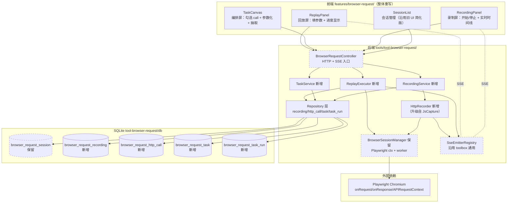
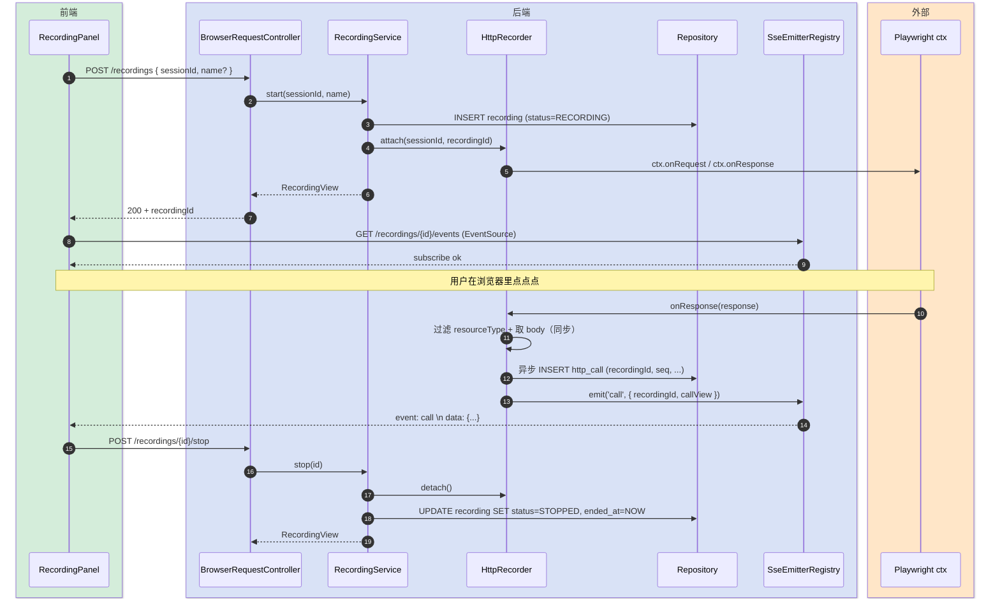
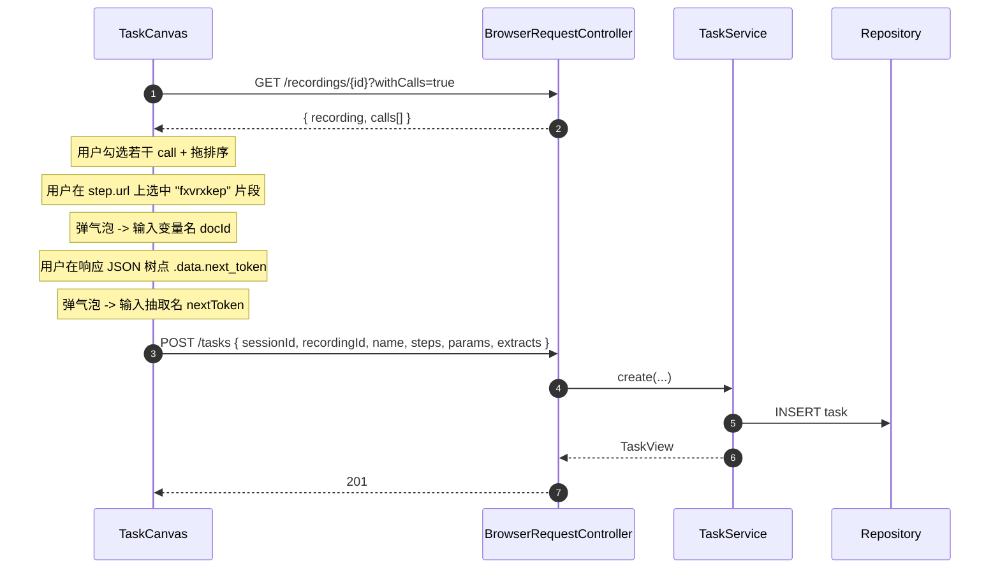
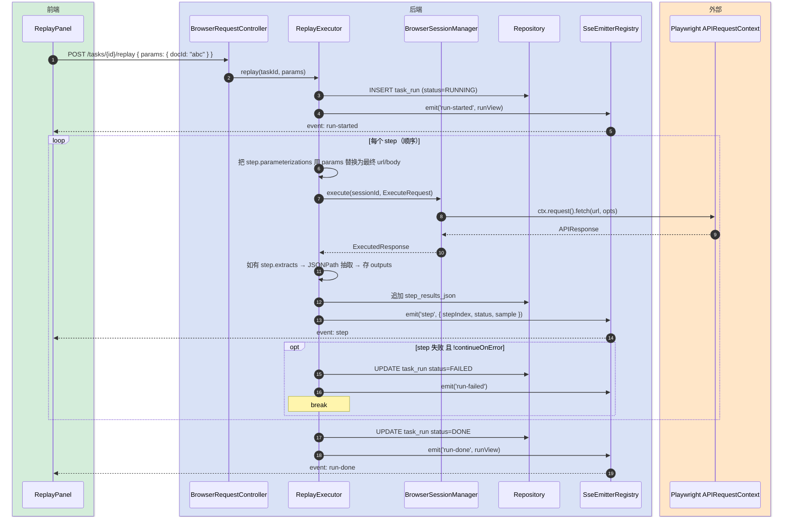
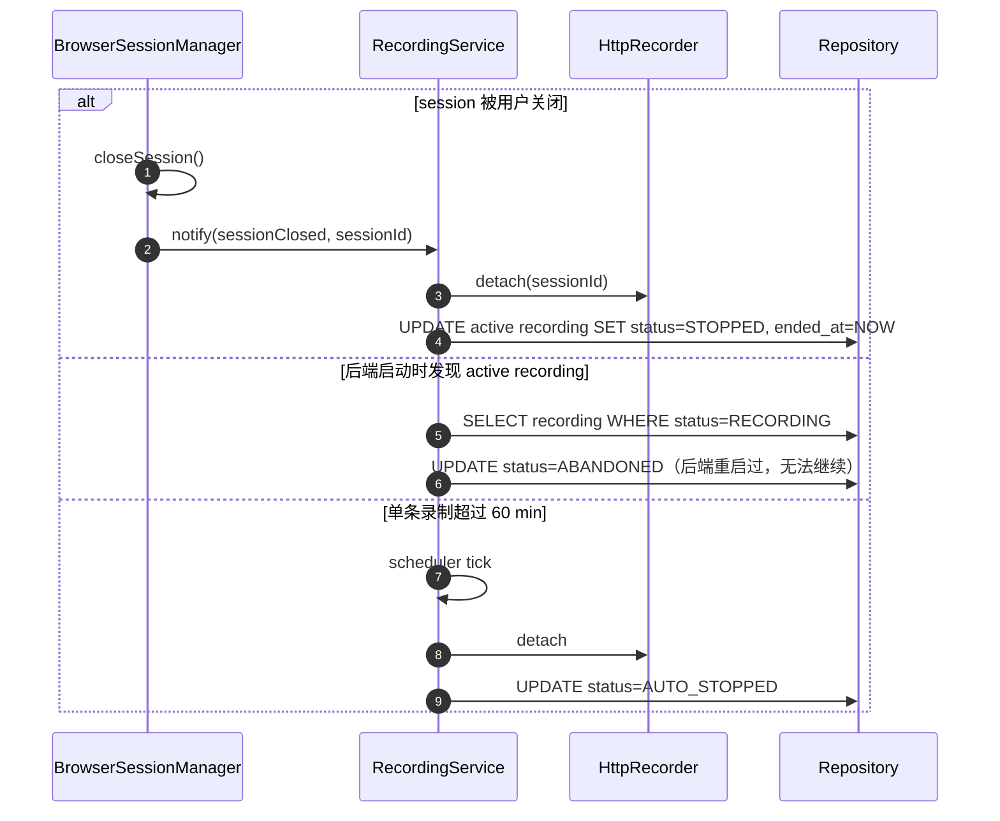

# 站点录制编排（完整·技术方案）

> **要解决的问题**：旧版浏览器请求功能（saved request / pipeline / vars / outputs）需要用户懂 cURL、懂 JSONPath、懂 `{{var}}` 模板，门槛高。重做为「录制 → 编排 → 回放」三屏，让用户在真浏览器里**点一遍**就能形成可回放任务。
>
> **本次目标**：
> - 后端：保留 Playwright session 管理 + storage state；新增 HTTP 全量录制器、Recording / Task / TaskRun 模型与服务；删除旧 saved/pipeline/vars 数据层
> - 前端：删除现有 `features/browser-request/`，重写为录制屏 / 编排屏 / 回放屏三页
> - 数据库：保留 `browser_request_session` 表；新增 4 张表；删除 4 张旧表
>
> **不做什么**：
> - 不做 DOM 事件录制（鼠标点 / 键盘输入），只录 HTTP 调用——回放是 HTTP 重放，不是 UI 重演
> - 不引入 DAG 画布 / JSONata 表达式 / 跨 session 共享变量
> - 不做 cookie 注入 / header 覆盖等高级模式（沿用旧 ctx 的 storage state 即可）
> - 不做 WebSocket 录制（只录请求-响应一来一回的 HTTP，WS 单独议题）
>
> **设计结论（一句话）**：在 Playwright BrowserContext 上挂全 HTTP 监听 → 实时落库 + SSE 推前端时间线 → 用户在时间线上选 call 子集 + 在文本片段上标 `${var}` + 在响应树上点字段抽取 → 保存为 Task → 填变量值后顺序回放，每步走 `APIRequestContext.fetch`。

---

## 变更记录

| 版本 | 日期 | 修改人 | 变更内容摘要 |
|------|------|--------|--------------|
| v1 | 2026-05-21 | AI | 初始版本：「录制 / 编排 / 回放」三屏 + 后端模型重做 |

---

## 1. 目标与边界

- **保留**：`BrowserSessionManager`（Playwright ctx + worker 线程 + storage state）、`browser_request_session` 表、`BrowserRequestProperties` 配置、`StealthConfig` 反检测、`BossRiskBypass` 拦截器、tool 描述符
- **改造**：`JsCapture` → 升级为 `HttpRecorder`（监听全 HTTP，原 JS 文件抓取作为子能力保留为可选开关）；`BrowserRequestController` 删除 saved/var/pipeline 端点，新增 recording/task/replay 端点；`BrowserRequestService` 同步收缩
- **新增**：4 个 domain + 4 个 repository + `RecordingService` + `TaskService` + `ReplayExecutor` + SSE 推送通道
- **删除**：`SavedRequest` / `BrowserVar` / `Pipeline` / `PipelineRun` 全部 domain + repository + DTO；`CurlParser` / `TemplateRenderer` / `SimpleJsonPath` / `PipelineExecutor` 4 个 service 类
- **数据库**：删 4 表（saved / var / pipeline / pipeline_run），加 4 表（recording / http_call / task / task_run）

---

## 2. 整体架构



---

## 3. 模块拆分与职责

### 3.1 BrowserSessionManager（保留，不动）

- **定位**：Playwright Chromium + BrowserContext 生命周期管理
- **职责**：
  - 按 sessionId 开/关 Playwright ctx；登录态走 storage-state.json 持久化
  - 提供单线程 worker 让所有 Playwright 调用串行化（线程安全前提）
- **上游**：HttpRecorder（取 ctx 装监听）、ReplayExecutor（拿 `ctx.request()` 执行回放）
- **下游**：Playwright BrowserType / BrowserContext / APIRequestContext
- **关键设计点**：不变更现有实现；新增模块只读取已暴露的 `requireCtx(sessionId)` 等口子

### 3.2 HttpRecorder（升级自 JsCapture）

- **定位**：单 BrowserContext 的全 HTTP 调用录制器
- **职责**：
  - 在 ctx 上挂 `onRequest` / `onResponse`：每条满足过滤规则的调用 → 落 `browser_request_http_call` + SSE 推送
  - 同步触发同录制对应的 `Recording.callCount / lastActiveAt` 增量更新
- **上游**：RecordingService（启停 + 切换）
- **下游**：BrowserSessionManager（拿 ctx）、HttpCallRepository（落库）、SseEmitterRegistry（实时推送）
- **关键设计点**：
  - **过滤规则**：默认只录 `resourceType ∈ {xhr, fetch, document}`，跳过 stylesheet/image/media/font/script；用户可在录制开关里勾「也录 JS」沿用 JsCapture 旧能力
  - **响应体落盘**：≤ 256KB 全存 DB，> 256KB 截断 + `truncated=1`；超过 2MB 不存 body 仅留元数据（防内存炸）
  - **同步落 vs 异步写**：`onResponse` 回调里同步取 body（Playwright 限制），随即把数据丢异步队列写库 + SSE 推送（DB 落库与 SSE 推送都是 IO，不能堵 Playwright worker）
  - **敏感字段过滤**：URL 含 `password=` / `pwd=` / `token=` 这种关键词时，请求体 + 响应体不入库（仅留元数据 + 标记 `sensitive=1`）

### 3.3 RecordingService

- **定位**：录制的元数据管理 + 启停编排
- **职责**：
  - 启停录制（每个 session 最多 1 个 active recording；START 时若已有 active → 自动 STOP 旧的）
  - 列出某 session 的所有 recording（含 active 状态）；查录制详情（含 http_call 列表分页）
  - 删除 recording（级联删 http_call；可选保留派生 task）
- **上游**：BrowserRequestController（recording/* 端点）
- **下游**：HttpRecorder（挂/摘监听）、RecordingRepository / HttpCallRepository
- **关键设计点**：
  - 录制时长硬上限 60 分钟（超时自动 STOP）；call 数硬上限 5000 条（超过自动 STOP + 提示用户）
  - HTTP call 列表按 `seq ASC`（recording 内单调递增）；前端时间线分页加载（默认每页 50）
  - 单 session 只允许 1 个 active recording（用 DB UNIQUE 约束 + 应用层守门双保险）

### 3.4 TaskService

- **定位**：Task（编排好的可回放任务）模型管理
- **职责**：
  - 创建/更新/删除 Task；Task 内容 = `{ steps[], params[], extracts[] }` 序列化为 JSON
  - 列出某 session 的 Task；查 Task 详情
- **上游**：BrowserRequestController（task/* 端点）
- **下游**：TaskRepository
- **关键设计点**：
  - Task 不强制关联 Recording：可以从录制派生（自动填 steps），也可以手工拷一份 HTTP 调用进来（兜底场景）
  - **steps 数据结构**：`[ { fromCallId | adhoc{method,url,headers,body}, name, parameterizations[] } ]`——一个 step 引用一条 http_call 或自带请求模板
  - **parameterizations**：`{ field: 'url' | 'header.X' | 'body', token: '原文片段', varName: 'docId' }`——用户在 URL/body 文本上高亮一段并命名，回放时该段被 `${varName}` 替换
  - **extracts**：`{ name, jsonPath, fromStep }`——从某 step 的响应里取值，存入 task_run.outputs；下游 step 可在 parameterizations 里用 `${docId}` 形式引用上游产物（同 task 内）

### 3.5 ReplayExecutor

- **定位**：Task 回放执行器
- **职责**：
  - 接 Task + 用户填入的变量值 → 顺序执行每 step（走 `ctx.request().fetch`）→ 写 task_run + SSE 推每步进度
  - 失败行为：默认 stop-on-error；step 可单独标 continueOnError
- **上游**：BrowserRequestController（replay 端点）
- **下游**：BrowserSessionManager（拿 ctx）、TaskRunRepository、SseEmitterRegistry
- **关键设计点**：
  - 单 session 单线程顺序（Playwright worker 模型决定）；并发回放需多 session 同时跑
  - 变量替换在 step 出发前做：扫描 `parameterizations` 把 `token` 段在对应 field 内替换为变量值（**简单字符串替换**，不引入模板引擎；为避免误替换，token 必须是原 call 中存在的字符串片段）
  - 同 task 内跨 step 引用：`${varName}` 优先从 task_run 已抽取出来的 outputs 取，找不到再退到用户输入的 params
  - 节流：step 间默认 200ms 间隔，可在 task 级配置（防限流；和旧 PipelineExecutor 一致）

### 3.6 前端 RecordingPanel

- **定位**：录制屏（傻瓜式入口）
- **职责**：
  - 大 START/STOP 按钮 + 录制状态指示（时长、call 数、是否到上限）
  - 实时时间线（订阅 SSE，每条 call 一张卡片：method 徽章 + URL + 状态码 + 耗时 + 折叠的请求/响应详情）
  - 「跳到编排」按钮：跳转到 TaskCanvas，预选刚才录的 recording
- **上游**：用户路由 `/tools/browser-request`
- **下游**：调 REST recording/* + 订阅 SSE
- **关键设计点**：用 `@tanstack/react-query` 管 recording 列表；SSE 流由 `useRecordingStream(recordingId)` 自定义 hook 持有 EventSource

### 3.7 前端 TaskCanvas

- **定位**：编排屏（核心交互）
- **职责**：
  - 左侧：所选 recording 的 call 列表（可勾选 + 拖拽排序 + 添加到 task steps）
  - 中间：当前 task 的 steps 列表（每个 step 显示 method/url + 参数化点数量 + 抽取数量）
  - 右侧：选中 step 的详情：URL/headers/body 可用「文本选中 → 弹小气泡 → 命名变量」做参数化；响应 JSON 树状视图可点字段 → 命名抽取
  - 保存按钮：序列化 steps/params/extracts 入 task
- **上游**：用户路由 `/tools/browser-request/tasks/:taskId`
- **下游**：调 REST task/* + GET recording 详情
- **关键设计点**：
  - 参数化交互：监听容器 `selectionchange`，当选中范围跨 URL/body 等可参数化字段时，浮出小气泡「命名为变量」；输入后把 `{ field, token: 选中文本, varName }` 加进 step.parameterizations
  - 抽取交互：复用现有 `JsonTreeEditor` 思路但反向——点叶子节点弹「抽取并命名」（JSONPath 自动生成）

### 3.8 前端 ReplayPanel

- **定位**：回放屏（最终消费入口）
- **职责**：
  - Task 列表 + 每条「回放」按钮
  - 点回放 → 弹 modal 填变量值（params 名 + 类型 + 默认值）→ 提交 → 实时进度面板（每 step 状态 + 错误展示）
  - 历史回放列表 + 详情（查看每 step 的请求/响应）
- **上游**：用户路由 `/tools/browser-request/replay/:taskId`
- **下游**：调 REST task/{id}/replay + 订阅 SSE
- **关键设计点**：
  - 表单模式（单次回放）已够用；批量模式（CSV/表格驱动多行变量）作为 P2 不在本期

---

## 4. 关键交互

### 4.1 启动录制 → HTTP 调用入库

> **触发**：用户在 RecordingPanel 点「开始录制」
> **参与方**：前端 RecordingPanel / 后端 Controller / RecordingService / HttpRecorder / Playwright ctx / DB / SSE



### 4.2 编排：用户选 call + 参数化 + 保存 Task

> **触发**：用户从 RecordingPanel 跳转 TaskCanvas
> **参与方**：前端 TaskCanvas / Controller / TaskService



### 4.3 回放执行

> **触发**：用户在 ReplayPanel 点「回放」
> **参与方**：前端 ReplayPanel / Controller / ReplayExecutor / BrowserSessionManager



### 4.4 录制异常 / 强制清理

> **触发**：session 关闭 / 后端重启 / 用户超时 60min



---

## 5. 核心业务规则

| 规则 | 说明 |
|------|------|
| **录制资源类型过滤** | 默认只录 `resourceType ∈ {xhr, fetch, document}`；图片/字体/样式/JS/媒体跳过。用户可在录制启动参数里勾「也录 JS」放开 script |
| **敏感字段拦截** | URL 含 `password` / `pwd` / `token` / `secret` query/form 字段时，请求/响应 body 不入库，仅存元数据 + `sensitive=1` 标记 |
| **响应体大小分档** | ≤256KB 全存；256KB-2MB 截断到 256KB + `truncated=1`；>2MB 不存 body 仅元数据 |
| **单 session 单 active recording** | DB UNIQUE 约束 `(session_id, status='RECORDING')`；启动新录制时若已有 active → 先 stop 旧的再开新的 |
| **录制硬上限** | 时长 60 min / 调用 5000 条；任意一个达上限自动 STOP；可在 properties 配置 |
| **Task 步骤序列** | step 严格按数组下标顺序执行；step 内 parameterizations 替换在执行前完成；上游 extracts 写入的 outputs 对下游 step 可见 |
| **参数化必须是子串匹配** | `parameterization.token` 必须是原 URL/header value/body 中**存在的字符串片段**；保存时若 token 不在原文 → 报错拒绝保存 |
| **抽取使用简化 JSONPath** | 支持 `$.a.b.c[0].d` 与 `[*]`；不支持过滤/聚合（沿用 SimpleJsonPath） |
| **step 失败默认 stop-on-error** | 单 step 可 opt-in `continueOnError`；整个 task 失败时 task_run.status=FAILED |
| **step 间节流** | 默认 200ms；task 级可调；防止下游限流 |
| **回放变量替换是字符串替换** | 不引入模板引擎；token 替换为 params[varName] 或上游 extracts[varName]；找不到值 → step 失败，错误明确说明缺哪个变量 |
| **后端重启清理** | 应用启动时把 status=RECORDING 的记录强制改为 ABANDONED（无法续录） |

---

## 6. 编码落点

### 6.1 后端 `tools/tool-browser-request/src/main/java/com/exceptioncoder/toolbox/browserrequest/`

```text
tools/tool-browser-request/src/main/
├── java/com/exceptioncoder/toolbox/browserrequest/
│   ├── api/
│   │   ├── BrowserRequestController.java               [修改] 删 saved/var/pipeline 端点，新增 recording/task/replay
│   │   └── dto/
│   │       ├── CreateSessionRequest.java               [不变]
│   │       ├── ExecuteRequestBody.java                 [删除]
│   │       ├── ExtractToSavedRequest.java              [删除]
│   │       ├── PipelineDtos.java                       [删除]
│   │       ├── SaveRequestBody.java                    [删除]
│   │       ├── UpsertVarRequest.java                   [删除]
│   │       ├── StartRecordingRequest.java              [新增] { name? }
│   │       ├── CreateTaskRequest.java                  [新增] { name, recordingId?, steps[], params[], extracts[] }
│   │       ├── UpdateTaskRequest.java                  [新增]
│   │       └── ReplayRequest.java                      [新增] { params: Map<String,Object> }
│   ├── config/
│   │   ├── BossRiskBypass.java                         [不变]
│   │   ├── BrowserRequestAutoConfig.java               [修改] 改注册的 bean 清单
│   │   ├── BrowserRequestDescriptor.java               [修改] 描述改成「站点录制编排」
│   │   ├── BrowserRequestProperties.java               [修改] 加 recording 上限配置（maxDurationMs/maxCalls/bodyMaxBytes/...）
│   │   ├── BrowserSessionManager.java                  [不变] 保留 Playwright 基础设施
│   │   └── StealthConfig.java                          [不变]
│   ├── domain/
│   │   ├── BrowserSession.java                         [不变]
│   │   ├── BrowserVar.java                             [删除]
│   │   ├── Pipeline.java                               [删除]
│   │   ├── PipelineRun.java                            [删除]
│   │   ├── SavedRequest.java                           [删除]
│   │   ├── Recording.java                              [新增] { id, sessionId, name, status, startedAt, endedAt, callCount }
│   │   ├── HttpCall.java                               [新增] { id, recordingId, seq, method, url, requestHeaders, requestBody, status, responseHeaders, responseBody, responseTruncated, sensitive, startedAt, elapsedMs, resourceType, initiator }
│   │   ├── Task.java                                   [新增] { id, sessionId, recordingId?, name, stepsJson, paramsJson, extractsJson, createdAt, updatedAt }
│   │   └── TaskRun.java                                [新增] { id, taskId, status, startedAt, finishedAt, inputsJson, stepResultsJson, errorMessage? }
│   ├── repository/
│   │   ├── BrowserSessionRepository.java               [不变]
│   │   ├── BrowserVarRepository.java                   [删除]
│   │   ├── PipelineRepository.java                     [删除]
│   │   ├── PipelineRunRepository.java                  [删除]
│   │   ├── SavedRequestRepository.java                 [删除]
│   │   ├── RecordingRepository.java                    [新增]
│   │   ├── HttpCallRepository.java                     [新增]
│   │   ├── TaskRepository.java                         [新增]
│   │   └── TaskRunRepository.java                      [新增]
│   ├── service/
│   │   ├── BrowserRequestService.java                  [修改] 收缩为 session 相关入口 + 委派到新 service
│   │   ├── CurlParser.java                             [删除]
│   │   ├── JsCapture.java                              [删除] 能力被 HttpRecorder 取代（JS 抓取作为 P2 沿用）
│   │   ├── PipelineExecutor.java                       [删除]
│   │   ├── SessionAutoSaver.java                       [不变]
│   │   ├── SimpleJsonPath.java                         [保留] ReplayExecutor 的 extracts 用得到
│   │   ├── TemplateRenderer.java                       [删除]
│   │   ├── HttpRecorder.java                           [新增] 全 HTTP 录制器（替代 JsCapture）
│   │   ├── RecordingService.java                       [新增]
│   │   ├── TaskService.java                            [新增]
│   │   └── ReplayExecutor.java                         [新增]
└── resources/
    ├── db/
    │   └── browser-request-schema.sql                  [修改] 删 4 表 + 加 4 表（保留 session 表）
    └── stealth/
        └── stealth.js                                  [不变]
```

### 6.2 前端 `frontend/src/features/browser-request/`（整目录已删，重写）

```text
frontend/src/features/browser-request/
├── index.tsx                                            [新增] FeatureManifest（name=「站点录制编排」, icon=Globe, group=网络工具）
├── api.ts                                               [新增] axios/fetch 封装：sessions / recordings / tasks / replay
├── types.ts                                             [新增] SessionView / RecordingView / HttpCallView / TaskView / StepSpec / ParameterizationSpec / ExtractSpec / TaskRunView
├── pages/
│   ├── BrowserRequestPage.tsx                          [新增] 顶层路由壳：session 选择 + Tab(录制/编排/回放)
│   ├── RecordingDetailPage.tsx                         [新增] 单个录制的详情页（call 列表 + 跳编排）
│   ├── TaskCanvasPage.tsx                              [新增] 编排页
│   └── ReplayPage.tsx                                  [新增] 回放页
├── components/
│   ├── SessionList.tsx                                 [新增] 简化版（沿用旧 schema）
│   ├── RecordingPanel.tsx                              [新增] START/STOP + 时间线
│   ├── HttpCallCard.tsx                                [新增] 一条 call 的卡片（method/url/status/elapsed + 折叠详情）
│   ├── CallTimeline.tsx                                [新增] 时间线容器（SSE 流接收 + 渲染 HttpCallCard 列表）
│   ├── TaskStepEditor.tsx                              [新增] 单 step 编辑：parameterization 选区 + extracts 树
│   ├── ParameterizeBubble.tsx                          [新增] 选中文本时浮出的气泡 UI
│   ├── ExtractTree.tsx                                 [新增] 响应 JSON 树点字段抽取
│   ├── ReplayFormDialog.tsx                            [新增] 填变量值 modal
│   └── ReplayProgressPanel.tsx                         [新增] SSE 实时进度
├── hooks/
│   ├── useRecordingStream.ts                           [新增] EventSource hook，订阅录制 SSE
│   ├── useReplayStream.ts                              [新增] EventSource hook，订阅回放 SSE
│   └── useTextSelection.ts                             [新增] 选区监听（参数化气泡触发）
└── utils/
    ├── jsonpath.ts                                     [新增] 前端 JSONPath 自动生成 + 校验（与后端 SimpleJsonPath 等价子集）
    └── tokenMatch.ts                                   [新增] parameterization token 在原文中是否存在的校验
```

### 调用关系说明

- **录制路径**：`RecordingPanel → POST /recordings/start → RecordingService → HttpRecorder.attach → ctx.onResponse → HttpCallRepository + SseEmitterRegistry`
- **编排路径**：`TaskCanvas → GET /recordings/{id}?withCalls → 用户操作 → POST /tasks → TaskService → TaskRepository`
- **回放路径**：`ReplayPanel → POST /tasks/{id}/replay → ReplayExecutor.replay → 逐 step 替换变量 → BrowserSessionManager.execute → APIRequestContext.fetch → 写 TaskRun + SSE`

---

## 7. 数据与依赖变更

| 类型 | 是否变化 | 说明 |
|------|----------|------|
| 数据库表 / 字段 / 索引 | **有（破坏性）** | 删 `browser_request_saved` / `browser_request_var` / `browser_request_pipeline` / `browser_request_pipeline_run` 4 表；新增 `browser_request_recording` / `browser_request_http_call` / `browser_request_task` / `browser_request_task_run` 4 表；`browser_request_session` 表保留不动。schema 详见 [站点录制编排-api-current.md] 附录 |
| DTO / VO / 枚举 | **有** | 删 6 个旧 DTO；新增 4 个 DTO（StartRecording / CreateTask / UpdateTask / Replay）；新增 enum `RecordingStatus`（RECORDING / STOPPED / ABANDONED / AUTO_STOPPED）、`TaskRunStatus`（RUNNING / DONE / FAILED / CANCELLED）、`ResourceType`（XHR / FETCH / DOCUMENT / SCRIPT） |
| 下游接口 / 外部依赖 | **无新依赖** | 仍只依赖 Playwright；不引入新 maven 依赖 |
| 缓存 / 消息 / 锁 / 事务 | **有（弱）** | SQLite 单库事务即可；无新锁/消息队列；HttpRecorder 的 DB 写入用单线程 ExecutorService 串行化（防 SQLite 并发写冲突） |

---

## 8. 风险与待确认

| 风险 / 待确认点 | 影响 | 处理方式 |
|----------------|------|----------|
| Playwright `onResponse` 取 body 同步阻塞 worker | 长录制时 + 大响应 → 录制响应延迟 | body 取出后立即丢异步队列；超过 2MB 不取 body 仅元数据 |
| 录制时漏抓登录密码 | 用户隐私泄露 | 敏感字段过滤规则（password/pwd/token 等关键词命中 → body 不入库） |
| SSE 推送峰值（高频 call） | 前端时间线卡顿 | HttpRecorder 内做 100ms 节流批量推送；前端 react-virtual 滚动 |
| 用户参数化点选了"看似一致但内容不同"的文本 | 替换错位置 | parameterization 保存时校验 token 在原文中**仅出现一次**；多次出现要求用户消歧（指定行号 / 用户手动改） |
| 录制开了忘关 | 数据膨胀 | 60min 硬超时 + 5000 call 硬上限 + 后端启动时清理 ABANDONED |
| 后端重启时 active recording 状态丢失 | 用户以为还在录其实没了 | 启动时 `UPDATE status=ABANDONED WHERE status=RECORDING`；前端列表显示 ABANDONED 状态 |
| 跨 step 引用的 extract 取到 null | step 替换失败 | step 失败 + 错误消息明确说"上游 step X 的 extract Y 取到 null" |
| 旧数据迁移 | 现有用户的 saved/pipeline 全丢 | 用户已确认全清；schema 升级脚本里 DROP 旧表（**首次启动前提示用户备份**） |
| SQLite ALTER 限制 | 旧表 `browser_request_session` 上要不要新增字段 | 不加字段；HttpRecorder 直接读 session_id |
| 浏览器扩展 / SW 拦截的请求 | 部分 SaaS 的请求被 SW 拦走，Playwright 看不到 | 列在已知限制里，不修；用户在录制结束发现少 call 时手工加 step（adhoc 模式） |

---

## 9. 验证要点

- **正常路径**：
  - 新建 session → open → 登录 → 开录制 → 在浏览器里点几下做某操作（如打开一个文档列表 + 进某文档详情）→ 停录制 → 时间线显示这些 call → 跳编排 → 选定 2 个 call、把文档 ID 标成 `${docId}` → 保存 task → 回放页填 `docId=xxx` → 一键回放 → 看到两步绿√
- **异常路径**：
  - 录到一半网络断了：HttpRecorder 不抛错，已录的 call 保留
  - 后端杀进程：active recording 状态被下次启动清理为 ABANDONED
  - parameterization 的 token 在 URL 里出现两次：保存时报错
  - replay 时 params 缺一个变量：明确说"缺 docId"
- **边界条件**：
  - 单 call response body 5MB（>2MB 上限）：仅存元数据，body 字段 NULL
  - 录制 5001 条 call：自动 STOP 并提示"达上限"
  - 录制持续 61min：自动 STOP
  - SSE 连接断了又重连：前端 EventSource 自动重连，后端按 lastEventId 续推（实现中可先全量重发已录 call）
- **回归范围**：
  - `BrowserSessionManager` 不动 → session 列表 / open / close / save storage 必须无回归
  - `SessionAutoSaver` 不动 → storage 自动落盘逻辑无回归
  - `BossRiskBypass` / `StealthConfig` 不动 → 站点反检测能力无回归
