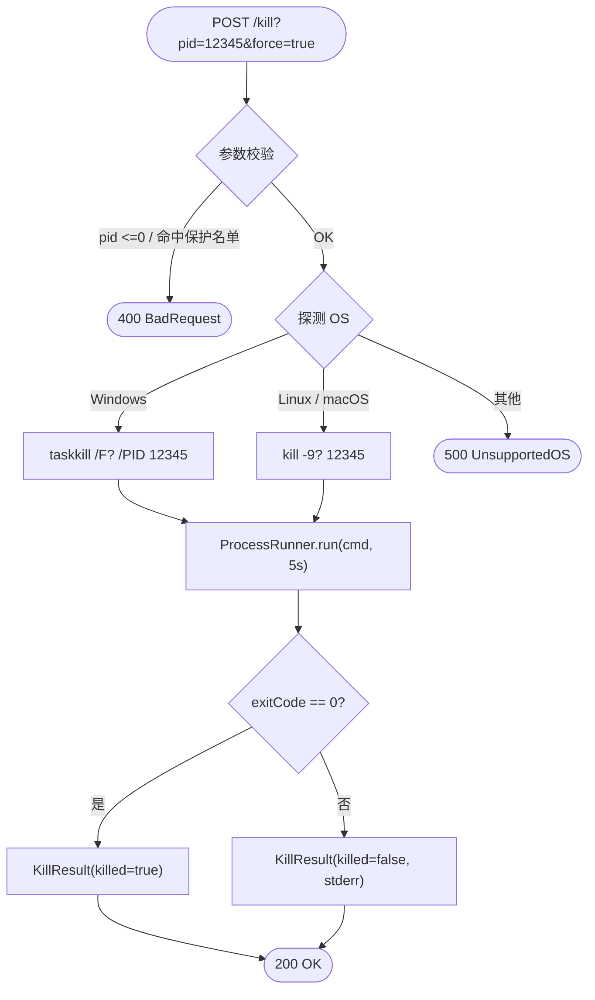

# 端口进程终止能力

> 最后更新：2026-05-21
> 模版：轻量（lightweight）
> 父工具：`tool-port-process`（kai-toolbox 已有「端口进程查询」工具，本次加能力延伸）
>
> **关于模版分级：** 本次改动新增 1 个对外 endpoint，字面破第一·七步硬清单第 3 项；但实际是给已有工具加能力延伸（查 → 查+杀）、0 新类、约 50 行净改动；完整-技术模版的"架构图 + 模块拆分 + 4 张时序图"对本场景过载。判定为【轻量】，使用本模版。

---

## 1. 代码入口

| 文件（全路径） | 现状 | 本次改动 |
|---|---|---|
| `tools/tool-port-process/src/main/java/com/exceptioncoder/toolbox/portprocess/api/PortProcessController.java` | 已有 `GET /api/port-process` | 加 `POST /api/port-process/kill` |
| `tools/tool-port-process/src/main/java/com/exceptioncoder/toolbox/portprocess/service/PortLookupService.java` | 已有 `lookup(port)` | 加 `kill(pid, force)` 方法 |
| `tools/tool-port-process/src/main/java/com/exceptioncoder/toolbox/portprocess/api/dto/KillResult.java` | 不存在 | **新增** record |
| `frontend/src/features/port-process/pages/PortProcessPage.tsx` | 已有"查询"表格 | 每行加「杀」按钮 + 确认 dialog |

**复用基础设施：** `ProcessRunner` 已有（同模块，跑外部命令带超时）。无新依赖。

---

## 2. 接口契约

### 2.1 `POST /api/port-process/kill`

| 项 | 内容 |
|---|---|
| 入参（query string 或 JSON body） | `pid: long`（必填）、`force: boolean`（可选，默认 false） |
| 返回 | `KillResult` |
| 错误码 | `400` pid 非法 / 命中保护名单；`500` 命令执行异常 |

**KillResult 字段：**

```java
public record KillResult(
    long pid,
    boolean killed,         // 是否成功结束进程（命令 exit code == 0）
    String os,              // "Windows" / "Linux" / "macOS"
    String command,         // 实际执行的命令文本，给前端展示用
    int exitCode,           // 子进程 exit code
    String stdout,          // 截断到 1KB
    String stderr,          // 截断到 1KB
    long elapsedMs
) {}
```

**入参约束：**

- `pid` 必须 > 0 且 < 2^31（与 OS 进程号范围一致）
- `pid` 不得为以下值（保护名单，命中直接 400）：
  - `1`（Unix init / Windows System Idle Process）
  - `4`（Windows System）
  - `ProcessHandle.current().pid()`（kai-toolbox 自身进程，杀自己会立刻断 HTTP 响应）
- `force=true` 才发硬终止信号（Windows 加 `/F`、Unix 用 `kill -9`）；默认 `force=false` 走优雅终止（Windows 不带 `/F`、Unix 用 `kill -15`）

---

## 3. 核心流程



### 3.1 平台命令分发表

| OS | force=true（硬终止） | force=false（优雅终止） | 探测来源 |
|---|---|---|---|
| Windows | `taskkill /F /PID <pid>` | `taskkill /PID <pid>` | `System.getProperty("os.name").toLowerCase().contains("win")` |
| Linux / macOS | `kill -9 <pid>` | `kill -15 <pid>` | 默认分支 |

实现时不引入新依赖，直接复用同模块 [ProcessRunner.run(cmd, charset, timeoutMs)](D:\Users\zhang\IdeaProjects\kai-toolbox\tools\tool-port-process\src\main\java\com\exceptioncoder\toolbox\portprocess\service\ProcessRunner.java) 跑命令。

### 3.2 库表读写

无。本能力完全不持久化。

---

## 4. 关键规则

| 序号 | 规则 | 说明 |
|---|---|---|
| K1 | pid ∈ (0, 2^31) | OS 进程号上限；范围外直接 400 |
| K2 | 保护名单：pid ∈ {1, 4, self.pid} | init / Windows System / kai-toolbox 自身；命中 400 |
| K3 | 命令执行超时 5s | 复用 `PortLookupService` 既有 `TIMEOUT_MS = 5_000` 常量约定 |
| K4 | stdout/stderr 截断到 1KB | 防止极端情况吃光 JSON 响应体 |
| K5 | 不持久化 | 不写 SQLite、不留审计日志（按 kai-toolbox `No premature infrastructure` 约定，必要时再加） |
| K6 | 不做"再杀一次" | 一次请求 = 一次命令；前端二次确认 + 重试由用户操作触发 |
| K7 | 不查询当前是否存在该 pid | 直接发命令；OS 自身会返回 "找不到该进程" 错误（在 KillResult.stderr 透传） |
| K8 | 不解析子进程输出做"半成功"判断 | 仅以 `exitCode == 0` 判定 killed；taskkill / kill 命令的 exit code 在主流系统上语义一致 |

---

## 5. 失败行为

| 情形 | 行为 |
|---|---|
| pid 非法（≤0 / 超 2^31） | 返回 400，message="pid must be in (0, 2^31)" |
| pid 命中保护名单 | 返回 400，message="拒绝终止系统进程或 kai-toolbox 自身 (pid=<x>)" |
| 不支持的 OS | 返回 500，message="不支持的操作系统：<os.name>" |
| 命令进程 5s 内未结束 | `ProcessRunner` 抛 IOException → GlobalExceptionHandler 兜底 500 |
| 命令成功但目标进程实际不存在（exit ≠ 0） | 返回 200，`killed=false`、`stderr` 透传系统错误（如 "ERROR: 没有运行的任务匹配指定标准"） |
| 命令成功且目标进程已结束 | 返回 200，`killed=true` |

**前端展示策略**：
- `killed=true` → 绿色对勾 + 自动从表格移除该行（或重新查询）
- `killed=false` → 红色叹号 + 展开 `stderr` 让用户判断（多数是进程已经先没了 / 权限不足）

---

## 6. 前端交互

| 元素 | 行为 |
|---|---|
| 每行右侧加「杀」按钮（destructive variant） | 点击弹 `confirm-dialog`，正文显示 PID + 进程名 + 命令行预览 |
| 确认弹框上有「优雅 / 强制」二选一（segmented） | 默认「强制」（force=true），多数场景是想立刻干掉 |
| 调 `POST /api/port-process/kill` | 失败时 toast 错误消息；成功时刷新查询结果（重新调原来的 `GET /api/port-process?port=xxx`） |
