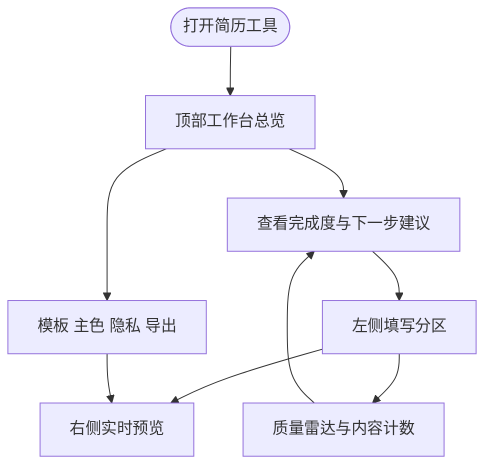

# 简历填写预览现代化

本设计用于改造 `frontend/src/features/resume/` 的简历填写与预览体验：在不改变持久化数据结构、导出链路和 AI 优化接口的前提下，把页面从「表单堆叠 + 右侧预览」升级为「引导式工作台 + 实时质量反馈 + 沉浸预览」。

## 1. 目标与边界

| 项 | 说明 |
|---|---|
| 目标 | 用更现代的工作台呈现简历填写、模板选择、导出与预览，提升引导性和视觉完成度 |
| 保持不变 | `ResumeState` 数据结构、local persistence、AI 优化 Provider、PNG/PDF 导出实现 |
| 不做 | 不新增后端接口，不接新依赖，不引入路由变更，不调整简历模板内容语义 |

---

## 2. 整体交互

---

## 3. 模块拆分

| 模块 | 职责 | 文件 |
|---|---|---|
| 页面工作台 | 组织顶部总览、工具栏、移动端编辑/预览切换、桌面双栏布局 | `frontend/src/features/resume/pages/ResumePage.tsx` |
| 编辑器引导 | 分区卡片、完成状态、字段网格与局部 AI 优化入口 | `frontend/src/features/resume/components/ResumeEditor.tsx` |
| 基础信息表单 | 头像、核心身份信息与个人优势编辑 | `frontend/src/features/resume/components/BasicsForm.tsx` |
| 列表编辑器 | 工作/项目/教育条目折叠、排序、空态和新增入口 | `frontend/src/features/resume/components/ListEditor.tsx` |
| 视觉样式 | 简历模板画布及页面级现代化辅助样式 | `frontend/src/features/resume/styles/resume-templates.css` |

---

## 4. 关键规则

| 规则 | 说明 |
|---|---|
| 引导优先 | 顶部展示完成度、内容摘要、下一步建议，降低用户不知道先填什么的问题 |
| 预览不中断 | 桌面端右侧预览保持 sticky 和可滚动；移动端用分段按钮切换编辑/预览 |
| 操作集中 | 模板、主色、目标岗位、隐私、示例、清空、导出集中在顶部工作台 |
| 视觉克制 | 使用清晰层级、低噪声背景、8px 以内卡片圆角，避免营销式空页面 |
| 导出安全 | 隐私模糊仍只作用于预览 wrapper，不影响被导出的 `resume-canvas` |

---

## 5. 验证要点

| 场景 | 验证 |
|---|---|
| 空简历 | 页面有清晰引导，不出现布局塌陷 |
| 填充示例 | 完成度、计数、预览同步更新 |
| 移动端 | 编辑和预览可切换，按钮文字不溢出 |
| 导出 | PNG/PDF 仍从预览 ref 导出 |
| 构建 | `npm run build` 通过 |
