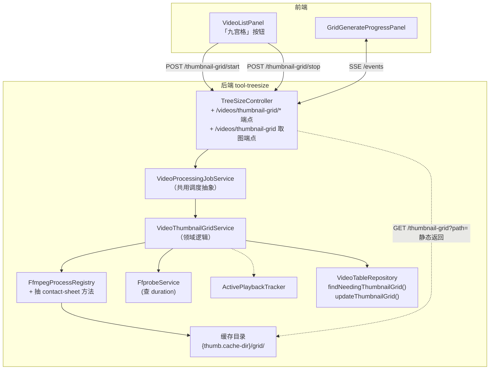
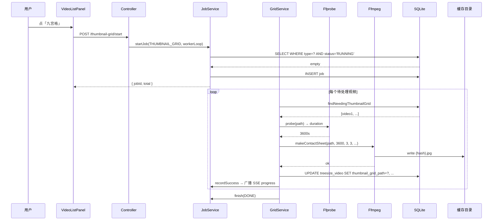
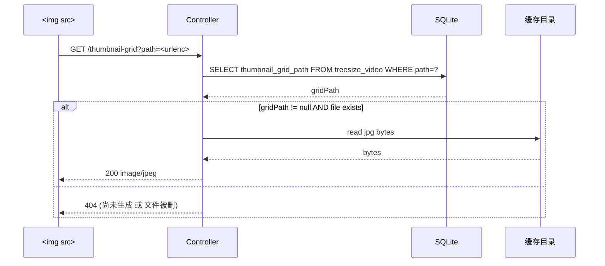

# 视频九宫格预览图（技术方案）

> 最后更新：2026-05-21
> 模版：完整-技术（template-tech.md）
> 父需求：[视频库-current.md](../视频库-current.md)
> 前置：[视频表与同步功能-current.md](../视频表与同步功能/视频表与同步功能-current.md)
> 同期姐妹模块：[视频语言识别](../视频语言识别/视频语言识别-current.md)（共用任务调度抽象）

## 1. 目标与边界

### 做什么

- 给视频生成 **3×3 九宫格预览图**（contact sheet）：从视频均匀抽 9 帧拼成一张 JPEG，作为视频内容速览
- 提供"生成九宫格"按钮：扫描 `treesize_video` 中 `thumbnail_grid_path IS NULL` 的视频，按 `size DESC` 顺序逐个生成
- 输出到磁盘缓存目录，回写 `treesize_video.thumbnail_grid_path`
- 后端串行后台任务（virtual thread），礼让用户播放，对应 `video_processing_job` 一行 type='THUMBNAIL_GRID'
- 前端 SSE 进度面板 + 停止按钮
- HTTP 端点供前端取九宫格图：`GET /api/treesize/videos/thumbnail-grid?path=...`

### 不做什么

- **不替换现有单帧 thumbnail**（项目已有 `ThumbnailService` 给列表用，仍保留）
- 不做九宫格在列表里渲染（本期只生成 + 提供下载端点；列表展示放下期）
- 不做交互式时间轴 / hover scrubbing
- 不做用户自选帧数（固定 3×3=9）
- 不做"已生成行重新生成"按钮（用户清字段再点按钮即可，本期不暴露 UI）

### 设计结论

| 决策 | 选择 | 原因 |
|------|------|------|
| 网格规格 | 3×3 = 9 帧 | 行业惯例（VLC / mpv / 影视资源站均用），信息密度合适 |
| 单帧尺寸 | 320×180（16:9） | 缩略图常用尺寸；3 张并排 960 宽，竖屏视频用 320×570 自适应 |
| 输出格式 | JPEG quality 80 | 体积小（每张 30-80KB），网络快 |
| 抽帧策略 | 时间均匀分布：`t = duration * i / 10` for i in 1..9（避开首尾纯黑） | 标准做法；首帧常为黑屏 / logo，末尾常为 staff roll |
| ffmpeg 单命令 | `-vf "select='lt(mod(t,duration/10),1)',scale=320:180:force_original_aspect_ratio=decrease,tile=3x3" -frames:v 1` | 单次 ffmpeg 完成抽 + 缩放 + 拼接；不需要存中间帧 |
| 任务并发 | 串行单线程 virtual thread | 与语言识别同模式；ffmpeg 单实例 CPU 利用率已足够 |
| 礼让 | 复用 `ActivePlaybackTracker.recentlyActive(15_000)` | 同 ThumbnailWarmer / 语言识别 |
| 输出路径 | `{toolbox.thumbnail.cache-dir}/grid/{sha256(path)}.jpg` | 复用现有 thumbnail 缓存根；hash 防特殊字符 |
| 任务跟踪 | 复用 `video_processing_job` + `VideoProcessingJobService`，type='THUMBNAIL_GRID' | 与语言识别一致 |
| 失败容错 | 单视频失败：记 `failed++`，继续；坏文件不阻断整批 | 同语言识别 |
| 致命错误 | ffmpeg 二进制不存在 / 缓存目录不可写 | 任务整体 FAILED |
| 同时只一个 | 启动时检查 RUNNING THUMBNAIL_GRID 任务，已有则 409；与语言识别**独立判定**（互不阻塞） | 两类任务共用 GPU/CPU 但负载性质不同（GPU vs CPU），允许并行 |

## 2. 整体架构



## 3. 模块拆分与职责

### 3.1 `VideoThumbnailGridService`

- `start()` → `jobService.startJob(THUMBNAIL_GRID, this::workerLoop)`
- `stop()` → `jobService.cancelJob(THUMBNAIL_GRID)`
- `workerLoop(JobContext ctx)`：
  ```
  total = videoRepo.countNeedingThumbnailGrid()
  jobService.setTotal(ctx, total)
  while (!ctx.cancelled):
      batch = videoRepo.findNeedingThumbnailGrid(50, 0)
      if empty: break
      for video in batch:
          if ctx.cancelled: break
          while playback.recentlyActive(15s): sleep(2s)
          try:
              durationS = ffprobe.probe(video.path).duration
              if durationS < 2.0:
                  recordFailure("too_short")
                  continue
              outPath = gridPathFor(video.path)
              ffmpeg.makeContactSheet(video.path, durationS, 3, 3, 320, 180, outPath)
              videoRepo.updateThumbnailGrid(video.path, outPath.toString(), now())
              jobService.recordSuccess(ctx, video.path)
          catch FatalError → finish(FAILED)
          catch e → jobService.recordFailure(ctx, video.path, e.message)
  jobService.finish(ctx, ctx.cancelled ? CANCELLED : DONE)
  ```

### 3.2 `FfmpegProcessRegistry` 拓展（不新建类，加方法）

- `makeContactSheet(Path src, double durationS, int cols, int rows, int cellW, int cellH, Path outJpg)`
- 命令构造（详见 coding.md）：
  ```
  ffmpeg -y -i <src> \
    -vf "fps=N/duration,scale=W:H:force_original_aspect_ratio=decrease,pad=W:H:(ow-iw)/2:(oh-ih)/2,tile=COLSxROWS" \
    -frames:v 1 -q:v 4 <out>
  ```
  其中 `N = cols*rows`，`duration` 取整。`fps=N/duration` 等价均匀抽 9 帧。
- 单 ffmpeg 进程完成全部 9 帧抽样 + 缩放 + padding + 拼接（不存中间文件）
- 用现有 `spawn` + timeout 120s（大文件需要 seek，可能慢）

### 3.3 `TreeSizeController` 拓展

- `POST /api/treesize/videos/thumbnail-grid/start` → `{ jobId, total }` / 409
- `POST /api/treesize/videos/thumbnail-grid/stop` → 204
- `GET  /api/treesize/videos/thumbnail-grid/status` → 当前 / 最近一次 job
- `GET  /api/treesize/videos/thumbnail-grid/events` (SSE)
- `GET  /api/treesize/videos/thumbnail-grid?path=<urlencoded>` → 返回 JPEG 二进制（`Content-Type: image/jpeg`）；查 video 表拿 `thumbnail_grid_path` 后读文件流回

### 3.4 前端

- `api.ts` 加 RPC + `thumbnailGridUrl(path)` 辅助
- 新建 `components/ThumbnailGridButton.tsx` + `ThumbnailGridProgressPanel.tsx`
- `VideoListPanel.tsx` 顶栏三按钮并列：同步 / 识别语言 / 九宫格

## 4. 关键交互

### 4.1 启动 + 单视频处理



### 4.2 取图



## 5. 核心业务规则

| 规则 | 说明 |
|------|------|
| **触发** | 用户主动点按钮；同步完成后**不**自动接续 |
| **顺序** | `ORDER BY size DESC`（partial index `idx_video_grid_null`） |
| **抽帧位置** | 时间均匀分布 9 个采样点（`t_i = duration * (i+0.5) / 9` for i in 0..8，避免首尾） |
| **过短视频** | duration < 2s → 标记 too_short 跳过 |
| **输出路径** | `{thumb.cache-dir}/grid/{sha256(absolutePath)[0:16]}.jpg`（前 16 hex 防文件名过长，碰撞概率可忽略） |
| **缓存命中** | 如果 outPath 已存在 + video 表 grid 字段为 NULL，说明之前生成过但没回填库 → 直接 UPDATE 数据库不重跑 ffmpeg |
| **取消语义** | 立即停止下一个视频；正在跑的 ffmpeg `destroyForcibly`；已生成的 jpg 保留 |
| **缓存清理** | 本期不做（thumbnail 缓存目录自带清理机制可复用） |
| **取图 404** | 文件已生成但缓存被人手动删 → 数据库表 grid_path 列没回滚 → 取图 404；用户重跑任务即可（但 partial index 看到的是 grid_path NOT NULL，需要手动 UPDATE 清字段才会重跑；本期不做自动检测） |

## 6. 编码落点

```
kai-toolbox/
├── tools/tool-treesize/src/main/java/com/exceptioncoder/toolbox/treesize/
│   ├── api/
│   │   └── TreeSizeController.java                        [改] 5 个新端点
│   ├── service/
│   │   └── VideoThumbnailGridService.java                 [新] 领域逻辑
│   ├── repository/
│   │   └── VideoTableRepository.java                      [改] 加 findNeedingThumbnailGrid / updateThumbnailGrid
│   └── config/
│       └── ThumbnailProperties.java（如已存在）            [改/新] 加 grid 子目录配置（可不加，默认派生）
├── common-media/.../FfmpegProcessRegistry.java            [改] 加 makeContactSheet 方法
└── frontend/src/features/video-library/
    ├── api.ts                                             [改] 新 RPC + thumbnailGridUrl
    ├── components/
    │   ├── ThumbnailGridButton.tsx                        [新]
    │   ├── ThumbnailGridProgressPanel.tsx                 [新]
    │   └── VideoListPanel.tsx                             [改] 顶栏加按钮
    └── pages/VideoLibraryPage.tsx                         [改] 状态线
```

## 7. 风险与待确认

### 7.1 风险

| 风险 | 缓解 |
|------|------|
| 大视频（4K，长片）抽帧慢 | 单文件 timeout 120s；超时计 failed 继续 |
| 损坏视频导致 ffmpeg hang | 进程级 timeout + destroyForcibly |
| 缓存目录磁盘爆 | 每张 ~50KB；1 万视频 ≈ 500MB，可接受。下期需要时再加 LRU 清理 |
| 用户在生成中删视频 | ffprobe 失败 / ffmpeg 抽帧失败计 failed；不阻断后续 |
| ffmpeg 命令行在 Windows 反斜杠路径下出错 | 用绝对路径 + 双引号包裹（已是 ProcessBuilder 默认行为，无需特殊处理） |
| 9 帧均匀抽样首帧黑屏 | 用 `(i+0.5)/9` 偏移半格避开首尾 |
| 同时跑语言识别 + 九宫格 | 允许并行（GPU vs CPU 不抢占）；前端两个按钮独立显示 |

### 7.2 待确认

| 项 | 待确认 |
|---|--------|
| 缓存根目录配置项 | 复用 `toolbox.thumbnail.cache-dir`，子目录硬编码 `grid/` |
| 单帧尺寸 | 320×180 决策；竖屏视频自动按宽匹配 |
| JPEG 质量 | q:v 4（FFmpeg 标度 2-31，越小越好；4 接近 q=92） |

## 8. 不在本期实现

| 项 | 推迟到 |
|---|--------|
| 列表项 hover 显示九宫格 | 下期前端展示 |
| 重新生成 UI | 下期 |
| 自动检测缓存文件被删并重跑 | 下期 |
| LRU 清理缓存 | 下期 |
| 可配置 cols × rows | 下期 |
