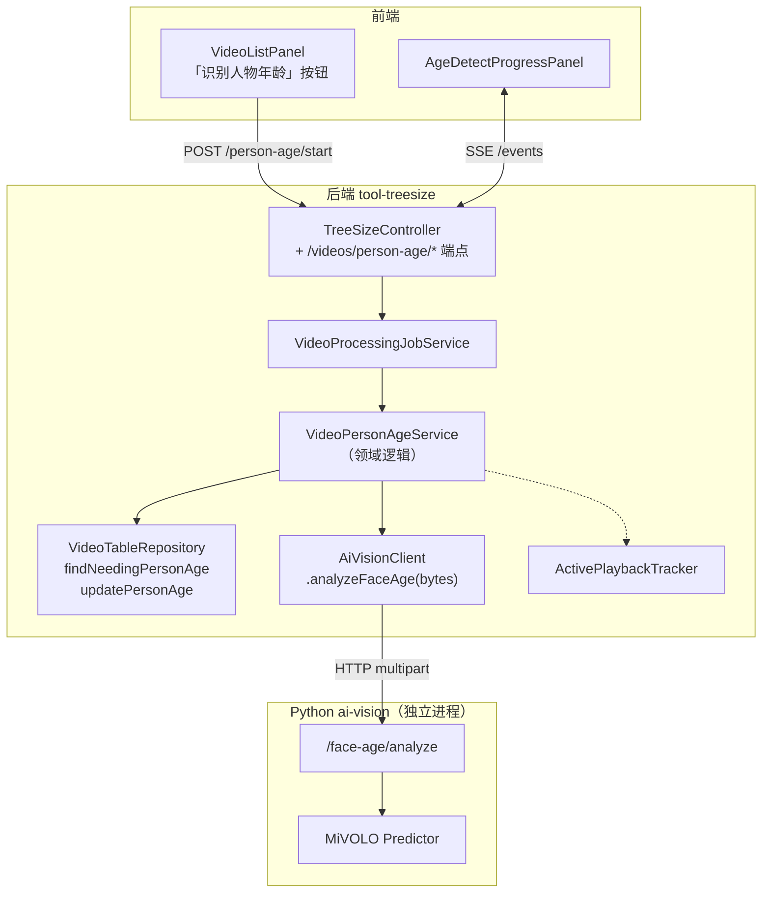
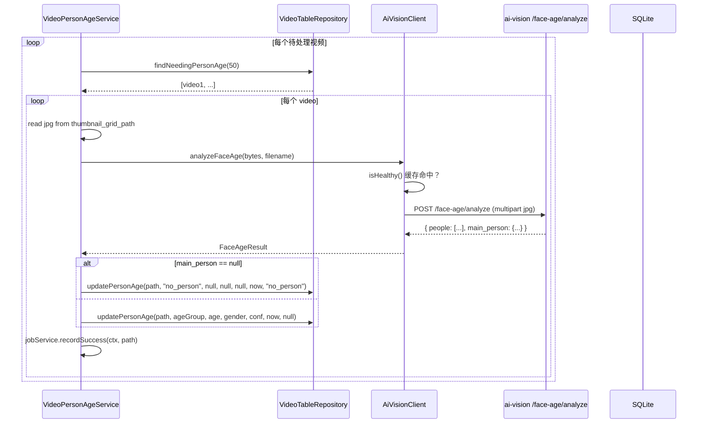
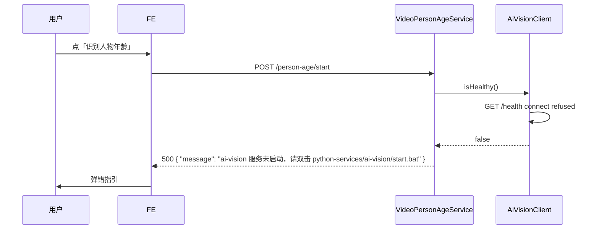

# 视频人物年龄识别（技术方案）

> 最后更新：2026-05-21
> 模版：完整-技术（template-tech.md）
> 父需求：[视频库-current.md](../视频库-current.md)
> 前置：[视频表与同步功能](../视频表与同步功能/视频表与同步功能-current.md) · [视频九宫格预览图](../视频九宫格预览图/视频九宫格预览图-current.md)（用九宫格做输入）· [Python AI 服务架构](../../Python%20AI%20服务架构/Python%20AI%20服务架构-current.md)（ai-vision 服务承载 MiVOLO）

## 1. 目标与边界

### 做什么

- 给每个视频识别主要出现人物的**年龄段 + 性别**
- 输入：已生成的九宫格图（不重新抽帧）；输出写回 `treesize_video.person_*` 系列字段
- 模型：**MiVOLO**（远景人脸 + 全身体貌综合估计），跑在 ai-vision 服务的 `/face-age/analyze` 端点
- 按钮 → 后台任务 → SSE 进度，复用现有 `VideoProcessingJobService`
- 同时只一个 `PERSON_AGE_DETECT` 任务 RUNNING；与语言识别 / 九宫格独立判定（允许并行）

### 不做什么

- **不重新抽帧** —— 九宫格未生成的视频跳过；前置要求 `thumbnail_grid_path IS NOT NULL`
- 不做精确岁数（仅年龄段 6 档）
- 不做"识别多人后分别记录"—— 视频表只存**主体人物**（最大 bbox / 出现最多）的年龄段
- 不做"针对女性"过滤 —— MiVOLO 输出本来就含性别，两者一起存
- 不做实时识别 / 摄像头流（仅离线批量）
- 不做无人物视频的标记下沉为"非真人"分类（这是同类型分析模块的事）

### 设计结论

| 决策 | 选择 | 原因 |
|------|------|------|
| 模型 | MiVOLO（face + body 综合） | 远景九宫格人脸可能 < 50px；MiVOLO 用身形姿态兜底 |
| 部署 | ai-vision 服务的 `/face-age/analyze` 端点 | 见 Python AI 服务架构 |
| 输入 | 九宫格 jpg（3×3 = 9 帧拼图） | 复用现成产物；9 帧增加识别命中率 |
| 主体选取 | **最大 bbox** 的人物 | 通常是镜头主角；最简单可靠 |
| 年龄段切分 | 6 档：infant(0-3) / child(4-12) / teen(13-19) / young_adult(20-35) / middle_age(36-55) / senior(56+) | 行业惯例 |
| 性别 | M / F / unknown（低置信度时 unknown） | MiVOLO 原生输出 |
| 顺序 | `ORDER BY size DESC`（与语言/九宫格一致） | 大文件优先 |
| 查询条件 | `WHERE thumbnail_grid_path IS NOT NULL AND person_main_age_group IS NULL` | partial index 加持 |
| 礼让 | 复用 ActivePlaybackTracker(15s) | 与同期姐妹任务一致 |
| 失败容错 | 单视频失败计 failed++，继续 | 与同期姐妹任务一致 |
| 致命错误 | ai-vision 服务不健康 → 任务 FAILED 不开跑 | 调用 AiVisionClient.isHealthy() |
| 无人物视频 | 写 `person_main_age_group='no_person'` + reason='no_person' | 明确标记，避免重跑 |

## 2. 整体架构



## 3. 模块拆分与职责

### 3.1 `VideoPersonAgeService`

- `start()` → dry-run AiVisionClient.isHealthy() + ai-vision /health 显示 face_age=loaded → 通过则 startJob
- `stop()` → cancelJob(PERSON_AGE_DETECT)
- `workerLoop(ctx)`：
  ```
  total = videoRepo.countNeedingPersonAge()
  jobService.setTotal(ctx, total)
  while !cancelled:
      batch = videoRepo.findNeedingPersonAge(50, 0)
      if empty: break
      for video in batch:
          if cancelled: break
          waitForPlaybackQuiet()
          try:
              gridBytes = Files.readAllBytes(video.thumbnailGridPath)
              FaceAgeResult r = aiVisionClient.analyzeFaceAge(gridBytes, basename)
              if r.mainPerson == null:
                  videoRepo.updatePersonAge(video.path, "no_person", null, null, null, now, "no_person")
              else:
                  videoRepo.updatePersonAge(video.path,
                      r.mainPerson.ageGroup,
                      r.mainPerson.age,
                      r.mainPerson.gender,
                      r.mainPerson.confidence,
                      now,
                      null)
              recordSuccess
          catch e: recordFailure(error_msg=summarize(e))
  finish(ctx, cancelled ? CANCELLED : DONE)
  ```

### 3.2 接口层

| Method | Path | 说明 |
|--------|------|------|
| POST | `/api/treesize/videos/person-age/start` | 启动 |
| POST | `/api/treesize/videos/person-age/stop` | 取消 |
| GET | `/api/treesize/videos/person-age/status` | 查询任务行 |
| GET | `/api/treesize/videos/person-age/events` | SSE 进度 |

### 3.3 前端

`VideoListPanel.tsx` 顶栏新增按钮"识别人物年龄"。复用语言识别 / 九宫格的 Button+ProgressPanel 模式。

## 4. 关键交互

### 4.1 单视频识别（含 ai-vision 调用）



### 4.2 ai-vision 服务未启动



## 5. 核心业务规则

| 规则 | 说明 |
|------|------|
| 触发 | 用户主动点按钮；九宫格生成完后**不**自动接续 |
| 顺序 | `WHERE thumbnail_grid_path IS NOT NULL AND person_main_age_group IS NULL ORDER BY size DESC` |
| 主体选取 | 最大 bbox 的人物；面积相同时选第一个出现的 |
| 无人物 | main_person=null → 写 `person_main_age_group='no_person'`, reason='no_person'，标记完成不重跑 |
| 低置信度 | 仍照样落库；confidence 字段供前端筛选 |
| 取消语义 | 立即停止下一个；正在 HTTP 请求中的不强杀（让 60s timeout 自然结束） |
| 失败重试 | 不重试；error_msg 落到任务表，下次启动 partial index 仍包含本行（除非已成功落库） |
| 服务健康检查 | 启动前打 isHealthy()；运行中不每张图都打（AiVisionClient 内部 60s 缓存） |

## 6. 编码落点

```
kai-toolbox/
├── tools/tool-treesize/src/main/java/com/exceptioncoder/toolbox/treesize/
│   ├── api/
│   │   └── TreeSizeController.java               [改] 4 个新端点
│   ├── service/
│   │   └── VideoPersonAgeService.java            [新]
│   ├── domain/
│   │   └── PersonAgeGroup.java                    [新] enum: NO_PERSON, INFANT, CHILD, TEEN, YOUNG_ADULT, MIDDLE_AGE, SENIOR
│   └── repository/
│       └── VideoTableRepository.java             [改] 加 findNeedingPersonAge / updatePersonAge
└── frontend/src/features/video-library/
    ├── api.ts                                    [改] 加 4 个 RPC + PersonAgeJob 类型
    ├── components/
    │   ├── PersonAgeDetectButton.tsx             [新]
    │   ├── PersonAgeDetectProgressPanel.tsx      [新]
    │   └── VideoListPanel.tsx                    [改] 顶栏加按钮
    └── pages/VideoLibraryPage.tsx                [改]
```

## 7. 风险与待确认

| 风险 | 缓解 |
|------|------|
| 九宫格 jpg 文件被删 / 移动 | 任务前 Files.isRegularFile() 校验；失败计 `failed=grid_missing`，建议用户重跑九宫格 |
| MiVOLO 对动画/真人混合场景误判 | confidence 字段透出；前端可加阈值筛选 |
| 隐私敏感 | 自用工具不联网；文档强调"勿对外分享" |
| ai-vision 进程突然崩溃 | health 缓存 60s 内会继续认为 healthy，调用失败几次后下次 health check 切 false；任务表 error_msg 累计错误 |
| 60s timeout 不够（4K 大图 + 多人） | 监控失败率；必要时调到 120s |

待确认：MiVOLO checkpoint 商用许可（自用 OK）。

## 8. 不在本期实现

| 项 | 推迟到 |
|---|--------|
| 多人物分别记录 | 下期 |
| 视频中按时间段切片分析（不同段不同人物） | 下期 |
| 列表筛选「儿童视频/成人视频」UI | 下期 |
| 重新识别按钮 | 下期 |
| 与同类型分类联动（动画/真人维度） | 下期 |
