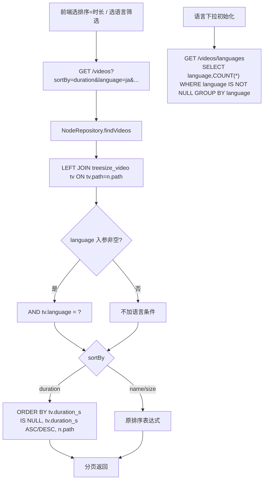

# 视频列表时长排序与语言筛选（视频库子模块）

> 最后更新：2026-06-01　模版：轻量
> 视频库列表已能展示时长/语言（来自 treesize_video），但排序只有名称/大小、筛选只有大小/收藏。
> 本次：列表支持「按时长排序」+「按语言筛选」。

## 1. 代码入口

| 层 | 落点 |
|---|---|
| 后端查询 | `NodeRepository#findVideos` / `#countVideos`：加 `LEFT JOIN treesize_video tv ON tv.path = n.path`；排序表达式支持 `duration`；新增可选 `language` 过滤 |
| 后端排序白名单 | `nameOrSizeOrderExpr`（更名/扩展）：`size→n.size`、`duration→tv.duration_s`、默认 `name` |
| 后端语言清单 | `VideoProcessingController` 或 `TreeSizeController` 新增 `GET /videos/languages` → 去重语言 + 计数 |
| 前端 API | `api.ts#getVideoLibrary` 加 `language` 入参；新增 `getVideoLanguages()` |
| 前端状态 | `VideoLibraryPage`：`language` 状态 + 持久化（同 sortBy/sizeBucket），并入 queryKey |
| 前端 UI | `VideoListPanel`：排序下拉加「时长 短→长 / 长→短」；新增语言筛选下拉（含「全部语言」） |

## 2. 接口契约

**列表（扩展现有）** `GET /api/treesize/videos`
- 新增可选入参 `sortBy=duration`（与现有 name/size 并列）
- 新增可选入参 `language=<iso>`（缺省/空 = 不按语言过滤）
- 出参 `VideoLibraryItem` 不变（已含 duration/language 字段；如未含则本次补 `durationS` / `language` 两个只读字段供展示与排序回显）

**语言清单（新增）** `GET /api/treesize/videos/languages`
- 出参：`[{ language: string, count: number }]`，仅 `treesize_video.language IS NOT NULL` 的去重项，按 count DESC。哨兵/失败标记不返回（language 为 NULL 不计）。

## 3. 核心流程

## 4. 关键规则

- **JOIN 用 LEFT**：未同步/未探测的视频在 treesize_video 无行，tv.* 为 NULL；不能因 JOIN 丢行。
- **时长排序 NULL 末尾**：`ORDER BY tv.duration_s IS NULL, tv.duration_s <ASC|DESC>`，未探测时长的排最后；保留 `n.path` 兜底 tiebreaker 保证分页稳定。
- **语言过滤精确匹配** `tv.language = ?`（ISO 码）；空/省略 = 不过滤。哨兵 `__ungrouped__` 是名称归类的，不会出现在 language 列，无需特判。
- **count 与 list 同条件**：`countVideos` 必须同样 JOIN + 加 language 条件，否则分页 total 与列表不一致。
- **count 缓存 key**：`buildCountKey` 必须并入 `language`，否则切语言后 total 命中旧缓存不刷新（sortBy 仍不入 key，排序不影响计数）。
- **语言清单数据源**：`treesize_video.language`（已识别的），与列表 JOIN 同源；只在「识别语言」任务跑过后才有内容。

## 5. 失败行为

- treesize_video 表为空（从没同步/识别）→ 语言下拉只有「全部语言」；按时长排序时所有行 duration 为 NULL，退化为按 path 排序，不报错。
- 传了库里不存在的 language → 列表为空（正常），不报错。
- sortBy 传非白名单值 → 落默认 name 排序（沿用现有白名单兜底，防注入）。
