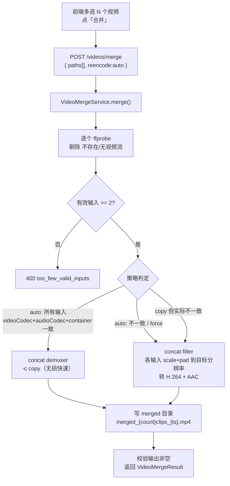

# 视频合并（视频库子模块）

> 最后更新：2026-05-31　模版：完整-技术（精简）
> 把视频列表里多选的若干视频拼接成一个输出文件。核心诉求：把一堆小视频（含 <100KB 碎片）合并成一个大视频。

## 1. 目标与边界

**做：**
- 视频库列表「多选」模式新增「合并」操作，把选中的 N 个视频按选中顺序拼成一个 mp4。
- 后端同步阻塞端点 `POST /api/treesize/videos/merge`，ffmpeg 单进程拼接，返回输出路径 + 计数。
- 两种策略：**copy**（零重编码，仅当所有输入编码/容器一致时）/ **reencode**（统一转 H.264+AAC，缩放letterbox到目标分辨率）。默认 `auto`：探测后能 copy 就 copy，否则 reencode。

**不做（本期）：**
- 不进 `VideoProcessingJobService` 任务框架（那套是「扫全表 WHERE x IS NULL」模型，合并是「对用户选定集合产出新文件」，不同构）→ 同步阻塞即可，不上 SSE。
- 不自动把输出文件回填 `treesize_video`（输出落在独立 merged 目录，用户需要再点「同步视频库」）。
- 不做转场/音量归一/章节标记；不做断点续传。
- 不改 100/50KB 过滤阈值逻辑（合并的输入由用户多选指定，绕过列表过滤）。

## 2. 核心流程



## 3. 模块拆分与职责

| 类 / 文件 | 职责 |
|---|---|
| `VideoProcessingController#mergeVideos`（新端点） | 收 `VideoMergeRequest`，委派 service，返回 `VideoMergeResult`；非法入参 → 400，ffmpeg 失败 → 500（走全局异常处理） |
| `service.VideoMergeService`（新） | 编排：ffprobe 过滤无效输入 → 策略判定 → 调 ffmpeg → 校验输出 → 组装结果。无效输入计入 `skippedCount` |
| `FfmpegProcessRegistry#concatCopy / #concatReencode`（新方法，复用现有类） | 两条 ffmpeg 命令；沿用现有 `spawn + startTailDrain + waitFor + exitValue` 失败诊断模式 |
| `dto.VideoMergeRequest`（新 record） | `{ List<String> paths, String reencode }`（reencode ∈ auto/copy/force，默认 auto） |
| `dto.VideoMergeResult`（新 record） | `{ outputPath, inputCount, mergedCount, skippedCount, outputBytes, reencoded, elapsedMs }` |
| `config.VideoMergeProperties`（新，绑定 `toolbox.video.merge.*`） | `outputDir`（默认 `${user.home}/.kai-toolbox/merged`）、`targetResolution`（默认 `1280x720`）、`targetFps`（默认 `30`）、`maxInputs`（默认 `200`）、`timeoutS`（默认 `1800`） |
| 前端 `api.ts#mergeVideos` / `VideoListPanel`（加 `onBulkMerge` + 合并按钮）/ `VideoLibraryPage`（接线 + 结果弹窗） | 复用现有多选 `selectedItems`，按列表显示顺序传 path 数组 |

## 4. 关键交互（ffmpeg 命令）

**copy（concat demuxer，无损）：** 写一份 list.txt（`file '<abs>'` 每行一个），
```
ffmpeg -y -f concat -safe 0 -i list.txt -c copy out.mp4
```

**reencode（concat filter，强统一）：** N 输入 → filter_complex 每路 `scale=W:H:force_original_aspect_ratio=decrease,pad=W:H:(ow-iw)/2:(oh-ih)/2,setsar=1,fps=FPS` 后 `concat=n=N:v=1:a=1`，编码 `libx264 + aac`（hwaccel 留空走软编，与现有 HLS 同源配置）。无音轨的输入补静音轨以保证 concat 的 a 流对齐。

## 5. 核心业务规则

- **顺序**：严格按前端传入的 `paths` 顺序拼接（= 列表显示顺序）。
- **有效性过滤**：文件不存在 / `audioCodec=="(none)"` 且无视频流 / ffprobe 失败 → 跳过并计 `skippedCount`；有效输入 < 2 → 400 拒绝（合并无意义）。
- **策略 auto**：仅当所有有效输入的 `(videoCodec, audioCodec, container)` 三元组完全一致才走 copy；否则 reencode。`force` 强制 reencode，`copy` 强制 demuxer（用户自担参数不一致风险）。
- **输出**：`{outputDir}/merged_{mergedCount}clips_{epochMillis}.mp4`，目录自动建；不覆盖已有（时间戳保证唯一）。
- **上限**：输入数 > `maxInputs` → 400；ffmpeg 进程硬超时 `timeoutS` 秒，超时 destroyForcibly + 删半成品。
- **失败原子性**：ffmpeg 非 0 退出 / 输出为空 → 删除半成品输出文件 → 抛异常转 500，不留垃圾。

## 6. 风险与待确认

| 风险 / 待确认 | 处理 |
|---|---|
| copy 模式下输入分辨率/帧率不同但编码相同 → 输出某些播放器花屏 | auto 的一致性判定只比 codec+container，**分辨率差异 copy 仍可能坏**；保守起见 auto 命中 copy 后若担心可让用户改用 force。文档已标注；后续若 ProbeResult 扩展 W/H 可收紧判定 |
| <100KB 碎片可能根本不是有效视频流 | ffprobe 过滤 + skippedCount 计数，前端弹窗展示「跳过 N 个无效输入」 |
| 大量/大体积输入 reencode 阻塞请求线程 | maxInputs + timeoutS 兜底；本期面向小碎片合并，同步阻塞可接受。若将来要合并大片，再迁到任务框架 + SSE |
| 输出目录不在扫描根内 → 不出现在视频库 | 设计即如此（解耦）；提示用户合并产物在 merged 目录，需要纳入库再「同步」 |
